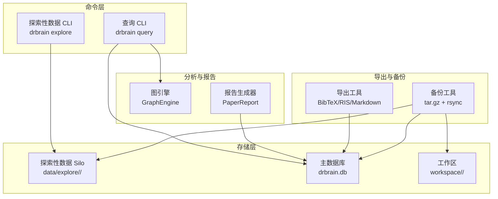
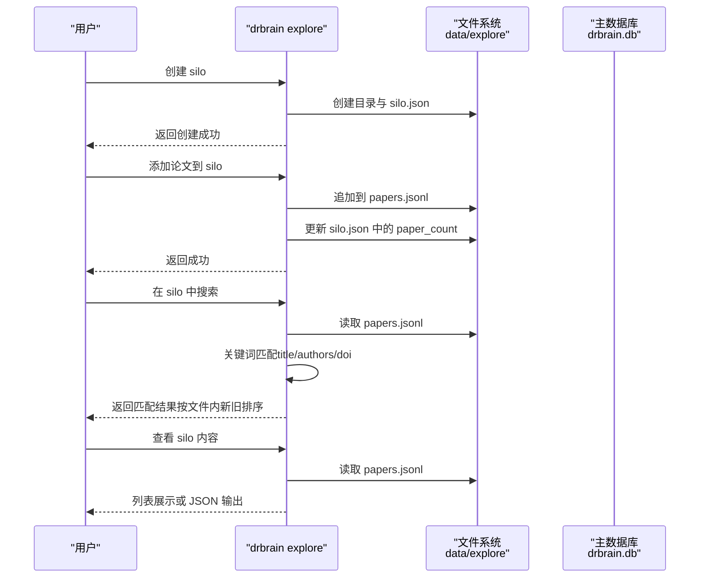
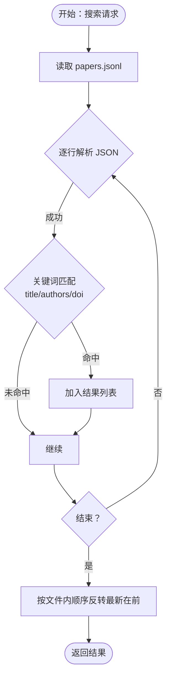
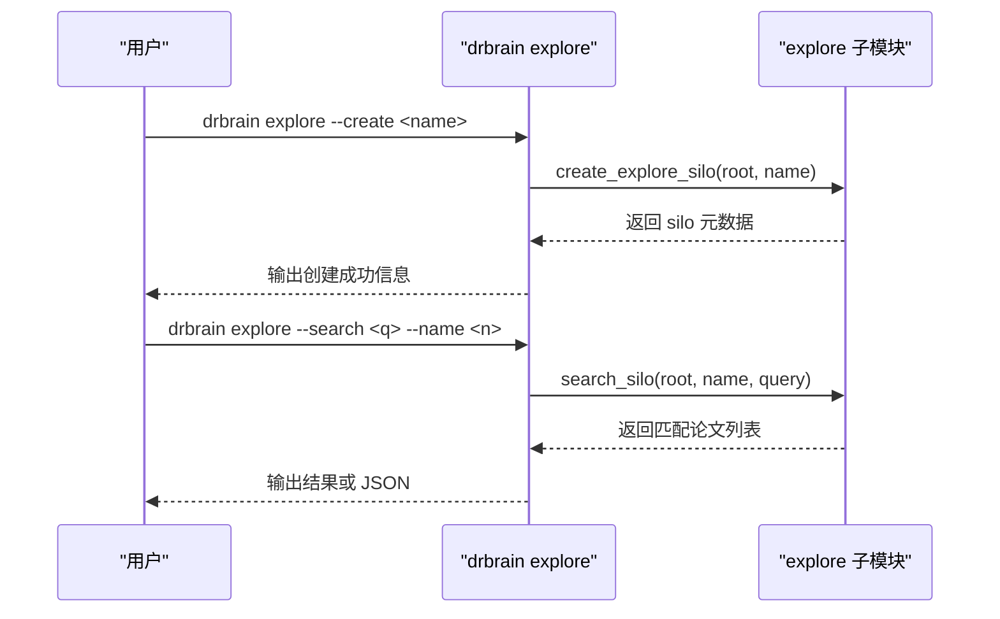
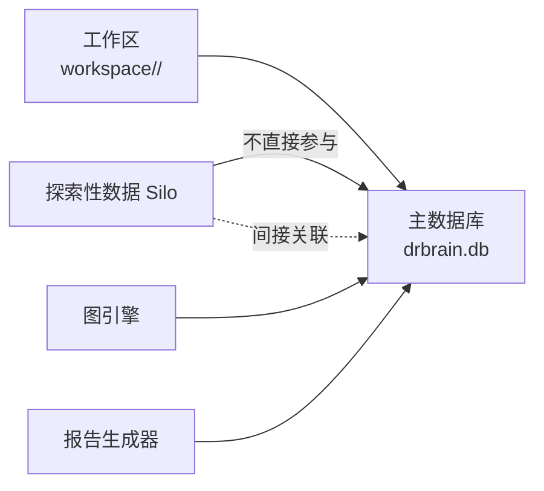
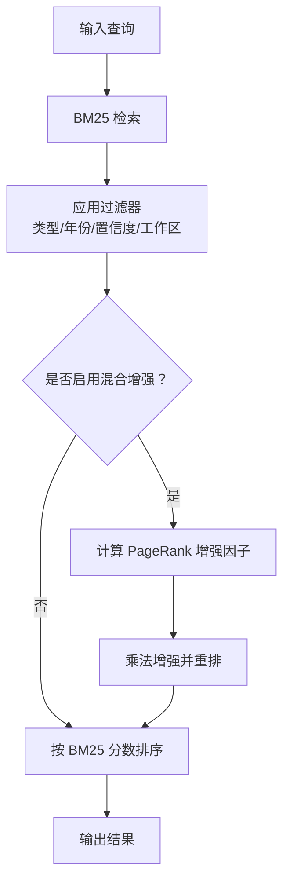
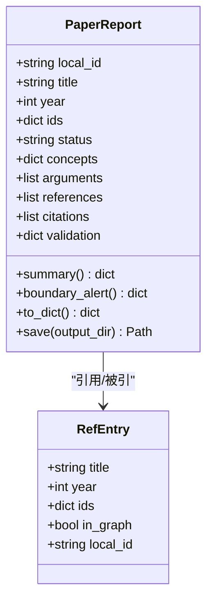
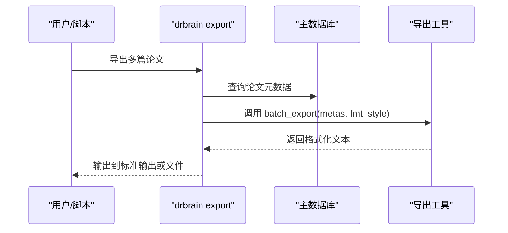
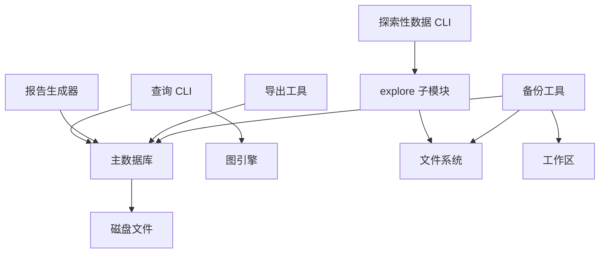

# 探索性数据

<cite>
**本文档引用的文件**
- [explore.py](file://src/drbrain/storage/explore.py)
- [explore 技能说明](file://skills/explore/SKILL.md)
- [探索性数据 CLI 命令](file://src/drbrain/cli/ingest_commands.py)
- [数据库模型](file://src/drbrain/storage/database.py)
- [工作区管理](file://src/drbrain/storage/workspace.py)
- [报告生成器](file://src/drbrain/report/generator.py)
- [导出工具](file://src/drbrain/storage/export.py)
- [备份工具](file://src/drbrain/storage/backup.py)
- [图引擎](file://src/drbrain/graph/engine.py)
- [查询命令](file://src/drbrain/cli/query_commands.py)
- [嵌入服务](file://src/drbrain/services/embedding.py)
- [树检索](file://src/drbrain/query/tree_retrieval.py)
- [配置示例](file://config.example.yaml)
- [配置说明](file://docs/configuration.md)
- [CLI 参考](file://docs/cli-reference.md)
- [术语表](file://docs/glossary.md)
</cite>

## 目录
1. [简介](#简介)
2. [项目结构](#项目结构)
3. [核心组件](#核心组件)
4. [架构总览](#架构总览)
5. [详细组件分析](#详细组件分析)
6. [依赖关系分析](#依赖关系分析)
7. [性能考量](#性能考量)
8. [故障排查指南](#故障排查指南)
9. [结论](#结论)
10. [附录](#附录)

## 简介
本文件系统化阐述 DrBrain 的探索性数据管理系统，聚焦以下目标：
- 定义探索性数据：独立于主库的轻量级文献发现集合，用于主题探索与阅读清单构建。
- 存储策略与管理机制：以目录为单位的 silo 结构，JSONL 记录与元数据文件分离，支持增删查改与搜索。
- 生命周期、状态管理与版本控制：通过元数据中的时间戳与计数字段实现简单版本化；结合工作区与主库进行关联。
- 查询接口、过滤与排序：CLI 提供列表、创建、删除、展示与关键词搜索；搜索基于字段匹配并按文件内新旧顺序返回。
- 可视化支持、统计分析与报告：通过图引擎进行概念演进分析与研究种子检测；报告生成器输出单篇报告摘要。
- 操作 API、批量处理与性能优化：CLI 命令与内部函数配合，支持批量导出与备份；嵌入服务与树检索提升检索效率。
- 与主数据集的关系：探索性数据与主库（papers/concepts/edges）解耦，但可通过工作区与报告生成器进行关联分析。

## 项目结构
探索性数据相关的核心位置与职责：
- 存储层
  - 探索性数据 silo：位于 data/explore/<silo>/，包含 silo.json（元数据）与 papers.jsonl（论文记录）。
  - 主数据库：drbrain.db（papers、concepts、edges 等表），用于主库与图分析。
  - 工作区：workspace/<name>/refs/papers.json（论文 ID 列表）。
- 命令层
  - CLI 探索命令：drbrain explore 支持 list/create/delete/show/search/json 输出。
  - 查询命令：drbrain query 支持 BM25 检索与图遍历扩展。
- 分析与报告
  - 图引擎：研究种子检测、规则闭包、实体相似度等。
  - 报告生成器：单篇报告汇总（引用覆盖率、验证标记等）。
- 导出与备份
  - 导出：BibTeX/RIS/Markdown 格式。
  - 备份：本地 tar.gz 与远程 rsync。

**图表来源**
- [explore.py:1-203](file://src/drbrain/storage/explore.py#L1-L203)
- [探索性数据 CLI 命令:835-935](file://src/drbrain/cli/ingest_commands.py#L835-L935)
- [数据库模型:1-775](file://src/drbrain/storage/database.py#L1-L775)
- [工作区管理:1-212](file://src/drbrain/storage/workspace.py#L1-L212)
- [图引擎:1-800](file://src/drbrain/graph/engine.py#L1-L800)
- [报告生成器:1-110](file://src/drbrain/report/generator.py#L1-L110)
- [导出工具:1-180](file://src/drbrain/storage/export.py#L1-L180)
- [备份工具:1-240](file://src/drbrain/storage/backup.py#L1-L240)

**章节来源**
- [explore.py:1-203](file://src/drbrain/storage/explore.py#L1-L203)
- [探索性数据 CLI 命令:835-935](file://src/drbrain/cli/ingest_commands.py#L835-L935)
- [数据库模型:1-775](file://src/drbrain/storage/database.py#L1-L775)
- [工作区管理:1-212](file://src/drbrain/storage/workspace.py#L1-L212)
- [图引擎:1-800](file://src/drbrain/graph/engine.py#L1-L800)
- [报告生成器:1-110](file://src/drbrain/report/generator.py#L1-L110)
- [导出工具:1-180](file://src/drbrain/storage/export.py#L1-L180)
- [备份工具:1-240](file://src/drbrain/storage/backup.py#L1-L240)

## 核心组件
- 探索性数据存储与管理
  - silo 创建、删除、列出、添加论文、读取全部论文、关键词搜索。
  - 元数据包含名称、描述、创建时间、论文数量。
- CLI 探索命令
  - 支持 --list/--create/--delete/--name/--search/--show/--json。
  - 默认列出所有 silos 并显示论文数量与描述。
- 数据库与图分析
  - 主库提供 papers/concepts/edges 等表，支撑查询、统计与图分析。
  - 图引擎提供规则闭包、研究种子检测、TransE 嵌入学习等能力。
- 报告与导出
  - 单篇报告包含引用/被引覆盖统计、边界警告、验证标记。
  - 批量导出支持 BibTeX/RIS/Markdown 格式。
- 备份与恢复
  - 本地 tar.gz 备份与远程 rsync 同步，支持目标配置与干运行。

**章节来源**
- [explore.py:49-203](file://src/drbrain/storage/explore.py#L49-L203)
- [探索性数据 CLI 命令:835-935](file://src/drbrain/cli/ingest_commands.py#L835-L935)
- [数据库模型:159-775](file://src/drbrain/storage/database.py#L159-L775)
- [图引擎:33-315](file://src/drbrain/graph/engine.py#L33-L315)
- [报告生成器:10-110](file://src/drbrain/report/generator.py#L10-L110)
- [导出工具:68-180](file://src/drbrain/storage/export.py#L68-L180)
- [备份工具:26-240](file://src/drbrain/storage/backup.py#L26-L240)

## 架构总览
探索性数据在 DrBrain 中的定位与交互：
- 独立存储：silo.json 与 papers.jsonl 分离，便于快速读写与增量更新。
- 与主库解耦：探索性数据不参与主库的构建流程，但可与主库的图分析、报告生成联动。
- 与工作区协作：通过工作区选择论文子集，结合图引擎进行研究种子检测与可视化。
- 与查询命令集成：CLI 展示 silo 内容与搜索结果，支持 JSON 输出便于自动化。

**图表来源**
- [explore.py:49-170](file://src/drbrain/storage/explore.py#L49-L170)
- [探索性数据 CLI 命令:835-935](file://src/drbrain/cli/ingest_commands.py#L835-L935)

**章节来源**
- [explore.py:49-170](file://src/drbrain/storage/explore.py#L49-L170)
- [探索性数据 CLI 命令:835-935](file://src/drbrain/cli/ingest_commands.py#L835-L935)

## 详细组件分析

### 探索性数据存储与管理（explore.py）
- 设计要点
  - 目录命名规范：字母数字与连字符/下划线/点组成，长度限制。
  - 元数据文件 silo.json：包含 name、description、created_at、paper_count。
  - 论文记录文件 papers.jsonl：每行一条论文字典，字段包含 title/authors/year/doi 等。
  - 搜索策略：大小写不敏感的关键字匹配，覆盖 title/authors/doi 字段。
  - 性能考虑：按文件末尾为最新顺序，搜索时逐行解析，适合小到中型 silo。
- 关键函数
  - create_explore_silo：创建 silo 并初始化空的 papers.jsonl。
  - add_paper_to_silo：追加论文记录并更新计数。
  - get_silo_papers：读取全部论文（忽略解析错误行）。
  - search_silo：关键词搜索并按文件内新旧排序返回。
  - list_explore_silos：枚举 data/explore 下的所有 silo。
  - delete_explore_silo：删除整个 silo 目录。

**图表来源**
- [explore.py:147-170](file://src/drbrain/storage/explore.py#L147-L170)

**章节来源**
- [explore.py:1-203](file://src/drbrain/storage/explore.py#L1-L203)

### 探索性数据 CLI 命令（ingest_commands.py）
- 功能概览
  - --list：列出所有 silos，显示名称、论文数量与描述。
  - --create：创建指定名称的 silo。
  - --delete：删除指定 silo。
  - --name：指定 silo 名称。
  - --search：在指定 silo 内执行关键词搜索。
  - --show：展示 silo 内全部论文。
  - --json：以 JSON 格式输出。
- 控制流
  - 解析选项后调用 explore 子模块对应函数。
  - 搜索与展示支持 JSON 输出，便于脚本化使用。

**图表来源**
- [探索性数据 CLI 命令:835-935](file://src/drbrain/cli/ingest_commands.py#L835-L935)
- [explore.py:49-170](file://src/drbrain/storage/explore.py#L49-L170)

**章节来源**
- [探索性数据 CLI 命令:835-935](file://src/drbrain/cli/ingest_commands.py#L835-L935)

### 与主数据集的关系与引用机制
- 关系说明
  - 探索性数据与主库完全解耦，不参与主库的构建与图分析。
  - 可通过工作区选择论文子集，结合图引擎进行研究种子检测与可视化。
  - 报告生成器可对单篇论文输出引用/被引覆盖统计，辅助评估探索性数据与主库的关联程度。
- 引用与关联
  - 主库提供 paper_ids 外部 ID 映射，便于跨系统引用。
  - 工作区 refs/papers.json 维护论文 ID 列表，便于限定分析范围。

**图表来源**
- [数据库模型:28-34](file://src/drbrain/storage/database.py#L28-L34)
- [工作区管理:47-52](file://src/drbrain/storage/workspace.py#L47-L52)
- [图引擎:760-785](file://src/drbrain/graph/engine.py#L760-L785)
- [报告生成器:21-50](file://src/drbrain/report/generator.py#L21-L50)

**章节来源**
- [数据库模型:28-34](file://src/drbrain/storage/database.py#L28-L34)
- [工作区管理:47-52](file://src/drbrain/storage/workspace.py#L47-L52)
- [图引擎:760-785](file://src/drbrain/graph/engine.py#L760-L785)
- [报告生成器:21-50](file://src/drbrain/report/generator.py#L21-L50)

### 查询接口、过滤条件与排序规则
- 探索性数据搜索
  - 关键词匹配字段：title、authors、doi（大小写不敏感）。
  - 排序规则：按文件内记录的新旧顺序（最新在文件末尾），搜索结果反转后返回。
- 主库查询与扩展
  - drbrain query 支持 BM25 检索、概念类型过滤、年份范围过滤、置信度阈值、图遍历扩展（--neighbors/-n）。
  - 可通过 --relation 与 --direction 限制遍历关系与方向。
  - 可通过 --workspace 限定在工作区范围内检索。
- 排序与增强
  - BM25 原始分数可结合图中心性（PageRank）进行混合增强，提升相关性排序。

**图表来源**
- [查询命令:283-631](file://src/drbrain/cli/query_commands.py#L283-L631)
- [图引擎:62-122](file://src/drbrain/graph/engine.py#L62-L122)

**章节来源**
- [查询命令:283-631](file://src/drbrain/cli/query_commands.py#L283-L631)
- [图引擎:62-122](file://src/drbrain/graph/engine.py#L62-L122)

### 可视化支持、统计分析与报告生成
- 概念演进与研究种子
  - 图引擎 detect_research_seeds：检测 stale_problem、unaddressed_gap、debate_zone 等模式。
  - 演进信号检测：基于年份分布与置信度变化识别 emerging/established/declining 等信号。
- 报告生成
  - PaperReport：汇总引用/被引覆盖、边界警告、验证标记，并可保存为 JSON 文件。
- 可视化建议
  - 使用图引擎的路径/邻域查询结果进行可视化（Mermaid/HTML）。
  - 结合导出工具生成参考文献格式，便于外部工具展示。

**图表来源**
- [报告生成器:10-110](file://src/drbrain/report/generator.py#L10-L110)

**章节来源**
- [图引擎:354-454](file://src/drbrain/graph/engine.py#L354-L454)
- [报告生成器:10-110](file://src/drbrain/report/generator.py#L10-L110)

### 操作 API、批量处理与性能优化
- 操作 API
  - explore 子模块提供 create/get/add/search/list/delete 等函数，供 CLI 与程序化调用。
- 批量处理
  - 导出工具 batch_export：批量生成 BibTeX/RIS/Markdown 格式。
  - 备份工具：本地 tar.gz 与远程 rsync，支持目标配置与干运行。
- 性能优化
  - 探索性数据：小规模 JSONL 逐行解析，适合增量写入与快速读取。
  - 主库检索：BM25 索引 + 图遍历增强；嵌入服务支持本地/远程模型，具备自适应批大小与缓存。
  - 树检索：RAPTOR 层级遍历与向量相似度评分，减少全量扫描。

**图表来源**
- [导出工具:170-180](file://src/drbrain/storage/export.py#L170-L180)
- [查询命令:57-74](file://src/drbrain/cli/query_commands.py#L57-L74)

**章节来源**
- [导出工具:170-180](file://src/drbrain/storage/export.py#L170-L180)
- [查询命令:57-74](file://src/drbrain/cli/query_commands.py#L57-L74)

### 清理策略、存储优化与长期保存
- 清理策略
  - 删除 silo：delete_explore_silo 会移除整个目录，注意备份后再清理。
  - 主库清理：library-maintenance 技能提供 stats、report、delete、clean 等维护能力。
- 存储优化
  - 探索性数据采用 JSONL 追加写入，避免大文件重写。
  - 主库 WAL 模式提升并发读写性能。
- 长期保存
  - 备份工具支持本地 tar.gz 与远程 rsync，可配置目标、压缩与排除规则。
  - 建议定期执行备份并在重大操作前先备份。

**章节来源**
- [explore.py:193-203](file://src/drbrain/storage/explore.py#L193-L203)
- [备份工具:26-240](file://src/drbrain/storage/backup.py#L26-L240)
- [术语表:219-226](file://docs/glossary.md#L219-L226)

## 依赖关系分析
- 组件耦合
  - explore 子模块与 CLI 命令紧密耦合，CLI 作为唯一入口。
  - 主库与查询命令、图引擎、报告生成器存在读取依赖。
  - 导出与备份工具依赖主库数据与配置。
- 外部依赖
  - 嵌入服务支持本地模型与 OpenAI 兼容 API。
  - 树检索依赖 RAPTOR 层级与向量存储。

**图表来源**
- [探索性数据 CLI 命令:835-935](file://src/drbrain/cli/ingest_commands.py#L835-L935)
- [explore.py:1-203](file://src/drbrain/storage/explore.py#L1-L203)
- [查询命令:1-738](file://src/drbrain/cli/query_commands.py#L1-L738)
- [数据库模型:1-775](file://src/drbrain/storage/database.py#L1-L775)
- [图引擎:1-800](file://src/drbrain/graph/engine.py#L1-L800)
- [报告生成器:1-110](file://src/drbrain/report/generator.py#L1-L110)
- [导出工具:1-180](file://src/drbrain/storage/export.py#L1-L180)
- [备份工具:1-240](file://src/drbrain/storage/backup.py#L1-L240)
- [工作区管理:1-212](file://src/drbrain/storage/workspace.py#L1-L212)

**章节来源**
- [探索性数据 CLI 命令:835-935](file://src/drbrain/cli/ingest_commands.py#L835-L935)
- [explore.py:1-203](file://src/drbrain/storage/explore.py#L1-L203)
- [查询命令:1-738](file://src/drbrain/cli/query_commands.py#L1-L738)
- [数据库模型:1-775](file://src/drbrain/storage/database.py#L1-L775)
- [图引擎:1-800](file://src/drbrain/graph/engine.py#L1-L800)
- [报告生成器:1-110](file://src/drbrain/report/generator.py#L1-L110)
- [导出工具:1-180](file://src/drbrain/storage/export.py#L1-L180)
- [备份工具:1-240](file://src/drbrain/storage/backup.py#L1-L240)
- [工作区管理:1-212](file://src/drbrain/storage/workspace.py#L1-L212)

## 性能考量
- 探索性数据
  - JSONL 追加写入，适合高频新增场景；搜索为线性扫描，建议控制 silo 规模或分拆。
- 主库检索
  - BM25 索引显著降低检索成本；图遍历可限制邻居深度与关系类型。
  - 混合增强（PageRank）带来额外计算开销，可根据需求开启。
- 嵌入与树检索
  - 嵌入服务支持自适应批大小与设备选择；树检索按层级剪枝，减少向量比较次数。
- 备份
  - 本地 tar.gz 快速打包；rsync 支持断点续传与压缩，适合大规模数据同步。

[本节为通用指导，无需特定文件分析]

## 故障排查指南
- 探索性数据
  - silo 不存在：检查名称与路径，确认 silo.json 是否存在。
  - 搜索无结果：确认关键词大小写不敏感匹配字段，检查 papers.jsonl 是否为空。
- 主库与查询
  - 查询无结果：检查 BM25 索引是否重建；确认过滤条件（类型/年份/置信度/工作区）是否过严。
  - 图遍历异常：检查关系类型与方向参数是否有效。
- 备份
  - rsync 失败：检查目标配置、网络连接与权限；使用 dry-run 预览差异。
- 配置
  - 嵌入服务：确认 provider、模型与密钥配置；GPU 环境下注意批大小与显存占用。

**章节来源**
- [探索性数据 CLI 命令:835-935](file://src/drbrain/cli/ingest_commands.py#L835-L935)
- [查询命令:283-631](file://src/drbrain/cli/query_commands.py#L283-L631)
- [备份工具:171-240](file://src/drbrain/storage/backup.py#L171-L240)
- [配置示例:122-144](file://config.example.yaml#L122-L144)
- [配置说明:194-284](file://docs/configuration.md#L194-L284)

## 结论
探索性数据系统以轻量、解耦为核心设计，通过 silo 目录与 JSONL 记录实现高效的内容管理与检索。结合主库的图分析与报告生成能力，既能满足主题探索与阅读清单构建，又能与整体知识体系进行关联与可视化。通过 CLI 与内部 API 的协同，系统支持从创建、搜索、导出到备份的完整工作流，并提供性能优化与故障排查指引，适用于个人研究与团队知识管理场景。

[本节为总结性内容，无需特定文件分析]

## 附录
- 相关 CLI 参考
  - explore 命令：列表、创建、删除、展示、搜索、JSON 输出。
  - query 命令：BM25 检索、图遍历扩展、混合增强、工作区限定。
- 配置要点
  - 嵌入服务 provider 与模型选择；批量大小与设备配置。
  - 备份目标配置与 rsync 参数。

**章节来源**
- [CLI 参考:358-840](file://docs/cli-reference.md#L358-L840)
- [配置示例:122-144](file://config.example.yaml#L122-L144)
- [配置说明:194-284](file://docs/configuration.md#L194-L284)