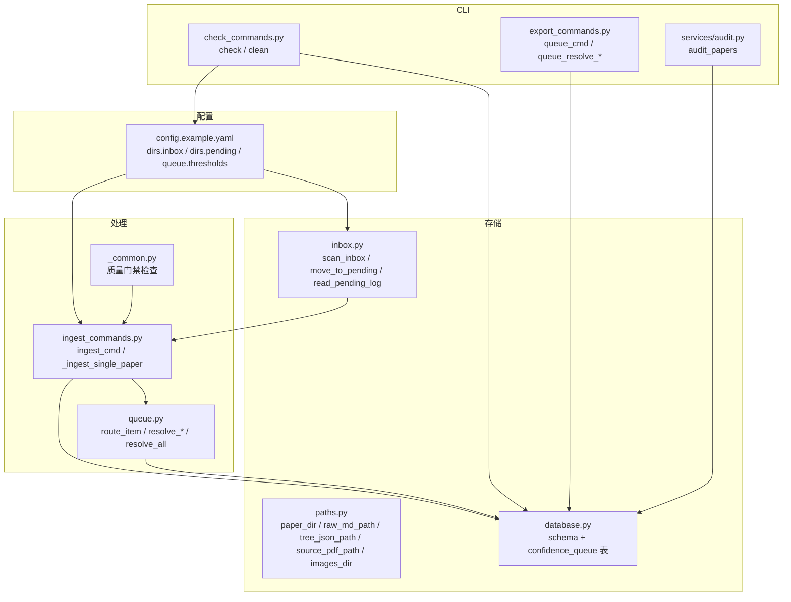
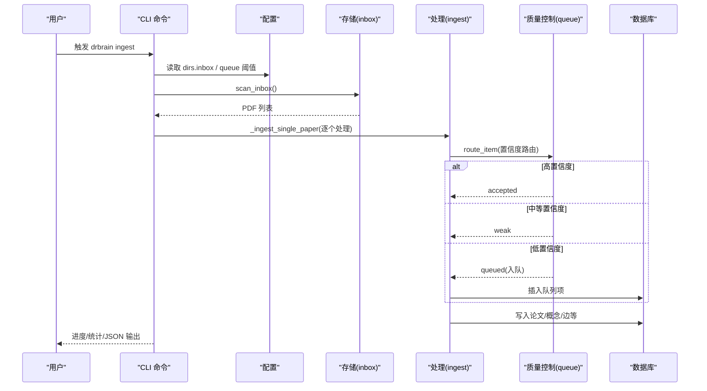
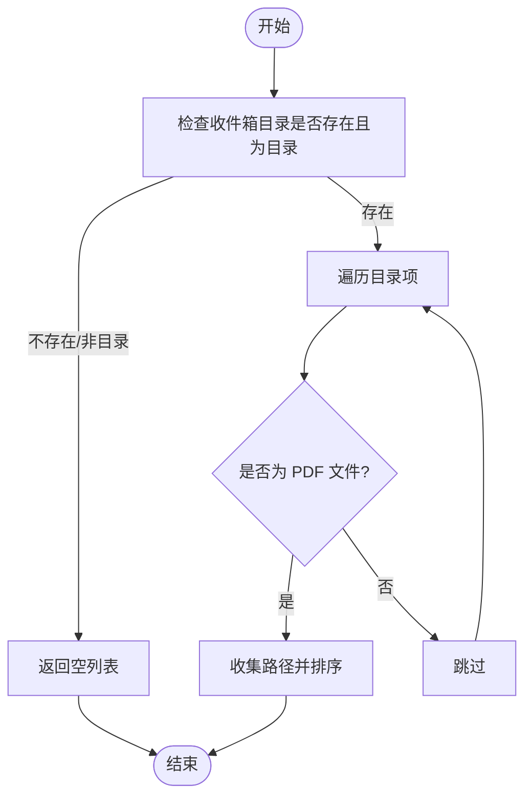
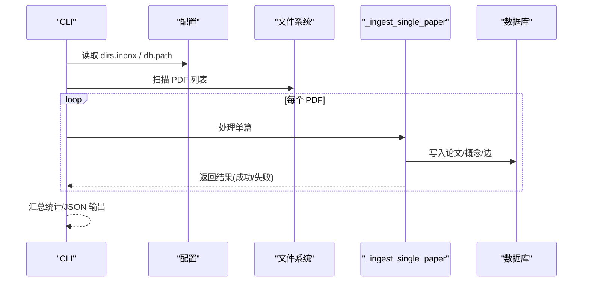
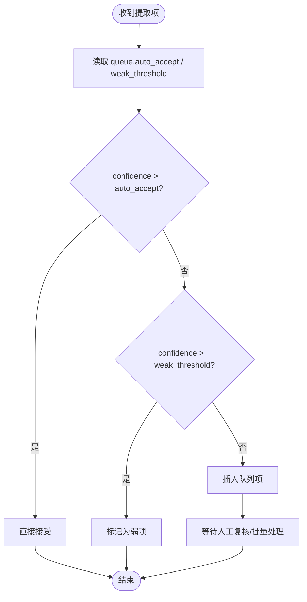
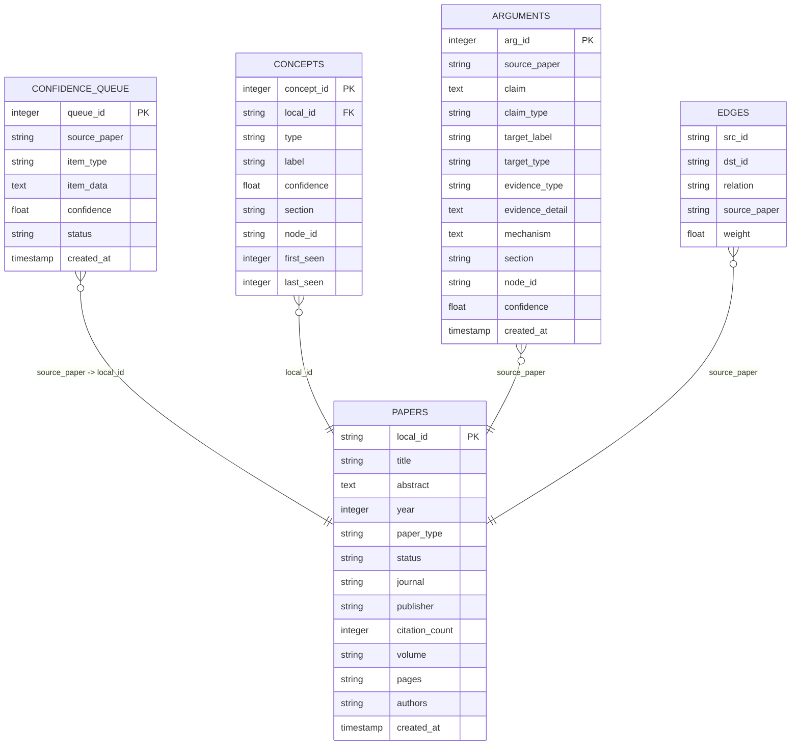
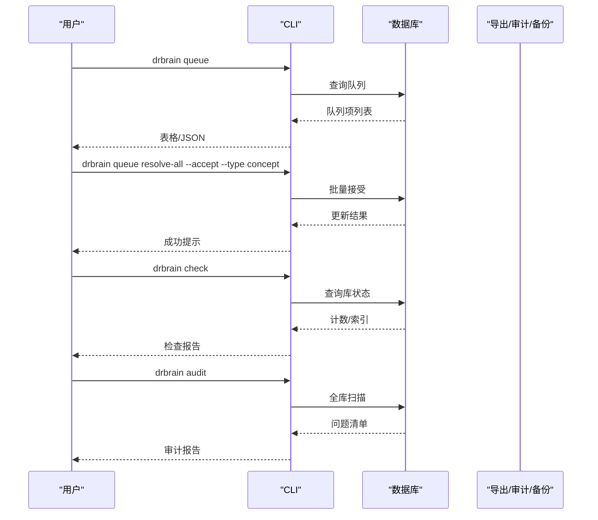
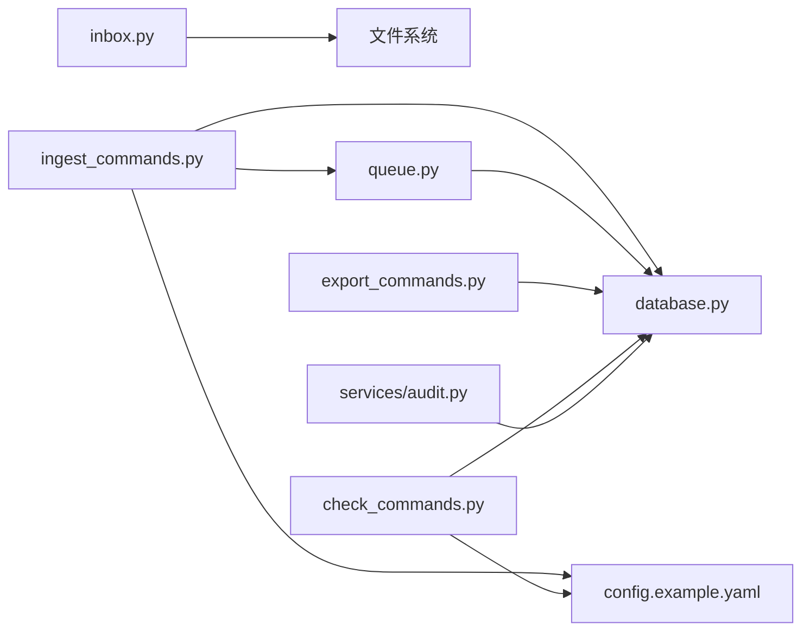

# 收件箱管理

<cite>
**本文引用的文件**
- [inbox.py](file://src/drbrain/storage/inbox.py)
- [test_inbox.py](file://tests/test_inbox.py)
- [ingest_commands.py](file://src/drbrain/cli/ingest_commands.py)
- [queue.py](file://src/drbrain/extractor/queue.py)
- [paths.py](file://src/drbrain/storage/paths.py)
- [database.py](file://src/drbrain/storage/database.py)
- [config.example.yaml](file://config.example.yaml)
- [check_commands.py](file://src/drbrain/cli/check_commands.py)
- [export_commands.py](file://src/drbrain/cli/export_commands.py)
- [audit.py](file://src/drbrain/services/audit.py)
- [_common.py](file://src/drbrain/cli/_common.py)
</cite>

## 目录
1. [简介](#简介)
2. [项目结构](#项目结构)
3. [核心组件](#核心组件)
4. [架构总览](#架构总览)
5. [详细组件分析](#详细组件分析)
6. [依赖分析](#依赖分析)
7. [性能考虑](#性能考虑)
8. [故障排查指南](#故障排查指南)
9. [结论](#结论)
10. [附录](#附录)

## 简介
本文件系统化阐述 DrBrain 的收件箱（Inbox）管理机制，覆盖以下方面：
- 收件箱工作机制：扫描、移动到待处理目录、失败原因日志记录
- 文件接收与处理流程：从收件箱到批量处理、质量门禁与错误处理
- 待处理文件队列：置信度阈值路由、人工复核与批量处理
- 配置项与过滤规则：收件箱路径、待处理日志、质量阈值
- 自动处理策略：基于置信度的自动接受与弱标记
- 文件上传接口与批量处理：CLI 命令与进度输出
- 进度监控：队列列表、批量复核、报告生成
- 与导入流程的集成：解析、去重、图构建、闭包推理
- 维护与清理：清理命令、备份、审计与性能优化

## 项目结构
围绕收件箱的关键模块与文件如下：
- 存储层：收件箱扫描与待处理日志
- 处理层：批量导入命令、单篇处理流程
- 质量控制：置信度队列、质量门禁
- 配置层：收件箱路径、待处理目录、质量阈值
- CLI 层：导入、队列查看与批量处理、清理与检查

**图表来源**
- [config.example.yaml](file://config.example.yaml)
- [inbox.py](file://src/drbrain/storage/inbox.py)
- [paths.py](file://src/drbrain/storage/paths.py)
- [database.py](file://src/drbrain/storage/database.py)
- [ingest_commands.py](file://src/drbrain/cli/ingest_commands.py)
- [queue.py](file://src/drbrain/extractor/queue.py)
- [_common.py](file://src/drbrain/cli/_common.py)
- [check_commands.py](file://src/drbrain/cli/check_commands.py)
- [export_commands.py](file://src/drbrain/cli/export_commands.py)
- [audit.py](file://src/drbrain/services/audit.py)

**章节来源**
- [config.example.yaml](file://config.example.yaml)
- [inbox.py](file://src/drbrain/storage/inbox.py)
- [ingest_commands.py](file://src/drbrain/cli/ingest_commands.py)
- [queue.py](file://src/drbrain/extractor/queue.py)
- [paths.py](file://src/drbrain/storage/paths.py)
- [database.py](file://src/drbrain/storage/database.py)
- [check_commands.py](file://src/drbrain/cli/check_commands.py)
- [export_commands.py](file://src/drbrain/cli/export_commands.py)
- [_common.py](file://src/drbrain/cli/_common.py)
- [audit.py](file://src/drbrain/services/audit.py)

## 核心组件
- 收件箱扫描与待处理管理
  - 扫描收件箱目录中的 PDF 文件
  - 将失败的 PDF 移动到“待处理”目录并记录原因
  - 读取待处理日志以进行问题诊断
- 批量导入命令
  - 默认从配置的收件箱目录扫描并批量处理
  - 单文件/多文件/目录三种输入模式
  - 输出机器可读 JSON 或人类可读进度
- 置信度队列与质量控制
  - 基于置信度阈值自动接受、弱标记或进入队列
  - 支持按类型与置信度上限批量处理队列项
  - 质量门禁：对解析产物进行大小等基础校验
- 数据库与持久化
  - SQLite 模式下维护置信度队列表与论文、概念、边等实体
- CLI 工具链
  - 检查环境与配置
  - 清理数据目录（保留收件箱）
  - 查看与批量处理队列
  - 审计与备份

**章节来源**
- [inbox.py](file://src/drbrain/storage/inbox.py)
- [ingest_commands.py](file://src/drbrain/cli/ingest_commands.py)
- [queue.py](file://src/drbrain/extractor/queue.py)
- [database.py](file://src/drbrain/storage/database.py)
- [check_commands.py](file://src/drbrain/cli/check_commands.py)
- [export_commands.py](file://src/drbrain/cli/export_commands.py)
- [_common.py](file://src/drbrain/cli/_common.py)

## 架构总览
收件箱管理贯穿“配置—存储—处理—质量—CLI”的完整链路。

**图表来源**
- [ingest_commands.py](file://src/drbrain/cli/ingest_commands.py)
- [inbox.py](file://src/drbrain/storage/inbox.py)
- [queue.py](file://src/drbrain/extractor/queue.py)
- [database.py](file://src/drbrain/storage/database.py)

## 详细组件分析

### 收件箱扫描与待处理管理
- 功能要点
  - 扫描指定目录下的 PDF 文件，返回排序后的路径列表
  - 将失败的 PDF 移动到“待处理”目录，并在同级写入 JSONL 日志，记录文件名、失败原因与时间戳
  - 读取待处理日志，便于问题定位与重试
- 关键实现路径
  - [scan_inbox](file://src/drbrain/storage/inbox.py)
  - [move_to_pending](file://src/drbrain/storage/inbox.py)
  - [read_pending_log](file://src/drbrain/storage/inbox.py)

**图表来源**
- [inbox.py](file://src/drbrain/storage/inbox.py)

**章节来源**
- [inbox.py](file://src/drbrain/storage/inbox.py)
- [test_inbox.py](file://tests/test_inbox.py)

### 批量导入与单篇处理
- 功能要点
  - 默认从配置的收件箱目录扫描并批量处理；也可直接传入文件/目录
  - 对每个 PDF 调用单篇处理流程，支持 JSON 输出与进度展示
  - 失败时将 PDF 移至待处理目录并记录原因
- 关键实现路径
  - [ingest_cmd](file://src/drbrain/cli/ingest_commands.py)
  - [_ingest_single_paper](file://src/drbrain/cli/_common.py)

**图表来源**
- [ingest_commands.py](file://src/drbrain/cli/ingest_commands.py)
- [_common.py](file://src/drbrain/cli/_common.py)

**章节来源**
- [ingest_commands.py](file://src/drbrain/cli/ingest_commands.py)
- [_common.py](file://src/drbrain/cli/_common.py)

### 置信度队列与质量控制
- 功能要点
  - route_item：根据置信度阈值决定“直接接受/弱标记/入队”
  - resolve_accept/resolve_reject/resolve_all：单个/批量处理队列项
  - check_consensus：基于标签与平均置信度判断共识，触发自动接受
  - 质量门禁：对解析产物（如 raw.md）进行大小等基础校验
- 关键实现路径
  - [route_item](file://src/drbrain/extractor/queue.py)
  - [resolve_accept](file://src/drbrain/extractor/queue.py)
  - [resolve_reject](file://src/drbrain/extractor/queue.py)
  - [resolve_all](file://src/drbrain/extractor/queue.py)
  - [check_consensus](file://src/drbrain/extractor/queue.py)
  - [质量门禁检查](file://src/drbrain/cli/_common.py)

**图表来源**
- [queue.py](file://src/drbrain/extractor/queue.py)

**章节来源**
- [queue.py](file://src/drbrain/extractor/queue.py)
- [_common.py](file://src/drbrain/cli/_common.py)

### 数据模型与持久化
- 数据库模式关键点
  - papers、paper_ids、concepts、arguments、edges、aliases、embeddings、tree_vectors、tree_summaries、vector_metadata、confidence_queue、research_seeds、citation_cache、build_stages、schema_versions
  - confidence_queue：队列项的主键、来源论文、类型、数据、置信度、状态与创建时间
- 关键实现路径
  - [数据库初始化与迁移](file://src/drbrain/storage/database.py)

**图表来源**
- [database.py](file://src/drbrain/storage/database.py)

**章节来源**
- [database.py](file://src/drbrain/storage/database.py)

### CLI 命令与工作流
- 导入命令
  - [ingest_cmd](file://src/drbrain/cli/ingest_commands.py)：默认扫描收件箱目录，批量处理 PDF
- 队列管理
  - [queue_cmd](file://src/drbrain/cli/export_commands.py)：列出待处理队列
  - [queue_resolve_cmd](file://src/drbrain/cli/export_commands.py)：单个接受/拒绝
  - [queue_resolve_all_cmd](file://src/drbrain/cli/export_commands.py)：按类型与置信度上限批量处理
- 系统检查与清理
  - [check_cmd](file://src/drbrain/cli/check_commands.py)：检查依赖、配置、目录、数据库、磁盘空间、API 可达性
  - [clean_cmd](file://src/drbrain/cli/check_commands.py)：清理数据目录（保留收件箱）
- 审计与备份
  - [audit_papers](file://src/drbrain/services/audit.py)：全库质量审计
  - [backup_cmd](file://src/drbrain/cli/export_commands.py)：本地打包或 rsync 备份

**图表来源**
- [export_commands.py](file://src/drbrain/cli/export_commands.py)
- [check_commands.py](file://src/drbrain/cli/check_commands.py)
- [audit.py](file://src/drbrain/services/audit.py)

**章节来源**
- [export_commands.py](file://src/drbrain/cli/export_commands.py)
- [check_commands.py](file://src/drbrain/cli/check_commands.py)
- [audit.py](file://src/drbrain/services/audit.py)

## 依赖分析
- 组件耦合
  - 收件箱扫描仅依赖文件系统与配置
  - 批量导入依赖数据库、去重引擎、图引擎与解析器
  - 置信度队列依赖数据库的队列表
  - CLI 命令依赖配置与数据库
- 外部依赖
  - LLM 提供商、MinerU 解析器、外部 API（OpenAlex、CrossRef、Semantic Scholar）
  - 环境变量与外部工具（如 mineru-open-api）

**图表来源**
- [inbox.py](file://src/drbrain/storage/inbox.py)
- [ingest_commands.py](file://src/drbrain/cli/ingest_commands.py)
- [queue.py](file://src/drbrain/extractor/queue.py)
- [database.py](file://src/drbrain/storage/database.py)
- [config.example.yaml](file://config.example.yaml)
- [export_commands.py](file://src/drbrain/cli/export_commands.py)
- [check_commands.py](file://src/drbrain/cli/check_commands.py)
- [audit.py](file://src/drbrain/services/audit.py)

**章节来源**
- [inbox.py](file://src/drbrain/storage/inbox.py)
- [ingest_commands.py](file://src/drbrain/cli/ingest_commands.py)
- [queue.py](file://src/drbrain/extractor/queue.py)
- [database.py](file://src/drbrain/storage/database.py)
- [config.example.yaml](file://config.example.yaml)
- [export_commands.py](file://src/drbrain/cli/export_commands.py)
- [check_commands.py](file://src/drbrain/cli/check_commands.py)
- [audit.py](file://src/drbrain/services/audit.py)

## 性能考虑
- 扫描与 I/O
  - 收件箱扫描为线性遍历，建议将收件箱目录置于高性能存储
  - 批量导入时按顺序处理，可通过并发控制与资源限制避免解析器与 LLM 的资源争用
- 数据库
  - 使用 WAL 模式提升并发写入性能
  - 合理设置索引（已内置），避免大查询时的全表扫描
- 解析与 LLM
  - 控制并发数量（配置项中存在并发相关参数），避免超卖带宽与令牌配额
  - 使用缓存与增量处理减少重复工作
- 队列处理
  - 批量处理队列时按类型与置信度上限筛选，降低数据库压力

[本节为通用指导，不直接分析具体文件]

## 故障排查指南
- 收件箱扫描为空
  - 检查配置中的收件箱路径是否存在且为目录
  - 确认文件后缀为 PDF
  - 参考测试用例断言行为
- 处理失败进入待处理
  - 查看待处理目录中的 JSONL 日志，定位失败原因
  - 将失败文件移回收件箱后重试
- 队列堆积
  - 使用队列命令查看待处理项，按类型与置信度上限批量处理
  - 对共识标签自动接受的项，系统会批量提升
- 数据库异常
  - 使用检查命令确认数据库文件存在与可访问
  - 如需重置，使用清理命令清理数据目录（保留收件箱）
- 审计与修复
  - 使用审计服务扫描全库，修复发现的问题
  - 使用修复服务对元数据进行规范化与补全

**章节来源**
- [test_inbox.py](file://tests/test_inbox.py)
- [export_commands.py](file://src/drbrain/cli/export_commands.py)
- [check_commands.py](file://src/drbrain/cli/check_commands.py)
- [audit.py](file://src/drbrain/services/audit.py)

## 结论
收件箱管理通过“扫描—批量处理—质量控制—队列—CLI 工具链”的闭环，实现了从文件接收、解析、入库到质量保障与运维维护的全流程自动化。结合配置化的阈值与目录策略，用户可以灵活地定制处理策略，并借助 CLI 与审计工具持续优化知识库质量与运行效率。

[本节为总结性内容，不直接分析具体文件]

## 附录

### 收件箱配置项与过滤规则
- 配置项
  - dirs.inbox：收件箱目录（默认 data/spool/inbox）
  - dirs.pending：待处理目录（默认 data/spool/pending）
  - queue.auto_accept：自动接受阈值（默认 0.9）
  - queue.weak_threshold：弱标记阈值（默认 0.7）
- 过滤规则
  - 仅处理 PDF 文件
  - 失败时移动到待处理目录并记录原因

**章节来源**
- [config.example.yaml](file://config.example.yaml)
- [inbox.py](file://src/drbrain/storage/inbox.py)
- [queue.py](file://src/drbrain/extractor/queue.py)

### 文件上传接口与批量处理
- CLI 命令
  - drbrain ingest：默认扫描收件箱目录批量处理；支持 JSON 输出与进度展示
  - drbrain queue：查看待处理队列
  - drbrain queue resolve-one：接受/拒绝单个队列项
  - drbrain queue resolve-all：按类型与置信度上限批量处理
- 进度监控
  - 批量处理时显示当前处理进度与统计
  - 队列命令支持表格与 JSON 输出

**章节来源**
- [ingest_commands.py](file://src/drbrain/cli/ingest_commands.py)
- [export_commands.py](file://src/drbrain/cli/export_commands.py)

### 与导入流程的集成关系
- 解析与入库
  - 单篇处理完成后写入论文、概念、边等实体
- 去重与图构建
  - 去重引擎与图引擎参与后续步骤
- 闭包推理
  - 基于规则与嵌入的闭包推理扩展知识图谱

**章节来源**
- [_common.py](file://src/drbrain/cli/_common.py)
- [ingest_commands.py](file://src/drbrain/cli/ingest_commands.py)

### 维护操作、清理策略与性能调优
- 维护
  - drbrain check：检查依赖、配置、目录、数据库、磁盘空间、API 可达性
  - drbrain audit：全库质量审计
  - drbrain backup：本地打包或 rsync 备份
- 清理策略
  - drbrain clean：清理数据库、缓存、日志、报告与论文目录（保留收件箱）
- 性能调优建议
  - 合理设置并发与阈值
  - 使用 WAL 模式与索引
  - 分批处理与增量更新

**章节来源**
- [check_commands.py](file://src/drbrain/cli/check_commands.py)
- [export_commands.py](file://src/drbrain/cli/export_commands.py)
- [audit.py](file://src/drbrain/services/audit.py)
- [database.py](file://src/drbrain/storage/database.py)