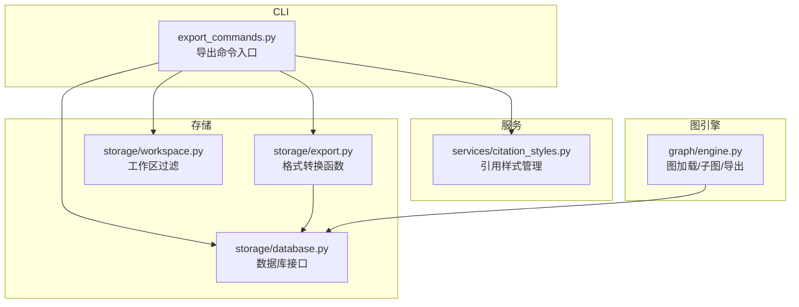
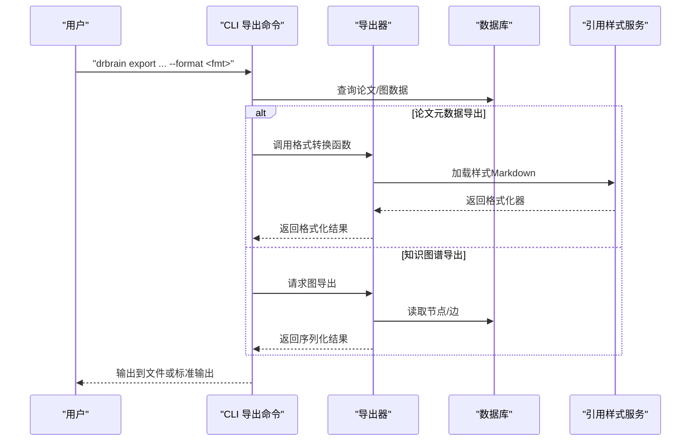
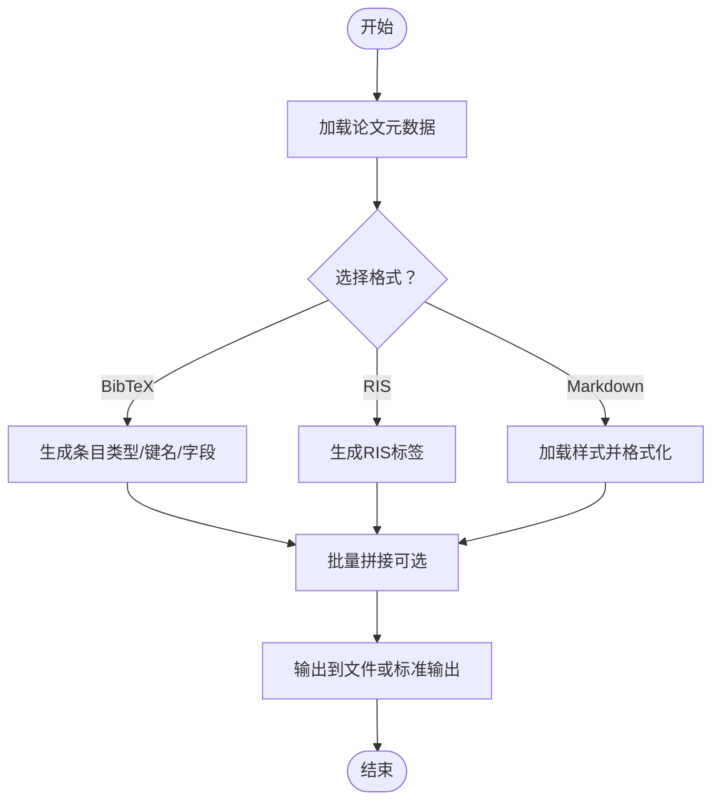
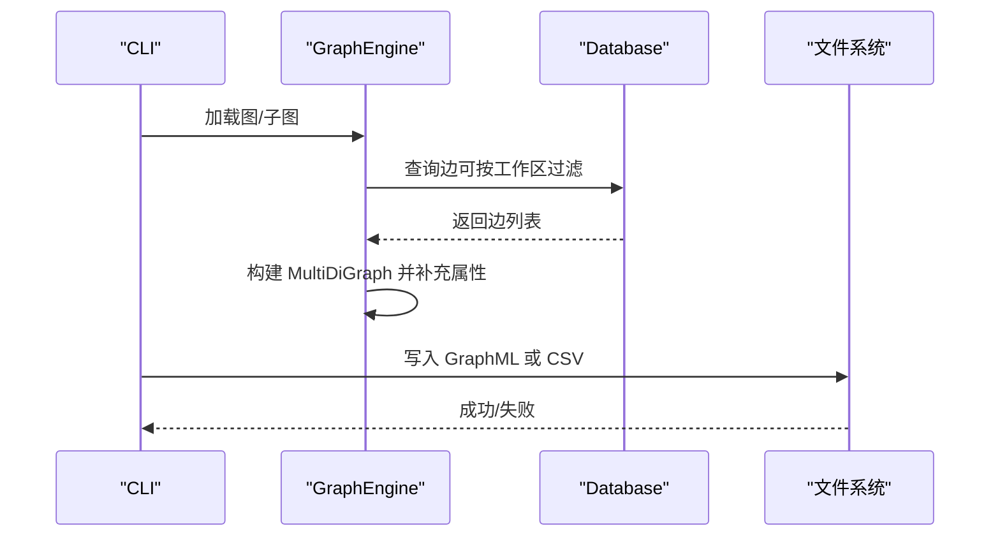
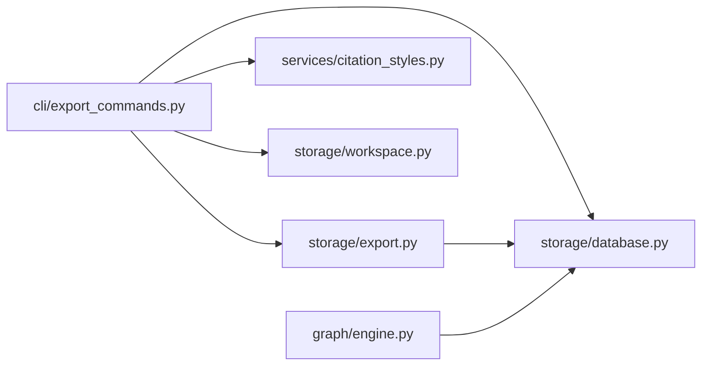

# 数据导出

<cite>
**本文引用的文件**
- [export.py](file://src/drbrain/storage/export.py)
- [export_commands.py](file://src/drbrain/cli/export_commands.py)
- [citation_styles.py](file://src/drbrain/services/citation_styles.py)
- [database.py](file://src/drbrain/storage/database.py)
- [engine.py](file://src/drbrain/graph/engine.py)
- [workspace.py](file://src/drbrain/storage/workspace.py)
- [SKILL.md](file://skills/export/SKILL.md)
- [test_export.py](file://tests/test_export.py)
- [kg-export-formats.md](file://.trellis/tasks/archive/2026-05/05-09-knowledge-cartography/research/kg-export-formats.md)
- [prd.md](file://.trellis/tasks/archive/2026-05/05-09-knowledge-cartography/prd.md)
</cite>

## 目录
1. [简介](#简介)
2. [项目结构](#项目结构)
3. [核心组件](#核心组件)
4. [架构总览](#架构总览)
5. [详细组件分析](#详细组件分析)
6. [依赖分析](#依赖分析)
7. [性能考虑](#性能考虑)
8. [故障排查指南](#故障排查指南)
9. [结论](#结论)
10. [附录](#附录)

## 简介
本文件面向 DrBrain 的数据导出系统，提供从设计到实现的完整技术文档。重点覆盖：
- 导出格式支持：JSON、CSV、XML、RDF 的现状与扩展路径
- 数据转换与序列化机制：论文元数据到参考文献格式、知识图谱节点边表的导出
- 导出数据结构、字段映射与元数据处理
- 批量导出、增量导出与筛选导出能力
- 导出配置选项、自定义模板与格式化规则
- 性能优化、内存管理与大文件处理策略
- 数据验证、完整性检查与错误恢复机制

当前已实现：
- 论文元数据导出：BibTeX、RIS、Markdown（含样式定制）
- 知识图谱导出：GraphML、CSV（节点/边表），支持工作区范围筛选

## 项目结构
导出相关代码主要分布在以下模块：
- 存储层：导出格式转换函数、数据库访问
- CLI 层：导出命令入口、参数解析与输出控制
- 服务层：引用样式管理（Markdown）
- 图引擎：图结构加载、子图构建与导出
- 工作区：按工作区过滤导出范围

图表来源
- [export_commands.py:21-78](file://src/drbrain/cli/export_commands.py#L21-L78)
- [export.py:68-179](file://src/drbrain/storage/export.py#L68-L179)
- [database.py:159-200](file://src/drbrain/storage/database.py#L159-L200)
- [workspace.py:22-52](file://src/drbrain/storage/workspace.py#L22-L52)
- [citation_styles.py:367-389](file://src/drbrain/services/citation_styles.py#L367-L389)
- [engine.py:760-785](file://src/drbrain/graph/engine.py#L760-L785)

章节来源
- [export_commands.py:21-78](file://src/drbrain/cli/export_commands.py#L21-L78)
- [export.py:68-179](file://src/drbrain/storage/export.py#L68-L179)
- [database.py:159-200](file://src/drbrain/storage/database.py#L159-L200)
- [workspace.py:22-52](file://src/drbrain/storage/workspace.py#L22-L52)
- [citation_styles.py:367-389](file://src/drbrain/services/citation_styles.py#L367-L389)
- [engine.py:760-785](file://src/drbrain/graph/engine.py#L760-L785)

## 核心组件
- 论文元数据导出器：提供 BibTeX、RIS、Markdown 三种格式的转换函数，并支持批量导出
- 引用样式服务：内置多种样式（APA、Vancouver、Chicago、MLA），支持自定义样式文件
- CLI 导出命令：统一入口，支持单篇、全库、工作区范围导出；可输出到文件或标准输出
- 数据库接口：提供论文、概念、边等查询与过滤能力
- 图引擎：从数据库加载图，支持子图增量闭包与导出
- 工作区：提供按工作区名称过滤论文集合的能力

章节来源
- [export.py:68-179](file://src/drbrain/storage/export.py#L68-L179)
- [citation_styles.py:214-226](file://src/drbrain/services/citation_styles.py#L214-L226)
- [export_commands.py:21-78](file://src/drbrain/cli/export_commands.py#L21-L78)
- [database.py:159-200](file://src/drbrain/storage/database.py#L159-L200)
- [engine.py:760-785](file://src/drbrain/graph/engine.py#L760-L785)
- [workspace.py:22-52](file://src/drbrain/storage/workspace.py#L22-L52)

## 架构总览
下图展示导出流程的关键交互：CLI 解析参数后调用导出器，导出器通过数据库读取元数据或图数据，再进行格式化输出。

图表来源
- [export_commands.py:21-78](file://src/drbrain/cli/export_commands.py#L21-L78)
- [export.py:68-179](file://src/drbrain/storage/export.py#L68-L179)
- [citation_styles.py:268-325](file://src/drbrain/services/citation_styles.py#L268-L325)
- [database.py:159-200](file://src/drbrain/storage/database.py#L159-L200)

## 详细组件分析

### 组件A：论文元数据导出（BibTeX、RIS、Markdown）
- 功能概述
  - BibTeX：根据论文类型映射条目类型，生成键名、标题、作者、期刊、卷期页码、DOI、arXiv 等字段
  - RIS：按 RIS 标准标签输出，支持类型映射与分页拆分
  - Markdown：基于内置或自定义样式生成带链接的参考列表
  - 批量导出：对多个元数据对象进行拼接输出
- 关键实现点
  - 作者姓氏提取：支持中文姓名、连字符、缩写等复杂情况
  - 引用键生成：基于首作者姓氏、年份与标题关键词
  - 字段映射：论文类型到条目类型的映射，确保符合学术规范
  - 样式定制：通过样式目录动态加载自定义样式文件，支持路径安全校验
- 适用场景
  - 文献管理工具导入（Zotero、Mendeley、Endnote）
  - LaTeX/BibTeX 编辑器集成
  - 在线写作平台的参考文献生成

图表来源
- [export.py:68-179](file://src/drbrain/storage/export.py#L68-L179)
- [citation_styles.py:268-325](file://src/drbrain/services/citation_styles.py#L268-L325)

章节来源
- [export.py:68-179](file://src/drbrain/storage/export.py#L68-L179)
- [citation_styles.py:268-325](file://src/drbrain/services/citation_styles.py#L268-L325)
- [test_export.py:25-98](file://tests/test_export.py#L25-L98)

### 组件B：知识图谱导出（GraphML、CSV）
- 功能概述
  - GraphML：将图结构序列化为 GraphML 文件，支持 typed attributes（如 confidence、paper_id）
  - CSV：导出节点表与边表，字段包括 id、label、type、description、confidence、section、paper_id、source_id、target_id、relation、source_paper、weight 等
  - 工作区范围：通过工作区名称过滤导出范围，避免全图导出
- 实现要点
  - 图加载：从数据库 edges 表加载边，支持按 source_paper 过滤
  - 子图构建：在增量导出中仅构建种子节点的 2 跳邻域子图，减少计算与内存占用
  - 属性增强：将节点/边属性从数据库补充到 NetworkX 图，便于序列化
- 适用场景
  - Gephi、Cytoscape、yEd 等桌面可视化工具
  - D3.js、vis.js 等前端可视化嵌入
  - Neo4j 等图数据库导入

图表来源
- [engine.py:760-785](file://src/drbrain/graph/engine.py#L760-L785)
- [engine.py:787-928](file://src/drbrain/graph/engine.py#L787-L928)
- [database.py:64-71](file://src/drbrain/storage/database.py#L64-L71)

章节来源
- [engine.py:760-785](file://src/drbrain/graph/engine.py#L760-L785)
- [engine.py:787-928](file://src/drbrain/graph/engine.py#L787-L928)
- [database.py:64-71](file://src/drbrain/storage/database.py#L64-L71)
- [workspace.py:22-52](file://src/drbrain/storage/workspace.py#L22-L52)
- [kg-export-formats.md:72-94](file://.trellis/tasks/archive/2026-05/05-09-knowledge-cartography/research/kg-export-formats.md#L72-L94)
- [prd.md:9-24](file://.trellis/tasks/archive/2026-05/05-05-knowledge-cartography/prd.md#L9-L24)

### 组件C：CLI 导出命令与参数
- 命令行为
  - 支持格式：bib、ris、md（论文元数据）；graphml、csv（知识图谱）
  - 模式：单篇、全库、工作区范围
  - 输出：文件路径或标准输出；支持 JSON 包裹输出
- 参数与选项
  - --format：导出格式
  - --all：全库导出
  - --output/-o：输出文件路径
  - --style/-s：Markdown 样式（APA、Vancouver、Chicago、MLA 或自定义）
  - --json：以 JSON 包裹结果输出
  - --workspace：工作区范围筛选
- 错误处理
  - 不支持的格式返回退出码
  - 未找到论文时提示并退出
  - 队列命令等其他导出命令的错误路径也遵循一致的退出与输出策略

章节来源
- [export_commands.py:21-78](file://src/drbrain/cli/export_commands.py#L21-L78)
- [export_commands.py:80-164](file://src/drbrain/cli/export_commands.py#L80-L164)
- [SKILL.md:16-86](file://skills/export/SKILL.md#L16-L86)

### 组件D：引用样式管理（Markdown）
- 内置样式：APA、Vancouver、Chicago、MLA
- 自定义样式：从样式目录动态加载，要求定义 format_ref 函数
- 安全性：路径白名单与防路径穿越校验
- 列表编号：部分样式（如 Vancouver）输出编号列表，其余输出无序列表

章节来源
- [citation_styles.py:214-226](file://src/drbrain/services/citation_styles.py#L214-L226)
- [citation_styles.py:268-325](file://src/drbrain/services/citation_styles.py#L268-L325)
- [citation_styles.py:367-389](file://src/drbrain/services/citation_styles.py#L367-L389)

## 依赖分析
- 组件耦合
  - CLI 导出命令依赖导出器与数据库接口
  - 导出器依赖数据库接口与样式服务
  - 图导出依赖图引擎与数据库
- 外部依赖
  - NetworkX：用于 GraphML 序列化与图操作
  - 标准库：json、csv、pathlib 等
- 可能的循环依赖
  - 当前模块间为单向依赖，未发现循环

图表来源
- [export_commands.py:21-78](file://src/drbrain/cli/export_commands.py#L21-L78)
- [export.py:68-179](file://src/drbrain/storage/export.py#L68-L179)
- [database.py:159-200](file://src/drbrain/storage/database.py#L159-L200)
- [citation_styles.py:367-389](file://src/drbrain/services/citation_styles.py#L367-L389)
- [workspace.py:22-52](file://src/drbrain/storage/workspace.py#L22-L52)
- [engine.py:760-785](file://src/drbrain/graph/engine.py#L760-L785)

章节来源
- [export_commands.py:21-78](file://src/drbrain/cli/export_commands.py#L21-L78)
- [export.py:68-179](file://src/drbrain/storage/export.py#L68-L179)
- [database.py:159-200](file://src/drbrain/storage/database.py#L159-L200)
- [citation_styles.py:367-389](file://src/drbrain/services/citation_styles.py#L367-L389)
- [workspace.py:22-52](file://src/drbrain/storage/workspace.py#L22-L52)
- [engine.py:760-785](file://src/drbrain/graph/engine.py#L760-L785)

## 性能考虑
- 批量导出
  - 使用 join 拼接多条目，避免逐条 I/O
  - 对于图导出，优先使用子图增量模式，仅处理种子节点的邻域
- 内存管理
  - 图导出采用迭代式加载边，避免一次性载入全图
  - 子图构建限制跳数，控制节点规模
- 大文件处理
  - GraphML 输出约 5–10MB（全图），建议按工作区范围导出
  - CSV 导出可直接写入文件流，减少内存峰值
- I/O 优化
  - 使用 UTF-8 编码写入文本文件
  - JSON 包裹输出时避免重复序列化

[本节为通用指导，不直接分析具体文件]

## 故障排查指南
- 常见问题
  - 不支持的格式：CLI 将返回退出码并提示可用格式
  - 未找到论文：导出命令会提示并退出
  - 样式文件缺失：样式加载会抛出异常，需检查样式文件与描述信息
- 排查步骤
  - 确认格式参数是否在支持列表内
  - 检查工作区名称是否有效
  - 验证输出路径权限与磁盘空间
  - 使用 --json 选项查看结构化错误信息
- 测试验证
  - 单元测试覆盖了格式转换、最小元数据处理、批量拼接等关键路径

章节来源
- [export_commands.py:38-40](file://src/drbrain/cli/export_commands.py#L38-L40)
- [export_commands.py:51-54](file://src/drbrain/cli/export_commands.py#L51-L54)
- [test_export.py:25-98](file://tests/test_export.py#L25-L98)

## 结论
DrBrain 的导出系统以清晰的模块划分实现了两类导出能力：
- 论文元数据导出：稳定支持 BibTeX、RIS、Markdown，具备样式定制与批量导出能力
- 知识图谱导出：GraphML 与 CSV 两种主流格式，支持工作区范围筛选与子图增量导出
未来可扩展方向：
- 新增 JSON、XML、RDF 等格式，满足不同生态需求
- 提供更丰富的筛选与聚合导出选项（如按时间、作者、主题）
- 增强导出进度与断点续导能力，提升大体量数据导出体验

[本节为总结性内容，不直接分析具体文件]

## 附录

### 导出格式与适用场景对照
- BibTeX
  - 适用：LaTeX、Zotero、Mendeley、Endnote
  - 特点：条目类型自动映射，键名生成规则明确
- RIS
  - 适用：文献管理工具导入
  - 特点：标签标准化，分页字段拆分
- Markdown
  - 适用：在线写作、报告生成
  - 特点：内置多样式，支持自定义样式文件
- GraphML
  - 适用：Gephi、Cytoscape、yEd
  - 特点：typed attributes，工具兼容度高
- CSV
  - 适用：任意工具导入、数据分析
  - 特点：通用性强，字段丰富（节点/边）

章节来源
- [export.py:68-179](file://src/drbrain/storage/export.py#L68-L179)
- [citation_styles.py:214-226](file://src/drbrain/services/citation_styles.py#L214-L226)
- [kg-export-formats.md:29-94](file://.trellis/tasks/archive/2026-05/05-09-knowledge-cartography/research/kg-export-formats.md#L29-L94)

### 导出配置与自定义模板
- 配置项
  - --format：导出格式
  - --all：全库导出
  - --output/-o：输出路径
  - --style/-s：Markdown 样式
  - --json：JSON 包裹输出
  - --workspace：工作区范围
- 自定义模板
  - Markdown 样式：在样式目录放置 Python 文件并定义 format_ref 函数
  - GraphML/CSV：通过图引擎与数据库查询扩展字段与属性

章节来源
- [export_commands.py:21-78](file://src/drbrain/cli/export_commands.py#L21-L78)
- [citation_styles.py:268-325](file://src/drbrain/services/citation_styles.py#L268-L325)
- [engine.py:760-785](file://src/drbrain/graph/engine.py#L760-L785)