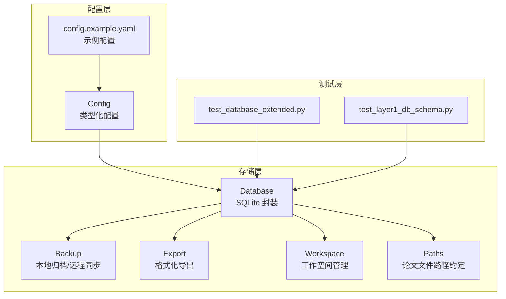
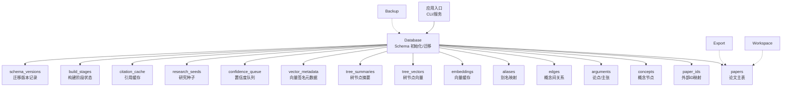
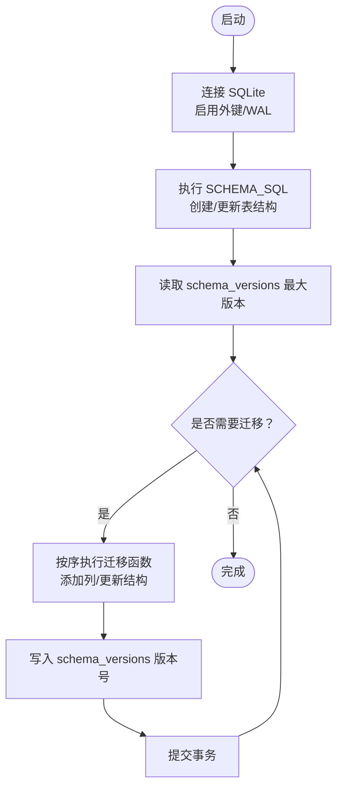
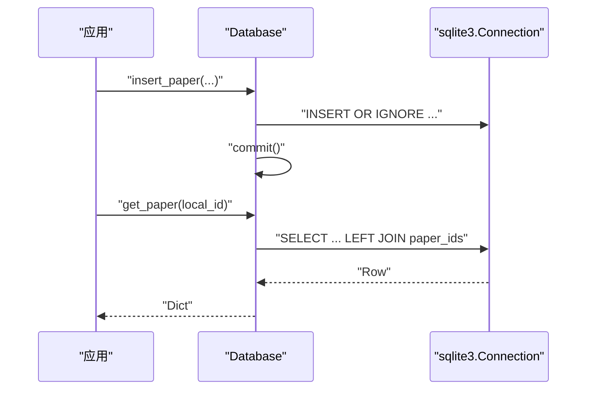
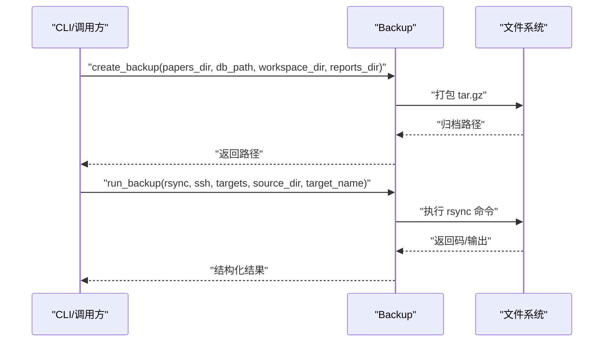
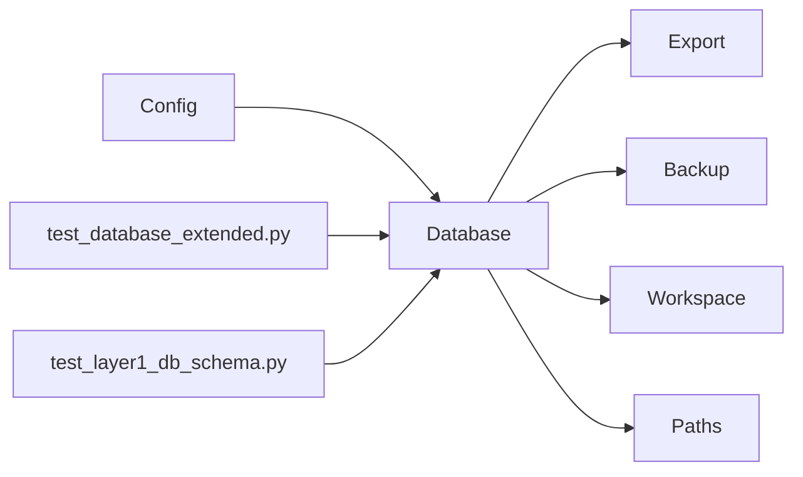

# 数据库管理

<cite>
**本文引用的文件**
- [src/drbrain/storage/database.py](file://src/drbrain/storage/database.py)
- [src/drbrain/storage/backup.py](file://src/drbrain/storage/backup.py)
- [src/drbrain/storage/export.py](file://src/drbrain/storage/export.py)
- [src/drbrain/storage/workspace.py](file://src/drbrain/storage/workspace.py)
- [src/drbrain/storage/paths.py](file://src/drbrain/storage/paths.py)
- [src/drbrain/config.py](file://src/drbrain/config.py)
- [config.example.yaml](file://config.example.yaml)
- [tests/test_database_extended.py](file://tests/test_database_extended.py)
- [tests/test_layer1_db_schema.py](file://tests/test_layer1_db_schema.py)
</cite>

## 目录
1. [简介](#简介)
2. [项目结构](#项目结构)
3. [核心组件](#核心组件)
4. [架构总览](#架构总览)
5. [详细组件分析](#详细组件分析)
6. [依赖分析](#依赖分析)
7. [性能考虑](#性能考虑)
8. [故障排查指南](#故障排查指南)
9. [结论](#结论)
10. [附录](#附录)

## 简介
本文件面向 DrBrain 的数据库管理系统，系统以 SQLite 为核心存储后端，围绕论文、概念、论点、图谱边与别名等实体构建知识图谱数据模型，并提供自动模式迁移、索引策略、查询接口与维护工具（备份、导出、工作空间）。本文从架构设计、表结构关系、初始化与迁移、事务与并发控制、数据完整性、索引与查询优化、维护与恢复等方面进行系统化说明。

## 项目结构
与数据库相关的核心模块位于 storage 子包，配合配置模块与测试用例验证行为与演进：

- 存储层
  - database.py：SQLite 数据库封装、Schema 定义与迁移、增删改查接口、时间演化信号检测
  - backup.py：本地 tar.gz 备份与 rsync 远程同步
  - export.py：元数据导出为 BibTeX/RIS/Markdown
  - workspace.py：工作空间（子集）管理
  - paths.py：论文目录与文件路径约定
- 配置层
  - config.py：类型化配置（含 DBConfig、BackupConfig 等）
  - config.example.yaml：示例配置模板
- 测试层
  - tests/test_database_extended.py：扩展数据库行为测试
  - tests/test_layer1_db_schema.py：Schema 与版本迁移测试



图表来源
- [src/drbrain/storage/database.py:159-258](file://src/drbrain/storage/database.py#L159-L258)
- [src/drbrain/storage/backup.py:26-63](file://src/drbrain/storage/backup.py#L26-L63)
- [src/drbrain/storage/export.py:68-105](file://src/drbrain/storage/export.py#L68-L105)
- [src/drbrain/storage/workspace.py:71-100](file://src/drbrain/storage/workspace.py#L71-L100)
- [src/drbrain/storage/paths.py:6-29](file://src/drbrain/storage/paths.py#L6-L29)
- [src/drbrain/config.py:80-82](file://src/drbrain/config.py#L80-L82)
- [config.example.yaml:77-80](file://config.example.yaml#L77-L80)
- [tests/test_database_extended.py:7-28](file://tests/test_database_extended.py#L7-L28)
- [tests/test_layer1_db_schema.py:9-23](file://tests/test_layer1_db_schema.py#L9-L23)

章节来源
- [src/drbrain/storage/database.py:10-156](file://src/drbrain/storage/database.py#L10-L156)
- [src/drbrain/config.py:80-82](file://src/drbrain/config.py#L80-L82)
- [config.example.yaml:77-80](file://config.example.yaml#L77-L80)

## 核心组件
- Database：SQLite 包装器，负责 Schema 初始化、迁移、事务提交、常用 CRUD 与聚合查询
- Backup：本地 tar.gz 备份与 rsync 远程同步
- Export：将元数据导出为多种格式
- Workspace：工作空间（子集）的创建、读写、重命名与删除
- Paths：论文目录与文件路径约定
- Config：类型化配置，包括数据库路径、备份目标等

章节来源
- [src/drbrain/storage/database.py:159-258](file://src/drbrain/storage/database.py#L159-L258)
- [src/drbrain/storage/backup.py:26-63](file://src/drbrain/storage/backup.py#L26-L63)
- [src/drbrain/storage/export.py:68-105](file://src/drbrain/storage/export.py#L68-L105)
- [src/drbrain/storage/workspace.py:71-100](file://src/drbrain/storage/workspace.py#L71-L100)
- [src/drbrain/storage/paths.py:6-29](file://src/drbrain/storage/paths.py#L6-L29)
- [src/drbrain/config.py:80-82](file://src/drbrain/config.py#L80-L82)

## 架构总览
DrBrain 的数据库层采用“单机 SQLite + WAL 模式”的轻量架构，通过迁移机制保障 Schema 演进，配合索引与专用查询接口实现高效检索与分析。



图表来源
- [src/drbrain/storage/database.py:10-156](file://src/drbrain/storage/database.py#L10-L156)
- [src/drbrain/storage/backup.py:26-63](file://src/drbrain/storage/backup.py#L26-L63)
- [src/drbrain/storage/export.py:68-105](file://src/drbrain/storage/export.py#L68-L105)
- [src/drbrain/storage/workspace.py:71-100](file://src/drbrain/storage/workspace.py#L71-L100)

## 详细组件分析

### 数据库初始化与模式管理
- 初始化流程
  - 构造函数中创建目录、连接数据库、启用外键与 WAL 模式
  - 执行 Schema 脚本并触发迁移
- 迁移机制
  - 基于 schema_versions 记录当前版本，按顺序执行待处理迁移
  - 支持新增列（如 paper_type、venue 字段、authors、node_id、edges 的 provenance 字段）
- 索引策略
  - 针对高频查询建立索引：concepts(type/label/first_seen)、arguments(source_paper/target_label)、edges(relation/src)、confidence_queue(status)



图表来源
- [src/drbrain/storage/database.py:159-201](file://src/drbrain/storage/database.py#L159-L201)
- [src/drbrain/storage/database.py:170-173](file://src/drbrain/storage/database.py#L170-L173)

章节来源
- [src/drbrain/storage/database.py:159-201](file://src/drbrain/storage/database.py#L159-L201)
- [src/drbrain/storage/database.py:170-173](file://src/drbrain/storage/database.py#L170-L173)
- [tests/test_layer1_db_schema.py:103-179](file://tests/test_layer1_db_schema.py#L103-L179)

### 表结构与数据模型
- papers：论文主表，包含标题、摘要、年份、类型、状态、期刊/出版者/引用数、卷期页码、作者等；外键约束通过 paper_ids 维护
- paper_ids：外部 ID 映射（DOI/arXiv/S2/OpenAlex），唯一性约束
- concepts：概念节点，关联论文，支持类型、置信度、首次/最后出现年份、树节点标识
- arguments：论文中的主张/论点，包含目标标签/类型、证据类型/细节、机制、置信度等
- edges：概念间关系，复合主键确保去重，支持权重与来源论文
- aliases：别名到规范 ID 的映射
- embeddings：实体向量缓存（BLOB + 维度）
- tree_vectors/tree_summaries/vector_metadata：树节点向量与摘要、向量签名元数据
- confidence_queue：置信度审核队列（概念/别名/关系）
- research_seeds：研究种子（模式类型、描述、置信度）
- citation_cache：引用缓存（来源论文、目标标题/年份、关系、目标标识）
- build_stages：构建阶段状态跟踪
- schema_versions：迁移版本记录

```mermaid
erDiagram
papers {
text local_id PK
text title
text abstract
int year
text paper_type
text status
text journal
text publisher
int citation_count
text volume
text pages
text authors
timestamp created_at
}
paper_ids {
text local_id FK
text doi UK
text arxiv UK
text s2_id UK
text openalex_id UK
}
concepts {
int concept_id PK
text local_id FK
text type
text label
real confidence
text section
text node_id
int first_seen
int last_seen
}
arguments {
int arg_id PK
text source_paper FK
text claim
text claim_type
text target_label
text target_type
text evidence_type
text evidence_detail
text mechanism
text section
text node_id
real confidence
timestamp created_at
}
edges {
text src_id
text dst_id
text relation
text source_paper
real weight
text node_id
text section
PK src_id,dst_id,relation,source_paper
}
aliases {
text variant PK
text canonical_id
}
embeddings {
text entity PK
blob vec
int dim
}
tree_vectors {
text node_id PK
text paper_id
blob embedding
text content_hash
text tree_layer
}
tree_summaries {
text node_id PK
text paper_id
text summary_text
text source_node_ids
int tree_layer
}
vector_metadata {
text key PK
text value
}
confidence_queue {
int queue_id PK
text source_paper
text item_type
text item_data
real confidence
text status
timestamp created_at
}
research_seeds {
int seed_id PK
text pattern_type
text description
real confidence
timestamp created_at
}
citation_cache {
text source_paper
text target_title
int target_year
text relation
text target_doi
text target_s2_id
timestamp cached_at
PK source_paper,target_title
}
build_stages {
text paper_id
text stage
text status
text result_json
timestamp updated_at
PK paper_id,stage
}
schema_versions {
int version PK
timestamp applied_at
}
papers ||--o{ paper_ids : "映射"
papers ||--o{ concepts : "拥有"
papers ||--o{ arguments : "产生"
papers ||--o{ edges : "来源"
concepts ||--|| aliases : "别名"
```

图表来源
- [src/drbrain/storage/database.py:10-156](file://src/drbrain/storage/database.py#L10-L156)

章节来源
- [src/drbrain/storage/database.py:10-156](file://src/drbrain/storage/database.py#L10-L156)

### 数据库连接配置、事务与并发控制
- 连接配置
  - 数据库路径由配置提供，默认 data/drbrain.db
  - 启用外键约束与 WAL 日志模式，提升并发读写与崩溃恢复能力
- 事务与提交
  - 提供 execute/executemany/commit/close 方法
  - 关键写入操作（插入/更新/删除）后需显式 commit
- 并发控制
  - 使用 WAL 模式与默认锁策略；高并发写入建议在应用层串行或批量提交

章节来源
- [src/drbrain/config.py:80-82](file://src/drbrain/config.py#L80-L82)
- [src/drbrain/storage/database.py:162-168](file://src/drbrain/storage/database.py#L162-L168)
- [src/drbrain/storage/database.py:247-257](file://src/drbrain/storage/database.py#L247-L257)

### 数据操作 API 与使用要点
- 论文
  - 插入/更新/删除、外部 ID 查找、模糊标题+年份匹配
- 概念/论点/边
  - 插入、去重插入（边）、批量写入
- 别名/种子/置信度队列
  - 插入、查询、接受/拒绝
- 向量
  - 保存/加载/清理
- 时间演化分析
  - 检测 emerging/established/declining/contested/resurging 等信号



图表来源
- [src/drbrain/storage/database.py:279-347](file://src/drbrain/storage/database.py#L279-L347)
- [src/drbrain/storage/database.py:448-478](file://src/drbrain/storage/database.py#L448-L478)

章节来源
- [src/drbrain/storage/database.py:279-347](file://src/drbrain/storage/database.py#L279-L347)
- [src/drbrain/storage/database.py:448-478](file://src/drbrain/storage/database.py#L448-L478)
- [tests/test_database_extended.py:25-55](file://tests/test_database_extended.py#L25-L55)

### 查询示例与性能优化
- 典型查询
  - 获取论文列表与外部 ID：JOIN papers 与 paper_ids
  - 按论文获取概念/论点：按 local_id 或 source_paper 过滤
  - 获取置信度队列：按 status 过滤并排序
- 性能优化建议
  - 为高频过滤字段建立索引（已内置）
  - 使用参数化 SQL 防止注入并复用执行计划
  - 对批量写入使用 executemany 并合并提交
  - 避免一次性 SELECT 大结果集，必要时分页或投影字段

章节来源
- [src/drbrain/storage/database.py:419-447](file://src/drbrain/storage/database.py#L419-L447)
- [src/drbrain/storage/database.py:566-585](file://src/drbrain/storage/database.py#L566-L585)
- [src/drbrain/storage/database.py:557-565](file://src/drbrain/storage/database.py#L557-L565)

### 数据完整性与一致性
- 外键约束
  - concepts.arguments.edges 引用 papers.local_id
  - paper_ids.local_id 引用 papers.local_id（级联删除）
- 唯一性约束
  - paper_ids 的各外部 ID 字段唯一
  - edges 复合主键避免重复关系
- 默认值与检查约束
  - paper_type/status 等枚举字段带 CHECK 约束
  - node_id/section 等新增字段默认空字符串

章节来源
- [src/drbrain/storage/database.py:10-156](file://src/drbrain/storage/database.py#L10-L156)

### 维护与备份策略
- 本地备份
  - 打包 papers、数据库、可选 workspace 与 reports 目录为 tar.gz
- 远程同步
  - 基于 rsync + ssh，支持压缩、追加模式、排除规则与密码认证
- 备份配置
  - 通过配置文件定义多个目标，包含主机、用户、路径、端口、密钥/密码、模式与排除项



图表来源
- [src/drbrain/storage/backup.py:26-63](file://src/drbrain/storage/backup.py#L26-L63)
- [src/drbrain/storage/backup.py:199-240](file://src/drbrain/storage/backup.py#L199-L240)

章节来源
- [src/drbrain/storage/backup.py:26-63](file://src/drbrain/storage/backup.py#L26-L63)
- [src/drbrain/storage/backup.py:199-240](file://src/drbrain/storage/backup.py#L199-L240)
- [config.example.yaml:127-145](file://config.example.yaml#L127-L145)

### 导出与工作空间
- 导出
  - BibTeX/RIS/Markdown 格式转换，支持作者姓氏提取、条目类型映射、引用键生成
- 工作空间
  - 创建/添加/移除/列出/删除/重命名，安全名称校验，JSON 存储论文清单

章节来源
- [src/drbrain/storage/export.py:68-105](file://src/drbrain/storage/export.py#L68-L105)
- [src/drbrain/storage/workspace.py:71-100](file://src/drbrain/storage/workspace.py#L71-L100)
- [src/drbrain/storage/workspace.py:142-155](file://src/drbrain/storage/workspace.py#L142-L155)

## 依赖分析
- 组件耦合
  - Database 作为核心，被导出、备份、工作空间与测试广泛使用
  - Config 为 Database 提供数据库路径等配置
- 外部依赖
  - sqlite3（标准库）
  - numpy（向量序列化）
  - loguru（日志）



图表来源
- [src/drbrain/config.py:80-82](file://src/drbrain/config.py#L80-L82)
- [src/drbrain/storage/database.py:159-258](file://src/drbrain/storage/database.py#L159-L258)
- [tests/test_database_extended.py:7-28](file://tests/test_database_extended.py#L7-L28)
- [tests/test_layer1_db_schema.py:9-23](file://tests/test_layer1_db_schema.py#L9-L23)

章节来源
- [src/drbrain/storage/database.py:159-258](file://src/drbrain/storage/database.py#L159-L258)
- [src/drbrain/config.py:80-82](file://src/drbrain/config.py#L80-L82)

## 性能考虑
- WAL 模式提升并发读取吞吐
- 为高频过滤字段建立索引，减少全表扫描
- 批量写入使用 executemany 并合并提交
- 向量存储采用 BLOB，注意内存占用与序列化成本
- 大查询建议投影必要字段并分页

## 故障排查指南
- 迁移失败
  - 检查 schema_versions 是否正确记录版本；确认迁移函数未抛异常
- 外键约束错误
  - 确保先插入 papers 再插入子表（concepts/arguments/edges）
- 写入不生效
  - 确认调用 commit；批量写入后统一提交
- 备份失败
  - 检查 rsync/ssh 可用性、目标权限与网络连通性；核对配置中的主机/路径/密钥设置

章节来源
- [src/drbrain/storage/database.py:175-201](file://src/drbrain/storage/database.py#L175-L201)
- [src/drbrain/storage/backup.py:199-240](file://src/drbrain/storage/backup.py#L199-L240)

## 结论
DrBrain 的数据库层以 SQLite 为基础，通过清晰的 Schema 设计、完善的迁移机制、合理的索引与查询接口，以及配套的备份与导出工具，实现了从论文到知识图谱的全链路数据管理。遵循本文的配置、使用与维护建议，可在保证数据完整性的同时获得良好的性能与可维护性。

## 附录
- 配置参考
  - 数据库路径：db.path
  - 备份目标：backup.targets
- 常用命令
  - 备份：本地 tar.gz 与 rsync 远程同步
  - 导出：BibTeX/RIS/Markdown
  - 工作空间：创建/添加/移除/重命名/删除

章节来源
- [config.example.yaml:77-80](file://config.example.yaml#L77-L80)
- [config.example.yaml:127-145](file://config.example.yaml#L127-L145)
- [src/drbrain/storage/export.py:68-105](file://src/drbrain/storage/export.py#L68-L105)
- [src/drbrain/storage/workspace.py:71-100](file://src/drbrain/storage/workspace.py#L71-L100)