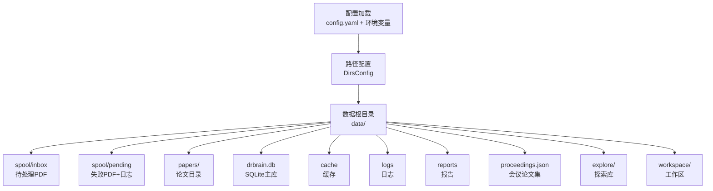
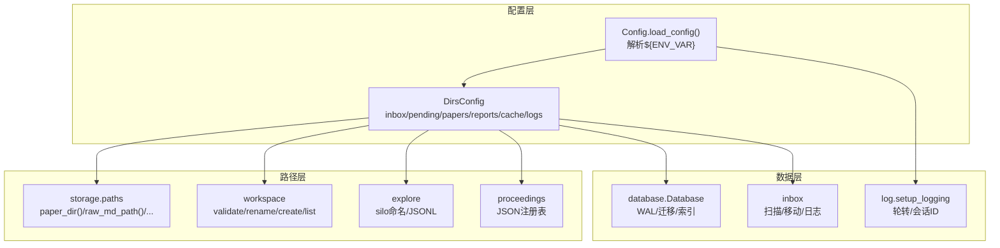
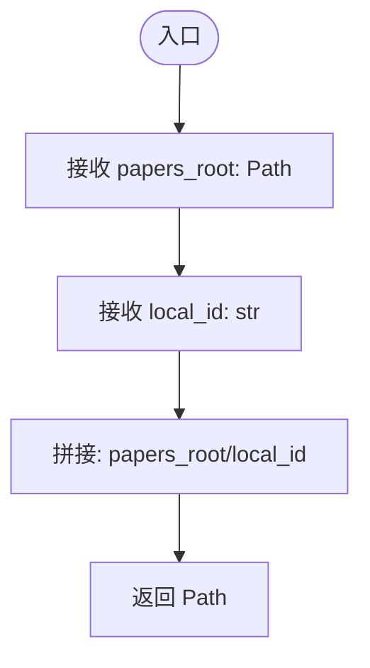
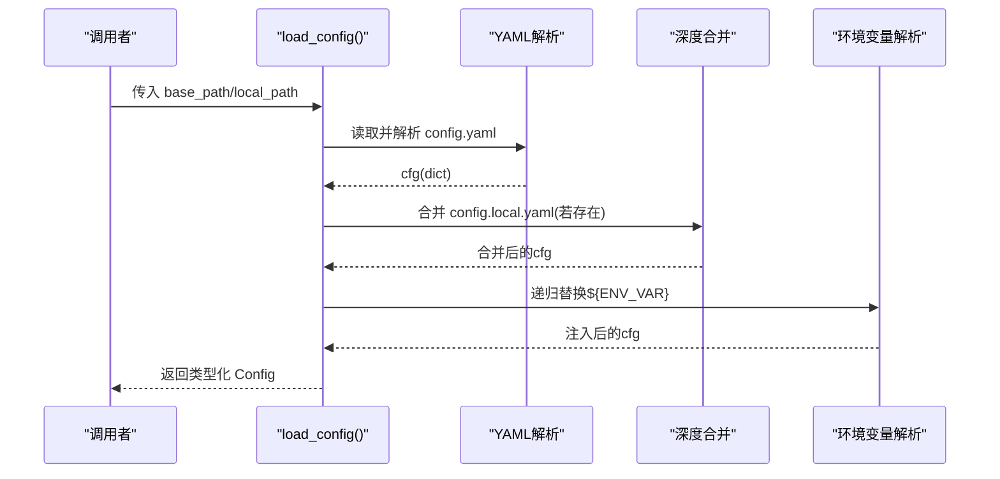
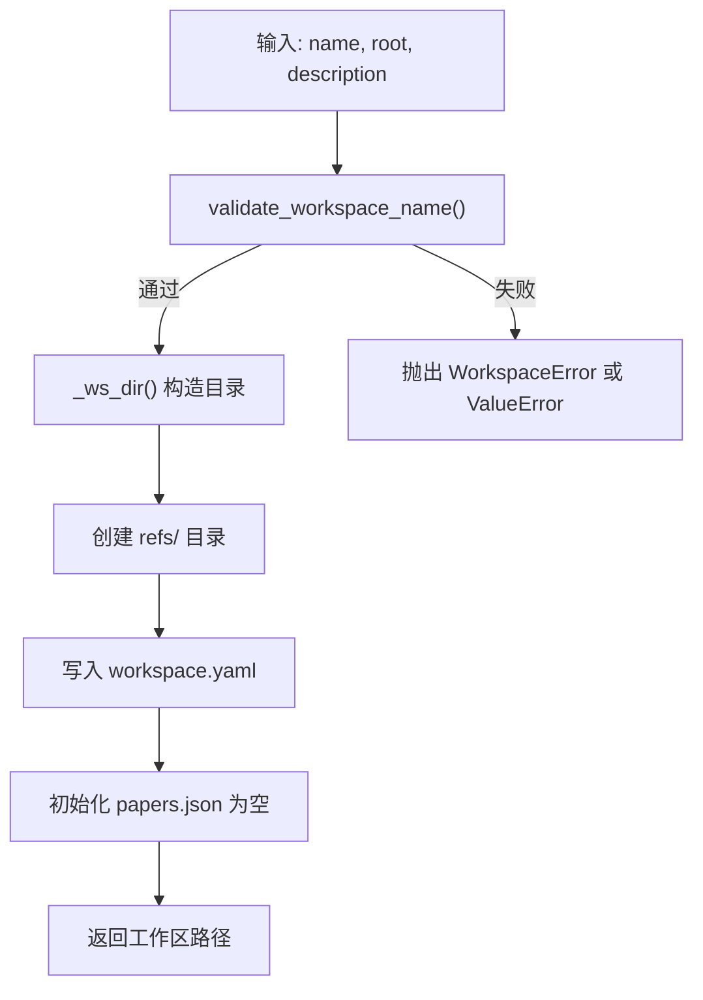
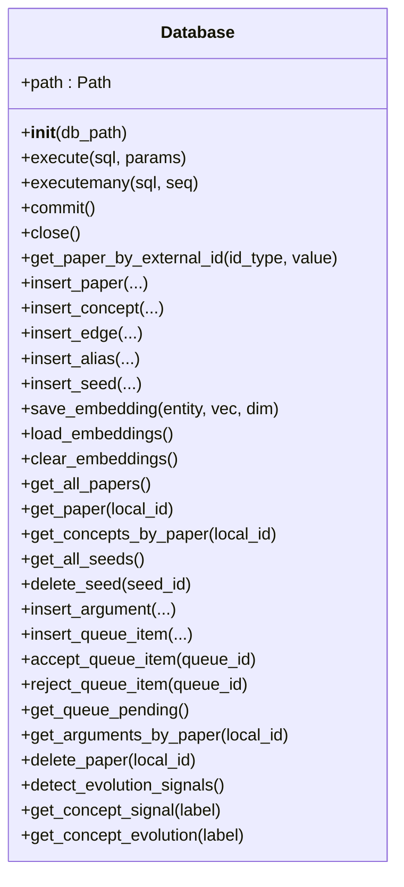
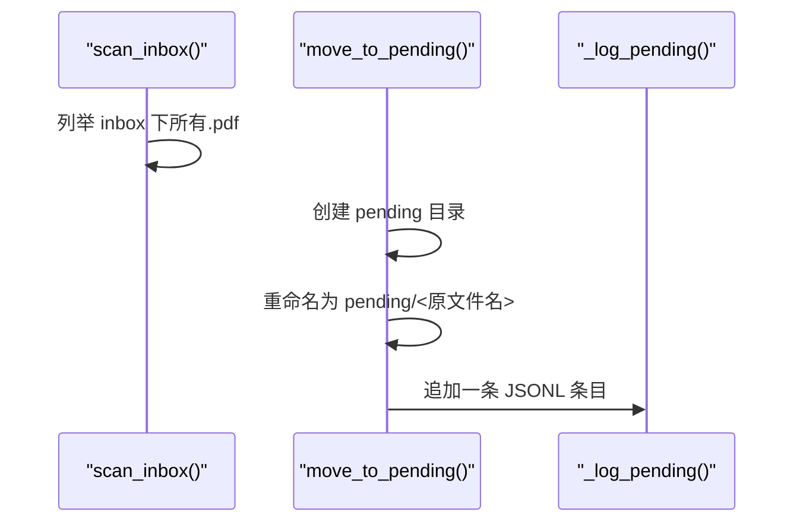
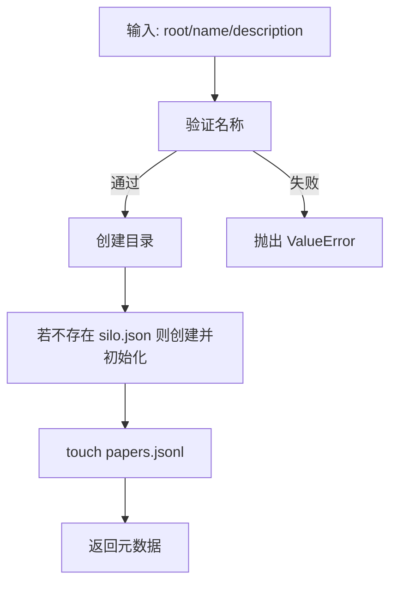
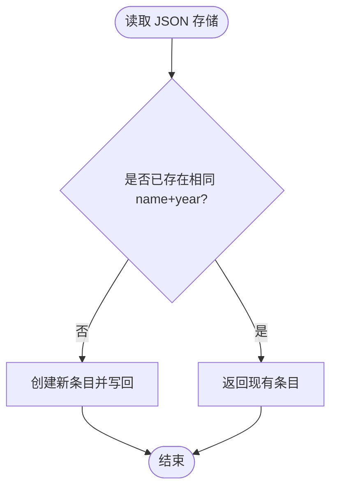
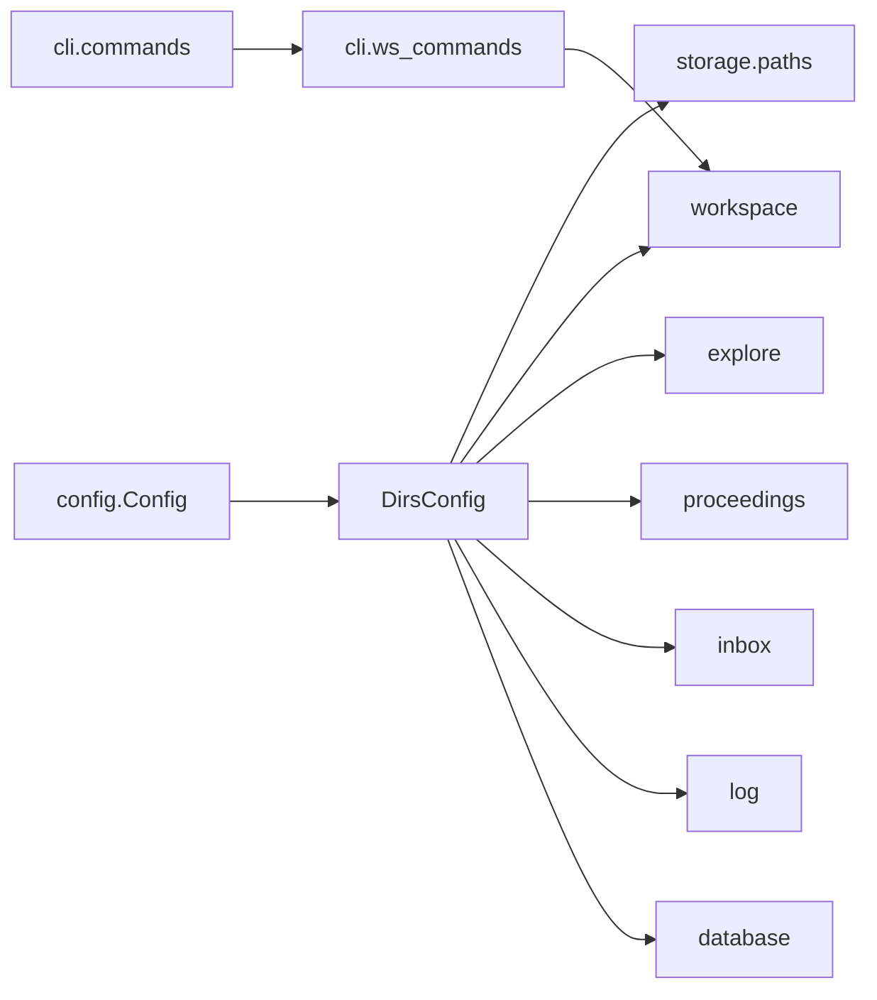

# 文件路径管理

<cite>
**本文引用的文件**
- [src/drbrain/storage/paths.py](file://src/drbrain/storage/paths.py)
- [src/drbrain/config.py](file://src/drbrain/config.py)
- [src/drbrain/storage/workspace.py](file://src/drbrain/storage/workspace.py)
- [src/drbrain/storage/database.py](file://src/drbrain/storage/database.py)
- [src/drbrain/storage/inbox.py](file://src/drbrain/storage/inbox.py)
- [src/drbrain/storage/explore.py](file://src/drbrain/storage/explore.py)
- [src/drbrain/storage/proceedings.py](file://src/drbrain/storage/proceedings.py)
- [src/drbrain/storage/export.py](file://src/drbrain/storage/export.py)
- [src/drbrain/storage/citation_graph.py](file://src/drbrain/storage/citation_graph.py)
- [src/drbrain/cli/ws_commands.py](file://src/drbrain/cli/ws_commands.py)
- [src/drbrain/cli/commands.py](file://src/drbrain/cli/commands.py)
- [src/drbrain/log.py](file://src/drbrain/log.py)
- [config.yaml](file://config.yaml)
- [.trellis/spec/backend/directory-structure.md](file://.trellis/spec/backend/directory-structure.md)
- [CLAUDE.md](file://CLAUDE.md)
</cite>

## 目录
1. [简介](#简介)
2. [项目结构](#项目结构)
3. [核心组件](#核心组件)
4. [架构总览](#架构总览)
5. [详细组件分析](#详细组件分析)
6. [依赖分析](#依赖分析)
7. [性能考量](#性能考量)
8. [故障排查指南](#故障排查指南)
9. [结论](#结论)
10. [附录](#附录)

## 简介
本文件路径管理系统围绕 DrBrain 的数据目录布局、路径解析与规范化、文件命名与存储策略展开，覆盖临时文件、缓存、日志、数据库、工作区、探索库（Silos）、会议论文集等子系统的组织方式。文档同时记录路径配置项、环境变量支持、跨平台兼容性、文件操作 API 使用方法、路径转换函数、错误处理机制、文件权限与安全注意事项，以及文件系统监控、磁盘空间管理与清理策略。

## 项目结构
DrBrain 将“路径定义”集中在 storage 子模块中，并通过统一的配置加载器集中化管理路径根目录与子目录。典型的数据目录布局如下：
- data/spool/inbox：待处理 PDF 入口
- data/spool/pending：失败入站 PDF 的归档与原因日志
- data/papers/<local_id>/：每篇论文的本地目录，包含 source.pdf、raw.md、tree.json、images/
- data/drbrain.db：SQLite 主数据库（WAL 模式）
- data/cache：可重建的 API 缓存
- data/logs：日志轮转文件
- data/reports：报告输出
- data/proceedings.json：会议论文集注册表
- data/explore/<name>/：探索型文献集合（silo.json + papers.jsonl）
- workspace/<name>/：工作区集合（workspace.yaml + refs/papers.json）

图表来源
- [config.yaml:25-31](file://config.yaml#L25-L31)
- [src/drbrain/config.py:70-77](file://src/drbrain/config.py#L70-L77)
- [CLAUDE.md:174-187](file://CLAUDE.md#L174-L187)

章节来源
- [config.yaml:25-31](file://config.yaml#L25-L31)
- [src/drbrain/config.py:70-77](file://src/drbrain/config.py#L70-L77)
- [.trellis/spec/backend/directory-structure.md:171-188](file://.trellis/spec/backend/directory-structure.md#L171-L188)
- [CLAUDE.md:174-187](file://CLAUDE.md#L174-L187)

## 核心组件
- 路径访问器：集中于 storage/paths.py，提供 per-paper 目录与关键文件的路径生成函数，确保路径拼接的一致性与可读性。
- 配置与环境变量：config.py 提供类型化配置结构（DirsConfig 等），支持从 YAML 加载、本地覆盖合并、递归解析 ${ENV_VAR} 环境变量。
- 工作区管理：workspace.py 提供工作区的创建、增删改查、重命名、安全名称校验与 papers.json 的原子写入策略。
- 数据库存储：database.py 负责 SQLite 初始化、迁移、索引与查询封装；数据库文件路径由配置提供。
- 入站与待处理：inbox.py 提供扫描、移动到待处理目录与失败日志记录。
- 探索库（Silos）：explore.py 定义探索型集合的命名规范、元数据与 JSONL 记录格式。
- 会议论文集：proceedings.py 提供 JSON 注册表的创建、添加论文与查询接口。
- 导出工具：export.py 提供多种导出格式的元数据到格式化文本转换函数。
- 引用图分析：citation_graph.py 基于 SQLite 连接查询引用关系与统计。
- 日志系统：log.py 统一日志初始化、轮转与会话标识。
- CLI 集成：ws_commands.py 通过命令行对工作区进行管理；commands.py 作为命令模块的聚合出口。

章节来源
- [src/drbrain/storage/paths.py:6-29](file://src/drbrain/storage/paths.py#L6-L29)
- [src/drbrain/config.py:70-77](file://src/drbrain/config.py#L70-L77)
- [src/drbrain/storage/workspace.py:22-40](file://src/drbrain/storage/workspace.py#L22-L40)
- [src/drbrain/storage/database.py:159-169](file://src/drbrain/storage/database.py#L159-L169)
- [src/drbrain/storage/inbox.py:12-55](file://src/drbrain/storage/inbox.py#L12-L55)
- [src/drbrain/storage/explore.py:20-47](file://src/drbrain/storage/explore.py#L20-L47)
- [src/drbrain/storage/proceedings.py:31-122](file://src/drbrain/storage/proceedings.py#L31-L122)
- [src/drbrain/storage/export.py:68-180](file://src/drbrain/storage/export.py#L68-L180)
- [src/drbrain/storage/citation_graph.py:8-129](file://src/drbrain/storage/citation_graph.py#L8-L129)
- [src/drbrain/log.py:32-68](file://src/drbrain/log.py#L32-L68)
- [src/drbrain/cli/ws_commands.py:12-171](file://src/drbrain/cli/ws_commands.py#L12-L171)
- [src/drbrain/cli/commands.py:10-88](file://src/drbrain/cli/commands.py#L10-L88)

## 架构总览
下图展示路径配置、路径访问器与各子系统之间的交互关系，以及环境变量注入与日志初始化在运行时的作用点。

图表来源
- [src/drbrain/config.py:195-292](file://src/drbrain/config.py#L195-L292)
- [src/drbrain/storage/paths.py:6-29](file://src/drbrain/storage/paths.py#L6-L29)
- [src/drbrain/storage/workspace.py:22-100](file://src/drbrain/storage/workspace.py#L22-L100)
- [src/drbrain/storage/explore.py:28-86](file://src/drbrain/storage/explore.py#L28-L86)
- [src/drbrain/storage/proceedings.py:17-64](file://src/drbrain/storage/proceedings.py#L17-L64)
- [src/drbrain/storage/database.py:159-169](file://src/drbrain/storage/database.py#L159-L169)
- [src/drbrain/storage/inbox.py:12-43](file://src/drbrain/storage/inbox.py#L12-L43)
- [src/drbrain/log.py:32-61](file://src/drbrain/log.py#L32-L61)

## 详细组件分析

### 路径访问器（storage.paths）
- 功能要点
  - 以 papers_root 与 local_id 生成 per-paper 目录
  - 生成 raw.md、tree.json、source.pdf、images/ 等关键路径
- 设计模式
  - 函数式路径拼接，避免硬编码字符串，提升可维护性
- 复杂度
  - O(1) 时间与空间复杂度
- 错误处理
  - 无显式异常抛出，调用方需自行保证输入合法性（如 Path 对象存在性）

图表来源
- [src/drbrain/storage/paths.py:6-8](file://src/drbrain/storage/paths.py#L6-L8)

章节来源
- [src/drbrain/storage/paths.py:6-29](file://src/drbrain/storage/paths.py#L6-L29)

### 配置与环境变量（config.py）
- 关键点
  - DirsConfig 定义 data 目录下的子目录默认值
  - 支持从 config.yaml 与 config.local.yaml 深度合并
  - 递归解析 ${ENV_VAR} 占位符，未设置时替换为空字符串
  - 提供类型化配置对象，保留字典兼容访问
- 跨平台兼容
  - 使用 pathlib.Path，自动适配不同平台分隔符
- 性能
  - YAML 解析与正则替换为轻量级操作，开销可忽略

图表来源
- [src/drbrain/config.py:195-244](file://src/drbrain/config.py#L195-L244)
- [src/drbrain/config.py:264-278](file://src/drbrain/config.py#L264-L278)
- [src/drbrain/config.py:283-292](file://src/drbrain/config.py#L283-L292)

章节来源
- [src/drbrain/config.py:70-77](file://src/drbrain/config.py#L70-L77)
- [src/drbrain/config.py:195-292](file://src/drbrain/config.py#L195-L292)
- [config.yaml:5,25-31](file://config.yaml#L5,L25-L31)

### 工作区管理（workspace.py）
- 名称校验规则
  - 不允许空、.、..、绝对路径、包含特定非法字符（/, \, :）、不允许 .. 出现在路径中、首尾空白、Windows 驱动器符号
- 目录与文件布局
  - workspace/<name>/workspace.yaml：元信息（版本、名称、描述、创建时间）
  - workspace/<name>/refs/papers.json：按添加时间排序的论文列表（去重）
- 原子写入策略
  - 写入临时 .tmp 文件后替换，降低并发写入风险
- 命令集成
  - CLI 通过 ws_commands.py 提供 create/add/remove/list/show/delete/rename

图表来源
- [src/drbrain/storage/workspace.py:22-100](file://src/drbrain/storage/workspace.py#L22-L100)

章节来源
- [src/drbrain/storage/workspace.py:22-40](file://src/drbrain/storage/workspace.py#L22-L40)
- [src/drbrain/storage/workspace.py:43-100](file://src/drbrain/storage/workspace.py#L43-L100)
- [src/drbrain/cli/ws_commands.py:12-32](file://src/drbrain/cli/ws_commands.py#L12-L32)

### 数据库存储（database.py）
- 初始化与迁移
  - 自动创建表与索引，按版本号顺序应用迁移
  - WAL 模式提升并发读写性能
- 路径与权限
  - 数据库文件路径来自配置；首次连接时确保父目录存在
- 查询封装
  - 提供论文、概念、论点、边、别名、嵌入、树向量/摘要、置信度队列等常用查询

图表来源
- [src/drbrain/storage/database.py:159-775](file://src/drbrain/storage/database.py#L159-L775)

章节来源
- [src/drbrain/storage/database.py:159-201](file://src/drbrain/storage/database.py#L159-L201)
- [src/drbrain/storage/database.py:247-258](file://src/drbrain/storage/database.py#L247-L258)

### 入站与待处理（inbox.py）
- 扫描
  - 仅返回 .pdf 文件，大小写不敏感
- 移动与日志
  - 失败 PDF 移动至 pending 目录，并在同目录写入 pending.jsonl（JSONL 行式日志）
- 读取日志
  - 逐行解析 JSON 条目

图表来源
- [src/drbrain/storage/inbox.py:12-43](file://src/drbrain/storage/inbox.py#L12-L43)

章节来源
- [src/drbrain/storage/inbox.py:12-55](file://src/drbrain/storage/inbox.py#L12-L55)

### 探索库（Silos，explore.py）
- 命名规范
  - 1-64 字符，字母数字及 - _ .，且必须以字母或数字开头
- 元数据与记录
  - silo.json：name、description、created_at、paper_count
  - papers.jsonl：每行一个论文字典（title/authors/year/doi 可选）
- 操作
  - 创建、追加论文、读取、搜索（关键字匹配 title/authors/doi，大小写不敏感）、列出、删除

图表来源
- [src/drbrain/storage/explore.py:20-86](file://src/drbrain/storage/explore.py#L20-L86)

章节来源
- [src/drbrain/storage/explore.py:17-47](file://src/drbrain/storage/explore.py#L17-L47)
- [src/drbrain/storage/explore.py:49-144](file://src/drbrain/storage/explore.py#L49-L144)

### 会议论文集（proceedings.py）
- 结构
  - data/proceedings.json：JSON 数组，每个条目含 id、name、year、venue、papers[]
- 操作
  - 创建（去重：name+year），添加论文（去重），列出（按年份倒序、名称排序），查询，加载

图表来源
- [src/drbrain/storage/proceedings.py:31-64](file://src/drbrain/storage/proceedings.py#L31-L64)

章节来源
- [src/drbrain/storage/proceedings.py:17-122](file://src/drbrain/storage/proceedings.py#L17-L122)

### 导出工具（export.py）
- 功能
  - BibTeX、RIS、Markdown 格式的元数据到格式化文本转换
  - 作者姓氏提取、引文键生成、条目类型映射、特殊字符转义
- 使用场景
  - 与服务层协作生成报告或批量导出

章节来源
- [src/drbrain/storage/export.py:8-180](file://src/drbrain/storage/export.py#L8-L180)

### 引用图分析（citation_graph.py）
- 功能
  - 查询某论文的参考文献、被引、共享参考文献
  - 统计参考数与被引数
- 依赖
  - SQLite 连接（由上层传入）

章节来源
- [src/drbrain/storage/citation_graph.py:8-129](file://src/drbrain/storage/citation_graph.py#L8-L129)

### 日志系统（log.py）
- 初始化
  - 旋转文件（10MB，保留5个），UTF-8 编码，标准错误输出 WARNING+ 级别
  - 会话 ID（UUID）贯穿一次进程生命周期
- 使用
  - setup_logging(level, log_path) 可配置级别与路径；get_logger(name) 获取命名日志器

章节来源
- [src/drbrain/log.py:32-68](file://src/drbrain/log.py#L32-L68)

## 依赖分析
- 配置到路径
  - DirsConfig 的字段决定 data/* 下各子目录位置，paths.py、workspace.py、explore.py、proceedings.py、inbox.py、log.py 等均依赖该配置
- CLI 到存储
  - ws_commands.py 依赖 workspace.py；commands.py 聚合各命令模块
- 存储到数据库
  - database.py 依赖 DirsConfig 中的 db.path；初始化时确保父目录存在

图表来源
- [src/drbrain/config.py:182-194](file://src/drbrain/config.py#L182-L194)
- [src/drbrain/storage/paths.py:3](file://src/drbrain/storage/paths.py#L3)
- [src/drbrain/storage/workspace.py:3](file://src/drbrain/storage/workspace.py#L3)
- [src/drbrain/storage/explore.py:3](file://src/drbrain/storage/explore.py#L3)
- [src/drbrain/storage/proceedings.py:3](file://src/drbrain/storage/proceedings.py#L3)
- [src/drbrain/storage/inbox.py:3](file://src/drbrain/storage/inbox.py#L3)
- [src/drbrain/log.py:7](file://src/drbrain/log.py#L7)
- [src/drbrain/storage/database.py:6](file://src/drbrain/storage/database.py#L6)
- [src/drbrain/cli/ws_commands.py:19](file://src/drbrain/cli/ws_commands.py#L19)
- [src/drbrain/cli/commands.py:11](file://src/drbrain/cli/commands.py#L11)

章节来源
- [src/drbrain/config.py:182-194](file://src/drbrain/config.py#L182-L194)
- [src/drbrain/cli/commands.py:10-88](file://src/drbrain/cli/commands.py#L10-L88)

## 性能考量
- 路径拼接
  - 使用 pathlib.Path 进行拼接，避免字符串拼接带来的可读性与跨平台问题
- 数据库
  - WAL 模式提升并发读写；合理使用索引（概念类型、标签、首次/最后出现时间、论点源、边关系、队列状态）
- 日志
  - 旋转与保留策略平衡磁盘占用与历史审计需求
- 并发写入
  - 工作区 papers.json 采用 .tmp 写入后替换，降低竞态风险

## 故障排查指南
- 工作区名称无效
  - 现象：创建/重命名时报错
  - 排查：检查是否包含非法字符、是否以 . 或 .. 开头、是否包含绝对路径分隔符
  - 参考：validate_workspace_name 规则
- 工作区不存在或已存在
  - 现象：添加/删除/重命名/显示/删除失败
  - 排查：确认名称正确、目录是否存在、是否与其他工作区冲突
- 入站 PDF 未被处理
  - 现象：扫描结果为空或失败 PDF 未移动
  - 排查：确认 inbox 目录存在且为目录；检查文件扩展名为 .pdf；查看 pending.jsonl 是否有失败原因
- 探索库 silo 不存在
  - 现象：读取/追加论文时报错
  - 排查：确认 silo 名称符合命名规范；确认 silo.json 存在
- 数据库迁移失败或表缺失
  - 现象：查询报错或缺少列
  - 排查：确认数据库文件路径正确；检查 schema_versions 版本；确认 WAL 模式可用
- 日志未生成或未轮转
  - 现象：data/logs 下无文件或过大未轮转
  - 排查：确认 setup_logging 被调用；检查 log_path 父目录可写；确认轮转阈值与保留天数

章节来源
- [src/drbrain/storage/workspace.py:22-40](file://src/drbrain/storage/workspace.py#L22-L40)
- [src/drbrain/storage/workspace.py:103-128](file://src/drbrain/storage/workspace.py#L103-L128)
- [src/drbrain/storage/inbox.py:12-55](file://src/drbrain/storage/inbox.py#L12-L55)
- [src/drbrain/storage/explore.py:20-47](file://src/drbrain/storage/explore.py#L20-L47)
- [src/drbrain/storage/database.py:170-201](file://src/drbrain/storage/database.py#L170-L201)
- [src/drbrain/log.py:32-61](file://src/drbrain/log.py#L32-L61)

## 结论
DrBrain 的文件路径管理以“配置集中化 + 路径访问器 + 子系统专用实现”的方式构建，既保证了路径生成的一致性与可维护性，又通过严格的命名规范、原子写入策略与日志轮转提升了可靠性与可观测性。结合环境变量注入与跨平台路径抽象，系统在多环境下具备良好的可移植性与可运维性。

## 附录

### 路径配置选项与默认值
- DirsConfig 字段
  - inbox: data/spool/inbox
  - pending: data/spool/pending
  - papers: data/papers
  - reports: data/reports
  - cache: data/cache
  - logs: data/logs

章节来源
- [src/drbrain/config.py:70-77](file://src/drbrain/config.py#L70-L77)
- [config.yaml:25-31](file://config.yaml#L25-L31)

### 环境变量支持
- 支持在 config.yaml 中使用 ${ENV_VAR} 语法注入环境变量
- 未设置时替换为空字符串

章节来源
- [config.yaml:5](file://config.yaml#L5)
- [src/drbrain/config.py:264-278](file://src/drbrain/config.py#L264-L278)

### 跨平台兼容性
- 使用 pathlib.Path 进行路径拼接与目录创建
- 日志轮转与文件编码统一为 UTF-8

章节来源
- [src/drbrain/storage/paths.py:3](file://src/drbrain/storage/paths.py#L3)
- [src/drbrain/log.py:44-51](file://src/drbrain/log.py#L44-L51)

### 文件命名规则与存储策略
- 工作区
  - 名称：字母数字 + - _ .，长度 1-64，首字符为字母或数字
  - 文件：workspace.yaml（元信息）、refs/papers.json（论文清单）
- 探索库（Silos）
  - 目录：silo.json（元信息）、papers.jsonl（论文行式存储）
- 会议论文集
  - 文件：data/proceedings.json（JSON 数组）
- 入站与待处理
  - 目录：inbox 与 pending；失败日志 pending.jsonl
- 论文目录
  - 目录：data/papers/<local_id>；文件：source.pdf、raw.md、tree.json、images/

章节来源
- [src/drbrain/storage/workspace.py:22-40](file://src/drbrain/storage/workspace.py#L22-L40)
- [src/drbrain/storage/explore.py:20-47](file://src/drbrain/storage/explore.py#L20-L47)
- [src/drbrain/storage/proceedings.py:14](file://src/drbrain/storage/proceedings.py#L14)
- [src/drbrain/storage/inbox.py:9](file://src/drbrain/storage/inbox.py#L9)
- [src/drbrain/storage/paths.py:6-29](file://src/drbrain/storage/paths.py#L6-L29)

### 文件操作 API 使用指南
- 路径生成
  - 使用 storage/paths.py 中的函数生成 per-paper 目录与关键文件路径
- 工作区
  - 创建/添加/移除/列出/显示/删除/重命名：参见 workspace.py 与 ws_commands.py
- 探索库
  - 创建/追加/读取/搜索/列出/删除：参见 explore.py
- 会议论文集
  - 创建/添加/查询/列出/加载：参见 proceedings.py
- 入站与待处理
  - 扫描/移动/读取日志：参见 inbox.py
- 数据库
  - 初始化/迁移/查询：参见 database.py
- 日志
  - 初始化与获取日志器：参见 log.py

章节来源
- [src/drbrain/storage/paths.py:6-29](file://src/drbrain/storage/paths.py#L6-L29)
- [src/drbrain/storage/workspace.py:71-212](file://src/drbrain/storage/workspace.py#L71-L212)
- [src/drbrain/cli/ws_commands.py:12-171](file://src/drbrain/cli/ws_commands.py#L12-L171)
- [src/drbrain/storage/explore.py:49-203](file://src/drbrain/storage/explore.py#L49-L203)
- [src/drbrain/storage/proceedings.py:31-122](file://src/drbrain/storage/proceedings.py#L31-L122)
- [src/drbrain/storage/inbox.py:12-55](file://src/drbrain/storage/inbox.py#L12-L55)
- [src/drbrain/storage/database.py:159-775](file://src/drbrain/storage/database.py#L159-L775)
- [src/drbrain/log.py:32-68](file://src/drbrain/log.py#L32-L68)

### 路径转换函数
- storage/paths.py
  - paper_dir(papers_root, local_id)
  - raw_md_path(paper_dir)
  - tree_json_path(paper_dir)
  - source_pdf_path(paper_dir)
  - images_dir(paper_dir)

章节来源
- [src/drbrain/storage/paths.py:6-29](file://src/drbrain/storage/paths.py#L6-L29)

### 错误处理机制
- WorkspaceError：工作区操作失败时抛出
- ValueError：名称非法或 silo 不存在
- FileNotFoundError/FileExistsError：重命名目标不存在或已存在
- JSON 解析异常：探索库读取时跳过损坏行

章节来源
- [src/drbrain/storage/workspace.py:15](file://src/drbrain/storage/workspace.py#L15)
- [src/drbrain/storage/workspace.py:171-212](file://src/drbrain/storage/workspace.py#L171-L212)
- [src/drbrain/storage/explore.py:128-144](file://src/drbrain/storage/explore.py#L128-L144)

### 文件权限管理、安全考虑与访问控制
- 目录创建
  - 使用 parents=True, exist_ok=True 确保父目录存在且可写
- 命名安全
  - 严格限制工作区与 silo 名称字符集与格式，防止路径穿越
- 原子写入
  - 工作区 papers.json 采用 .tmp 写入后替换，降低竞态与部分写入风险
- 日志轮转
  - 限制单文件大小与保留数量，避免磁盘膨胀

章节来源
- [src/drbrain/storage/workspace.py:62-69](file://src/drbrain/storage/workspace.py#L62-L69)
- [src/drbrain/storage/workspace.py:43-44](file://src/drbrain/storage/workspace.py#L43-L44)
- [src/drbrain/storage/explore.py:30](file://src/drbrain/storage/explore.py#L30)
- [src/drbrain/log.py:44-51](file://src/drbrain/log.py#L44-L51)

### 文件系统监控、磁盘空间管理与清理策略
- 监控建议
  - 定期检查 data/spool/pending 目录中的 pending.jsonl，识别失败原因并修复
  - 监控 data/logs 与 data/cache 的增长趋势
- 清理策略
  - 清理 data/cache（可重建）与 data/spool/pending 中长期未处理的文件
  - 通过数据库与工作区清理不再需要的论文与关联文件
- 磁盘空间
  - 使用日志轮转与保留策略控制日志体积；定期评估数据库文件大小并执行 VACUUM（如需要）

章节来源
- [src/drbrain/storage/inbox.py:33-55](file://src/drbrain/storage/inbox.py#L33-L55)
- [src/drbrain/log.py:44-51](file://src/drbrain/log.py#L44-L51)
- [src/drbrain/storage/database.py:166](file://src/drbrain/storage/database.py#L166)