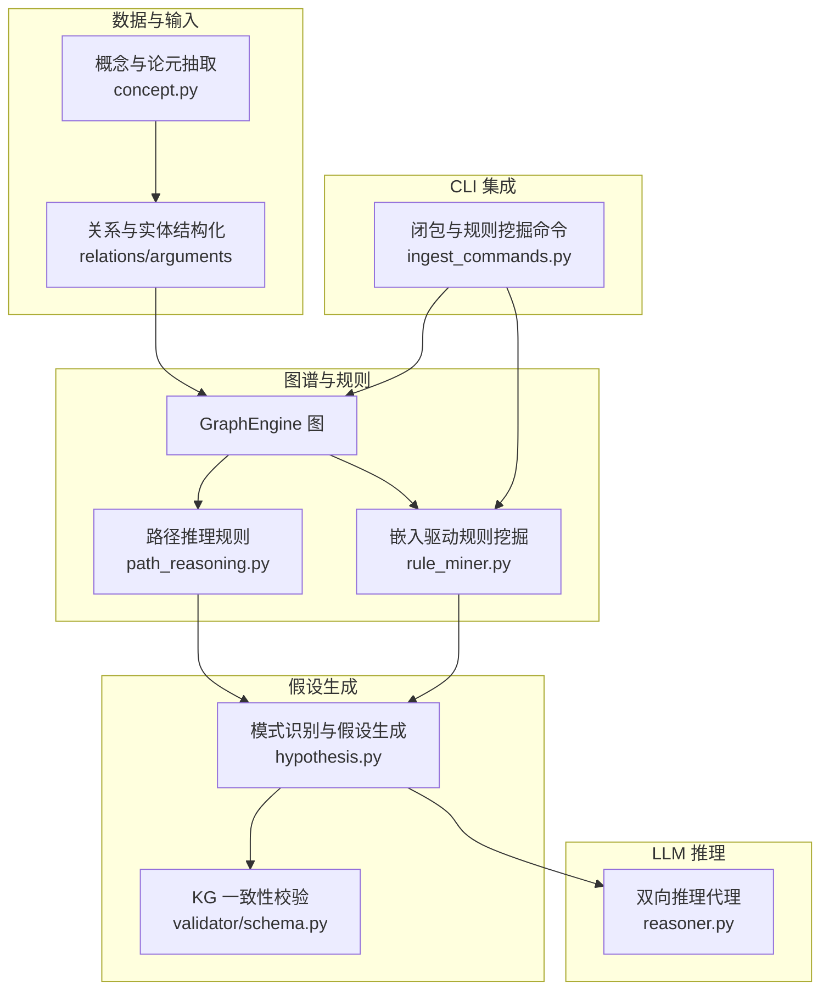
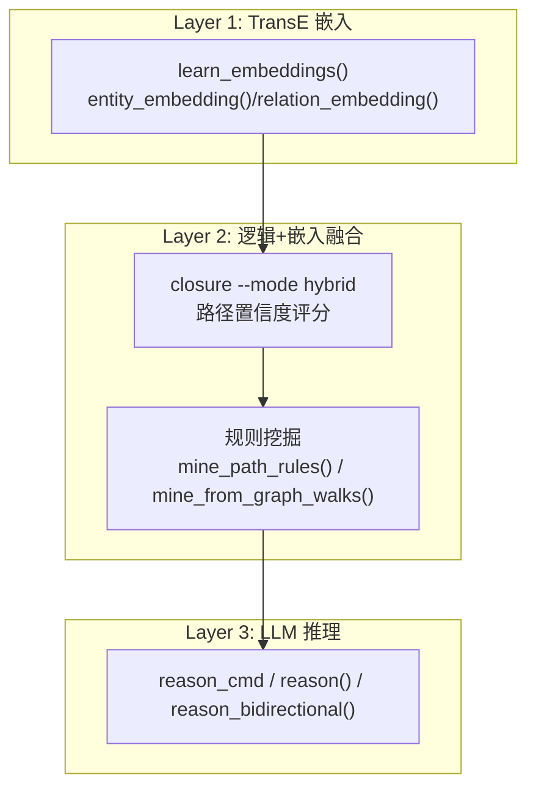
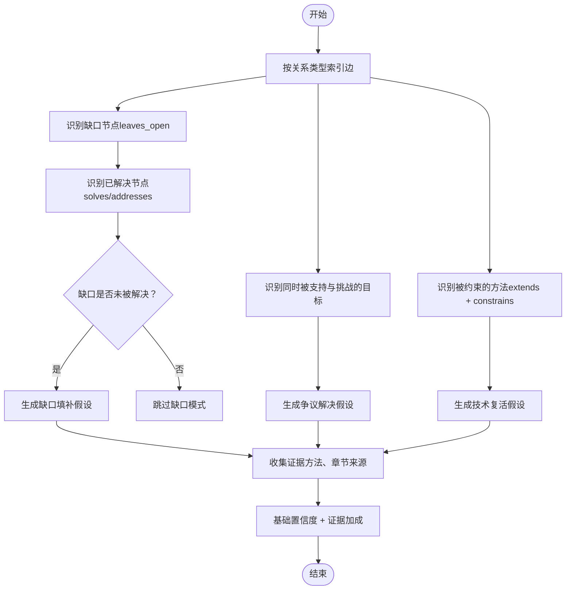
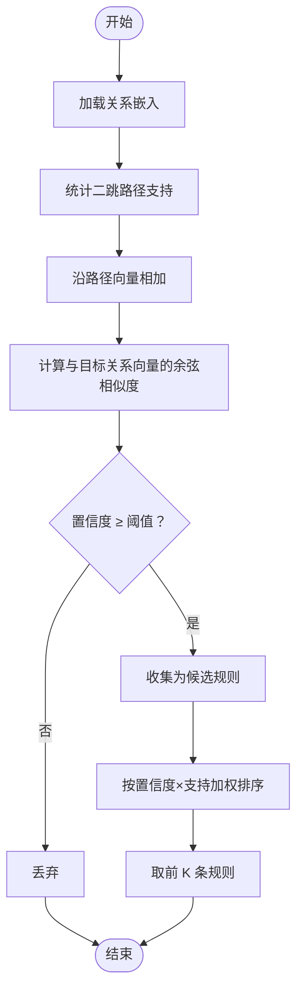
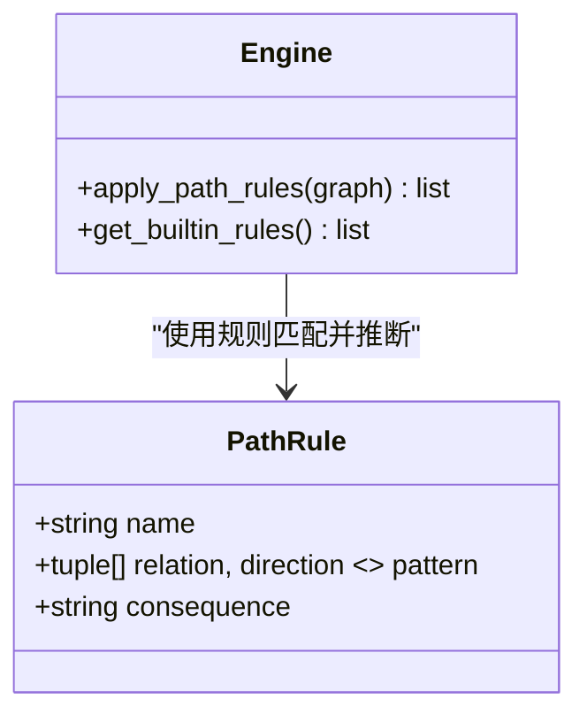
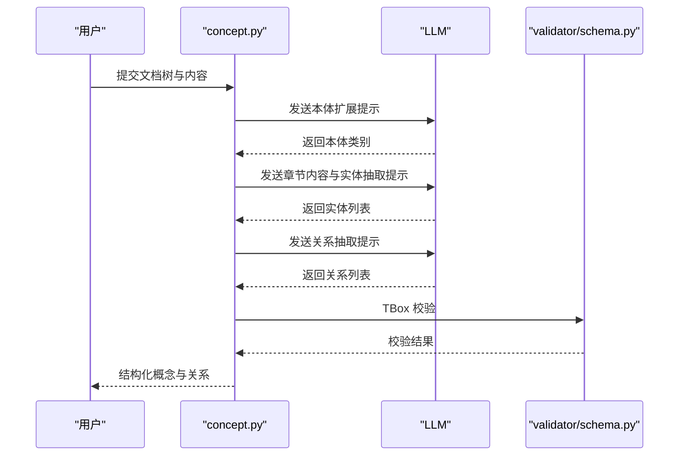
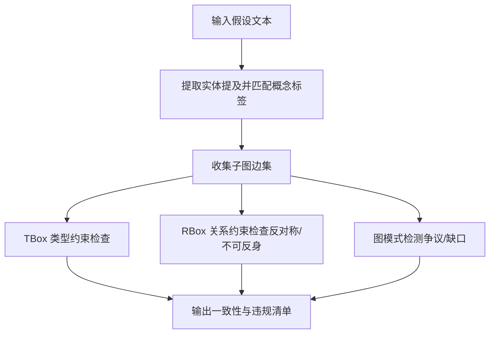
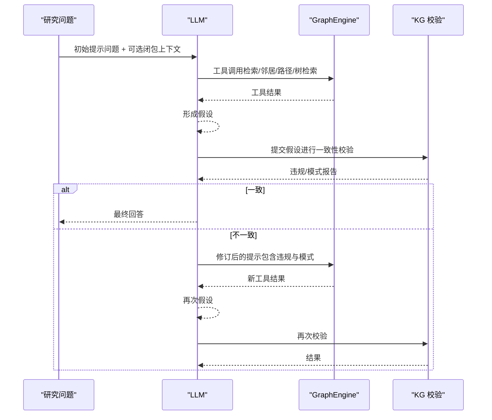
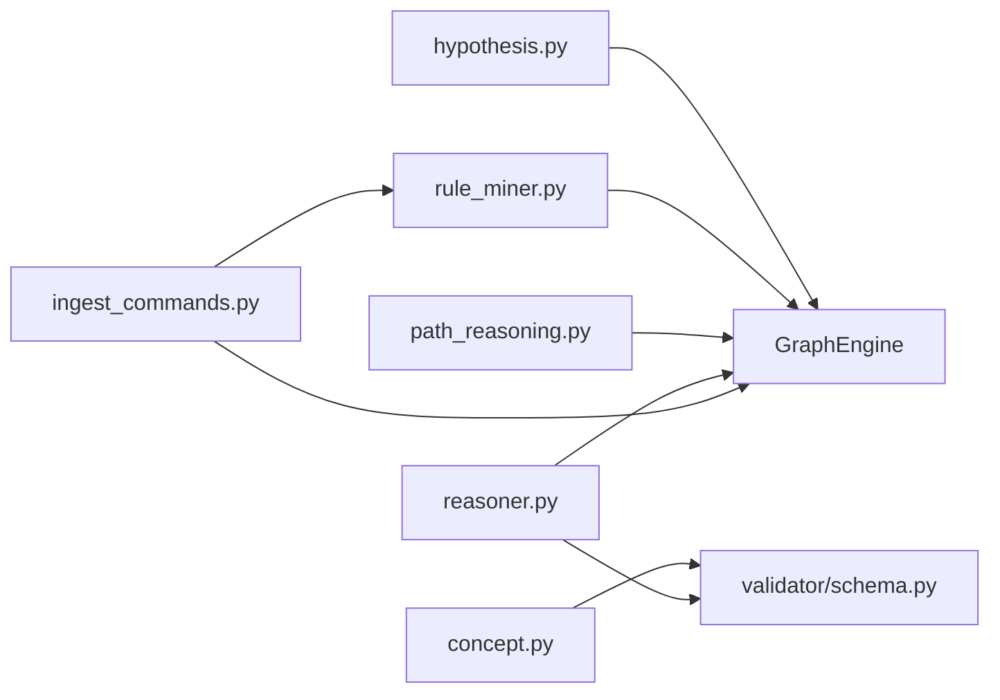

# 假设生成

<cite>
**本文引用的文件**
- [src/drbrain/extractor/hypothesis.py](file://src/drbrain/extractor/hypothesis.py)
- [src/drbrain/extractor/rule_miner.py](file://src/drbrain/extractor/rule_miner.py)
- [src/drbrain/extractor/reasoner.py](file://src/drbrain/extractor/reasoner.py)
- [src/drbrain/graph/path_reasoning.py](file://src/drbrain/graph/path_reasoning.py)
- [src/drbrain/extractor/concept.py](file://src/drbrain/extractor/concept.py)
- [src/drbrain/validator/schema.py](file://src/drbrain/validator/schema.py)
- [src/drbrain/cli/ingest_commands.py](file://src/drbrain/cli/ingest_commands.py)
- [src/drbrain/config.py](file://src/drbrain/config.py)
- [docs/superpowers/specs/2026-05-04-kg-reasoning-design.md](file://docs/superpowers/specs/2026-05-04-kg-reasoning-design.md)
- [tests/test_hypothesis.py](file://tests/test_hypothesis.py)
- [tests/test_rule_miner.py](file://tests/test_rule_miner.py)
- [prompts/extract_concepts.txt](file://prompts/extract_concepts.txt)
</cite>

## 目录
1. [简介](#简介)
2. [项目结构](#项目结构)
3. [核心组件](#核心组件)
4. [架构总览](#架构总览)
5. [详细组件分析](#详细组件分析)
6. [依赖分析](#依赖分析)
7. [性能考虑](#性能考虑)
8. [故障排查指南](#故障排查指南)
9. [结论](#结论)
10. [附录](#附录)

## 简介
本文件系统化阐述 DrBrain 的“假设生成”能力：如何从知识图谱中识别模式、推断关系并生成可验证的研究假设。内容覆盖以下方面：
- 基于现有知识的假设生成算法：包括模式识别（未解决缺口、争议区、技术瓶颈）、关系推断（路径规则、嵌入驱动规则挖掘）与创新性假设构建（LLM 双向推理与一致性校验）。
- 触发条件与生成策略：何时触发、如何抽取证据、如何评分与排序。
- 质量评估机制：证据加成、KG 一致性检查（TBox/RBox）、图模式检测（争议、缺口）。
- 不同类型假设生成方法：基于规则的推断、基于统计的归纳、基于类比的迁移。
- 与现有理论的关系：理论一致性检查、实验设计建议与验证策略制定。

## 项目结构
围绕“假设生成”的关键模块与文件如下：
- 假设生成器：从图谱模式直接生成假设，包含评分与证据来源标注。
- 规则挖掘：基于 TransE 嵌入与图遍历发现路径规则，用于增强图谱与指导假设生成。
- 路径推理：内置多跳路径规则，自动推断新边以丰富图谱。
- 概念抽取与论元：通过 LLM 分层抽取概念、关系与论元，为假设生成提供结构化输入。
- 校验与约束：TBox/RBox 类型与关系约束，确保假设在语义上一致。
- LLM 推理代理：双向推理，先提出假设，再用 KG 校验并迭代修正。
- CLI 集成：通过命令行触发闭包、规则挖掘与推理流程。

图表来源
- [src/drbrain/extractor/concept.py](file://src/drbrain/extractor/concept.py)
- [src/drbrain/graph/path_reasoning.py](file://src/drbrain/graph/path_reasoning.py)
- [src/drbrain/extractor/rule_miner.py](file://src/drbrain/extractor/rule_miner.py)
- [src/drbrain/extractor/hypothesis.py](file://src/drbrain/extractor/hypothesis.py)
- [src/drbrain/validator/schema.py](file://src/drbrain/validator/schema.py)
- [src/drbrain/extractor/reasoner.py](file://src/drbrain/extractor/reasoner.py)
- [src/drbrain/cli/ingest_commands.py](file://src/drbrain/cli/ingest_commands.py)

章节来源
- [src/drbrain/extractor/hypothesis.py](file://src/drbrain/extractor/hypothesis.py)
- [src/drbrain/extractor/rule_miner.py](file://src/drbrain/extractor/rule_miner.py)
- [src/drbrain/graph/path_reasoning.py](file://src/drbrain/graph/path_reasoning.py)
- [src/drbrain/extractor/concept.py](file://src/drbrain/extractor/concept.py)
- [src/drbrain/validator/schema.py](file://src/drbrain/validator/schema.py)
- [src/drbrain/extractor/reasoner.py](file://src/drbrain/extractor/reasoner.py)
- [src/drbrain/cli/ingest_commands.py](file://src/drbrain/cli/ingest_commands.py)

## 核心组件
- 假设生成器（hypothesis.py）
  - 功能：从图谱中识别未解决缺口、争议区、技术瓶颈等模式，生成候选假设，并计算基础置信度与证据加成得分。
  - 关键点：支持可选的“章节映射”，将证据来源标注到具体论文章节；提供“章节内矛盾检测”辅助发现跨节冲突。
- 规则挖掘（rule_miner.py）
  - 功能：基于 TransE 嵌入向量加法（r1 + r2 ≈ r）发现路径规则；同时通过图遍历统计频繁路径作为候选规则。
  - 关键点：支持最小置信度阈值与支持计数加权排序，返回 head/body_path/confidence/support。
- 路径推理（path_reasoning.py）
  - 功能：内置多条路径规则（如“扩展链导致挑战传递”、“问题继承”等），在子图或完整图上匹配并推断新边。
- 概念抽取（concept.py）
  - 功能：分阶段抽取概念、关系与论元，结合树结构与提示词模板，输出结构化结果并进行 TBox 校验。
- 校验与约束（validator/schema.py）
  - 功能：TBox 类型约束与 RBox 关系约束（如不可反身、反对称、传递性），并检测异向边冲突与缺口模式。
- LLM 推理代理（reasoner.py）
  - 功能：工具调用循环，支持检索、邻居查询、路径查找、树检索与 RAPTOR 摘要读取；提供“KG 一致性校验”与“双向推理”流程。
- CLI 集成（ingest_commands.py）
  - 功能：加载图谱、执行闭包、可选地调用规则挖掘并应用推断边，供后续假设生成与推理使用。

章节来源
- [src/drbrain/extractor/hypothesis.py](file://src/drbrain/extractor/hypothesis.py)
- [src/drbrain/extractor/rule_miner.py](file://src/drbrain/extractor/rule_miner.py)
- [src/drbrain/graph/path_reasoning.py](file://src/drbrain/graph/path_reasoning.py)
- [src/drbrain/extractor/concept.py](file://src/drbrain/extractor/concept.py)
- [src/drbrain/validator/schema.py](file://src/drbrain/validator/schema.py)
- [src/drbrain/extractor/reasoner.py](file://src/drbrain/extractor/reasoner.py)
- [src/drbrain/cli/ingest_commands.py](file://src/drbrain/cli/ingest_commands.py)

## 架构总览
三层推理栈（受论文启发）：
- 第一层：TransE 嵌入（实体/关系向量、链接预测、相似度搜索）
- 第二层：逻辑+嵌入融合（路径置信度评分、混合闭包）
- 第三层：LLM 推理代理（工具调用、双向推理、假设生成）

图表来源
- [docs/superpowers/specs/2026-05-04-kg-reasoning-design.md](file://docs/superpowers/specs/2026-05-04-kg-reasoning-design.md)
- [src/drbrain/cli/ingest_commands.py](file://src/drbrain/cli/ingest_commands.py)
- [src/drbrain/extractor/reasoner.py](file://src/drbrain/extractor/reasoner.py)
- [src/drbrain/extractor/rule_miner.py](file://src/drbrain/extractor/rule_miner.py)

章节来源
- [docs/superpowers/specs/2026-05-04-kg-reasoning-design.md](file://docs/superpowers/specs/2026-05-04-kg-reasoning-design.md)
- [src/drbrain/cli/ingest_commands.py](file://src/drbrain/cli/ingest_commands.py)

## 详细组件分析

### 组件一：基于图模式的假设生成（hypothesis.py）
- 模式识别
  - 未解决缺口：若存在“leaves_open”边指向某缺口节点，且该缺口未被任何“solves/addresses”覆盖，则生成“方法可能解决缺口”的候选假设。
  - 争议区：若同一目标节点同时被“supports”和“challenges”指向，生成“需要进一步证据解决”的候选假设，并统计支持/挑战数量与证据来源章节。
  - 技术瓶颈：若某方法曾被“extends”，但其上游存在“constrains”指向的缺口，则生成“在约束放松后可复活该方法”的候选假设。
- 证据与评分
  - 假设包含基础置信度与证据列表；证据每项加成 0.05，上限 0.15；最终得分不超过 1.0。
  - 支持可选的“章节映射”，将证据来源标注到具体论文章节，便于溯源。
- 章节内矛盾检测
  - 对同一结论，若在不同章节出现“supports/challenges”，则记录支持/挑战章节集合，辅助生成“跨节冲突”的证据。

图表来源
- [src/drbrain/extractor/hypothesis.py](file://src/drbrain/extractor/hypothesis.py)

章节来源
- [src/drbrain/extractor/hypothesis.py](file://src/drbrain/extractor/hypothesis.py)
- [tests/test_hypothesis.py](file://tests/test_hypothesis.py)

### 组件二：嵌入驱动的规则挖掘（rule_miner.py）
- 方法概述
  - TransE 向量加法：将路径上的关系向量相加，比较与目标关系向量的余弦相似度，作为路径组合的置信度。
  - 图遍历：统计频繁的二跳关系序列（含并行边与同源同宿多关系），并可选地将路径组合映射到最接近的嵌入关系作为 head。
- 关键函数
  - compose_path：沿路径累加关系向量。
  - mine_path_rules：基于嵌入相似度筛选路径规则，返回 head/body_path/confidence/support。
  - mine_from_graph_walks：通过图遍历统计频繁路径，必要时映射到嵌入空间最佳 head。
- 应用场景
  - 为假设生成提供“路径规则”作为背景知识，例如“若 A 扩展 B，B 解决 C，则 A 可能间接支持 C”。

图表来源
- [src/drbrain/extractor/rule_miner.py](file://src/drbrain/extractor/rule_miner.py)

章节来源
- [src/drbrain/extractor/rule_miner.py](file://src/drbrain/extractor/rule_miner.py)
- [tests/test_rule_miner.py](file://tests/test_rule_miner.py)

### 组件三：路径推理规则（path_reasoning.py）
- 内置规则
  - 方法替代问题：A 替代 B，B 解决问题 C ⇒ A 解决问题 C
  - 挑战链：A 扩展 B，B 挑战结论 C ⇒ A 挑战结论 C
  - 缺口继承：A 扩展 B，B 留下缺口 C ⇒ A 与缺口 C 相关
  - 间接支持：A 扩展 B，B 解决问题 C ⇒ A 解决问题 C
- 匹配与推断
  - 在子图或完整图上构建关系邻接索引，递归扩展链路，去重并返回推断边（src/dst/rel/via）。

图表来源
- [src/drbrain/graph/path_reasoning.py](file://src/drbrain/graph/path_reasoning.py)

章节来源
- [src/drbrain/graph/path_reasoning.py](file://src/drbrain/graph/path_reasoning.py)

### 组件四：概念抽取与论元（concept.py）
- 流程
  - 本体扩展：基于文档树层级与迭代采样扩展概念类别。
  - 实体抽取：按章节优先级与提示词引导抽取问题、方法、结论、争议、缺口、演员等。
  - 关系抽取：基于 TBox 约束连接实体，保留树节点与章节来源。
  - 共指消解：合并重复标签，保持置信度与来源信息。
  - 迭代精炼：可选的迭代修正流程。
- 提示词与模式
  - 使用 prompts/extract_concepts.txt 等模板驱动 LLM 结构化抽取。

图表来源
- [src/drbrain/extractor/concept.py](file://src/drbrain/extractor/concept.py)
- [src/drbrain/validator/schema.py](file://src/drbrain/validator/schema.py)
- [prompts/extract_concepts.txt](file://prompts/extract_concepts.txt)

章节来源
- [src/drbrain/extractor/concept.py](file://src/drbrain/extractor/concept.py)
- [src/drbrain/validator/schema.py](file://src/drbrain/validator/schema.py)
- [prompts/extract_concepts.txt](file://prompts/extract_concepts.txt)

### 组件五：KG 一致性校验与模式检测（validator/schema.py）
- TBox 校验：针对概念类型与关系合法性进行检查。
- RBox 校验：检测反对称、不可反身等关系约束；识别异向边冲突。
- 图模式检测：在子图中识别争议（两实体共同挑战同一目标）与缺口（同类实体间无连边）。

图表来源
- [src/drbrain/validator/schema.py](file://src/drbrain/validator/schema.py)
- [src/drbrain/extractor/reasoner.py](file://src/drbrain/extractor/reasoner.py)

章节来源
- [src/drbrain/validator/schema.py](file://src/drbrain/validator/schema.py)
- [src/drbrain/extractor/reasoner.py](file://src/drbrain/extractor/reasoner.py)

### 组件六：LLM 双向推理与假设生成（reasoner.py）
- 工具定义：概念检索、邻居查询、路径查找、树检索、RAPTOR 摘要等。
- 单轮推理：根据问题生成初始假设，调用工具探索图谱，形成回答。
- 双向推理：先提出假设，用 KG 校验（TBox/RBox 与图模式），若不一致则反馈给 LLM 修订，直至一致或达到最大轮次。
- KG 一致性校验：在 LLM 推理过程中集成 KG 校验，确保假设在语义上与图谱一致。

图表来源
- [src/drbrain/extractor/reasoner.py](file://src/drbrain/extractor/reasoner.py)

章节来源
- [src/drbrain/extractor/reasoner.py](file://src/drbrain/extractor/reasoner.py)

## 依赖分析
- 模块耦合
  - hypothesis.py 依赖 GraphEngine 获取边信息，依赖 section_map 提供证据来源章节标注。
  - rule_miner.py 依赖图引擎与数据库加载嵌入，依赖 _count_path_patterns 统计路径支持。
  - path_reasoning.py 依赖 GraphEngine 或原生 NetworkX 子图进行规则匹配与推断。
  - concept.py 依赖 LLM 客户端与提示词模板，依赖 validator/schema.py 进行 TBox 校验。
  - reasoner.py 依赖 GraphEngine、数据库与工具定义，依赖 validator/schema.py 进行 KG 校验。
- 外部依赖
  - LLM 推理通过 litellm 完成；嵌入与相似度计算依赖 numpy；图操作依赖 NetworkX。
- 循环依赖
  - 当前模块间无明显循环导入；各模块职责清晰，通过 GraphEngine 与数据库进行数据交换。

图表来源
- [src/drbrain/extractor/hypothesis.py](file://src/drbrain/extractor/hypothesis.py)
- [src/drbrain/extractor/rule_miner.py](file://src/drbrain/extractor/rule_miner.py)
- [src/drbrain/graph/path_reasoning.py](file://src/drbrain/graph/path_reasoning.py)
- [src/drbrain/extractor/concept.py](file://src/drbrain/extractor/concept.py)
- [src/drbrain/validator/schema.py](file://src/drbrain/validator/schema.py)
- [src/drbrain/extractor/reasoner.py](file://src/drbrain/extractor/reasoner.py)
- [src/drbrain/cli/ingest_commands.py](file://src/drbrain/cli/ingest_commands.py)

章节来源
- [src/drbrain/extractor/hypothesis.py](file://src/drbrain/extractor/hypothesis.py)
- [src/drbrain/extractor/rule_miner.py](file://src/drbrain/extractor/rule_miner.py)
- [src/drbrain/graph/path_reasoning.py](file://src/drbrain/graph/path_reasoning.py)
- [src/drbrain/extractor/concept.py](file://src/drbrain/extractor/concept.py)
- [src/drbrain/validator/schema.py](file://src/drbrain/validator/schema.py)
- [src/drbrain/extractor/reasoner.py](file://src/drbrain/extractor/reasoner.py)
- [src/drbrain/cli/ingest_commands.py](file://src/drbrain/cli/ingest_commands.py)

## 性能考虑
- 假设生成
  - 基于边索引与集合运算，时间复杂度近似 O(E)，其中 E 为边数；证据加成线性于证据数量。
- 规则挖掘
  - 嵌入相似度计算为 O(R^3·D)（R 为关系数，D 为维度），图遍历统计为 O(N·R·L)，其中 N 为节点数、L 为最大长度。
- 路径推理
  - 关系索引构建 O(E)，匹配过程受规则数量与链长影响，通常为多项式复杂度。
- LLM 推理
  - 工具调用次数与深度决定成本；可通过限制最大轮次与工具调用次数控制开销。
- 存储与缓存
  - 嵌入向量按需加载；提示词模板与配置文件可缓存；数据库连接池与索引优化有助于整体性能。

## 故障排查指南
- 假设生成无结果
  - 检查图谱是否为空或缺少关键关系（如 leaves_open、supports、challenges、extends、constrains）。
  - 确认是否正确传入 section_map 以标注证据来源。
- 规则挖掘无结果
  - 检查嵌入表是否存在足够关系向量；调整最小置信度与最小支持阈值；确认图遍历参数（最大长度、最小支持）。
- KG 校验失败
  - 查看 TBox/RBox 违规原因，修正关系类型或实体类型；检查是否存在异向边冲突。
- LLM 推理卡住
  - 检查模型配置与 API 密钥；确认工具定义与可用性；适当降低最大轮次与工具调用深度。

章节来源
- [src/drbrain/extractor/hypothesis.py](file://src/drbrain/extractor/hypothesis.py)
- [src/drbrain/extractor/rule_miner.py](file://src/drbrain/extractor/rule_miner.py)
- [src/drbrain/validator/schema.py](file://src/drbrain/validator/schema.py)
- [src/drbrain/extractor/reasoner.py](file://src/drbrain/extractor/reasoner.py)

## 结论
DrBrain 的假设生成体系以“图谱模式识别 + 规则挖掘 + LLM 双向推理”为核心，结合 TBox/RBox 与图模式检测，形成从数据到假设再到验证的闭环。该体系既保证了生成假设的可解释性与可追溯性，又通过嵌入与路径规则提升了假设的创新性与覆盖面。建议在实际使用中：
- 明确触发条件（如发现缺口/争议/技术瓶颈）与生成策略（证据加成、章节溯源）。
- 采用混合闭包与规则挖掘增强图谱，提升假设生成质量。
- 将 KG 一致性校验与实验设计建议纳入假设评估流程，确保假设具备可验证性与理论一致性。

## 附录
- 配置参考
  - LLM、嵌入、目录与数据库等配置项位于配置模块，可通过 YAML 加载并解析环境变量。
- 测试参考
  - 假设生成与规则挖掘均有对应测试用例，可作为集成与回归测试的依据。

章节来源
- [src/drbrain/config.py](file://src/drbrain/config.py)
- [tests/test_hypothesis.py](file://tests/test_hypothesis.py)
- [tests/test_rule_miner.py](file://tests/test_rule_miner.py)