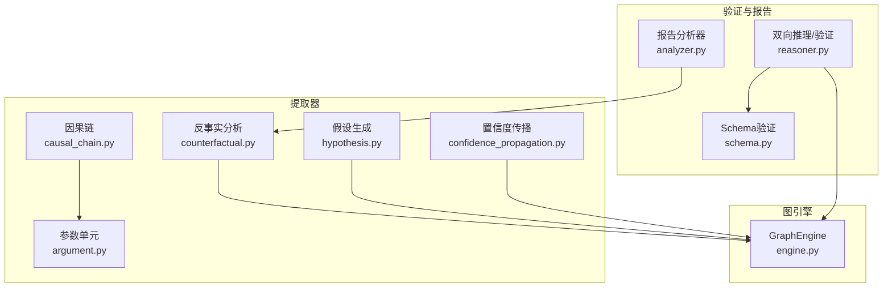
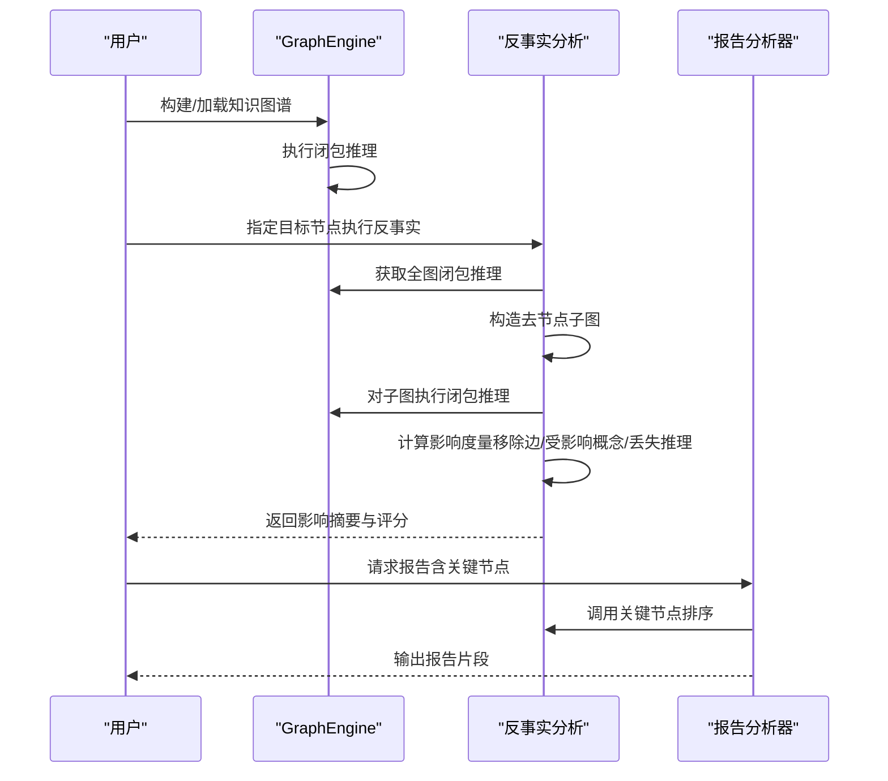
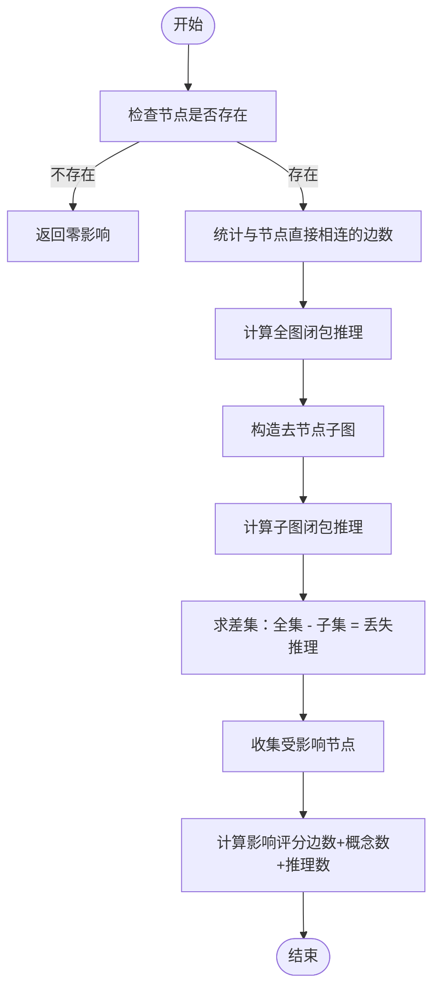
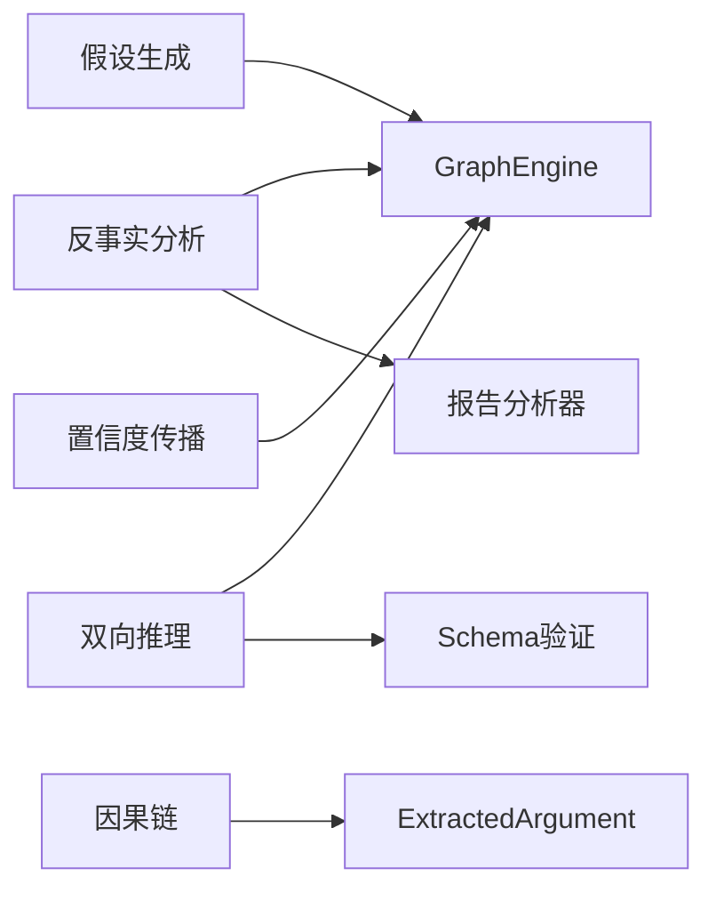

# 反事实分析

<cite>
**本文引用的文件**
- [counterfactual.py](file://src/drbrain/extractor/counterfactual.py)
- [test_counterfactual.py](file://tests/test_counterfactual.py)
- [engine.py](file://src/drbrain/graph/engine.py)
- [analyzer.py](file://src/drbrain/report/analyzer.py)
- [causal_chain.py](file://src/drbrain/extractor/causal_chain.py)
- [hypothesis.py](file://src/drbrain/extractor/hypothesis.py)
- [reasoner.py](file://src/drbrain/extractor/reasoner.py)
- [schema.py](file://src/drbrain/validator/schema.py)
- [confidence_propagation.py](file://src/drbrain/extractor/confidence_propagation.py)
- [argument.py](file://src/drbrain/extractor/argument.py)
</cite>

## 目录
1. [简介](#简介)
2. [项目结构](#项目结构)
3. [核心组件](#核心组件)
4. [架构总览](#架构总览)
5. [详细组件分析](#详细组件分析)
6. [依赖关系分析](#依赖关系分析)
7. [性能考量](#性能考量)
8. [故障排查指南](#故障排查指南)
9. [结论](#结论)
10. [附录](#附录)

## 简介
本文件系统化阐述 DrBrain 中“反事实分析”的理论基础与实现方法，聚焦于“假设场景构建—条件变更—结果预测”三步流程，并结合知识图谱的闭包推理与节点移除模拟，量化评估关键节点对下游影响。文档同时梳理反事实分析在科学假设检验中的应用（可证伪性评估、敏感性分析、稳健性检验），并总结其与传统因果推理（时间维度、潜在结果框架、统计推断）的区别与联系。

## 项目结构
围绕反事实分析的关键模块主要分布在以下路径：
- 反事实核心：src/drbrain/extractor/counterfactual.py
- 图引擎与闭包：src/drbrain/graph/engine.py
- 假设生成与因果链：src/drbrain/extractor/hypothesis.py、src/drbrain/extractor/causal_chain.py
- 验证与KG一致性：src/drbrain/validator/schema.py、src/drbrain/extractor/reasoner.py
- 报告集成：src/drbrain/report/analyzer.py
- 参数与置信度传播：src/drbrain/extractor/confidence_propagation.py、src/drbrain/extractor/argument.py

图表来源
- [counterfactual.py:1-144](file://src/drbrain/extractor/counterfactual.py#L1-L144)
- [engine.py:1-315](file://src/drbrain/graph/engine.py#L1-L315)
- [causal_chain.py:1-238](file://src/drbrain/extractor/causal_chain.py#L1-L238)
- [hypothesis.py:1-198](file://src/drbrain/extractor/hypothesis.py#L1-L198)
- [reasoner.py:439-638](file://src/drbrain/extractor/reasoner.py#L439-L638)
- [schema.py:1-211](file://src/drbrain/validator/schema.py#L1-L211)
- [confidence_propagation.py:1-87](file://src/drbrain/extractor/confidence_propagation.py#L1-L87)
- [argument.py:1-87](file://src/drbrain/extractor/argument.py#L1-L87)
- [analyzer.py:37-76](file://src/drbrain/report/analyzer.py#L37-L76)

章节来源
- [counterfactual.py:1-144](file://src/drbrain/extractor/counterfactual.py#L1-L144)
- [engine.py:1-315](file://src/drbrain/graph/engine.py#L1-L315)

## 核心组件
- 反事实影响度量：通过移除单个节点，比较“全图闭包推理”与“去节点后闭包推理”的差异，统计被移除边数、受影响概念数、丢失的推理关系集合及受影响节点集合。
- 关键节点排序：基于影响度量的加权评分，按影响降序返回前 N 名节点；支持按学术段落权重进行加权（如 Methods/Results 更重要）。
- 闭包与规则：GraphEngine 提供符号式闭包推理，包含多条规则（如 debate 生成、gap_addressed、间接演化等），并支持异方关系检测与路径规则扩展。
- 假设与因果链：从参数单元中抽取机制信息，构建因果链；并基于图模式生成研究假设（缺口填补、争议区、技术悬崖等）。
- 验证与一致性：通过 TBox/RBox 约束与异方关系检测，对假设进行 KG 一致性校验，并识别图模式（争议、缺口）反馈给 LLM 进行迭代修正。

章节来源
- [counterfactual.py:16-144](file://src/drbrain/extractor/counterfactual.py#L16-L144)
- [engine.py:124-315](file://src/drbrain/graph/engine.py#L124-L315)
- [hypothesis.py:82-198](file://src/drbrain/extractor/hypothesis.py#L82-L198)
- [causal_chain.py:63-238](file://src/drbrain/extractor/causal_chain.py#L63-L238)
- [reasoner.py:439-638](file://src/drbrain/extractor/reasoner.py#L439-L638)
- [schema.py:1-211](file://src/drbrain/validator/schema.py#L1-L211)

## 架构总览
下图展示了反事实分析在 DrBrain 中的端到端流程：从知识图谱构建闭包，到反事实节点移除与影响度量，再到关键节点排序与报告集成。

图表来源
- [counterfactual.py:35-96](file://src/drbrain/extractor/counterfactual.py#L35-L96)
- [engine.py:124-315](file://src/drbrain/graph/engine.py#L124-L315)
- [analyzer.py:70-76](file://src/drbrain/report/analyzer.py#L70-L76)

## 详细组件分析

### 反事实分析核心算法
- 输入：GraphEngine 实例与目标节点标签
- 步骤：
  1) 统计与该节点直接相连的边数作为“移除边数”
  2) 计算全图闭包推理集合
  3) 构造去除该节点及其关联边的子图，计算其闭包推理集合
  4) 两集合差集即为“丢失推理”，并收集受影响节点
  5) 影响度量：移除边数 + 受影响概念数 + 丢失推理数量
- 关键函数：
  - run_counterfactual(graph, node)：执行单节点反事实
  - find_critical_nodes(graph, top_n)：按影响排序返回关键节点
  - find_critical_nodes_weighted(graph, section_map, top_n)：按段落权重加权排序

图表来源
- [counterfactual.py:35-96](file://src/drbrain/extractor/counterfactual.py#L35-L96)

章节来源
- [counterfactual.py:35-144](file://src/drbrain/extractor/counterfactual.py#L35-L144)
- [test_counterfactual.py:20-162](file://tests/test_counterfactual.py#L20-L162)

### 图引擎与闭包推理
- 闭包规则（节选）：
  - 支持与挑战共同指向同一结论时，生成“creates_debate”
  - leaves_open 与 addresses 共现生成“gap_addressed”
  - extends 与 replaces 链接生成“indirect_evolution”
  - 多跳路径规则与传递闭包增强
- 闭包模式：
  - 符号式闭包（默认）
  - 混合模式：叠加 TransE 嵌入打分以调整置信度
- 异方关系检测与 TBox/RBox 约束
- 路径规则与置信度传播（含段落加权衰减）

章节来源
- [engine.py:124-315](file://src/drbrain/graph/engine.py#L124-L315)
- [confidence_propagation.py:1-87](file://src/drbrain/extractor/confidence_propagation.py#L1-L87)
- [schema.py:1-211](file://src/drbrain/validator/schema.py#L1-L211)

### 假设生成与因果链
- 假设类型：
  - 缺口填补：未被解决的 Gap 是否可由现有方法填补
  - 争议区：同一结论被支持与挑战，需要进一步证据
  - 技术悬崖：某方法曾活跃扩展但因约束停滞，当前条件可能重启
- 因果链：
  - 基于 ExtractedArgument 的机制字段，构建 Argument→Argument 的链接序列
  - 使用段落顺序启发式进行链路排序与合并

章节来源
- [hypothesis.py:82-198](file://src/drbrain/extractor/hypothesis.py#L82-L198)
- [causal_chain.py:63-238](file://src/drbrain/extractor/causal_chain.py#L63-L238)
- [argument.py:13-87](file://src/drbrain/extractor/argument.py#L13-L87)

### 双向推理与 KG 一致性验证
- LLM→KG 循环：
  - LLM 提出假设
  - KG 提取实体并构建子图，进行 TBox/RBox 与异方关系检测
  - 识别图模式（争议、缺口）并反馈给 LLM
  - 最多 max_rounds 轮迭代，直至一致或达到上限
- KG 验证细节：
  - 通过 DB 或图节点匹配实体
  - TBox：基于概念类型与关系合法性
  - RBox：异方关系检测与传递闭包补全

章节来源
- [reasoner.py:439-638](file://src/drbrain/extractor/reasoner.py#L439-L638)
- [schema.py:1-211](file://src/drbrain/validator/schema.py#L1-L211)

### 报告集成与可视化
- 报告分析器在完整报告中调用 find_critical_nodes，筛选与论文概念相关的“关键节点”，用于展示反事实敏感性分析结果。

章节来源
- [analyzer.py:70-76](file://src/drbrain/report/analyzer.py#L70-L76)

## 依赖关系分析
- 反事实分析依赖 GraphEngine 的闭包能力与子图构造
- 假设生成与因果链依赖 ExtractedArgument 的机制字段
- KG 一致性验证依赖 Schema 的 TBox/RBox 约束与异方关系检测
- 报告集成依赖反事实关键节点排序

图表来源
- [counterfactual.py:1-144](file://src/drbrain/extractor/counterfactual.py#L1-L144)
- [engine.py:1-315](file://src/drbrain/graph/engine.py#L1-L315)
- [hypothesis.py:1-198](file://src/drbrain/extractor/hypothesis.py#L1-L198)
- [causal_chain.py:1-238](file://src/drbrain/extractor/causal_chain.py#L1-L238)
- [reasoner.py:439-638](file://src/drbrain/extractor/reasoner.py#L439-L638)
- [schema.py:1-211](file://src/drbrain/validator/schema.py#L1-L211)
- [confidence_propagation.py:1-87](file://src/drbrain/extractor/confidence_propagation.py#L1-L87)
- [argument.py:1-87](file://src/drbrain/extractor/argument.py#L1-L87)
- [analyzer.py:37-76](file://src/drbrain/report/analyzer.py#L37-L76)

## 性能考量
- 时间复杂度：
  - 反事实：对每个节点执行一次闭包（符号式），整体约为 O(N·(E+V))，其中 N 为节点数，E 为边数，V 为闭包生成的推理边数
  - 关键节点排序：O(N) 闭包 + O(N) 评分 + 排序 O(N log N)
- 空间复杂度：闭包推理与子图构造的空间开销与推理边数成正比
- 优化建议：
  - 闭包增量：仅针对种子节点邻域运行闭包，减少全图扫描
  - 并行化：对不同节点的影响度量可并行计算
  - 缓存：TransE 嵌入与闭包结果缓存复用

[本节为通用性能讨论，不直接分析具体文件]

## 故障排查指南
- 反事实返回零影响
  - 检查节点是否存在于图中
  - 确认闭包规则是否触发推理
- 关键节点为空
  - 图为空或节点数为 0
  - 段落映射缺失导致权重异常
- KG 一致性验证失败
  - TBox：关系与概念类型不匹配
  - RBox：异方关系同时出现或自反关系违规
  - 建议：使用 _kg_validate 的返回结构定位问题并修正假设

章节来源
- [test_counterfactual.py:64-162](file://tests/test_counterfactual.py#L64-L162)
- [reasoner.py:439-638](file://src/drbrain/extractor/reasoner.py#L439-L638)
- [schema.py:63-94](file://src/drbrain/validator/schema.py#L63-L94)

## 结论
DrBrain 的反事实分析通过“移除节点—闭包对比—影响量化”的范式，提供了对知识图谱关键节点的敏感性评估工具。结合假设生成、因果链与双向推理，可实现从“可证伪性评估—敏感性分析—稳健性检验”的闭环，支撑科学假设的系统化验证与迭代改进。

[本节为总结性内容，不直接分析具体文件]

## 附录

### 反事实分析在科学假设检验中的应用
- 可证伪性评估：通过移除关键节点观察推理丢失情况，判断假设对特定证据的依赖程度
- 敏感性分析：对关键节点施加扰动，评估结论稳定性与鲁棒性
- 稳健性检验：在不同段落权重下重复分析，检验结论对证据来源可靠性的依赖

章节来源
- [counterfactual.py:81-144](file://src/drbrain/extractor/counterfactual.py#L81-L144)
- [hypothesis.py:82-198](file://src/drbrain/extractor/hypothesis.py#L82-L198)
- [reasoner.py:583-638](file://src/drbrain/extractor/reasoner.py#L583-L638)

### 反事实分析与传统因果推理的区别
- 时间维度：反事实分析以静态图结构为基础，不显式建模时间序列；传统因果推理常引入时间偏移与潜在结果框架
- 潜在结果框架：反事实通常定义为在不同处理条件下潜在结果的差异；DrBrain 通过“移除节点”模拟处理变化
- 统计推断：反事实常依赖随机对照试验或倾向性评分；DrBrain 采用图模式与规则推断，结合嵌入与置信度传播进行不确定性建模

[本节为概念性说明，不直接分析具体文件]

### 代码示例路径（不含具体代码内容）
- 构建反事实场景与执行对比推理
  - [run_counterfactual:35-78](file://src/drbrain/extractor/counterfactual.py#L35-L78)
  - [find_critical_nodes:81-96](file://src/drbrain/extractor/counterfactual.py#L81-L96)
  - [find_critical_nodes_weighted:116-143](file://src/drbrain/extractor/counterfactual.py#L116-L143)
- 评估假设有效性（KG 一致性与模式检测）
  - [_kg_validate:439-581](file://src/drbrain/extractor/reasoner.py#L439-L581)
  - [validate_tbox:63-74](file://src/drbrain/validator/schema.py#L63-L74)
  - [detect_asymmetric_violations:192-210](file://src/drbrain/validator/schema.py#L192-L210)
- 闭包与规则推理
  - [closure:124-315](file://src/drbrain/graph/engine.py#L124-L315)
  - [ground_rules:317-352](file://src/drbrain/graph/engine.py#L317-L352)