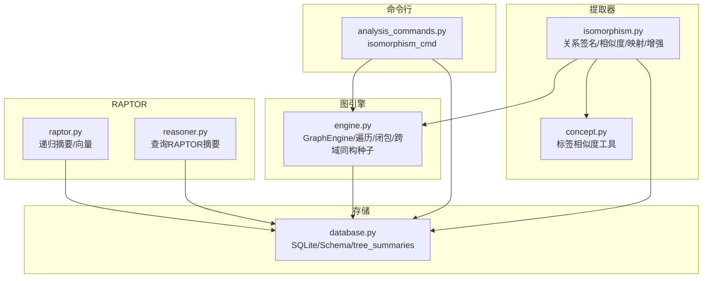
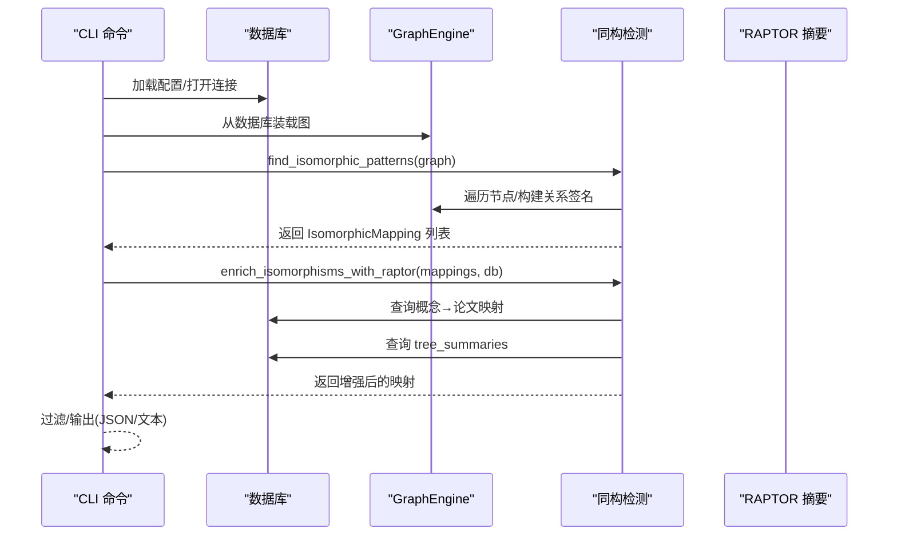
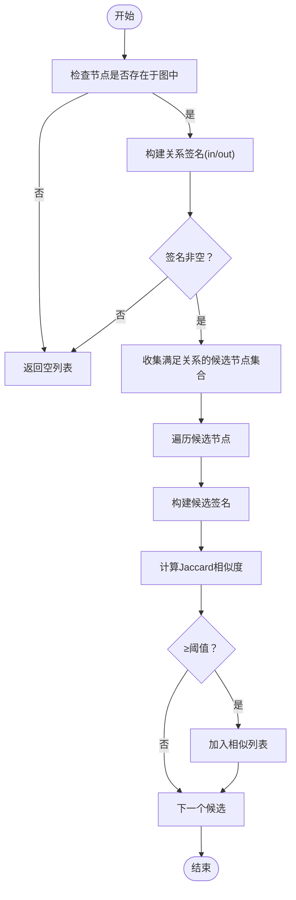
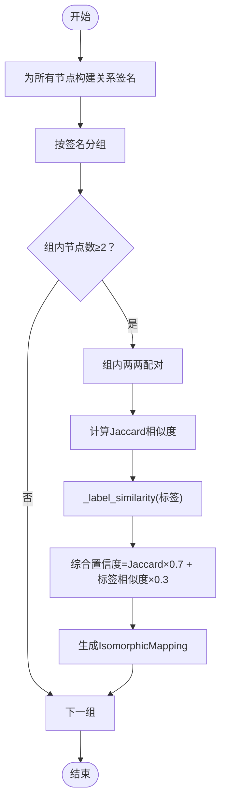
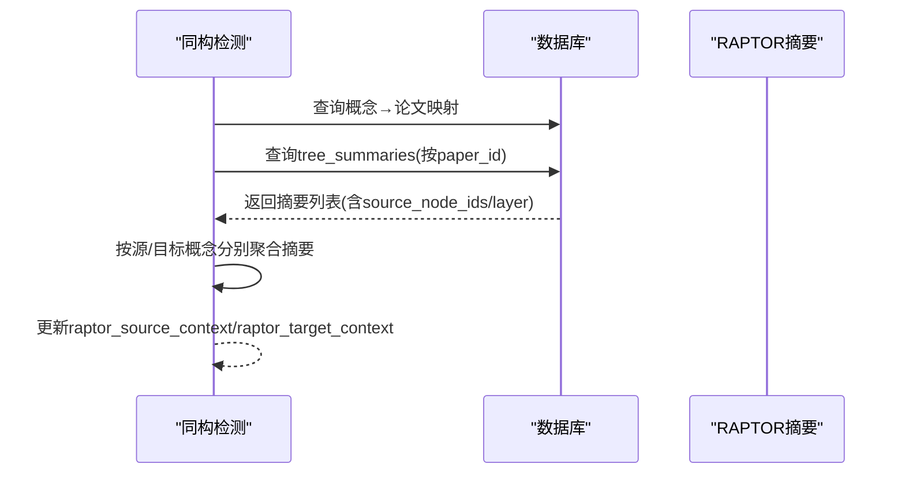
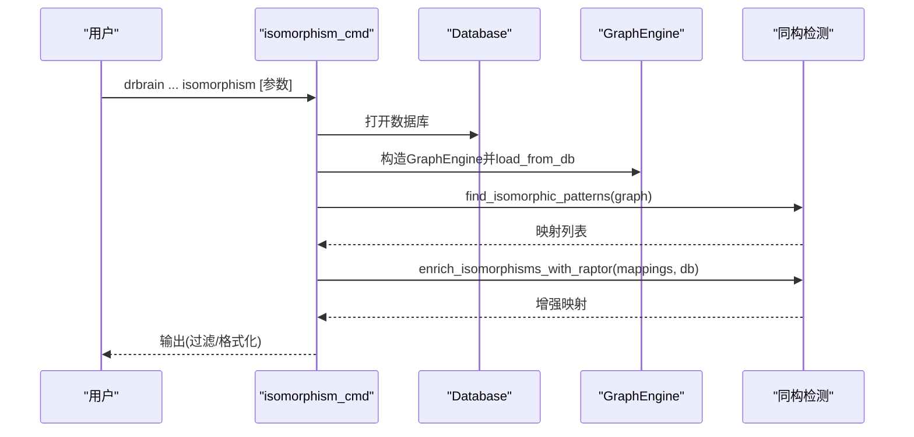
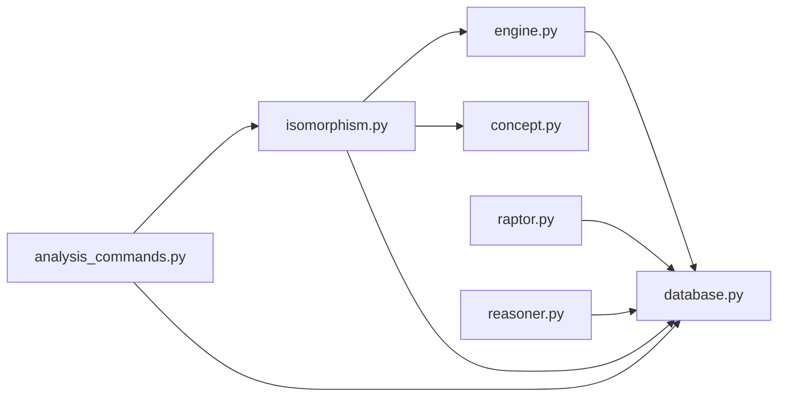

# 同构检测

<cite>
**本文引用的文件**
- [isomorphism.py](file://src/drbrain/extractor/isomorphism.py)
- [test_isomorphism.py](file://tests/test_isomorphism.py)
- [engine.py](file://src/drbrain/graph/engine.py)
- [analysis_commands.py](file://src/drbrain/cli/analysis_commands.py)
- [database.py](file://src/drbrain/storage/database.py)
- [raptor.py](file://src/drbrain/extractor/raptor.py)
- [reasoner.py](file://src/drbrain/extractor/reasoner.py)
- [concept.py](file://src/drbrain/extractor/concept.py)
- [architecture.md](file://docs/architecture.md)
</cite>

## 目录
1. [简介](#简介)
2. [项目结构](#项目结构)
3. [核心组件](#核心组件)
4. [架构总览](#架构总览)
5. [详细组件分析](#详细组件分析)
6. [依赖关系分析](#依赖关系分析)
7. [性能考量](#性能考量)
8. [故障排查指南](#故障排查指南)
9. [结论](#结论)
10. [附录](#附录)

## 简介
本文件系统化阐述 DrBrain 中“同构检测”能力的设计与实现，聚焦于跨领域子图结构相似性的识别与等价性判定。该能力通过“关系签名”对节点的入/出边关系进行统计编码，结合 Jaccard 相似度与标签相似度，从大规模知识图谱中发现结构同构的实体对，并可选地利用 RAPTOR 层次化摘要为这些映射提供跨章节语义上下文，从而支持知识迁移、重复发现与模式识别等应用场景。

## 项目结构
围绕同构检测的关键模块与文件如下：
- 提取器：关系签名构建、相似问题查找、同构模式发现、RAPTOR 上下文增强
- 图引擎：图加载、遍历、规则闭包与跨域同构种子检测
- 命令行：CLI 命令入口，连接数据库与图引擎，输出结果
- 存储：SQLite 模式与表结构，包含 tree_summaries、tree_vectors 等用于 RAPTOR 的中间产物
- RAPTOR：递归语义树构建，生成层次化摘要与向量
- 架构文档：关系语义与推理规则，为同构检测提供背景支撑

图表来源
- [isomorphism.py:1-257](file://src/drbrain/extractor/isomorphism.py#L1-L257)
- [engine.py:33-200](file://src/drbrain/graph/engine.py#L33-L200)
- [analysis_commands.py:550-575](file://src/drbrain/cli/analysis_commands.py#L550-L575)
- [database.py:10-156](file://src/drbrain/storage/database.py#L10-L156)
- [raptor.py:176-349](file://src/drbrain/extractor/raptor.py#L176-L349)
- [reasoner.py:246-261](file://src/drbrain/extractor/reasoner.py#L246-L261)

章节来源
- [isomorphism.py:1-257](file://src/drbrain/extractor/isomorphism.py#L1-L257)
- [engine.py:33-200](file://src/drbrain/graph/engine.py#L33-L200)
- [analysis_commands.py:550-575](file://src/drbrain/cli/analysis_commands.py#L550-L575)
- [database.py:10-156](file://src/drbrain/storage/database.py#L10-L156)
- [raptor.py:176-349](file://src/drbrain/extractor/raptor.py#L176-L349)
- [reasoner.py:246-261](file://src/drbrain/extractor/reasoner.py#L246-L261)

## 核心组件
- 关系签名与相似度
  - 对每个节点，统计其入边/出边的关系类型与计数，形成“关系签名”
  - 使用 Jaccard 相似度衡量两个签名的重叠程度
  - 结合标签相似度计算综合置信度
- 子图匹配与等价性判定
  - 将节点按关系签名分组，组内两两配对，计算置信度
  - 输出 IsomorphicMapping，包含源域、目标域、共享结构描述与置信度
- 预过滤与启发式
  - 仅对存在边的节点构建签名；对候选节点集合先按关系类型筛选
  - 利用 section_map 为签名附加章节维度，提升跨章节结构一致性感知
- RAPTOR 上下文增强
  - 基于映射涉及的概念，回溯其论文，拉取 RAPTOR 层次化摘要作为上下文
  - 为后续 LLM 推理或人工审阅提供跨章节主题线索

章节来源
- [isomorphism.py:35-170](file://src/drbrain/extractor/isomorphism.py#L35-L170)
- [test_isomorphism.py:22-118](file://tests/test_isomorphism.py#L22-L118)
- [test_isomorphism.py:123-201](file://tests/test_isomorphism.py#L123-L201)

## 架构总览
同构检测在 DrBrain 中以“提取器-图引擎-存储-命令行”的链路运行，同时与 RAPTOR 产出的层次化摘要打通，形成“结构相似性识别—语义上下文增强”的闭环。

图表来源
- [analysis_commands.py:550-575](file://src/drbrain/cli/analysis_commands.py#L550-L575)
- [isomorphism.py:111-170](file://src/drbrain/extractor/isomorphism.py#L111-L170)
- [isomorphism.py:173-257](file://src/drbrain/extractor/isomorphism.py#L173-L257)
- [database.py:92-98](file://src/drbrain/storage/database.py#L92-L98)

## 详细组件分析

### 组件 A：关系签名与相似度（_relation_signature、find_similar_problems）
- 功能要点
  - 为给定节点统计入边/出边的关系类型与频次，形成字典签名
  - 支持 section_map 将签名键扩展为“关系@章节”，增强跨章节一致性
  - find_similar_problems 仅在“addresses/solves”关系的目标节点中寻找相似问题，基于 Jaccard 相似度返回候选
- 复杂度与优化
  - 时间复杂度：O(E)，E 为图边数；签名构建对每个节点一次扫描
  - 空间复杂度：O(D)，D 为不同关系类型的数量
  - 预过滤：仅在满足“addresses/solves”关系的目标节点集合中比较，减少候选集规模
- 置信度与阈值
  - 相似度使用 Jaccard；find_similar_problems 支持最小相似度阈值
  - 测试覆盖了相同/不同模式、section-aware 签名等场景

图表来源
- [isomorphism.py:68-108](file://src/drbrain/extractor/isomorphism.py#L68-L108)
- [isomorphism.py:35-65](file://src/drbrain/extractor/isomorphism.py#L35-L65)

章节来源
- [isomorphism.py:35-108](file://src/drbrain/extractor/isomorphism.py#L35-L108)
- [test_isomorphism.py:22-118](file://tests/test_isomorphism.py#L22-L118)

### 组件 B：同构模式发现（find_isomorphic_patterns、IsomorphicMapping）
- 功能要点
  - 为所有存在边的节点构建签名，按签名分组，组内两两配对
  - 计算每对的 Jaccard 相似度与标签相似度，综合置信度=Jaccard×0.7+标签相似度×0.3
  - 输出 IsomorphicMapping，包含源域、目标域、共享结构描述与置信度
- 复杂度与优化
  - 时间复杂度：O(N·log N + C)，N 为节点数，C 为组内配对数；签名分组与两两比较
  - 空间复杂度：O(N·D)，存储每个节点的签名
  - 预过滤：仅对有边节点构建签名，避免孤立节点干扰
- 测试覆盖
  - 空图/单节点/唯一签名/不同置信度等边界与回归测试

图表来源
- [isomorphism.py:111-170](file://src/drbrain/extractor/isomorphism.py#L111-L170)
- [concept.py:1-200](file://src/drbrain/extractor/concept.py#L1-L200)

章节来源
- [isomorphism.py:111-170](file://src/drbrain/extractor/isomorphism.py#L111-L170)
- [test_isomorphism.py:49-91](file://tests/test_isomorphism.py#L49-L91)

### 组件 C：RAPTOR 上下文增强（enrich_isomorphisms_with_raptor）
- 功能要点
  - 基于映射涉及的概念标签，查询其所属论文
  - 从 tree_summaries 表读取 RAPTOR 层次化摘要，按论文聚合
  - 为每个映射补充 raptor_source_context 与 raptor_target_context 字段
- 数据模型
  - tree_summaries：包含 node_id、paper_id、summary_text、source_node_ids、tree_layer
  - tree_vectors：包含 raptor 节点嵌入，用于检索/排序（与增强流程配合）

图表来源
- [isomorphism.py:173-257](file://src/drbrain/extractor/isomorphism.py#L173-L257)
- [database.py:92-98](file://src/drbrain/storage/database.py#L92-L98)
- [reasoner.py:246-261](file://src/drbrain/extractor/reasoner.py#L246-L261)

章节来源
- [isomorphism.py:173-257](file://src/drbrain/extractor/isomorphism.py#L173-L257)
- [database.py:92-98](file://src/drbrain/storage/database.py#L92-L98)
- [reasoner.py:246-261](file://src/drbrain/extractor/reasoner.py#L246-L261)
- [test_isomorphism.py:347-462](file://tests/test_isomorphism.py#L347-L462)

### 组件 D：CLI 命令集成（isomorphism_cmd）
- 功能要点
  - 从配置加载数据库路径，构建 GraphEngine 并从数据库装载图
  - 调用 find_isomorphic_patterns 获取映射，再调用 enrich_isomorphisms_with_raptor 增强
  - 支持按概念过滤与置信度阈值过滤，支持 JSON 输出
- 与图引擎的协作
  - 图引擎负责图的加载与基础遍历；CLI 负责工作流编排与结果输出

图表来源
- [analysis_commands.py:550-575](file://src/drbrain/cli/analysis_commands.py#L550-L575)
- [isomorphism.py:111-170](file://src/drbrain/extractor/isomorphism.py#L111-L170)
- [isomorphism.py:173-257](file://src/drbrain/extractor/isomorphism.py#L173-L257)

章节来源
- [analysis_commands.py:550-575](file://src/drbrain/cli/analysis_commands.py#L550-L575)
- [test_isomorphism.py:262-342](file://tests/test_isomorphism.py#L262-L342)

### 组件 E：图引擎中的跨域同构种子检测
- 功能要点
  - 在图中查找“addresses”关系的目标节点（Problem 类型）及其方法集合
  - 若同一 Problem 下的方法之间无路径连通，则视为跨域同构种子，提示潜在知识迁移机会
- 与同构检测的关系
  - 该检测关注“路径长度>3且无连通”的离散方法对，与关系签名的结构相似性互补

章节来源
- [engine.py:531-572](file://src/drbrain/graph/engine.py#L531-L572)

## 依赖关系分析
- 模块耦合
  - isomorphism.py 依赖 GraphEngine（图遍历/加载）、concept.py（标签相似度）、sqlite3（tree_summaries 查询）
  - CLI 命令依赖 isomorphism.py 与 Database
  - RAPTOR 与 reasoner 提供跨章节摘要数据，增强同构映射的语义可信度
- 外部依赖
  - NetworkX（图结构与遍历）
  - SQLite（持久化存储）
  - scikit-learn、UMAP（RAPTOR 聚类与降维）
  - LLM（RAPTOR 摘要生成）

图表来源
- [isomorphism.py:1-257](file://src/drbrain/extractor/isomorphism.py#L1-L257)
- [engine.py:33-200](file://src/drbrain/graph/engine.py#L33-L200)
- [analysis_commands.py:550-575](file://src/drbrain/cli/analysis_commands.py#L550-L575)
- [database.py:10-156](file://src/drbrain/storage/database.py#L10-L156)
- [raptor.py:176-349](file://src/drbrain/extractor/raptor.py#L176-L349)
- [reasoner.py:246-261](file://src/drbrain/extractor/reasoner.py#L246-L261)

## 性能考量
- 预过滤策略
  - 仅对存在边的节点构建签名，避免孤立节点带来的无效计算
  - find_similar_problems 限定候选集合为“addresses/solves”关系的目标节点，显著缩小搜索空间
- 分组与两两比较
  - 通过签名分组减少配对次数；组内两两比较的时间复杂度为 O(k^2)，k 为组内节点数
- 数据库访问
  - 概念→论文与 RAPTOR 摘要查询采用批量占位符与有序字段，降低 SQL 构造成本
- 并行处理
  - 当前实现未显式使用多进程/多线程；可在大规模图上考虑分批处理、并行签名构建与并行标签相似度计算
- 向量化与索引
  - tree_summaries 与 tree_vectors 已具备索引与向量存储，便于后续引入向量预过滤（如与现有设计一致的“向量增强检索，LLM 决策”原则）

[本节为通用性能讨论，不直接分析具体文件，故无章节来源]

## 故障排查指南
- 空图/单节点无映射
  - 现象：find_isomorphic_patterns 返回空列表
  - 排查：确认图已正确从数据库装载，且至少存在一条边
- 唯一签名导致无配对
  - 现象：节点签名独特，组内少于 2 个节点
  - 排查：检查关系类型与标签是否合理，必要时放宽阈值或启用 section-aware 签名
- RAPTOR 上下文为空
  - 现象：raptor_source_context/raptor_target_context 为空
  - 排查：确认 tree_summaries 是否存在对应论文的摘要；确认概念标签与论文映射正确
- CLI 参数无效
  - 现象：过滤后无输出
  - 排查：调整 --min-confidence 或取消 --concept 过滤；检查 JSON 输出格式

章节来源
- [test_isomorphism.py:65-91](file://tests/test_isomorphism.py#L65-L91)
- [test_isomorphism.py:347-462](file://tests/test_isomorphism.py#L347-L462)
- [analysis_commands.py:550-575](file://src/drbrain/cli/analysis_commands.py#L550-L575)

## 结论
DrBrain 的同构检测以“关系签名+Jaccard 相似度+标签相似度”的组合为核心，实现了对跨领域子图结构相似性的高效识别，并通过 RAPTOR 层次化摘要为映射提供跨章节语义上下文，增强了知识迁移的可信度与可解释性。该方案在工程上具备良好的可扩展性，未来可在大规模图上引入并行化与向量预过滤等优化，进一步提升性能与覆盖范围。

[本节为总结性内容，不直接分析具体文件，故无章节来源]

## 附录

### 应用价值
- 知识融合：识别不同领域中解决同一问题的方法模式，促进跨领域知识迁移
- 重复发现：发现结构相似但标签不同的实体，辅助去重与统一
- 模式识别：自动发现常见问题-方法-支持/挑战等模式，指导研究种子生成与趋势分析

### 关系与规则背景
- 关系语义与推理规则为同构检测提供了语义基础，例如“addresses/solves/supports/challenges/extends/replaces”等关系在图中广泛出现，是构建关系签名与判断结构相似性的关键依据

章节来源
- [architecture.md:90-125](file://docs/architecture.md#L90-L125)