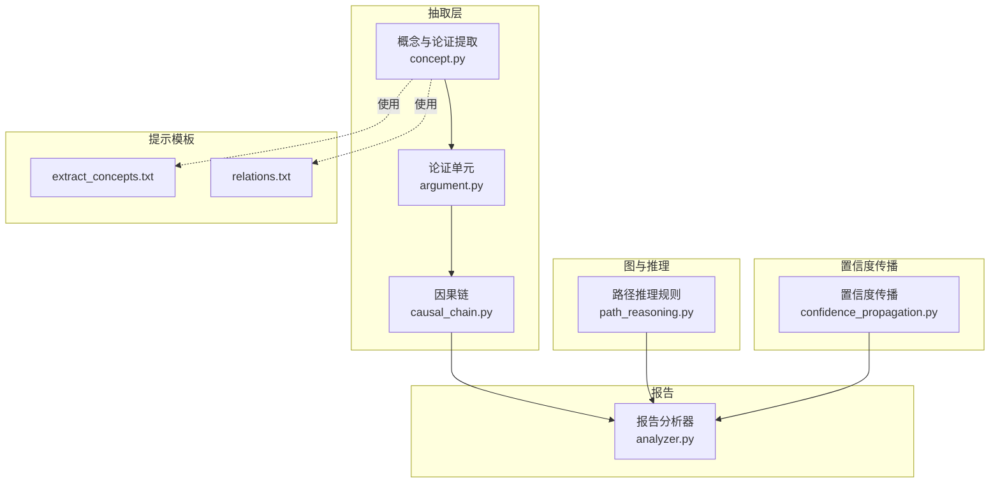
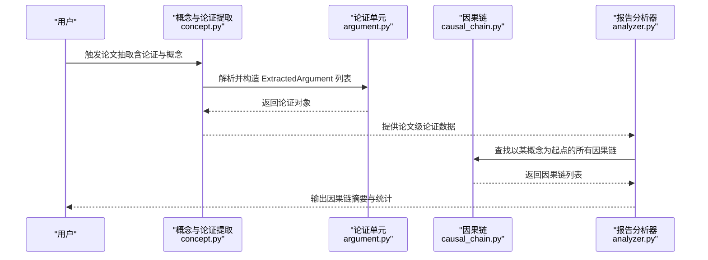
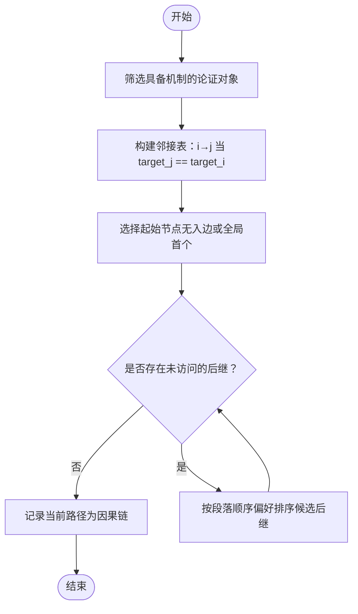
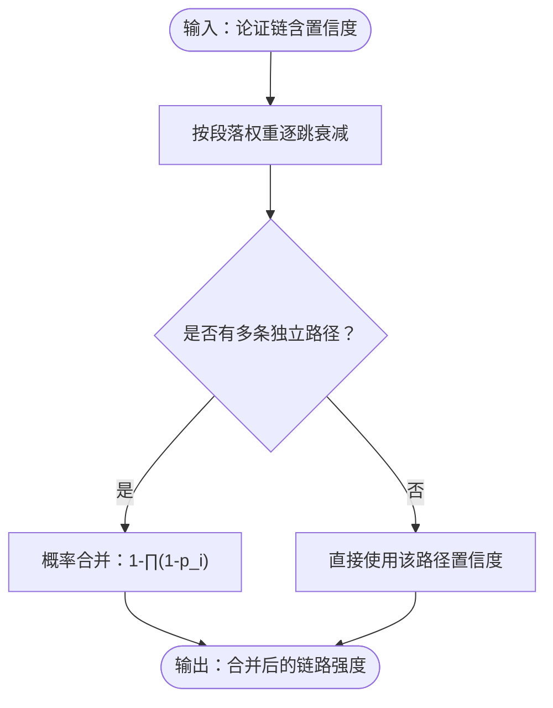
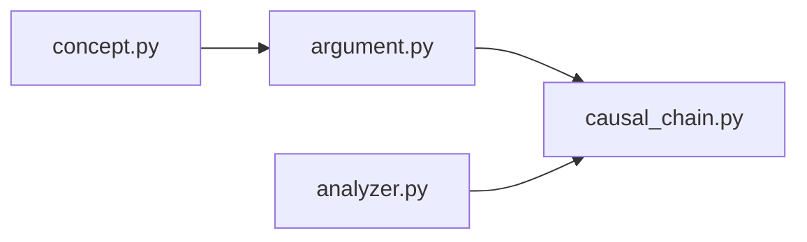

# 因果链分析

<cite>
**本文引用的文件**
- [因果链模块 causal_chain.py](file://src/drbrain/extractor/causal_chain.py)
- [论证单元 argument.py](file://src/drbrain/extractor/argument.py)
- [概念与论证提取 concept.py](file://src/drbrain/extractor/concept.py)
- [路径推理 path_reasoning.py](file://src/drbrain/graph/path_reasoning.py)
- [置信度传播 confidence_propagation.py](file://src/drbrain/extractor/confidence_propagation.py)
- [论文提取提示 extract_concepts.txt](file://prompts/extract_concepts.txt)
- [关系提取提示 relations.txt](file://prompts/relations.txt)
- [因果链测试 test_causal_chain.py](file://tests/test_causal_chain.py)
- [报告分析器 analyzer.py](file://src/drbrain/report/analyzer.py)
</cite>

## 目录
1. [简介](#简介)
2. [项目结构](#项目结构)
3. [核心组件](#核心组件)
4. [架构总览](#架构总览)
5. [详细组件分析](#详细组件分析)
6. [依赖分析](#依赖分析)
7. [性能考量](#性能考量)
8. [故障排查指南](#故障排查指南)
9. [结论](#结论)
10. [附录](#附录)

## 简介
本技术文档围绕 DrBrain 的因果链分析能力展开，系统阐述从学术论文中抽取“论证对象（ExtractedArgument）”到构建“因果链（CausalChain）”的完整流程。重点包括：
- 基于论证机制的目标匹配与有向图构建
- 深度优先搜索（DFS）与广度优先搜索（BFS）在链路查找中的应用
- 数据结构设计：论证单元与因果链的组织方式
- 学术论文段落顺序排序与概念链接策略
- 质量评估与链路强度计算、结果解释方法
- 提供可直接定位到源码的路径示例，便于复用与扩展

## 项目结构
因果链分析位于抽取层（extractor），与概念抽取、关系抽取、置信度传播等模块协同工作，最终服务于报告生成与知识图谱推理。

**图表来源**
- [因果链模块 causal_chain.py:1-238](file://src/drbrain/extractor/causal_chain.py#L1-L238)
- [论证单元 argument.py:1-87](file://src/drbrain/extractor/argument.py#L1-L87)
- [概念与论证提取 concept.py:1-901](file://src/drbrain/extractor/concept.py#L1-L901)
- [路径推理 path_reasoning.py:1-212](file://src/drbrain/graph/path_reasoning.py#L1-L212)
- [置信度传播 confidence_propagation.py:1-87](file://src/drbrain/extractor/confidence_propagation.py#L1-L87)
- [论文提取提示 extract_concepts.txt:1-47](file://prompts/extract_concepts.txt#L1-L47)
- [关系提取提示 relations.txt:1-24](file://prompts/relations.txt#L1-L24)
- [报告分析器 analyzer.py:37-76](file://src/drbrain/report/analyzer.py#L37-L76)

**章节来源**
- [因果链模块 causal_chain.py:1-238](file://src/drbrain/extractor/causal_chain.py#L1-L238)
- [论证单元 argument.py:1-87](file://src/drbrain/extractor/argument.py#L1-L87)
- [概念与论证提取 concept.py:1-901](file://src/drbrain/extractor/concept.py#L1-L901)
- [路径推理 path_reasoning.py:1-212](file://src/drbrain/graph/path_reasoning.py#L1-L212)
- [置信度传播 confidence_propagation.py:1-87](file://src/drbrain/extractor/confidence_propagation.py#L1-L87)
- [论文提取提示 extract_concepts.txt:1-47](file://prompts/extract_concepts.txt#L1-L47)
- [关系提取提示 relations.txt:1-24](file://prompts/relations.txt#L1-L24)
- [报告分析器 analyzer.py:37-76](file://src/drbrain/report/analyzer.py#L37-L76)

## 核心组件
- 论证单元（ExtractedArgument）
  - 字段包含主张、主张类型、目标概念、证据类型/细节、机制、段落、置信度等
  - 用于承载“因果机制”的语义信息，是因果链的基本组成元素
- 因果链（CausalChain）
  - 由多个 ExtractedArgument 组成的序列，表示“X→Y（通过Z）”的因果链
  - 提供摘要输出，展示起止概念与机制串联
- 因果链构建与查询
  - 构建：基于“共享目标概念”的邻接关系，构建有向图并进行 DFS 寻找最大链
  - 查询：按起点概念查找所有起始链；按源/目标概念查找最短因果路径（BFS）

**章节来源**
- [论证单元 argument.py:13-38](file://src/drbrain/extractor/argument.py#L13-L38)
- [因果链模块 causal_chain.py:40-61](file://src/drbrain/extractor/causal_chain.py#L40-L61)
- [因果链模块 causal_chain.py:63-150](file://src/drbrain/extractor/causal_chain.py#L63-L150)
- [因果链模块 causal_chain.py:153-189](file://src/drbrain/extractor/causal_chain.py#L153-L189)
- [因果链模块 causal_chain.py:192-237](file://src/drbrain/extractor/causal_chain.py#L192-L237)

## 架构总览
因果链分析在 DrBrain 中的端到端流程如下：

**图表来源**
- [概念与论证提取 concept.py:28-51](file://src/drbrain/extractor/concept.py#L28-L51)
- [论证单元 argument.py:41-58](file://src/drbrain/extractor/argument.py#L41-L58)
- [因果链模块 causal_chain.py:153-189](file://src/drbrain/extractor/causal_chain.py#L153-L189)
- [报告分析器 analyzer.py:56-68](file://src/drbrain/report/analyzer.py#L56-L68)

## 详细组件分析

### 数据结构与算法设计
- 数据结构
  - ExtractedArgument：承载单个论证单元的全部语义字段
  - CausalChain：按顺序保存一组论证单元，形成“起止概念→机制串联”的因果链
- 链路连接规则
  - 仅考虑具备“机制（mechanism）”字段的论证对象
  - 有向边：若论证 j 的目标（target）与论证 i 的目标相同，则 i 指向 j（共享同一概念视角）
- 路径查找算法
  - DFS：从无入边节点出发，沿邻接关系扩展，收集“最大链”
  - BFS：从源概念出发，寻找目标概念的最短因果路径

**图表来源**
- [因果链模块 causal_chain.py:110-148](file://src/drbrain/extractor/causal_chain.py#L110-L148)

**章节来源**
- [因果链模块 causal_chain.py:63-150](file://src/drbrain/extractor/causal_chain.py#L63-L150)
- [因果链模块 causal_chain.py:153-189](file://src/drbrain/extractor/causal_chain.py#L153-L189)
- [因果链模块 causal_chain.py:192-237](file://src/drbrain/extractor/causal_chain.py#L192-L237)

### 段落顺序排序与概念链接策略
- 段落顺序映射
  - 将“Abstract/Introduction/Related Work/Background/Methods/Experiments/Results/Discussion/Conclusion/Future Work”映射为顺序权重
  - 在 DFS 排序时，优先选择“紧随其后”的段落，使链路遵循论文行文顺序
- 概念链接策略
  - 以“目标（target）”作为链接键：当论证 j 的 target 与论证 i 的 target 相同，认为二者指向同一概念视角，从而建立链路
  - 该策略简化了“主张主体（claim subject）”缺失的情况，避免误连

**章节来源**
- [因果链模块 causal_chain.py:15-37](file://src/drbrain/extractor/causal_chain.py#L15-L37)
- [因果链模块 causal_chain.py:137-142](file://src/drbrain/extractor/causal_chain.py#L137-L142)
- [因果链模块 causal_chain.py:200-207](file://src/drbrain/extractor/causal_chain.py#L200-L207)

### 具体代码示例（路径定位）
以下示例展示如何从提取的论证对象中构建因果链、查找特定概念的因果链以及寻找最短因果路径。请直接跳转至对应源码位置查看实现细节。

- 从论证对象构建因果链
  - [构建函数定义与邻接构建:63-117](file://src/drbrain/extractor/causal_chain.py#L63-L117)
  - [DFS 收集最大链:130-148](file://src/drbrain/extractor/causal_chain.py#L130-L148)
- 查找以某概念为起点的因果链
  - [入口函数与邻接构建:153-170](file://src/drbrain/extractor/causal_chain.py#L153-L170)
  - [DFS 扩展与记录:173-183](file://src/drbrain/extractor/causal_chain.py#L173-L183)
- 寻找最短因果路径（BFS）
  - [BFS 初始化与队列:216-219](file://src/drbrain/extractor/causal_chain.py#L216-L219)
  - [BFS 扩展与终止条件:223-235](file://src/drbrain/extractor/causal_chain.py#L223-L235)

**章节来源**
- [因果链模块 causal_chain.py:63-189](file://src/drbrain/extractor/causal_chain.py#L63-L189)
- [因果链模块 causal_chain.py:192-237](file://src/drbrain/extractor/causal_chain.py#L192-L237)

### 质量评估与链路强度计算
- 置信度传播
  - 单跳衰减：每经过一条链路，置信度乘以衰减因子（默认 0.85）
  - 分段感知衰减：不同段落（如 Methods/Results 保留更好，Discussion/Limitation 更弱）采用不同的衰减系数
  - 多路径合并：多条独立路径通过概率“或”合并（1-∏(1-p_i)），提升整体置信度
- 结果解释
  - 因果链摘要包含“起止概念 + 机制串联”，便于人工审阅
  - 报告分析器限制每篇论文最多输出前若干条因果链，并统计摘要

**图表来源**
- [置信度传播 confidence_propagation.py:31-64](file://src/drbrain/extractor/confidence_propagation.py#L31-L64)
- [置信度传播 confidence_propagation.py:67-86](file://src/drbrain/extractor/confidence_propagation.py#L67-L86)

**章节来源**
- [置信度传播 confidence_propagation.py:1-87](file://src/drbrain/extractor/confidence_propagation.py#L1-L87)
- [报告分析器 analyzer.py:56-68](file://src/drbrain/report/analyzer.py#L56-L68)

### 与论文提取的关系
- 论文提取提示模板明确要求输出“arguments”字段，其中包含“mechanism（因果机制）”和“section（段落）”字段，为因果链构建提供必要语义
- 关系提取阶段会基于概念类型约束生成 typed relations，与因果链共同构成知识图谱的推理基础

**章节来源**
- [论文提取提示 extract_concepts.txt:14-26](file://prompts/extract_concepts.txt#L14-L26)
- [关系提取提示 relations.txt:3-9](file://prompts/relations.txt#L3-L9)

## 依赖分析
- 内部依赖
  - causal_chain.py 依赖 argument.py 提供的 ExtractedArgument 类型
  - concept.py 产出 ExtractedArgument 列表，供 causal_chain.py 使用
  - analyzer.py 在报告生成阶段调用 causal_chain.find_chains_from 进行因果链检索
- 外部依赖
  - 无外部库依赖，纯 Python 实现，便于集成与部署

**图表来源**
- [因果链模块 causal_chain.py:13-13](file://src/drbrain/extractor/causal_chain.py#L13-L13)
- [论证单元 argument.py:13-13](file://src/drbrain/extractor/argument.py#L13-L13)
- [概念与论证提取 concept.py:39-39](file://src/drbrain/extractor/concept.py#L39-L39)
- [报告分析器 analyzer.py:56-56](file://src/drbrain/report/analyzer.py#L56-L56)

**章节来源**
- [因果链模块 causal_chain.py:1-13](file://src/drbrain/extractor/causal_chain.py#L1-L13)
- [论证单元 argument.py:1-7](file://src/drbrain/extractor/argument.py#L1-L7)
- [概念与论证提取 concept.py:1-17](file://src/drbrain/extractor/concept.py#L1-L17)
- [报告分析器 analyzer.py:37-56](file://src/drbrain/report/analyzer.py#L37-L56)

## 性能考量
- 时间复杂度
  - 邻接表构建：O(N^2)，N 为具备机制的论证对象数量
  - DFS/BFS：在最坏情况下可能遍历所有节点，但实际受论文规模与段落顺序约束，通常可接受
- 空间复杂度
  - 邻接表与访问集合占用 O(N^2) 最坏情况，建议在大规模论文上限制并发与链长
- 优化建议
  - 对“目标（target）”进行去重与规范化，减少重复邻接
  - 在 DFS 排序时结合段落顺序权重，减少无效分支
  - 对超长链路设置上限，避免指数爆炸

[本节为通用指导，无需具体文件分析]

## 故障排查指南
- 输入为空
  - 若传入空论证列表，构建与查询函数均返回空结果或 None，属预期行为
  - 参考：[空参数处理:77-79](file://src/drbrain/extractor/causal_chain.py#L77-L79)、[空参数处理:158-161](file://src/drbrain/extractor/causal_chain.py#L158-L161)、[空参数处理:197-199](file://src/drbrain/extractor/causal_chain.py#L197-L199)
- 无机制论证
  - 仅具备机制的论证才会参与链路构建；若全无机制，将返回空链
  - 参考：[机制过滤:77-77](file://src/drbrain/extractor/causal_chain.py#L77-L77)
- 段落顺序异常
  - 未知段落映射为高权重（99），可能导致排序偏差；建议检查段落标题一致性
  - 参考：[段落映射:33-37](file://src/drbrain/extractor/causal_chain.py#L33-L37)
- 路径不存在
  - BFS 无法到达目标概念时返回 None；检查源/目标概念是否出现在 target 中
  - 参考：[BFS 终止条件:226-227](file://src/drbrain/extractor/causal_chain.py#L226-L227)
- 测试验证
  - 单元测试覆盖了典型场景（无机制、断链、长链、段落顺序偏好等），可对照定位问题
  - 参考：[因果链测试:47-213](file://tests/test_causal_chain.py#L47-L213)

**章节来源**
- [因果链模块 causal_chain.py:77-199](file://src/drbrain/extractor/causal_chain.py#L77-L199)
- [因果链模块 causal_chain.py:223-235](file://src/drbrain/extractor/causal_chain.py#L223-L235)
- [因果链测试 test_causal_chain.py:47-213](file://tests/test_causal_chain.py#L47-L213)

## 结论
DrBrain 的因果链分析以“共享目标概念”为核心连接规则，结合段落顺序偏好与 DFS/BFS 算法，在保证可读性的同时高效地从学术论文的论证对象中提炼因果链。配合置信度传播与报告统计，能够为后续的知识图谱推理与研究洞察提供可靠支撑。

[本节为总结性内容，无需具体文件分析]

## 附录

### 术语表
- 论证单元（ExtractedArgument）：由 LLM 抽取的单条学术主张及其语义字段
- 因果链（CausalChain）：由多个论证单元组成的“起止概念→机制串联”的序列
- 机制（mechanism）：解释因果路径的语义描述（如“X 通过减少 Y 改善 Z”）
- 段落（section）：论文结构中的章节名称，用于排序与置信度加权

[本节为通用术语说明，无需具体文件分析]