# 推理引擎核心

<cite>
**本文引用的文件**
- [session_agent.py](file://src/drbrain/extractor/session_agent.py)
- [reasoner.py](file://src/drbrain/extractor/reasoner.py)
- [engine.py](file://src/drbrain/graph/engine.py)
- [causal_chain.py](file://src/drbrain/extractor/causal_chain.py)
- [confidence_propagation.py](file://src/drbrain/extractor/confidence_propagation.py)
- [hypothesis.py](file://src/drbrain/extractor/hypothesis.py)
- [rule_miner.py](file://src/drbrain/extractor/rule_miner.py)
- [queue.py](file://src/drbrain/extractor/queue.py)
- [cache.py](file://src/drbrain/extractor/cache.py)
- [agent.py](file://src/drbrain/extractor/agent.py)
- [agent_tools.py](file://src/drbrain/extractor/agent_tools.py)
- [detection.py](file://src/drbrain/extractor/detection.py)
- [schema.py](file://src/drbrain/validator/schema.py)
- [path_reasoning.py](file://src/drbrain/graph/path_reasoning.py)
- [database.py](file://src/drbrain/storage/database.py)
- [llm_client.py](file://src/drbrain/extractor/llm_client.py)
- [config.py](file://src/drbrain/config.py)
- [session_commands.py](file://src/drbrain/cli/session_commands.py)
</cite>

## 更新摘要
**变更内容**
- 更新推理调度器部分，反映从 ReasonerAgent 到 SessionAgent 的架构升级
- 新增会话管理系统详细说明
- 更新 CLI 命令和工具定义的引用
- 保持其他核心组件文档的准确性

## 目录
1. [引言](#引言)
2. [项目结构](#项目结构)
3. [核心组件](#核心组件)
4. [架构总览](#架构总览)
5. [详细组件分析](#详细组件分析)
6. [依赖分析](#依赖分析)
7. [性能考虑](#性能考虑)
8. [故障排查指南](#故障排查指南)
9. [结论](#结论)
10. [附录](#附录)

## 引言
本文件面向 DrBrain 推理引擎核心模块，系统化阐述其整体架构与关键机制：会话感知推理（SessionAgent）、规则管理（图规则与路径规则）、执行监控（队列与缓存）、结果整合（假设生成、置信度传播）以及与各子系统的集成（因果链分析、双向验证、嵌入与检索）。文档同时给出任务生命周期管理、扩展性设计（插件化构建阶段、可插拔 LLM 模型链）、性能优化策略与排障建议，帮助读者快速理解并高效使用该推理引擎。

## 项目结构
推理引擎位于 src/drbrain 下，围绕"抽取器（extractor）+ 图引擎（graph）+ 存储（storage）+ 校验（validator）"组织：
- 抽取器：负责会话管理（SessionAgent）、构建阶段代理（Ontology/Entities/Relations/Coref/Refine）、因果链、置信度传播、假设生成、规则挖掘、队列与缓存、检测器等。
- 图引擎：基于 NetworkX 的内存图、规则闭包、路径规则、TransE 嵌入学习与预测、研究种子发现。
- 存储：SQLite 数据库封装，提供模式迁移、队列、嵌入、论文/概念/边等表。
- 校验：TBox/RBox 约束、传递闭包、反身/反对称性检测。

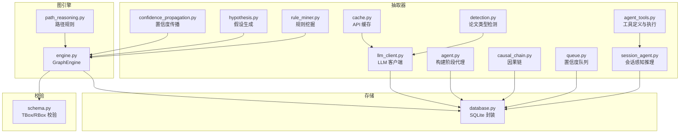

图表来源
- [session_agent.py:38-466](file://src/drbrain/extractor/session_agent.py#L38-L466)
- [agent.py:53-136](file://src/drbrain/extractor/agent.py#L53-L136)
- [causal_chain.py:63-150](file://src/drbrain/extractor/causal_chain.py#L63-L150)
- [confidence_propagation.py:31-87](file://src/drbrain/extractor/confidence_propagation.py#L31-L87)
- [hypothesis.py:82-198](file://src/drbrain/extractor/hypothesis.py#L82-L198)
- [rule_miner.py:33-106](file://src/drbrain/extractor/rule_miner.py#L33-L106)
- [queue.py:10-106](file://src/drbrain/extractor/queue.py#L10-L106)
- [cache.py:14-65](file://src/drbrain/extractor/cache.py#L14-L65)
- [detection.py:110-138](file://src/drbrain/extractor/detection.py#L110-L138)
- [agent_tools.py:15-299](file://src/drbrain/extractor/agent_tools.py#L15-L299)
- [llm_client.py:12-154](file://src/drbrain/extractor/llm_client.py#L12-L154)
- [engine.py:33-122](file://src/drbrain/graph/engine.py#L33-L122)
- [path_reasoning.py:24-56](file://src/drbrain/graph/path_reasoning.py#L24-L56)
- [database.py:159-258](file://src/drbrain/storage/database.py#L159-L258)
- [schema.py:63-95](file://src/drbrain/validator/schema.py#L63-L95)

章节来源
- [engine.py:33-122](file://src/drbrain/graph/engine.py#L33-L122)
- [database.py:159-258](file://src/drbrain/storage/database.py#L159-L258)

## 核心组件
- 会话感知推理器（SessionAgent）
  - 提供工具调用循环，支持概念检索、邻域遍历、路径查找、论文树检索与摘要查询。
  - 支持单轮与双向迭代（LLM 提出假设 → KG 验证一致性 → 反馈修正），内置 KG 一致性校验（TBox/RBox）与模式检测（争议、缺口）。
  - 具备持久化会话管理、跨 CLI 调用上下文连续性、自动上下文压缩功能。
- 图引擎（GraphEngine）
  - 规则闭包：符号规则 + 传递闭包 + 路径规则；可混合 TransE 嵌入打分提升置信度。
  - 研究种子发现：基于图模式与时间维度的热点/停滞/跨域同构等信号。
  - 嵌入学习与预测：TransE 训练、实体相似度、链接预测。
- 因果链分析（causal_chain.py）
  - 从论点机制中提取因果链，按学术段落顺序排序，形成"起始→终点（经由机制…）"的可读摘要。
- 置信度传播（confidence_propagation.py）
  - 单跳衰减、分节衰减因子、多路径合并概率。
- 假设生成（hypothesis.py）
  - 基于未解决缺口、争议区、技术瓶颈、跨域同构等图模式生成研究假设，并评分。
- 规则挖掘（rule_miner.py）
  - 基于 TransE 向量加法近似关系组合，结合图游走统计，挖掘路径规则。
- 队列与缓存（queue.py/cache.py）
  - 基于置信度的路由策略（强置信自动接受、弱置信入队、低置信入队等待人工复核）。
  - 文件缓存（带 TTL）用于 API 响应复用。
- 构建阶段代理（agent.py）
  - 以"阶段代理"形式实现抽取流水线：Ontology/Entities/Relations/Coref/Refine，具备幂等、重试、结构化 I/O 与状态持久化。
- 检测器（detection.py）
  - 论文类型启发式分类，必要时通过 LLM 进行二次判定。
- 校验（schema.py）
  - TBox 类型约束、RBox 关系限制（传递、反对称、反身），并提供传递闭包推断与违例检测。
- 存储（database.py）
  - SQLite 模式管理、迁移、队列、嵌入、论文/概念/边/别名/种子等表，提供演进信号检测。
- 工具定义与执行（agent_tools.py）
  - 提供共享的工具定义和执行逻辑，支持搜索概念、获取邻居、查找路径、文档结构、章节内容、树检索、RAPTOR 摘要等。
- LLM 客户端（llm_client.py）
  - YAML 配置模型链，支持同步/异步调用与失败回退，记录 Token 使用指标。
- 配置（config.py）
  - 统一的类型化配置数据类，支持环境变量解析与本地覆盖合并。

章节来源
- [session_agent.py:38-466](file://src/drbrain/extractor/session_agent.py#L38-L466)
- [engine.py:124-315](file://src/drbrain/graph/engine.py#L124-L315)
- [causal_chain.py:63-150](file://src/drbrain/extractor/causal_chain.py#L63-L150)
- [confidence_propagation.py:31-87](file://src/drbrain/extractor/confidence_propagation.py#L31-L87)
- [hypothesis.py:82-198](file://src/drbrain/extractor/hypothesis.py#L82-L198)
- [rule_miner.py:33-106](file://src/drbrain/extractor/rule_miner.py#L33-L106)
- [queue.py:10-106](file://src/drbrain/extractor/queue.py#L10-L106)
- [cache.py:14-65](file://src/drbrain/extractor/cache.py#L14-L65)
- [agent.py:53-136](file://src/drbrain/extractor/agent.py#L53-L136)
- [detection.py:110-138](file://src/drbrain/extractor/detection.py#L110-L138)
- [schema.py:63-95](file://src/drbrain/validator/schema.py#L63-L95)
- [database.py:159-258](file://src/drbrain/storage/database.py#L159-L258)
- [agent_tools.py:15-299](file://src/drbrain/extractor/agent_tools.py#L15-L299)
- [llm_client.py:12-154](file://src/drbrain/extractor/llm_client.py#L12-L154)
- [config.py:182-292](file://src/drbrain/config.py#L182-L292)

## 架构总览
推理引擎采用"抽取器 + 图引擎 + 存储 + 校验"的分层架构：
- 抽取器负责从论文中抽取概念、关系与论点，形成初始知识图谱。
- 图引擎对图进行规则闭包、路径规则与嵌入增强，输出更丰富的语义边与置信度。
- 校验模块确保图谱满足 TBox/RBox 约束，检测违例与模式。
- 存储模块持久化图谱、队列、嵌入与论文元数据，支撑后续分析与可视化。
- 会话感知推理器在图与文本检索之间穿插，驱动 LLM 进行探索与假设生成，具备持久化会话管理能力。

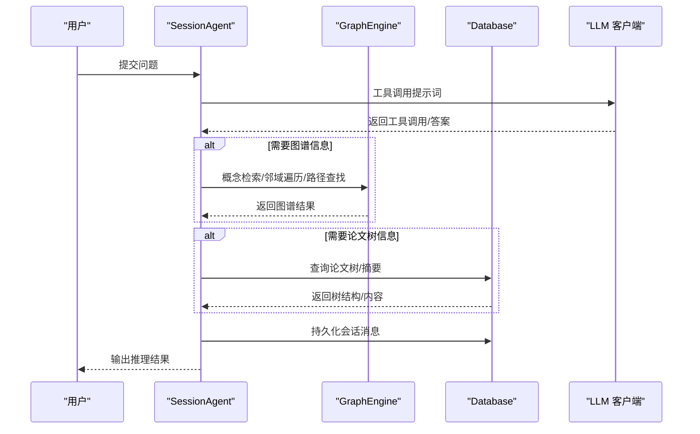

图表来源
- [session_agent.py:195-298](file://src/drbrain/extractor/session_agent.py#L195-L298)
- [engine.py:62-122](file://src/drbrain/graph/engine.py#L62-L122)
- [database.py:534-564](file://src/drbrain/storage/database.py#L534-L564)
- [llm_client.py:92-114](file://src/drbrain/extractor/llm_client.py#L92-L114)

## 详细组件分析

### 会话感知推理器（SessionAgent）
- 工具集：概念检索、邻域遍历、路径查找、论文树结构/内容检索、跨篇树检索、RAPTOR 摘要。
- 会话管理：支持会话创建、加载、删除、持久化，具备跨 CLI 调用的上下文连续性。
- 上下文压缩：当对话超过令牌预算时自动压缩历史消息，保留关键信息。
- 推理循环：LLM 逐步调用工具，收集证据，最终生成回答；支持最大轮次控制与错误兜底。
- 双向验证：先提出假设，再用 KG 校验一致性（TBox/RBox、模式检测），若不一致则反馈修正，直至收敛或达到最大轮次。
- 与图引擎/数据库/存储的协作：通过 GraphEngine 执行图操作，通过 Database 获取论文树与摘要，通过 LLM 客户端完成对话。

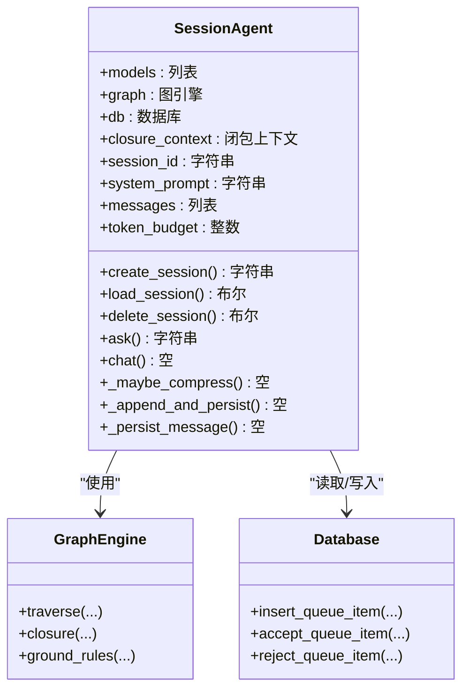

图表来源
- [session_agent.py:38-466](file://src/drbrain/extractor/session_agent.py#L38-L466)
- [engine.py:62-122](file://src/drbrain/graph/engine.py#L62-L122)
- [database.py:534-564](file://src/drbrain/storage/database.py#L534-L564)

章节来源
- [session_agent.py:195-298](file://src/drbrain/extractor/session_agent.py#L195-L298)
- [session_agent.py:341-374](file://src/drbrain/extractor/session_agent.py#L341-L374)

### 图引擎（GraphEngine）
- 规则闭包：内置多条符号规则（如 debate/gap/evolution/网络等），并可结合 TransE 嵌入打分提升置信度。
- 路径规则：预置若干多跳路径规则，匹配链式结构后推断新关系。
- 研究种子：基于图模式与时间维度识别热点、停滞、跨域同构等信号。
- 嵌入能力：训练/加载 TransE 嵌入，支持实体相似度与链接预测。

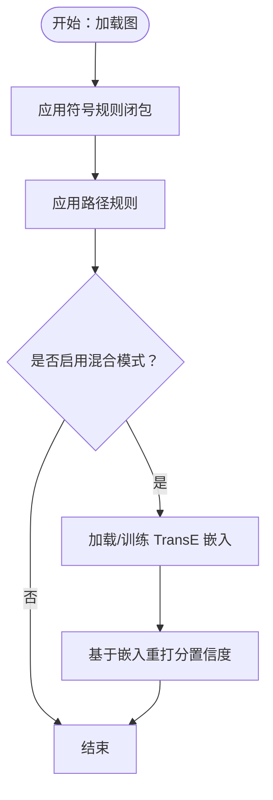

图表来源
- [engine.py:124-315](file://src/drbrain/graph/engine.py#L124-L315)
- [path_reasoning.py:24-56](file://src/drbrain/graph/path_reasoning.py#L24-L56)

章节来源
- [engine.py:124-315](file://src/drbrain/graph/engine.py#L124-L315)
- [path_reasoning.py:131-212](file://src/drbrain/graph/path_reasoning.py#L131-L212)

### 因果链分析（CausalChain）
- 输入：论点集合（含机制字段）。
- 算法：基于目标节点的邻接关系构建链图，DFS/BFS 寻找最大链；按学术段落顺序排序以保证连贯性。
- 输出：链列表，每条链包含起始到终止的概念序列及机制描述。

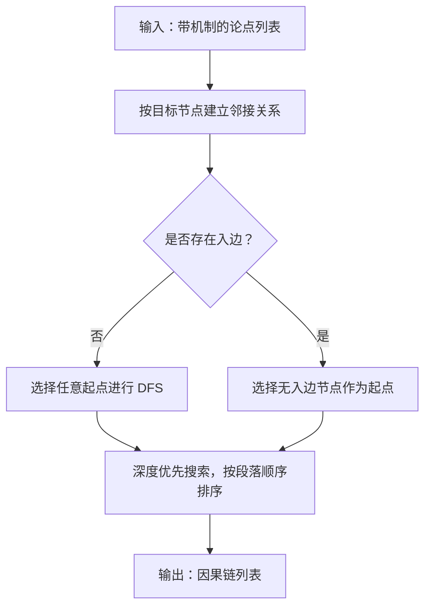

图表来源
- [causal_chain.py:63-150](file://src/drbrain/extractor/causal_chain.py#L63-L150)

章节来源
- [causal_chain.py:63-150](file://src/drbrain/extractor/causal_chain.py#L63-L150)

### 置信度传播（ConfidencePropagation）
- 单跳衰减：默认乘以固定衰减因子。
- 分节衰减：方法/结果段落衰减较小，讨论/综述段落衰减较大。
- 多路径合并：使用概率"或"公式合并独立路径的置信度。

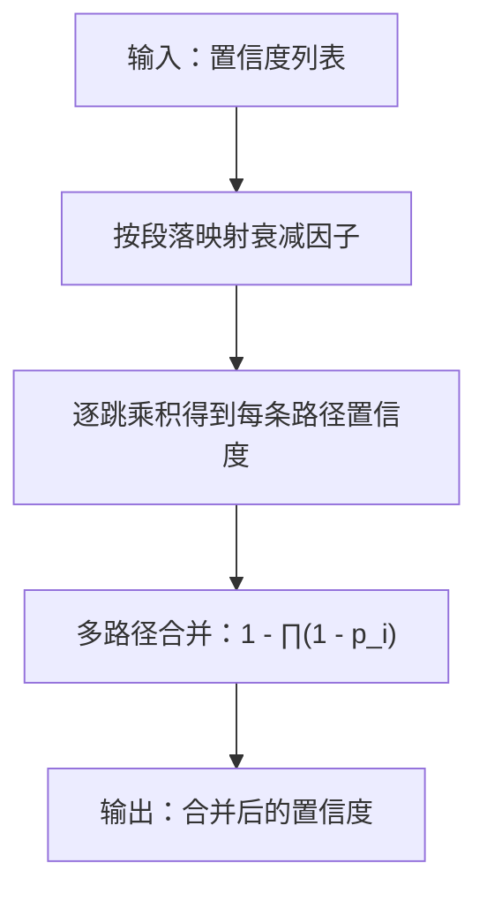

图表来源
- [confidence_propagation.py:31-87](file://src/drbrain/extractor/confidence_propagation.py#L31-L87)

章节来源
- [confidence_propagation.py:31-87](file://src/drbrain/extractor/confidence_propagation.py#L31-L87)

### 假设生成（Hypothesis）
- 输入：图引擎实例与可选的节点到段落映射。
- 逻辑：识别未解决缺口、争议区、技术瓶颈、跨域同构等模式，生成描述性假设并计算基础置信度，附加证据来源。
- 输出：假设列表，含描述、类型、基础置信度与证据清单。

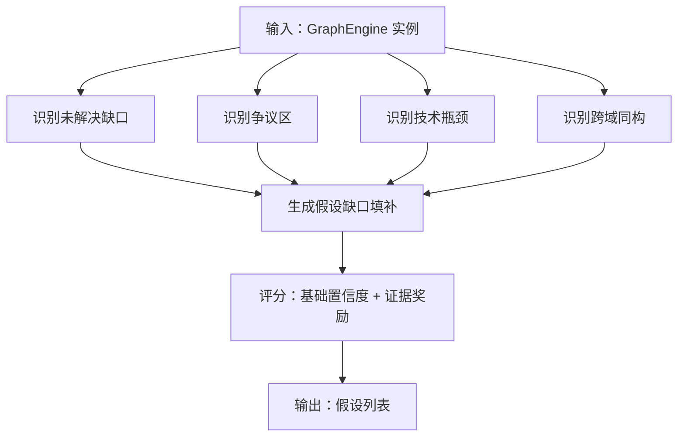

图表来源
- [hypothesis.py:82-198](file://src/drbrain/extractor/hypothesis.py#L82-L198)

章节来源
- [hypothesis.py:82-198](file://src/drbrain/extractor/hypothesis.py#L82-L198)

### 规则挖掘（RuleMiner）
- 方法一：基于 TransE 向量加法近似关系组合，统计支持度，返回高置信度规则。
- 方法二：图游走枚举路径模式，统计频次，可选映射到嵌入空间最近的关系作为头关系。
- 输出：规则列表（头、体路径、置信度、支持度）。

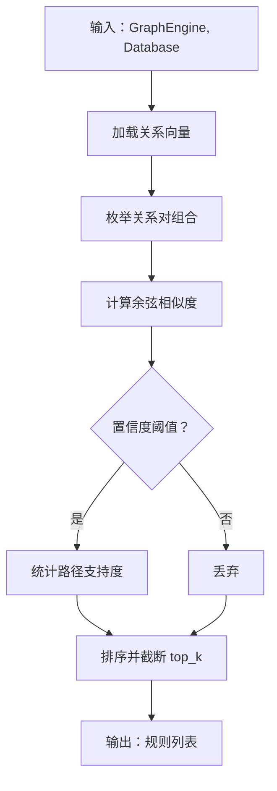

图表来源
- [rule_miner.py:33-106](file://src/drbrain/extractor/rule_miner.py#L33-L106)

章节来源
- [rule_miner.py:33-106](file://src/drbrain/extractor/rule_miner.py#L33-L106)

### 队列与缓存（Queue/Cache）
- 置信度队列：根据阈值自动接受、弱置信入队、低置信入队；支持批量处理与共识触发自动接受。
- API 缓存：文件系统缓存，带 TTL 过期控制，避免重复请求。

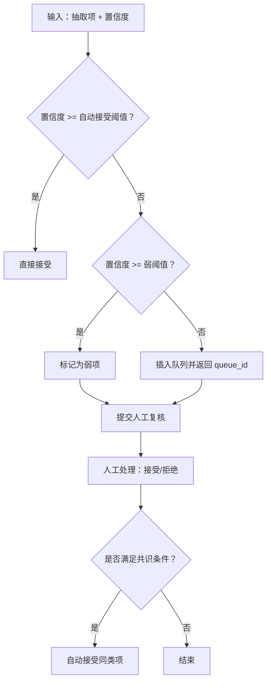

图表来源
- [queue.py:10-106](file://src/drbrain/extractor/queue.py#L10-L106)
- [cache.py:14-65](file://src/drbrain/extractor/cache.py#L14-L65)

章节来源
- [queue.py:10-106](file://src/drbrain/extractor/queue.py#L10-L106)
- [cache.py:14-65](file://src/drbrain/extractor/cache.py#L14-L65)

### 构建阶段代理（BuildAgent）
- 结构化契约：AgentInput/AgentOutput，统一输入输出格式。
- 幂等与重试：通过数据库状态检查避免重复执行，失败时记录状态。
- 阶段化流水线：Ontology/Entities/Relations/Coref/Refine，每个阶段有专用系统提示词与校验逻辑。

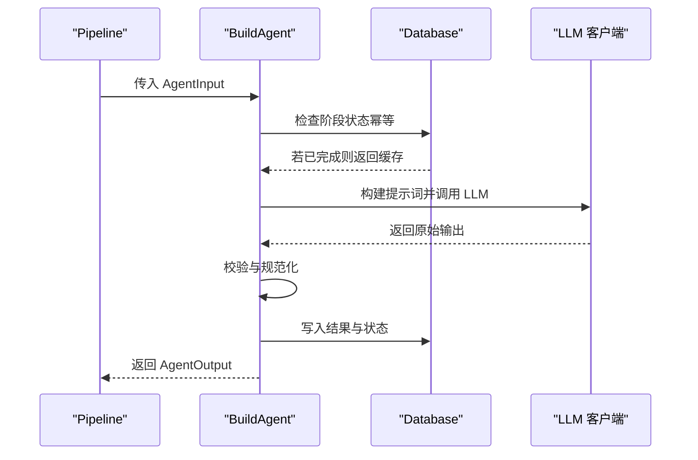

图表来源
- [agent.py:73-136](file://src/drbrain/extractor/agent.py#L73-L136)
- [llm_client.py:92-114](file://src/drbrain/extractor/llm_client.py#L92-L114)
- [database.py:159-258](file://src/drbrain/storage/database.py#L159-L258)

章节来源
- [agent.py:53-136](file://src/drbrain/extractor/agent.py#L53-L136)

### 论文类型检测（Detection）
- 启发式：关键词匹配识别 review/thesis/preprint/book/document。
- LLM：当启发式不确定时，使用 LLM 进行二次判定。

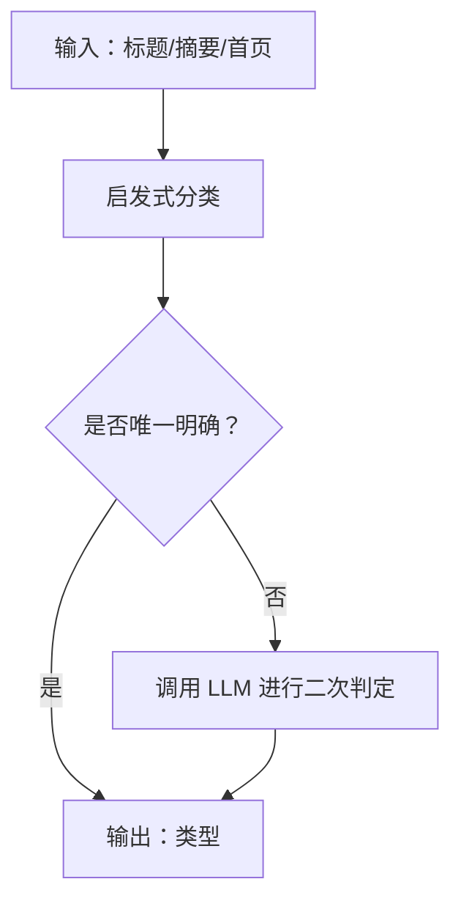

图表来源
- [detection.py:110-138](file://src/drbrain/extractor/detection.py#L110-L138)

章节来源
- [detection.py:110-138](file://src/drbrain/extractor/detection.py#L110-L138)

### 校验（Schema）
- TBox：概念类型允许的关系集合。
- RBox：传递、反对称、反身等关系约束。
- 传递闭包：自动补全 A→B 且 B→C 的 A→C。
- 违例检测：识别反对称关系的双向边等。

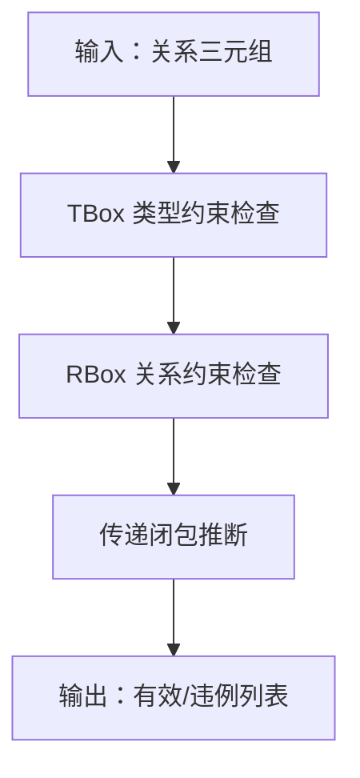

图表来源
- [schema.py:63-95](file://src/drbrain/validator/schema.py#L63-L95)
- [schema.py:140-189](file://src/drbrain/validator/schema.py#L140-L189)
- [schema.py:192-211](file://src/drbrain/validator/schema.py#L192-L211)

章节来源
- [schema.py:63-95](file://src/drbrain/validator/schema.py#L63-L95)
- [schema.py:140-189](file://src/drbrain/validator/schema.py#L140-L189)
- [schema.py:192-211](file://src/drbrain/validator/schema.py#L192-L211)

### 工具定义与执行（AgentTools）
- 工具定义：提供标准的 OpenAI 函数调用格式，包括搜索概念、获取邻居、查找路径、文档结构、章节内容、树检索、RAPTOR 摘要等。
- 工具执行：将工具名称映射到对应的处理器函数，支持不同类型的依赖注入。
- 共享逻辑：从 ReasonerAgent 中提取出来，供 SessionAgent 和其他组件复用。

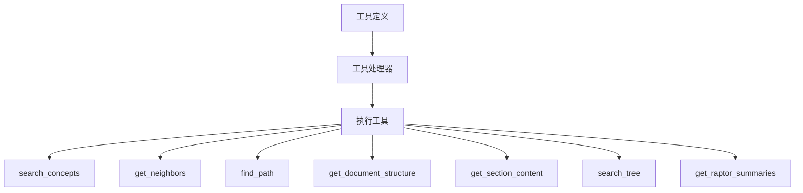

图表来源
- [agent_tools.py:15-299](file://src/drbrain/extractor/agent_tools.py#L15-L299)

章节来源
- [agent_tools.py:15-299](file://src/drbrain/extractor/agent_tools.py#L15-L299)

## 依赖分析
- 会话感知推理器与图引擎：因果链、置信度传播、假设生成依赖图引擎；规则挖掘依赖图与嵌入；队列依赖数据库；缓存独立。
- 工具定义与执行：被会话感知推理器广泛使用，支持同步/异步与回退链。
- 存储：所有模块均通过数据库进行持久化与查询。
- 校验：图引擎与规则挖掘在闭包/路径规则中内嵌校验逻辑。

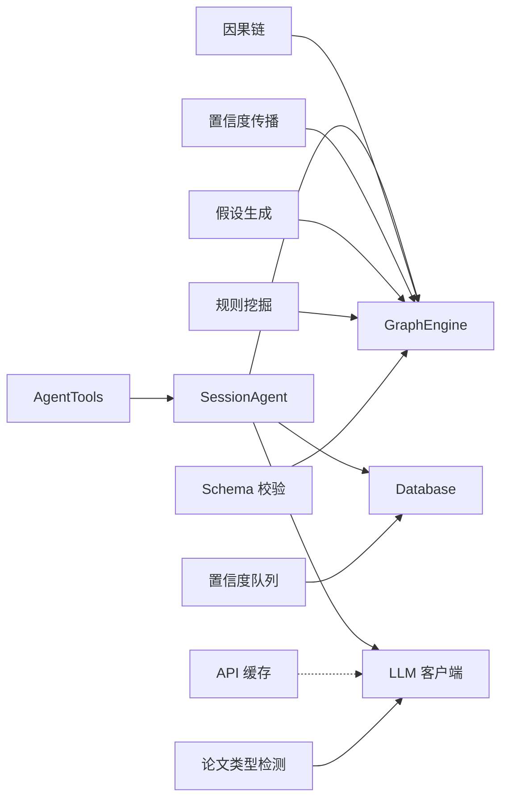

图表来源
- [session_agent.py:195-298](file://src/drbrain/extractor/session_agent.py#L195-L298)
- [engine.py:124-315](file://src/drbrain/graph/engine.py#L124-L315)
- [causal_chain.py:63-150](file://src/drbrain/extractor/causal_chain.py#L63-L150)
- [confidence_propagation.py:31-87](file://src/drbrain/extractor/confidence_propagation.py#L31-L87)
- [hypothesis.py:82-198](file://src/drbrain/extractor/hypothesis.py#L82-L198)
- [rule_miner.py:33-106](file://src/drbrain/extractor/rule_miner.py#L33-L106)
- [queue.py:10-106](file://src/drbrain/extractor/queue.py#L10-L106)
- [cache.py:14-65](file://src/drbrain/extractor/cache.py#L14-L65)
- [detection.py:110-138](file://src/drbrain/extractor/detection.py#L110-L138)
- [schema.py:63-95](file://src/drbrain/validator/schema.py#L63-L95)
- [llm_client.py:12-154](file://src/drbrain/extractor/llm_client.py#L12-L154)
- [database.py:159-258](file://src/drbrain/storage/database.py#L159-L258)
- [agent_tools.py:15-299](file://src/drbrain/extractor/agent_tools.py#L15-L299)

## 性能考虑
- 图操作
  - 使用 BFS/索引加速邻域遍历与路径查找；闭包与路径规则在子图上增量执行，减少全图扫描。
  - 嵌入训练采用增量热启动，避免重复训练。
- 会话管理
  - 自动上下文压缩策略，当消息数量和令牌数超过预算时进行压缩，保留系统消息和最近的消息。
  - 会话持久化采用数据库事务，确保数据一致性。
- LLM 调用
  - 模型链回退，失败快速切换；异步调用降低等待；Token 使用记录便于成本控制。
- 存储
  - SQLite WAL 模式与外键开启；索引覆盖常用查询字段；批处理插入与事务提交。
- 缓存
  - API 响应缓存与 TTL，减少外部依赖抖动带来的延迟。

## 故障排查指南
- 会话管理问题
  - 检查会话 ID 是否正确；确认会话状态不是 deleted；验证模型配置是否正确。
  - 查看会话持久化是否成功，检查 agent_sessions 和 agent_messages 表的状态。
- LLM 调用失败
  - 检查模型链配置与可用性；查看日志中的失败尝试与回退链；确认网络与鉴权参数。
- 图闭包异常
  - 核对关系类型是否在 RBox/TBox 中合法；检查是否存在反对称关系的双向边；确认传递闭包是否正确推断。
- 队列堆积
  - 检查弱阈值与自动接受阈值设置；定期批量处理；关注共识触发逻辑。
- 嵌入缺失
  - 确认嵌入是否已训练或从数据库加载；检查维度与表结构一致性。
- 抽取幂等问题
  - 检查 build_stages 表状态；确认提示词与校验逻辑是否导致反复失败。

章节来源
- [session_agent.py:181-191](file://src/drbrain/extractor/session_agent.py#L181-L191)
- [llm_client.py:66-114](file://src/drbrain/extractor/llm_client.py#L66-L114)
- [schema.py:192-211](file://src/drbrain/validator/schema.py#L192-L211)
- [queue.py:77-106](file://src/drbrain/extractor/queue.py#L77-L106)
- [engine.py:624-671](file://src/drbrain/graph/engine.py#L624-L671)
- [agent.py:151-196](file://src/drbrain/extractor/agent.py#L151-L196)

## 结论
DrBrain 推理引擎通过"抽取器 + 图引擎 + 存储 + 校验"的协同，实现了从论文到知识图谱再到可解释推理的完整闭环。会话感知推理器（SessionAgent）在图与文本检索之间穿插，结合双向验证与 KG 模式检测，显著提升了推理质量与可解释性。架构升级后的 SessionAgent 具备持久化会话管理、跨 CLI 调用上下文连续性和自动上下文压缩功能，为用户提供更好的交互体验。规则闭包、路径规则与嵌入增强进一步丰富了图谱语义。队列与缓存机制保障了工程化落地的稳定性与效率。配置系统与 LLM 客户端提供了灵活的扩展与运维能力。

## 附录
- 任务生命周期管理
  - 创建：通过会话感知推理器或直接调用 SessionAgent。
  - 调度：根据置信度进入自动接受/弱队列/普通队列。
  - 执行：LLM 工具调用 + 图/树检索 + 校验。
  - 监控：队列状态、共识触发、演进信号。
  - 结果：接受入库或人工复核。
- 会话管理要点
  - 会话创建：支持自定义标题、系统提示词和模型配置。
  - 会话加载：支持跨 CLI 调用的上下文恢复。
  - 会话持久化：自动保存消息历史，支持导出和删除。
  - 上下文压缩：当令牌预算不足时自动压缩历史消息。
- 配置与使用要点
  - 模型链：在配置中定义多个模型，实现回退与负载分散。
  - 队列阈值：根据业务容忍度调整弱阈值与自动接受阈值。
  - 嵌入：启用 TransE 混合模式以提升置信度可靠性。
  - 日志与指标：利用 LLM 客户端记录 Token 使用，辅助成本控制与性能评估。

章节来源
- [config.py:182-292](file://src/drbrain/config.py#L182-L292)
- [queue.py:10-32](file://src/drbrain/extractor/queue.py#L10-L32)
- [engine.py:292-315](file://src/drbrain/graph/engine.py#L292-L315)
- [llm_client.py:46-64](file://src/drbrain/extractor/llm_client.py#L46-L64)
- [session_agent.py:64-105](file://src/drbrain/extractor/session_agent.py#L64-L105)
- [session_agent.py:341-374](file://src/drbrain/extractor/session_agent.py#L341-L374)