# 推理引擎模块

<cite>
**本文引用的文件**
- [reasoner.py](file://src/drbrain/extractor/reasoner.py)
- [causal_chain.py](file://src/drbrain/extractor/causal_chain.py)
- [confidence_propagation.py](file://src/drbrain/extractor/confidence_propagation.py)
- [counterfactual.py](file://src/drbrain/extractor/counterfactual.py)
- [isomorphism.py](file://src/drbrain/extractor/isomorphism.py)
- [hypothesis.py](file://src/drbrain/extractor/hypothesis.py)
- [rule_miner.py](file://src/drbrain/extractor/rule_miner.py)
- [argument.py](file://src/drbrain/extractor/argument.py)
- [schema.py](file://src/drbrain/validator/schema.py)
- [test_causal_chain.py](file://tests/test_causal_chain.py)
- [test_confidence_propagation.py](file://tests/test_confidence_propagation.py)
- [test_counterfactual.py](file://tests/test_counterfactual.py)
- [test_isomorphism.py](file://tests/test_isomorphism.py)
- [test_hypothesis.py](file://tests/test_hypothesis.py)
</cite>

## 目录
1. [简介](#简介)
2. [项目结构](#项目结构)
3. [核心组件](#核心组件)
4. [架构总览](#架构总览)
5. [详细组件分析](#详细组件分析)
6. [依赖分析](#依赖分析)
7. [性能考虑](#性能考虑)
8. [故障排查指南](#故障排查指南)
9. [结论](#结论)
10. [附录](#附录)

## 简介
本文件系统性梳理 DrBrain 推理引擎模块，围绕因果链分析、置信度传播、反事实分析、同构检测与假设生成等关键能力，解释其算法实现、数据结构、处理流程与与知识图谱的交互模式。文档同时给出动态推理与结果解释方法、推理质量评估与性能优化策略，并提供可操作的调试技巧。

## 项目结构
推理引擎模块位于 src/drbrain/extractor 下，核心文件包括：
- 因果链：causal_chain.py
- 置信度传播：confidence_propagation.py
- 反事实分析：counterfactual.py
- 同构检测：isomorphism.py
- 假设生成：hypothesis.py
- 规则挖掘：rule_miner.py
- 论证单元：argument.py
- 模式校验：validator/schema.py
- 图推理代理：extractor/reasoner.py（LLM 驱动的工具调用循环）

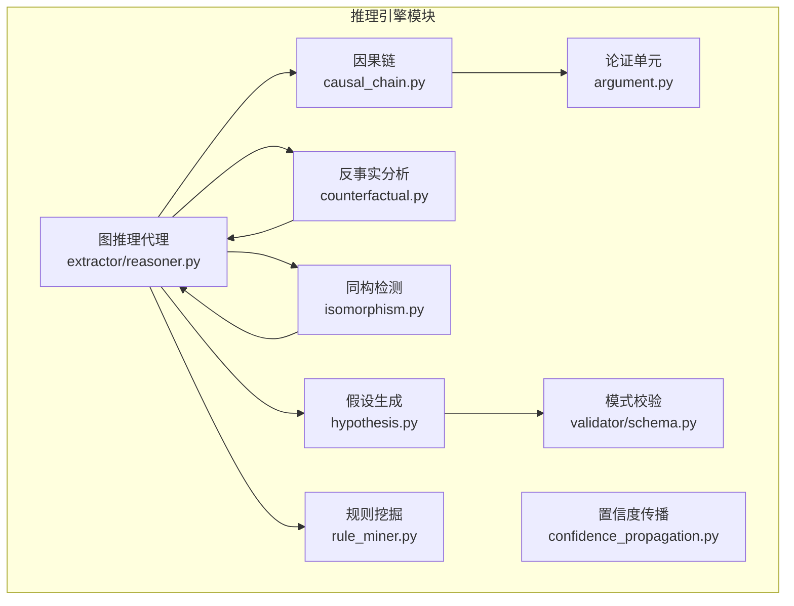

图表来源
- [causal_chain.py:63-150](file://src/drbrain/extractor/causal_chain.py#L63-L150)
- [confidence_propagation.py:31-87](file://src/drbrain/extractor/confidence_propagation.py#L31-L87)
- [counterfactual.py:35-96](file://src/drbrain/extractor/counterfactual.py#L35-L96)
- [isomorphism.py:111-170](file://src/drbrain/extractor/isomorphism.py#L111-L170)
- [hypothesis.py:82-197](file://src/drbrain/extractor/hypothesis.py#L82-L197)
- [rule_miner.py:33-105](file://src/drbrain/extractor/rule_miner.py#L33-L105)
- [argument.py:13-87](file://src/drbrain/extractor/argument.py#L13-L87)
- [schema.py:63-94](file://src/drbrain/validator/schema.py#L63-L94)
- [reasoner.py:25-142](file://src/drbrain/extractor/reasoner.py#L25-L142)

章节来源
- [reasoner.py:16-390](file://src/drbrain/extractor/reasoner.py#L16-L390)
- [causal_chain.py:40-150](file://src/drbrain/extractor/causal_chain.py#L40-L150)
- [confidence_propagation.py:31-87](file://src/drbrain/extractor/confidence_propagation.py#L31-L87)
- [counterfactual.py:35-96](file://src/drbrain/extractor/counterfactual.py#L35-L96)
- [isomorphism.py:111-170](file://src/drbrain/extractor/isomorphism.py#L111-L170)
- [hypothesis.py:82-197](file://src/drbrain/extractor/hypothesis.py#L82-L197)
- [rule_miner.py:33-105](file://src/drbrain/extractor/rule_miner.py#L33-L105)
- [argument.py:13-87](file://src/drbrain/extractor/argument.py#L13-L87)
- [schema.py:63-94](file://src/drbrain/validator/schema.py#L63-L94)

## 核心组件
- 因果链分析：从论证单元中提取“机制”驱动的因果链，支持链构建、路径查找与按学术章节排序。
- 置信度传播：对多跳推断进行不确定性衰减与多路径合并，支持分段加权衰减。
- 反事实分析：模拟移除节点对闭包推理的影响，识别关键节点与影响范围。
- 同构检测：跨域结构相似性发现，结合标签相似度与 Jaccard 相似度综合评分。
- 假设生成：基于图模式（缺口、辩论区、技术悬崖）生成研究假设，带置信度与证据溯源。
- 规则挖掘：基于 TransE 关系向量与图遍历发现路径规则，支持嵌入空间组合与支持计数。
- 模式校验：TBox/RBox 约束验证与传递闭包补全，保证图一致性。
- 图推理代理：以 LLM 工具调用的方式在知识图谱上进行探索式推理，支持双向验证与 KG 校验。

章节来源
- [causal_chain.py:63-238](file://src/drbrain/extractor/causal_chain.py#L63-L238)
- [confidence_propagation.py:31-87](file://src/drbrain/extractor/confidence_propagation.py#L31-L87)
- [counterfactual.py:35-144](file://src/drbrain/extractor/counterfactual.py#L35-L144)
- [isomorphism.py:111-257](file://src/drbrain/extractor/isomorphism.py#L111-L257)
- [hypothesis.py:82-197](file://src/drbrain/extractor/hypothesis.py#L82-L197)
- [rule_miner.py:33-290](file://src/drbrain/extractor/rule_miner.py#L33-L290)
- [schema.py:63-211](file://src/drbrain/validator/schema.py#L63-L211)
- [reasoner.py:16-677](file://src/drbrain/extractor/reasoner.py#L16-L677)

## 架构总览
推理引擎通过“论证单元 → 模式分析 → 规则挖掘 → 置信度传播 → 假设生成 → 反事实验证”的闭环实现动态推理；同时提供 LLM 驱动的工具调用接口，将人类直觉与 KG 结构化约束结合。

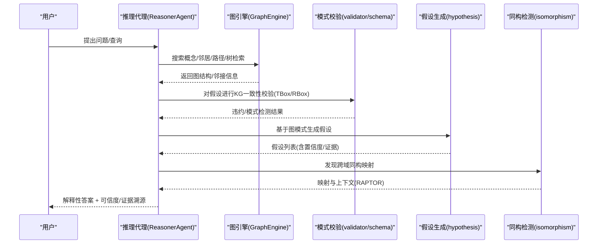

图表来源
- [reasoner.py:282-390](file://src/drbrain/extractor/reasoner.py#L282-L390)
- [reasoner.py:439-581](file://src/drbrain/extractor/reasoner.py#L439-L581)
- [hypothesis.py:82-197](file://src/drbrain/extractor/hypothesis.py#L82-L197)
- [isomorphism.py:111-170](file://src/drbrain/extractor/isomorphism.py#L111-L170)
- [schema.py:63-94](file://src/drbrain/validator/schema.py#L63-L94)

## 详细组件分析

### 因果链分析
- 数据结构：CausalChain 保存链接序列，summary 输出起止与机制串。
- 算法要点：
  - 仅含机制的论证单元参与链构建；
  - 以“目标概念共享”作为边连接，采用 DFS/BFS 寻找最大链与最短路径；
  - 按学术章节顺序排序，优先相邻段落。
- 复杂度：邻接表构建 O(N^2)，DFS/BFS 单次 O(N+E)；排序引入 O(N log N)。

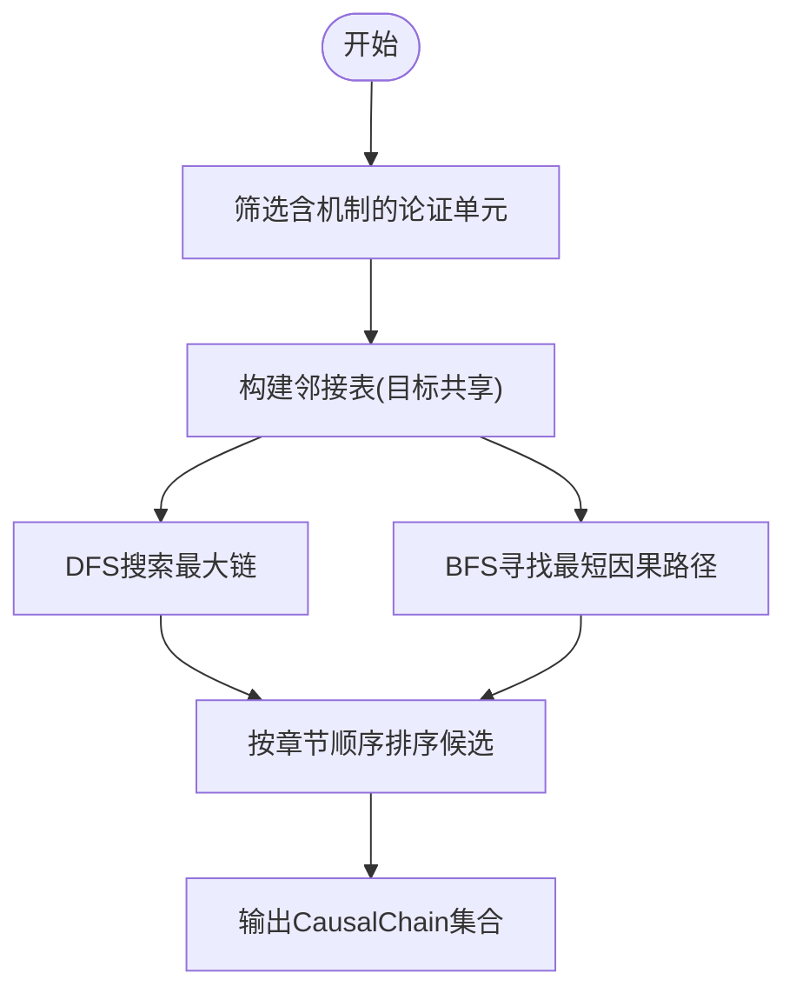

图表来源
- [causal_chain.py:63-150](file://src/drbrain/extractor/causal_chain.py#L63-L150)
- [causal_chain.py:192-238](file://src/drbrain/extractor/causal_chain.py#L192-L238)

章节来源
- [causal_chain.py:40-150](file://src/drbrain/extractor/causal_chain.py#L40-L150)
- [causal_chain.py:153-238](file://src/drbrain/extractor/causal_chain.py#L153-L238)
- [argument.py:13-87](file://src/drbrain/extractor/argument.py#L13-L87)

### 置信度传播
- 单跳衰减：乘以固定衰减因子，默认 0.85；
- 分段加权：方法/结果段衰减更高，讨论/综述段更低；
- 多路径合并：使用概率“或”模型 P=1-∏(1-p_i)，提升独立证据聚合效果。

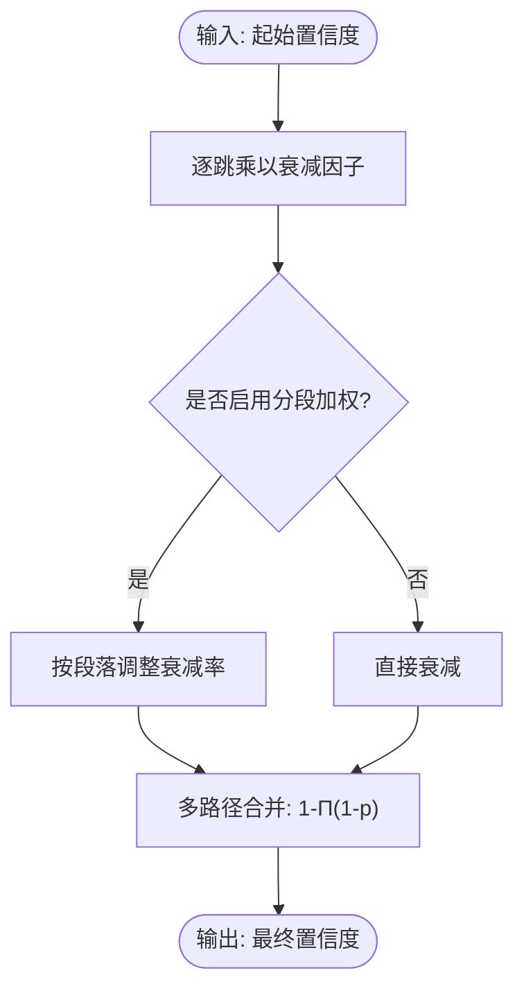

图表来源
- [confidence_propagation.py:31-87](file://src/drbrain/extractor/confidence_propagation.py#L31-L87)

章节来源
- [confidence_propagation.py:31-87](file://src/drbrain/extractor/confidence_propagation.py#L31-L87)

### 反事实分析
- 目标：量化“若移除某节点”的影响，包括删除边数、受影响概念数、丢失的闭包推理关系。
- 方法：比较完整闭包与去节点闭包的差集，统计受影响节点与关系类型。
- 关键函数：run_counterfactual、find_critical_nodes、find_critical_nodes_weighted（分段加权）。

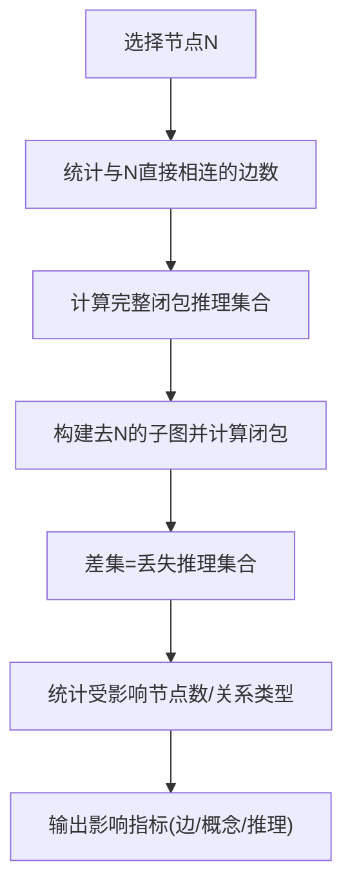

图表来源
- [counterfactual.py:35-96](file://src/drbrain/extractor/counterfactual.py#L35-L96)

章节来源
- [counterfactual.py:35-144](file://src/drbrain/extractor/counterfactual.py#L35-L144)

### 同构检测
- 关系签名：统计每个节点的入/出关系分布，可选加入段落维度（如 in:supports@Methods）。
- 相似度：Jaccard 相似度衡量签名重叠，结合标签相似度形成综合置信度。
- 上下文增强：通过 RAPTOR 层级摘要为映射对提供跨节上下文。

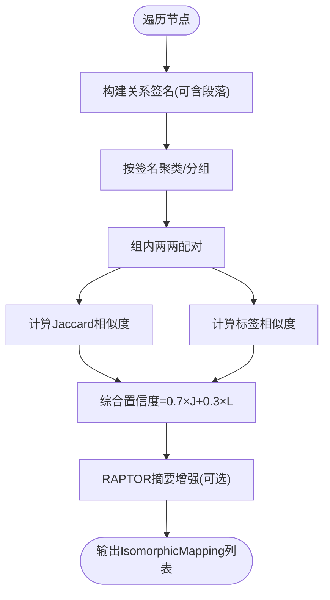

图表来源
- [isomorphism.py:35-170](file://src/drbrain/extractor/isomorphism.py#L35-L170)
- [isomorphism.py:173-257](file://src/drbrain/extractor/isomorphism.py#L173-L257)

章节来源
- [isomorphism.py:111-257](file://src/drbrain/extractor/isomorphism.py#L111-L257)

### 假设生成与论证结构分析
- 模式一：未解决缺口 → “方法M可能解决缺口G”
- 模式二：辩论区 → “需要进一步证据以解决结论C”
- 模式三：技术悬崖 → “在约束G放松后可复活方法M”
- 置信度评分：基础置信度 + 证据项加成（上限 0.15），最高 1.0。
- 证据溯源：可选附带段落来源，便于解释。

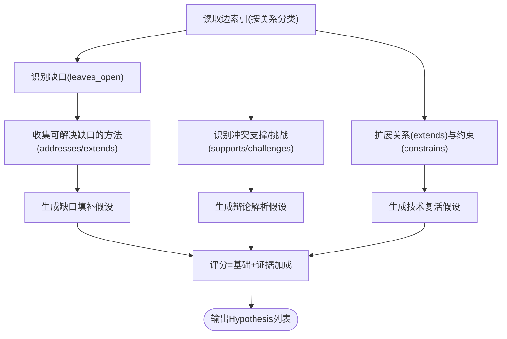

图表来源
- [hypothesis.py:82-197](file://src/drbrain/extractor/hypothesis.py#L82-L197)

章节来源
- [hypothesis.py:18-197](file://src/drbrain/extractor/hypothesis.py#L18-L197)

### 规则挖掘（路径规则）
- 嵌入空间组合：利用 TransE 向量加法近似关系合成，cos_sim 衡量路径头尾一致性。
- 图遍历：枚举路径长度（默认 ≤3），统计关系序列出现频次，必要时映射到最近关系向量。
- 支持计数：对关系对组合进行图中计数，作为规则支持度。

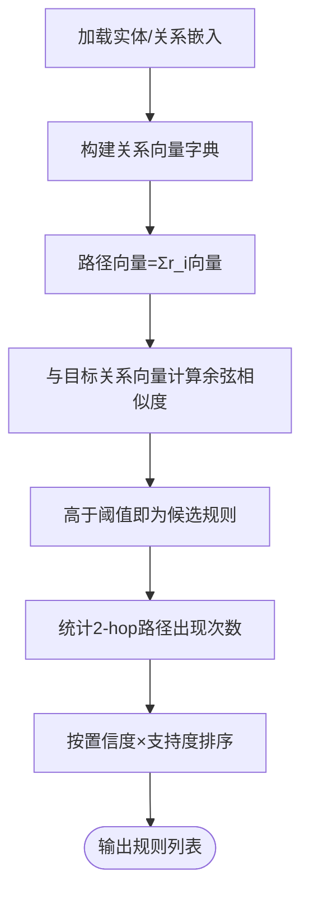

图表来源
- [rule_miner.py:33-105](file://src/drbrain/extractor/rule_miner.py#L33-L105)
- [rule_miner.py:137-197](file://src/drbrain/extractor/rule_miner.py#L137-L197)

章节来源
- [rule_miner.py:33-290](file://src/drbrain/extractor/rule_miner.py#L33-L290)

### 模式校验与逻辑推理
- TBox：概念类型允许的关系集合，用于关系合法性检查；
- RBox：传递性、反对称性、非自反性等关系约束；
- 传递闭包补全：对声明为传递的关系自动补全缺失链路；
- 异步关系检测：检测 A rel B 与 B rel A 同时存在等违例。

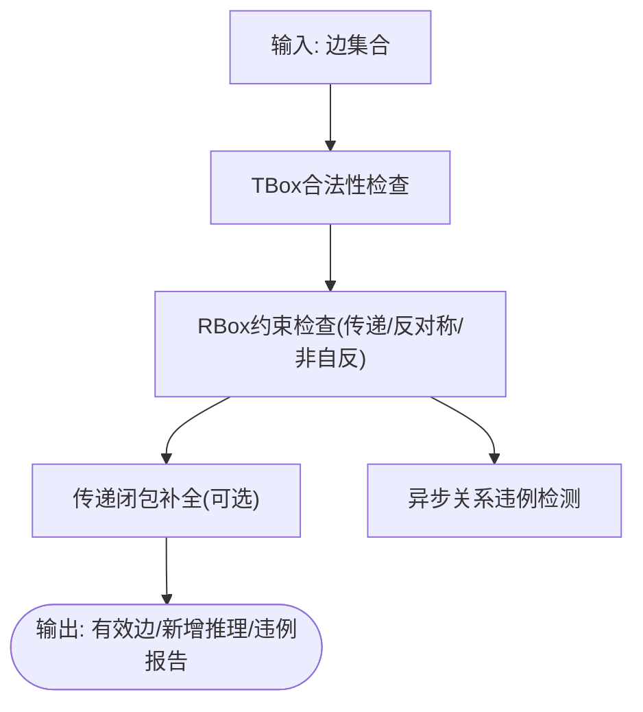

图表来源
- [schema.py:63-211](file://src/drbrain/validator/schema.py#L63-L211)

章节来源
- [schema.py:63-211](file://src/drbrain/validator/schema.py#L63-L211)

### 动态推理与 KG 交互（ReasonerAgent）
- 工具定义：概念检索、邻居查询、路径查找、论文树检索、RAPTOR 摘要等；
- 推理循环：LLM 提出假设 → KG 校验（TBox/RBox/模式）→ 反馈修正 → 迭代收敛；
- 结果解释：系统提示词强调逐步解释，支持“逻辑闭包”上下文注入。

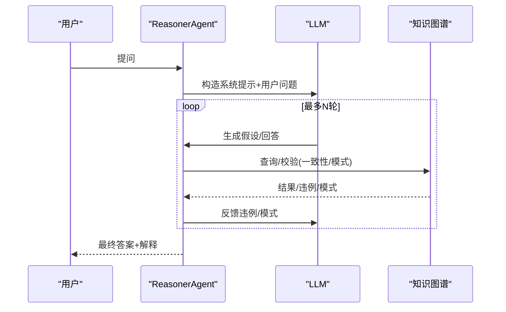

图表来源
- [reasoner.py:282-390](file://src/drbrain/extractor/reasoner.py#L282-L390)
- [reasoner.py:583-677](file://src/drbrain/extractor/reasoner.py#L583-L677)

章节来源
- [reasoner.py:16-677](file://src/drbrain/extractor/reasoner.py#L16-L677)

## 依赖分析
- 组件耦合：
  - 因果链依赖论证单元（argument）的目标字段；
  - 假设生成依赖图边索引与段落映射；
  - 反事实与同构检测依赖图引擎（GraphEngine）；
  - 规则挖掘依赖嵌入加载与图遍历；
  - 模式校验贯穿各模块，保障一致性。
- 外部依赖：
  - LLM 调用（litellm）、网络库（networkx）、数据库访问（sqlite）等。

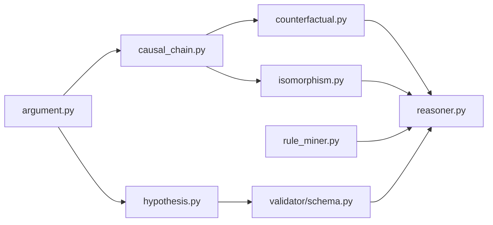

图表来源
- [argument.py:13-87](file://src/drbrain/extractor/argument.py#L13-L87)
- [causal_chain.py:13-13](file://src/drbrain/extractor/causal_chain.py#L13-L13)
- [hypothesis.py:15-15](file://src/drbrain/extractor/hypothesis.py#L15-L15)
- [counterfactual.py:13-13](file://src/drbrain/extractor/counterfactual.py#L13-L13)
- [isomorphism.py:14-14](file://src/drbrain/extractor/isomorphism.py#L14-L14)
- [rule_miner.py:56-56](file://src/drbrain/extractor/rule_miner.py#L56-L56)
- [schema.py:7-45](file://src/drbrain/validator/schema.py#L7-L45)
- [reasoner.py:19-23](file://src/drbrain/extractor/reasoner.py#L19-L23)

章节来源
- [argument.py:13-87](file://src/drbrain/extractor/argument.py#L13-L87)
- [causal_chain.py:13-13](file://src/drbrain/extractor/causal_chain.py#L13-L13)
- [hypothesis.py:15-15](file://src/drbrain/extractor/hypothesis.py#L15-L15)
- [counterfactual.py:13-13](file://src/drbrain/extractor/counterfactual.py#L13-L13)
- [isomorphism.py:14-14](file://src/drbrain/extractor/isomorphism.py#L14-L14)
- [rule_miner.py:56-56](file://src/drbrain/extractor/rule_miner.py#L56-L56)
- [schema.py:7-45](file://src/drbrain/validator/schema.py#L7-L45)
- [reasoner.py:19-23](file://src/drbrain/extractor/reasoner.py#L19-L23)

## 性能考虑
- 因果链与路径搜索：邻接表 O(N^2) 连接，建议对大规模图采用分块/采样与缓存中间结果。
- 置信度传播：单次衰减 O(1)，多路径合并 O(P)，P 为路径数；建议限制路径数量与深度。
- 反事实分析：闭包计算复杂度取决于图规模与推理规则；可对大图采用增量闭包或抽样节点。
- 同构检测：签名聚类与组内配对 O(G^2)，建议先按签名哈希分桶再匹配。
- 规则挖掘：向量相似度与路径遍历成本较高，建议限制最大路径长度与 top-k 数量。
- LLM 调用：控制温度、最大 token、超时与回退模型，避免阻塞。

## 故障排查指南
- LLM 调用失败：检查模型配置、API Key、Base URL 与超时设置；ReasonerAgent 内置回退与错误日志。
- KG 校验不通过：查看 TBox/RBox 违例与异步关系违例，修正关系类型或方向。
- 假设无证据：确认段落映射与边索引是否正确；检查关系计数与阈值。
- 反事实无影响：确认节点是否存在、闭包规则是否触发；检查段落加权是否导致分数偏低。
- 同构无映射：检查签名构造与 Jaccard 阈值；确认标签相似度与 RAPTOR 上下文可用性。

章节来源
- [reasoner.py:384-389](file://src/drbrain/extractor/reasoner.py#L384-L389)
- [schema.py:192-211](file://src/drbrain/validator/schema.py#L192-L211)
- [hypothesis.py:82-197](file://src/drbrain/extractor/hypothesis.py#L82-L197)
- [counterfactual.py:35-96](file://src/drbrain/extractor/counterfactual.py#L35-L96)
- [isomorphism.py:111-170](file://src/drbrain/extractor/isomorphism.py#L111-L170)

## 结论
推理引擎模块通过“论证单元 → 模式分析 → 规则挖掘 → 置信度传播 → 假设生成 → 反事实验证”的闭环，实现了从结构化证据到可解释假设的动态推理。结合 LLM 工具调用与 KG 校验，既保证了逻辑一致性，又提升了可解释性与鲁棒性。建议在生产环境中关注性能瓶颈与质量评估，持续迭代规则与阈值。

## 附录
- 测试用例覆盖：
  - 因果链：链构建、路径查找、章节排序、空输入；
  - 置信度传播：衰减、多路径合并、分段加权；
  - 反事实：节点移除影响、关键节点排序、分段加权；
  - 同构检测：签名构造、相似度计算、RAPTOR 上下文增强；
  - 假设生成：缺口填补、辩论解析、技术复活、证据评分。

章节来源
- [test_causal_chain.py:27-214](file://tests/test_causal_chain.py#L27-L214)
- [test_confidence_propagation.py:12-100](file://tests/test_confidence_propagation.py#L12-L100)
- [test_counterfactual.py:20-162](file://tests/test_counterfactual.py#L20-L162)
- [test_isomorphism.py:22-463](file://tests/test_isomorphism.py#L22-L463)
- [test_hypothesis.py:19-253](file://tests/test_hypothesis.py#L19-L253)