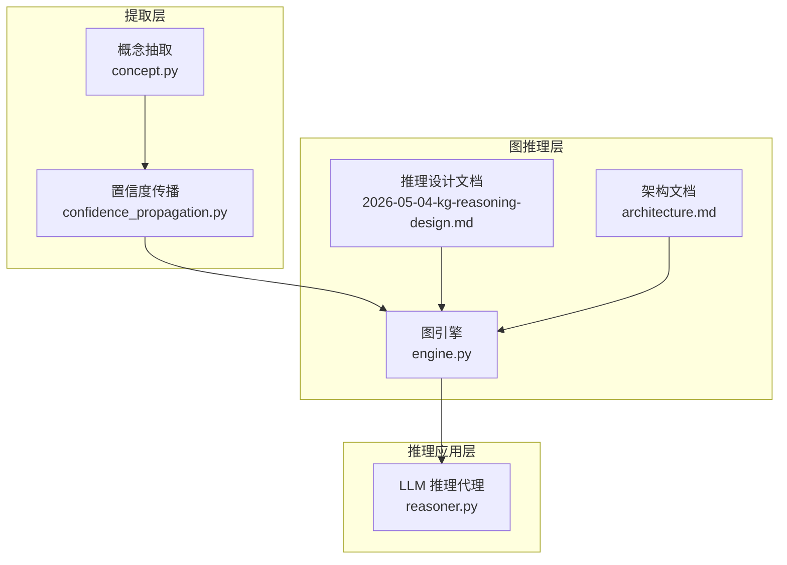
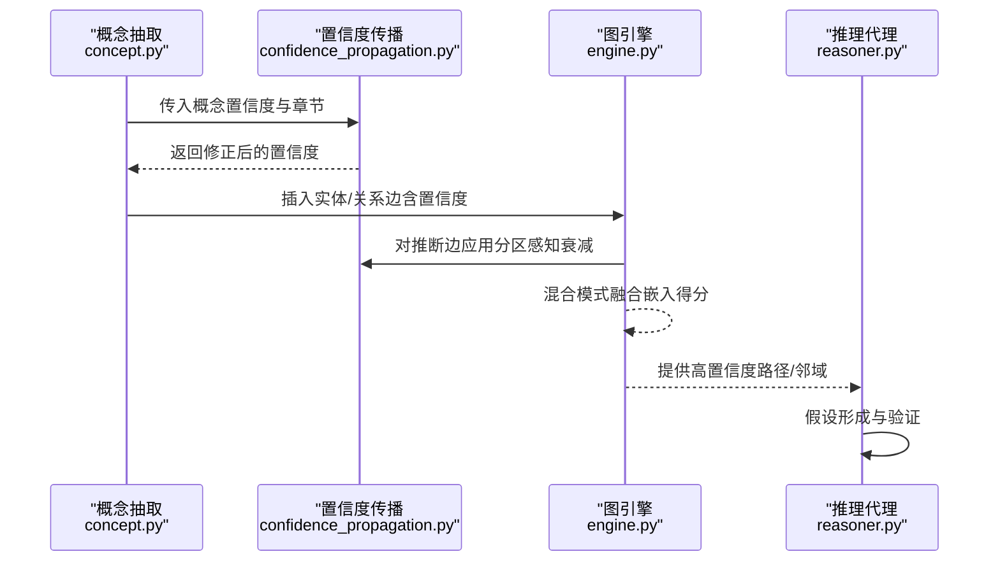
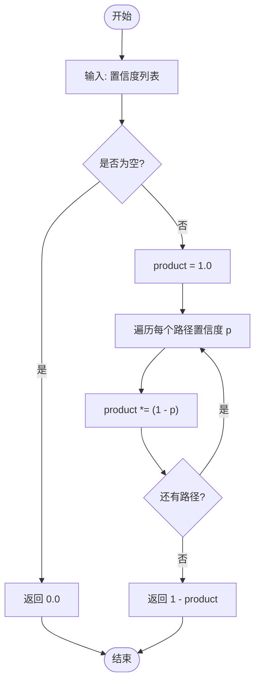
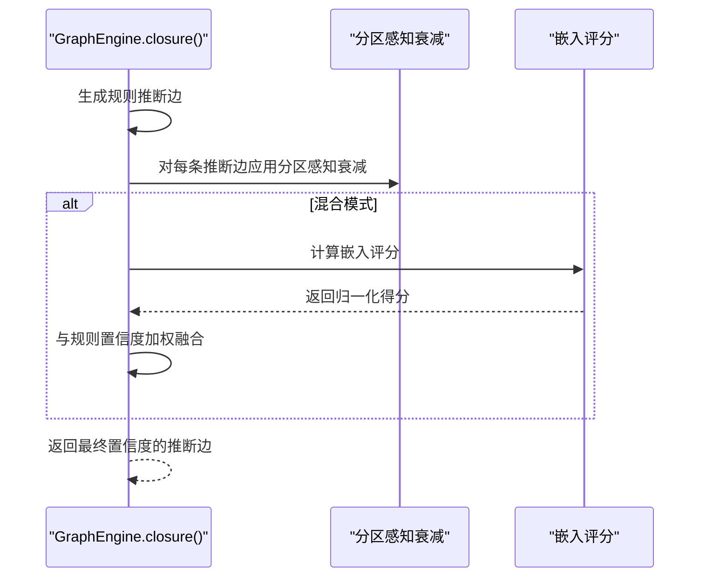
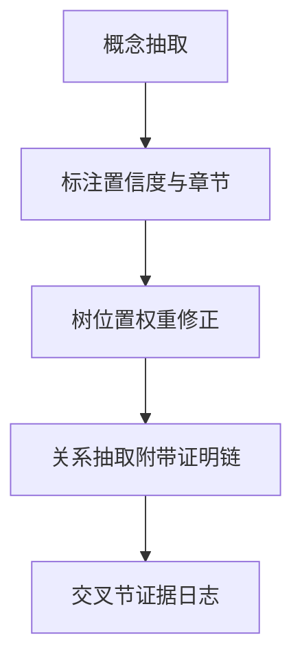
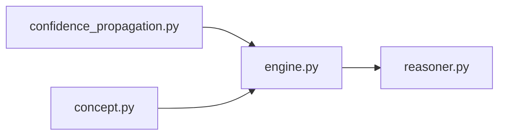

# 置信度传播

<cite>
**本文引用的文件**
- [confidence_propagation.py](file://src/drbrain/extractor/confidence_propagation.py)
- [test_confidence_propagation.py](file://tests/test_confidence_propagation.py)
- [engine.py](file://src/drbrain/graph/engine.py)
- [concept.py](file://src/drbrain/extractor/concept.py)
- [2026-05-04-kg-reasoning-design.md](file://docs/superpowers/specs/2026-05-04-kg-reasoning-design.md)
- [architecture.md](file://docs/architecture.md)
- [reasoner.py](file://src/drbrain/extractor/reasoner.py)
</cite>

## 目录
1. [简介](#简介)
2. [项目结构](#项目结构)
3. [核心组件](#核心组件)
4. [架构总览](#架构总览)
5. [详细组件分析](#详细组件分析)
6. [依赖分析](#依赖分析)
7. [性能考虑](#性能考虑)
8. [故障排查指南](#故障排查指南)
9. [结论](#结论)
10. [附录](#附录)

## 简介
本文件系统性阐述 DrBrain 中“置信度传播”机制的设计与实现，覆盖以下关键点：
- 多跳不确定性衰减：每一步传播以固定乘法因子衰减置信度（默认 0.85）。
- 路径合并策略：独立路径通过概率“或”合并（1 - ∏(1 - p_i)），体现证据冗余增强结论可信度。
- 分区感知衰减：基于论文章节类型调整衰减强度，方法/结果类更稳健，讨论/相关工作类更易衰减。
- 在知识图谱推理中的角色：用于规则推断边的置信度赋值、路径规则评分、以及混合模式下嵌入得分融合。
- 证据类型影响：直接证据（单路径）与冗余证据（多路径）对置信度提升方式不同；冲突证据通过矛盾检测与跨节矛盾识别进行管理。

## 项目结构
围绕置信度传播的相关模块与文件分布如下：
- 提供置信度传播算法与路径合并逻辑：src/drbrain/extractor/confidence_propagation.py
- 图推理引擎在闭包阶段使用置信度传播：src/drbrain/graph/engine.py
- 概念抽取与置信度来源：src/drbrain/extractor/concept.py
- 设计文档与架构说明：docs/superpowers/specs/2026-05-04-kg-reasoning-design.md、docs/architecture.md
- LLM 推理代理工具链：src/drbrain/extractor/reasoner.py

图表来源
- [confidence_propagation.py:1-87](file://src/drbrain/extractor/confidence_propagation.py#L1-L87)
- [engine.py:124-315](file://src/drbrain/graph/engine.py#L124-L315)
- [concept.py:633-668](file://src/drbrain/extractor/concept.py#L633-L668)
- [2026-05-04-kg-reasoning-design.md:63-87](file://docs/superpowers/specs/2026-05-04-kg-reasoning-design.md#L63-L87)
- [architecture.md:159-161](file://docs/architecture.md#L159-L161)
- [reasoner.py:1-200](file://src/drbrain/extractor/reasoner.py#L1-L200)

章节来源
- [confidence_propagation.py:1-87](file://src/drbrain/extractor/confidence_propagation.py#L1-L87)
- [engine.py:124-315](file://src/drbrain/graph/engine.py#L124-L315)
- [concept.py:633-668](file://src/drbrain/extractor/concept.py#L633-L668)
- [2026-05-04-kg-reasoning-design.md:63-87](file://docs/superpowers/specs/2026-05-04-kg-reasoning-design.md#L63-L87)
- [architecture.md:159-161](file://docs/architecture.md#L159-L161)
- [reasoner.py:1-200](file://src/drbrain/extractor/reasoner.py#L1-L200)

## 核心组件
- 置信度传播函数
  - 单步衰减：每次传播按固定乘法因子衰减置信度，默认 0.85。
  - 分区感知衰减：根据来源概念所属论文章节类型选择不同的衰减因子，方法/结果类衰减最小，讨论/相关工作类衰减最大。
  - 多路径合并：独立路径通过概率“或”合并，冗余证据显著提升合并后的置信度。
- 图推理引擎集成
  - 规则推断边生成时，若提供“节点→章节”的映射，将为每条推断边赋予置信度（默认 1.0，再经分区感知衰减）。
  - 混合模式下，将规则置信度与嵌入得分进行加权融合，得到最终置信度。
- 概念抽取与置信度来源
  - 概念抽取阶段为每个概念标注置信度与来源章节；树位置权重进一步调整个体概念的置信度。
- LLM 推理代理
  - 通过工具链查询图结构、路径与邻域，结合置信度信息形成假设与验证循环。

章节来源
- [confidence_propagation.py:31-87](file://src/drbrain/extractor/confidence_propagation.py#L31-L87)
- [engine.py:281-307](file://src/drbrain/graph/engine.py#L281-L307)
- [concept.py:633-668](file://src/drbrain/extractor/concept.py#L633-L668)
- [reasoner.py:1-200](file://src/drbrain/extractor/reasoner.py#L1-L200)

## 架构总览
置信度传播贯穿“提取—推理—应用”三层：
- 提取层：概念抽取为每个实体/关系附带置信度与章节来源；树位置权重进一步修正置信度。
- 推理层：规则推断与路径规则生成时，使用分区感知衰减为推断边赋初始置信度；混合模式下与嵌入得分融合。
- 应用层：LLM 推理代理利用工具链检索高置信度路径与邻域，驱动假设形成与验证。

图表来源
- [concept.py:633-668](file://src/drbrain/extractor/concept.py#L633-L668)
- [confidence_propagation.py:44-87](file://src/drbrain/extractor/confidence_propagation.py#L44-L87)
- [engine.py:281-307](file://src/drbrain/graph/engine.py#L281-L307)
- [reasoner.py:1-200](file://src/drbrain/extractor/reasoner.py#L1-L200)

## 详细组件分析

### 组件一：置信度传播算法
- 单步衰减
  - 输入：当前置信度与衰减因子（默认 0.85）。
  - 输出：传播一步后的置信度。
  - 边界：零置信度保持不变；衰减因子为 1.0 时不衰减。
- 分区感知衰减
  - 针对不同论文章节类型设置不同的衰减因子，方法/结果类最高，讨论/相关工作类最低。
  - 若未识别到章节，则回退到默认衰减因子。
- 多路径合并
  - 独立路径通过概率“或”合并：P = 1 - ∏(1 - p_i)，体现冗余证据对结论可信度的提升。
  - 空路径集合返回 0.0。

图表来源
- [confidence_propagation.py:67-87](file://src/drbrain/extractor/confidence_propagation.py#L67-L87)

章节来源
- [confidence_propagation.py:31-87](file://src/drbrain/extractor/confidence_propagation.py#L31-L87)
- [test_confidence_propagation.py:12-99](file://tests/test_confidence_propagation.py#L12-L99)

### 组件二：图推理中的置信度传播
- 推断边置信度
  - 规则推断（如 debate、gap_addressed、indirect_evolution 等）生成的边默认置信度为 1.0。
  - 若提供“节点→章节”映射，使用分区感知衰减对每条推断边进行修正。
- 混合模式
  - 当启用混合模式时，使用 TransE 嵌入得分对推断边进行评分，并与现有置信度进行加权平均（各占 0.5）。
- 路径规则与规则落地
  - 通过路径规则生成的边同样可获得置信度；规则落地采用 t-范数风格（例如对传递关系取边权重的最小值）。

图表来源
- [engine.py:281-307](file://src/drbrain/graph/engine.py#L281-L307)
- [2026-05-04-kg-reasoning-design.md:63-87](file://docs/superpowers/specs/2026-05-04-kg-reasoning-design.md#L63-L87)

章节来源
- [engine.py:124-315](file://src/drbrain/graph/engine.py#L124-L315)
- [2026-05-04-kg-reasoning-design.md:63-87](file://docs/superpowers/specs/2026-05-04-kg-reasoning-design.md#L63-L87)

### 组件三：概念抽取与置信度来源
- 概念置信度
  - 抽取阶段为每个概念分配置信度与来源章节；随后通过树位置权重进一步修正置信度。
- 跨节证据与矛盾
  - 同一目标从不同章节出现的支持/挑战会被记录为交叉节证据模式，便于后续矛盾检测与可视化。
- 关系抽取与证明链
  - 关系抽取时保留源概念的节点 ID 与章节信息，形成“边→概念→树节点→论文”的证明链。

图表来源
- [concept.py:633-668](file://src/drbrain/extractor/concept.py#L633-L668)
- [concept.py:148-188](file://src/drbrain/extractor/concept.py#L148-L188)

章节来源
- [concept.py:633-668](file://src/drbrain/extractor/concept.py#L633-L668)
- [concept.py:148-188](file://src/drbrain/extractor/concept.py#L148-L188)

### 组件四：LLM 推理代理中的置信度使用
- 工具链能力
  - 搜索概念、获取邻居、查找最短路径、获取文档结构与内容等，均服务于高置信度证据的检索与验证。
- 假设形成与验证
  - 初次假设由问题驱动；后续迭代基于图中发现的矛盾、缺失或冲突证据进行修订，置信度作为证据强度的量化指标参与决策。

章节来源
- [reasoner.py:1-200](file://src/drbrain/extractor/reasoner.py#L1-L200)

## 依赖分析
- 模块耦合
  - confidence_propagation 为纯函数库，低耦合、高内聚。
  - engine 对 confidence_propagation 存在显式依赖，用于推断边置信度赋值与混合模式融合。
  - concept 为置信度来源之一，通过树位置权重与章节信息为传播提供初始条件。
- 可能的循环依赖
  - 当前未见循环依赖；engine 仅单向依赖 confidence_propagation。
- 外部依赖
  - 图推理依赖 NetworkX；嵌入依赖 TransE 实现；测试依赖 pytest。

图表来源
- [confidence_propagation.py:1-87](file://src/drbrain/extractor/confidence_propagation.py#L1-L87)
- [engine.py:281-307](file://src/drbrain/graph/engine.py#L281-L307)
- [concept.py:633-668](file://src/drbrain/extractor/concept.py#L633-L668)
- [reasoner.py:1-200](file://src/drbrain/extractor/reasoner.py#L1-L200)

章节来源
- [engine.py:281-307](file://src/drbrain/graph/engine.py#L281-L307)
- [confidence_propagation.py:1-87](file://src/drbrain/extractor/confidence_propagation.py#L1-L87)
- [concept.py:633-668](file://src/drbrain/extractor/concept.py#L633-L668)
- [reasoner.py:1-200](file://src/drbrain/extractor/reasoner.py#L1-L200)

## 性能考虑
- 时间复杂度
  - 单步衰减与分区感知衰减均为 O(1)。
  - 多路径合并为 O(n)，n 为路径数量。
  - 图闭包阶段的推断边生成与置信度赋值主要受规则数量与图规模影响。
- 空间复杂度
  - 主要消耗在网络存储与嵌入向量缓存；推理代理工具链的中间结果按需构建。
- 优化建议
  - 对于大规模图，优先使用增量闭包（仅针对种子节点子图）以减少规则扫描范围。
  - 在混合模式下，合理设置嵌入训练轮次与维度，避免过度训练导致的过拟合与延迟。

## 故障排查指南
- 置信度异常
  - 若发现推断边置信度过高或过低，检查是否正确传入“节点→章节”映射，以及是否启用了混合模式。
  - 确认分区感知衰减字典中是否存在目标章节键；未知章节会回退到默认衰减因子。
- 多路径合并不生效
  - 确保传入的路径置信度列表非空；空列表将返回 0.0。
  - 检查路径独立性假设是否满足；合并公式适用于独立路径。
- 混合模式未融合嵌入得分
  - 确认已加载嵌入或成功训练 TransE；否则不会进行融合。
- 测试验证
  - 使用单元测试覆盖单步衰减、链式传播、零置信度、空路径、分区感知差异等场景。

章节来源
- [test_confidence_propagation.py:12-99](file://tests/test_confidence_propagation.py#L12-L99)
- [engine.py:292-307](file://src/drbrain/graph/engine.py#L292-L307)

## 结论
置信度传播在 DrBrain 中承担了“不确定性建模与证据聚合”的关键职责：通过多跳衰减刻画证据的远近与可靠性，通过分区感知反映学术论文不同章节的证据稳健性，通过多路径合并体现证据冗余对结论可信度的增益。在知识图谱推理中，它既为规则推断与路径规则提供置信度基础，又在混合模式下与嵌入得分协同，提升整体推理质量。配合概念抽取的置信度来源与 LLM 推理代理的工具链，形成了从证据到结论的闭环推理流程。

## 附录

### 置信度传播规则与示例路径
- 初始化置信度
  - 来自概念抽取：每个概念带有置信度与章节来源；随后通过树位置权重修正。
  - 示例路径：[concept.py:633-668](file://src/drbrain/extractor/concept.py#L633-L668)
- 执行多轮传播
  - 单步衰减：[propagate_confidence:31-41](file://src/drbrain/extractor/confidence_propagation.py#L31-L41)
  - 分区感知衰减：[propagate_confidence_with_section:44-64](file://src/drbrain/extractor/confidence_propagation.py#L44-L64)
  - 多路径合并：[multi_path_confidence:67-87](file://src/drbrain/extractor/confidence_propagation.py#L67-L87)
- 评估传播结果
  - 在闭包阶段为推断边赋初始置信度，并在混合模式下与嵌入得分融合：[engine.py:281-307](file://src/drbrain/graph/engine.py#L281-L307)
- 冲突证据处理
  - 通过跨节支持/挑战模式记录证据来源；后续可结合矛盾检测与可视化进行分析：[concept.py:148-188](file://src/drbrain/extractor/concept.py#L148-L188)