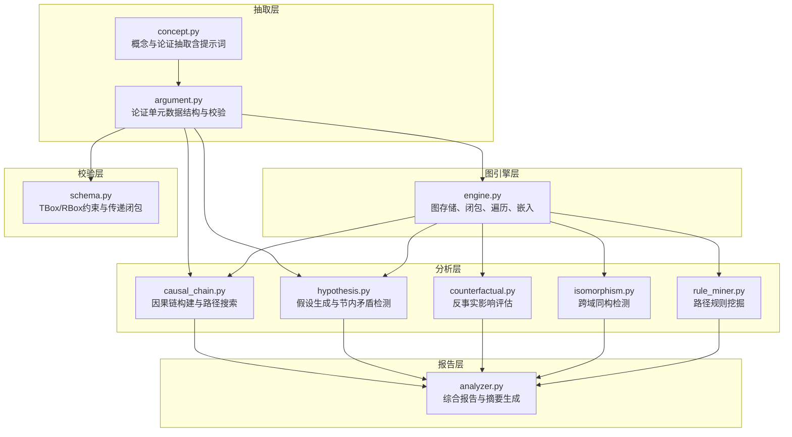
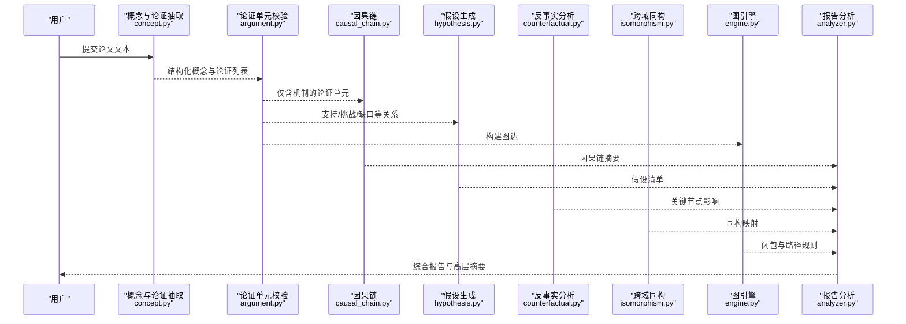
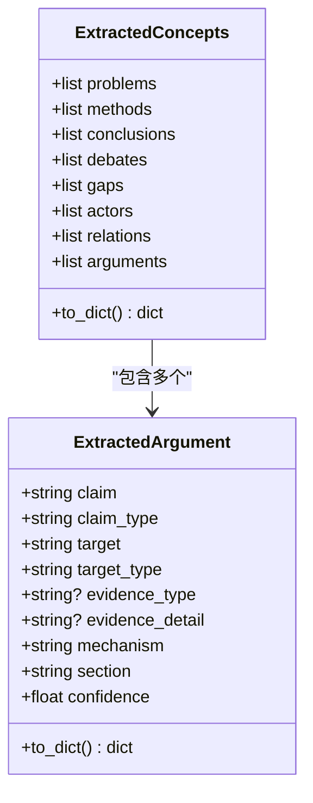
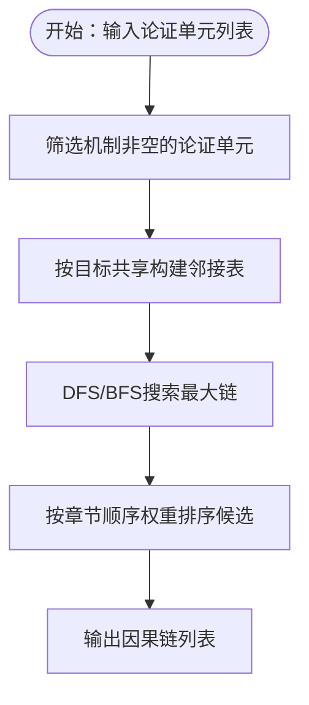
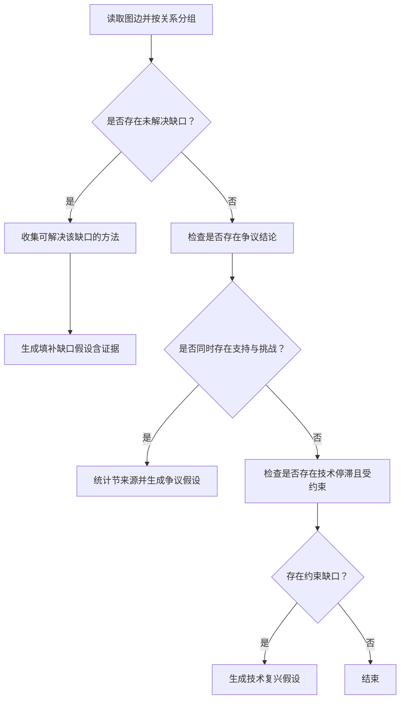
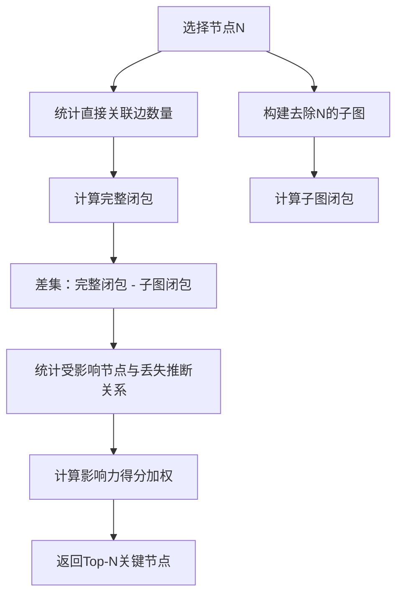
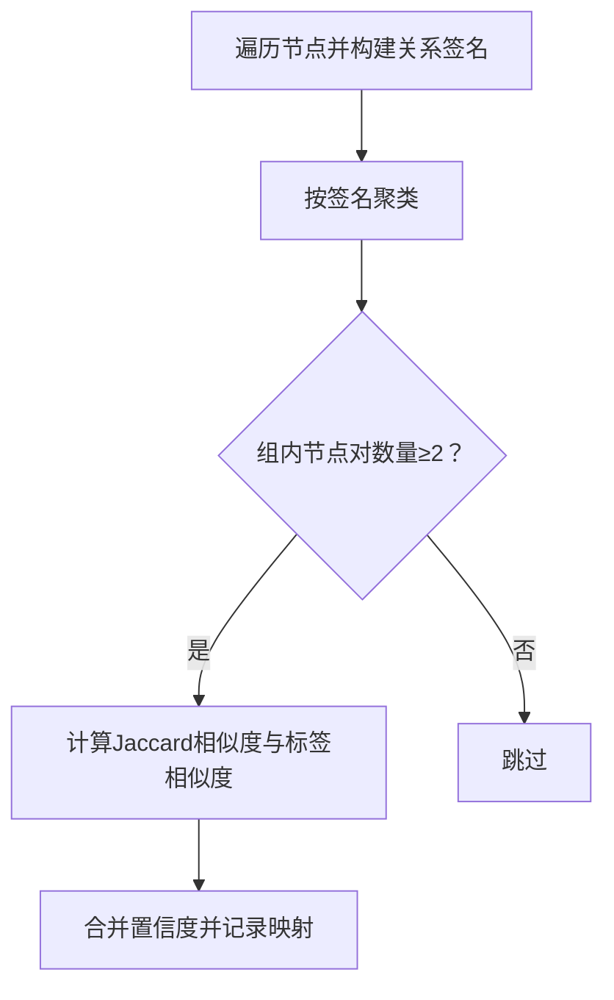
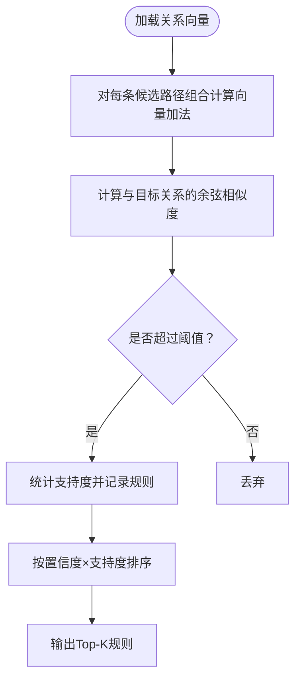
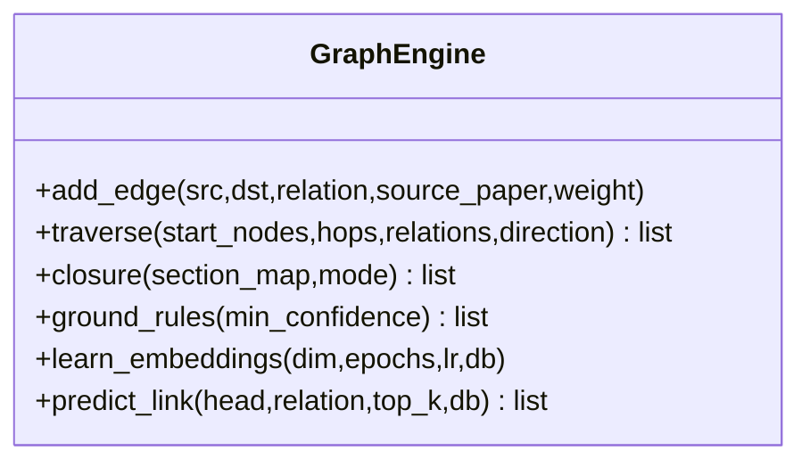
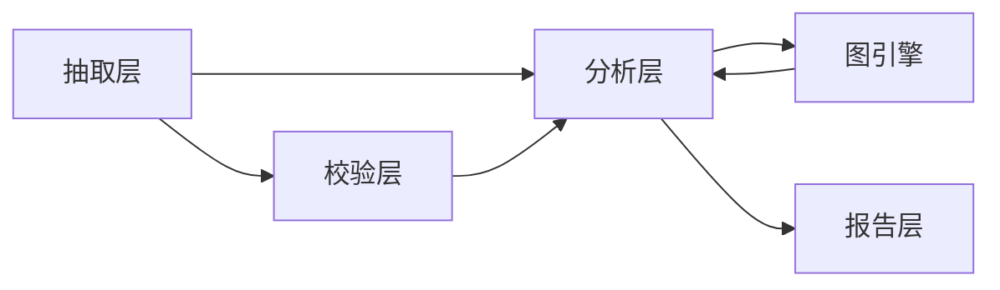

# 论证分析

<cite>
**本文引用的文件**
- [argument.py](file://src/drbrain/extractor/argument.py)
- [causal_chain.py](file://src/drbrain/extractor/causal_chain.py)
- [concept.py](file://src/drbrain/extractor/concept.py)
- [analyzer.py](file://src/drbrain/report/analyzer.py)
- [reasoner.py](file://src/drbrain/extractor/reasoner.py)
- [schema.py](file://src/drbrain/validator/schema.py)
- [engine.py](file://src/drbrain/graph/engine.py)
- [hypothesis.py](file://src/drbrain/extractor/hypothesis.py)
- [counterfactual.py](file://src/drbrain/extractor/counterfactual.py)
- [isomorphism.py](file://src/drbrain/extractor/isomorphism.py)
- [rule_miner.py](file://src/drbrain/extractor/rule_miner.py)
- [test_argument.py](file://tests/test_argument.py)
- [test_causal_chain.py](file://tests/test_causal_chain.py)
- [extract_concepts.txt](file://prompts/extract_concepts.txt)
</cite>

## 目录
1. [引言](#引言)
2. [项目结构](#项目结构)
3. [核心组件](#核心组件)
4. [架构总览](#架构总览)
5. [详细组件分析](#详细组件分析)
6. [依赖分析](#依赖分析)
7. [性能考虑](#性能考虑)
8. [故障排查指南](#故障排查指南)
9. [结论](#结论)
10. [附录](#附录)

## 引言
本技术文档围绕 DrBrain 的“论证分析”能力，系统阐述其从学术论文中抽取论证要素、识别论证结构、建模逻辑关系并进行质量评估的方法与实现。DrBrain 将论证视为由“主张（Claim）—目标（Target）—证据（Evidence）—机制（Mechanism）—章节归属（Section）—置信度（Confidence）”构成的结构化单元，并通过因果链、假设生成、反事实分析、跨域同构等手段，对知识前沿进行深度洞察。该能力可广泛应用于学术写作的论点提炼、法律推理的因果链条梳理、以及科学发现中的路径预测与洞见挖掘。

## 项目结构
DrBrain 的论证分析能力主要分布在以下模块：
- 抽取层：负责从论文文本中提取概念与论证单元，确保字段完备性与一致性
- 分析层：基于抽取结果构建因果链、生成研究假设、执行反事实分析
- 图引擎层：提供图结构存储、规则闭包、路径推理与嵌入学习
- 报告层：整合分析结果，输出结构化报告与高层摘要
- 校验层：基于本体与盒型/框型约束进行合法性校验

图表来源
- [argument.py:1-87](file://src/drbrain/extractor/argument.py#L1-L87)
- [concept.py:1-281](file://src/drbrain/extractor/concept.py#L1-L281)
- [causal_chain.py:1-238](file://src/drbrain/extractor/causal_chain.py#L1-L238)
- [hypothesis.py:1-198](file://src/drbrain/extractor/hypothesis.py#L1-L198)
- [counterfactual.py:1-144](file://src/drbrain/extractor/counterfactual.py#L1-L144)
- [isomorphism.py:1-257](file://src/drbrain/extractor/isomorphism.py#L1-L257)
- [rule_miner.py:1-290](file://src/drbrain/extractor/rule_miner.py#L1-L290)
- [engine.py:1-800](file://src/drbrain/graph/engine.py#L1-L800)
- [analyzer.py:1-231](file://src/drbrain/report/analyzer.py#L1-L231)
- [schema.py:1-211](file://src/drbrain/validator/schema.py#L1-L211)

章节来源
- [argument.py:1-87](file://src/drbrain/extractor/argument.py#L1-L87)
- [concept.py:1-281](file://src/drbrain/extractor/concept.py#L1-L281)
- [analyzer.py:1-231](file://src/drbrain/report/analyzer.py#L1-L231)

## 核心组件
- 论证单元（ExtractedArgument）
  - 字段：主张、主张类型、目标、目标类型、证据类型、证据细节、机制、章节、置信度
  - 能力：解析原始 LLM 输出为结构化对象；批量校验并分离有效/无效项
- 因果链（CausalChain）
  - 基于“机制（mechanism）”非空的论证单元，按目标共享构建链路，支持 DFS/BFS 查找与摘要输出
- 假设生成（Hypothesis）
  - 基于图模式生成三类假设：填补缺口、解决争议、技术复兴；并给出证据清单与评分
- 反事实分析（Counterfactual）
  - 移除节点后对比闭包差异，量化影响范围与损失的推断关系
- 跨域同构（Isomorphism）
  - 基于关系签名的 Jaccard 相似度检测跨域相似子结构，辅助知识迁移
- 规则挖掘（Rule Miner）
  - 基于 TransE 向量加法近似路径组合，挖掘可复用的关系组合规则
- 图引擎（GraphEngine）
  - 提供闭包推理、路径规则、遍历、嵌入学习与持久化接口
- 报告分析（Analyzer）
  - 汇总因果链、关键节点、假设、同构等结果，生成高层摘要与建议

章节来源
- [argument.py:13-87](file://src/drbrain/extractor/argument.py#L13-L87)
- [causal_chain.py:40-238](file://src/drbrain/extractor/causal_chain.py#L40-L238)
- [hypothesis.py:18-198](file://src/drbrain/extractor/hypothesis.py#L18-L198)
- [counterfactual.py:16-144](file://src/drbrain/extractor/counterfactual.py#L16-L144)
- [isomorphism.py:17-257](file://src/drbrain/extractor/isomorphism.py#L17-L257)
- [rule_miner.py:1-290](file://src/drbrain/extractor/rule_miner.py#L1-L290)
- [engine.py:33-800](file://src/drbrain/graph/engine.py#L33-L800)
- [analyzer.py:9-134](file://src/drbrain/report/analyzer.py#L9-L134)

## 架构总览
论证分析的端到端流程如下：

图表来源
- [concept.py:54-87](file://src/drbrain/extractor/concept.py#L54-L87)
- [argument.py:41-87](file://src/drbrain/extractor/argument.py#L41-L87)
- [causal_chain.py:63-151](file://src/drbrain/extractor/causal_chain.py#L63-L151)
- [hypothesis.py:82-198](file://src/drbrain/extractor/hypothesis.py#L82-L198)
- [counterfactual.py:35-97](file://src/drbrain/extractor/counterfactual.py#L35-L97)
- [isomorphism.py:111-171](file://src/drbrain/extractor/isomorphism.py#L111-L171)
- [engine.py:124-316](file://src/drbrain/graph/engine.py#L124-L316)
- [analyzer.py:9-134](file://src/drbrain/report/analyzer.py#L9-L134)

## 详细组件分析

### 论证要素提取与校验
- 数据模型
  - ExtractedArgument：统一承载主张、目标、证据、机制、章节与置信度
  - ExtractedConcepts：聚合问题、方法、结论、争议、缺口、参与者、关系与论证
- 解析与校验
  - parse_arguments：将 LLM 输出转为结构化对象
  - validate_argument / validate_arguments：基于预定义集合校验主张类型与目标类型
- 提示词设计
  - extract_concepts.txt 明确要求输出 arguments 数组，包含 claim、claim_type、target、target_type、evidence_type、evidence_detail、mechanism、section、confidence 等字段

图表来源
- [argument.py:13-39](file://src/drbrain/extractor/argument.py#L13-L39)
- [concept.py:28-52](file://src/drbrain/extractor/concept.py#L28-L52)

章节来源
- [argument.py:41-87](file://src/drbrain/extractor/argument.py#L41-L87)
- [concept.py:54-87](file://src/drbrain/extractor/concept.py#L54-L87)
- [test_argument.py:11-13](file://tests/test_argument.py#L11-L13)
- [test_argument.py:31-71](file://tests/test_argument.py#L31-L71)
- [test_argument.py:119-177](file://tests/test_argument.py#L119-L177)
- [extract_concepts.txt:14-27](file://prompts/extract_concepts.txt#L14-L27)

### 因果链构建与路径搜索
- 核心思想
  - 仅使用“机制（mechanism）非空”的论证单元，按目标共享建立邻接关系，采用 DFS/BFS 寻找最大链与最短路径
  - 引入“章节顺序权重”，优先沿论文结构顺序扩展链路
- 关键函数
  - build_causal_chains：构建所有最大因果链
  - find_chains_from：从指定概念出发查找所有链
  - find_path：BFS 最短路径（源/目标均为概念标签）

图表来源
- [causal_chain.py:63-151](file://src/drbrain/extractor/causal_chain.py#L63-L151)
- [causal_chain.py:153-190](file://src/drbrain/extractor/causal_chain.py#L153-L190)
- [causal_chain.py:192-238](file://src/drbrain/extractor/causal_chain.py#L192-L238)

章节来源
- [causal_chain.py:63-151](file://src/drbrain/extractor/causal_chain.py#L63-L151)
- [test_causal_chain.py:47-105](file://tests/test_causal_chain.py#L47-L105)
- [test_causal_chain.py:195-214](file://tests/test_causal_chain.py#L195-L214)

### 假设生成与节内矛盾检测
- 模式一：填补缺口
  - 识别未被解决的缺口，结合“addresses/extends”关系提出候选方法
- 模式二：争议区域
  - 对同一结论同时存在“supports/challenges”的论文，统计节来源并提示需要进一步证据
- 模式三：技术复兴
  - 若某方法曾活跃但被约束所限而停滞，提示在条件变化时可能复活

图表来源
- [hypothesis.py:82-198](file://src/drbrain/extractor/hypothesis.py#L82-L198)

章节来源
- [hypothesis.py:82-198](file://src/drbrain/extractor/hypothesis.py#L82-L198)
- [analyzer.py:78-99](file://src/drbrain/report/analyzer.py#L78-L99)

### 反事实分析与关键节点识别
- 方法
  - 移除单个节点，比较完整闭包与减少闭包之间的差异，统计移除边数、受影响概念数与丢失的推断关系
  - 基于权重（如方法/结果等“实证”章节权重更高）对节点影响力进行加权排序
- 应用
  - 识别知识图谱中的关键节点，辅助判断哪些概念或方法的缺失会对整体推断产生显著影响

图表来源
- [counterfactual.py:35-97](file://src/drbrain/extractor/counterfactual.py#L35-L97)
- [counterfactual.py:116-144](file://src/drbrain/extractor/counterfactual.py#L116-L144)

章节来源
- [counterfactual.py:35-97](file://src/drbrain/extractor/counterfactual.py#L35-L97)
- [analyzer.py:70-77](file://src/drbrain/report/analyzer.py#L70-L77)

### 跨域同构检测与知识迁移
- 思路
  - 为每个节点构建“关系签名”（入/出关系类型与计数），使用 Jaccard 相似度匹配结构相似节点
  - 结合标签相似度加权得到最终置信度，识别跨域可迁移的结构
- 扩展
  - 可结合 RAPTOR 层次摘要为映射提供上下文增强

图表来源
- [isomorphism.py:111-171](file://src/drbrain/extractor/isomorphism.py#L111-L171)

章节来源
- [isomorphism.py:111-171](file://src/drbrain/extractor/isomorphism.py#L111-L171)
- [analyzer.py:87-99](file://src/drbrain/report/analyzer.py#L87-L99)

### 规则挖掘与路径组合
- 思想
  - 基于 TransE 向量加法近似路径组合（r_head ≈ r_i + r_j），统计支持度并排序
  - 同时支持从图遍历枚举频繁路径作为候选规则
- 应用
  - 发现可复用的关系组合，指导后续推理与补全

图表来源
- [rule_miner.py:33-106](file://src/drbrain/extractor/rule_miner.py#L33-L106)
- [rule_miner.py:137-198](file://src/drbrain/extractor/rule_miner.py#L137-L198)

章节来源
- [rule_miner.py:33-106](file://src/drbrain/extractor/rule_miner.py#L33-L106)
- [rule_miner.py:137-198](file://src/drbrain/extractor/rule_miner.py#L137-L198)

### 图引擎与闭包推理
- 功能
  - 提供闭包推理（规则闭包、传递闭包、路径规则）、遍历、嵌入学习与持久化
  - 支持混合模式（符号+嵌入）提升推断置信度
- 与论证分析的衔接
  - 为因果链、假设生成、反事实与规则挖掘提供统一的图表示与推理基础

图表来源
- [engine.py:33-316](file://src/drbrain/graph/engine.py#L33-L316)

章节来源
- [engine.py:124-316](file://src/drbrain/graph/engine.py#L124-L316)

### 报告生成与高层摘要
- 内容
  - 汇总因果链、关键节点、研究种子、假设、同构映射与闭包数量
  - 在有模型配置时，生成高层摘要与针对研究种子的解决方案建议
- 流程
  - 从数据库读取论证单元，解析为 ExtractedArgument
  - 调用因果链、反事实、假设与同构模块
  - 生成结构化报告与可选的自然语言摘要

章节来源
- [analyzer.py:9-134](file://src/drbrain/report/analyzer.py#L9-L134)
- [analyzer.py:185-231](file://src/drbrain/report/analyzer.py#L185-L231)

## 依赖分析
- 组件耦合
  - 抽取层与分析层弱耦合：抽取层仅提供结构化论证单元，分析层独立完成链、假设、反事实与同构等任务
  - 图引擎是分析层的基础设施，被因果链、假设、反事实、同构与规则挖掘共同依赖
  - 报告层聚合各分析模块结果，形成统一视图
- 外部依赖
  - LLM 客户端用于抽取与摘要生成
  - NetworkX 用于图存储与遍历
  - NumPy 用于嵌入向量运算
  - 提示词模板驱动抽取质量

图表来源
- [argument.py:1-87](file://src/drbrain/extractor/argument.py#L1-L87)
- [schema.py:1-211](file://src/drbrain/validator/schema.py#L1-L211)
- [engine.py:1-800](file://src/drbrain/graph/engine.py#L1-L800)
- [analyzer.py:1-231](file://src/drbrain/report/analyzer.py#L1-L231)

章节来源
- [argument.py:1-87](file://src/drbrain/extractor/argument.py#L1-L87)
- [schema.py:1-211](file://src/drbrain/validator/schema.py#L1-L211)
- [engine.py:1-800](file://src/drbrain/graph/engine.py#L1-L800)
- [analyzer.py:1-231](file://src/drbrain/report/analyzer.py#L1-L231)

## 性能考虑
- 时间复杂度
  - 因果链构建：邻接表 O(V+E)，DFS/BFS 最坏 O(V^2)，受目标共享与章节排序启发式剪枝
  - 假设生成：按关系索引扫描，整体 O(E)
  - 反事实分析：每次移除节点需重新闭包，整体 O(N·(E+V)logV)
  - 跨域同构：签名构建 O(E)，Jaccard 计算 O(N^2·R)，R 为平均签名大小
  - 规则挖掘：向量加法与相似度计算 O(R^3)，遍历路径枚举受最大长度限制
- 空间复杂度
  - 图存储 O(E)，闭包与路径规则额外 O(E')
- 优化建议
  - 使用邻接表与关系索引加速查询
  - 对大规模图采用增量闭包与子图闭包策略
  - 对嵌入相似度计算进行缓存与批处理
  - 对提示词调优与模型选择进行 A/B 实验

## 故障排查指南
- 抽取字段缺失
  - 症状：解析后的论证单元缺少机制或章节信息
  - 排查：确认提示词模板包含机制与章节字段；检查 LLM 输出是否严格遵循 JSON Schema
- 校验失败
  - 症状：主张类型或目标类型不在允许集合内
  - 排查：核对 VALID_CLAIM_TYPES 与 VALID_TARGET_TYPES；修正提示词或后处理
- 因果链为空
  - 症状：机制字段为空导致无法构建链
  - 排查：确认抽取阶段已正确提取机制；检查章节顺序权重映射
- 闭包异常
  - 症状：闭包推理报错或结果异常
  - 排查：检查 TBox/RBox 约束；确认图边方向与标签一致性

章节来源
- [test_argument.py:45-71](file://tests/test_argument.py#L45-L71)
- [test_argument.py:119-177](file://tests/test_argument.py#L119-L177)
- [test_causal_chain.py:60-81](file://tests/test_causal_chain.py#L60-L81)
- [schema.py:63-95](file://src/drbrain/validator/schema.py#L63-L95)

## 结论
DrBrain 的论证分析以“结构化论证单元”为核心，结合因果链、假设生成、反事实与跨域同构等多维分析手段，形成从要素抽取到结构建模再到质量评估的完整闭环。通过图引擎的规则闭包与嵌入学习，系统能够自动发现隐含关系与迁移机会，为学术写作、法律推理与科学发现提供可解释、可追溯的智能支持。

## 附录
- 典型应用场景
  - 学术写作：自动生成论点结构、识别薄弱环节与证据缺口
  - 法律推理：梳理案件因果链条、识别矛盾证据与关键节点
  - 科学发现：预测技术演进路径、发现跨领域可迁移结构
- 代码示例路径（不展示具体代码内容）
  - 从文本抽取论证要素：[concept.py:54-87](file://src/drbrain/extractor/concept.py#L54-L87)
  - 校验论证单元合法性：[argument.py:61-87](file://src/drbrain/extractor/argument.py#L61-L87)
  - 构建因果链：[causal_chain.py:63-151](file://src/drbrain/extractor/causal_chain.py#L63-L151)
  - 生成研究假设：[hypothesis.py:82-198](file://src/drbrain/extractor/hypothesis.py#L82-L198)
  - 反事实影响评估：[counterfactual.py:35-97](file://src/drbrain/extractor/counterfactual.py#L35-L97)
  - 跨域同构检测：[isomorphism.py:111-171](file://src/drbrain/extractor/isomorphism.py#L111-L171)
  - 规则挖掘（路径组合）：[rule_miner.py:33-106](file://src/drbrain/extractor/rule_miner.py#L33-L106)
  - 图引擎闭包与遍历：[engine.py:124-316](file://src/drbrain/graph/engine.py#L124-L316)
  - 综合报告生成：[analyzer.py:9-134](file://src/drbrain/report/analyzer.py#L9-L134)