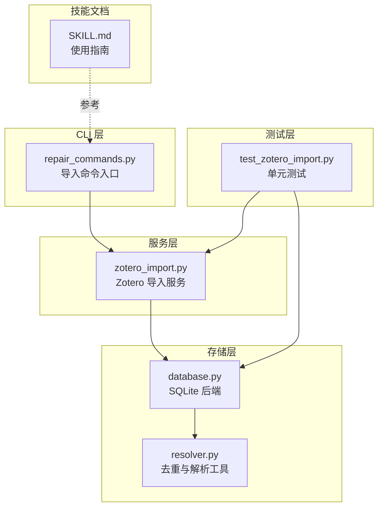
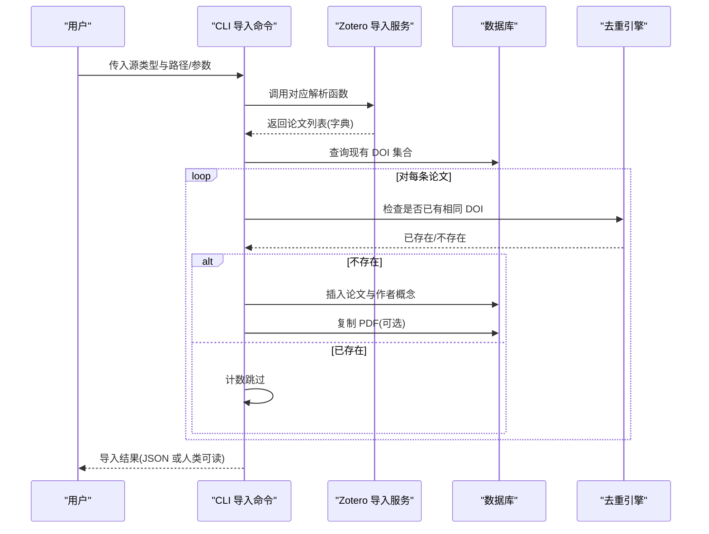
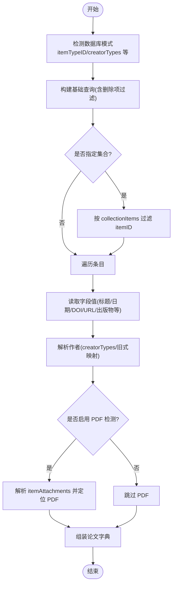
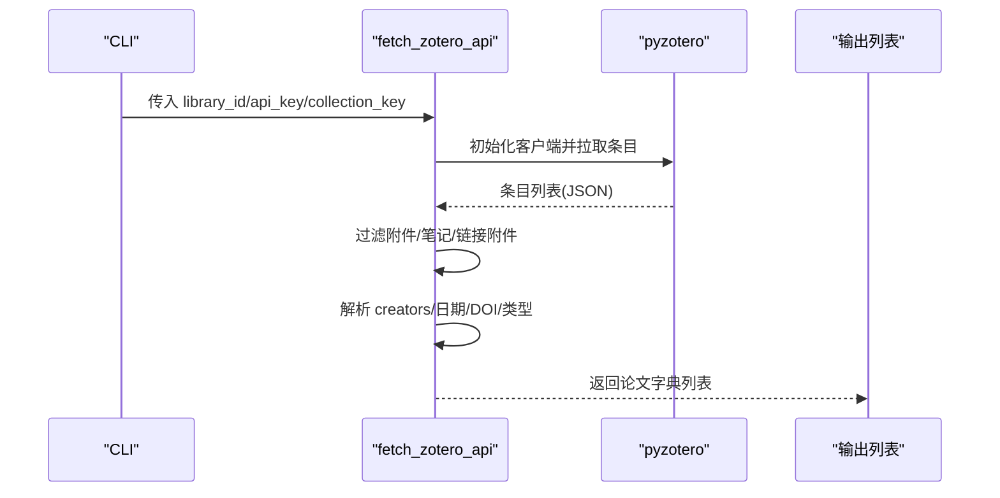
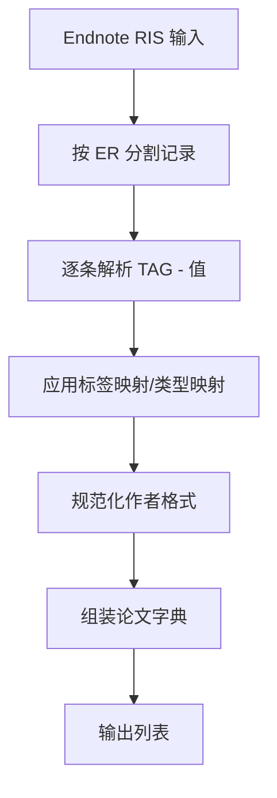
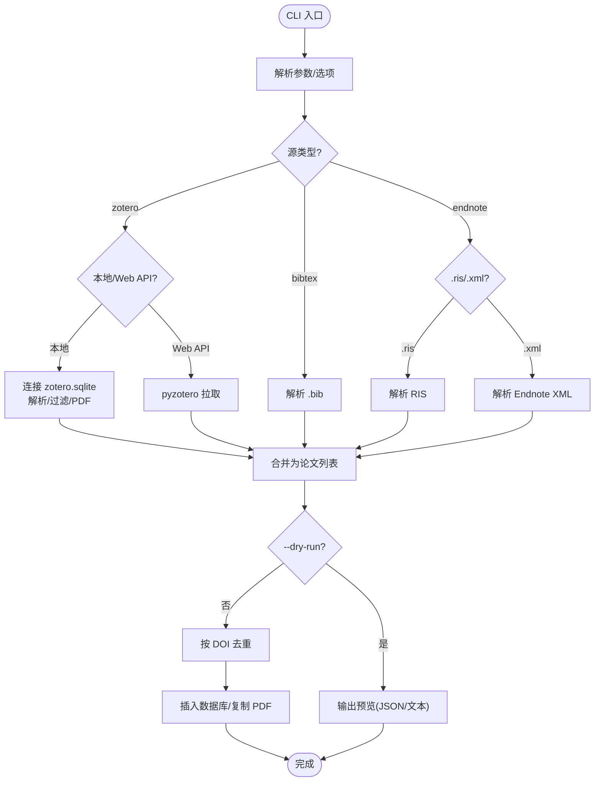
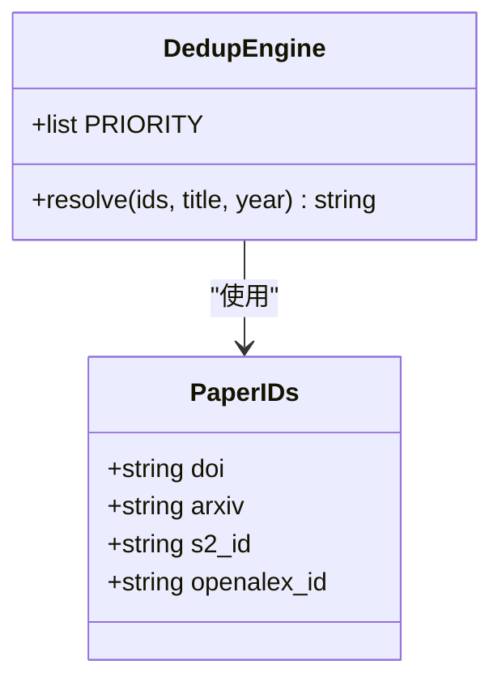
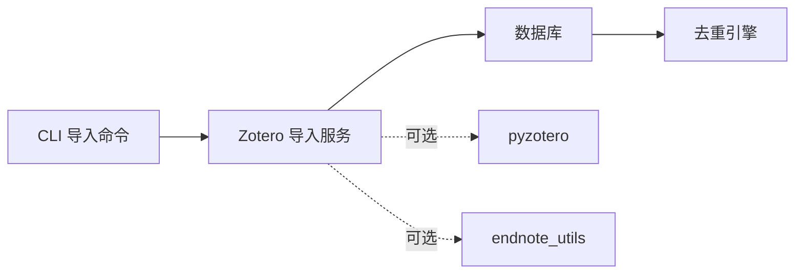

# Zotero 导入服务

<cite>
**本文引用的文件**
- [zotero_import.py](file://src/drbrain/services/zotero_import.py)
- [test_zotero_import.py](file://tests/test_zotero_import.py)
- [SKILL.md](file://skills/import/SKILL.md)
- [repair_commands.py](file://src/drbrain/cli/repair_commands.py)
- [resolver.py](file://src/drbrain/dedup/resolver.py)
- [database.py](file://src/drbrain/storage/database.py)
- [config.example.yaml](file://config.example.yaml)
</cite>

## 目录
1. [简介](#简介)
2. [项目结构](#项目结构)
3. [核心组件](#核心组件)
4. [架构总览](#架构总览)
5. [详细组件分析](#详细组件分析)
6. [依赖分析](#依赖分析)
7. [性能考虑](#性能考虑)
8. [故障排查指南](#故障排查指南)
9. [结论](#结论)
10. [附录](#附录)

## 简介
本文件面向 DrBrain 的 Zotero 导入服务模块，系统性阐述其数据导入实现原理与工程实践，覆盖以下方面：
- 数据源与格式：本地 Zotero SQLite、Zotero Web API、BibTeX、Endnote XML/RIS
- 数据解析与元数据映射：字段清洗、作者规范化、类型映射、日期提取
- 批量导入与管线集成：CLI 命令、去重策略、JSON 输出、工作空间映射
- 冲突解决与重复检测：基于 DOI 的去重、标题模糊匹配
- 质量保证：输入校验、异常处理、测试覆盖
- 性能优化与并发：批处理、索引、WAL 模式、缓存
- 使用指南与最佳实践：CLI 参数、数据格式支持、迁移建议

## 项目结构
Zotero 导入服务位于服务层，CLI 层负责参数解析与调用，存储层负责持久化与去重，测试层覆盖关键路径与边界条件。

图表来源
- [repair_commands.py:77-341](file://src/drbrain/cli/repair_commands.py#L77-L341)
- [zotero_import.py:118-719](file://src/drbrain/services/zotero_import.py#L118-L719)
- [database.py:159-200](file://src/drbrain/storage/database.py#L159-L200)
- [resolver.py:10-82](file://src/drbrain/dedup/resolver.py#L10-L82)
- [test_zotero_import.py:1-619](file://tests/test_zotero_import.py#L1-L619)
- [SKILL.md:1-91](file://skills/import/SKILL.md#L1-L91)

章节来源
- [repair_commands.py:77-341](file://src/drbrain/cli/repair_commands.py#L77-L341)
- [zotero_import.py:118-719](file://src/drbrain/services/zotero_import.py#L118-L719)
- [database.py:159-200](file://src/drbrain/storage/database.py#L159-L200)
- [resolver.py:10-82](file://src/drbrain/dedup/resolver.py#L10-L82)
- [test_zotero_import.py:1-619](file://tests/test_zotero_import.py#L1-L619)
- [SKILL.md:1-91](file://skills/import/SKILL.md#L1-L91)

## 核心组件
- 本地 Zotero SQLite 导入：自动识别标准化/简化模式，支持集合过滤、作者解析、PDF 附件检测与存储路径解析。
- Zotero Web API：通过 pyzotero 获取条目，过滤附件/笔记，映射字段与类型。
- Endnote XML/RIS：Endnote XML 需要可选依赖；RIS 使用正则解析，支持多值字段与标签映射。
- BibTeX 导入：正则解析 .bib 文件，提取作者、年份、类型映射。
- CLI 导入命令：统一入口，支持预览、JSON 输出、集合列表、Web API 模式、PDF 复制。
- 去重与解析：基于 DOI 的快速去重，以及标题模糊匹配与标准化工具。

章节来源
- [zotero_import.py:118-719](file://src/drbrain/services/zotero_import.py#L118-L719)
- [repair_commands.py:77-341](file://src/drbrain/cli/repair_commands.py#L77-L341)
- [resolver.py:10-82](file://src/drbrain/dedup/resolver.py#L10-L82)

## 架构总览
Zotero 导入服务采用“服务层 + 存储层 + CLI 层”的分层设计，CLI 将用户意图转化为服务调用，服务层完成数据解析与映射，存储层负责插入与去重，测试层保障质量。

图表来源
- [repair_commands.py:77-341](file://src/drbrain/cli/repair_commands.py#L77-L341)
- [zotero_import.py:118-719](file://src/drbrain/services/zotero_import.py#L118-L719)
- [resolver.py:50-82](file://src/drbrain/dedup/resolver.py#L50-L82)
- [database.py:159-200](file://src/drbrain/storage/database.py#L159-L200)

## 详细组件分析

### 组件 A：本地 Zotero SQLite 导入
- 自动检测模式：区分“标准化”与“简化”两种模式，兼容不同版本的 Zotero 数据库结构。
- 字段读取：从 itemData/fields 表读取标题、日期、DOI、URL、出版物等字段。
- 作者解析：优先使用 creatorTypes/creatorTypes 表，回退到旧式 creatorID 映射；仅保留作者类型。
- 集合过滤：通过 collectionItems 过滤指定集合内的条目。
- 删除项过滤：排除 deletedItems 中的条目。
- PDF 附件检测：解析 itemAttachments，支持 storage:<filename> 与绝对路径；结合存储目录定位 PDF。
- 输出规范：统一返回包含 title/year/doi/authors/paper_type/journal/volume/pages/url/pdf_path 的字典列表。

图表来源
- [zotero_import.py:118-281](file://src/drbrain/services/zotero_import.py#L118-L281)

章节来源
- [zotero_import.py:118-281](file://src/drbrain/services/zotero_import.py#L118-L281)

### 组件 B：Zotero Web API
- 依赖 pyzotero；支持用户库与组库；可按集合键过滤。
- 过滤附件/笔记/链接附件；解析 creators（支持 name 或 firstName/lastName）。
- 类型映射：journalArticle/conferencePaper 等映射为内部 paper 类型；缺失时默认 paper。
- 输出规范：与本地导入一致，不含 pdf_path。

图表来源
- [zotero_import.py:348-435](file://src/drbrain/services/zotero_import.py#L348-L435)

章节来源
- [zotero_import.py:348-435](file://src/drbrain/services/zotero_import.py#L348-L435)

### 组件 C：Endnote XML/RIS
- Endnote XML：需要可选依赖 endnote_utils；逐条记录解析并转换为内部字典。
- Endnote RIS：纯正则解析，支持多行值与重复标签；标签映射表定义字段映射与类型映射。
- PDF 提取：RIS 中 L1 字段用于存储文件链接，可在上层逻辑中进一步筛选主文 PDF。

图表来源
- [zotero_import.py:555-657](file://src/drbrain/services/zotero_import.py#L555-L657)

章节来源
- [zotero_import.py:478-657](file://src/drbrain/services/zotero_import.py#L478-L657)

### 组件 D：BibTeX 导入
- 正则解析 .bib 文件，提取条目类型与字段；作者规范化为 “First Last”；年份提取为整数。
- 类型映射：article/inproceedings/book 等映射为内部 paper 类型；缺失时默认 paper。

章节来源
- [zotero_import.py:665-719](file://src/drbrain/services/zotero_import.py#L665-L719)

### 组件 E：CLI 导入命令
- 支持三种源：zotero/bibtex/endnote；zotero 支持本地 SQLite 与 Web API 两种模式。
- 关键选项：--dry-run 预览、--json 输出 JSON、--list-collections 列表、--collection 过滤、--api-key/--library-id/--library-type Web API 参数、--no-pdf 跳过 PDF、--import-collections 创建工作空间。
- 导入流程：解析论文 → 预览或插入 → 去重（DOI）→ 复制 PDF → 输出统计。

图表来源
- [repair_commands.py:77-341](file://src/drbrain/cli/repair_commands.py#L77-L341)

章节来源
- [repair_commands.py:77-341](file://src/drbrain/cli/repair_commands.py#L77-L341)

### 组件 F：去重与冲突解决
- DOI 去重：导入前扫描现有 paper_ids，对新条目进行 DOI 规范化后检查，重复则跳过。
- 标准化工具：normalize_doi、normalize_arxiv、title_key、title_hash，用于外部 ID 规范化与标题模糊匹配。
- 解析引擎：DedupEngine 按优先级（DOI > arXiv > S2 > OpenAlex > 标题+年份）解析实体身份。

图表来源
- [resolver.py:10-82](file://src/drbrain/dedup/resolver.py#L10-L82)

章节来源
- [resolver.py:10-82](file://src/drbrain/dedup/resolver.py#L10-L82)
- [repair_commands.py:256-279](file://src/drbrain/cli/repair_commands.py#L256-L279)

## 依赖分析
- 外部依赖
  - pyzotero：Zotero Web API 访问
  - endnote_utils：Endnote XML 解析（可选）
- 内部依赖
  - CLI 调用服务层函数
  - 服务层依赖存储层进行去重与插入
  - 去重工具类提供标准化与解析能力

图表来源
- [repair_commands.py:154-227](file://src/drbrain/cli/repair_commands.py#L154-L227)
- [zotero_import.py:368-372](file://src/drbrain/services/zotero_import.py#L368-L372)
- [zotero_import.py:490-498](file://src/drbrain/services/zotero_import.py#L490-L498)

章节来源
- [repair_commands.py:154-227](file://src/drbrain/cli/repair_commands.py#L154-L227)
- [zotero_import.py:368-372](file://src/drbrain/services/zotero_import.py#L368-L372)
- [zotero_import.py:490-498](file://src/drbrain/services/zotero_import.py#L490-L498)

## 性能考虑
- 数据库模式
  - WAL 日志模式提升并发写入性能
  - 外键约束开启确保一致性
  - 索引覆盖常用查询字段（如 concepts、edges、arguments）
- 批处理与去重
  - 导入阶段先扫描现有 DOI 集合，避免重复插入
  - 作者与别名插入采用批量处理
- 缓存与外部 API
  - API 缓存 TTL 控制（config.yaml），减少重复请求
  - 交叉引用与外部 ID 解析优先使用已知 DOI，降低网络开销
- 并发与队列
  - 提取阶段最大并发数可配置（config.yaml），避免资源争用
  - 低置信度概念进入队列等待人工审核

章节来源
- [database.py:165-168](file://src/drbrain/storage/database.py#L165-L168)
- [database.py:115-122](file://src/drbrain/storage/database.py#L115-L122)
- [config.example.yaml:95-106](file://config.example.yaml#L95-L106)
- [repair_commands.py:256-316](file://src/drbrain/cli/repair_commands.py#L256-L316)

## 故障排查指南
- 依赖缺失
  - Web API：安装 pyzotero
  - Endnote XML：安装 endnote_utils
- 文件/路径问题
  - zotero.sqlite 路径不存在或权限不足
  - PDF 存储目录不存在或路径不正确
- 数据格式问题
  - RIS/Endnote XML 标签不完整或缺失标题
  - BibTeX 缺少必要字段（如 title）
- 导入行为
  - 未指定集合导致导入过多条目
  - 未启用 PDF 检测导致缺少 pdf_path
- 去重与冲突
  - 重复 DOI 被跳过，确认是否需要更新现有记录
  - 标题相似但 DOI 不同的记录可能被当作新条目导入

章节来源
- [zotero_import.py:368-372](file://src/drbrain/services/zotero_import.py#L368-L372)
- [zotero_import.py:490-498](file://src/drbrain/services/zotero_import.py#L490-L498)
- [repair_commands.py:172-194](file://src/drbrain/cli/repair_commands.py#L172-L194)
- [repair_commands.py:230-250](file://src/drbrain/cli/repair_commands.py#L230-L250)

## 结论
Zotero 导入服务以清晰的分层设计实现了多源数据的统一解析与导入，具备完善的去重与质量控制机制，并通过 CLI 提供了灵活的使用方式。其性能优化策略（WAL、索引、缓存、并发）与测试覆盖共同保障了稳定性与可维护性。建议在大规模导入场景下配合 --dry-run 与 --json 使用，并结合后续的修复与提取流程完善元数据与知识图谱构建。

## 附录

### 使用指南与最佳实践
- 快速开始
  - 本地 Zotero：直接导入 zotero.sqlite，自动检测 PDF
  - BibTeX：导入 .bib 文件
  - Endnote：导入 .xml 或 .ris
- 常用参数
  - --dry-run：预览导入内容
  - --json：输出 JSON 格式
  - --list-collections：列出集合（本地/Web API）
  - --collection：按集合键过滤
  - --api-key/--library-id/--library-type：Web API 模式
  - --no-pdf：仅元数据导入
  - --import-collections：将集合映射为工作空间
- 数据格式支持
  - Zotero：本地 SQLite（自动检测）、Web API
  - BibTeX：标准条目类型（article、inproceedings、book、phdthesis、mastersthesis、misc、techreport 等）
  - Endnote：XML（Endnote 导出）与 RIS（通用格式）
- 最佳实践
  - 导入前使用 --dry-run 与 --json 校验
  - 优先使用 DOI 进行去重，确保数据唯一性
  - 若无 PDF，导入后运行修复命令补全元数据
  - 大规模导入时分批执行并监控日志

章节来源
- [SKILL.md:20-91](file://skills/import/SKILL.md#L20-L91)
- [repair_commands.py:77-341](file://src/drbrain/cli/repair_commands.py#L77-L341)