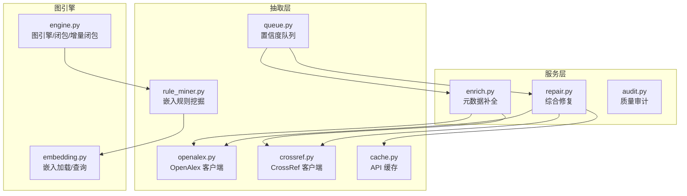
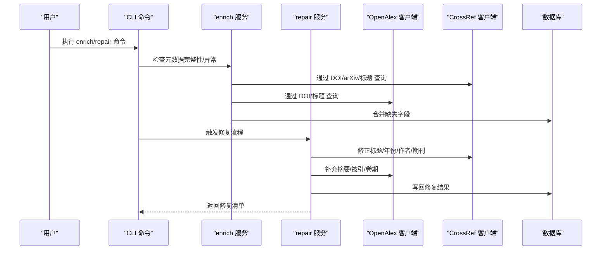
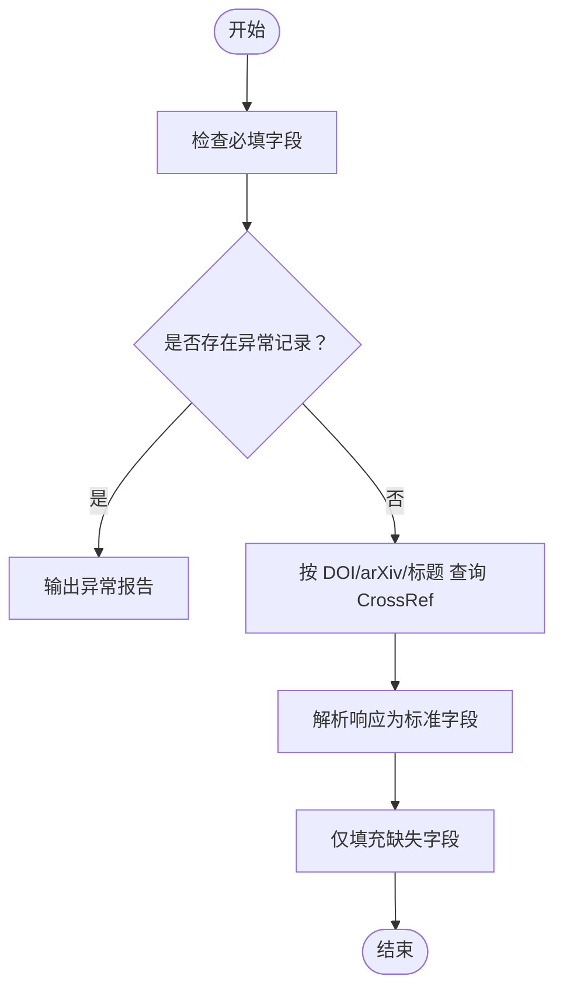
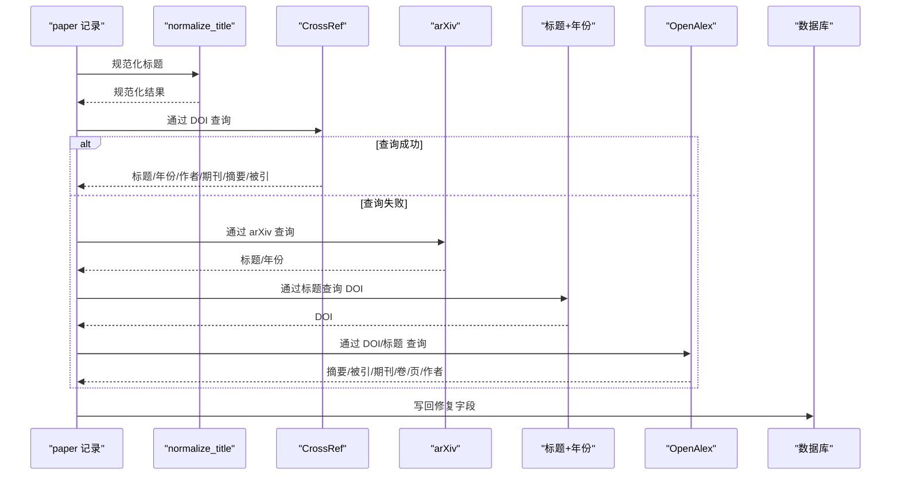
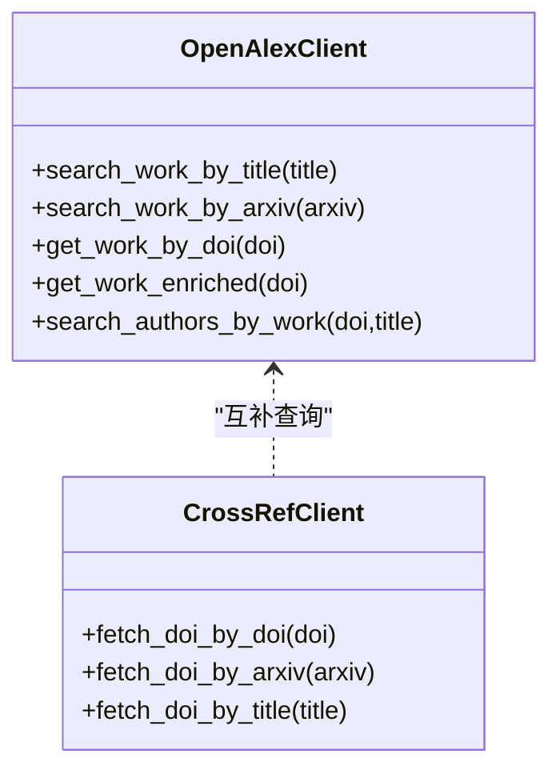
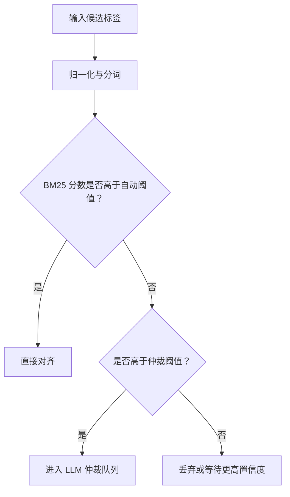
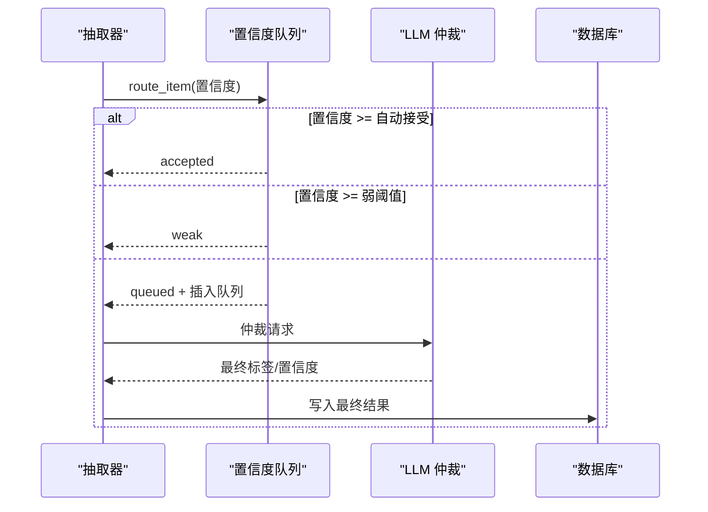
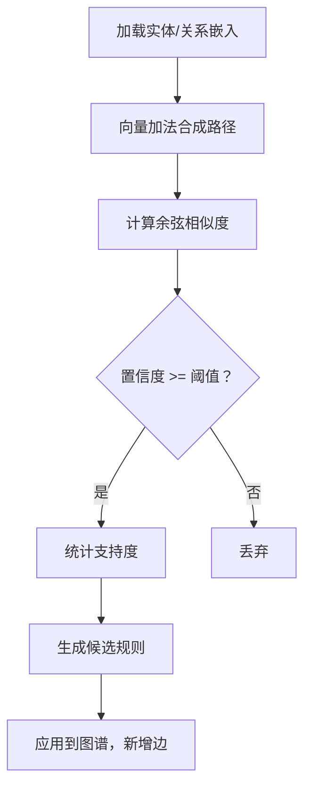
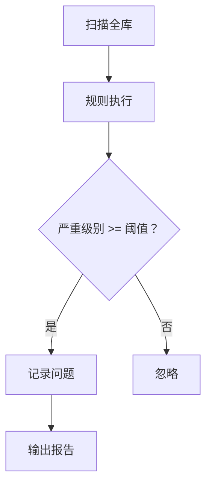
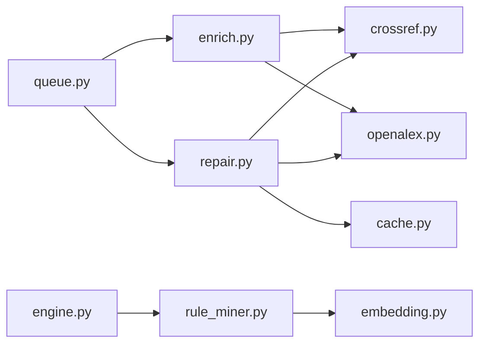

# 丰富化服务

<cite>
**本文引用的文件**
- [enrich.py](file://src/drbrain/services/enrich.py)
- [repair.py](file://src/drbrain/services/repair.py)
- [openalex.py](file://src/drbrain/extractor/openalex.py)
- [crossref.py](file://src/drbrain/extractor/crossref.py)
- [cache.py](file://src/drbrain/extractor/cache.py)
- [SKILL.md（enrich 技能）](file://skills/enrich/SKILL.md)
- [SKILL.md（audit 技能）](file://skills/audit/SKILL.md)
- [audit.py](file://src/drbrain/services/audit.py)
- [queue.py](file://src/drbrain/extractor/queue.py)
- [rule_miner.py](file://src/drbrain/extractor/rule_miner.py)
- [engine.py（图引擎）](file://src/drbrain/graph/engine.py)
- [embedding.py（嵌入）](file://src/drbrain/graph/embedding.py)
- [config.example.yaml](file://config.example.yaml)
- [configuration.md](file://docs/configuration.md)
- [2026-05-02-hybrid-ranking-design.md](file://docs/superpowers/specs/2026-05-02-hybrid-ranking-design.md)
- [test_enrich.py](file://tests/test_enrich.py)
- [test_repair.py](file://tests/test_repair.py)
- [test_api_cache.py](file://tests/test_api_cache.py)
- [test_incremental_closure.py](file://tests/test_incremental_closure.py)
- [test_queue.py](file://tests/test_queue.py)
</cite>

## 目录
1. [简介](#简介)
2. [项目结构](#项目结构)
3. [核心组件](#核心组件)
4. [架构总览](#架构总览)
5. [详细组件分析](#详细组件分析)
6. [依赖关系分析](#依赖关系分析)
7. [性能考量与优化](#性能考量与优化)
8. [故障排查指南](#故障排查指南)
9. [结论](#结论)
10. [附录](#附录)

## 简介
本文件系统性阐述 DrBrain 丰富化服务模块的设计与实现，覆盖以下关键主题：
- 实体链接：通过 CrossRef/OpenAlex 等外部知识库进行 DOI 解析、标题匹配与作者信息补全。
- 关系补全：基于嵌入空间的关系组合挖掘与图闭包规则，生成新的语义边。
- 属性填充：从 OpenAlex 获取摘要、被引次数、期刊、卷期页等缺失字段。
- 外部知识库集成：统一的 HTTP 会话与重试策略、可插拔的 API 客户端。
- 本体对齐与语义匹配：概念标签归一化、BM25 对齐阈值与 LLM 协商。
- 规则引擎与置信度：抽取置信度队列、共识检测与自动接受阈值；图规则挖掘与置信度评分。
- 质量评估：元数据完整性检查、异常记录检测、全面审计与修复流程。
- 性能优化：API 缓存、增量闭包、混合排序（BM25 + 图中心性）。
- 使用指南：CLI 操作、配置项、自定义规则与持续改进。

## 项目结构
丰富化服务位于服务层与抽取层之间，围绕“元数据增强”和“知识图谱补全”两条主线展开：
- 服务层：enrich（元数据补全）、repair（综合修复）、audit（质量审计）
- 抽取层：openalex（OpenAlex API 客户端）、crossref（CrossRef API 客户端）、cache（API 缓存）、queue（置信度队列）、rule_miner（嵌入驱动规则挖掘）
- 图引擎：提供闭包、增量闭包、规则应用与图增强能力

**图表来源**
- [enrich.py:1-171](file://src/drbrain/services/enrich.py#L1-L171)
- [repair.py:1-337](file://src/drbrain/services/repair.py#L1-L337)
- [audit.py:1-396](file://src/drbrain/services/audit.py#L1-L396)
- [openalex.py:1-421](file://src/drbrain/extractor/openalex.py#L1-L421)
- [crossref.py:1-180](file://src/drbrain/extractor/crossref.py#L1-L180)
- [cache.py:1-65](file://src/drbrain/extractor/cache.py#L1-L65)
- [queue.py:1-45](file://src/drbrain/extractor/queue.py#L1-L45)
- [rule_miner.py:1-290](file://src/drbrain/extractor/rule_miner.py#L1-L290)
- [engine.py（图引擎）:1095-1117](file://src/drbrain/graph/engine.py#L1095-L1117)
- [embedding.py（嵌入）](file://src/drbrain/graph/embedding.py)

**章节来源**
- [enrich.py:1-171](file://src/drbrain/services/enrich.py#L1-L171)
- [repair.py:1-337](file://src/drbrain/services/repair.py#L1-L337)
- [openalex.py:1-421](file://src/drbrain/extractor/openalex.py#L1-L421)
- [crossref.py:1-180](file://src/drbrain/extractor/crossref.py#L1-L180)
- [cache.py:1-65](file://src/drbrain/extractor/cache.py#L1-L65)
- [queue.py:1-45](file://src/drbrain/extractor/queue.py#L1-L45)
- [rule_miner.py:1-290](file://src/drbrain/extractor/rule_miner.py#L1-L290)
- [engine.py（图引擎）:1095-1117](file://src/drbrain/graph/engine.py#L1095-L1117)

## 核心组件
- 元数据补全服务（enrich）：检查必填字段、跨库回填、合并策略、异常记录检测。
- 综合修复服务（repair）：多源修复（CrossRef、arXiv、OpenAlex、标题年份），规范化与批量写回。
- 外部知识库客户端：OpenAlex 与 CrossRef 的统一接口，带重试与超时控制。
- API 缓存：文件型 TTL 缓存，降低外部 API 压力。
- 置信度队列：抽取阶段的路由与共识检测，支持自动接受与人工复核。
- 嵌入驱动规则挖掘：基于 TransE 向量加法发现路径规则，结合图遍历统计支持度。
- 图引擎：闭包与增量闭包，规则应用与溯源增强。

**章节来源**
- [enrich.py:14-171](file://src/drbrain/services/enrich.py#L14-L171)
- [repair.py:16-337](file://src/drbrain/services/repair.py#L16-L337)
- [openalex.py:17-421](file://src/drbrain/extractor/openalex.py#L17-L421)
- [crossref.py:17-180](file://src/drbrain/extractor/crossref.py#L17-L180)
- [cache.py:14-65](file://src/drbrain/extractor/cache.py#L14-L65)
- [queue.py:10-45](file://src/drbrain/extractor/queue.py#L10-L45)
- [rule_miner.py:33-290](file://src/drbrain/extractor/rule_miner.py#L33-L290)
- [engine.py（图引擎）:1095-1117](file://src/drbrain/graph/engine.py#L1095-L1117)

## 架构总览
丰富化服务在“元数据增强”和“图谱补全”两个维度协同工作：
- 元数据增强：以 CrossRef/OpenAlex 为主，辅以 arXiv 标准化与标题年份反查。
- 图谱补全：通过嵌入规则挖掘与图闭包，生成新关系并增强推理链。

**图表来源**
- [enrich.py:14-171](file://src/drbrain/services/enrich.py#L14-L171)
- [repair.py:265-337](file://src/drbrain/services/repair.py#L265-L337)
- [openalex.py:167-248](file://src/drbrain/extractor/openalex.py#L167-L248)
- [crossref.py:49-133](file://src/drbrain/extractor/crossref.py#L49-L133)

## 详细组件分析

### 元数据补全服务（enrich）
- 必填字段检查：标题、年份、作者、期刊。
- 异常记录检测：空标题、过短标题、疑似文件名、未来年份、缺作者等。
- CrossRef 回填：构建 URL、解析响应、合并策略（仅填充缺失字段）。
- 输出：缺失字段列表、问题描述、合并后的元数据字典。

**图表来源**
- [enrich.py:14-171](file://src/drbrain/services/enrich.py#L14-L171)

**章节来源**
- [enrich.py:14-171](file://src/drbrain/services/enrich.py#L14-L171)
- [test_enrich.py:1-48](file://tests/test_enrich.py#L1-L48)

### 综合修复服务（repair）
- 修复来源与优先级：CrossRef → arXiv → 标题+年份 → OpenAlex。
- 规范化：标题大小写与 arXiv 前缀清理。
- 字段修复：标题、年份、作者、期刊、摘要、被引数、卷、页码。
- 写回策略：dry-run 模式下仅返回修复建议，否则批量更新数据库。

**图表来源**
- [repair.py:265-337](file://src/drbrain/services/repair.py#L265-L337)
- [openalex.py:148-248](file://src/drbrain/extractor/openalex.py#L148-L248)
- [crossref.py:107-133](file://src/drbrain/extractor/crossref.py#L107-L133)

**章节来源**
- [repair.py:16-337](file://src/drbrain/services/repair.py#L16-L337)
- [test_repair.py:452-618](file://tests/test_repair.py#L452-L618)

### 外部知识库集成（OpenAlex 与 CrossRef）
- 会话与重试：统一的 HTTP 会话，指数退避重试，支持 429/5xx。
- OpenAlex：按 DOI/标题/arXiv 查询工作信息，重建摘要，提取作者与期刊信息。
- CrossRef：按 DOI/arXiv/标题查询，标题相似度判定，避免误匹配。

**图表来源**
- [openalex.py:17-421](file://src/drbrain/extractor/openalex.py#L17-L421)
- [crossref.py:17-180](file://src/drbrain/extractor/crossref.py#L17-L180)

**章节来源**
- [openalex.py:17-421](file://src/drbrain/extractor/openalex.py#L17-L421)
- [crossref.py:17-180](file://src/drbrain/extractor/crossref.py#L17-L180)

### 本体对齐与语义匹配
- 概念标签归一化：停用词过滤、中英文字符识别、标准化大小写。
- BM25 对齐阈值：自动对齐阈值与待仲裁阈值，减少误配。
- LLM 协商：在阈值区间内交由 LLM 进行仲裁，保证一致性。

**图表来源**
- [canonical.py（概念归一化）:18-43](file://src/drbrain/extractor/canonical.py#L18-L43)

**章节来源**
- [canonical.py（概念归一化）:18-43](file://src/drbrain/extractor/canonical.py#L18-L43)

### 规则引擎与置信度管理
- 抽取置信度队列：高置信度自动接受，低置信度进入队列，中间值标记弱证据。
- 共识检测：同一标签在多篇论文中出现且平均置信度达标即达成共识。
- 嵌入驱动规则挖掘：基于 TransE 向量加法发现路径规则，统计支持度并排序。

**图表来源**
- [queue.py:10-45](file://src/drbrain/extractor/queue.py#L10-L45)

**章节来源**
- [queue.py:10-45](file://src/drbrain/extractor/queue.py#L10-L45)
- [test_queue.py:1-42](file://tests/test_queue.py#L1-L42)

### 图谱补全与关系补全
- 嵌入驱动规则挖掘：向量加法近似路径合成，余弦相似度作为置信度，统计支持度。
- 图遍历：序列遍历与并行边模式，收集频繁路径作为候选规则。
- 规则应用：将挖掘到的规则应用于现有图，生成新的边并增强推理链。

**图表来源**
- [rule_miner.py:33-197](file://src/drbrain/extractor/rule_miner.py#L33-L197)
- [embedding.py（嵌入）](file://src/drbrain/graph/embedding.py)

**章节来源**
- [rule_miner.py:33-290](file://src/drbrain/extractor/rule_miner.py#L33-L290)
- [engine.py（图引擎）:1095-1117](file://src/drbrain/graph/engine.py#L1095-L1117)

### 质量评估与审计
- 元数据完整性检查：必填字段缺失检测。
- 异常记录检测：标题、作者、年份、文件名等可疑情况。
- 全库审计：15 条规则分级（错误/警告/提示），输出结构化报告。
- 修复验证：修复后字段对比与来源标注。

**图表来源**
- [audit.py:30-396](file://src/drbrain/services/audit.py#L30-L396)
- [enrich.py:31-69](file://src/drbrain/services/enrich.py#L31-L69)

**章节来源**
- [audit.py:30-396](file://src/drbrain/services/audit.py#L30-L396)
- [SKILL.md（audit 技能）:1-30](file://skills/audit/SKILL.md#L1-L30)

## 依赖关系分析
- 服务层依赖抽取层 API 客户端与缓存模块，确保对外部资源的稳定访问。
- 图引擎依赖嵌入模块与规则挖掘模块，形成“嵌入 → 规则 → 闭包”的闭环。
- 置信度队列贯穿抽取与修复流程，保障质量门控。

**图表来源**
- [enrich.py:1-171](file://src/drbrain/services/enrich.py#L1-L171)
- [repair.py:1-337](file://src/drbrain/services/repair.py#L1-L337)
- [openalex.py:1-421](file://src/drbrain/extractor/openalex.py#L1-L421)
- [crossref.py:1-180](file://src/drbrain/extractor/crossref.py#L1-L180)
- [cache.py:1-65](file://src/drbrain/extractor/cache.py#L1-L65)
- [queue.py:1-45](file://src/drbrain/extractor/queue.py#L1-L45)
- [rule_miner.py:1-290](file://src/drbrain/extractor/rule_miner.py#L1-L290)
- [engine.py（图引擎）:1095-1117](file://src/drbrain/graph/engine.py#L1095-L1117)

**章节来源**
- [enrich.py:1-171](file://src/drbrain/services/enrich.py#L1-L171)
- [repair.py:1-337](file://src/drbrain/services/repair.py#L1-L337)
- [openalex.py:1-421](file://src/drbrain/extractor/openalex.py#L1-L421)
- [crossref.py:1-180](file://src/drbrain/extractor/crossref.py#L1-L180)
- [cache.py:1-65](file://src/drbrain/extractor/cache.py#L1-L65)
- [queue.py:1-45](file://src/drbrain/extractor/queue.py#L1-L45)
- [rule_miner.py:1-290](file://src/drbrain/extractor/rule_miner.py#L1-L290)
- [engine.py（图引擎）:1095-1117](file://src/drbrain/graph/engine.py#L1095-L1117)

## 性能考量与优化
- API 缓存：文件型 TTL 缓存，降低重复请求开销，支持跨实例持久化。
- 增量闭包：仅从受影响节点重新推断，减少全图闭包计算量。
- 混合排序：BM25 文本相关性 + PageRank 图信号乘性增强，不覆盖文本相关性。
- 并行与批处理：抽取阶段并发控制、嵌入模型批处理与设备内存优化。
- 配置项：速率限制、超时、缓存 TTL、队列阈值等均可通过配置文件调整。

**章节来源**
- [cache.py:14-65](file://src/drbrain/extractor/cache.py#L14-L65)
- [test_api_cache.py:1-87](file://tests/test_api_cache.py#L1-L87)
- [test_incremental_closure.py:1-42](file://tests/test_incremental_closure.py#L1-L42)
- [2026-05-02-hybrid-ranking-design.md:1-102](file://docs/superpowers/specs/2026-05-02-hybrid-ranking-design.md#L1-L102)
- [configuration.md:250-264](file://docs/configuration.md#L250-L264)
- [config.example.yaml:90-126](file://config.example.yaml#L90-L126)

## 故障排查指南
- API 请求失败：检查网络、超时与重试设置；确认凭据与速率限制。
- 缓存异常：检查缓存目录权限与磁盘空间；验证 TTL 设置。
- 规则未生效：确认嵌入已加载、规则置信度阈值与支持度要求；检查增量闭包种子节点。
- 修复未写回：确认非 dry-run 模式；检查数据库连接与事务提交。
- 审计报告为空：确认严重级别阈值设置与工作区过滤条件。

**章节来源**
- [openalex.py:17-421](file://src/drbrain/extractor/openalex.py#L17-L421)
- [crossref.py:17-180](file://src/drbrain/extractor/crossref.py#L17-L180)
- [cache.py:14-65](file://src/drbrain/extractor/cache.py#L14-L65)
- [repair.py:295-337](file://src/drbrain/services/repair.py#L295-L337)
- [audit.py:312-396](file://src/drbrain/services/audit.py#L312-L396)

## 结论
DrBrain 的丰富化服务通过“外部知识库 + 图谱规则”的双轮驱动，实现了高质量的元数据补全与关系补全。服务层提供清晰的 CLI 接口与质量门控，抽取层保证对外部 API 的稳健访问，图引擎与规则挖掘进一步提升语义连通性。配合缓存、增量闭包与混合排序等优化手段，整体具备良好的扩展性与实用性。

## 附录

### 使用指南与 CLI 参考
- 元数据补全：支持单篇检查、全库扫描、JSON 输出与干跑模式。
- 综合修复：多源回填、规范化与批量写回。
- 审计：15 条规则分级输出，支持工作区过滤与 JSON 导出。

**章节来源**
- [SKILL.md（enrich 技能）:15-44](file://skills/enrich/SKILL.md#L15-L44)
- [SKILL.md（audit 技能）:1-30](file://skills/audit/SKILL.md#L1-L30)

### 配置项参考
- 外部 API：CrossRef 邮箱、OpenAlex Token、S2 速率限制、缓存 TTL。
- 搜索参数：BM25 k1/b。
- 质量控制：置信度队列阈值（弱阈值、自动接受阈值）。
- 嵌入与设备：提供方、模型、设备、批大小等。

**章节来源**
- [config.example.yaml:90-126](file://config.example.yaml#L90-L126)
- [configuration.md:250-264](file://docs/configuration.md#L250-L264)