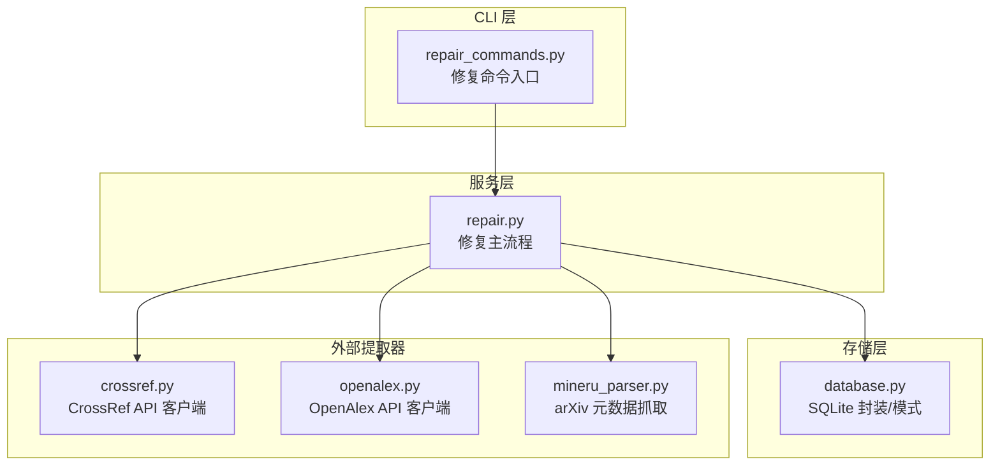
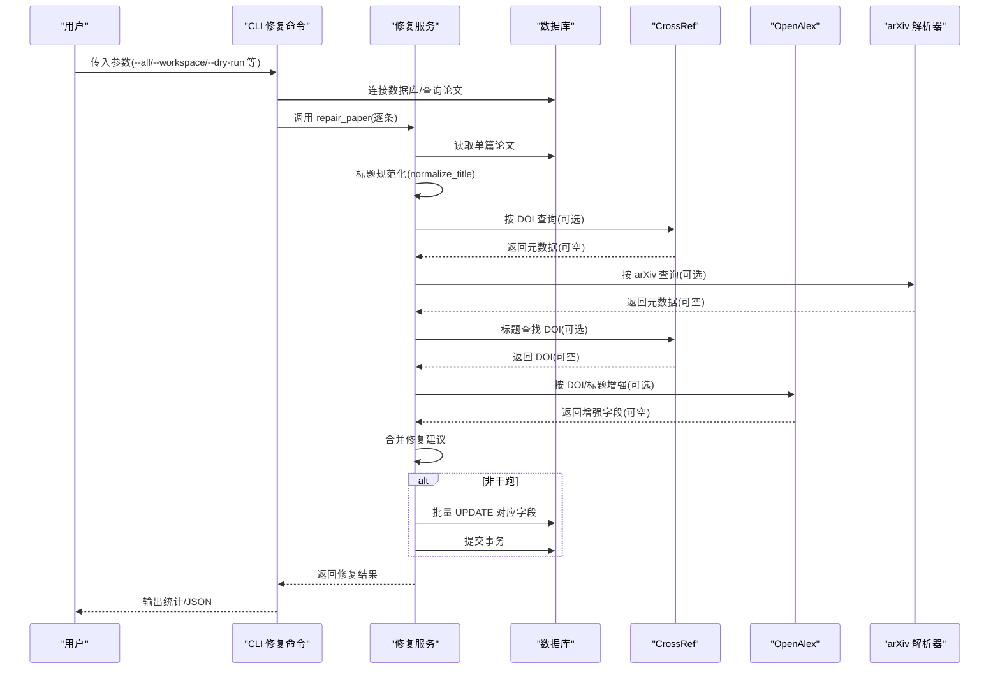
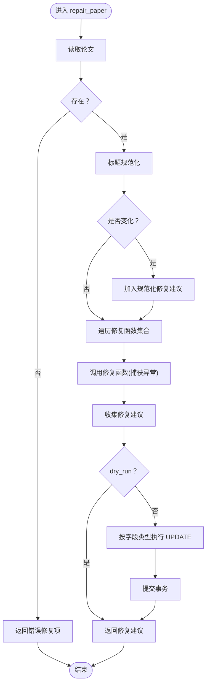
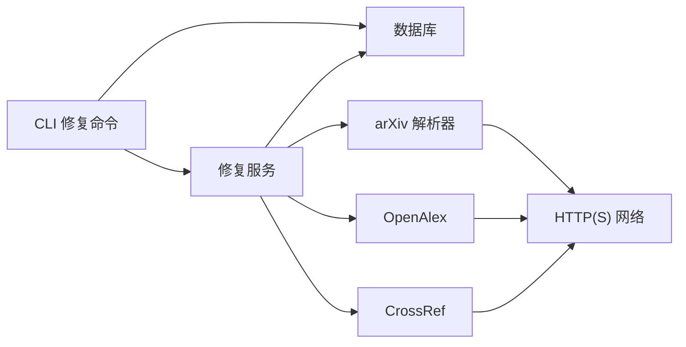

# 修复服务

<cite>
**本文引用的文件**
- [src/drbrain/services/repair.py](file://src/drbrain/services/repair.py)
- [src/drbrain/cli/repair_commands.py](file://src/drbrain/cli/repair_commands.py)
- [src/drbrain/storage/database.py](file://src/drbrain/storage/database.py)
- [src/drbrain/extractor/crossref.py](file://src/drbrain/extractor/crossref.py)
- [src/drbrain/extractor/openalex.py](file://src/drbrain/extractor/openalex.py)
- [src/drbrain/parser/mineru_parser.py](file://src/drbrain/parser/mineru_parser.py)
- [tests/test_repair.py](file://tests/test_repair.py)
- [README.md](file://README.md)
</cite>

## 目录
1. [简介](#简介)
2. [项目结构](#项目结构)
3. [核心组件](#核心组件)
4. [架构总览](#架构总览)
5. [详细组件分析](#详细组件分析)
6. [依赖分析](#依赖分析)
7. [性能考虑](#性能考虑)
8. [故障排查指南](#故障排查指南)
9. [结论](#结论)
10. [附录：使用指南与最佳实践](#附录使用指南与最佳实践)

## 简介
本文件面向 DrBrain 的“修复服务”模块，系统化阐述其数据修复实现原理与工程细节，包括：
- 数据完整性检查与错误检测
- 多源外部 API 自动修复（CrossRef、arXiv、OpenAlex）
- 修复策略、冲突解决与一致性保证
- 规则引擎与版本管理（迁移）要点
- 实际调用方式、配置参数与修复流程
- 性能优化、并发处理与错误处理
- 使用指南、风险评估与最佳实践

## 项目结构
修复服务位于服务层，通过 CLI 命令入口触发，底层依赖数据库与外部提取器模块。

图表来源
- [src/drbrain/cli/repair_commands.py:14-75](file://src/drbrain/cli/repair_commands.py#L14-L75)
- [src/drbrain/services/repair.py:265-336](file://src/drbrain/services/repair.py#L265-L336)
- [src/drbrain/storage/database.py:10-156](file://src/drbrain/storage/database.py#L10-L156)
- [src/drbrain/extractor/crossref.py:1-180](file://src/drbrain/extractor/crossref.py#L1-L180)
- [src/drbrain/extractor/openalex.py:1-200](file://src/drbrain/extractor/openalex.py#L1-L200)
- [src/drbrain/parser/mineru_parser.py:533-560](file://src/drbrain/parser/mineru_parser.py#L533-L560)

章节来源
- [src/drbrain/cli/repair_commands.py:14-75](file://src/drbrain/cli/repair_commands.py#L14-L75)
- [src/drbrain/services/repair.py:265-336](file://src/drbrain/services/repair.py#L265-L336)
- [src/drbrain/storage/database.py:10-156](file://src/drbrain/storage/database.py#L10-L156)

## 核心组件
- 修复主流程：按顺序执行多源修复函数，生成修复建议列表；在非干跑模式下批量写入数据库。
- 标题规范化：统一大小写、去除 arXiv 前缀等，减少噪声。
- 多源修复函数：
  - CrossRef 修复：基于 DOI 获取标题、作者、年份、期刊、摘要、被引数等。
  - arXiv 修复：基于 arXiv ID 获取标题与年份。
  - 标题+年份修复：当仅有标题时，尝试从 CrossRef 查找 DOI。
  - OpenAlex 增强：补充摘要、被引数、作者、卷期页码等。
- CLI 修复命令：支持单篇、全库或工作区修复，支持干跑预览与 JSON 输出。
- 数据库接口：提供论文读取、更新、提交与模式迁移。

章节来源
- [src/drbrain/services/repair.py:16-336](file://src/drbrain/services/repair.py#L16-L336)
- [src/drbrain/cli/repair_commands.py:14-75](file://src/drbrain/cli/repair_commands.py#L14-L75)
- [src/drbrain/storage/database.py:159-200](file://src/drbrain/storage/database.py#L159-L200)

## 架构总览
修复服务采用“服务层 + 外部提取器 + 存储层”的分层设计，CLI 负责参数解析与批量调度，服务层负责修复策略与事务控制，存储层负责持久化与模式演进，外部提取器负责跨源元数据获取。

图表来源
- [src/drbrain/cli/repair_commands.py:28-75](file://src/drbrain/cli/repair_commands.py#L28-L75)
- [src/drbrain/services/repair.py:265-336](file://src/drbrain/services/repair.py#L265-L336)
- [src/drbrain/extractor/crossref.py:49-179](file://src/drbrain/extractor/crossref.py#L49-L179)
- [src/drbrain/extractor/openalex.py:167-200](file://src/drbrain/extractor/openalex.py#L167-L200)
- [src/drbrain/parser/mineru_parser.py:533-560](file://src/drbrain/parser/mineru_parser.py#L533-L560)

## 详细组件分析

### 组件一：修复主流程与策略
- 输入：数据库连接、本地 ID、是否干跑。
- 步骤：
  - 读取论文；若不存在返回错误修复项。
  - 标题规范化；若变化则加入修复建议。
  - 依次调用各修复函数，收集修复建议；任一函数异常会被捕获并记录日志，不影响其他修复函数。
  - 若非干跑，按字段类型分别执行 UPDATE；最后提交事务。
- 输出：修复建议列表（含字段名、旧值、新值、来源）。

图表来源
- [src/drbrain/services/repair.py:265-336](file://src/drbrain/services/repair.py#L265-L336)

章节来源
- [src/drbrain/services/repair.py:265-336](file://src/drbrain/services/repair.py#L265-L336)

### 组件二：标题规范化
- 功能：去除 arXiv 前缀、统一大小写（标题格式），避免因大小写导致的重复修复。
- 影响：作为第一条修复建议，优先于外部 API 修复，降低无效网络请求。

章节来源
- [src/drbrain/services/repair.py:16-55](file://src/drbrain/services/repair.py#L16-L55)

### 组件三：CrossRef 修复
- 条件：存在 DOI。
- 行为：按 DOI 查询，对比标题、年份、作者、期刊、摘要、被引数，差异即生成修复建议。
- 异常：网络/解析异常被捕获并记录日志，不中断整体流程。

章节来源
- [src/drbrain/services/repair.py:58-122](file://src/drbrain/services/repair.py#L58-L122)
- [src/drbrain/extractor/crossref.py:49-133](file://src/drbrain/extractor/crossref.py#L49-L133)

### 组件四：arXiv 修复
- 条件：存在 arXiv ID。
- 行为：按 arXiv 获取标题与年份，与当前值对比后生成修复建议。
- 异常：同上。

章节来源
- [src/drbrain/services/repair.py:125-145](file://src/drbrain/services/repair.py#L125-L145)
- [src/drbrain/parser/mineru_parser.py:533-560](file://src/drbrain/parser/mineru_parser.py#L533-L560)

### 组件五：标题+年份修复（反向补全 DOI）
- 条件：不存在 DOI 且存在标题。
- 行为：以标题查询 CrossRef，若命中则补全 DOI。
- 异常：同上。

章节来源
- [src/drbrain/services/repair.py:244-262](file://src/drbrain/services/repair.py#L244-L262)
- [src/drbrain/extractor/crossref.py:49-84](file://src/drbrain/extractor/crossref.py#L49-L84)

### 组件六：OpenAlex 增强
- 条件：存在 DOI 或标题。
- 行为：优先按 DOI 获取完整元数据；若无 DOI 则先按标题搜索到 DOI 再获取；作者缺失时单独查询作者列表并拼接。
- 异常：同上。

章节来源
- [src/drbrain/services/repair.py:148-241](file://src/drbrain/services/repair.py#L148-L241)
- [src/drbrain/extractor/openalex.py:167-200](file://src/drbrain/extractor/openalex.py#L167-L200)

### 组件七：CLI 修复命令
- 支持：
  - 单篇修复：指定 local_id。
  - 全库修复：--all。
  - 工作区修复：--workspace。
  - 干跑：--dry-run。
  - JSON 输出：--json。
- 行为：根据参数筛选论文，逐条调用修复服务，汇总输出统计或 JSON。

章节来源
- [src/drbrain/cli/repair_commands.py:14-75](file://src/drbrain/cli/repair_commands.py#L14-L75)

### 组件八：数据库与模式
- 模式：papers、paper_ids、索引等。
- 接口：读取论文、插入/更新/删除、提交、迁移。
- 修复写入：按字段类型分别更新 papers 或 paper_ids，并在非干跑时提交。

章节来源
- [src/drbrain/storage/database.py:10-156](file://src/drbrain/storage/database.py#L10-L156)
- [src/drbrain/storage/database.py:159-200](file://src/drbrain/storage/database.py#L159-L200)
- [src/drbrain/services/repair.py:295-333](file://src/drbrain/services/repair.py#L295-L333)

## 依赖分析
- 服务层依赖：
  - 数据库：读取/更新/提交。
  - 外部提取器：CrossRef、OpenAlex、arXiv。
- 外部提取器依赖：
  - requests + 重试适配器，提升稳定性。
- CLI 依赖：
  - 通过上下文注入配置与数据库连接。

图表来源
- [src/drbrain/services/repair.py:265-336](file://src/drbrain/services/repair.py#L265-L336)
- [src/drbrain/extractor/crossref.py:17-39](file://src/drbrain/extractor/crossref.py#L17-L39)
- [src/drbrain/extractor/openalex.py:17-39](file://src/drbrain/extractor/openalex.py#L17-L39)
- [src/drbrain/cli/repair_commands.py:25-26](file://src/drbrain/cli/repair_commands.py#L25-L26)

章节来源
- [src/drbrain/services/repair.py:265-336](file://src/drbrain/services/repair.py#L265-L336)
- [src/drbrain/extractor/crossref.py:17-39](file://src/drbrain/extractor/crossref.py#L17-L39)
- [src/drbrain/extractor/openalex.py:17-39](file://src/drbrain/extractor/openalex.py#L17-L39)
- [src/drbrain/cli/repair_commands.py:25-26](file://src/drbrain/cli/repair_commands.py#L25-L26)

## 性能考虑
- 并发与批处理：
  - 当前 CLI 逐条调用修复服务，未见显式并发；如需大规模修复，可在上层批量调度中引入并发队列（例如基于线程池/进程池的任务队列）。
- 网络请求优化：
  - 外部提取器已内置重试与退避；建议在高并发场景下限制并发度并设置合理的超时与重试上限。
- 数据库写入：
  - 修复服务在非干跑时批量执行 UPDATE 并一次性提交，减少事务开销。
- 缓存与去重：
  - 可在修复前对 DOI/arXiv/标题进行缓存，避免重复查询；测试中也体现了对已有 DOI 的去重逻辑（导入阶段）。

[本节为通用性能讨论，不直接分析具体文件]

## 故障排查指南
- 常见问题与定位：
  - 外部 API 异常：CrossRef/OpenAlex/arXiv 请求失败或返回空数据，修复函数会捕获异常并记录日志，不影响其他修复函数。
  - 论文不存在：返回错误修复项，CLI 会提示并退出。
  - 标题相似性判定：CrossRef 标题匹配采用清洗后相似度阈值，若匹配失败不会补全 DOI。
- 日志与调试：
  - 修复服务与外部提取器均使用日志记录异常；可通过日志级别查看详细堆栈。
- 测试覆盖：
  - 单元测试覆盖了标题规范化、各修复函数的返回路径、异常处理、SQL 更新路径等，便于回归验证。

章节来源
- [src/drbrain/services/repair.py:66-71](file://src/drbrain/services/repair.py#L66-L71)
- [src/drbrain/extractor/crossref.py:82-84](file://src/drbrain/extractor/crossref.py#L82-L84)
- [src/drbrain/extractor/openalex.py:77-79](file://src/drbrain/extractor/openalex.py#L77-L79)
- [tests/test_repair.py:377-441](file://tests/test_repair.py#L377-L441)

## 结论
修复服务通过“标题规范化 + 多源外部 API 交叉验证 + 批量事务写入”的策略，实现了对论文元数据的自动化修复与增强。其设计具备良好的容错性与可扩展性，适合在大规模知识图谱构建与维护中使用。后续可在 CLI 层引入并发与缓存策略，进一步提升修复效率与稳定性。

[本节为总结性内容，不直接分析具体文件]

## 附录：使用指南与最佳实践

### 使用指南
- CLI 常用命令
  - 修复单篇：指定 local_id，可加 --dry-run 预览。
  - 修复全库：--all。
  - 修复工作区：--workspace <ws_id>。
  - 输出 JSON：--json。
- 修复流程
  - CLI 选择论文 → 逐条调用修复服务 → 生成修复建议 → 非干跑时批量写入数据库 → 提交事务 → 输出统计。

章节来源
- [src/drbrain/cli/repair_commands.py:14-75](file://src/drbrain/cli/repair_commands.py#L14-L75)
- [src/drbrain/services/repair.py:265-336](file://src/drbrain/services/repair.py#L265-L336)

### 配置参数
- CLI 参数
  - --all：全库修复
  - --workspace：按工作区过滤
  - --dry-run：干跑预览
  - --json：JSON 输出
- 外部 API
  - CrossRef/OpenAlex 支持通过请求头携带邮件/用户代理，建议在高并发场景下合理配置。

章节来源
- [src/drbrain/cli/repair_commands.py:14-21](file://src/drbrain/cli/repair_commands.py#L14-L21)
- [src/drbrain/extractor/crossref.py:60-63](file://src/drbrain/extractor/crossref.py#L60-L63)
- [src/drbrain/extractor/openalex.py:57-58](file://src/drbrain/extractor/openalex.py#L57-L58)

### 修复策略与冲突解决
- 修复顺序：规范化 → CrossRef → arXiv → 标题+年份 → OpenAlex。
- 冲突解决：同一字段的多个来源修复，按修复函数顺序合并；若存在歧义，建议在上层增加“优先级策略”或“人工审核”环节。
- 一致性保证：非干跑模式下按字段类型分别更新，最后一次性提交，确保原子性。

章节来源
- [src/drbrain/services/repair.py:281-294](file://src/drbrain/services/repair.py#L281-L294)
- [src/drbrain/services/repair.py:295-333](file://src/drbrain/services/repair.py#L295-L333)

### 版本管理与迁移
- 数据库模式：通过 schema_versions 表记录迁移版本，按序应用迁移脚本。
- 修复服务与模式演进：新增字段或表结构变更时，需在迁移脚本中兼容旧数据，避免修复流程报错。

章节来源
- [src/drbrain/storage/database.py:175-199](file://src/drbrain/storage/database.py#L175-L199)

### 风险评估与最佳实践
- 风险
  - 外部 API 不稳定：可能返回空或异常，需做好降级与重试。
  - 标题匹配误判：相似度阈值可能导致漏检或误补全。
  - 并发写入：大量修复同时写库可能造成锁竞争，建议限流或分批。
- 最佳实践
  - 优先使用 DOI 修复，其次 arXiv，最后标题+年份。
  - 在生产环境启用干跑预览，核对修复建议后再提交。
  - 对高频查询建立缓存，减少重复请求。
  - 对修复结果进行抽样审计，持续优化匹配阈值与修复策略。

[本节为通用指导，不直接分析具体文件]