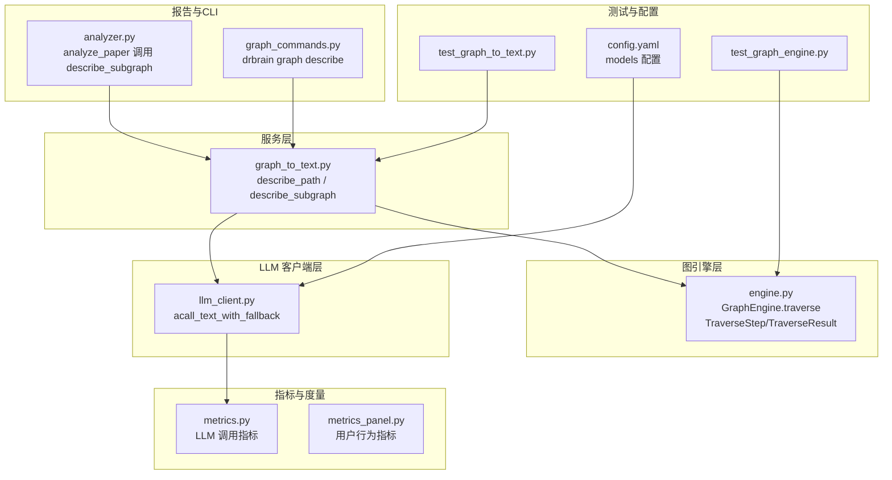
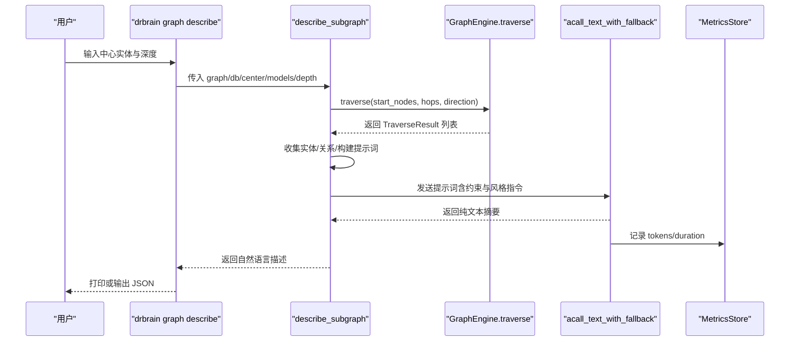
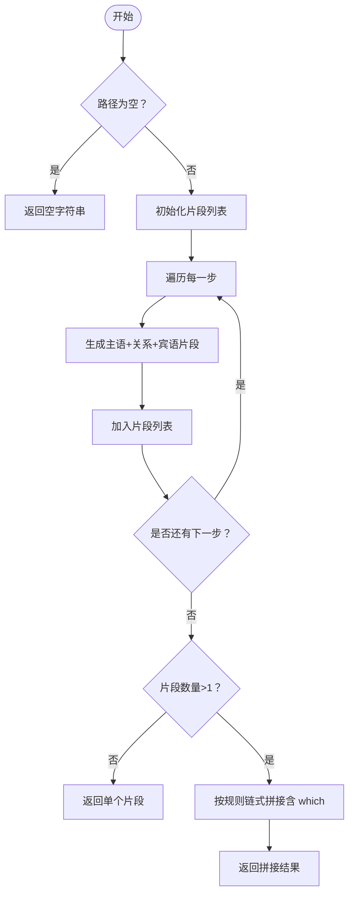
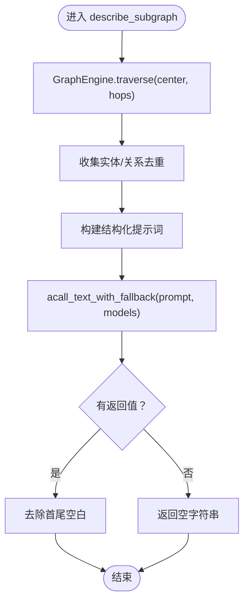
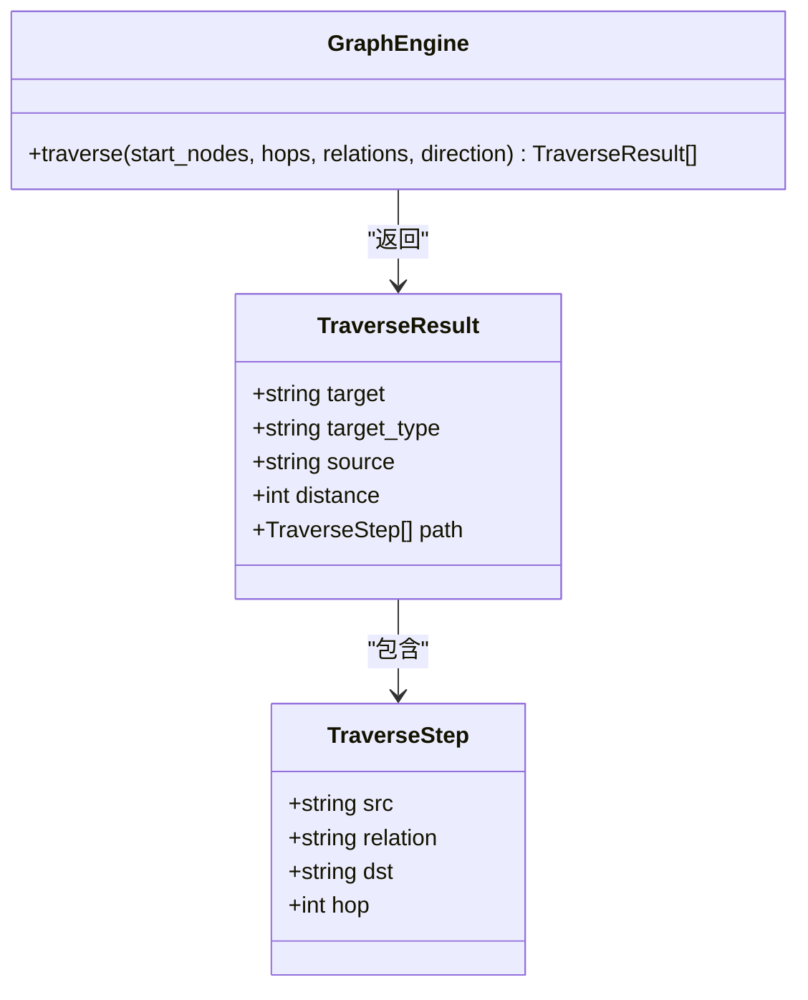
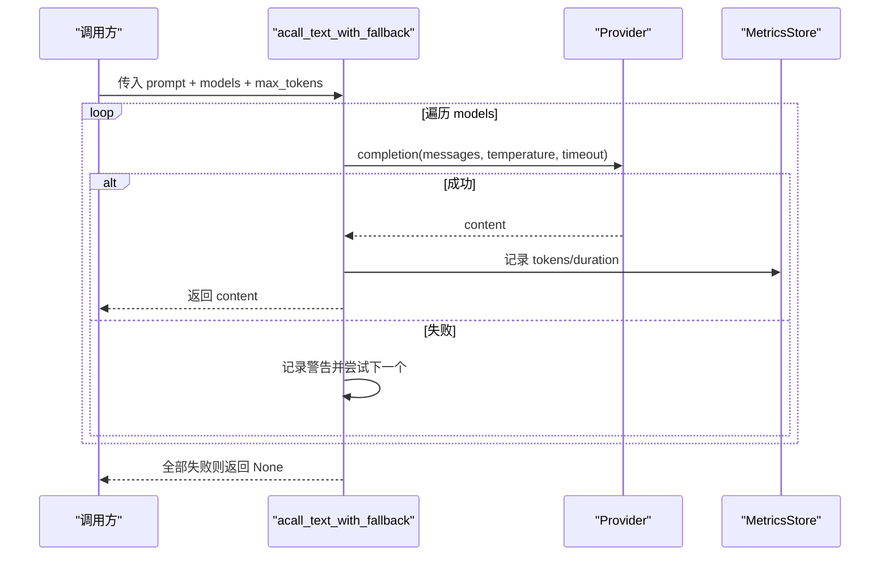
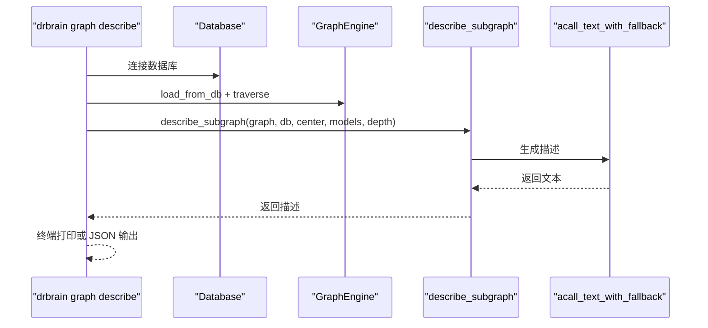
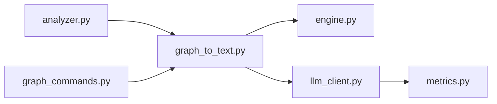

# 图转文本服务

<cite>
**本文引用的文件列表**
- [graph_to_text.py](file://src/drbrain/services/graph_to_text.py)
- [engine.py](file://src/drbrain/graph/engine.py)
- [llm_client.py](file://src/drbrain/extractor/llm_client.py)
- [analyzer.py](file://src/drbrain/report/analyzer.py)
- [graph_commands.py](file://src/drbrain/cli/graph_commands.py)
- [test_graph_to_text.py](file://tests/test_graph_to_text.py)
- [test_graph_engine.py](file://tests/test_graph_engine.py)
- [config.yaml](file://config.yaml)
- [metrics.py](file://src/drbrain/metrics.py)
- [metrics_panel.py](file://src/drbrain/services/metrics_panel.py)
</cite>

## 目录
1. [简介](#简介)
2. [项目结构](#项目结构)
3. [核心组件](#核心组件)
4. [架构总览](#架构总览)
5. [详细组件分析](#详细组件分析)
6. [依赖关系分析](#依赖关系分析)
7. [性能考量](#性能考量)
8. [故障排查指南](#故障排查指南)
9. [结论](#结论)
10. [附录](#附录)

## 简介
本文件面向 DrBrain 的“图转文本服务”，系统性阐述从知识图谱子图到自然语言描述的完整实现路径：包括图遍历算法、语义编码（关系映射）、自然语言生成（LLM 调用）、提示词工程与风格控制、以及 CLI 使用与集成。文档同时覆盖性能优化、缓存策略与质量评估建议，并提供可操作的使用指南与最佳实践。

## 项目结构
围绕“图转文本”的关键文件与职责如下：
- 服务层：负责将子图转化为自然语言描述
  - [graph_to_text.py](file://src/drbrain/services/graph_to_text.py)：路径描述与子图描述两大函数
- 图引擎层：提供遍历与路径追踪能力
  - [engine.py](file://src/drbrain/graph/engine.py)：TraverseStep/TraverseResult 数据结构与 traverse 方法
- LLM 客户端层：统一的多模型回退与指标记录
  - [llm_client.py](file://src/drbrain/extractor/llm_client.py)：acall_text_with_fallback 等异步文本调用
- 报告与 CLI 集成：在分析报告中嵌入图摘要
  - [analyzer.py](file://src/drbrain/report/analyzer.py)：analyze_paper 中调用 describe_subgraph
  - [graph_commands.py](file://src/drbrain/cli/graph_commands.py)：drbrain graph describe 命令
- 测试与配置：验证行为与运行时配置
  - [test_graph_to_text.py](file://tests/test_graph_to_text.py)、[test_graph_engine.py](file://tests/test_graph_engine.py)
  - [config.yaml](file://config.yaml)：LLM 模型配置
- 指标与度量：性能与质量观测
  - [metrics.py](file://src/drbrain/metrics.py)、[metrics_panel.py](file://src/drbrain/services/metrics_panel.py)

图表来源
- [graph_to_text.py:1-145](file://src/drbrain/services/graph_to_text.py#L1-L145)
- [engine.py:16-122](file://src/drbrain/graph/engine.py#L16-L122)
- [llm_client.py:117-154](file://src/drbrain/extractor/llm_client.py#L117-L154)
- [analyzer.py:122-133](file://src/drbrain/report/analyzer.py#L122-L133)
- [graph_commands.py:503-574](file://src/drbrain/cli/graph_commands.py#L503-L574)
- [test_graph_to_text.py:1-293](file://tests/test_graph_to_text.py#L1-L293)
- [test_graph_engine.py:254-339](file://tests/test_graph_engine.py#L254-L339)
- [config.yaml:7-13](file://config.yaml#L7-L13)
- [metrics.py:74-96](file://src/drbrain/metrics.py#L74-L96)
- [metrics_panel.py:42-67](file://src/drbrain/services/metrics_panel.py#L42-L67)

章节来源
- [graph_to_text.py:1-145](file://src/drbrain/services/graph_to_text.py#L1-L145)
- [engine.py:16-122](file://src/drbrain/graph/engine.py#L16-L122)
- [llm_client.py:117-154](file://src/drbrain/extractor/llm_client.py#L117-L154)
- [analyzer.py:122-133](file://src/drbrain/report/analyzer.py#L122-L133)
- [graph_commands.py:503-574](file://src/drbrain/cli/graph_commands.py#L503-L574)
- [test_graph_to_text.py:1-293](file://tests/test_graph_to_text.py#L1-L293)
- [test_graph_engine.py:254-339](file://tests/test_graph_engine.py#L254-L339)
- [config.yaml:7-13](file://config.yaml#L7-L13)
- [metrics.py:74-96](file://src/drbrain/metrics.py#L74-L96)
- [metrics_panel.py:42-67](file://src/drbrain/services/metrics_panel.py#L42-L67)

## 核心组件
- 图路径描述（describe_path）
  - 将一条由多个 Traversal 步骤组成的路径，转换为自然语言句子；支持链式连接与关系语义化映射。
- 子图描述（describe_subgraph）
  - 基于中心实体进行多跳遍历，收集邻居与关系类型，构造结构化提示词，调用 LLM 生成简洁段落式描述。
- 图遍历（GraphEngine.traverse）
  - 提供 BFS 式的多跳遍历，返回 TraverseResult 列表，包含路径、距离与源节点等信息。
- LLM 文本调用（acall_text_with_fallback）
  - 支持多模型回退链、超时与令牌统计，返回纯文本结果并记录指标。

章节来源
- [graph_to_text.py:6-48](file://src/drbrain/services/graph_to_text.py#L6-L48)
- [graph_to_text.py:70-144](file://src/drbrain/services/graph_to_text.py#L70-L144)
- [engine.py:62-122](file://src/drbrain/graph/engine.py#L62-L122)
- [llm_client.py:117-154](file://src/drbrain/extractor/llm_client.py#L117-L154)

## 架构总览
下图展示了“图转文本”在 DrBrain 中的端到端调用链路，从 CLI 到服务再到 LLM 的交互过程。

图表来源
- [graph_commands.py:503-574](file://src/drbrain/cli/graph_commands.py#L503-L574)
- [graph_to_text.py:70-144](file://src/drbrain/services/graph_to_text.py#L70-L144)
- [engine.py:62-122](file://src/drbrain/graph/engine.py#L62-L122)
- [llm_client.py:117-154](file://src/drbrain/extractor/llm_client.py#L117-L154)
- [metrics.py:74-96](file://src/drbrain/metrics.py#L74-L96)

## 详细组件分析

### 组件一：图路径描述（describe_path）
- 功能要点
  - 接收路径步骤（TraverseStep 或字典），逐条生成“主语 + 关系 + 宾语”的片段。
  - 当相邻步骤的宾语与下一个步骤的主语一致时，采用“which”进行自然衔接，形成链式描述。
  - 支持传入 TraverseStep 对象或字典对象（兼容 JSON/CLI）。
- 关系语义化
  - 内置关系到自然语言动词/动名词的映射表，提升可读性与一致性。
- 复杂度
  - 时间复杂度 O(N)，N 为路径长度；空间复杂度 O(N)。

图表来源
- [graph_to_text.py:6-48](file://src/drbrain/services/graph_to_text.py#L6-L48)

章节来源
- [graph_to_text.py:6-48](file://src/drbrain/services/graph_to_text.py#L6-L48)

### 组件二：子图描述（describe_subgraph）
- 功能要点
  - 以中心实体为起点，执行双向遍历至指定深度，收集邻居与关系类型。
  - 去重邻居，限制实体列表规模，构建结构化提示词，要求 LLM 输出简洁段落。
  - 若所有 LLM 后端均失败，返回空字符串。
- 提示词设计
  - 明确中心实体、邻居数量与展示上限、关系类型集合。
  - 明确风格约束：2–4 句、自然语言、非要点列表、纯文本。
- 处理流程
  - 遍历收集 → 构建提示词 → LLM 回退调用 → 去空白处理。

图表来源
- [graph_to_text.py:70-144](file://src/drbrain/services/graph_to_text.py#L70-L144)
- [llm_client.py:117-154](file://src/drbrain/extractor/llm_client.py#L117-L154)

章节来源
- [graph_to_text.py:70-144](file://src/drbrain/services/graph_to_text.py#L70-L144)
- [llm_client.py:117-154](file://src/drbrain/extractor/llm_client.py#L117-L154)

### 组件三：图遍历（GraphEngine.traverse）
- 数据结构
  - TraverseStep：src、relation、dst、hop
  - TraverseResult：target、target_type、source、distance、path
- 算法特性
  - BFS 多跳遍历，支持方向控制（前向/后向/双向）与关系过滤。
  - 通过 visited 集合避免重复访问，保证路径完整性与去重。
- 复杂度
  - 时间复杂度近似 O(BFS 边数)，空间复杂度与队列规模相关。

图表来源
- [engine.py:16-31](file://src/drbrain/graph/engine.py#L16-L31)
- [engine.py:62-122](file://src/drbrain/graph/engine.py#L62-L122)

章节来源
- [engine.py:16-31](file://src/drbrain/graph/engine.py#L16-L31)
- [engine.py:62-122](file://src/drbrain/graph/engine.py#L62-L122)

### 组件四：LLM 文本调用（acall_text_with_fallback）
- 特性
  - 支持多模型回退链，逐个尝试直至成功或耗尽。
  - 统一消息格式（system/user），温度与超时控制，记录 tokens 与耗时。
- 指标记录
  - 调用完成后写入 metrics 表，便于成本与性能分析。

图表来源
- [llm_client.py:117-154](file://src/drbrain/extractor/llm_client.py#L117-L154)
- [metrics.py:74-96](file://src/drbrain/metrics.py#L74-L96)

章节来源
- [llm_client.py:117-154](file://src/drbrain/extractor/llm_client.py#L117-L154)
- [metrics.py:74-96](file://src/drbrain/metrics.py#L74-L96)

### 组件五：CLI 集成与报告嵌入
- CLI 命令
  - drbrain graph describe：支持 JSON 输出、工作区过滤、深度控制。
- 报告嵌入
  - analyze_paper 在存在模型配置时，对论文概念进行子图描述并写入 graph_summary 字段。

图表来源
- [graph_commands.py:503-574](file://src/drbrain/cli/graph_commands.py#L503-L574)
- [analyzer.py:122-133](file://src/drbrain/report/analyzer.py#L122-L133)

章节来源
- [graph_commands.py:503-574](file://src/drbrain/cli/graph_commands.py#L503-L574)
- [analyzer.py:122-133](file://src/drbrain/report/analyzer.py#L122-L133)

## 依赖关系分析
- 低耦合高内聚
  - describe_path 仅依赖关系映射与输入数据结构，不直接依赖数据库或 LLM。
  - describe_subgraph 依赖 GraphEngine.traverse 与 LLM 客户端，职责清晰。
- 外部依赖
  - LLM 客户端通过配置文件中的 models 列表进行回退调用。
  - 指标系统独立存储，不影响业务逻辑。

图表来源
- [graph_to_text.py:1-145](file://src/drbrain/services/graph_to_text.py#L1-L145)
- [engine.py:1-1118](file://src/drbrain/graph/engine.py#L1-L1118)
- [llm_client.py:1-154](file://src/drbrain/extractor/llm_client.py#L1-L154)
- [analyzer.py:1-231](file://src/drbrain/report/analyzer.py#L1-L231)
- [graph_commands.py:1-756](file://src/drbrain/cli/graph_commands.py#L1-L756)
- [metrics.py:1-203](file://src/drbrain/metrics.py#L1-L203)

章节来源
- [graph_to_text.py:1-145](file://src/drbrain/services/graph_to_text.py#L1-L145)
- [engine.py:1-1118](file://src/drbrain/graph/engine.py#L1-L1118)
- [llm_client.py:1-154](file://src/drbrain/extractor/llm_client.py#L1-L154)
- [analyzer.py:1-231](file://src/drbrain/report/analyzer.py#L1-L231)
- [graph_commands.py:1-756](file://src/drbrain/cli/graph_commands.py#L1-L756)
- [metrics.py:1-203](file://src/drbrain/metrics.py#L1-L203)

## 性能考量
- 图遍历优化
  - 使用 visited 集合避免重复访问，减少无效搜索。
  - BFS 层序推进，合理设置 hops 控制搜索范围。
- LLM 调用优化
  - 通过多模型回退链降低单点失败概率。
  - 限制实体列表规模（如最多展示前若干项），缩短提示词长度。
  - 设置合理的 max_tokens 与 temperature，平衡质量与成本。
- 指标与可观测性
  - LLM 调用自动记录 tokens 与耗时，便于成本与性能分析。
  - 用户行为指标（搜索/阅读）可用于评估服务使用情况与质量趋势。

章节来源
- [engine.py:80-122](file://src/drbrain/graph/engine.py#L80-L122)
- [graph_to_text.py:118-144](file://src/drbrain/services/graph_to_text.py#L118-L144)
- [llm_client.py:117-154](file://src/drbrain/extractor/llm_client.py#L117-L154)
- [metrics.py:74-96](file://src/drbrain/metrics.py#L74-L96)
- [metrics_panel.py:42-67](file://src/drbrain/services/metrics_panel.py#L42-L67)

## 故障排查指南
- 常见问题与定位
  - 遍历无结果：检查中心实体是否存在、关系过滤是否过严、方向设置是否正确。
  - LLM 返回空：确认 models 配置有效、网络连通、API Key 正确。
  - 描述为空字符串：当所有 LLM 后端均失败时，describe_subgraph 返回空字符串。
- 单元测试参考
  - describe_path：空路径、单跳、多跳链式、关系映射覆盖。
  - describe_subgraph：邻居存在/不存在、回退链、重复目标去重、提示词约束。
  - GraphEngine.traverse：多跳、路径追踪、方向与关系过滤。

章节来源
- [test_graph_to_text.py:20-293](file://tests/test_graph_to_text.py#L20-L293)
- [test_graph_engine.py:254-339](file://tests/test_graph_engine.py#L254-L339)

## 结论
“图转文本服务”通过清晰的职责划分与稳健的回退机制，实现了从图结构到自然语言的高效转换。结合严格的提示词设计与指标记录，既保障了质量也便于持续优化。建议在生产环境中配合合理的 hops 与实体展示上限，确保响应时间与成本可控。

## 附录

### 使用指南与调用方式
- CLI 使用
  - drbrain graph describe <node> [--depth N] [--json] [--workspace W]
  - 该命令会加载图、执行遍历、调用 LLM 生成描述并输出。
- Python 调用
  - 通过 describe_subgraph(graph, db, center_entity, models, depth) 直接调用服务。
  - 通过 describe_path(path) 对单条路径进行自然语言描述。

章节来源
- [graph_commands.py:503-574](file://src/drbrain/cli/graph_commands.py#L503-L574)
- [graph_to_text.py:6-48](file://src/drbrain/services/graph_to_text.py#L6-L48)
- [graph_to_text.py:70-144](file://src/drbrain/services/graph_to_text.py#L70-L144)

### 配置参数
- LLM 模型配置（config.yaml）
  - llm.models：提供 provider/model/api_key/base_url 等字段，支持多模型回退。
- 其他相关配置
  - db.path：数据库路径
  - dirs.*：目录配置
  - embed.*：嵌入模型相关配置（与图转文本服务无直接耦合）

章节来源
- [config.yaml:7-13](file://config.yaml#L7-L13)

### 文本生成策略与风格控制
- 策略
  - 结构化提示词：明确中心实体、邻居数量与关系类型。
  - 风格约束：2–4 句、自然语言、非要点列表、纯文本。
  - 上下文构建：优先展示高置信度概念，限制实体列表规模。
- 模板定制建议
  - 可根据领域调整关系映射表，提升语义一致性。
  - 可增加“摘要长度”、“术语风格”等参数，进一步细化输出。

章节来源
- [graph_to_text.py:118-144](file://src/drbrain/services/graph_to_text.py#L118-L144)
- [graph_to_text.py:51-67](file://src/drbrain/services/graph_to_text.py#L51-L67)

### 性能优化与缓存策略
- 图遍历
  - 合理设置 hops，避免深层遍历导致的指数增长。
  - 使用关系过滤与方向控制缩小搜索空间。
- LLM 调用
  - 多模型回退链降低失败率。
  - 限制实体列表规模与 max_tokens，控制提示词长度。
- 缓存建议
  - 可基于中心实体+深度+关系集合建立提示词缓存键，避免重复生成相同提示词。
  - LLM 结果缓存需考虑时效性与隐私，谨慎使用。

章节来源
- [engine.py:62-122](file://src/drbrain/graph/engine.py#L62-L122)
- [graph_to_text.py:118-144](file://src/drbrain/services/graph_to_text.py#L118-L144)
- [llm_client.py:117-154](file://src/drbrain/extractor/llm_client.py#L117-L154)

### 质量评估
- 指标采集
  - LLM 调用指标：tokens_in/tokens_out/duration，用于成本与性能分析。
  - 用户行为指标：搜索关键词、最热论文、周趋势，辅助评估服务价值。
- 建议
  - 建立 A/B 测试对比不同提示词与风格参数的效果。
  - 结合人工评估与自动化指标，持续迭代提示词与参数。

章节来源
- [metrics.py:74-96](file://src/drbrain/metrics.py#L74-L96)
- [metrics_panel.py:42-67](file://src/drbrain/services/metrics_panel.py#L42-L67)