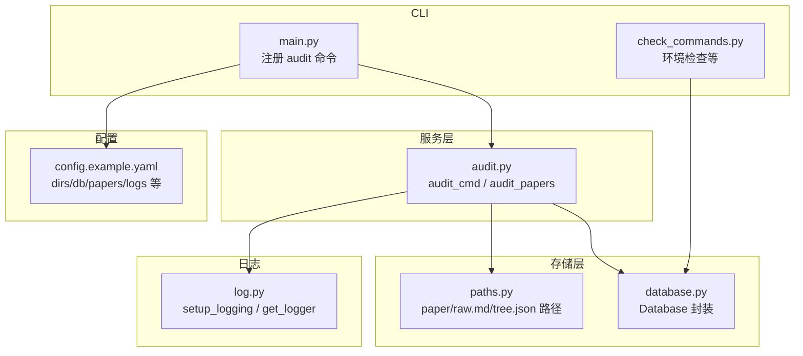
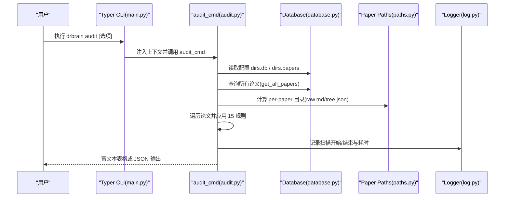
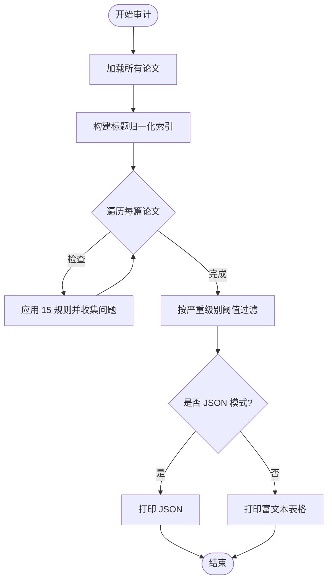
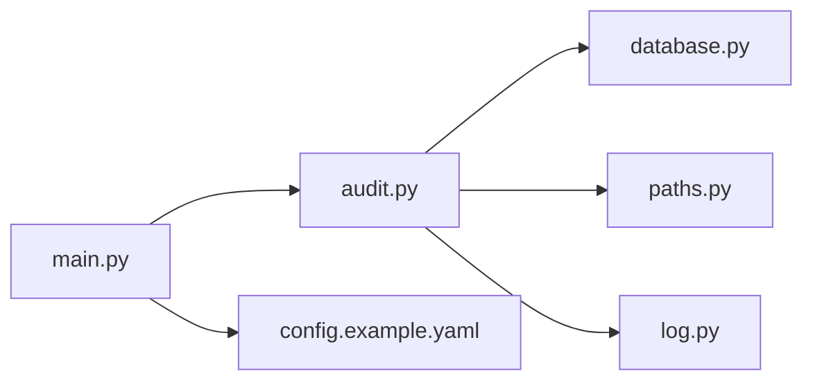

# 审计服务

<cite>
**本文引用的文件列表**
- [audit.py](file://src/drbrain/services/audit.py)
- [SKILL.md](file://skills/audit/SKILL.md)
- [test_audit.py](file://tests/test_audit.py)
- [database.py](file://src/drbrain/storage/database.py)
- [paths.py](file://src/drbrain/storage/paths.py)
- [check_commands.py](file://src/drbrain/cli/check_commands.py)
- [main.py](file://src/drbrain/cli/main.py)
- [log.py](file://src/drbrain/log.py)
- [config.example.yaml](file://config.example.yaml)
</cite>

## 目录
1. [简介](#简介)
2. [项目结构](#项目结构)
3. [核心组件](#核心组件)
4. [架构总览](#架构总览)
5. [详细组件分析](#详细组件分析)
6. [依赖关系分析](#依赖关系分析)
7. [性能考量](#性能考量)
8. [故障排查指南](#故障排查指南)
9. [结论](#结论)
10. [附录](#附录)

## 简介
本文件面向 DrBrain 的审计服务模块，系统化阐述数据质量审计的设计与实现，覆盖以下主题：
- 审计目标与范围：对知识图谱库中的论文条目进行 15 规则扫描，按严重级别（错误、警告、提示）输出问题清单。
- 实现原理：基于数据库查询与文件系统检查，结合概念/边统计与标题归一化去重。
- 日志与输出：使用结构化日志记录审计过程，支持富文本表格与 JSON 输出。
- 合规与隐私：通过最小化敏感字段暴露与可选的 JSON 输出满足审计与合规需求。
- 配置与部署：命令行入口、配置项、目录约定与运行建议。
- 性能与存储：扫描路径、索引利用与时间复杂度分析；存储优化与查询效率建议。
- 最佳实践：常见用法、工作区过滤、修复指引与持续审计流程。

## 项目结构
审计服务位于服务层，围绕 CLI 命令注册、数据库访问与文件系统路径工具展开，并通过统一的日志框架输出审计结果。

图表来源
- [main.py:121](file://src/drbrain/cli/main.py#L121)
- [audit.py:312](file://src/drbrain/services/audit.py#L312)
- [database.py:159](file://src/drbrain/storage/database.py#L159)
- [paths.py:6](file://src/drbrain/storage/paths.py#L6)
- [log.py:32](file://src/drbrain/log.py#L32)
- [config.example.yaml:82](file://config.example.yaml#L82)

章节来源
- [main.py:74-121](file://src/drbrain/cli/main.py#L74-L121)
- [audit.py:312-396](file://src/drbrain/services/audit.py#L312-L396)
- [database.py:159-446](file://src/drbrain/storage/database.py#L159-L446)
- [paths.py:6-29](file://src/drbrain/storage/paths.py#L6-L29)
- [log.py:32-67](file://src/drbrain/log.py#L32-L67)
- [config.example.yaml:82-88](file://config.example.yaml#L82-L88)

## 核心组件
- 审计命令入口：提供 CLI 入口，解析严重级别、工作区过滤与 JSON 输出开关。
- 审计扫描器：遍历所有论文，执行 15 条规则，构建标题索引用于重复检测。
- 数据访问：通过 Database 类查询论文、概念与边，支持统计与过滤。
- 文件系统检查：基于 per-paper 目录下的 raw.md 与 tree.json 存在性与大小判断。
- 日志与输出：使用 loguru 记录审计进度与耗时，支持富文本表格与 JSON 输出。

章节来源
- [audit.py:312-396](file://src/drbrain/services/audit.py#L312-L396)
- [audit.py:30-309](file://src/drbrain/services/audit.py#L30-L309)
- [database.py:419-446](file://src/drbrain/storage/database.py#L419-L446)
- [paths.py:11-18](file://src/drbrain/storage/paths.py#L11-L18)
- [log.py:32-67](file://src/drbrain/log.py#L32-L67)

## 架构总览
审计服务的调用链路如下：

图表来源
- [main.py:121](file://src/drbrain/cli/main.py#L121)
- [audit.py:312-396](file://src/drbrain/services/audit.py#L312-L396)
- [database.py:419-446](file://src/drbrain/storage/database.py#L419-L446)
- [paths.py:6-29](file://src/drbrain/storage/paths.py#L6-L29)
- [log.py:32-67](file://src/drbrain/log.py#L32-L67)

## 详细组件分析

### 审计规则与严重级别
- 严重级别顺序：error < warning < info。通过阈值过滤输出。
- 错误规则（2）：缺失标题、缺失原始 Markdown 文件。
- 警告规则（8）：缺少 DOI/ArXiv/S2/OpenAlex ID、摘要为空、年份为空、期刊为空、缺少作者（Actor 概念）、raw.md 过短、tree.json 缺失或为空、概念数量过少、标题中存在未解析的环境变量占位符。
- 提示规则（4）：存在概念但无边、状态为占位符、占位符超过 30 天未更新、标题归一化后与其他论文重复。

图表来源
- [audit.py:30-309](file://src/drbrain/services/audit.py#L30-L309)

章节来源
- [audit.py:30-309](file://src/drbrain/services/audit.py#L30-L309)
- [SKILL.md:32-35](file://skills/audit/SKILL.md#L32-L35)

### CLI 命令与参数
- 命令：drbrain audit
- 选项：
  - --severity/-s：严重级别阈值（error/warning/info）
  - --workspace/-w：工作区过滤，仅审计该工作区内的论文
  - --json/-j：以 JSON 输出，便于脚本处理
- 工作流：解析配置、连接数据库、加载论文、应用规则、过滤与输出。

章节来源
- [audit.py:312-396](file://src/drbrain/services/audit.py#L312-L396)
- [main.py:121](file://src/drbrain/cli/main.py#L121)

### 数据访问与文件系统检查
- 数据库查询：
  - 获取全部论文：返回包含元数据与外部 ID 的字典列表。
  - 按论文获取概念：用于统计概念数量与 Actor 概念存在性。
  - 边计数：用于“无边”规则。
- 文件系统检查：
  - raw.md 存在性与大小（小于阈值视为过短）。
  - tree.json 存在性与空文件判断。
  - 标题归一化索引：去除标点与多余空白，统一小写，用于重复检测。

章节来源
- [database.py:419-446](file://src/drbrain/storage/database.py#L419-L446)
- [database.py:480-486](file://src/drbrain/storage/database.py#L480-L486)
- [paths.py:11-18](file://src/drbrain/storage/paths.py#L11-L18)
- [audit.py:22-27](file://src/drbrain/services/audit.py#L22-L27)

### 日志与输出
- 日志：
  - 使用 loguru 记录审计开始、耗时与汇总。
  - 统一日志格式与会话 ID，便于追踪。
- 输出：
  - 富文本表格：彩色显示严重级别，列含论文 ID、标题、严重级别、规则名与消息。
  - JSON 模式：机器可读，便于管道与自动化。

章节来源
- [log.py:32-67](file://src/drbrain/log.py#L32-L67)
- [audit.py:354-395](file://src/drbrain/services/audit.py#L354-L395)

### 测试与验证
- 单元测试覆盖：
  - 各规则触发与不触发场景（如缺失 DOI/摘要/年份/期刊/作者、短 raw.md、空 tree.json、低概念数、无边、占位符状态与旧占位符、未解析环境变量、标题重复）。
  - 严重级别过滤行为（error/warning/info）。
  - CLI JSON 输出格式校验。
- 测试策略：内存数据库、临时目录与最小化配置，确保可重复与隔离。

章节来源
- [test_audit.py:47-302](file://tests/test_audit.py#L47-L302)
- [test_audit.py:307-343](file://tests/test_audit.py#L307-L343)
- [test_audit.py:348-377](file://tests/test_audit.py#L348-L377)

## 依赖关系分析
- 组件耦合：
  - audit_cmd 依赖 CLI 上下文、配置与数据库；依赖 paths 工具函数定位 per-paper 文件。
  - audit_papers 依赖 Database 的查询接口与 SQL 统计；依赖路径工具与文件系统检查。
- 外部依赖：
  - loguru：结构化日志。
  - rich：富文本表格输出。
  - typer：命令行参数解析。
- 潜在循环依赖：当前模块间为单向依赖，无循环。

图表来源
- [main.py:121](file://src/drbrain/cli/main.py#L121)
- [audit.py:312-396](file://src/drbrain/services/audit.py#L312-L396)
- [database.py:159](file://src/drbrain/storage/database.py#L159)
- [paths.py:6](file://src/drbrain/storage/paths.py#L6)
- [log.py:32](file://src/drbrain/log.py#L32)
- [config.example.yaml:82](file://config.example.yaml#L82)

章节来源
- [main.py:74-121](file://src/drbrain/cli/main.py#L74-L121)
- [audit.py:312-396](file://src/drbrain/services/audit.py#L312-L396)
- [database.py:159-446](file://src/drbrain/storage/database.py#L159-L446)
- [paths.py:6-29](file://src/drbrain/storage/paths.py#L6-L29)
- [log.py:32-67](file://src/drbrain/log.py#L32-L67)
- [config.example.yaml:82-88](file://config.example.yaml#L82-L88)

## 性能考量
- 时间复杂度
  - 加载论文：O(N)，N 为论文总数。
  - 构建标题索引：O(N)。
  - 遍历论文并应用规则：O(N) × 规则数（常数级），其中部分规则涉及 SQL 统计（如边计数）。
  - 总体：近似 O(N)。
- 空间复杂度
  - 标题索引字典：O(N)。
  - 问题列表：最坏 O(N)。
- 存储与查询优化建议
  - 确保数据库处于 WAL 模式，减少锁竞争。
  - 对频繁查询的表（papers、concepts、edges）保持现有索引。
  - 在大规模库上，考虑分批扫描或并行化（需谨慎避免并发写）。
  - 将 raw.md 与 tree.json 的存在性检查限制在必要路径，避免不必要的 IO。
- 日志开销
  - 结构化日志默认落盘，建议在 CI 或批量任务中控制日志级别，避免过多 INFO 级日志影响吞吐。

[本节为通用性能讨论，无需特定文件来源]

## 故障排查指南
- 常见问题与定位
  - 无任何问题：确认严重级别阈值设置是否过高；检查工作区过滤是否误筛。
  - JSON 输出为空：确认数据库路径与 papers 目录配置正确；检查 CLI 参数。
  - 规则误报/漏报：核对规则逻辑与输入数据（如外部 ID、摘要、年份、期刊、作者类型）。
- 日志与诊断
  - 查看审计开始/结束与耗时日志，定位慢点。
  - 使用 --json 输出并配合 jq 进行过滤与聚合。
- 修复指引
  - 缺失 raw.md 或 tree.json：重新执行导入/构建流程。
  - 缺少元数据（DOI/ArXiv/S2/OpenAlex）：执行自动修复流程。
  - 概念数过少或无边：重建知识图谱。
  - 占位符过期：清理或升级占位符。

章节来源
- [audit.py:312-396](file://src/drbrain/services/audit.py#L312-L396)
- [SKILL.md:66-77](file://skills/audit/SKILL.md#L66-L77)
- [test_audit.py:47-302](file://tests/test_audit.py#L47-L302)

## 结论
DrBrain 的审计服务以简洁高效的方式实现了对知识图谱库的数据质量扫描，覆盖关键元数据、内容完整性与结构完整性三大维度。通过 CLI 友好的交互、结构化日志与可选 JSON 输出，既满足日常运维与分析前的质量把关，也便于自动化集成与持续审计。建议在生产环境中结合工作区过滤与定期扫描，配合修复流程形成闭环。

[本节为总结性内容，无需特定文件来源]

## 附录

### 审计服务配置与部署
- 配置项
  - 数据库路径：由配置 dirs.db 决定，默认 data/drbrain.db。
  - 论文根目录：由配置 dirs.papers 决定，默认 data/papers。
  - 日志路径：可通过日志模块配置，CLI 默认启用。
- 部署建议
  - 在 CI 中以 --json 模式运行，结合 jq 进行聚合与告警。
  - 在本地开发中使用富文本表格快速定位问题。
  - 结合工作区过滤，针对特定子集进行高频扫描。

章节来源
- [audit.py:338-341](file://src/drbrain/services/audit.py#L338-L341)
- [config.example.yaml:78-88](file://config.example.yaml#L78-L88)
- [log.py:32-67](file://src/drbrain/log.py#L32-L67)

### 审计规则与修复指引（示例）
- 规则示例与修复建议（来自技能文档与测试用例）
  - 缺失标题/原始 Markdown：补充元数据或重新导入。
  - 缺少外部 ID：执行自动修复。
  - 摘要/年份/期刊为空：补充元数据。
  - 缺少作者（Actor 概念）：重建提取。
  - raw.md 过短：检查解析与导出流程。
  - tree.json 缺失/空：重新构建树结构。
  - 概念数过少：扩大抽取范围或调整阈值。
  - 无边：重建知识图谱。
  - 占位符状态/旧占位符：清理或升级。
  - 未解析环境变量：修正模板。
  - 标题重复：合并或重命名。

章节来源
- [SKILL.md:32-35](file://skills/audit/SKILL.md#L32-L35)
- [SKILL.md:61-64](file://skills/audit/SKILL.md#L61-L64)
- [test_audit.py:47-302](file://tests/test_audit.py#L47-L302)