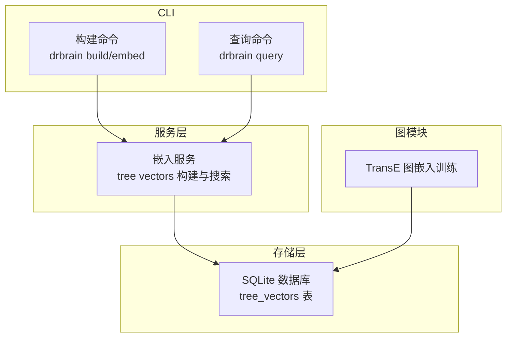
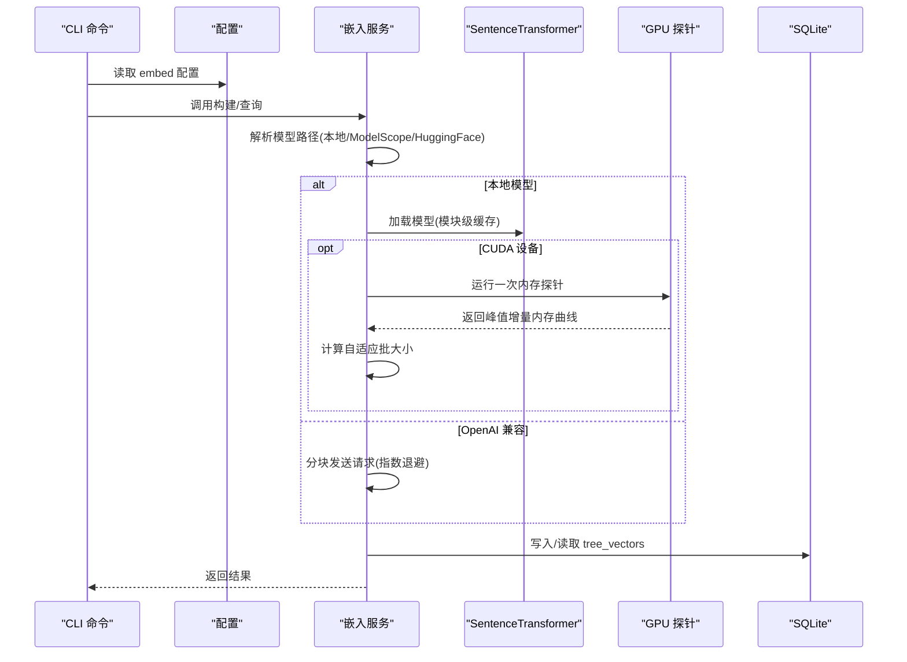
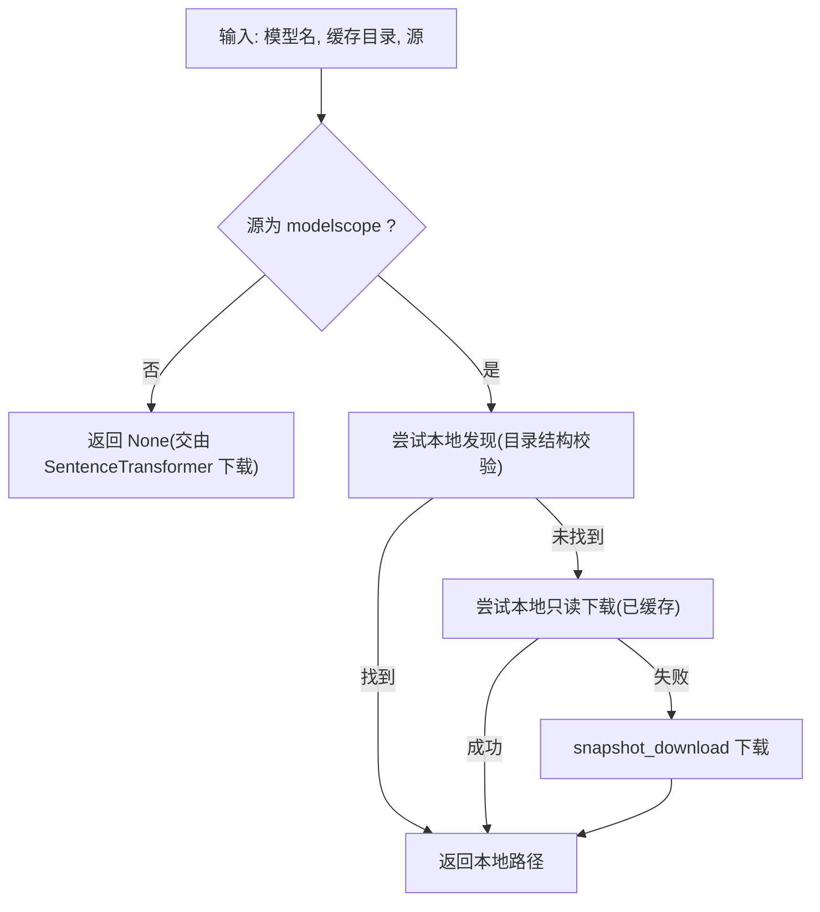
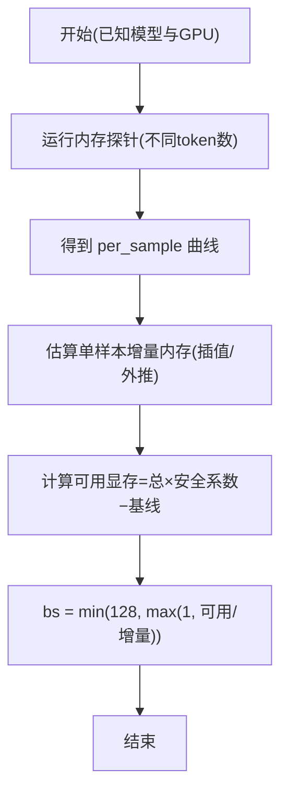
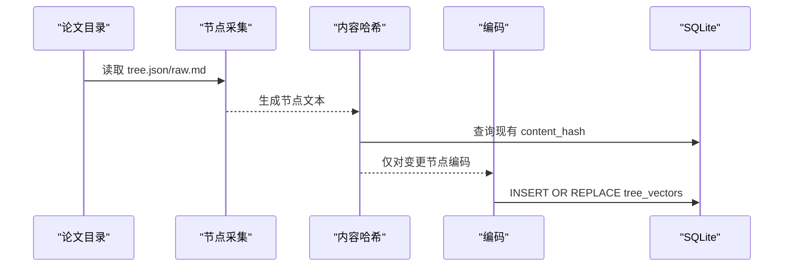
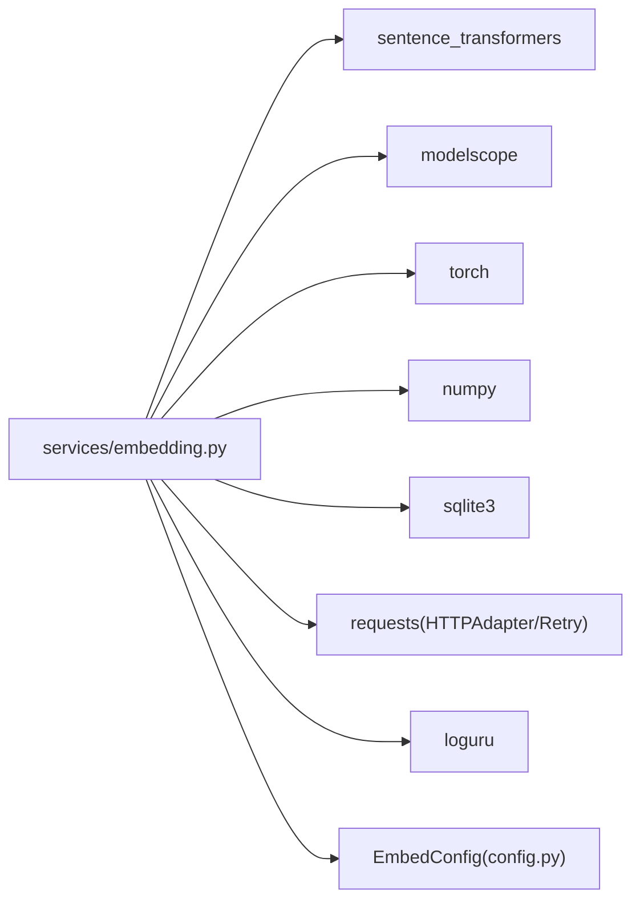

# 嵌入服务

<cite>
**本文引用的文件列表**
- [embedding.py](file://src/drbrain/services/embedding.py)
- [embedding.py（图嵌入）](file://src/drbrain/graph/embedding.py)
- [database.py](file://src/drbrain/storage/database.py)
- [embedding.md](file://docs/embedding.md)
- [config.py](file://src/drbrain/config.py)
- [config.example.yaml](file://config.example.yaml)
- [build_commands.py](file://src/drbrain/cli/build_commands.py)
- [query_commands.py](file://src/drbrain/cli/query_commands.py)
- [query_embeddings.py](file://src/drbrain/graph/query_embeddings.py)
- [test_services_embedding.py](file://tests/test_services_embedding.py)
- [test_embedding.py](file://tests/test_embedding.py)
</cite>

## 目录
1. [简介](#简介)
2. [项目结构与定位](#项目结构与定位)
3. [核心组件](#核心组件)
4. [架构总览](#架构总览)
5. [详细组件分析](#详细组件分析)
6. [依赖关系分析](#依赖关系分析)
7. [性能与优化](#性能与优化)
8. [故障排查](#故障排查)
9. [部署与运维](#部署与运维)
10. [结论](#结论)

## 简介
本文件面向 DrBrain 的“嵌入服务”模块，系统性阐述树节点向量化的实现原理与工程实践，覆盖以下关键主题：
- SentenceTransformer 模型加载与本地缓存策略
- GPU 内存自适应批处理与一次性 GPU 配置剖析
- 模型解析策略：ModelScope 与 HuggingFace 的下载路径
- 向量构建流程：增量更新检测、SQLite 存储与维度校验
- OpenAI 兼容 API 的嵌入接口、批量策略与错误重试
- 调用方式、配置参数与性能优化建议
- 部署指南、监控方法与常见问题排查

## 项目结构与定位
- 嵌入服务位于服务层，负责将“语义完整”的树节点文本编码为向量，并写入 SQLite 数据库；同时支持通过 OpenAI 兼容接口调用外部嵌入服务。
- 图嵌入（TransE）位于图模块，用于知识图谱实体/关系的向量化训练，与文本嵌入服务并行存在但职责不同。
- CLI 提供构建与查询入口，分别触发树向量生成与混合检索。

图表来源
- [embedding.py](file://src/drbrain/services/embedding.py)
- [database.py](file://src/drbrain/storage/database.py)
- [build_commands.py](file://src/drbrain/cli/build_commands.py)
- [query_commands.py](file://src/drbrain/cli/query_commands.py)
- [embedding.py（图嵌入）](file://src/drbrain/graph/embedding.py)

章节来源
- [embedding.py](file://src/drbrain/services/embedding.py)
- [database.py](file://src/drbrain/storage/database.py)
- [build_commands.py](file://src/drbrain/cli/build_commands.py)
- [query_commands.py](file://src/drbrain/cli/query_commands.py)

## 核心组件
- 模型解析与加载
  - 支持 ModelScope 与 HuggingFace 两种源；优先在本地缓存中查找，未命中则按源下载。
  - 支持自动设备选择（CUDA/CPU），并带模块级缓存避免重复加载。
- GPU 自适应批处理
  - 首次运行时对当前模型+GPU 组合进行内存探针，记录峰值增量内存随序列长度的变化曲线，后续据此动态计算批大小，防止 OOM。
- 文本嵌入分发
  - 三种提供者：local（本地）、openai-compat（兼容 OpenAI 接口）、none（禁用嵌入）。
- 向量构建与增量更新
  - 从树 JSON 中提取语义完整的节点文本，基于内容哈希判断是否需要重新编码；编码后以二进制形式写入 SQLite 的 tree_vectors 表。
- 搜索与后处理
  - 查询向量与已存向量逐条做余弦相似度比较，返回前 K 结果，并可按阈值过滤低质量结果。
- OpenAI 兼容接口
  - 将文本切分为指定批次大小的块，使用指数退避重试，首块失败直接抛错，后续块失败仅警告并返回已成功部分的结果。

章节来源
- [embedding.py](file://src/drbrain/services/embedding.py)
- [embedding.md](file://docs/embedding.md)
- [config.py](file://src/drbrain/config.py)
- [config.example.yaml](file://config.example.yaml)

## 架构总览
下图展示了嵌入服务在 DrBrain 中的端到端工作流：CLI 触发构建或查询，服务层完成模型解析/加载、编码与存储，查询阶段执行向量相似度检索。

图表来源
- [embedding.py](file://src/drbrain/services/embedding.py)
- [build_commands.py](file://src/drbrain/cli/build_commands.py)
- [query_commands.py](file://src/drbrain/cli/query_commands.py)
- [database.py](file://src/drbrain/storage/database.py)

## 详细组件分析

### 模型解析与加载（Model Resolution）
- 本地发现逻辑
  - 通过组织名/仓库名在缓存目录下匹配符合 SentenceTransformer 结构的目录，支持多种命名变体。
- 下载策略
  - 当 source 为 modelscope 且本地未找到时，尝试使用 modelscope 的 snapshot_download；若仍失败则回退至 HuggingFace（由 SentenceTransformer 内部处理）。
- 设备与缓存
  - 自动探测 CUDA 可用性；模块级缓存键包含 (模型名, 缓存目录, 设备)，避免重复初始化。

图表来源
- [embedding.py](file://src/drbrain/services/embedding.py)

章节来源
- [embedding.py](file://src/drbrain/services/embedding.py)

### GPU 内存自适应批处理（GPU Profile & Adaptive Batching）
- 一次性探针
  - 在 CUDA 设备上对不同 token 数量的填充文本进行编码，记录峰值增量内存，得到“每样本增量内存”随 token 数变化的曲线。
- 批大小计算
  - 使用可用显存（总显存×安全系数 − 模型权重基线）除以每样本增量内存，上限 128，下限 1。
- 插值与外推
  - 在已探针范围内采用线性插值；超出范围时按二次方外推（注意力复杂度 O(n^2) 的经验）。

图表来源
- [embedding.py](file://src/drbrain/services/embedding.py)

章节来源
- [embedding.py](file://src/drbrain/services/embedding.py)
- [test_services_embedding.py](file://tests/test_services_embedding.py)

### 文本嵌入分发（Provider Routing）
- provider=none：返回空向量列表，跳过嵌入。
- provider=openai-compat：构造 /v1/embeddings 请求，按 batch_size 切分，首块失败抛错，后续块失败记录警告并返回已成功部分。
- provider=local：本地模型编码，若为 CUDA 则按上述自适应批处理策略。

章节来源
- [embedding.py](file://src/drbrain/services/embedding.py)
- [test_services_embedding.py](file://tests/test_services_embedding.py)

### 向量构建与增量更新（Build）
- 节点采集
  - 从树 JSON 的结构中递归收集节点，拼接标题与正文（优先使用原始 Markdown 的行区间，否则使用节点内容）。
- 增量更新
  - 对每个节点计算内容哈希，与数据库中已存哈希对比，相同则跳过。
- 编码与存储
  - 使用 _embed_batch 获取向量，将向量打包为二进制写入 tree_vectors 表，同时记录 paper_id、content_hash、tree_layer。

图表来源
- [embedding.py](file://src/drbrain/services/embedding.py)
- [database.py](file://src/drbrain/storage/database.py)

章节来源
- [embedding.py](file://src/drbrain/services/embedding.py)
- [database.py](file://src/drbrain/storage/database.py)

### 搜索与后处理（Search）
- 查询向量编码
  - 使用 _embed_batch 对查询文本编码。
- 相似度计算
  - 逐条读取已存向量，按 float32 解包，计算与查询向量的点积作为余弦相似度（假设已归一化）。
- 过滤与排序
  - 按分数降序取前 K，再应用最小分数阈值与空节点 ID 过滤。

章节来源
- [embedding.py](file://src/drbrain/services/embedding.py)

### OpenAI 兼容 API（OpenAI-Compatible Embedding）
- 请求与分块
  - 将 texts 按 cfg.batch_size 切分为多个块，逐块 POST /v1/embeddings。
- 错误处理
  - 首块失败直接抛出异常；后续块失败记录警告并返回已成功部分。
- 重试策略
  - 使用 requests 的 HTTPAdapter + Retry，对 429/5xx 使用指数退避重试最多 3 次。

章节来源
- [embedding.py](file://src/drbrain/services/embedding.py)
- [test_services_embedding.py](file://tests/test_services_embedding.py)

### 图嵌入（TransE）对比
- 用途差异
  - 图嵌入用于知识图谱实体/关系的向量化训练，不参与树节点文本向量化。
- 训练流程
  - 初始化实体/关系向量，随机游走采样负样本，按 TransE 目标函数迭代优化，最终保存到 embeddings 表。

章节来源
- [embedding.py（图嵌入）](file://src/drbrain/graph/embedding.py)
- [query_embeddings.py](file://src/drbrain/graph/query_embeddings.py)
- [database.py](file://src/drbrain/storage/database.py)

## 依赖关系分析
- 模块内依赖
  - 嵌入服务内部依赖：loguru 日志、numpy 向量运算、sqlite3 存储、requests 重试适配器（openai-compat）。
- 外部依赖
  - sentence_transformers（本地模型）、modelscope（模型下载）、torch（GPU 探针）、numpy（向量操作）。
- 配置依赖
  - 通过 EmbedConfig 提供 provider、model、device、source、cache_dir、api_base、api_key、batch_size 等参数。

图表来源
- [embedding.py](file://src/drbrain/services/embedding.py)
- [config.py](file://src/drbrain/config.py)

章节来源
- [embedding.py](file://src/drbrain/services/embedding.py)
- [config.py](file://src/drbrain/config.py)

## 性能与优化
- GPU 自适应批处理
  - 首次运行会生成并缓存 GPU profile 文件，后续复用；如显存紧张可降低安全系数或减少 batch_size。
- 模型与设备
  - 优先使用 CUDA；若显存不足可切换 CPU 或降低 batch_size。
- 模型源选择
  - 在国内网络环境下优先使用 modelscope；如需 HuggingFace 可设置镜像端点。
- 批量策略
  - openai-compat 按 batch_size 切分，建议根据目标服务的并发限制与延迟要求调整该值。
- 存储与索引
  - tree_vectors 为轻量表，按节点主键存储；查询时逐条解包向量，建议确保数据库处于 WAL 模式以提升并发读写。

章节来源
- [embedding.md](file://docs/embedding.md)
- [embedding.py](file://src/drbrain/services/embedding.py)
- [database.py](file://src/drbrain/storage/database.py)

## 故障排查
- “模型未找到”
  - 首次运行需要下载模型，检查 source 与镜像端点设置；首次下载约 1.2GB。
- CUDA 显存不足
  - 设置 device=cpu 或降低 batch_size；下次运行将重新自适应批处理。
- openai-compat 返回空
  - 确认 api_base 末尾为 /v1；验证 GET {api_base}/models 能返回模型列表。
- 搜索维度不匹配
  - 切换嵌入模型后需重新生成所有向量（drbrain embed --tree）。
- 本地模型缓存异常
  - 清理缓存目录或更换 cache_dir；确认目录权限与磁盘空间。

章节来源
- [embedding.md](file://docs/embedding.md)
- [embedding.py](file://src/drbrain/services/embedding.py)

## 部署与运维
- 配置要点
  - 在 config.yaml 中设置 embed.provider、model、device、source、cache_dir、api_base、api_key、batch_size 等。
  - 若使用 openai-compat，确保 api_base 以 /v1 结尾，api_key 正确。
- 常用命令
  - 生成树向量：drbrain embed --tree
  - 构建全链路（含嵌入）：drbrain build --all
  - 查询（混合检索）：drbrain query "<问题>" --hybrid
- 监控建议
  - 关注日志中的模型加载、GPU 探针与批大小提示；观察 openai-compat 的重试次数与响应时间。
  - 定期清理过期缓存与数据库碎片，保持 WAL 模式。

章节来源
- [config.example.yaml](file://config.example.yaml)
- [build_commands.py](file://src/drbrain/cli/build_commands.py)
- [query_commands.py](file://src/drbrain/cli/query_commands.py)
- [embedding.md](file://docs/embedding.md)

## 结论
DrBrain 的嵌入服务以“树节点语义完整文本”为核心，结合本地模型与 GPU 自适应批处理，在保证稳定性的同时最大化吞吐与资源利用率。通过 SQLite 轻量存储与增量更新策略，实现了高效、可维护的向量构建与检索闭环。对于云原生场景，openai-compat 提供了灵活的外部服务接入能力；对于离线/隐私敏感场景，本地模型与 GPU 探针机制提供了稳健的自托管方案。