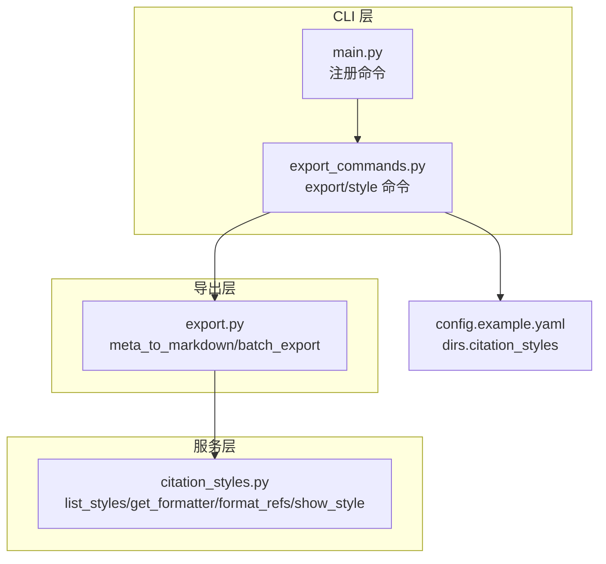
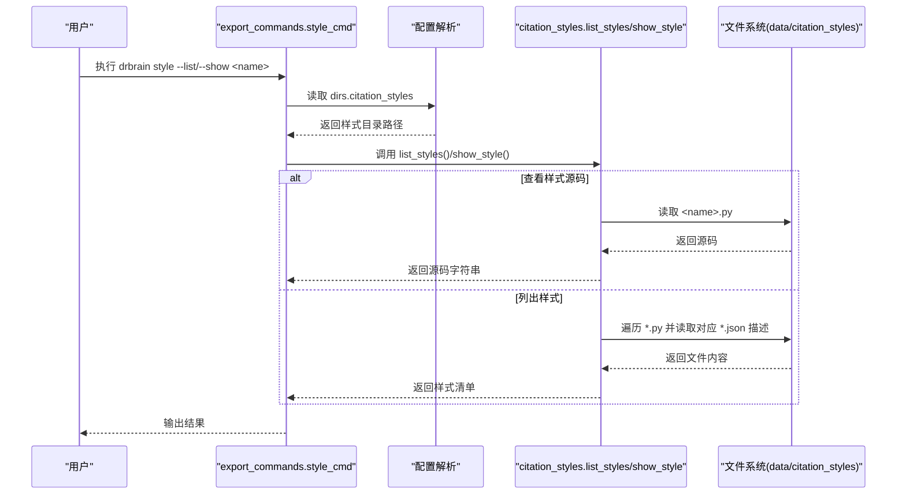
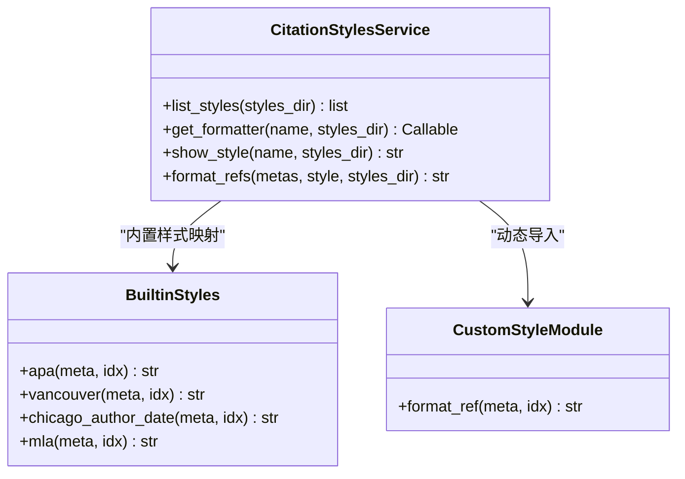
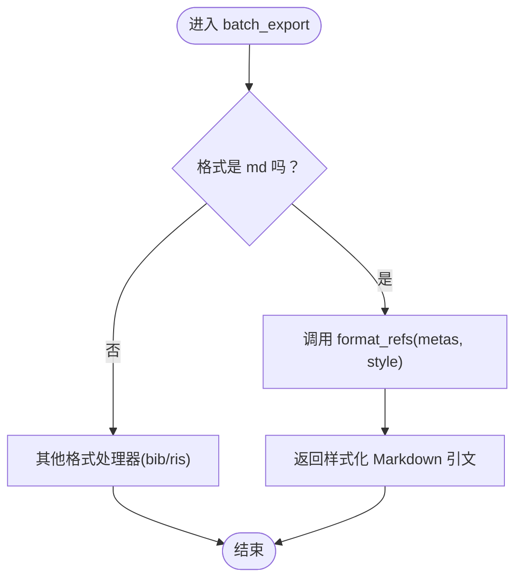
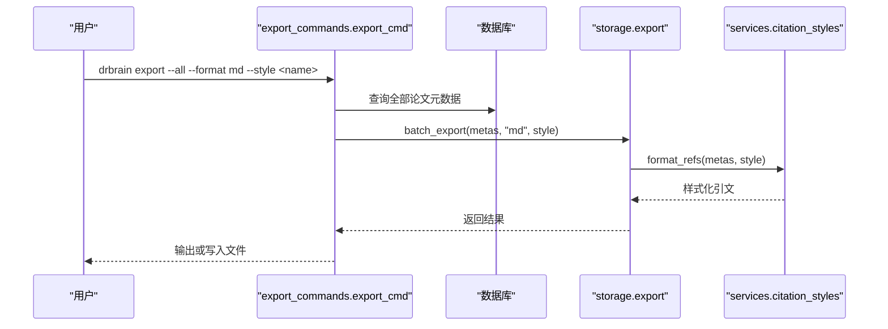
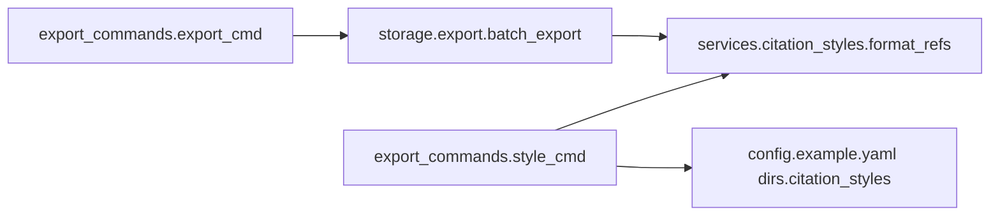

# 引用样式服务

<cite>
**本文档引用的文件**
- [citation_styles.py](file://src/drbrain/services/citation_styles.py)
- [export.py](file://src/drbrain/storage/export.py)
- [export_commands.py](file://src/drbrain/cli/export_commands.py)
- [main.py](file://src/drbrain/cli/main.py)
- [SKILL.md](file://skills/citation-styles/SKILL.md)
- [test_citation_styles.py](file://tests/test_citation_styles.py)
- [config.example.yaml](file://config.example.yaml)
</cite>

## 目录
1. [简介](#简介)
2. [项目结构](#项目结构)
3. [核心组件](#核心组件)
4. [架构总览](#架构总览)
5. [详细组件分析](#详细组件分析)
6. [依赖分析](#依赖分析)
7. [性能考虑](#性能考虑)
8. [故障排查指南](#故障排查指南)
9. [结论](#结论)
10. [附录](#附录)

## 简介
本文件为 DrBrain 的引用样式服务模块提供系统化技术文档。该模块负责将论文元数据格式化为多种引用样式（APA、Vancouver、Chicago、MLA）以及用户自定义样式，并通过 CLI 提供“列出样式”“查看样式源码”“按样式导出 Markdown 引文”的能力。文档涵盖实现原理、CSL 样式支持、格式化规则、自定义样式开发、样式库管理与版本兼容、性能优化与扩展机制，并给出使用指南与最佳实践。

## 项目结构
引用样式服务涉及以下关键文件与职责：
- 服务层：提供内置样式与自定义样式的加载、解析与格式化能力
- 导出层：在导出 Markdown 时调用样式服务进行引用生成
- CLI 层：暴露样式管理命令与导出命令
- 配置层：通过配置文件指定自定义样式目录位置
- 测试层：覆盖内置样式行为、自定义样式加载、错误处理等

图表来源
- [main.py:122](file://src/drbrain/cli/main.py#L122)
- [export_commands.py:429](file://src/drbrain/cli/export_commands.py#L429)
- [export.py:170](file://src/drbrain/storage/export.py#L170)
- [citation_styles.py:234](file://src/drbrain/services/citation_styles.py#L234)
- [config.example.yaml:82](file://config.example.yaml#L82)

章节来源
- [main.py:122](file://src/drbrain/cli/main.py#L122)
- [export_commands.py:429](file://src/drbrain/cli/export_commands.py#L429)
- [export.py:170](file://src/drbrain/storage/export.py#L170)
- [citation_styles.py:234](file://src/drbrain/services/citation_styles.py#L234)
- [config.example.yaml:82](file://config.example.yaml#L82)

## 核心组件
- 内置样式集合：APA、Vancouver、Chicago Author-Date、MLA
- 自定义样式加载：从配置或默认目录动态导入 Python 模块，要求定义 format_ref(meta, idx)
- 样式列表与描述：支持枚举内置与自定义样式及其来源与描述
- 样式展示：内置样式返回注释说明；自定义样式返回源码
- 引文格式化：根据样式类型输出带编号或项目符号的 Markdown 引文

章节来源
- [citation_styles.py:214](file://src/drbrain/services/citation_styles.py#L214)
- [citation_styles.py:234](file://src/drbrain/services/citation_styles.py#L234)
- [citation_styles.py:268](file://src/drbrain/services/citation_styles.py#L268)
- [citation_styles.py:328](file://src/drbrain/services/citation_styles.py#L328)
- [citation_styles.py:367](file://src/drbrain/services/citation_styles.py#L367)

## 架构总览
下图展示了从 CLI 到服务层再到导出层的整体流程，以及样式目录配置对自定义样式的加载影响。

图表来源
- [export_commands.py:429](file://src/drbrain/cli/export_commands.py#L429)
- [citation_styles.py:234](file://src/drbrain/services/citation_styles.py#L234)
- [citation_styles.py:328](file://src/drbrain/services/citation_styles.py#L328)
- [config.example.yaml:82](file://config.example.yaml#L82)

## 详细组件分析

### 组件：引用样式服务（citation_styles）
- 公共接口
  - list_styles：枚举所有可用样式（内置 + 自定义），并尝试读取同名 .json 获取描述与来源
  - get_formatter：优先内置样式，否则动态导入自定义样式模块并校验 format_ref 函数存在
  - show_style：内置样式返回注释说明；自定义样式返回源码文本
  - format_refs：批量格式化元数据为 Markdown 引文，自动区分编号/项目符号列表
- 安全与健壮性
  - 名称合法性校验（仅字母数字、连字符、下划线）
  - 路径穿越检测（确保解析后仍在样式目录内）
  - 导入异常捕获与清晰错误提示
- 内置样式规则
  - APA：作者合写规则、期刊斜体与卷期、页码、DOI 链接、编号/项目符号
  - Vancouver：作者缩写、期刊、年份、卷期、页码、DOI 格式、编号列表
  - Chicago Author-Date：作者姓名反转、引号标题、期刊斜体、卷期、页码、DOI 链接、编号列表
  - MLA：作者反转、引号标题、期刊斜体、卷期、期号、年份、页码、DOI 链接、编号列表

图表来源
- [citation_styles.py:214](file://src/drbrain/services/citation_styles.py#L214)
- [citation_styles.py:268](file://src/drbrain/services/citation_styles.py#L268)
- [citation_styles.py:328](file://src/drbrain/services/citation_styles.py#L328)
- [citation_styles.py:367](file://src/drbrain/services/citation_styles.py#L367)

章节来源
- [citation_styles.py:214](file://src/drbrain/services/citation_styles.py#L214)
- [citation_styles.py:234](file://src/drbrain/services/citation_styles.py#L234)
- [citation_styles.py:268](file://src/drbrain/services/citation_styles.py#L268)
- [citation_styles.py:328](file://src/drbrain/services/citation_styles.py#L328)
- [citation_styles.py:367](file://src/drbrain/services/citation_styles.py#L367)

### 组件：导出层（export）
- meta_to_markdown：基础 Markdown 引文模板（标题、年份、作者、期刊、DOI）
- batch_export：根据格式选择导出器；当格式为 md 时委托样式服务进行格式化
- 与样式服务的耦合点：在 md 格式下调用 format_refs 进行样式化输出

图表来源
- [export.py:170](file://src/drbrain/storage/export.py#L170)
- [citation_styles.py:367](file://src/drbrain/services/citation_styles.py#L367)

章节来源
- [export.py:152](file://src/drbrain/storage/export.py#L152)
- [export.py:170](file://src/drbrain/storage/export.py#L170)

### 组件：CLI（style/export 命令）
- style_cmd：支持 --list 列表样式、--show 显示样式源码；可输出 JSON；从配置读取样式目录
- export_cmd：支持 --format md 时传入 --style 指定样式；内部调用导出层并由样式服务完成格式化

图表来源
- [export_commands.py:21](file://src/drbrain/cli/export_commands.py#L21)
- [export.py:170](file://src/drbrain/storage/export.py#L170)
- [citation_styles.py:367](file://src/drbrain/services/citation_styles.py#L367)

章节来源
- [export_commands.py:21](file://src/drbrain/cli/export_commands.py#L21)
- [export_commands.py:429](file://src/drbrain/cli/export_commands.py#L429)

## 依赖分析
- 组件内聚与耦合
  - 引用样式服务高度内聚于格式化逻辑，对外仅暴露 list_styles、get_formatter、format_refs、show_style 四个函数
  - 导出层与样式服务通过 format_refs 解耦，便于替换或扩展样式实现
- 外部依赖
  - 动态导入：运行时加载自定义样式模块，需保证模块具备 format_ref 接口
  - 文件系统：读取 data/citation_styles 下的 .py 与可选 .json 描述文件
  - 配置：dirs.citation_styles 指定自定义样式目录
- 潜在循环依赖
  - 未发现循环依赖迹象；CLI、导出层、服务层分层清晰

图表来源
- [export_commands.py:21](file://src/drbrain/cli/export_commands.py#L21)
- [export.py:170](file://src/drbrain/storage/export.py#L170)
- [citation_styles.py:367](file://src/drbrain/services/citation_styles.py#L367)
- [config.example.yaml:82](file://config.example.yaml#L82)

章节来源
- [export_commands.py:21](file://src/drbrain/cli/export_commands.py#L21)
- [export.py:170](file://src/drbrain/storage/export.py#L170)
- [citation_styles.py:367](file://src/drbrain/services/citation_styles.py#L367)
- [config.example.yaml:82](file://config.example.yaml#L82)

## 性能考虑
- 动态导入成本
  - 自定义样式每次被请求时才动态导入，适合按需加载；若频繁切换样式，可考虑在上层引入轻量缓存（当前实现未内置）
- I/O 开销
  - 列表样式时会遍历目录并读取 .json 描述；建议将样式数量控制在合理范围，避免大量小文件导致磁盘扫描开销
- 字符串拼接
  - 内置样式格式化为纯字符串拼接，复杂度线性于输出长度；对超长作者列表采用“et al.”缩短策略，降低输出体积
- 批量处理
  - format_refs 对元数据列表进行一次遍历并拼接，整体为 O(n)；如需进一步优化可在上层对大列表分批处理

[本节为通用性能讨论，不直接分析具体文件，故无章节来源]

## 故障排查指南
- 常见错误与定位
  - 样式名称非法：检查是否包含非法字符，仅允许字母、数字、连字符、下划线
  - 路径穿越：确认样式文件位于配置的样式目录内，避免 ../ 等相对路径
  - 样式文件不存在：确认 data/citation_styles/<name>.py 存在
  - 缺少 format_ref：自定义样式模块必须定义 format_ref(meta, idx)
  - 导入失败：检查 Python 语法与依赖，确保模块可被 importlib 加载
- 测试覆盖
  - 内置样式断言：作者数量、编号/项目符号、DOI 链接、特殊字段处理
  - 自定义样式断言：动态导入成功、缺失 format_ref 抛错、非法名称与文件不存在的异常
  - 列表样式断言：内置样式来源标记、自定义样式描述读取、不与内置重名

章节来源
- [test_citation_styles.py:68](file://tests/test_citation_styles.py#L68)
- [test_citation_styles.py:231](file://tests/test_citation_styles.py#L231)
- [test_citation_styles.py:279](file://tests/test_citation_styles.py#L279)
- [test_citation_styles.py:318](file://tests/test_citation_styles.py#L318)

## 结论
引用样式服务以简洁的接口与灵活的扩展机制，实现了对多风格引用格式的支持。内置样式覆盖主流学科规范，自定义样式通过标准接口即可无缝接入。配合 CLI 的样式管理与导出能力，用户可以快速生成符合要求的参考文献列表。未来可在上层增加样式缓存与批量处理优化，以进一步提升大规模导出场景下的性能表现。

[本节为总结性内容，不直接分析具体文件，故无章节来源]

## 附录

### 使用指南与最佳实践
- 快速开始
  - 列出可用样式：drbrain style --list
  - 查看内置/自定义样式源码：drbrain style --show <name>
  - 按样式导出：drbrain export --all --format md --style <name>
- 自定义样式开发
  - 在 data/citation_styles/<name>.py 中实现 format_ref(meta, idx) 函数
  - 可选：在同名目录下放置 <name>.json 提供 description 与 source 字段
  - 使用约定：idx 为 None 表示项目符号列表，非 None 表示编号列表
- 配置样式目录
  - 在配置文件中设置 dirs.citation_styles 指向自定义样式目录
- 最佳实践
  - 将作者列表统一为“姓, 名”格式以获得一致的样式处理效果
  - 为自定义样式提供简短描述，便于团队协作与维护
  - 对超长作者列表使用“et al.”策略，保持输出简洁

章节来源
- [SKILL.md:15](file://skills/citation-styles/SKILL.md#L15)
- [SKILL.md:29](file://skills/citation-styles/SKILL.md#L29)
- [SKILL.md:41](file://skills/citation-styles/SKILL.md#L41)
- [config.example.yaml:82](file://config.example.yaml#L82)