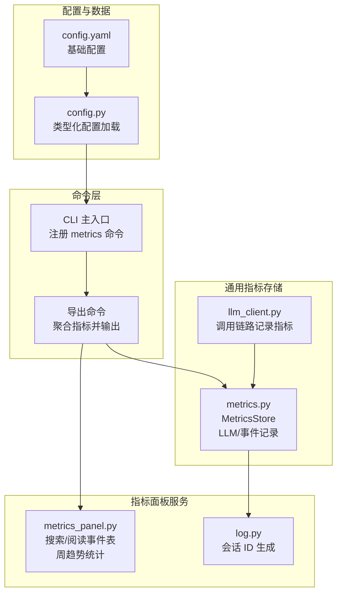
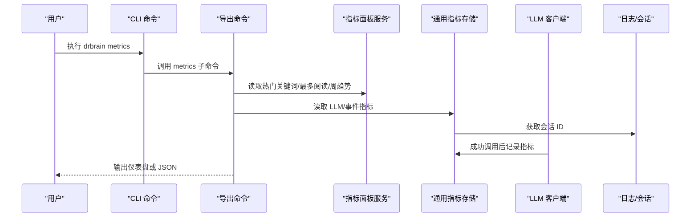
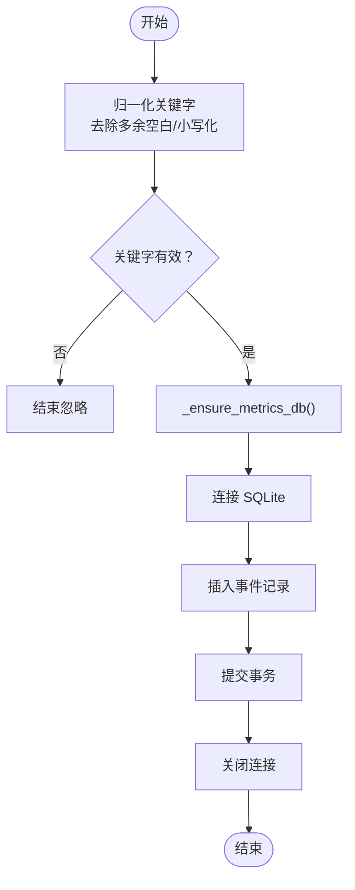
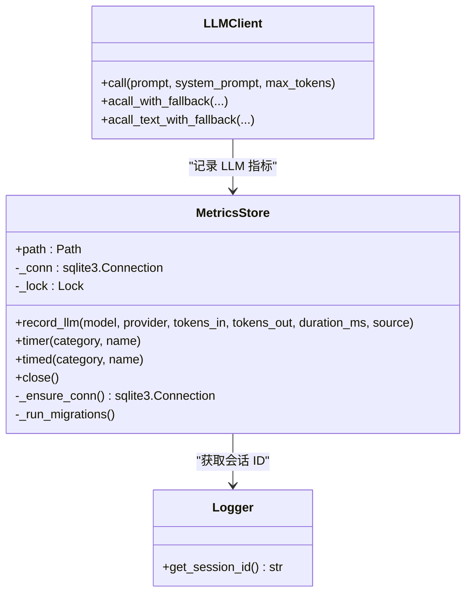
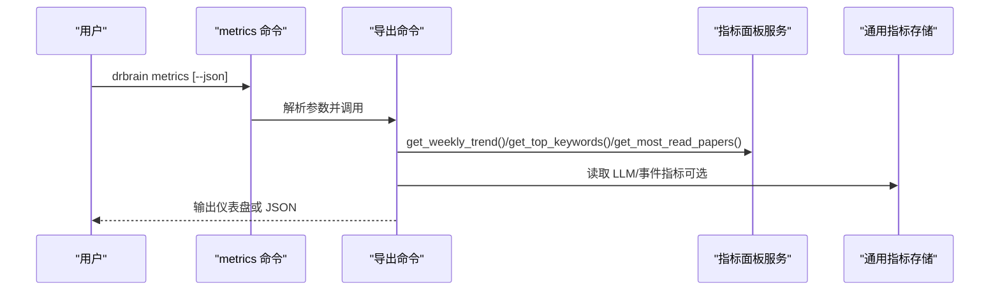
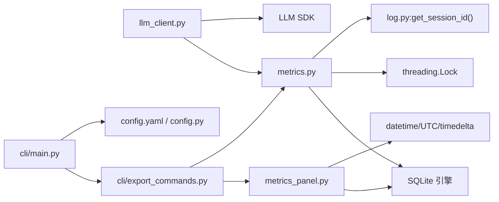

# 指标面板服务

<cite>
**本文引用的文件**
- [src/drbrain/services/metrics_panel.py](file://src/drbrain/services/metrics_panel.py)
- [src/drbrain/metrics.py](file://src/drbrain/metrics.py)
- [src/drbrain/extractor/llm_client.py](file://src/drbrain/extractor/llm_client.py)
- [src/drbrain/log.py](file://src/drbrain/log.py)
- [src/drbrain/cli/export_commands.py](file://src/drbrain/cli/export_commands.py)
- [src/drbrain/cli/main.py](file://src/drbrain/cli/main.py)
- [skills/metrics/SKILL.md](file://skills/metrics/SKILL.md)
- [tests/test_metrics_panel.py](file://tests/test_metrics_panel.py)
- [tests/test_metrics.py](file://tests/test_metrics.py)
- [config.yaml](file://config.yaml)
- [src/drbrain/config.py](file://src/drbrain/config.py)
</cite>

## 目录
1. [简介](#简介)
2. [项目结构](#项目结构)
3. [核心组件](#核心组件)
4. [架构总览](#架构总览)
5. [详细组件分析](#详细组件分析)
6. [依赖关系分析](#依赖关系分析)
7. [性能考量](#性能考量)
8. [故障排查指南](#故障排查指南)
9. [结论](#结论)
10. [附录](#附录)

## 简介
本文件面向 DrBrain 的“指标面板服务”，系统性阐述用户行为指标采集与可视化的实现原理，覆盖性能指标、业务指标与健康检查三类维度；详细说明指标定义、数据聚合与实时更新机制；记录指标存储、历史趋势与告警规则；提供配置、指标定义与可视化展示的实际示例路径；解释服务的性能影响、缓存策略与查询优化；并给出部署指南、监控配置与最佳实践。

## 项目结构
指标面板服务由两条主线构成：
- 用户行为指标（搜索关键词、阅读论文、周趋势）：独立 SQLite 数据库，用于轻量级分析与仪表盘展示。
- LLM 使用指标（调用次数、Token 消耗、耗时）：统一 MetricsStore 记录到同一数据库，支持线程安全与 WAL 模式。

图表来源
- [src/drbrain/cli/main.py:124-124](file://src/drbrain/cli/main.py#L124-L124)
- [src/drbrain/cli/export_commands.py:590-627](file://src/drbrain/cli/export_commands.py#L590-L627)
- [src/drbrain/services/metrics_panel.py:13-39](file://src/drbrain/services/metrics_panel.py#L13-L39)
- [src/drbrain/metrics.py:49-66](file://src/drbrain/metrics.py#L49-L66)
- [src/drbrain/extractor/llm_client.py:46-63](file://src/drbrain/extractor/llm_client.py#L46-L63)
- [src/drbrain/log.py:18-23](file://src/drbrain/log.py#L18-L23)
- [config.yaml:1-72](file://config.yaml#L1-L72)
- [src/drbrain/config.py:195-244](file://src/drbrain/config.py#L195-L244)

章节来源
- [src/drbrain/cli/main.py:124-124](file://src/drbrain/cli/main.py#L124-L124)
- [src/drbrain/cli/export_commands.py:590-627](file://src/drbrain/cli/export_commands.py#L590-L627)
- [src/drbrain/services/metrics_panel.py:13-39](file://src/drbrain/services/metrics_panel.py#L13-L39)
- [src/drbrain/metrics.py:49-66](file://src/drbrain/metrics.py#L49-L66)
- [src/drbrain/extractor/llm_client.py:46-63](file://src/drbrain/extractor/llm_client.py#L46-L63)
- [src/drbrain/log.py:18-23](file://src/drbrain/log.py#L18-L23)
- [config.yaml:1-72](file://config.yaml#L1-L72)
- [src/drbrain/config.py:195-244](file://src/drbrain/config.py#L195-L244)

## 核心组件
- 指标面板服务（用户行为）
  - 搜索事件表与阅读事件表，带关键字与本地 ID 的索引，支持高频查询。
  - 提供“热门关键词”“最多阅读论文”“近七日趋势”等聚合接口。
- 通用指标存储（LLM/事件）
  - MetricsStore：线程安全、WAL 模式、迁移兼容，支持计时装饰器与上下文管理器。
  - LLM 客户端在成功调用后自动记录模型、Provider、Token 输入输出与耗时。
- 日志与会话
  - 通过 log.py 生成稳定会话 ID，贯穿所有指标记录，便于跨进程/会话关联。

章节来源
- [src/drbrain/services/metrics_panel.py:13-39](file://src/drbrain/services/metrics_panel.py#L13-L39)
- [src/drbrain/services/metrics_panel.py:69-138](file://src/drbrain/services/metrics_panel.py#L69-L138)
- [src/drbrain/metrics.py:49-66](file://src/drbrain/metrics.py#L49-L66)
- [src/drbrain/metrics.py:74-133](file://src/drbrain/metrics.py#L74-L133)
- [src/drbrain/extractor/llm_client.py:46-63](file://src/drbrain/extractor/llm_client.py#L46-L63)
- [src/drbrain/log.py:18-23](file://src/drbrain/log.py#L18-L23)

## 架构总览
指标面板服务的典型工作流如下：

图表来源
- [src/drbrain/cli/main.py:124-124](file://src/drbrain/cli/main.py#L124-L124)
- [src/drbrain/cli/export_commands.py:590-627](file://src/drbrain/cli/export_commands.py#L590-L627)
- [src/drbrain/services/metrics_panel.py:69-138](file://src/drbrain/services/metrics_panel.py#L69-L138)
- [src/drbrain/metrics.py:74-133](file://src/drbrain/metrics.py#L74-L133)
- [src/drbrain/extractor/llm_client.py:46-63](file://src/drbrain/extractor/llm_client.py#L46-L63)
- [src/drbrain/log.py:18-23](file://src/drbrain/log.py#L18-L23)

## 详细组件分析

### 组件一：用户行为指标（指标面板服务）
- 数据模型
  - 搜索事件表：关键字字段、时间戳、索引。
  - 阅读事件表：本地 ID、标题、时间戳、索引。
- 关键能力
  - 记录搜索事件（含关键字归一化）。
  - 记录阅读事件（本地 ID + 标题）。
  - 聚合统计：热门关键词、最多阅读论文、近七日趋势（搜索/阅读总量与去重数）。
- 查询复杂度
  - 热门关键词与最多阅读论文：基于分组与排序，时间复杂度 O(n log n)，空间复杂度 O(n)。
  - 近七日趋势：多条 COUNT/COUNT(DISTINCT) 查询，时间复杂度 O(n)。

图表来源
- [src/drbrain/services/metrics_panel.py:42-54](file://src/drbrain/services/metrics_panel.py#L42-L54)
- [src/drbrain/services/metrics_panel.py:13-39](file://src/drbrain/services/metrics_panel.py#L13-L39)

章节来源
- [src/drbrain/services/metrics_panel.py:13-39](file://src/drbrain/services/metrics_panel.py#L13-L39)
- [src/drbrain/services/metrics_panel.py:42-66](file://src/drbrain/services/metrics_panel.py#L42-L66)
- [src/drbrain/services/metrics_panel.py:69-138](file://src/drbrain/services/metrics_panel.py#L69-L138)
- [tests/test_metrics_panel.py:12-81](file://tests/test_metrics_panel.py#L12-L81)

### 组件二：通用指标存储（MetricsStore）
- 设计要点
  - 单例懒加载连接，首次访问时启用 WAL 并执行建表与迁移。
  - 线程锁保护写入，避免并发冲突。
  - 提供 record_llm 与通用事件记录方法，统一携带会话 ID。
  - 提供计时装饰器与上下文管理器，自动记录耗时与状态。
- 性能特性
  - WAL 模式提升并发读写吞吐。
  - 通过迁移兼容旧版本字段，降低升级成本。

图表来源
- [src/drbrain/metrics.py:49-66](file://src/drbrain/metrics.py#L49-L66)
- [src/drbrain/metrics.py:74-133](file://src/drbrain/metrics.py#L74-L133)
- [src/drbrain/extractor/llm_client.py:46-63](file://src/drbrain/extractor/llm_client.py#L46-L63)
- [src/drbrain/log.py:18-23](file://src/drbrain/log.py#L18-L23)

章节来源
- [src/drbrain/metrics.py:49-66](file://src/drbrain/metrics.py#L49-L66)
- [src/drbrain/metrics.py:74-133](file://src/drbrain/metrics.py#L74-L133)
- [src/drbrain/metrics.py:187-203](file://src/drbrain/metrics.py#L187-L203)
- [src/drbrain/extractor/llm_client.py:46-63](file://src/drbrain/extractor/llm_client.py#L46-L63)
- [src/drbrain/log.py:18-23](file://src/drbrain/log.py#L18-L23)
- [tests/test_metrics.py:217-227](file://tests/test_metrics.py#L217-L227)

### 组件三：指标采集与可视化（CLI 导出）
- CLI 行为
  - 注册 metrics 子命令，调用导出命令聚合指标并输出。
  - 支持 JSON 输出与人类可读格式。
- 可视化内容
  - 近七日趋势：搜索总数、阅读总数、唯一关键词数、唯一论文阅读数。
  - 热门关键词排行。
  - 最多阅读论文排行。

图表来源
- [src/drbrain/cli/main.py:124-124](file://src/drbrain/cli/main.py#L124-L124)
- [src/drbrain/cli/export_commands.py:590-627](file://src/drbrain/cli/export_commands.py#L590-L627)
- [src/drbrain/services/metrics_panel.py:101-138](file://src/drbrain/services/metrics_panel.py#L101-L138)

章节来源
- [src/drbrain/cli/main.py:124-124](file://src/drbrain/cli/main.py#L124-L124)
- [src/drbrain/cli/export_commands.py:590-627](file://src/drbrain/cli/export_commands.py#L590-L627)
- [skills/metrics/SKILL.md:17-37](file://skills/metrics/SKILL.md#L17-L37)

## 依赖关系分析
- 指标面板服务依赖
  - SQLite：事件表与索引。
  - 时间工具：UTC 与时差计算。
- 通用指标存储依赖
  - SQLite：WAL、迁移。
  - 线程锁：并发安全。
  - 会话 ID：来自日志模块。
- LLM 客户端依赖
  - 第三方 LLM SDK：记录响应后触发指标记录。
- CLI 依赖
  - Typer：命令注册与参数解析。
  - 配置系统：从配置文件加载路径与参数。

图表来源
- [src/drbrain/services/metrics_panel.py:8-10](file://src/drbrain/services/metrics_panel.py#L8-L10)
- [src/drbrain/metrics.py:5-12](file://src/drbrain/metrics.py#L5-L12)
- [src/drbrain/extractor/llm_client.py:8-9](file://src/drbrain/extractor/llm_client.py#L8-L9)
- [src/drbrain/cli/main.py:124-124](file://src/drbrain/cli/main.py#L124-L124)
- [src/drbrain/cli/export_commands.py:590-627](file://src/drbrain/cli/export_commands.py#L590-L627)
- [config.yaml:1-72](file://config.yaml#L1-L72)
- [src/drbrain/config.py:195-244](file://src/drbrain/config.py#L195-L244)

章节来源
- [src/drbrain/services/metrics_panel.py:8-10](file://src/drbrain/services/metrics_panel.py#L8-L10)
- [src/drbrain/metrics.py:5-12](file://src/drbrain/metrics.py#L5-L12)
- [src/drbrain/extractor/llm_client.py:8-9](file://src/drbrain/extractor/llm_client.py#L8-L9)
- [src/drbrain/cli/main.py:124-124](file://src/drbrain/cli/main.py#L124-L124)
- [src/drbrain/cli/export_commands.py:590-627](file://src/drbrain/cli/export_commands.py#L590-L627)
- [config.yaml:1-72](file://config.yaml#L1-L72)
- [src/drbrain/config.py:195-244](file://src/drbrain/config.py#L195-L244)

## 性能考量
- 存储与并发
  - 指标面板服务：独立 SQLite，事件表带索引，适合高频读写与简单聚合。
  - 通用指标存储：WAL 模式显著提升并发读写性能；线程锁保护写入，避免竞争。
- 查询优化
  - 对关键字与本地 ID 建立索引，减少 GROUP BY 与 DISTINCT 的扫描范围。
  - 聚合函数（COUNT/COUNT(DISTINCT)）按时间窗口过滤，避免全表扫描。
- 缓存策略
  - 当前未实现应用层缓存；建议对热点排行结果进行短期缓存（如内存缓存），并结合 TTL 控制。
- 影响评估
  - 写入开销低（单行 INSERT），聚合查询在中小规模数据下延迟可接受。
  - 大规模场景建议拆分统计表或引入轻量级时序数据库。

[本节为通用性能讨论，不直接分析具体文件，故无章节来源]

## 故障排查指南
- 指标未显示
  - 确认已执行搜索与阅读操作，确保事件被记录。
  - 检查指标数据库文件是否存在与可写。
- 指标异常
  - LLM 指标未记录：检查 LLM 客户端是否成功返回响应并触发记录逻辑。
  - 会话 ID 缺失：确认日志模块初始化正常。
- 测试验证
  - 使用测试用例验证指标面板服务的创建、记录与查询行为。
  - 使用测试用例验证 MetricsStore 的 WAL 模式与错误状态记录。

章节来源
- [tests/test_metrics_panel.py:12-81](file://tests/test_metrics_panel.py#L12-L81)
- [tests/test_metrics.py:217-227](file://tests/test_metrics.py#L217-L227)
- [src/drbrain/extractor/llm_client.py:46-63](file://src/drbrain/extractor/llm_client.py#L46-L63)
- [src/drbrain/log.py:18-23](file://src/drbrain/log.py#L18-L23)

## 结论
指标面板服务通过“用户行为指标 + 通用指标存储”的双轨设计，实现了对搜索、阅读与 LLM 使用的全面追踪与可视化。其以 SQLite 为核心，具备良好的易用性与可维护性；在中小规模场景下性能表现良好。建议在生产环境中结合短期缓存与定期归档策略，持续优化查询与写入性能，并完善告警与健康检查机制。

[本节为总结性内容，不直接分析具体文件，故无章节来源]

## 附录

### 指标定义与数据模型
- 用户行为指标
  - 搜索事件：关键字、时间戳。
  - 阅读事件：本地 ID、标题、时间戳。
- 通用指标
  - LLM 调用：模型、Provider、Token 输入/输出、耗时、来源、会话 ID。
  - 通用事件：类别、名称、耗时、状态、模型、详情、会话 ID。

章节来源
- [src/drbrain/services/metrics_panel.py:17-31](file://src/drbrain/services/metrics_panel.py#L17-L31)
- [src/drbrain/metrics.py:16-42](file://src/drbrain/metrics.py#L16-L42)

### 实际代码示例（示例路径）
- 指标面板服务配置与使用
  - 创建数据库与表：[创建表与索引:13-39](file://src/drbrain/services/metrics_panel.py#L13-L39)
  - 记录搜索事件：[记录搜索:42-54](file://src/drbrain/services/metrics_panel.py#L42-L54)
  - 记录阅读事件：[记录阅读:57-66](file://src/drbrain/services/metrics_panel.py#L57-L66)
  - 热门关键词排行：[热门关键词:69-82](file://src/drbrain/services/metrics_panel.py#L69-L82)
  - 最多阅读论文排行：[最多阅读论文:85-98](file://src/drbrain/services/metrics_panel.py#L85-L98)
  - 近七日趋势：[周趋势:101-138](file://src/drbrain/services/metrics_panel.py#L101-L138)
- 通用指标存储与 LLM 记录
  - 初始化与 WAL：[初始化与迁移:58-65](file://src/drbrain/metrics.py#L58-L65)
  - 记录 LLM 指标：[记录 LLM:83-95](file://src/drbrain/metrics.py#L83-L95)
  - 计时装饰器：[计时装饰器:153-174](file://src/drbrain/metrics.py#L153-L174)
  - 上下文管理器：[计时上下文:134-151](file://src/drbrain/metrics.py#L134-L151)
  - LLM 客户端记录指标：[客户端记录:46-63](file://src/drbrain/extractor/llm_client.py#L46-L63)
- 可视化展示与 CLI 集成
  - 注册 metrics 命令：[命令注册:124-124](file://src/drbrain/cli/main.py#L124-L124)
  - 仪表盘输出：[导出命令:590-627](file://src/drbrain/cli/export_commands.py#L590-L627)
  - 技能文档参考：[技能说明:17-37](file://skills/metrics/SKILL.md#L17-L37)

章节来源
- [src/drbrain/services/metrics_panel.py:13-138](file://src/drbrain/services/metrics_panel.py#L13-L138)
- [src/drbrain/metrics.py:58-95](file://src/drbrain/metrics.py#L58-L95)
- [src/drbrain/metrics.py:134-174](file://src/drbrain/metrics.py#L134-L174)
- [src/drbrain/extractor/llm_client.py:46-63](file://src/drbrain/extractor/llm_client.py#L46-L63)
- [src/drbrain/cli/main.py:124-124](file://src/drbrain/cli/main.py#L124-L124)
- [src/drbrain/cli/export_commands.py:590-627](file://src/drbrain/cli/export_commands.py#L590-L627)
- [skills/metrics/SKILL.md:17-37](file://skills/metrics/SKILL.md#L17-L37)

### 部署指南与最佳实践
- 部署步骤
  - 安装与初始化：参考项目根目录快速开始与设置流程。
  - 配置文件：根据需要在本地配置文件中覆盖默认项。
- 监控与告警
  - 周期性检查指标数据库大小与增长趋势。
  - 对关键指标（如 LLM 调用量、失败率）设置阈值告警。
- 最佳实践
  - 将指标数据库与主数据库分离，避免相互影响。
  - 在高并发场景下优先使用 WAL 模式与索引。
  - 对热点查询结果进行短期缓存，降低数据库压力。
  - 定期归档历史数据，控制表规模。

[本节为通用指导，不直接分析具体文件，故无章节来源]