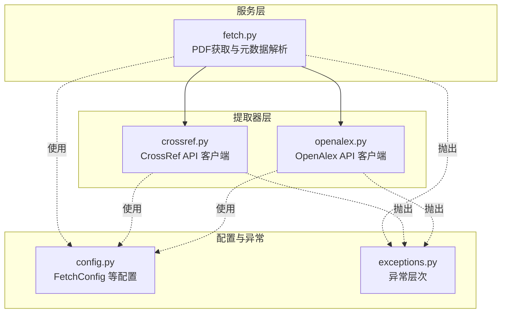
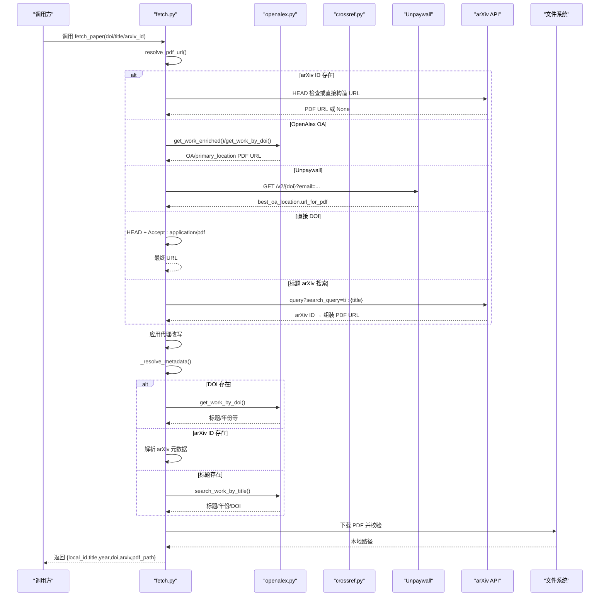
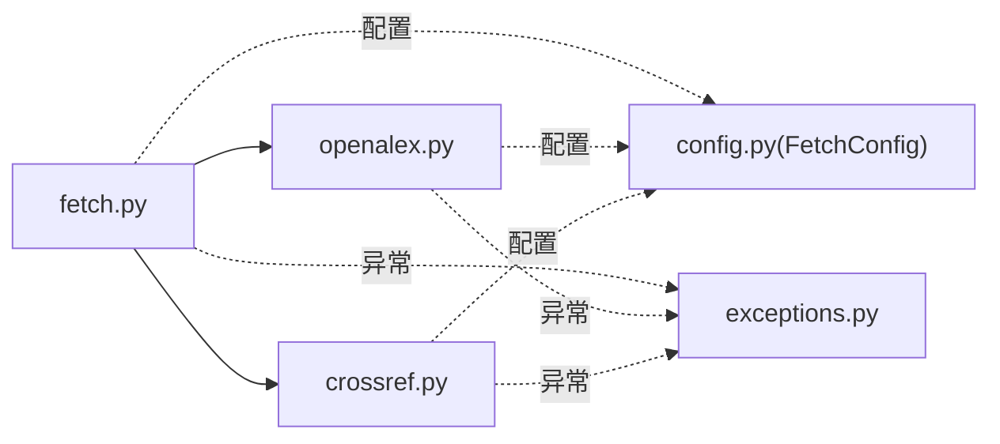

# 数据获取服务

<cite>
**本文引用的文件**
- [fetch.py](file://src/drbrain/services/fetch.py)
- [crossref.py](file://src/drbrain/extractor/crossref.py)
- [openalex.py](file://src/drbrain/extractor/openalex.py)
- [config.py](file://src/drbrain/config.py)
- [exceptions.py](file://src/drbrain/exceptions.py)
- [test_fetch.py](file://tests/test_fetch.py)
- [test_crossref.py](file://tests/test_crossref.py)
- [test_openalex.py](file://tests/test_openalex.py)
- [README.md](file://README.md)
</cite>

## 目录
1. [简介](#简介)
2. [项目结构](#项目结构)
3. [核心组件](#核心组件)
4. [架构总览](#架构总览)
5. [详细组件分析](#详细组件分析)
6. [依赖分析](#依赖分析)
7. [性能考量](#性能考量)
8. [故障排除指南](#故障排除指南)
9. [结论](#结论)
10. [附录](#附录)

## 简介
本技术文档聚焦 DrBrain 的“数据获取服务”模块，系统性阐述论文数据获取的实现原理与工程实践，覆盖以下方面：
- 论文元数据与 PDF 获取：CrossRef API 集成、OpenAlex 数据获取、Unpaywall 和 arXiv 的联合解析
- HTTP 请求处理：会话复用、超时控制、重试策略（基于 urllib3 Retry）
- 代理支持与机构访问：ezproxy 与 URL 前缀两种模式
- 数据格式转换与元数据提取：标准化 DOI、标题清洗、作者信息抽取
- 错误处理与容错：空结果、网络异常、内容类型校验、下载失败回退
- 批量处理能力：OpenAlex 批量查询接口
- 使用指南、性能优化与故障排除

## 项目结构
数据获取服务主要由三部分组成：
- 服务层：统一的 PDF 获取与元数据解析流程，负责多源回退、代理与下载
- 提取器层：面向外部学术数据库的客户端封装（CrossRef、OpenAlex）
- 配置与异常：集中化的配置项与自定义异常层次

图表来源
- [fetch.py:1-345](file://src/drbrain/services/fetch.py#L1-L345)
- [crossref.py:1-180](file://src/drbrain/extractor/crossref.py#L1-L180)
- [openalex.py:1-421](file://src/drbrain/extractor/openalex.py#L1-L421)
- [config.py:102-112](file://src/drbrain/config.py#L102-L112)
- [exceptions.py:1-28](file://src/drbrain/exceptions.py#L1-L28)

章节来源
- [fetch.py:1-345](file://src/drbrain/services/fetch.py#L1-L345)
- [crossref.py:1-180](file://src/drbrain/extractor/crossref.py#L1-L180)
- [openalex.py:1-421](file://src/drbrain/extractor/openalex.py#L1-L421)
- [config.py:102-112](file://src/drbrain/config.py#L102-L112)
- [exceptions.py:1-28](file://src/drbrain/exceptions.py#L1-L28)

## 核心组件
- PDF 获取与元数据解析（服务层）
  - 多阶段回退：arXiv → OpenAlex OA → Unpaywall → 直接 DOI → 标题 arXiv 搜索
  - 代理 URL 改写：ezproxy 与 URL 前缀
  - 下载与校验：超时、内容类型检测、分块写入
  - 元数据解析：OpenAlex/ArXiv/标题搜索
- CrossRef 客户端
  - 标题/DOI/arXiv 三种入口，带标题相似度匹配与邮箱头
- OpenAlex 客户端
  - 标题/arXiv/DOI 查询、作者信息抽取、参考文献获取、批量查询
- 配置与异常
  - FetchConfig：并发、超时、用户代理、回退顺序、Unpaywall 邮箱、机构代理
  - 异常层次：DrBrainError → APIError → APIRateLimitError

章节来源
- [fetch.py:13-345](file://src/drbrain/services/fetch.py#L13-L345)
- [crossref.py:49-180](file://src/drbrain/extractor/crossref.py#L49-L180)
- [openalex.py:47-421](file://src/drbrain/extractor/openalex.py#L47-L421)
- [config.py:102-112](file://src/drbrain/config.py#L102-L112)
- [exceptions.py:6-28](file://src/drbrain/exceptions.py#L6-L28)

## 架构总览
下图展示了从调用到返回的典型流程：服务层根据输入选择回退路径，调用提取器层的 API 客户端，最终完成 PDF 下载与元数据组装。

图表来源
- [fetch.py:13-345](file://src/drbrain/services/fetch.py#L13-L345)
- [openalex.py:116-148](file://src/drbrain/extractor/openalex.py#L116-L148)
- [crossref.py:107-133](file://src/drbrain/extractor/crossref.py#L107-L133)

## 详细组件分析

### 服务层：PDF 获取与元数据解析（fetch.py）
- 多阶段回退
  - arXiv：优先级最高，若存在 arXiv ID 则直接 HEAD 检查可用性
  - OpenAlex OA：通过工作条目中的 open_access 或 primary_location 获取 PDF URL
  - Unpaywall：需配置邮箱，调用 /v2/{doi} 获取最佳 OA 位置
  - 直接 DOI：HEAD + Accept: application/pdf 获取最终 URL
  - 标题 arXiv 搜索：当仅给定标题时，调用 arXiv API 查询并解析 ID
- 代理支持
  - 支持两种模式：ezproxy（域名替换）与 URL 前缀
- 下载与校验
  - 超时可配置；流式下载；先读取前 5 字节判断 %PDF-，再检查 Content-Type 与后缀
  - 写入完成后校验文件大小
- 元数据解析
  - 优先使用 OpenAlex DOI 查询；否则尝试 arXiv 元数据解析；最后标题搜索 OpenAlex
- 关键函数与路径
  - resolve_pdf_url、download_pdf、fetch_paper、_resolve_metadata、_proxy_url

章节来源
- [fetch.py:13-345](file://src/drbrain/services/fetch.py#L13-L345)

### 提取器层：CrossRef 客户端（crossref.py）
- 会话与重试
  - 使用 requests.Session + urllib3 Retry，对 429/5xx 自动重试
- 标题搜索
  - 清洗标题后查询，要求标题相似度匹配（精确、前缀、词重叠阈值）
- DOI 直解
  - 直接按 DOI 查询，返回标题与年份
- arXiv 映射
  - 使用 bibliographic_info 过滤，匹配 arxivid；若无则回退至包含特定出版社标识的 DOI
- 关键函数与路径
  - fetch_doi_by_title、fetch_doi_by_doi、fetch_doi_by_arxiv、_titles_match

章节来源
- [crossref.py:17-180](file://src/drbrain/extractor/crossref.py#L17-L180)

### 提取器层：OpenAlex 客户端（openalex.py）
- 会话与重试
  - 同样使用 Session + Retry，统一处理 429/5xx
- 查询与字段选择
  - 标题/DOI/arXiv 查询，select 参数拼接字段列表
  - DOI 输入自动去除 http://doi.org/ 前缀
- 丰富元数据
  - get_work_enriched：摘要重建（倒排索引）、作者名拼接、期刊/卷期页码提取
- 作者信息
  - search_authors_by_work：优先 DOI，失败回退标题搜索；提取短作者 ID
- 批量查询
  - batch_fetch_works：最多 50 个 ID 的过滤查询
- 关键函数与路径
  - search_work_by_title、search_work_by_arxiv、get_work_by_doi、get_work_enriched、search_authors_by_work、batch_fetch_works

章节来源
- [openalex.py:17-421](file://src/drbrain/extractor/openalex.py#L17-L421)

### 配置与异常
- FetchConfig
  - 并发数、单次获取超时、用户代理、回退顺序、Unpaywall 邮箱、机构代理与类型
- 异常层次
  - DrBrainError 为基类；APIError 用于外部 API 失败；APIRateLimitError 用于速率限制

章节来源
- [config.py:102-112](file://src/drbrain/config.py#L102-L112)
- [exceptions.py:6-28](file://src/drbrain/exceptions.py#L6-L28)

## 依赖分析
- 服务层依赖提取器层（OpenAlex/CrossRef），并通过配置项控制行为
- 提取器层内部共享会话与重试策略，避免重复创建连接
- 测试覆盖了关键行为：标题清洗、相似度匹配、错误处理、代理改写、批量查询等

图表来源
- [fetch.py:1-345](file://src/drbrain/services/fetch.py#L1-L345)
- [openalex.py:1-421](file://src/drbrain/extractor/openalex.py#L1-L421)
- [crossref.py:1-180](file://src/drbrain/extractor/crossref.py#L1-L180)
- [config.py:102-112](file://src/drbrain/config.py#L102-L112)
- [exceptions.py:1-28](file://src/drbrain/exceptions.py#L1-L28)

章节来源
- [fetch.py:1-345](file://src/drbrain/services/fetch.py#L1-L345)
- [openalex.py:1-421](file://src/drbrain/extractor/openalex.py#L1-L421)
- [crossref.py:1-180](file://src/drbrain/extractor/crossref.py#L1-L180)
- [config.py:102-112](file://src/drbrain/config.py#L102-L112)
- [exceptions.py:1-28](file://src/drbrain/exceptions.py#L1-L28)

## 性能考量
- 会话复用与重试
  - 通过 Session + Retry 统一处理 429/5xx，减少连接开销与抖动
- 超时与并发
  - 单次获取超时可配置；服务层默认并发较低以避免外部 API 限速
- 批量查询
  - OpenAlex 支持批量查询（最多 50 个），显著降低请求数量
- 回退顺序
  - 优先 arXiv（最稳定），其次 OpenAlex OA，再 Unpaywall，最后直接 DOI，标题回退作为兜底
- 内容校验
  - 下载前读取少量字节判断 PDF 标记，避免错误内容写盘

章节来源
- [fetch.py:167-216](file://src/drbrain/services/fetch.py#L167-L216)
- [openalex.py:386-421](file://src/drbrain/extractor/openalex.py#L386-L421)
- [config.py:102-112](file://src/drbrain/config.py#L102-L112)

## 故障排除指南
- 常见问题与定位
  - 无法获取 PDF：检查回退顺序是否命中；确认代理配置正确；验证 Unpaywall 邮箱是否设置
  - 标题不匹配：CrossRef 标题相似度阈值较高，建议清理特殊字符或使用 DOI
  - 429/5xx：确认外部 API 是否限速；适当降低并发或增加重试等待
  - 下载失败：检查超时设置；确认服务器返回的 Content-Type 与 URL 可达性
- 单元测试参考
  - fetch：代理改写、URL 构造、标识符分类
  - crossref：标题清洗、相似度匹配、错误处理
  - openalex：批量查询、错误响应、DOI 前缀处理、作者 ID 提取

章节来源
- [test_fetch.py:1-82](file://tests/test_fetch.py#L1-L82)
- [test_crossref.py:1-279](file://tests/test_crossref.py#L1-L279)
- [test_openalex.py:1-561](file://tests/test_openalex.py#L1-L561)

## 结论
数据获取服务通过“多源回退 + 会话重试 + 代理支持 + 内容校验”的组合，实现了高鲁棒性的论文数据获取链路。结合 OpenAlex 的丰富元数据与 CrossRef 的标题/DOI 解析能力，以及 Unpaywall 的 OA 通道，能够在不同网络与资源环境下稳定获取 PDF 与元数据。建议在生产环境中合理配置并发与超时，并根据机构网络环境启用代理模式。

## 附录

### 使用指南与示例（路径指引）
- 调用 PDF 获取
  - 函数：[fetch_paper:219-264](file://src/drbrain/services/fetch.py#L219-L264)
  - 配置：[FetchConfig:102-112](file://src/drbrain/config.py#L102-L112)
- 标题/DOI/arXiv 解析
  - CrossRef：[fetch_doi_by_title:49-84](file://src/drbrain/extractor/crossref.py#L49-L84)、[fetch_doi_by_doi:107-133](file://src/drbrain/extractor/crossref.py#L107-L133)、[fetch_doi_by_arxiv:136-179](file://src/drbrain/extractor/crossref.py#L136-L179)
  - OpenAlex：[search_work_by_title:47-79](file://src/drbrain/extractor/openalex.py#L47-L79)、[get_work_by_doi:116-148](file://src/drbrain/extractor/openalex.py#L116-L148)、[get_work_enriched:167-248](file://src/drbrain/extractor/openalex.py#L167-L248)
- 批量处理
  - OpenAlex 批量：[batch_fetch_works:386-421](file://src/drbrain/extractor/openalex.py#L386-L421)
- 代理与下载
  - 代理改写：[fetch.py 中 _proxy_url:144-164](file://src/drbrain/services/fetch.py#L144-L164)
  - 下载与校验：[download_pdf:167-216](file://src/drbrain/services/fetch.py#L167-L216)

章节来源
- [fetch.py:13-345](file://src/drbrain/services/fetch.py#L13-L345)
- [crossref.py:49-179](file://src/drbrain/extractor/crossref.py#L49-L179)
- [openalex.py:47-421](file://src/drbrain/extractor/openalex.py#L47-L421)
- [config.py:102-112](file://src/drbrain/config.py#L102-L112)