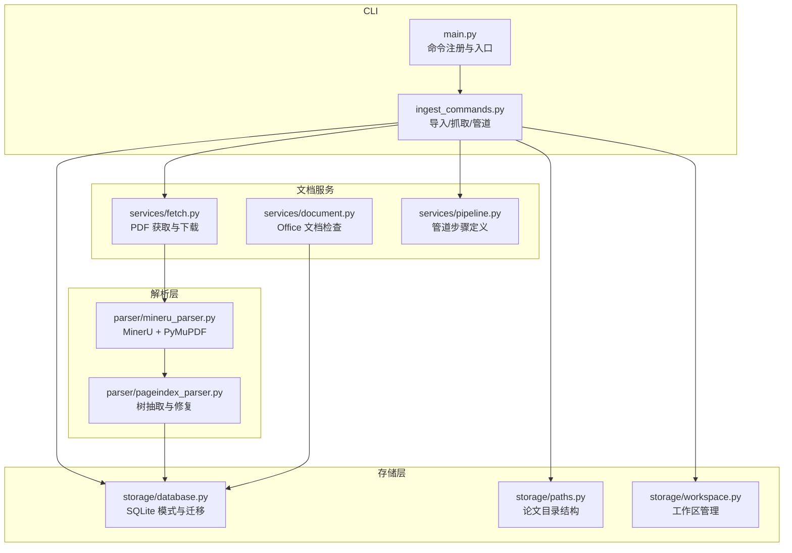
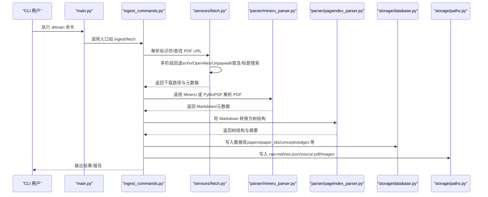
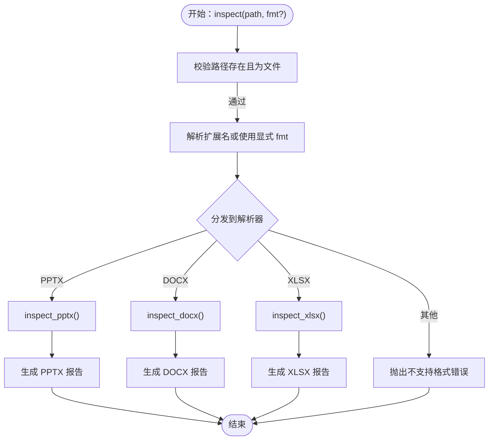
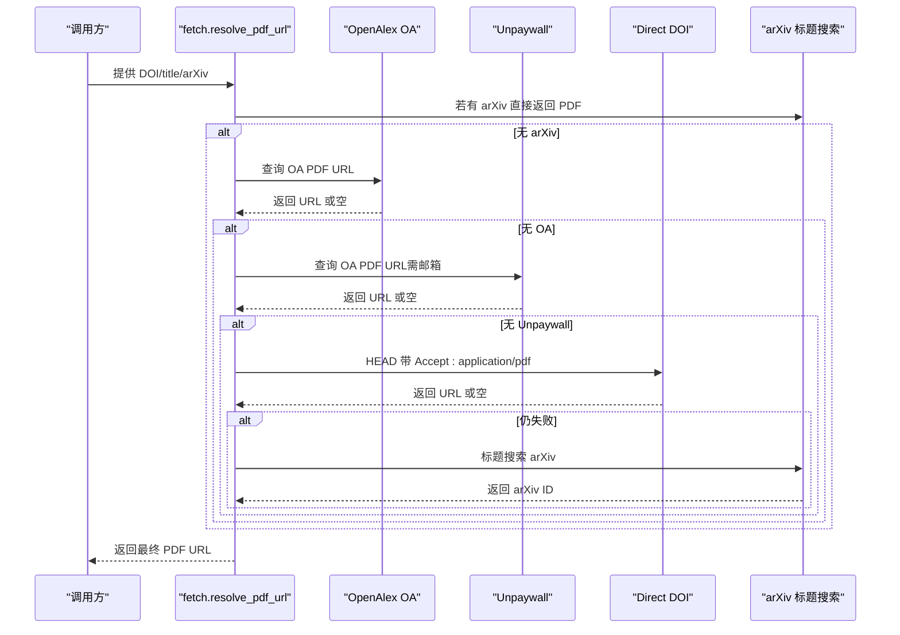
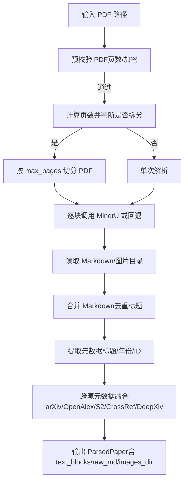
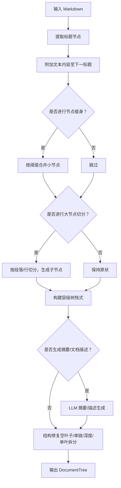
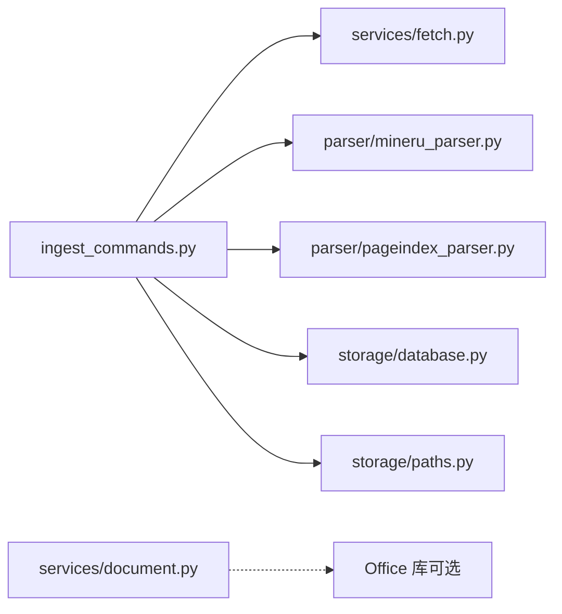

# 文档服务

<cite>
**本文引用的文件**
- [document.py](file://src/drbrain/services/document.py)
- [mineru_parser.py](file://src/drbrain/parser/mineru_parser.py)
- [pageindex_parser.py](file://src/drbrain/parser/pageindex_parser.py)
- [database.py](file://src/drbrain/storage/database.py)
- [workspace.py](file://src/drbrain/storage/workspace.py)
- [paths.py](file://src/drbrain/storage/paths.py)
- [fetch.py](file://src/drbrain/services/fetch.py)
- [pipeline.py](file://src/drbrain/services/pipeline.py)
- [ingest_commands.py](file://src/drbrain/cli/ingest_commands.py)
- [main.py](file://src/drbrain/cli/main.py)
- [SKILL.md](file://skills/document/SKILL.md)
- [test_document.py](file://tests/test_document.py)
</cite>

## 目录
1. [简介](#简介)
2. [项目结构](#项目结构)
3. [核心组件](#核心组件)
4. [架构总览](#架构总览)
5. [详细组件分析](#详细组件分析)
6. [依赖分析](#依赖分析)
7. [性能考虑](#性能考虑)
8. [故障排查指南](#故障排查指南)
9. [结论](#结论)
10. [附录](#附录)

## 简介
本文件面向 DrBrain 的“文档服务”模块，系统化阐述文档处理的实现原理与工程实践，覆盖以下方面：
- 文档解析：PDF（MinerU + PyMuPDF 回退）、Office 文档（DOCX/PPTX/XLSX）结构化检查
- 格式转换与内容提取：PDF 到 Markdown、树形结构抽取、分页索引树构建
- 质量保证：元数据交叉验证、错误检测与回退策略
- 存储与版本管理：SQLite 模式、论文目录结构、工作区管理
- 访问控制与并发：CLI 命令入口、批处理与日志会话标识
- 性能优化：分块解析、临时目录清理、WAL 日志模式
- 使用指南：CLI 调用方式、配置参数、处理流程与最佳实践

## 项目结构
文档服务涉及的模块分布如下：
- 服务层：文档检查（Office）、PDF 获取与下载、管道步骤定义
- 解析层：MinerU PDF 解析器、PageIndex 树抽取器
- 存储层：SQLite 数据库、论文目录结构、工作区管理
- CLI 层：命令入口、批量处理、管道编排



图表来源
- [main.py:77-146](file://src/drbrain/cli/main.py#L77-L146)
- [ingest_commands.py:26-110](file://src/drbrain/cli/ingest_commands.py#L26-L110)
- [document.py:17-49](file://src/drbrain/services/document.py#L17-L49)
- [fetch.py:13-49](file://src/drbrain/services/fetch.py#L13-L49)
- [mineru_parser.py:95-318](file://src/drbrain/parser/mineru_parser.py#L95-L318)
- [pageindex_parser.py:412-486](file://src/drbrain/parser/pageindex_parser.py#L412-L486)
- [database.py:10-156](file://src/drbrain/storage/database.py#L10-L156)
- [paths.py:6-28](file://src/drbrain/storage/paths.py#L6-L28)
- [workspace.py:71-100](file://src/drbrain/storage/workspace.py#L71-L100)

章节来源
- [main.py:77-146](file://src/drbrain/cli/main.py#L77-L146)
- [ingest_commands.py:26-110](file://src/drbrain/cli/ingest_commands.py#L26-L110)

## 核心组件
- Office 文档检查服务：提供 DOCX/PPTX/XLSX 结构化文本摘要，用于布局验证、内容核验与问题检测
- PDF 获取与下载：多阶段回退（arXiv → OpenAlex OA → Unpaywall → 直达 DOI → 标题搜索），并写入论文目录
- PDF 解析器：MinerU CLI 驱动 + PyMuPDF 回退；支持分页拆分、合并、图片提取与元数据融合
- 树抽取器：从 Markdown 构建层级树，支持节点瘦身、大节点切分、LLM 摘要生成与 TOC 回退
- 存储与目录：SQLite 模式与迁移、论文目录结构（raw.md、tree.json、source.pdf、images）、工作区管理
- 管道与 CLI：批处理入口、步骤编排、日志会话标识

章节来源
- [document.py:17-49](file://src/drbrain/services/document.py#L17-L49)
- [fetch.py:13-49](file://src/drbrain/services/fetch.py#L13-L49)
- [mineru_parser.py:95-318](file://src/drbrain/parser/mineru_parser.py#L95-L318)
- [pageindex_parser.py:412-486](file://src/drbrain/parser/pageindex_parser.py#L412-L486)
- [database.py:10-156](file://src/drbrain/storage/database.py#L10-L156)
- [paths.py:6-28](file://src/drbrain/storage/paths.py#L6-L28)
- [workspace.py:71-100](file://src/drbrain/storage/workspace.py#L71-L100)
- [pipeline.py:14-50](file://src/drbrain/services/pipeline.py#L14-L50)
- [ingest_commands.py:26-110](file://src/drbrain/cli/ingest_commands.py#L26-L110)

## 架构总览
文档服务在 DrBrain 中的端到端流程如下：



图表来源
- [main.py:77-146](file://src/drbrain/cli/main.py#L77-L146)
- [ingest_commands.py:26-110](file://src/drbrain/cli/ingest_commands.py#L26-L110)
- [fetch.py:13-49](file://src/drbrain/services/fetch.py#L13-L49)
- [mineru_parser.py:120-318](file://src/drbrain/parser/mineru_parser.py#L120-L318)
- [pageindex_parser.py:412-486](file://src/drbrain/parser/pageindex_parser.py#L412-L486)
- [database.py:279-346](file://src/drbrain/storage/database.py#L279-L346)
- [paths.py:6-28](file://src/drbrain/storage/paths.py#L6-L28)

## 详细组件分析

### Office 文档检查服务
- 功能概述
  - 支持 DOCX/PPTX/XLSX 三类 Office 文档的结构化检查
  - 自动扩展名识别或显式格式指定
  - 对 PPTX 进行版面溢出检测、表格/图片统计、字体信息提取
  - 对 DOCX 提取节尺寸、样式、段落/表格/图片数量与标题层级
  - 对 XLSX 提取工作表、冻结窗格、自动筛选、合并单元格、图表等信息
- 错误处理
  - 文件不存在、路径非文件、不支持的格式、缺失依赖包时抛出明确异常
- 依赖与安装
  - 需安装可选依赖以启用对应解析器（python-docx、python-pptx、openpyxl）



图表来源
- [document.py:17-49](file://src/drbrain/services/document.py#L17-L49)
- [document.py:55-185](file://src/drbrain/services/document.py#L55-L185)
- [document.py:191-296](file://src/drbrain/services/document.py#L191-L296)
- [document.py:302-394](file://src/drbrain/services/document.py#L302-L394)

章节来源
- [document.py:17-49](file://src/drbrain/services/document.py#L17-L49)
- [document.py:55-185](file://src/drbrain/services/document.py#L55-L185)
- [document.py:191-296](file://src/drbrain/services/document.py#L191-L296)
- [document.py:302-394](file://src/drbrain/services/document.py#L302-L394)
- [test_document.py:12-38](file://tests/test_document.py#L12-L38)
- [test_document.py:41-68](file://tests/test_document.py#L41-L68)
- [test_document.py:70-97](file://tests/test_document.py#L70-L97)
- [test_document.py:99-129](file://tests/test_document.py#L99-L129)

### PDF 获取与下载服务
- 多阶段回退策略
  - arXiv（优先可靠）
  - OpenAlex OA 位置
  - Unpaywall（需邮箱配置）
  - 直接 DOI 解析（带 PDF Accept 头）
  - 标题搜索 arXiv
- 下载与校验
  - 流式下载，首字节探测与 Content-Type 辅助判断 PDF
  - 写入论文目录下的 source.pdf
- 元数据解析
  - 优先从 OpenAlex/DOI，其次 arXiv 标题，最后标题搜索
  - 生成本地 ID（占位，后续去重引擎替换）



图表来源
- [fetch.py:13-49](file://src/drbrain/services/fetch.py#L13-L49)
- [fetch.py:61-141](file://src/drbrain/services/fetch.py#L61-L141)
- [fetch.py:167-217](file://src/drbrain/services/fetch.py#L167-L217)
- [fetch.py:219-264](file://src/drbrain/services/fetch.py#L219-L264)
- [fetch.py:267-328](file://src/drbrain/services/fetch.py#L267-L328)

章节来源
- [fetch.py:13-49](file://src/drbrain/services/fetch.py#L13-L49)
- [fetch.py:61-141](file://src/drbrain/services/fetch.py#L61-L141)
- [fetch.py:167-217](file://src/drbrain/services/fetch.py#L167-L217)
- [fetch.py:219-264](file://src/drbrain/services/fetch.py#L219-L264)
- [fetch.py:267-328](file://src/drbrain/services/fetch.py#L267-L328)

### PDF 解析器（MinerU + PyMuPDF 回退）
- 主要能力
  - 单次解析与分页拆分（>max_pages 自动切分）
  - MinerU CLI 驱动，失败则回退至 pymupdf4llm 或纯文本
  - 图片提取与合并、元数据提取（标题/年份/DOI/arXiv/OpenAlex/S2）
  - 标题一致性过滤与跨源融合
- 关键流程
  - 预校验 PDF（存在性、页数、加密）
  - 分块处理与结果合并（标题去重、分隔符）
  - 元数据解析与外部源交叉验证



图表来源
- [mineru_parser.py:120-200](file://src/drbrain/parser/mineru_parser.py#L120-L200)
- [mineru_parser.py:211-227](file://src/drbrain/parser/mineru_parser.py#L211-L227)
- [mineru_parser.py:232-240](file://src/drbrain/parser/mineru_parser.py#L232-L240)
- [mineru_parser.py:242-318](file://src/drbrain/parser/mineru_parser.py#L242-L318)
- [mineru_parser.py:319-345](file://src/drbrain/parser/mineru_parser.py#L319-L345)
- [mineru_parser.py:347-423](file://src/drbrain/parser/mineru_parser.py#L347-L423)
- [mineru_parser.py:425-455](file://src/drbrain/parser/mineru_parser.py#L425-L455)
- [mineru_parser.py:457-486](file://src/drbrain/parser/mineru_parser.py#L457-L486)

章节来源
- [mineru_parser.py:95-318](file://src/drbrain/parser/mineru_parser.py#L95-L318)
- [mineru_parser.py:319-345](file://src/drbrain/parser/mineru_parser.py#L319-L345)
- [mineru_parser.py:347-423](file://src/drbrain/parser/mineru_parser.py#L347-L423)
- [mineru_parser.py:425-455](file://src/drbrain/parser/mineru_parser.py#L425-L455)
- [mineru_parser.py:457-486](file://src/drbrain/parser/mineru_parser.py#L457-L486)

### 树抽取器（PageIndex）
- 主要能力
  - 从 Markdown 提取标题节点，构建扁平节点列表
  - 可选节点瘦身（合并小节点）、大节点递归切分
  - 可选 LLM 摘要生成（节点/文档级）
  - TOC 回退：若无 Markdown 标题，基于 PDF TOC 构建树
  - 结构修复：移除空叶子、单链折叠、深度上限、单叶拆分
- 输出
  - DocumentTree（含结构、描述、行数等）



图表来源
- [pageindex_parser.py:61-105](file://src/drbrain/parser/pageindex_parser.py#L61-L105)
- [pageindex_parser.py:134-165](file://src/drbrain/parser/pageindex_parser.py#L134-L165)
- [pageindex_parser.py:168-206](file://src/drbrain/parser/pageindex_parser.py#L168-L206)
- [pageindex_parser.py:247-275](file://src/drbrain/parser/pageindex_parser.py#L247-L275)
- [pageindex_parser.py:356-406](file://src/drbrain/parser/pageindex_parser.py#L356-L406)
- [pageindex_parser.py:412-486](file://src/drbrain/parser/pageindex_parser.py#L412-L486)
- [pageindex_parser.py:619-654](file://src/drbrain/parser/pageindex_parser.py#L619-L654)
- [pageindex_parser.py:657-728](file://src/drbrain/parser/pageindex_parser.py#L657-L728)
- [pageindex_parser.py:731-800](file://src/drbrain/parser/pageindex_parser.py#L731-L800)

章节来源
- [pageindex_parser.py:412-486](file://src/drbrain/parser/pageindex_parser.py#L412-L486)
- [pageindex_parser.py:619-654](file://src/drbrain/parser/pageindex_parser.py#L619-L654)
- [pageindex_parser.py:657-728](file://src/drbrain/parser/pageindex_parser.py#L657-L728)
- [pageindex_parser.py:731-800](file://src/drbrain/parser/pageindex_parser.py#L731-L800)

### 存储与目录结构
- 数据库存储
  - papers、paper_ids、concepts、arguments、edges、aliases、embeddings、tree_vectors、tree_summaries、confidence_queue、citation_cache、build_stages、schema_versions 等表
  - 外键约束、索引、WAL 日志模式、版本迁移
- 目录结构
  - 每篇论文独立目录：raw.md、tree.json、source.pdf、images/
- 工作区
  - YAML 元数据 + papers.json 列表，支持增删查改与重命名

```mermaid
erDiagram
PAPERS {
text local_id PK
text title
text abstract
int year
text paper_type
text status
text journal
text publisher
int citation_count
text volume
text pages
text authors
timestamp created_at
}
PAPER_IDS {
text local_id FK
text doi UK
text arxiv UK
text s2_id UK
text openalex_id UK
}
CONCEPTS {
int concept_id PK
text local_id FK
text type
text label
real confidence
text section
text node_id
int first_seen
int last_seen
}
ARGUMENTS {
int arg_id PK
text source_paper FK
text claim
text claim_type
text target_label
text target_type
text evidence_type
text evidence_detail
text mechanism
text section
text node_id
real confidence
timestamp created_at
}
EDGES {
text src_id
text dst_id
text relation
text source_paper FK
real weight
PK src_id,dst_id,relation,source_paper
}
ALIASES {
text variant PK
text canonical_id
}
TREE_VECTORS {
text node_id PK
text paper_id
blob embedding
text content_hash
text tree_layer
}
TREE_SUMMARIES {
text node_id PK
text paper_id
text summary_text
text source_node_ids
int tree_layer
}
PAPERS ||--o{ PAPER_IDS : "关联"
PAPERS ||--o{ CONCEPTS : "拥有"
PAPERS ||--o{ ARGUMENTS : "产生"
ARGUMENTS }o--o{ EDGES : "构成"
```

图表来源
- [database.py:10-156](file://src/drbrain/storage/database.py#L10-L156)
- [paths.py:6-28](file://src/drbrain/storage/paths.py#L6-L28)
- [workspace.py:71-100](file://src/drbrain/storage/workspace.py#L71-L100)

章节来源
- [database.py:10-156](file://src/drbrain/storage/database.py#L10-L156)
- [paths.py:6-28](file://src/drbrain/storage/paths.py#L6-L28)
- [workspace.py:71-100](file://src/drbrain/storage/workspace.py#L71-L100)

### 管道与并发
- 步骤定义与预设
  - full/quick/embed 预设，支持自定义步骤序列
- 并发与批处理
  - CLI 批量处理 PDF，逐个执行解析与入库
  - WAL 日志模式提升并发写入性能
- 会话与日志
  - CLI 启动时设置日志与会话 ID，便于追踪

章节来源
- [pipeline.py:14-50](file://src/drbrain/services/pipeline.py#L14-L50)
- [ingest_commands.py:26-110](file://src/drbrain/cli/ingest_commands.py#L26-L110)
- [database.py:166-167](file://src/drbrain/storage/database.py#L166-L167)
- [main.py:80-91](file://src/drbrain/cli/main.py#L80-L91)

## 依赖分析
- 组件耦合
  - ingest_commands 依赖 fetch、MinerU 解析器、PageIndex 树抽取器、数据库与路径工具
  - document 服务独立于解析器，仅依赖第三方 Office 库
- 外部依赖
  - Office：python-docx、python-pptx、openpyxl
  - PDF：MinerU CLI、PyMuPDF、pymupdf4llm
  - 在线服务：OpenAlex、Unpaywall、arXiv API
- 循环依赖
  - 未发现循环依赖；模块职责清晰，接口边界明确



图表来源
- [ingest_commands.py:26-110](file://src/drbrain/cli/ingest_commands.py#L26-L110)
- [fetch.py:13-49](file://src/drbrain/services/fetch.py#L13-L49)
- [mineru_parser.py:95-318](file://src/drbrain/parser/mineru_parser.py#L95-L318)
- [pageindex_parser.py:412-486](file://src/drbrain/parser/pageindex_parser.py#L412-L486)
- [database.py:10-156](file://src/drbrain/storage/database.py#L10-L156)
- [paths.py:6-28](file://src/drbrain/storage/paths.py#L6-L28)
- [document.py:55-185](file://src/drbrain/services/document.py#L55-L185)

章节来源
- [ingest_commands.py:26-110](file://src/drbrain/cli/ingest_commands.py#L26-L110)
- [document.py:17-49](file://src/drbrain/services/document.py#L17-L49)

## 性能考虑
- 解析性能
  - PDF 分块解析：超过阈值页数自动切分，降低内存占用
  - 图片提取与合并：仅在 MinerU 成功时生成 images 目录
  - 回退策略：pymupdf4llm 优先，失败再走纯文本，减少 IO 开销
- 存储性能
  - SQLite 使用 WAL 模式，提升并发写入吞吐
  - 外键约束与索引优化查询性能
- I/O 与资源
  - 临时目录自动清理，避免磁盘碎片
  - 流式下载 PDF，首字节探测避免无效写入

章节来源
- [mineru_parser.py:120-200](file://src/drbrain/parser/mineru_parser.py#L120-L200)
- [mineru_parser.py:319-345](file://src/drbrain/parser/mineru_parser.py#L319-L345)
- [mineru_parser.py:432-455](file://src/drbrain/parser/mineru_parser.py#L432-L455)
- [database.py:166-167](file://src/drbrain/storage/database.py#L166-L167)

## 故障排查指南
- Office 文档检查
  - 缺少依赖：安装 drbrain[office]；导入失败时抛出 ImportError 并提示安装
  - 不支持格式：传入扩展名不在 docx/pptx/xlsx 时抛出 ValueError
  - 路径错误：文件不存在或路径不是文件时抛出 FileNotFoundError/ValueError
- PDF 获取
  - 无法找到 PDF：多阶段回退均失败，返回 None
  - 下载失败：Content-Type 不匹配或响应为空，记录警告并返回 None
- 解析失败
  - MinerU 不可用：回退到 PyMuPDF；仍失败则返回纯文本
  - PDF 加密/无页：预校验阶段直接拒绝
- 存储异常
  - 外键冲突：SQLite 抛错，检查 papers/paper_ids 关系
  - 迁移失败：检查 schema_versions 与迁移函数

章节来源
- [document.py:32-35](file://src/drbrain/services/document.py#L32-L35)
- [document.py:46-47](file://src/drbrain/services/document.py#L46-L47)
- [fetch.py:52-58](file://src/drbrain/services/fetch.py#L52-L58)
- [fetch.py:176-216](file://src/drbrain/services/fetch.py#L176-L216)
- [mineru_parser.py:28-51](file://src/drbrain/parser/mineru_parser.py#L28-L51)
- [mineru_parser.py:347-423](file://src/drbrain/parser/mineru_parser.py#L347-L423)
- [database.py:175-200](file://src/drbrain/storage/database.py#L175-L200)

## 结论
DrBrain 的文档服务以“可插拔、可回退、可扩展”为核心设计原则：Office 文档检查提供快速结构核验；PDF 获取与解析结合 MinerU 与 PyMuPDF，确保高覆盖率与鲁棒性；树抽取器与元数据融合保障内容结构化与质量；SQLite 存储与工作区管理支撑知识图谱构建与协作。通过分块解析、WAL 模式与流式下载等手段，系统在性能与可靠性之间取得平衡。

## 附录

### 使用指南与 CLI 示例
- 安装 Office 依赖后，可直接检查 Office 文档
- 常用命令
  - 查看 Office 文档结构：drbrain document inspect --file <path>
  - 抓取并导入论文：drbrain fetch <identifier>；随后 drbrain ingest
  - 批量导入：drbrain ingest [paths...]
  - 管道编排：drbrain pipeline --preset full/quick/embed

章节来源
- [SKILL.md:16-37](file://skills/document/SKILL.md#L16-L37)
- [ingest_commands.py:26-110](file://src/drbrain/cli/ingest_commands.py#L26-L110)
- [pipeline.py:53-89](file://src/drbrain/services/pipeline.py#L53-L89)

### 配置参数与环境变量
- fetch 模块
  - unpaywall_email：用于 Unpaywall 查询
  - institutional_proxy/proxy_type：机构代理配置
  - user_agent/timeout_per_fetch：下载行为控制
- MinerU 解析器
  - token/model/is_ocr/enable_formula/enable_table/max_retries/retry_delay/deepxiv_token/s2_api_key：MinerU CLI 行为与回退策略
- 数据库
  - db.path：SQLite 路径（默认 data/drbrain.db）
- 目录
  - papers_root：论文根目录（默认 data/papers）

章节来源
- [fetch.py:13-49](file://src/drbrain/services/fetch.py#L13-L49)
- [fetch.py:167-217](file://src/drbrain/services/fetch.py#L167-L217)
- [mineru_parser.py:98-118](file://src/drbrain/parser/mineru_parser.py#L98-L118)
- [database.py:162-168](file://src/drbrain/storage/database.py#L162-L168)