# 服务层模块

<cite>
**本文档引用的文件**
- [embedding.py](file://src/drbrain/services/embedding.py)
- [fetch.py](file://src/drbrain/services/fetch.py)
- [translate.py](file://src/drbrain/services/translate.py)
- [enrich.py](file://src/drbrain/services/enrich.py)
- [pipeline.py](file://src/drbrain/services/pipeline.py)
- [audit.py](file://src/drbrain/services/audit.py)
- [document.py](file://src/drbrain/services/document.py)
- [fsearch.py](file://src/drbrain/services/fsearch.py)
- [graph_to_text.py](file://src/drbrain/services/graph_to_text.py)
- [metrics_panel.py](file://src/drbrain/services/metrics_panel.py)
- [citation_styles.py](file://src/drbrain/services/citation_styles.py)
- [zotero_import.py](file://src/drbrain/services/zotero_import.py)
- [repair.py](file://src/drbrain/services/repair.py)
- [parser_benchmark.py](file://src/drbrain/services/parser_benchmark.py)
</cite>

## 目录
1. [简介](#简介)
2. [项目结构](#项目结构)
3. [核心组件](#核心组件)
4. [架构总览](#架构总览)
5. [详细组件分析](#详细组件分析)
6. [依赖分析](#依赖分析)
7. [性能考虑](#性能考虑)
8. [故障排除指南](#故障排除指南)
9. [结论](#结论)
10. [附录](#附录)

## 简介
本文件系统性梳理 DrBrain 服务层模块的设计与实现，覆盖嵌入服务、数据获取、翻译服务、丰富化处理、管道管理、审计服务、文档处理、模糊搜索、图转文本、指标面板、引文样式、Zotero 导入、元数据修复与解析器基准测试等能力。文档从架构、数据流、处理逻辑、错误处理与性能监控等维度进行深入剖析，并提供可视化图示、接口与配置要点、集成模式与部署建议。

## 项目结构
服务层位于 src/drbrain/services 下，按功能域划分模块，职责清晰、边界明确：
- 嵌入服务：树节点向量化、查询与增量构建
- 数据获取：多源 PDF 获取与下载
- 翻译服务：论文分块翻译与重试、工作区管理
- 丰富化处理：CrossRef 元数据补全与质量检测
- 管道管理：步骤定义与预设
- 审计服务：全库规则扫描与报告
- 文档处理：Office 文档结构化检查
- 模糊搜索：本地 + 外部 arXiv 联合检索
- 图转文本：子图路径自然语言描述
- 指标面板：轻量级用户行为统计
- 引文样式：内置与自定义样式导出
- Zotero 导入：SQLite、Web API、Endnote、RIS/BibTeX
- 元数据修复：多源 API 补齐字段
- 解析器基准：PDF 解析器对比评测

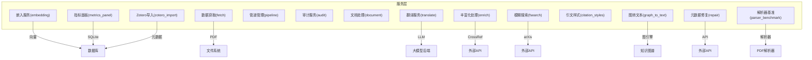

图表来源
- [embedding.py:598-786](file://src/drbrain/services/embedding.py#L598-L786)
- [fetch.py:13-345](file://src/drbrain/services/fetch.py#L13-L345)
- [translate.py:562-726](file://src/drbrain/services/translate.py#L562-L726)
- [enrich.py:128-171](file://src/drbrain/services/enrich.py#L128-L171)
- [pipeline.py:23-109](file://src/drbrain/services/pipeline.py#L23-L109)
- [audit.py:30-396](file://src/drbrain/services/audit.py#L30-L396)
- [document.py:17-395](file://src/drbrain/services/document.py#L17-L395)
- [fsearch.py:125-178](file://src/drbrain/services/fsearch.py#L125-L178)
- [graph_to_text.py:70-145](file://src/drbrain/services/graph_to_text.py#L70-L145)
- [metrics_panel.py:13-139](file://src/drbrain/services/metrics_panel.py#L13-L139)
- [citation_styles.py:234-389](file://src/drbrain/services/citation_styles.py#L234-L389)
- [zotero_import.py:118-719](file://src/drbrain/services/zotero_import.py#L118-L719)
- [repair.py:265-337](file://src/drbrain/services/repair.py#L265-L337)
- [parser_benchmark.py:39-154](file://src/drbrain/services/parser_benchmark.py#L39-L154)

章节来源
- [embedding.py:1-786](file://src/drbrain/services/embedding.py#L1-L786)
- [fetch.py:1-345](file://src/drbrain/services/fetch.py#L1-L345)
- [translate.py:1-726](file://src/drbrain/services/translate.py#L1-L726)
- [enrich.py:1-171](file://src/drbrain/services/enrich.py#L1-L171)
- [pipeline.py:1-109](file://src/drbrain/services/pipeline.py#L1-L109)
- [audit.py:1-396](file://src/drbrain/services/audit.py#L1-L396)
- [document.py:1-395](file://src/drbrain/services/document.py#L1-L395)
- [fsearch.py:1-178](file://src/drbrain/services/fsearch.py#L1-L178)
- [graph_to_text.py:1-145](file://src/drbrain/services/graph_to_text.py#L1-L145)
- [metrics_panel.py:1-139](file://src/drbrain/services/metrics_panel.py#L1-L139)
- [citation_styles.py:1-389](file://src/drbrain/services/citation_styles.py#L1-L389)
- [zotero_import.py:1-719](file://src/drbrain/services/zotero_import.py#L1-L719)
- [repair.py:1-337](file://src/drbrain/services/repair.py#L1-L337)
- [parser_benchmark.py:1-154](file://src/drbrain/services/parser_benchmark.py#L1-L154)

## 核心组件
- 嵌入服务：支持本地/远端模型、GPU 内存自适应批大小、增量更新、向量检索与后过滤
- 数据获取：多阶段 PDF 获取（arXiv → OpenAlex → Unpaywall → 直接 DOI → 标题 arXiv 搜索），代理与校验
- 翻译服务：分块翻译、占位符保护、重试与子分块降采样、并发线程池、工作区状态持久化
- 丰富化处理：CrossRef 元数据抓取、字段完整性检查、可疑记录检测
- 管道管理：步骤定义与预设（full/quick/embed），参数解析与校验
- 审计服务：15 条规则扫描、严重级别过滤、富文本输出
- 文档处理：DOCX/PPTX/XLSX 结构化检查与布局告警
- 模糊搜索：本地 BM25 风格检索 + arXiv 联动，去重与入库匹配
- 图转文本：路径模板化描述 + LLM 概括
- 指标面板：轻量 SQLite 统计（搜索关键词、阅读事件、周趋势）
- 引文样式：内置 APA/Vancouver/Chicago/MLA 与自定义样式动态加载
- Zotero 导入：本地 SQLite、Web API、Endnote XML/RIS、BibTeX 多格式
- 元数据修复：CrossRef/arXiv/OpenAlex 多源补齐，规范化标题
- 解析器基准：MinerU/PyMuPDF/PyMuPDF4LLM 对比评测

章节来源
- [embedding.py:504-786](file://src/drbrain/services/embedding.py#L504-L786)
- [fetch.py:13-345](file://src/drbrain/services/fetch.py#L13-L345)
- [translate.py:562-726](file://src/drbrain/services/translate.py#L562-L726)
- [enrich.py:14-171](file://src/drbrain/services/enrich.py#L14-L171)
- [pipeline.py:53-109](file://src/drbrain/services/pipeline.py#L53-L109)
- [audit.py:30-396](file://src/drbrain/services/audit.py#L30-L396)
- [document.py:17-395](file://src/drbrain/services/document.py#L17-L395)
- [fsearch.py:125-178](file://src/drbrain/services/fsearch.py#L125-L178)
- [graph_to_text.py:70-145](file://src/drbrain/services/graph_to_text.py#L70-L145)
- [metrics_panel.py:13-139](file://src/drbrain/services/metrics_panel.py#L13-L139)
- [citation_styles.py:234-389](file://src/drbrain/services/citation_styles.py#L234-L389)
- [zotero_import.py:118-719](file://src/drbrain/services/zotero_import.py#L118-L719)
- [repair.py:265-337](file://src/drbrain/services/repair.py#L265-L337)
- [parser_benchmark.py:39-154](file://src/drbrain/services/parser_benchmark.py#L39-L154)

## 架构总览
服务层围绕“数据采集 → 结构化 → 向量化 → 推理/检索 → 输出”的主链路组织，同时提供“审计/修复/导出/统计”等支撑能力。关键交互如下：
- 嵌入服务与数据库：向量写入/读取、维度校验、后过滤
- 翻译服务与 LLM：提示工程、重试与子分块、并发控制
- 模糊搜索与外部 API：arXiv 联动、本地去重标注
- 审计服务与数据库：全库扫描、规则判定、输出汇总
- 指标面板与独立 SQLite：非阻塞统计、索引优化
- 引文样式与导出：统一格式化接口
- Zotero 导入与数据库：标准化元数据写入
- 元数据修复与外部 API：多源补齐、幂等更新

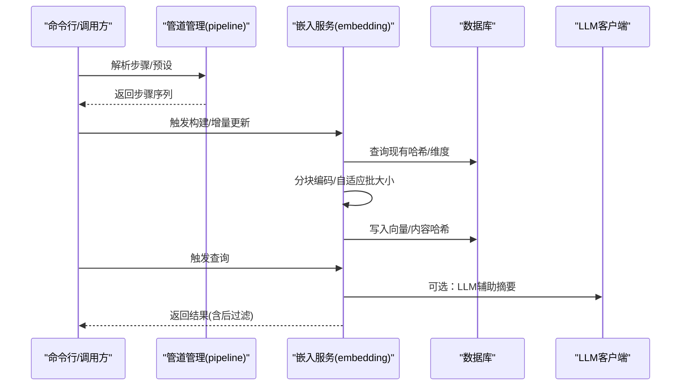

图表来源
- [pipeline.py:53-109](file://src/drbrain/services/pipeline.py#L53-L109)
- [embedding.py:598-786](file://src/drbrain/services/embedding.py#L598-L786)

## 详细组件分析

### 嵌入服务（向量化与检索）
- 功能要点
  - 提供者选择：local/openai-compat/none；none 模式下禁用向量
  - 模型解析：ModelScope/HuggingFace 优先级、缓存键与模块级缓存
  - GPU 自适应批大小：一次性 GPU Profile，内存估算与安全系数
  - 增量构建：基于内容哈希，仅对变更节点重新编码
  - 查询：余弦相似度检索，后过滤与维度校验
- 关键流程

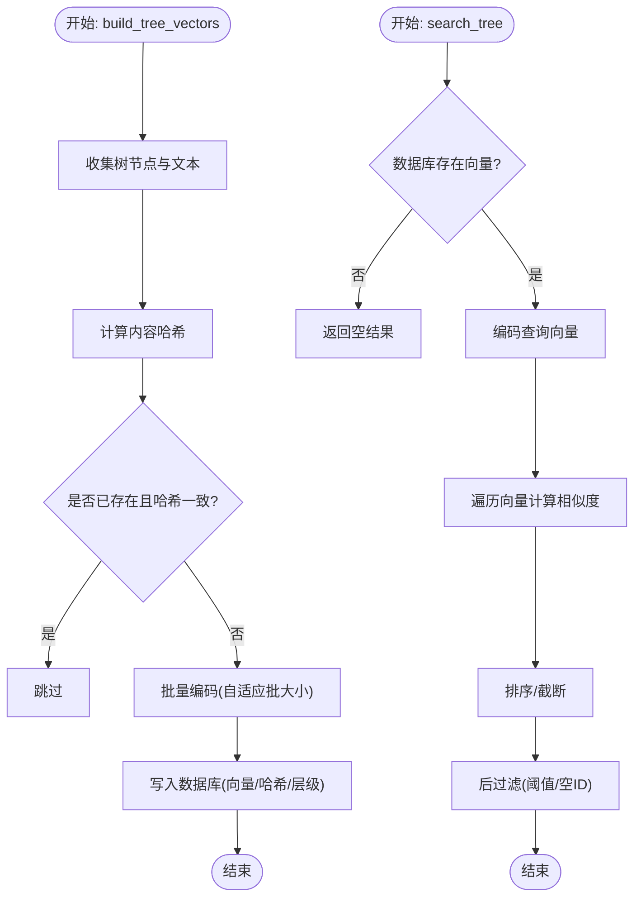

图表来源
- [embedding.py:598-786](file://src/drbrain/services/embedding.py#L598-L786)

章节来源
- [embedding.py:42-786](file://src/drbrain/services/embedding.py#L42-L786)

### 数据获取（PDF 获取与下载）
- 功能要点
  - 多阶段回退：arXiv → OpenAlex OA → Unpaywall → 直接 DOI → 标题 arXiv 搜索
  - 代理适配：ezproxy/url_prefix 两种模式
  - 下载校验：Content-Type/前缀字节双重校验，异常处理与空文件清理
  - 元数据解析：OpenAlex/ArXiv/标题搜索三路
- 关键流程

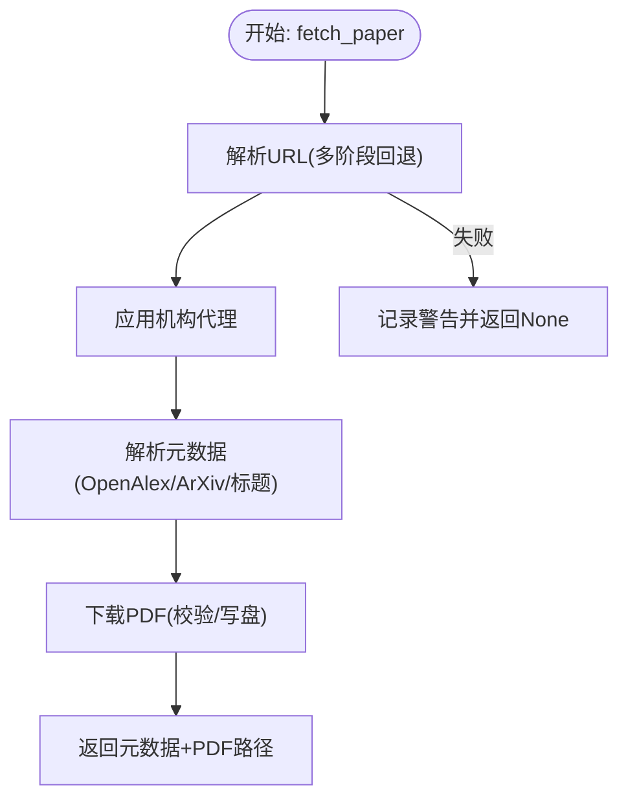

图表来源
- [fetch.py:219-345](file://src/drbrain/services/fetch.py#L219-L345)

章节来源
- [fetch.py:13-345](file://src/drbrain/services/fetch.py#L13-L345)

### 翻译服务（论文分块翻译与重试）
- 功能要点
  - 语言检测：基于保护块清洗的启发式检测
  - 分块策略：保护代码/LaTeX/图片块，句边界优先，超长段硬切
  - 并发执行：线程池 + 进度回调，部分完成可持久化
  - 重试与降采样：指数退避 + 子分块重试
  - 工作区状态：原子写入 state.json/chunks.json，支持强制重来/断点续传
- 关键流程

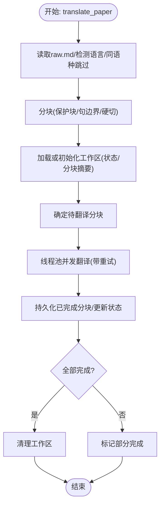

图表来源
- [translate.py:562-726](file://src/drbrain/services/translate.py#L562-L726)

章节来源
- [translate.py:1-726](file://src/drbrain/services/translate.py#L1-L726)

### 丰富化处理（CrossRef 元数据补全与质量检测）
- 功能要点
  - 字段完整性检查：标题/年份/作者/期刊
  - 质量可疑检测：标题为空/过短/像文件名、作者缺失、未来年份、异常年份
  - CrossRef 抓取：解析响应为简化元数据字典
  - 合并策略：仅在缺失时填充，不覆盖既有值
- 关键流程

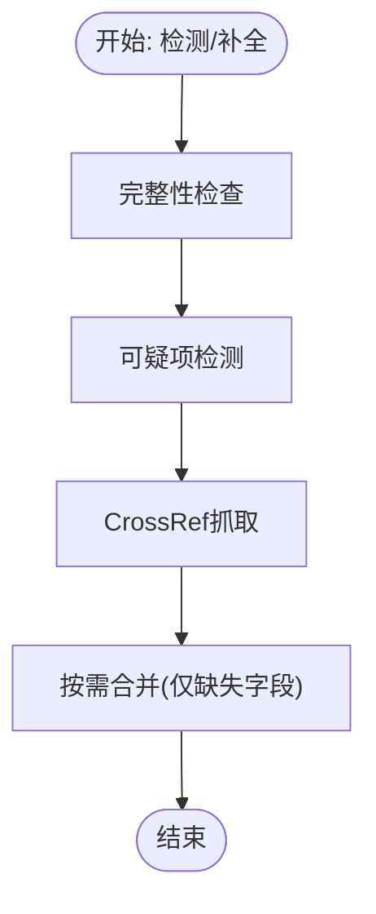

图表来源
- [enrich.py:14-171](file://src/drbrain/services/enrich.py#L14-L171)

章节来源
- [enrich.py:1-171](file://src/drbrain/services/enrich.py#L1-L171)

### 管道管理（步骤定义与预设）
- 功能要点
  - 步骤定义：ingest/build/embed/closure
  - 预设组合：full/quick/embed
  - 参数解析：预设名或逗号分隔步骤列表，去重与校验
- 关键流程

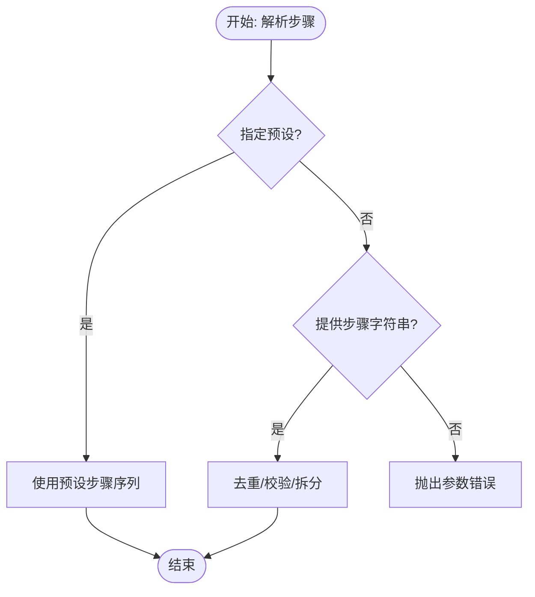

图表来源
- [pipeline.py:53-109](file://src/drbrain/services/pipeline.py#L53-L109)

章节来源
- [pipeline.py:1-109](file://src/drbrain/services/pipeline.py#L1-L109)

### 审计服务（全库规则扫描）
- 功能要点
  - 15 条规则：标题/MD/DOI/摘要/年份/期刊/作者/树结构/概念数/环境变量残留/边数/占位状态/老占位/重复标题
  - 严重级别：error/warning/info
  - 输出：JSON 或富文本表格，含汇总
- 关键流程

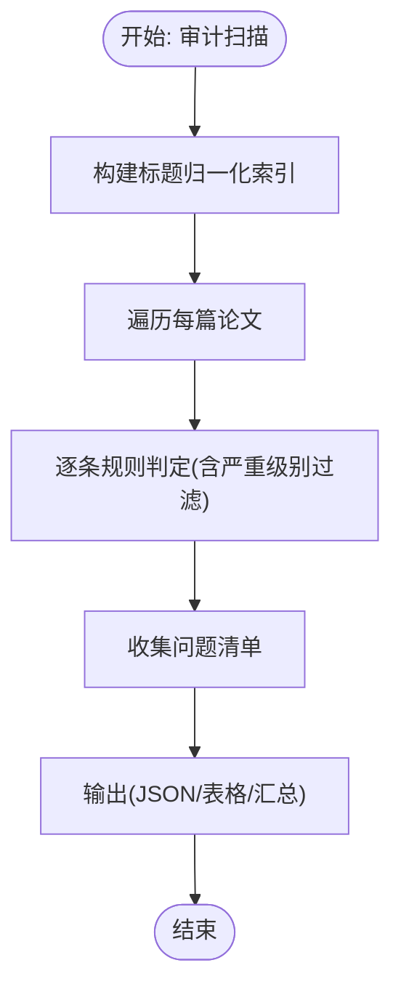

图表来源
- [audit.py:30-396](file://src/drbrain/services/audit.py#L30-L396)

章节来源
- [audit.py:1-396](file://src/drbrain/services/audit.py#L1-L396)

### 文档处理（Office 文档结构化检查）
- 功能要点
  - DOCX：段落/表格/图像/样式/页边距/目录字段识别
  - PPTX：幻灯片尺寸/溢出/图片/表格/字体信息/文本高度估计
  - XLSX：工作表/冻结窗格/自动筛选/合并单元格/图表/数据预览
- 关键流程

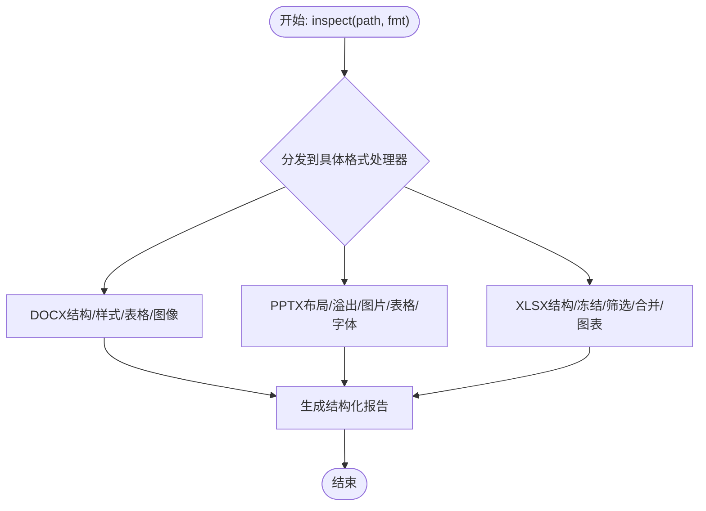

图表来源
- [document.py:17-395](file://src/drbrain/services/document.py#L17-L395)

章节来源
- [document.py:1-395](file://src/drbrain/services/document.py#L1-L395)

### 模糊搜索（本地 + 外部 arXiv）
- 功能要点
  - 本地：基于 BM25 思想的标题/概念/论点模糊匹配
  - 外部：arXiv Atom API 搜索，归一化 arXiv ID，与本地去重
- 关键流程

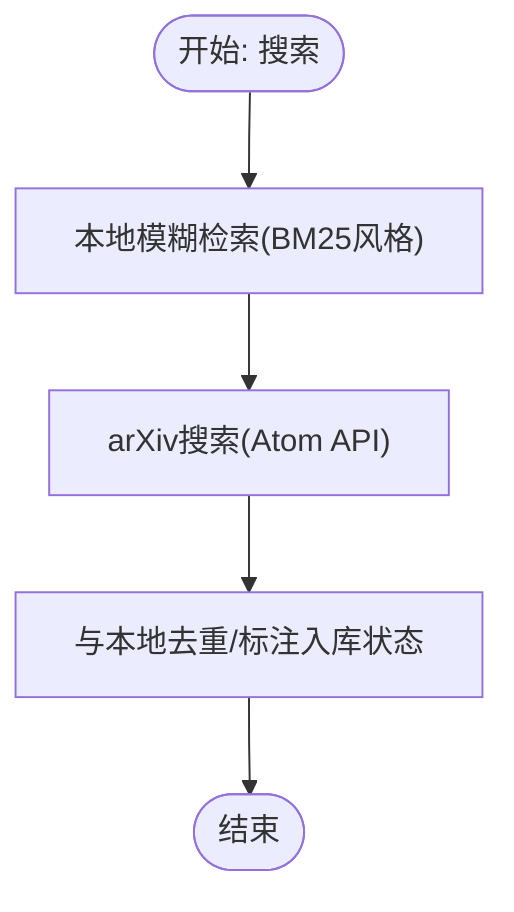

图表来源
- [fsearch.py:125-178](file://src/drbrain/services/fsearch.py#L125-L178)

章节来源
- [fsearch.py:1-178](file://src/drbrain/services/fsearch.py#L1-L178)

### 图转文本（子图路径自然语言描述）
- 功能要点
  - 路径描述：关系映射为自然语言动词/动名词
  - 子图描述：邻域遍历 + 结构化提示 + LLM 概括
- 关键流程

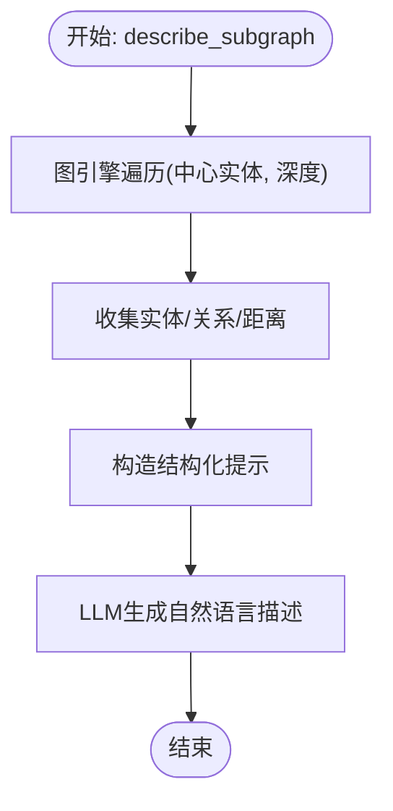

图表来源
- [graph_to_text.py:70-145](file://src/drbrain/services/graph_to_text.py#L70-L145)

章节来源
- [graph_to_text.py:1-145](file://src/drbrain/services/graph_to_text.py#L1-L145)

### 指标面板（用户行为统计）
- 功能要点
  - 轻量 SQLite：搜索事件/阅读事件
  - 统计：Top 关键词、最多阅读论文、近 7 日趋势
- 关键流程

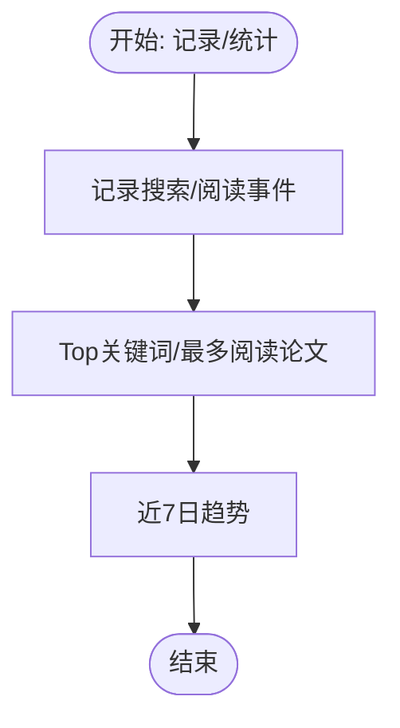

图表来源
- [metrics_panel.py:13-139](file://src/drbrain/services/metrics_panel.py#L13-L139)

章节来源
- [metrics_panel.py:1-139](file://src/drbrain/services/metrics_panel.py#L1-L139)

### 引文样式（内置与自定义）
- 功能要点
  - 内置：APA/Vancouver/Chicago/MLA
  - 自定义：动态加载 .py + 可选 .json 元数据
  - 导出：统一格式化接口
- 关键流程

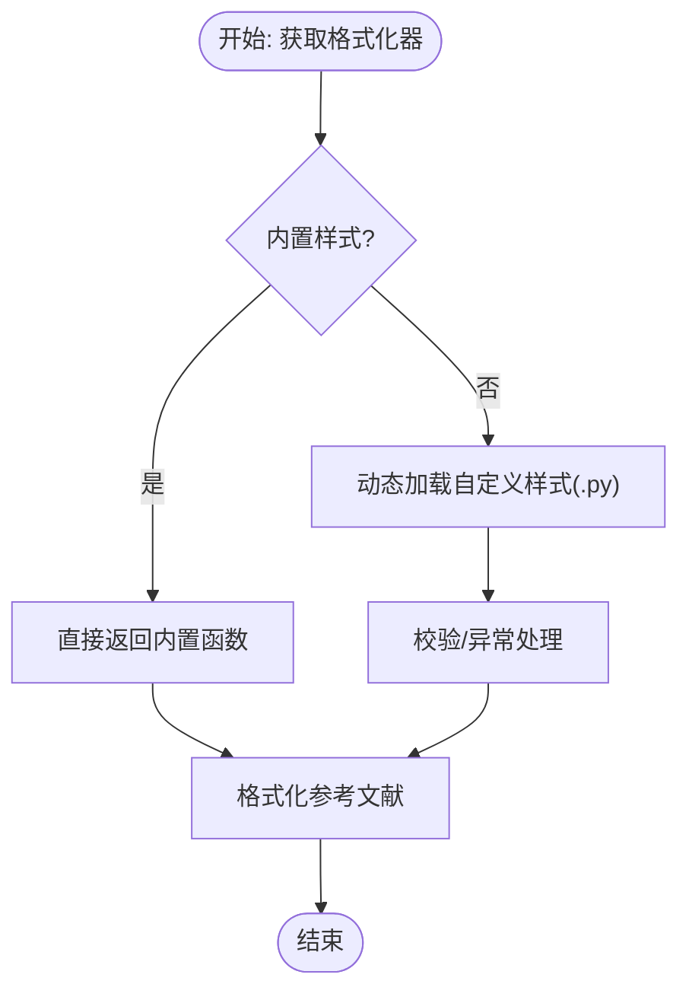

图表来源
- [citation_styles.py:268-389](file://src/drbrain/services/citation_styles.py#L268-L389)

章节来源
- [citation_styles.py:1-389](file://src/drbrain/services/citation_styles.py#L1-L389)

### Zotero 导入（多格式与 Web API）
- 功能要点
  - 本地 SQLite：自动检测 schema，作者/附件/PDF 本地定位
  - Web API：collections/items 列表与过滤
  - Endnote XML/RIS：解析器与字段映射
  - BibTeX：正则解析条目与字段
- 关键流程

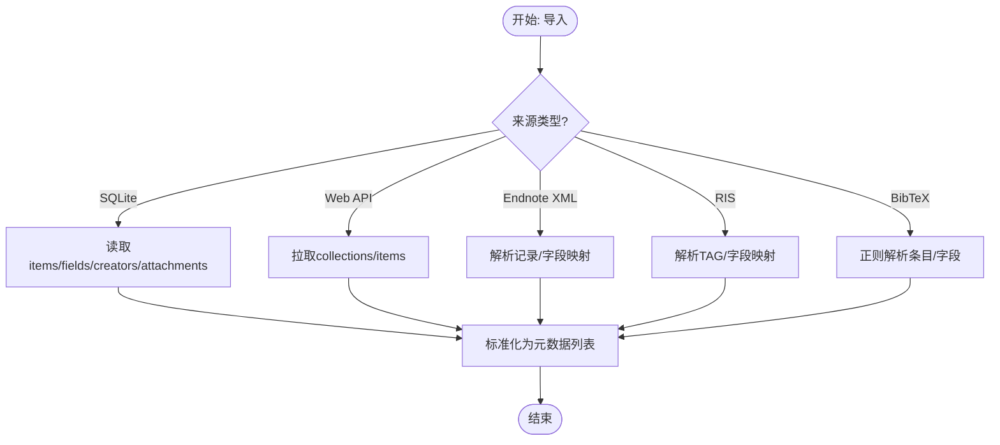

图表来源
- [zotero_import.py:118-719](file://src/drbrain/services/zotero_import.py#L118-L719)

章节来源
- [zotero_import.py:1-719](file://src/drbrain/services/zotero_import.py#L1-L719)

### 元数据修复（多源补齐）
- 功能要点
  - 多源：CrossRef/arXiv/OpenAlex/标题+年份
  - 规范化：标题大小写/去除 arXiv 前缀
  - 幂等更新：仅在缺失时写入
- 关键流程

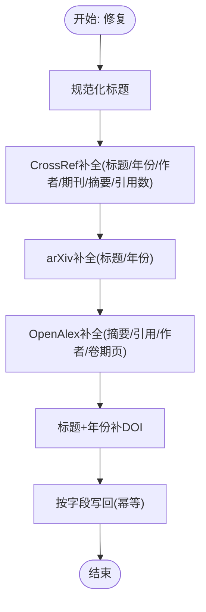

图表来源
- [repair.py:265-337](file://src/drbrain/services/repair.py#L265-L337)

章节来源
- [repair.py:1-337](file://src/drbrain/services/repair.py#L1-L337)

### 解析器基准（PDF 解析器对比）
- 功能要点
  - 支持：PyMuPDF/MinerU/PyMuPDF4LLM
  - 输出：耗时、输出大小、成功/失败、错误信息
  - 汇总：各解析器成功率与平均耗时
- 关键流程

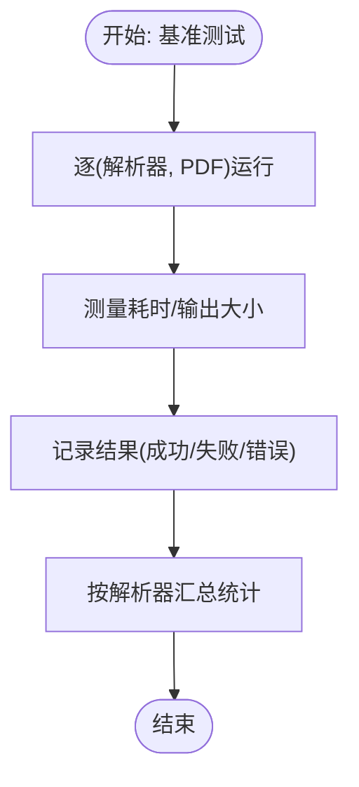

图表来源
- [parser_benchmark.py:39-154](file://src/drbrain/services/parser_benchmark.py#L39-L154)

章节来源
- [parser_benchmark.py:1-154](file://src/drbrain/services/parser_benchmark.py#L1-L154)

## 依赖分析
- 模块内聚与耦合
  - 嵌入服务与数据库耦合紧密（向量存储/查询），与 LLM 客户端弱耦合（可选）
  - 翻译服务与 LLM 客户端强耦合，但通过异步接口解耦
  - 数据获取与外部 API 强耦合，但通过多阶段回退降低单点风险
  - 审计/修复/丰富化均依赖数据库读取，输出报告
  - 指标面板独立 SQLite，避免与主库耦合
- 外部依赖
  - requests/urllib：HTTP 请求与解析
  - sqlite3：本地持久化
  - numpy/torch（可选）：向量与 GPU 批处理
  - python-pptx/python-docx/openpyxl：Office 文档解析
  - pyzotero/endnote-utils：第三方导入
- 循环依赖
  - 未发现循环依赖，模块间通过清晰接口调用

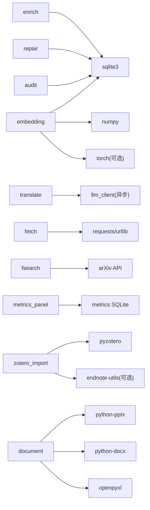

图表来源
- [embedding.py:1-786](file://src/drbrain/services/embedding.py#L1-L786)
- [translate.py:1-726](file://src/drbrain/services/translate.py#L1-L726)
- [fetch.py:1-345](file://src/drbrain/services/fetch.py#L1-L345)
- [audit.py:1-396](file://src/drbrain/services/audit.py#L1-L396)
- [repair.py:1-337](file://src/drbrain/services/repair.py#L1-L337)
- [enrich.py:1-171](file://src/drbrain/services/enrich.py#L1-L171)
- [fsearch.py:1-178](file://src/drbrain/services/fsearch.py#L1-L178)
- [metrics_panel.py:1-139](file://src/drbrain/services/metrics_panel.py#L1-L139)
- [zotero_import.py:1-719](file://src/drbrain/services/zotero_import.py#L1-L719)
- [document.py:1-395](file://src/drbrain/services/document.py#L1-L395)

## 性能考虑
- 嵌入服务
  - GPU Profile 仅一次，缓存到磁盘；自适应批大小减少 OOM 风险
  - 增量更新基于内容哈希，避免重复编码
- 翻译服务
  - 分块 + 占位符保护避免破坏公式/代码；线程池并发 + 子分块降采样提升吞吐
- 数据获取
  - HEAD 快速探测 + 多阶段回退，减少无效下载
- 模糊搜索
  - arXiv 与本地联合，先本地后外部，降低外部依赖开销
- 指标面板
  - 独立 SQLite + 索引，避免影响主库性能
- 文档处理
  - 仅结构化检查，不修改原文件，IO 最小化

## 故障排除指南
- 嵌入服务
  - 无向量/维度不匹配：确认 provider 配置与模型维度一致性
  - OOM：降低 batch_size 或切换 CPU；检查 GPU Profile 缓存
- 翻译服务
  - 分块失败：启用子分块重试；检查网络与 LLM 后端可用性
  - 工作区异常：删除工作区目录后重试
- 数据获取
  - PDF 非法：检查 Content-Type 与前缀字节；确认代理配置
  - DOI 解析：尝试 arXiv 标识或标题搜索
- 审计服务
  - 规则误报：调整严重级别或过滤条件
- 指标面板
  - 统计异常：检查 SQLite 文件权限与连接
- 引文样式
  - 自定义样式加载失败：检查文件名合法性与 format_ref 函数
- Zotero 导入
  - Web API 未安装：安装 pyzotero；本地 SQLite schema 不匹配：检查版本差异
- 元数据修复
  - 多源 API 失败：检查网络与凭据；幂等更新避免重复写入
- 解析器基准
  - 解析器缺失：安装对应依赖；输出为空：检查 PDF 可读性

章节来源
- [embedding.py:215-412](file://src/drbrain/services/embedding.py#L215-L412)
- [translate.py:522-560](file://src/drbrain/services/translate.py#L522-L560)
- [fetch.py:144-217](file://src/drbrain/services/fetch.py#L144-L217)
- [audit.py:312-396](file://src/drbrain/services/audit.py#L312-L396)
- [metrics_panel.py:13-139](file://src/drbrain/services/metrics_panel.py#L13-L139)
- [citation_styles.py:286-325](file://src/drbrain/services/citation_styles.py#L286-L325)
- [zotero_import.py:348-471](file://src/drbrain/services/zotero_import.py#L348-L471)
- [repair.py:265-337](file://src/drbrain/services/repair.py#L265-L337)
- [parser_benchmark.py:39-154](file://src/drbrain/services/parser_benchmark.py#L39-L154)

## 结论
DrBrain 服务层以模块化设计实现了从数据采集、结构化、向量化到推理与输出的完整链路，辅以审计、修复、导出与统计等支撑能力。通过多阶段回退、GPU 自适应批大小、分块翻译与重试、独立指标库等策略，兼顾了鲁棒性与性能。建议在生产环境中结合配置管理与监控策略，持续优化外部 API 与 LLM 后端的可用性与成本。

## 附录
- 服务接口与配置要点
  - 嵌入服务：provider/model/cache_dir/device/batch_size/source
  - 翻译服务：目标语言、分块大小、并发线程数、进度回调
  - 数据获取：代理类型/主机、User-Agent、超时、邮箱（Unpaywall）
  - 模糊搜索：arXiv 最大结果数、本地限制
  - 指标面板：指标库路径
  - 引文样式：样式目录、样式名称
  - Zotero 导入：库类型/密钥、集合过滤、存储目录
  - 元数据修复：Dry-run 开关
- 集成模式
  - 管道管理：通过预设/步骤字符串编排链路
  - 外部 API：统一通过 requests/urllib，必要处引入重试与降级
  - 缓存策略：模型缓存/GPU Profile 缓存/工作区状态文件
  - 异步处理：翻译/图转文本采用异步 LLM 调用
- 部署建议
  - GPU 环境：启用 CUDA，合理设置 batch_size 与安全系数
  - 网络环境：配置代理与超时，确保 arXiv/CrossRef/OpenAlex 可达
  - 存储：独立指标库与模型缓存目录，定期清理临时文件
  - 监控：记录关键指标（耗时/成功率/错误码），结合日志与告警