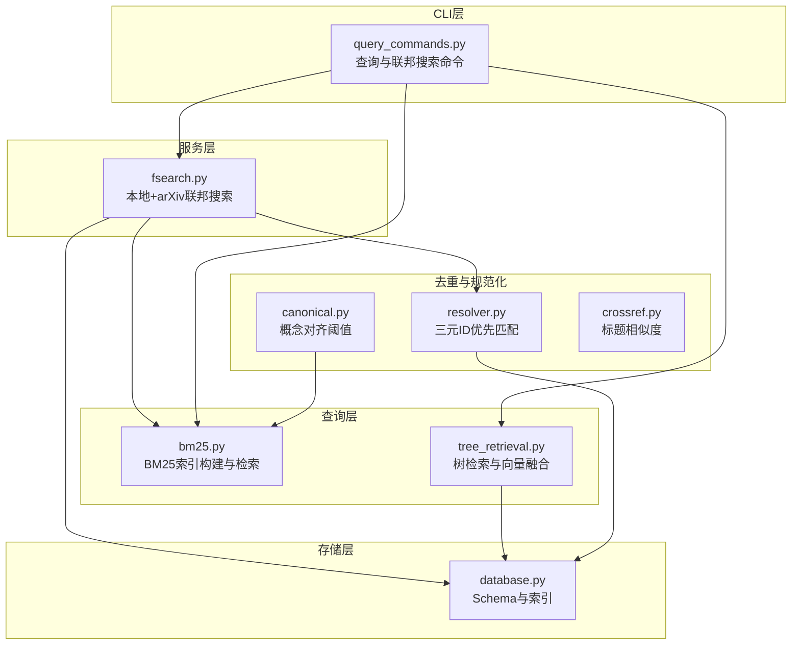
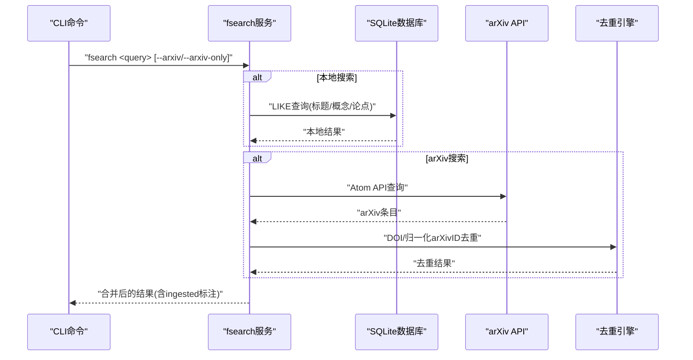
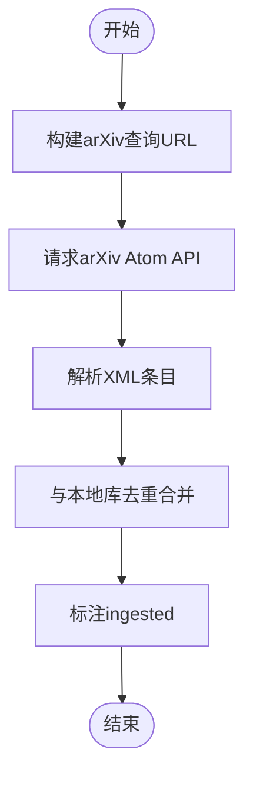
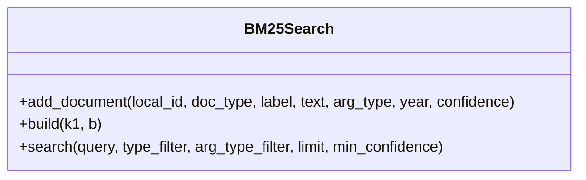
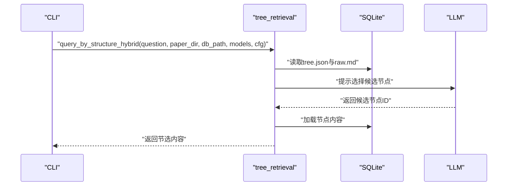
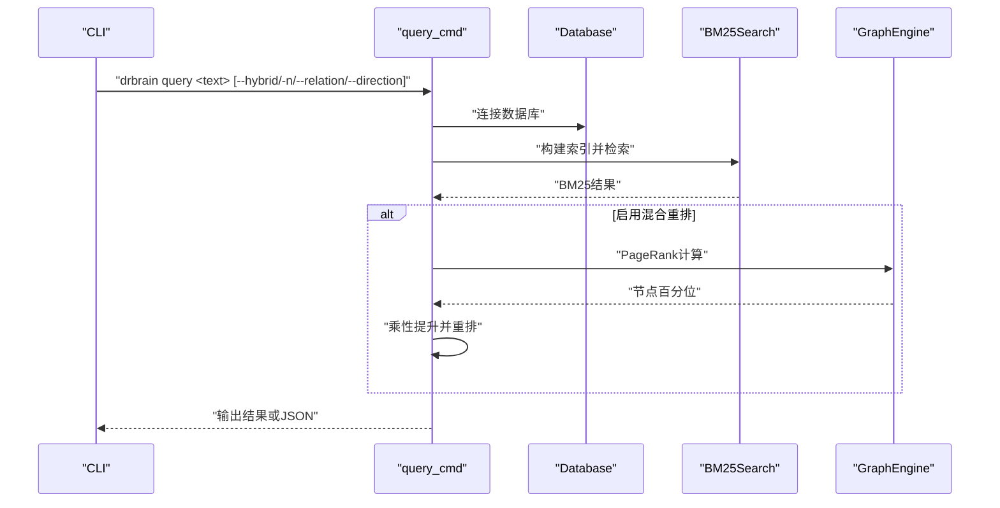
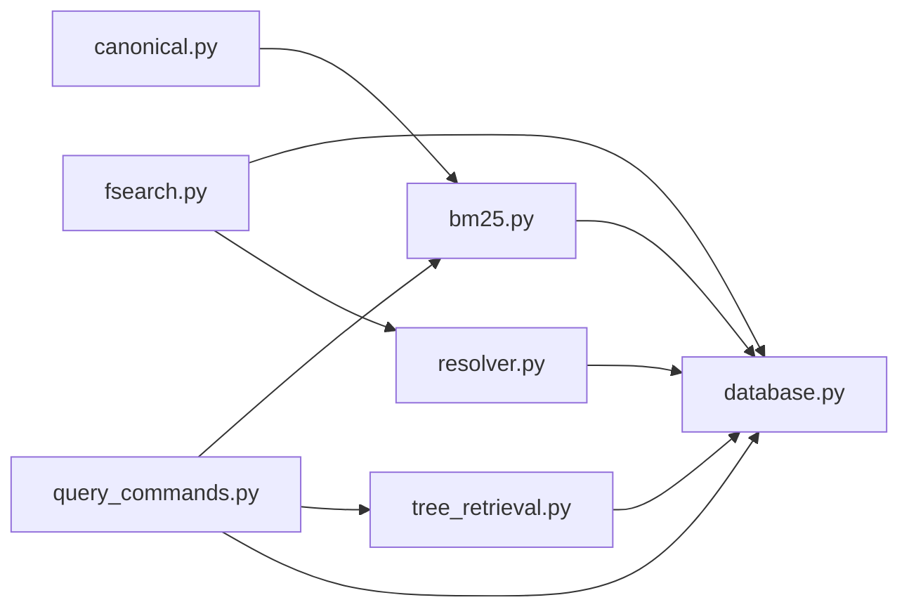

# 模糊搜索服务

<cite>
**本文引用的文件列表**
- [fsearch.py](file://src/drbrain/services/fsearch.py)
- [test_fsearch.py](file://tests/test_fsearch.py)
- [bm25.py](file://src/drbrain/query/bm25.py)
- [tree_retrieval.py](file://src/drbrain/query/tree_retrieval.py)
- [query_commands.py](file://src/drbrain/cli/query_commands.py)
- [resolver.py](file://src/drbrain/dedup/resolver.py)
- [canonical.py](file://src/drbrain/extractor/canonical.py)
- [crossref.py](file://src/drbrain/extractor/crossref.py)
- [embedding.py](file://src/drbrain/services/embedding.py)
- [database.py](file://src/drbrain/storage/database.py)
- [SKILL.md](file://skills/fsearch/SKILL.md)
</cite>

## 目录
1. [简介](#简介)
2. [项目结构](#项目结构)
3. [核心组件](#核心组件)
4. [架构总览](#架构总览)
5. [详细组件分析](#详细组件分析)
6. [依赖关系分析](#依赖关系分析)
7. [性能考量](#性能考量)
8. [故障排查指南](#故障排查指南)
9. [结论](#结论)
10. [附录](#附录)

## 简介
本文件面向 DrBrain 的“模糊搜索服务”模块，系统性阐述其在本地库与外部源（arXiv）之间的联邦检索能力，重点覆盖以下方面：
- 模糊匹配与相似度计算：BM25 文本检索、标题规范化与模糊匹配、交叉引用去重策略
- 搜索索引构建与查询优化：BM25 索引构建、过滤与排序、混合重排（PageRank）
- 结果合并与标注：arXiv 结果与本地库的去重与“已入库”标注
- 配置与使用：CLI 参数、输出格式、JSON 流式输出
- 性能优化与缓存：向量嵌入缓存、GPU 内存自适应批大小、数据库索引
- 实际示例：如何配置与调用模糊搜索服务

## 项目结构
模糊搜索服务横跨多个子模块：
- 服务层：fsearch 提供本地与 arXiv 联合搜索与去重标注
- 查询层：BM25 构建与检索、树检索（PageIndex）与向量融合
- 去重与规范化：标题规范化、三元ID优先匹配、概念对齐阈值
- 存储层：SQLite 数据库 Schema 与索引
- CLI 层：查询命令与联邦搜索命令



图表来源
- [fsearch.py:1-178](file://src/drbrain/services/fsearch.py#L1-L178)
- [bm25.py:1-135](file://src/drbrain/query/bm25.py#L1-L135)
- [tree_retrieval.py:1-876](file://src/drbrain/query/tree_retrieval.py#L1-L876)
- [resolver.py:1-82](file://src/drbrain/dedup/resolver.py#L1-L82)
- [canonical.py:1-252](file://src/drbrain/extractor/canonical.py#L1-L252)
- [crossref.py:87-117](file://src/drbrain/extractor/crossref.py#L87-L117)
- [database.py:1-200](file://src/drbrain/storage/database.py#L1-L200)
- [query_commands.py:1-738](file://src/drbrain/cli/query_commands.py#L1-L738)

章节来源
- [fsearch.py:1-178](file://src/drbrain/services/fsearch.py#L1-L178)
- [bm25.py:1-135](file://src/drbrain/query/bm25.py#L1-L135)
- [tree_retrieval.py:1-876](file://src/drbrain/query/tree_retrieval.py#L1-L876)
- [resolver.py:1-82](file://src/drbrain/dedup/resolver.py#L1-L82)
- [canonical.py:1-252](file://src/drbrain/extractor/canonical.py#L1-L252)
- [crossref.py:87-117](file://src/drbrain/extractor/crossref.py#L87-L117)
- [database.py:1-200](file://src/drbrain/storage/database.py#L1-L200)
- [query_commands.py:1-738](file://src/drbrain/cli/query_commands.py#L1-L738)

## 核心组件
- 联邦搜索服务（fsearch）
  - 本地库检索：基于 SQLite 的简单 BM25-like 查询（标题/概念/论点），按年份降序返回
  - arXiv 检索：通过 Atom API 拉取，解析条目字段，标准化 arXiv ID
  - 去重标注：根据 DOI 与归一化 arXiv ID 判断是否已在本地库
- BM25 检索器（BM25Search）
  - 支持论文标题/摘要、概念标签、论点声明的多源索引
  - 支持类型过滤、论点类型过滤、最小置信度过滤、限制返回数量
- 树检索与向量融合（tree_retrieval）
  - PageIndex 树检索：分轮次选择节点，按需加载内容
  - 向量检索：支持 RAPTOR 分层遍历与折叠树回退
  - 混合评分：BM25 与向量相似度加权融合
- 去重与标题规范化（resolver、canonical、crossref）
  - 三元ID优先匹配（DOI > arXiv > S2 > OpenAlex）
  - 标题规范化与哈希，用于模糊匹配与缓存键
  - 概念对齐阈值：自动对齐与待仲裁阈值
- CLI 命令（query_commands）
  - 查询命令：BM25 检索 + 年份/工作区过滤 + 图中心性混合重排 + 图遍历扩展
  - 联邦搜索命令：fsearch 命令封装

章节来源
- [fsearch.py:125-178](file://src/drbrain/services/fsearch.py#L125-L178)
- [bm25.py:17-135](file://src/drbrain/query/bm25.py#L17-L135)
- [tree_retrieval.py:215-800](file://src/drbrain/query/tree_retrieval.py#L215-L800)
- [resolver.py:50-82](file://src/drbrain/dedup/resolver.py#L50-L82)
- [canonical.py:110-202](file://src/drbrain/extractor/canonical.py#L110-L202)
- [crossref.py:87-117](file://src/drbrain/extractor/crossref.py#L87-L117)
- [query_commands.py:283-738](file://src/drbrain/cli/query_commands.py#L283-L738)

## 架构总览
模糊搜索服务采用“服务层 + 查询层 + 去重层 + 存储层 + CLI层”的分层设计。本地检索以 BM25 为主，arXiv 检索作为补充，并通过三元ID与标题规范化进行去重与标注。



图表来源
- [query_commands.py:633-738](file://src/drbrain/cli/query_commands.py#L633-L738)
- [fsearch.py:32-178](file://src/drbrain/services/fsearch.py#L32-L178)
- [resolver.py:50-82](file://src/drbrain/dedup/resolver.py#L50-L82)

## 详细组件分析

### 组件A：联邦搜索服务（fsearch）
- 功能要点
  - 本地检索：对论文标题、概念标签、论点声明执行 LIKE 匹配，按年份降序返回
  - arXiv 检索：构造 Atom API URL，解析 XML，提取标题、作者、摘要、发表时间、DOI、arXiv ID
  - 去重标注：通过 DOI 与归一化 arXiv ID 判断是否已在本地库，添加 ingested 标记
- 关键流程图



图表来源
- [fsearch.py:26-95](file://src/drbrain/services/fsearch.py#L26-L95)
- [fsearch.py:98-122](file://src/drbrain/services/fsearch.py#L98-L122)

章节来源
- [fsearch.py:1-178](file://src/drbrain/services/fsearch.py#L1-L178)
- [test_fsearch.py:1-100](file://tests/test_fsearch.py#L1-L100)

### 组件B：BM25 检索器（BM25Search）
- 功能要点
  - 支持添加论文标题/摘要、概念标签、论点声明为可检索文档
  - 构建 BM25 索引，支持类型过滤、论点类型过滤、最小置信度过滤、限制返回数量
  - 返回带分数的排序结果
- 类图



图表来源
- [bm25.py:17-135](file://src/drbrain/query/bm25.py#L17-L135)

章节来源
- [bm25.py:1-135](file://src/drbrain/query/bm25.py#L1-L135)

### 组件C：树检索与向量融合（tree_retrieval）
- 功能要点
  - PageIndex 树检索：分轮次选择节点，按需加载内容；支持大结构时的顶层导航
  - 向量检索：RAPTOR 分层遍历 + 折叠树回退；支持 cosine 相似度评分
  - 混合评分：BM25 与向量相似度归一化后加权融合
- 序列图（树检索）



图表来源
- [tree_retrieval.py:215-380](file://src/drbrain/query/tree_retrieval.py#L215-L380)

章节来源
- [tree_retrieval.py:1-876](file://src/drbrain/query/tree_retrieval.py#L1-L876)

### 组件D：去重与标题规范化（resolver、canonical、crossref）
- 功能要点
  - 三元ID优先匹配：DOI > arXiv > S2 > OpenAlex
  - 标题规范化：去除冠词、标点、多余空白，生成短哈希用于缓存键
  - 概念对齐阈值：自动对齐阈值与待仲裁阈值，结合 BM25 模糊匹配
  - 标题相似度：前缀匹配、词重叠率（70%+）
- 类图

```mermaid
classDiagram
class DedupEngine {
+resolve(ids, title, year) str|None
}
class SmartAligner {
+align(label, ctype) str
-_bm25_search(label, ctype) (score, doc)|None
}
DedupEngine --> "优先匹配三元ID"
SmartAligner --> "BM25模糊匹配"
```

图表来源
- [resolver.py:50-82](file://src/drbrain/dedup/resolver.py#L50-L82)
- [canonical.py:110-202](file://src/drbrain/extractor/canonical.py#L110-L202)

章节来源
- [resolver.py:1-82](file://src/drbrain/dedup/resolver.py#L1-L82)
- [canonical.py:1-252](file://src/drbrain/extractor/canonical.py#L1-L252)
- [crossref.py:87-117](file://src/drbrain/extractor/crossref.py#L87-L117)

### 组件E：CLI 命令（query_commands）
- 功能要点
  - 查询命令：BM25 检索 + 年份/工作区过滤 + 图中心性混合重排（PageRank）+ 图遍历扩展
  - 联邦搜索命令：fsearch 命令封装，支持 JSON 输出与限制每源结果数
- 序列图（查询命令）



图表来源
- [query_commands.py:283-631](file://src/drbrain/cli/query_commands.py#L283-L631)

章节来源
- [query_commands.py:1-738](file://src/drbrain/cli/query_commands.py#L1-L738)

## 依赖关系分析
- fsearch 依赖 SQLite 数据库进行本地检索与去重交叉引用
- BM25Search 依赖 rank_bm25 进行文本检索
- tree_retrieval 依赖嵌入服务与数据库中的 tree_vectors 表
- 去重与规范化依赖数据库中的 paper_ids 与概念表
- CLI 命令依赖各服务模块与数据库



图表来源
- [fsearch.py:1-178](file://src/drbrain/services/fsearch.py#L1-L178)
- [bm25.py:1-135](file://src/drbrain/query/bm25.py#L1-L135)
- [tree_retrieval.py:1-876](file://src/drbrain/query/tree_retrieval.py#L1-L876)
- [resolver.py:1-82](file://src/drbrain/dedup/resolver.py#L1-L82)
- [canonical.py:1-252](file://src/drbrain/extractor/canonical.py#L1-L252)
- [database.py:1-200](file://src/drbrain/storage/database.py#L1-L200)
- [query_commands.py:1-738](file://src/drbrain/cli/query_commands.py#L1-L738)

章节来源
- [fsearch.py:1-178](file://src/drbrain/services/fsearch.py#L1-L178)
- [bm25.py:1-135](file://src/drbrain/query/bm25.py#L1-L135)
- [tree_retrieval.py:1-876](file://src/drbrain/query/tree_retrieval.py#L1-L876)
- [resolver.py:1-82](file://src/drbrain/dedup/resolver.py#L1-L82)
- [canonical.py:1-252](file://src/drbrain/extractor/canonical.py#L1-L252)
- [database.py:1-200](file://src/drbrain/storage/database.py#L1-L200)
- [query_commands.py:1-738](file://src/drbrain/cli/query_commands.py#L1-L738)

## 性能考量
- BM25 索引构建与检索
  - 使用 rank_bm25，支持 k1/b 调参；构建时对标签与文本进行分词
  - 检索时支持类型/论点类型过滤与最小置信度过滤，减少无效结果
- 树检索与向量融合
  - PageIndex 采用分轮次选择，避免一次性发送全量结构
  - 向量检索支持 RAPTOR 分层遍历，先粗后细，降低计算开销
  - 混合评分对 BM25 分数进行归一化，避免尺度差异
- 嵌入服务与缓存
  - 模型加载与缓存：模型实例缓存，避免重复加载
  - GPU 内存自适应批大小：根据 GPU 总内存与样本增量估算，上限 128
  - 向量后处理：最小分数过滤、空节点过滤
- 数据库与索引
  - SQLite WAL 模式提升并发写入性能
  - 多处索引（概念类型、标签、论点目标、边关系等）加速查询
- 去重与规范化
  - 标题规范化与哈希用于缓存键，减少重复计算
  - 三元ID优先匹配，优先命中强标识符，降低模糊匹配成本

章节来源
- [bm25.py:1-135](file://src/drbrain/query/bm25.py#L1-L135)
- [tree_retrieval.py:382-450](file://src/drbrain/query/tree_retrieval.py#L382-L450)
- [embedding.py:202-316](file://src/drbrain/services/embedding.py#L202-L316)
- [database.py:1-200](file://src/drbrain/storage/database.py#L1-L200)
- [resolver.py:36-47](file://src/drbrain/dedup/resolver.py#L36-L47)

## 故障排查指南
- arXiv 检索失败
  - 现象：网络错误或解析异常导致返回空结果
  - 排查：检查网络连通性、超时设置、Atom API 可用性
  - 参考路径：[fsearch.py:44-51](file://src/drbrain/services/fsearch.py#L44-L51)
- 本地库为空或未建立索引
  - 现象：本地检索返回空
  - 排查：确认数据库路径存在、索引已构建、查询条件合理
  - 参考路径：[fsearch.py:143-144](file://src/drbrain/services/fsearch.py#L143-L144)
- 去重不生效
  - 现象：arXiv 结果未标注 ingested
  - 排查：确认 paper_ids 表中存在 DOI 或归一化 arXiv ID
  - 参考路径：[fsearch.py:690-700](file://src/drbrain/services/fsearch.py#L690-L700)
- 混合重排无效果
  - 现象：--hybrid 未改变排序
  - 排查：确认图非空且 PageRank 计算收敛；检查结果数量与阈值
  - 参考路径：[query_commands.py:460-498](file://src/drbrain/cli/query_commands.py#L460-L498)
- 标题相似度误判
  - 现象：相似度阈值过低或过高导致误判
  - 排查：检查标题规范化规则与相似度计算逻辑
  - 参考路径：[resolver.py:36-47](file://src/drbrain/dedup/resolver.py#L36-L47), [crossref.py:87-104](file://src/drbrain/extractor/crossref.py#L87-L104)

章节来源
- [fsearch.py:1-178](file://src/drbrain/services/fsearch.py#L1-L178)
- [query_commands.py:1-738](file://src/drbrain/cli/query_commands.py#L1-L738)
- [resolver.py:1-82](file://src/drbrain/dedup/resolver.py#L1-L82)
- [crossref.py:87-117](file://src/drbrain/extractor/crossref.py#L87-L117)

## 结论
DrBrain 的模糊搜索服务通过“本地 BM25 + 外部 arXiv + 去重标注”的组合，实现了高效、可扩展的联邦检索。其关键优势在于：
- 明确的去重策略（三元ID优先）与标题规范化
- 可扩展的检索路径（BM25、树检索、向量融合）
- 清晰的混合重排与过滤机制
- 完善的性能优化（索引、缓存、批大小自适应）

建议在生产环境中：
- 定期重建 BM25 索引，确保检索质量
- 合理设置 --limit 与过滤参数，平衡召回与效率
- 在大规模图场景启用 --hybrid，提升重要结果的曝光
- 对 arXiv 检索开启 ingested 标注，避免重复入库

## 附录

### 使用指南与示例
- 联邦搜索命令
  - 本地库检索：[SKILL.md:17-21](file://skills/fsearch/SKILL.md#L17-L21)
  - 本地+arXiv：[SKILL.md:18-19](file://skills/fsearch/SKILL.md#L18-L19)
  - arXiv 仅：[SKILL.md](file://skills/fsearch/SKILL.md#L20)
  - 限制每源结果数与 JSON 输出：[SKILL.md:36-39](file://skills/fsearch/SKILL.md#L36-L39)
- 查询命令
  - BM25 检索 + 混合重排 + 图遍历扩展：[query_commands.py:283-631](file://src/drbrain/cli/query_commands.py#L283-L631)

章节来源
- [SKILL.md:1-39](file://skills/fsearch/SKILL.md#L1-L39)
- [query_commands.py:283-631](file://src/drbrain/cli/query_commands.py#L283-L631)

### 配置与参数参考
- fsearch 命令参数
  - --arxiv：同时搜索 arXiv
  - --arxiv-only：仅搜索 arXiv
  - --limit：限制每源结果数
  - --json：JSON 输出
  - 参考路径：[query_commands.py:633-738](file://src/drbrain/cli/query_commands.py#L633-L738)
- BM25 检索参数
  - type_filter、arg_type_filter、min_confidence、limit
  - 参考路径：[bm25.py:56-90](file://src/drbrain/query/bm25.py#L56-L90)
- 树检索参数
  - max_rounds、per_round、top_k、min_results
  - 参考路径：[tree_retrieval.py:215-380](file://src/drbrain/query/tree_retrieval.py#L215-L380)

章节来源
- [query_commands.py:633-738](file://src/drbrain/cli/query_commands.py#L633-L738)
- [bm25.py:56-90](file://src/drbrain/query/bm25.py#L56-L90)
- [tree_retrieval.py:215-380](file://src/drbrain/query/tree_retrieval.py#L215-L380)

### 效果评估与调优方法
- 评估指标
  - 召回率：本地+arXiv 覆盖度
  - 准确率：去重标注正确率（DOI/归一化 arXiv ID）
  - 重排效果：--hybrid 下高 PageRank 节点的命中率
- 调优建议
  - 调整 BM25 k1/b 参数，平衡长文档与短文档偏好
  - 设置合理的 min_confidence，减少噪声结果
  - 在树检索中调整 per_round 与 top_k，平衡上下文长度与计算成本
  - 对嵌入服务启用 GPU 并合理设置安全系数，提升吞吐

章节来源
- [bm25.py:50-55](file://src/drbrain/query/bm25.py#L50-L55)
- [tree_retrieval.py:382-450](file://src/drbrain/query/tree_retrieval.py#L382-L450)
- [embedding.py:398-412](file://src/drbrain/services/embedding.py#L398-L412)