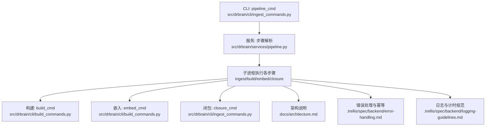
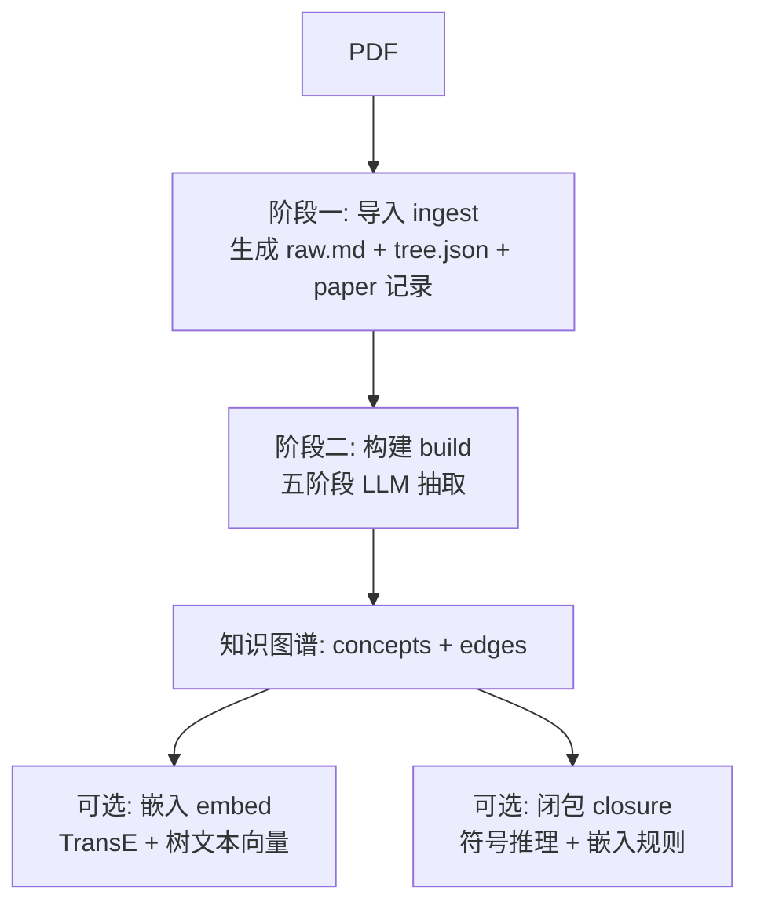
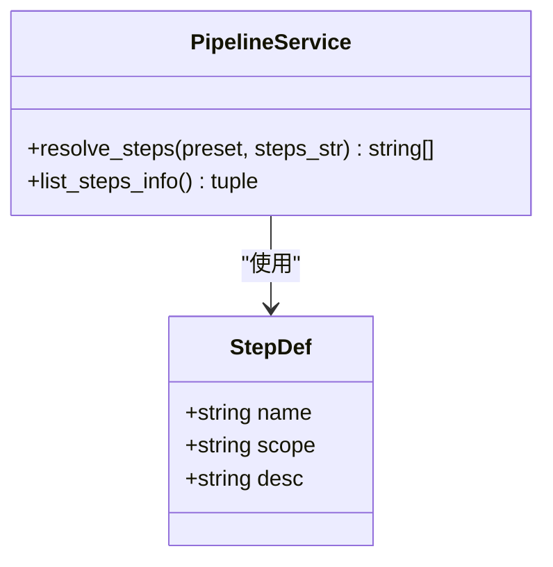
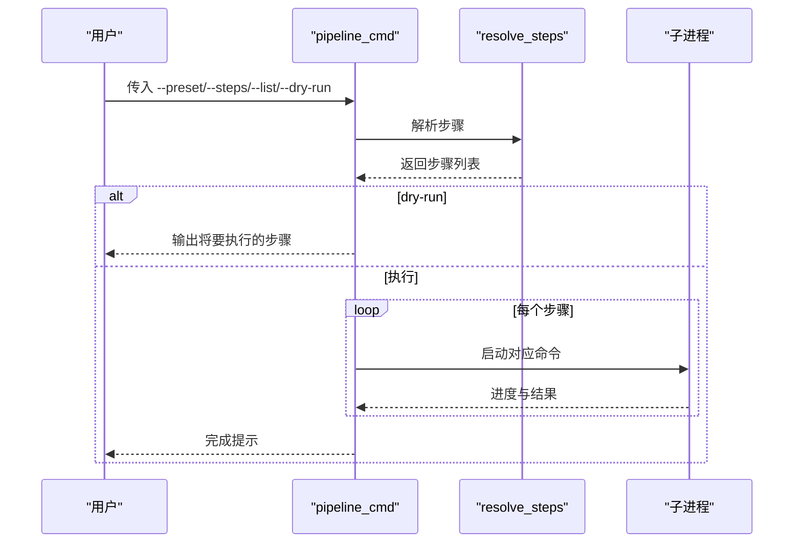
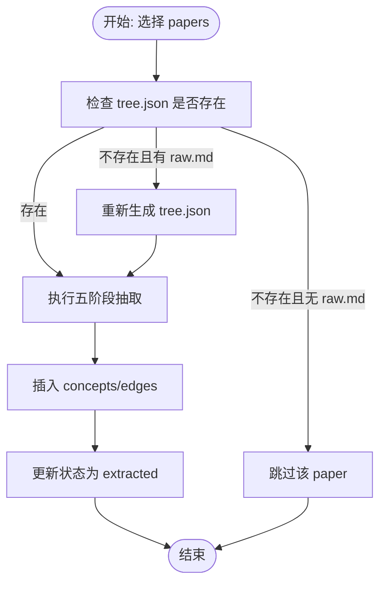
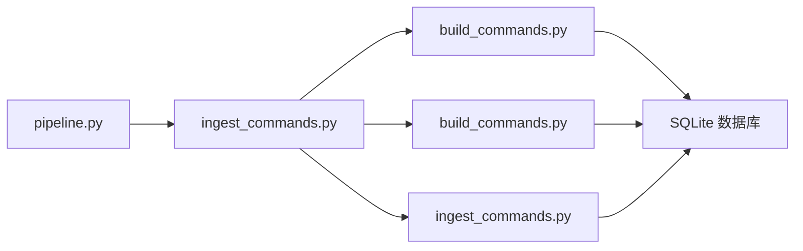

# 管道服务

<cite>
**本文引用的文件**
- [src/drbrain/services/pipeline.py](file://src/drbrain/services/pipeline.py)
- [src/drbrain/cli/ingest_commands.py](file://src/drbrain/cli/ingest_commands.py)
- [skills/pipeline/SKILL.md](file://skills/pipeline/SKILL.md)
- [src/drbrain/cli/main.py](file://src/drbrain/cli/main.py)
- [docs/architecture.md](file://docs/architecture.md)
- [.trellis/spec/backend/error-handling.md](file://.trellis/spec/backend/error-handling.md)
- [.trellis/spec/backend/logging-guidelines.md](file://.trellis/spec/backend/logging-guidelines.md)
- [src/drbrain/cli/build_commands.py](file://src/drbrain/cli/build_commands.py)
- [tests/test_pipeline.py](file://tests/test_pipeline.py)
- [tests/test_integration_pipeline.py](file://tests/test_integration_pipeline.py)
- [docs/configuration.md](file://docs/configuration.md)
- [docs/troubleshooting.md](file://docs/troubleshooting.md)
- [src/drbrain/parser/mineru_parser.py](file://src/drbrain/parser/mineru_parser.py)
- [src/drbrain/services/embedding.py](file://src/drbrain/services/embedding.py)
</cite>

## 目录
1. [简介](#简介)
2. [项目结构](#项目结构)
3. [核心组件](#核心组件)
4. [架构总览](#架构总览)
5. [详细组件分析](#详细组件分析)
6. [依赖分析](#依赖分析)
7. [性能考虑](#性能考虑)
8. [故障排除指南](#故障排除指南)
9. [结论](#结论)
10. [附录](#附录)

## 简介
本文件系统性阐述 DrBrain 管道服务模块的设计与实现，覆盖任务调度、流水线管理、状态跟踪、配置与步骤定义、依赖关系处理、并行执行、错误恢复与重试机制，并提供部署与监控建议。文档以“分层递进”的方式组织：先从高层架构入手，再逐步深入到具体组件与数据流，最后给出性能优化与运维实践。

## 项目结构
DrBrain 将“管道”抽象为一组可组合的“步骤”，并通过 CLI 命令进行编排。核心文件与职责如下：
- 步骤定义与预设：src/drbrain/services/pipeline.py
- CLI 编排入口：src/drbrain/cli/ingest_commands.py（pipeline_cmd）
- 技能文档（使用说明）：skills/pipeline/SKILL.md
- 主命令注册：src/drbrain/cli/main.py
- 架构与阶段划分：docs/architecture.md
- 错误处理与幂等设计：.trellis/spec/backend/error-handling.md
- 日志与计时规范：.trellis/spec/backend/logging-guidelines.md
- 具体步骤实现（构建、嵌入、闭包）：src/drbrain/cli/build_commands.py
- 测试与集成验证：tests/test_pipeline.py、tests/test_integration_pipeline.py
- 配置与重试策略：docs/configuration.md
- 故障排除：docs/troubleshooting.md
- 并发与重试示例（解析器）：src/drbrain/parser/mineru_parser.py
- 嵌入资源与批大小估算：src/drbrain/services/embedding.py

图表来源
- [src/drbrain/cli/ingest_commands.py:703-756](file://src/drbrain/cli/ingest_commands.py#L703-L756)
- [src/drbrain/services/pipeline.py:1-109](file://src/drbrain/services/pipeline.py#L1-L109)
- [src/drbrain/cli/build_commands.py:97-278](file://src/drbrain/cli/build_commands.py#L97-L278)
- [docs/architecture.md:25-72](file://docs/architecture.md#L25-L72)
- [.trellis/spec/backend/error-handling.md:43-94](file://.trellis/spec/backend/error-handling.md#L43-L94)
- [.trellis/spec/backend/logging-guidelines.md:38-85](file://.trellis/spec/backend/logging-guidelines.md#L38-L85)

章节来源
- [src/drbrain/services/pipeline.py:1-109](file://src/drbrain/services/pipeline.py#L1-L109)
- [src/drbrain/cli/ingest_commands.py:703-756](file://src/drbrain/cli/ingest_commands.py#L703-L756)
- [skills/pipeline/SKILL.md:1-51](file://skills/pipeline/SKILL.md#L1-L51)
- [src/drbrain/cli/main.py:77-147](file://src/drbrain/cli/main.py#L77-L147)
- [docs/architecture.md:25-72](file://docs/architecture.md#L25-L72)

## 核心组件
- 步骤定义与预设
  - StepDef：包含名称、作用域（inbox/papers/global）、描述
  - STEPS：定义 ingest、build、embed、closure 四个步骤
  - PRESETS：提供 full、quick、embed 三种常用组合
  - resolve_steps：从预设或逗号分隔列表解析出有序且去重的步骤名
  - list_steps_info：返回可用于展示的步骤与预设信息
- CLI 编排
  - pipeline_cmd：支持 --preset/--steps/--list/--dry-run；按顺序通过子进程调用对应命令
- 技能文档
  - 提供用户可见的使用示例、可用步骤与预设、干跑能力
- 主命令注册
  - main.py 将 pipeline 命令注册到 Typer 应用

章节来源
- [src/drbrain/services/pipeline.py:14-109](file://src/drbrain/services/pipeline.py#L14-L109)
- [src/drbrain/cli/ingest_commands.py:703-756](file://src/drbrain/cli/ingest_commands.py#L703-L756)
- [skills/pipeline/SKILL.md:14-51](file://skills/pipeline/SKILL.md#L14-L51)
- [src/drbrain/cli/main.py:94-99](file://src/drbrain/cli/main.py#L94-L99)

## 架构总览
DrBrain 将“管道”拆分为两个阶段：
- 阶段一（轻量导入）：drbrain ingest，仅做 PDF 解析、元数据识别、树结构生成，不进行概念抽取
- 阶段二（知识图谱构建）：drbrain build，执行五阶段 LLM 抽取（本体扩展、实体、关系、共指、精炼），随后可选嵌入训练与规则闭包

图表来源
- [docs/architecture.md:25-72](file://docs/architecture.md#L25-L72)
- [src/drbrain/cli/build_commands.py:97-278](file://src/drbrain/cli/build_commands.py#L97-L278)

章节来源
- [docs/architecture.md:25-72](file://docs/architecture.md#L25-L72)

## 详细组件分析

### 组件 A：步骤解析与预设（pipeline.py）
- 数据结构
  - StepDef：name、scope、desc
  - STEPS：四个步骤的定义
  - PRESETS：三个预设
- 关键函数
  - resolve_steps：校验预设/步骤名，去重，返回有序列表
  - list_steps_info：返回结构化步骤与预设信息
- 设计要点
  - 明确的作用域（inbox/papers/global）便于后续资源隔离与并发控制
  - 预设与自定义步骤并存，满足不同场景需求

图表来源
- [src/drbrain/services/pipeline.py:14-109](file://src/drbrain/services/pipeline.py#L14-L109)

章节来源
- [src/drbrain/services/pipeline.py:14-109](file://src/drbrain/services/pipeline.py#L14-L109)
- [tests/test_pipeline.py:27-130](file://tests/test_pipeline.py#L27-L130)

### 组件 B：CLI 管道编排（ingest_commands.py）
- 功能
  - 解析步骤列表或预设
  - 支持 --list 列表展示、--dry-run 预演
  - 逐个步骤通过子进程调用对应命令（ingest/build/embed/closure）
- 控制流
  - 调用 resolve_steps 获取步骤序列
  - 遍历执行，打印进度与结果
- 注意事项
  - 子进程模式下，每个步骤在独立进程中运行，便于资源隔离与失败隔离

图表来源
- [src/drbrain/cli/ingest_commands.py:703-756](file://src/drbrain/cli/ingest_commands.py#L703-L756)
- [src/drbrain/services/pipeline.py:53-90](file://src/drbrain/services/pipeline.py#L53-L90)

章节来源
- [src/drbrain/cli/ingest_commands.py:703-756](file://src/drbrain/cli/ingest_commands.py#L703-L756)

### 组件 C：构建步骤（build_commands.py）
- 作用
  - 对 paper 执行五阶段 LLM 抽取（本体扩展、实体、关系、共指、精炼）
  - 插入数据库、更新状态、输出统计
- 关键点
  - 支持 --all、指定 paper_id、自动筛选 uploaded 状态
  - 可跳过精炼阶段以节省成本
  - 严格记录每阶段耗时与产出数量，便于审计与优化

图表来源
- [src/drbrain/cli/build_commands.py:97-278](file://src/drbrain/cli/build_commands.py#L97-L278)

章节来源
- [src/drbrain/cli/build_commands.py:97-278](file://src/drbrain/cli/build_commands.py#L97-L278)

### 组件 D：嵌入与闭包（build_commands.py）
- 嵌入（embed）
  - 支持 --tree 生成树节点向量（PageIndex + RAPTOR）
  - 支持增量训练（复用已有实体向量）
- 闭包（closure）
  - 规则推理，生成新增边
  - 可结合嵌入权重进行混合闭包

章节来源
- [src/drbrain/cli/build_commands.py:280-361](file://src/drbrain/cli/build_commands.py#L280-L361)

### 组件 E：错误恢复与幂等（.trellis/spec/backend/error-handling.md）
- 多阶段管道韧性
  - 幂等：重复运行已部分完成的 paper 必须安全
  - 中间结果持久化：每个阶段前检查是否已存在有效输出
  - 回滚：精炼阶段可回退到精炼前状态
- 合同与状态
  - 阶段状态枚举：pending、in_progress、complete、failed
  - 支持 resume 参数从失败处继续

章节来源
- [.trellis/spec/backend/error-handling.md:43-94](file://.trellis/spec/backend/error-handling.md#L43-L94)

### 组件 F：日志与计时（.trellis/spec/backend/logging-guidelines.md）
- 日志格式：统一以模块前缀与键值对形式记录
- 计时规范：使用 monotonic 记录每阶段耗时，完成时汇总统计
- 建议：在关键步骤中记录 N/M 进度标签与产出计数

章节来源
- [.trellis/spec/backend/logging-guidelines.md:38-85](file://.trellis/spec/backend/logging-guidelines.md#L38-L85)

## 依赖分析
- 组件耦合
  - pipeline.py 与 ingest_commands.py 低耦合：前者专注定义，后者专注执行
  - build_commands.py 与数据库、文件系统、LLM 客户端耦合较高，体现“构建”作为核心处理单元
- 外部依赖
  - LLM 提供商（OpenAI、Anthropic、本地 Ollama 等）通过回退链路容错
  - SQLite 数据库存储所有中间产物与最终图谱
- 潜在循环依赖
  - 当前模块间无循环导入；若未来扩展，应避免在 pipeline.py 中引入 CLI 实现细节

图表来源
- [src/drbrain/services/pipeline.py:1-109](file://src/drbrain/services/pipeline.py#L1-L109)
- [src/drbrain/cli/ingest_commands.py:703-756](file://src/drbrain/cli/ingest_commands.py#L703-L756)
- [src/drbrain/cli/build_commands.py:97-361](file://src/drbrain/cli/build_commands.py#L97-L361)

章节来源
- [src/drbrain/services/pipeline.py:1-109](file://src/drbrain/services/pipeline.py#L1-L109)
- [src/drbrain/cli/ingest_commands.py:703-756](file://src/drbrain/cli/ingest_commands.py#L703-L756)
- [src/drbrain/cli/build_commands.py:97-361](file://src/drbrain/cli/build_commands.py#L97-L361)

## 性能考虑
- 并行执行
  - 构建阶段：实体抽取阶段对叶子节点采用并发执行（参考架构文档）
  - 翻译：使用线程池并发处理文本块
- 资源管理
  - 嵌入批大小动态估算：根据 GPU 总内存、基线占用与样本估算确定批大小
  - 嵌入模型下载与设备选择：支持 CPU/GPU 自动切换与镜像源选择
- 重试与超时
  - 解析器对外部服务调用采用指数回退与超时控制
- 配置驱动
  - LLM 回退链、最大并发、超时等参数集中于配置文件，便于按环境调整

章节来源
- [docs/architecture.md:293-294](file://docs/architecture.md#L293-L294)
- [src/drbrain/services/embedding.py:398-438](file://src/drbrain/services/embedding.py#L398-L438)
- [src/drbrain/parser/mineru_parser.py:390-423](file://src/drbrain/parser/mineru_parser.py#L390-L423)
- [docs/configuration.md:237-284](file://docs/configuration.md#L237-L284)

## 故障排除指南
- 常见问题定位
  - LLM API：全部模型失败、速率限制、JSON 解析异常
  - PDF 导入：MinerU 不可达、加密/损坏 PDF、空 raw.md
  - 嵌入：模型下载卡住、CUDA 显存不足、维度不匹配
  - 数据库：锁冲突、迁移失败
- 排查路径
  - 查看应用日志与会话 ID，必要时提升日志级别
  - 使用审计命令与质量门禁检查数据完整性
  - 按需重建索引、恢复备份、重置环境

章节来源
- [docs/troubleshooting.md:1-198](file://docs/troubleshooting.md#L1-L198)
- [docs/architecture.md:296-297](file://docs/architecture.md#L296-L297)

## 结论
DrBrain 的管道服务以“步骤即契约”的理念实现了高内聚、低耦合的流水线编排：通过预设与自定义步骤组合，结合子进程执行与幂等设计，既保证了易用性，也兼顾了可靠性与可观测性。配合完善的日志与计时规范、资源动态估算与回退链路，能够在复杂异构环境中稳定运行。建议在生产环境中启用干跑与细粒度日志，结合测试用例持续验证步骤正确性与回归稳定性。

## 附录

### A. 管道配置与使用示例（路径指引）
- 步骤与预设清单
  - [skills/pipeline/SKILL.md:23-27](file://skills/pipeline/SKILL.md#L23-L27)
- 预设与步骤对照
  - [skills/pipeline/SKILL.md:35-42](file://skills/pipeline/SKILL.md#L35-L42)
- CLI 参考
  - [skills/pipeline/SKILL.md:43-51](file://skills/pipeline/SKILL.md#L43-L51)

### B. 步骤定义与解析（路径指引）
- 步骤定义与预设
  - [src/drbrain/services/pipeline.py:23-50](file://src/drbrain/services/pipeline.py#L23-L50)
- 解析与去重
  - [src/drbrain/services/pipeline.py:53-90](file://src/drbrain/services/pipeline.py#L53-L90)
- 展示信息
  - [src/drbrain/services/pipeline.py:92-109](file://src/drbrain/services/pipeline.py#L92-L109)

### C. CLI 编排（路径指引）
- 管道命令实现
  - [src/drbrain/cli/ingest_commands.py:703-756](file://src/drbrain/cli/ingest_commands.py#L703-L756)
- 主命令注册
  - [src/drbrain/cli/main.py:94-99](file://src/drbrain/cli/main.py#L94-L99)

### D. 构建与嵌入（路径指引）
- 构建命令
  - [src/drbrain/cli/build_commands.py:97-278](file://src/drbrain/cli/build_commands.py#L97-L278)
- 嵌入命令
  - [src/drbrain/cli/build_commands.py:280-361](file://src/drbrain/cli/build_commands.py#L280-L361)

### E. 测试与集成验证（路径指引）
- 单元测试
  - [tests/test_pipeline.py:27-130](file://tests/test_pipeline.py#L27-L130)
- 集成测试
  - [tests/test_integration_pipeline.py:14-176](file://tests/test_integration_pipeline.py#L14-L176)