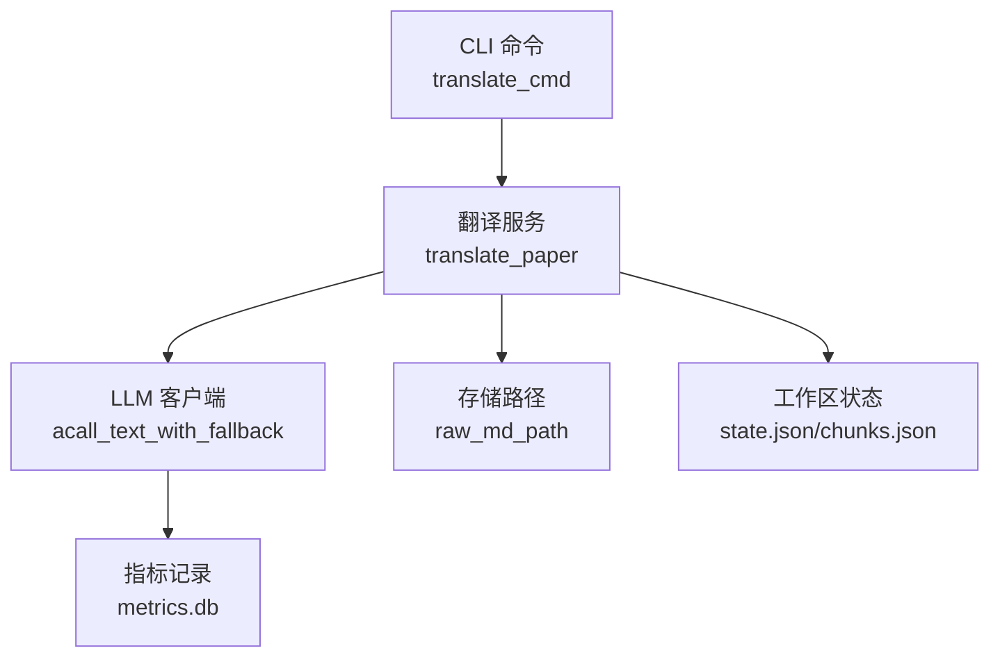
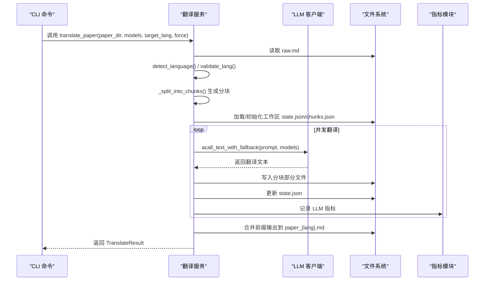
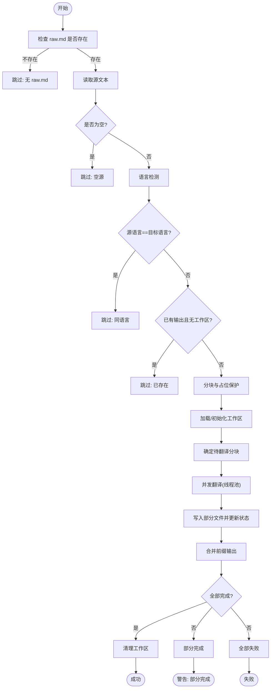
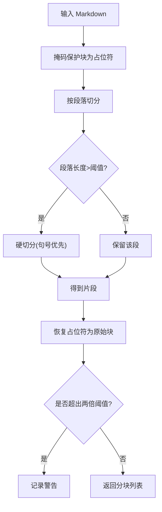
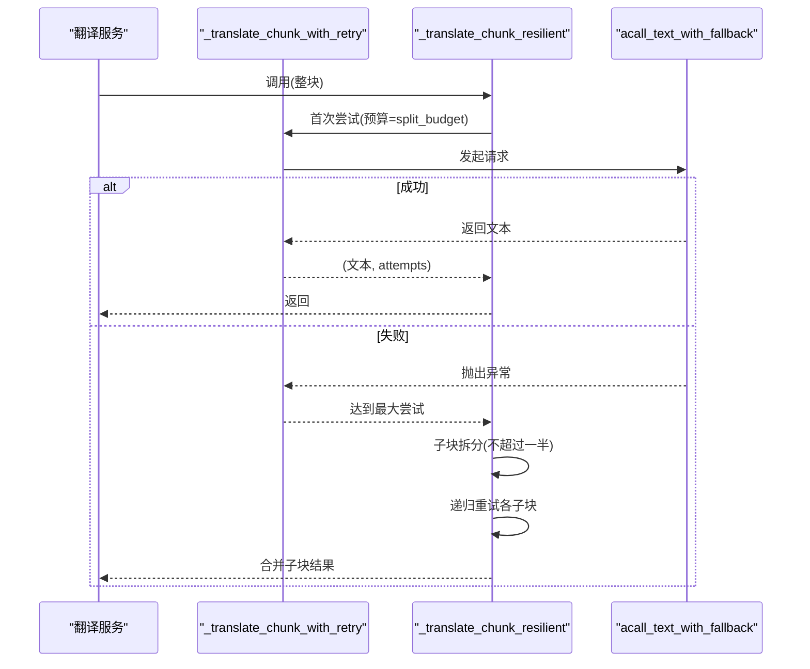
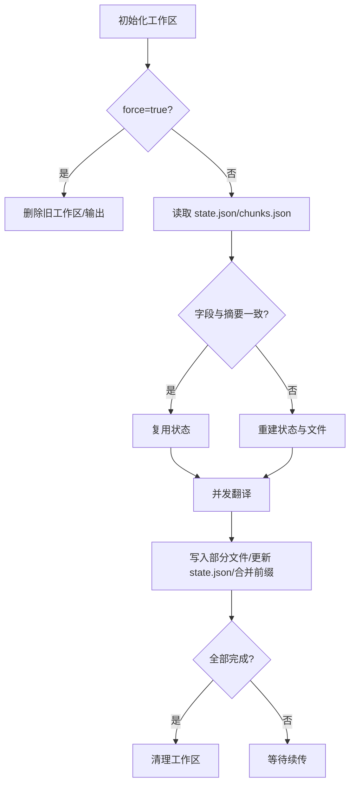
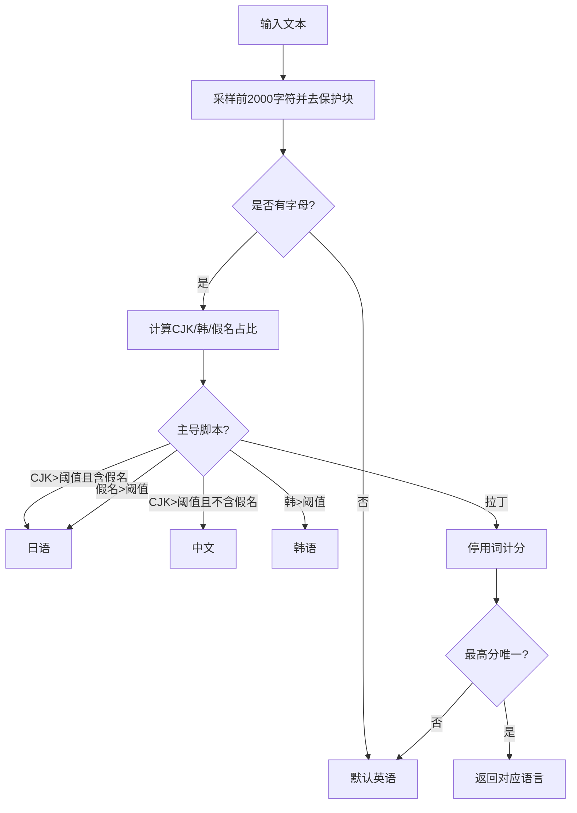
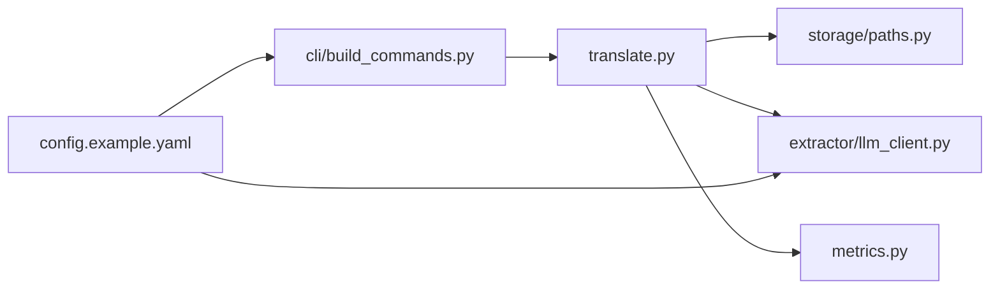

# 翻译服务

<cite>
**本文档引用的文件**
- [src/drbrain/services/translate.py](file://src/drbrain/services/translate.py)
- [src/drbrain/extractor/llm_client.py](file://src/drbrain/extractor/llm_client.py)
- [src/drbrain/storage/paths.py](file://src/drbrain/storage/paths.py)
- [src/drbrain/cli/build_commands.py](file://src/drbrain/cli/build_commands.py)
- [config.example.yaml](file://config.example.yaml)
- [skills/translate/SKILL.md](file://skills/translate/SKILL.md)
- [docs/superpowers/specs/2026-05-05-translate-ws-refactor.md](file://docs/superpowers/specs/2026-05-05-translate-ws-refactor.md)
- [tests/test_translate.py](file://tests/test_translate.py)
- [src/drbrain/metrics.py](file://src/drbrain/metrics.py)
</cite>

## 目录
1. [简介](#简介)
2. [项目结构](#项目结构)
3. [核心组件](#核心组件)
4. [架构总览](#架构总览)
5. [详细组件分析](#详细组件分析)
6. [依赖分析](#依赖分析)
7. [性能考虑](#性能考虑)
8. [故障排查指南](#故障排查指南)
9. [结论](#结论)
10. [附录](#附录)

## 简介
本文件系统性阐述 DrBrain 翻译服务模块的设计与实现，覆盖多语言翻译的端到端流程：从输入检测、分块与占位保护、并发翻译、重试与容错、工作区状态管理与断点续传，到输出整合与进度回调。文档同时给出配置参数、调用方式、质量控制策略、性能优化建议、部署与监控要点，并通过图示与测试用例路径帮助读者快速理解与验证。

## 项目结构
翻译服务位于核心服务层，围绕“论文 Markdown 文本”的翻译展开；CLI 命令负责参数解析与结果输出；LLM 客户端封装了多提供商的异步回退调用；存储路径工具提供统一的论文目录与文件定位；配置模板定义了 LLM 模型链路；技能文档提供用户使用指引；测试覆盖关键行为与边界条件；指标模块记录 LLM 使用统计。

**图表来源**
- [src/drbrain/cli/build_commands.py:16-95](file://src/drbrain/cli/build_commands.py#L16-L95)
- [src/drbrain/services/translate.py:562-725](file://src/drbrain/services/translate.py#L562-L725)
- [src/drbrain/extractor/llm_client.py:117-153](file://src/drbrain/extractor/llm_client.py#L117-L153)
- [src/drbrain/storage/paths.py:11-13](file://src/drbrain/storage/paths.py#L11-L13)
- [src/drbrain/metrics.py:74-96](file://src/drbrain/metrics.py#L74-L96)

**章节来源**
- [src/drbrain/cli/build_commands.py:16-95](file://src/drbrain/cli/build_commands.py#L16-L95)
- [src/drbrain/services/translate.py:562-725](file://src/drbrain/services/translate.py#L562-L725)
- [src/drbrain/extractor/llm_client.py:117-153](file://src/drbrain/extractor/llm_client.py#L117-L153)
- [src/drbrain/storage/paths.py:11-13](file://src/drbrain/storage/paths.py#L11-L13)
- [config.example.yaml:9-66](file://config.example.yaml#L9-L66)
- [skills/translate/SKILL.md:1-86](file://skills/translate/SKILL.md#L1-L86)

## 核心组件
- 翻译主流程：translate_paper 负责跳过逻辑、分块、工作区加载/初始化、并发执行、状态持久化、前缀输出与最终结果判定。
- 分块与占位保护：_split_into_chunks 在段落边界切分，保护代码块、行间/块间公式、图片等结构，避免被翻译破坏。
- 语言检测与校验：detect_language 基于脚本覆盖率与停用词计分启发式识别；validate_lang 规范化语言代码。
- LLM 调用：_translate_chunk 通过异步回退接口调用；_translate_chunk_with_retry 实现指数退避重试；_translate_chunk_resilient 面对超时进行子块拆分再重试。
- 工作区与断点续传：_load_or_init_translation_workspace 校验并复用历史状态；state.json 记录每个分块的状态与尝试次数；chunks.json 保存分块摘要以确保可恢复性。
- 输出整合：按成功分块前缀增量写入目标文件，支持中途退出后重启继续。
- CLI 集成：translate_cmd 解析参数、检查前置条件、调用翻译服务并格式化输出或 JSON。

**章节来源**
- [src/drbrain/services/translate.py:562-725](file://src/drbrain/services/translate.py#L562-L725)
- [src/drbrain/services/translate.py:403-469](file://src/drbrain/services/translate.py#L403-L469)
- [src/drbrain/services/translate.py:95-142](file://src/drbrain/services/translate.py#L95-L142)
- [src/drbrain/services/translate.py:145-162](file://src/drbrain/services/translate.py#L145-L162)
- [src/drbrain/services/translate.py:472-483](file://src/drbrain/services/translate.py#L472-L483)
- [src/drbrain/services/translate.py:486-504](file://src/drbrain/services/translate.py#L486-L504)
- [src/drbrain/services/translate.py:522-560](file://src/drbrain/services/translate.py#L522-L560)
- [src/drbrain/services/translate.py:253-308](file://src/drbrain/services/translate.py#L253-L308)
- [src/drbrain/services/translate.py:311-333](file://src/drbrain/services/translate.py#L311-L333)
- [src/drbrain/cli/build_commands.py:16-95](file://src/drbrain/cli/build_commands.py#L16-L95)

## 架构总览
翻译服务采用“分块 + 占位保护 + 并发 + 断点续传 + 指标记录”的整体架构。输入 raw.md 经语言检测与分块，随后并发调用 LLM 进行翻译，期间通过工作区状态文件保障可恢复性；翻译结果按序写入部分文件，周期性合并为最终输出；LLM 调用耗时与用量被记录到指标数据库。

**图表来源**
- [src/drbrain/cli/build_commands.py:16-95](file://src/drbrain/cli/build_commands.py#L16-L95)
- [src/drbrain/services/translate.py:562-725](file://src/drbrain/services/translate.py#L562-L725)
- [src/drbrain/extractor/llm_client.py:117-153](file://src/drbrain/extractor/llm_client.py#L117-L153)
- [src/drbrain/metrics.py:74-96](file://src/drbrain/metrics.py#L74-L96)

## 详细组件分析

### 翻译主流程与跳过逻辑
- 跳过原因：无 raw.md、源内容为空、源语言与目标语言相同、已有完整输出且无需续传。
- 工作区：若存在 force，则删除旧工作区与输出；否则校验语言、摘要、分块数量与每块摘要，一致则复用。
- 并发：ThreadPoolExecutor 控制并发度，默认 3；完成即写入部分文件并更新状态与前缀输出。
- 结果：全部成功清理工作区；部分成功保留工作区以便后续续传；全失败返回特定跳过原因。

**图表来源**
- [src/drbrain/services/translate.py:562-725](file://src/drbrain/services/translate.py#L562-L725)

**章节来源**
- [src/drbrain/services/translate.py:562-725](file://src/drbrain/services/translate.py#L562-L725)
- [tests/test_translate.py:266-447](file://tests/test_translate.py#L266-L447)

### 分块与占位保护算法
- 段落边界切分：过滤空白段，按段落拼接，超过阈值则切分。
- 占位保护：先用正则替换代码块、行间/块间公式、图片等为占位符，再切分，最后恢复。
- 硬切分：当单段过大时，优先句号分割，否则硬切；切分点避开占位符范围。
- 恢复膨胀告警：若恢复后超出两倍阈值，记录警告。

**图表来源**
- [src/drbrain/services/translate.py:403-469](file://src/drbrain/services/translate.py#L403-L469)

**章节来源**
- [src/drbrain/services/translate.py:403-469](file://src/drbrain/services/translate.py#L403-L469)
- [tests/test_translate.py:31-232](file://tests/test_translate.py#L31-L232)

### LLM 调用与重试容错
- 异步回退：acall_text_with_fallback 按配置顺序尝试多个模型，返回纯文本。
- 单分块重试：指数退避最多 5 次，每次等待 1·2^(attempt-1) 秒。
- 超时容错：若整块超时，按不超过自身长度的一半进行子块拆分，递归重试直至成功或不可再分。
- 提示构建：根据目标语言生成提示，强调保留格式、公式、代码与图片。

**图表来源**
- [src/drbrain/services/translate.py:472-560](file://src/drbrain/services/translate.py#L472-L560)
- [src/drbrain/extractor/llm_client.py:117-153](file://src/drbrain/extractor/llm_client.py#L117-L153)

**章节来源**
- [src/drbrain/services/translate.py:472-560](file://src/drbrain/services/translate.py#L472-L560)
- [src/drbrain/extractor/llm_client.py:117-153](file://src/drbrain/extractor/llm_client.py#L117-L153)
- [tests/test_translate.py:574-789](file://tests/test_translate.py#L574-L789)

### 工作区状态与断点续传
- 状态文件：state.json 记录目标语言、源摘要、分块大小、总数、每个分块状态与尝试次数、更新时间。
- 分块摘要：chunks.json 记录每个分块的摘要，用于续传一致性校验。
- 初始化策略：force 删除旧工作区；否则校验字段与摘要，一致则复用，否则重建。
- 前缀输出：每次完成一个分块即写入部分文件并合并前缀到最终输出，便于中断后续传。

**图表来源**
- [src/drbrain/services/translate.py:253-333](file://src/drbrain/services/translate.py#L253-L333)

**章节来源**
- [src/drbrain/services/translate.py:208-251](file://src/drbrain/services/translate.py#L208-L251)
- [src/drbrain/services/translate.py:253-333](file://src/drbrain/services/translate.py#L253-L333)
- [tests/test_translate.py:357-423](file://tests/test_translate.py#L357-L423)

### 语言检测与校验
- detect_language：采样首 2000 字，剔除保护块后基于 CJK/韩/假名占比与拉丁语停用词计分判断；无字母字符默认英语。
- validate_lang：正则校验 [a-z]{2,5}，去除空白并转小写。

**图表来源**
- [src/drbrain/services/translate.py:95-142](file://src/drbrain/services/translate.py#L95-L142)

**章节来源**
- [src/drbrain/services/translate.py:95-142](file://src/drbrain/services/translate.py#L95-L142)
- [tests/test_translate.py:454-533](file://tests/test_translate.py#L454-L533)

### CLI 集成与调用方式
- 命令：drbrain translate <id> [--lang zh|en|ja] [--force] [--json]
- 行为：校验论文存在、raw.md 存在、LLM 配置有效；调用翻译服务；输出人类可读或 JSON 结果。
- 示例：见技能文档与 CLI 参考表格。

**章节来源**
- [src/drbrain/cli/build_commands.py:16-95](file://src/drbrain/cli/build_commands.py#L16-L95)
- [skills/translate/SKILL.md:28-86](file://skills/translate/SKILL.md#L28-L86)

## 依赖分析
- 服务层依赖：翻译服务依赖存储路径工具定位 raw.md；依赖 LLM 客户端进行异步回退调用；依赖指标模块记录 LLM 使用情况。
- 配置依赖：LLM 模型链路由配置文件提供，支持多提供商与回退顺序。
- 测试依赖：单元测试覆盖分块、语言检测、重试与容错、断点续传等关键路径。

**图表来源**
- [src/drbrain/services/translate.py:16-16](file://src/drbrain/services/translate.py#L16-L16)
- [src/drbrain/storage/paths.py:11-13](file://src/drbrain/storage/paths.py#L11-L13)
- [src/drbrain/extractor/llm_client.py:117-153](file://src/drbrain/extractor/llm_client.py#L117-L153)
- [src/drbrain/metrics.py:74-96](file://src/drbrain/metrics.py#L74-L96)
- [src/drbrain/cli/build_commands.py:16-95](file://src/drbrain/cli/build_commands.py#L16-L95)
- [config.example.yaml:9-66](file://config.example.yaml#L9-L66)

**章节来源**
- [src/drbrain/services/translate.py:16-16](file://src/drbrain/services/translate.py#L16-L16)
- [src/drbrain/extractor/llm_client.py:117-153](file://src/drbrain/extractor/llm_client.py#L117-L153)
- [src/drbrain/storage/paths.py:11-13](file://src/drbrain/storage/paths.py#L11-L13)
- [src/drbrain/metrics.py:74-96](file://src/drbrain/metrics.py#L74-L96)
- [src/drbrain/cli/build_commands.py:16-95](file://src/drbrain/cli/build_commands.py#L16-L95)
- [config.example.yaml:9-66](file://config.example.yaml#L9-L66)

## 性能考虑
- 分块大小：默认 3000 字符，兼顾上下文与 LLM 上限；大保护块可能导致恢复后略超阈值，属预期。
- 并发度：默认 3 个线程；可根据 CPU/IO 与 LLM 速率调整，避免过度竞争。
- 重试策略：指数退避减少瞬时拥塞；超时自动子块拆分，降低长文本失败概率。
- I/O 原子写：state.json 与 chunks.json 采用临时文件 + 原子重命名，提升可靠性。
- 指标记录：LLM 调用耗时与令牌用量写入 SQLite，支持后续成本与性能分析。

[本节为通用指导，无需具体文件分析]

## 故障排查指南
- 无 raw.md 或空源：检查论文是否已成功解析；确认 raw.md 存在且非空。
- 同语言翻译：源语言与目标语言相同会直接跳过。
- 输出已存在但无工作区：如需强制重翻，请使用 --force。
- 全部分块失败：检查 LLM 配置与网络连通性；查看日志中“Translation failed”信息。
- 部分完成：服务会保留工作区，再次运行即可续传。
- 语言检测异常：确保文本包含可识别的字母与停用词；CJK/韩/假名占比过低时可能误判为英语。

**章节来源**
- [src/drbrain/services/translate.py:562-725](file://src/drbrain/services/translate.py#L562-L725)
- [tests/test_translate.py:266-447](file://tests/test_translate.py#L266-L447)

## 结论
DrBrain 翻译服务通过“占位保护分块 + 并发 + 断点续传 + 指标记录”的设计，实现了对学术论文 Markdown 的高质量、可恢复翻译。其特性包括：强健的语言检测、严格的格式保护、指数退避与超时子块拆分的容错策略、工作区状态的原子化持久化，以及清晰的 CLI 与测试覆盖。结合配置模板与监控指标，可在生产环境中稳定运行并持续优化。

[本节为总结，无需具体文件分析]

## 附录

### 配置参数与示例
- LLM 模型链：支持多提供商与回退顺序；示例配置包含 OpenAI、Anthropic、DeepSeek、Zhipu、Bailian、MiniMax、Moonshot、Ollama、vLLM 等。
- MinerU 解析器：PDF 到 Markdown 的抽取配置（公式、表格、OCR 等）。
- 数据目录：papers、cache、logs 等路径。
- 外部 API：Crossref、OpenAlex、DeepXiv 等的访问凭据与速率限制。
- 搜索与提取：BM25 参数、并发提取上限。
- 嵌入：本地或 OpenAI 兼容模式的嵌入配置。

**章节来源**
- [config.example.yaml:9-145](file://config.example.yaml#L9-L145)

### 调用方式与示例
- CLI：drbrain translate <id> --lang zh --force --json
- 技能文档：提供常见模式与参考命令表。

**章节来源**
- [skills/translate/SKILL.md:28-86](file://skills/translate/SKILL.md#L28-L86)
- [src/drbrain/cli/build_commands.py:16-95](file://src/drbrain/cli/build_commands.py#L16-L95)

### 质量控制与测试用例
- 分块与占位保护：覆盖短文本、多保护块、硬切分、顺序保持、占位符完整性等。
- 语言检测：英文、中文、日语、韩语、德语、法语、西班牙语与数学/代码块剔除场景。
- 重试与容错：单次成功、多次重试、指数退避延迟、超时子块拆分与递归拆分。
- 断点续传：首次部分成功、二次续传全部完成、工作区清理。
- 跳过逻辑：无 raw.md、空源、同语言、已存在输出。

**章节来源**
- [tests/test_translate.py:31-789](file://tests/test_translate.py#L31-L789)

### 监控与指标
- 指标存储：SQLite WAL 模式，记录 LLM 调用耗时、令牌用量、会话标识。
- 记录位置：LLM 回退调用成功后调用指标记录函数；翻译服务在并发循环中周期性更新状态与前缀输出。

**章节来源**
- [src/drbrain/metrics.py:74-96](file://src/drbrain/metrics.py#L74-L96)
- [src/drbrain/extractor/llm_client.py:46-63](file://src/drbrain/extractor/llm_client.py#L46-L63)
- [src/drbrain/services/translate.py:683-688](file://src/drbrain/services/translate.py#L683-L688)