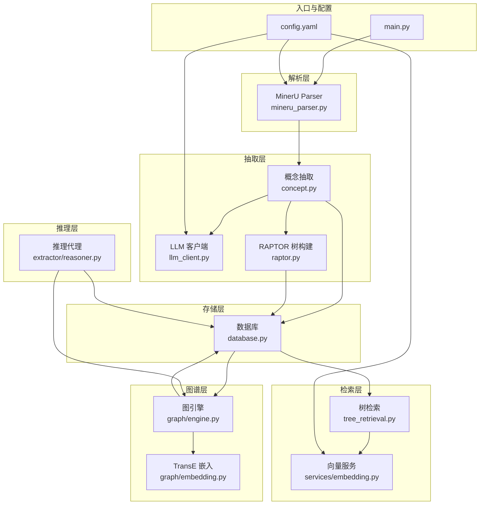
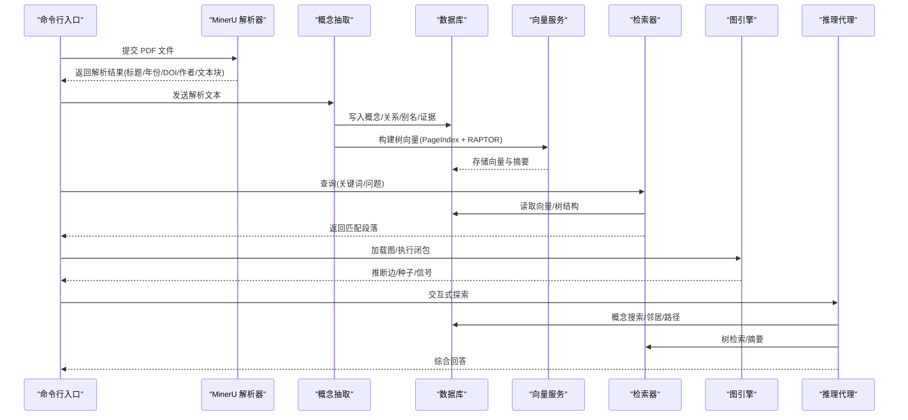
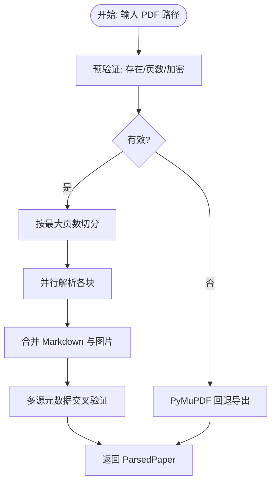
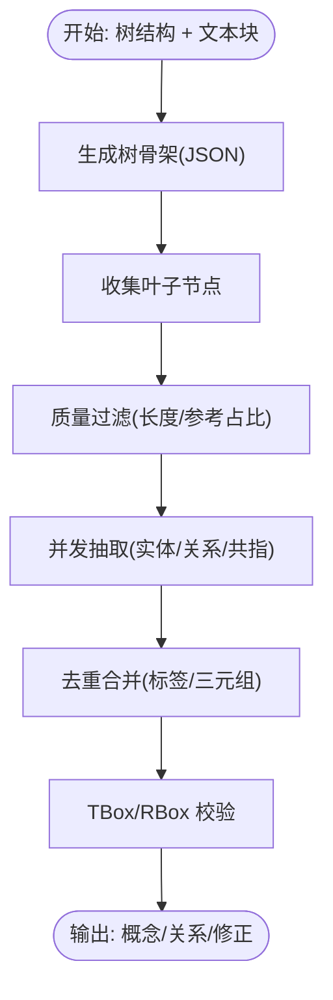
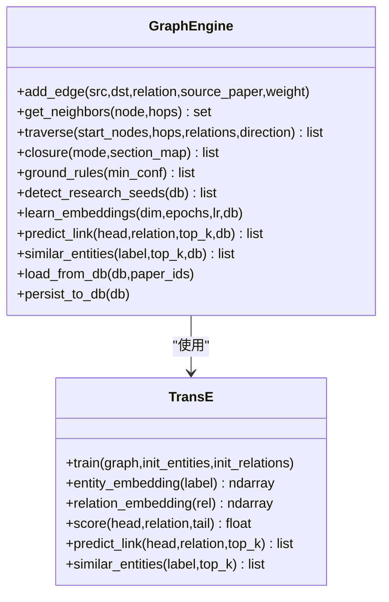
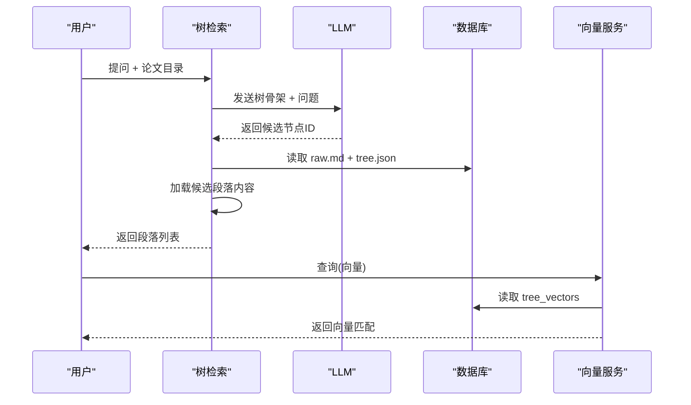
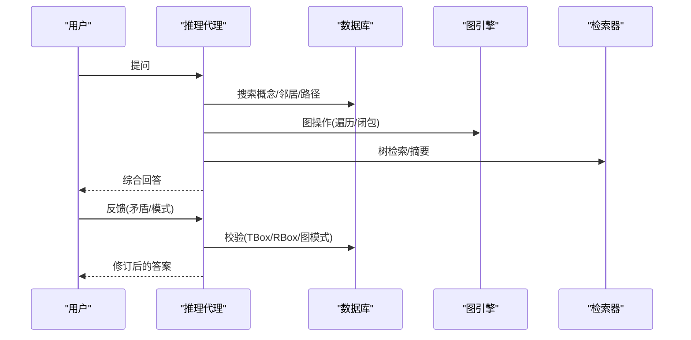
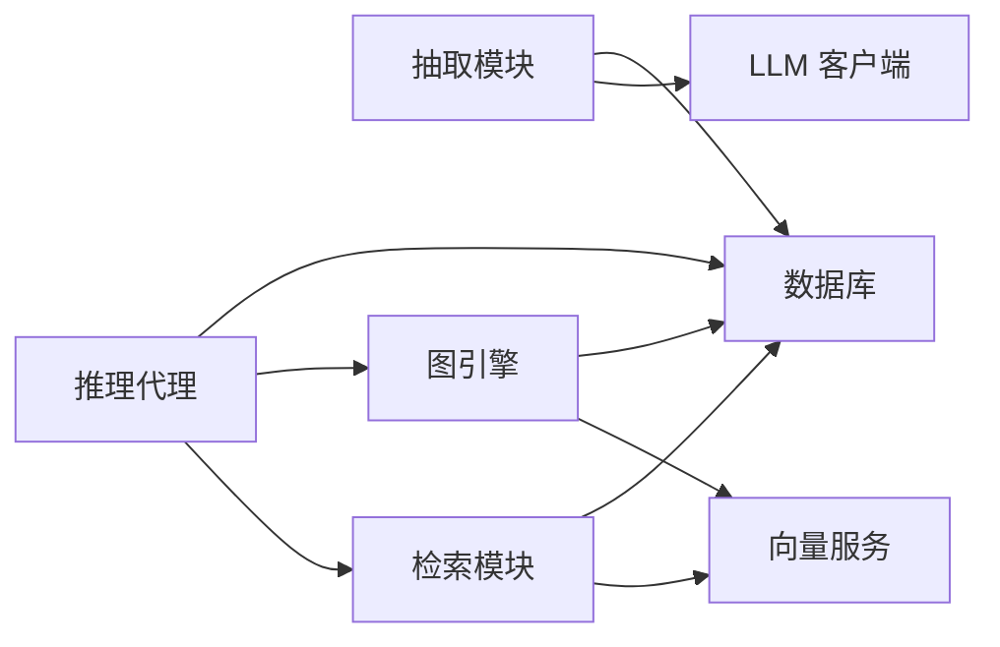

# 核心模块详解

<cite>
**本文档引用的文件**
- [README.md](file://README.md)
- [config.yaml](file://config.yaml)
- [main.py](file://main.py)
- [src/drbrain/__init__.py](file://src/drbrain/__init__.py)
- [src/drbrain/parser/mineru_parser.py](file://src/drbrain/parser/mineru_parser.py)
- [src/drbrain/extractor/concept.py](file://src/drbrain/extractor/concept.py)
- [src/drbrain/extractor/llm_client.py](file://src/drbrain/extractor/llm_client.py)
- [src/drbrain/extractor/raptor.py](file://src/drbrain/extractor/raptor.py)
- [src/drbrain/graph/engine.py](file://src/drbrain/graph/engine.py)
- [src/drbrain/graph/embedding.py](file://src/drbrain/graph/embedding.py)
- [src/drbrain/query/tree_retrieval.py](file://src/drbrain/query/tree_retrieval.py)
- [src/drbrain/services/embedding.py](file://src/drbrain/services/embedding.py)
- [src/drbrain/storage/database.py](file://src/drbrain/storage/database.py)
- [src/drbrain/extractor/reasoner.py](file://src/drbrain/extractor/reasoner.py)
</cite>

## 目录
1. [简介](#简介)
2. [项目结构](#项目结构)
3. [核心组件](#核心组件)
4. [架构总览](#架构总览)
5. [详细组件分析](#详细组件分析)
6. [依赖关系分析](#依赖关系分析)
7. [性能考虑](#性能考虑)
8. [故障排除指南](#故障排除指南)
9. [结论](#结论)
10. [附录](#附录)

## 简介
本文件面向 DrBrain 的核心模块，系统性阐述 PDF 处理模块、知识抽取模块、知识图谱模块、检索系统模块与推理引擎模块的设计与实现，覆盖数据流、处理逻辑、接口与配置项，并提供调用关系图与常见问题排查建议。目标是让初学者快速上手，同时为有经验的开发者提供足够的技术深度。

## 项目结构
DrBrain 采用分层模块化组织：解析层（PDF 解析与元数据校验）、抽取层（概念/实体/关系抽取与迭代精炼）、存储层（SQLite 模式与迁移）、检索层（BM25 + 结构化树检索 + 向量检索）、图谱层（规则闭包与嵌入）、推理层（工具调用 Agent）与服务层（向量化、嵌入模型加载与批处理）。

**图表来源**
- [main.py:1-6](file://main.py#L1-L6)
- [config.yaml:1-72](file://config.yaml#L1-L72)
- [src/drbrain/parser/mineru_parser.py:1-932](file://src/drbrain/parser/mineru_parser.py#L1-L932)
- [src/drbrain/extractor/concept.py:1-901](file://src/drbrain/extractor/concept.py#L1-L901)
- [src/drbrain/extractor/llm_client.py:1-154](file://src/drbrain/extractor/llm_client.py#L1-L154)
- [src/drbrain/extractor/raptor.py:1-349](file://src/drbrain/extractor/raptor.py#L1-L349)
- [src/drbrain/storage/database.py:1-775](file://src/drbrain/storage/database.py#L1-L775)
- [src/drbrain/query/tree_retrieval.py:1-876](file://src/drbrain/query/tree_retrieval.py#L1-L876)
- [src/drbrain/services/embedding.py:1-786](file://src/drbrain/services/embedding.py#L1-L786)
- [src/drbrain/graph/engine.py:1-1118](file://src/drbrain/graph/engine.py#L1-L1118)
- [src/drbrain/graph/embedding.py:1-117](file://src/drbrain/graph/embedding.py#L1-L117)
- [src/drbrain/extractor/reasoner.py:1-677](file://src/drbrain/extractor/reasoner.py#L1-L677)

**章节来源**
- [README.md:1-112](file://README.md#L1-L112)
- [config.yaml:1-72](file://config.yaml#L1-L72)
- [src/drbrain/__init__.py:1-2](file://src/drbrain/__init__.py#L1-L2)

## 核心组件
- PDF 处理模块：MinerU CLI 驱动 + PyMuPDF 回退；PDF 预验证（加密/页数）；多源元数据交叉验证（arXiv/CrossRef/OpenAlex/Semantic Scholar/DeepXiv）；分块合并与图片提取。
- 知识抽取模块：基于 PageIndex 的树结构优先抽取；分阶段抽取（本体扩展、实体、关系、共指消解、迭代精炼）；并发控制与置信度加权；TBox/RBox 校验。
- 知识图谱模块：NetworkX 图 + 规则闭包（8 条推理规则 + 路径规则 + 传递闭包）；TransE 嵌入学习与链接预测；研究前沿检测（种子发现）。
- 检索系统模块：BM25 关键词检索；结构化树检索（PageIndex 迭代导航）；跨论文折叠树检索（向量 + BM25 融合）；RAPTOR 分层树遍历检索。
- 推理引擎模块：LLM 工具调用 Agent；图探索工具（邻居、路径、树结构、小节内容、RAPTOR 摘要）；双向一致性校验（TBox/RBox + 图模式）。

**章节来源**
- [src/drbrain/parser/mineru_parser.py:1-932](file://src/drbrain/parser/mineru_parser.py#L1-L932)
- [src/drbrain/extractor/concept.py:1-901](file://src/drbrain/extractor/concept.py#L1-L901)
- [src/drbrain/graph/engine.py:1-1118](file://src/drbrain/graph/engine.py#L1-L1118)
- [src/drbrain/query/tree_retrieval.py:1-876](file://src/drbrain/query/tree_retrieval.py#L1-L876)
- [src/drbrain/extractor/reasoner.py:1-677](file://src/drbrain/extractor/reasoner.py#L1-L677)

## 架构总览
DrBrain 的核心流程从 PDF 解析开始，经由知识抽取生成概念与关系，写入数据库后构建向量索引，支持结构化树检索与跨论文折叠检索，最终在知识图谱上执行符号驱动的规则闭包与推理，并通过推理代理进行交互式探索。

**图表来源**
- [src/drbrain/parser/mineru_parser.py:1-932](file://src/drbrain/parser/mineru_parser.py#L1-L932)
- [src/drbrain/extractor/concept.py:1-901](file://src/drbrain/extractor/concept.py#L1-L901)
- [src/drbrain/storage/database.py:1-775](file://src/drbrain/storage/database.py#L1-L775)
- [src/drbrain/services/embedding.py:1-786](file://src/drbrain/services/embedding.py#L1-L786)
- [src/drbrain/query/tree_retrieval.py:1-876](file://src/drbrain/query/tree_retrieval.py#L1-L876)
- [src/drbrain/graph/engine.py:1-1118](file://src/drbrain/graph/engine.py#L1-L1118)
- [src/drbrain/extractor/reasoner.py:1-677](file://src/drbrain/extractor/reasoner.py#L1-L677)

## 详细组件分析

### PDF 处理模块（MinerU Parser）
- 功能要点
  - PDF 预验证：存在性、页数、加密状态检查。
  - MinerU CLI 调用与回退：PyMuPDF 文本/Markdown 导出；公式/表格可选；OCR 可选。
  - 元数据提取与多源交叉验证：arXiv/CrossRef/OpenAlex/Semantic Scholar/DeepXiv；标题/年份/DOI/期刊/引用计数一致性校验。
  - 分块处理与合并：超长 PDF 自动切分为若干块，逐块解析后合并 Markdown 与图片目录。
  - 标题/年份/ID 提取：正则匹配与启发式规则。
- 关键接口与返回
  - MinerUParser.extract(pdf_path, max_pages) → ParsedPaper
  - ParsedPaper 字段：title/year/doi/arxiv/s2_id/openalex_id/journal/publisher/citation_count/authors/text_blocks/raw_md/images_dir
- 配置项
  - mineru.token/model/is_ocr/enable_formula/enable_table/max_pages
  - api.deepxiv_token/s2_rate_limit/s2_api_key/crossref_email/openalex_token
- 使用模式
  - 单文件解析：直接调用 extract。
  - 批量长文档：自动分块 → 并行解析 → 合并输出。
- 错误处理
  - 验证失败（加密/空页）直接回退到 PyMuPDF。
  - MinerU CLI 不可用或超时，记录警告并回退。
- 性能与复杂度
  - 预验证 O(1)；分块切分 O(total_pages)；Mermaid 解析 O(n)；合并 O(n_chunks)。

**图表来源**
- [src/drbrain/parser/mineru_parser.py:1-932](file://src/drbrain/parser/mineru_parser.py#L1-L932)
- [config.yaml:14-39](file://config.yaml#L14-L39)

**章节来源**
- [src/drbrain/parser/mineru_parser.py:1-932](file://src/drbrain/parser/mineru_parser.py#L1-L932)
- [config.yaml:14-39](file://config.yaml#L14-L39)

### 知识抽取模块（Concept Extraction）
- 功能要点
  - 结构化抽取：基于 PageIndex 树骨架，先结构后内容，减少上下文开销。
  - 分阶段抽取：本体扩展（Section Hierarchy → 类型子类）→ 实体抽取（Section Hint 偏置）→ 关系抽取（继承 provenance）→ 共指消解（合并变体）→ 迭代精炼（Refine Prompt）。
  - 并发控制：Semaphore 控制每轮并发数量；质量过滤（参考列表占比/字母比例）。
  - TBox/RBox 校验：类型合法性检查与反身关系检测；跨节论证链接（挑战/支持）。
  - 置信度加权：基于树位置（深/浅）与 LLM 置信度融合。
- 关键接口与返回
  - extract_concepts_from_tree(md_path, structure, models, max_concurrent) → ExtractedConcepts
  - build_graph_from_tree(...) → {"concepts","relations","merges","corrections"}
  - validate_extraction(concepts) → 错误列表
- 配置项
  - extract.max_concurrent
  - llm.models（多模型回退链）
- 使用模式
  - 树优先：先获取树骨架，再按叶子节点并发抽取。
  - 迭代精炼：根据关系与实体分布，二次调用 refine 阶段。
- 性能与复杂度
  - 叶子节点收集 O(n)；每节点抽取 O(1) JSON 解析；关系抽取 O(k)（k 为实体数）；去重 O(n log n)。

**图表来源**
- [src/drbrain/extractor/concept.py:1-901](file://src/drbrain/extractor/concept.py#L1-L901)
- [src/drbrain/extractor/llm_client.py:1-154](file://src/drbrain/extractor/llm_client.py#L1-L154)
- [config.yaml:45-46](file://config.yaml#L45-L46)

**章节来源**
- [src/drbrain/extractor/concept.py:1-901](file://src/drbrain/extractor/concept.py#L1-L901)
- [src/drbrain/extractor/llm_client.py:1-154](file://src/drbrain/extractor/llm_client.py#L1-L154)
- [config.yaml:45-46](file://config.yaml#L45-L46)

### 知识图谱模块（Graph Engine）
- 功能要点
  - 图结构：NetworkX MultiDiGraph；边含 relation/source_paper/weight/node_id/section。
  - 邻域查询：N 跳邻域；遍历 BFS 支持方向与关系过滤。
  - 规则闭包：8 条符号推理规则（争议/缺口解决/演化/网络/传递闭包/路径规则）；可混合 TransE 得分。
  - 研究前沿检测：停滞问题/未解决缺口/争议区/技术悬崖/跨域同构/置信度坍缩。
  - 嵌入学习：TransE 训练与相似度预测；增量加载/持久化。
- 关键接口与返回
  - add_edge(src,dst,relation,source_paper,weight)
  - traverse(start_nodes,hops,relations,direction) → TraverseResult 列表
  - closure(mode="symbolic"/"hybrid") → 推断边列表
  - ground_rules(min_confidence) → 路径规则落地
  - detect_research_seeds(db?) → 种子列表
  - learn_embeddings(dim,epochs,lr,db?)
  - predict_link/head/similar_entities(label,top_k,db?)
- 配置项
  - embed.provider/model/device/top_k/batch_size 等（用于 TransE 向量）
- 使用模式
  - 符号驱动：仅规则闭包；混合驱动：叠加 TransE 得分。
  - 与数据库联动：加载/持久化边；利用时间维度检测演进信号。
- 性能与复杂度
  - 闭包扫描 O(E)；TransE 训练 O(E·D·T)；相似度查询 O(V·D)。

**图表来源**
- [src/drbrain/graph/engine.py:1-1118](file://src/drbrain/graph/engine.py#L1-L1118)
- [src/drbrain/graph/embedding.py:1-117](file://src/drbrain/graph/embedding.py#L1-L117)

**章节来源**
- [src/drbrain/graph/engine.py:1-1118](file://src/drbrain/graph/engine.py#L1-L1118)
- [src/drbrain/graph/embedding.py:1-117](file://src/drbrain/graph/embedding.py#L1-L117)

### 检索系统模块（Tree Retrieval + Vector）
- 功能要点
  - 结构化树检索：PageIndex 迭代导航（顶层 → 扩展 → 叶子），LLM 选择候选，按需加载内容。
  - 跨论文折叠树检索：向量相似度 + BM25 融合；支持 RAPTOR 分层遍历（根层 → 子层 → 叶层）。
  - 向量服务：SentenceTransformers 模型加载/缓存；OpenAI 兼容 API；GPU 内存自适应批大小；增量更新检测。
  - RAPTOR：UMAP 降维 + GMM+BIC 自动聚类 + LLM 摘要 + 递归嵌入。
- 关键接口与返回
  - query_by_structure(question,paper_dir,models,max_rounds,per_round) → 段落列表
  - query_cross_paper(query,db_path,top_k,cfg,paper_ids) → {node_id,paper_id,score,tree_layer} 列表
  - tree_traversal_search(query,db_path,top_k,min_results,cfg) → 同上
  - build_tree_vectors(db_path,paper_dir,cfg) → 写入向量数
  - build_raptor_tree(paper_dir,db_path,embed_cfg,models,max_layers) → 摘要数
- 配置项
  - bm25.k1/b
  - embed.provider/model/device/top_k/batch_size/source/cache_dir/api_base/api_key
- 使用模式
  - LLM 主导：先树检索，再向量预筛；无向量时纯 LLM 导航。
  - 跨论文检索：collapsed tree + 层序遍历 + fallback。
- 性能与复杂度
  - 向量相似度 O(N·D)；GPU 自适应批大小减少显存峰值；RAPTOR 递归 O(L·K·N·D)。

**图表来源**
- [src/drbrain/query/tree_retrieval.py:1-876](file://src/drbrain/query/tree_retrieval.py#L1-L876)
- [src/drbrain/services/embedding.py:1-786](file://src/drbrain/services/embedding.py#L1-L786)

**章节来源**
- [src/drbrain/query/tree_retrieval.py:1-876](file://src/drbrain/query/tree_retrieval.py#L1-L876)
- [src/drbrain/services/embedding.py:1-786](file://src/drbrain/services/embedding.py#L1-L786)
- [config.yaml:41-43](file://config.yaml#L41-L43)
- [config.yaml:61-72](file://config.yaml#L61-L72)

### 推理引擎模块（Reasoner Agent）
- 功能要点
  - 工具定义：概念搜索、邻居查询、最短路径、树结构、小节内容、跨论文树检索、RAPTOR 摘要。
  - 双向一致性校验：Hypothesis → KG 校验（TBox/RBox + 图模式）→ 反馈修订 → 迭代收敛。
  - LLM 调用：多模型回退链；记录 token 使用；禁用思维模式。
- 关键接口与返回
  - tool_definitions() → 工具清单
  - reason(question,max_turns) → 文本回答
  - reason_bidirectional(question,max_rounds) → {"answer","rounds","hypotheses","kg_validations"}
  - _kg_validate(hypothesis) → {"consistent","violations","patterns"}
- 配置项
  - llm.models（多模型回退链）
- 使用模式
  - 交互式探索：Agent 逐步调用工具，结合图与树信息回答复杂问题。
  - 双向推理：在约束下生成并验证假设，直至一致或达到轮次上限。

**图表来源**
- [src/drbrain/extractor/reasoner.py:1-677](file://src/drbrain/extractor/reasoner.py#L1-L677)
- [src/drbrain/graph/engine.py:1-1118](file://src/drbrain/graph/engine.py#L1-L1118)
- [src/drbrain/query/tree_retrieval.py:1-876](file://src/drbrain/query/tree_retrieval.py#L1-L876)

**章节来源**
- [src/drbrain/extractor/reasoner.py:1-677](file://src/drbrain/extractor/reasoner.py#L1-L677)

## 依赖关系分析
- 组件耦合
  - 抽取模块依赖 LLM 客户端与提示模板；与数据库进行插入。
  - 检索模块依赖向量服务与数据库；与抽取模块共享树结构。
  - 图谱模块依赖数据库加载/持久化；与检索模块共享嵌入。
  - 推理模块依赖数据库、图谱与检索模块。
- 外部依赖
  - LLM：litellm（多提供商统一接口）
  - 向量：SentenceTransformers、ModelScope/HuggingFace 下载、OpenAI 兼容 API
  - 图计算：NetworkX
  - 数据库：SQLite（WAL 模式）
- 循环依赖
  - 无直接循环；模块间通过数据库与服务接口松耦合。

**图表来源**
- [src/drbrain/extractor/concept.py:1-901](file://src/drbrain/extractor/concept.py#L1-L901)
- [src/drbrain/extractor/llm_client.py:1-154](file://src/drbrain/extractor/llm_client.py#L1-L154)
- [src/drbrain/storage/database.py:1-775](file://src/drbrain/storage/database.py#L1-L775)
- [src/drbrain/query/tree_retrieval.py:1-876](file://src/drbrain/query/tree_retrieval.py#L1-L876)
- [src/drbrain/services/embedding.py:1-786](file://src/drbrain/services/embedding.py#L1-L786)
- [src/drbrain/graph/engine.py:1-1118](file://src/drbrain/graph/engine.py#L1-L1118)
- [src/drbrain/extractor/reasoner.py:1-677](file://src/drbrain/extractor/reasoner.py#L1-L677)

**章节来源**
- [src/drbrain/storage/database.py:1-775](file://src/drbrain/storage/database.py#L1-L775)

## 性能考虑
- 解析层
  - 预验证避免无效调用；分块并行提升吞吐；Mermaid 合并 O(n_chunks)。
- 抽取层
  - 叶子节点并发；质量过滤减少无效请求；Section Hint 降低无关内容。
- 检索层
  - 结构化树检索减少上下文；向量服务 GPU 自适应批大小；跨论文检索分层遍历。
- 图谱层
  - 闭包扫描线性于边数；TransE 训练可增量；相似度查询可缓存。
- 推理层
  - 工具调用限制轮次；KG 校验避免无效路径。

[本节为通用指导，无需特定文件引用]

## 故障排除指南
- PDF 解析失败
  - 现象：加密/空页/CLI 不可用。
  - 处理：检查 mineru.token；启用 PyMuPDF 回退；确认文件权限。
  - 参考：[src/drbrain/parser/mineru_parser.py:28-51](file://src/drbrain/parser/mineru_parser.py#L28-L51)
- LLM 调用失败
  - 现象：超时/JSON 解析错误/所有模型耗尽。
  - 处理：增加超时/增大 max_tokens；检查 api_key/base_url；调整 models 顺序。
  - 参考：[src/drbrain/extractor/llm_client.py:66-114](file://src/drbrain/extractor/llm_client.py#L66-L114)
- 向量维度不匹配
  - 现象：存储维度与查询维度不一致。
  - 处理：重建向量或清理缓存；确保 embed.provider 一致。
  - 参考：[src/drbrain/services/embedding.py:675-708](file://src/drbrain/services/embedding.py#L675-L708)
- 图谱闭包异常
  - 现象：反身关系/类型不合法。
  - 处理：查看 detect_asymmetric_violations 输出；修正 TBox/RBox。
  - 参考：[src/drbrain/graph/engine.py:274-275](file://src/drbrain/graph/engine.py#L274-L275)
- RAPTOR 聚类不足
  - 现象：样本过少导致无法聚类。
  - 处理：增加 PageIndex 节点数；检查向量是否成功写入。
  - 参考：[src/drbrain/extractor/raptor.py:218-227](file://src/drbrain/extractor/raptor.py#L218-L227)

**章节来源**
- [src/drbrain/parser/mineru_parser.py:28-51](file://src/drbrain/parser/mineru_parser.py#L28-L51)
- [src/drbrain/extractor/llm_client.py:66-114](file://src/drbrain/extractor/llm_client.py#L66-L114)
- [src/drbrain/services/embedding.py:675-708](file://src/drbrain/services/embedding.py#L675-L708)
- [src/drbrain/graph/engine.py:274-275](file://src/drbrain/graph/engine.py#L274-L275)
- [src/drbrain/extractor/raptor.py:218-227](file://src/drbrain/extractor/raptor.py#L218-L227)

## 结论
DrBrain 的核心模块围绕“结构化树 + 轻量向量”的理念，实现了从 PDF 到知识图谱再到检索与推理的完整闭环。解析层保证高质量输入，抽取层提供高保真结构化知识，检索层兼顾语义与结构，图谱层以符号规则驱动发现，推理层以工具调用实现人机协同。通过合理的并发、缓存与批处理策略，系统在准确性和效率之间取得平衡。

[本节为总结，无需特定文件引用]

## 附录
- 配置项速查
  - llm.models：多模型回退链
  - mineru：token/model/is_ocr/enable_formula/enable_table/max_pages
  - api：deepxiv_token/s2_rate_limit/s2_api_key/crossref_email/openalex_token
  - bm25：k1/b
  - extract：max_concurrent
  - queue：weak_threshold/auto_accept
  - fetch：max_concurrent/timeout_per_fetch/user_agent/fallback_order/unpaywall_email/institutional_proxy/proxy_type
  - embed：provider/model/device/top_k/source/cache_dir/api_base/api_key/batch_size
- 常用命令
  - drbrain setup：初始化配置
  - drbrain ingest：导入 PDF
  - drbrain build：构建知识图谱
  - drbrain query：检索与问答
  - drbrain graph：图谱分析
  - drbrain reason：推理探索

**章节来源**
- [config.yaml:7-72](file://config.yaml#L7-L72)
- [README.md:24-86](file://README.md#L24-L86)