# 检索系统模块

<cite>
**本文档引用的文件**
- [bm25.py](file://src/drbrain/query/bm25.py)
- [tree_retrieval.py](file://src/drbrain/query/tree_retrieval.py)
- [query_embeddings.py](file://src/drbrain/graph/query_embeddings.py)
- [embedding.py](file://src/drbrain/services/embedding.py)
- [engine.py](file://src/drbrain/graph/engine.py)
- [database.py](file://src/drbrain/storage/database.py)
- [config.py](file://src/drbrain/config.py)
- [query_commands.py](file://src/drbrain/cli/query_commands.py)
- [pageindex_parser.py](file://src/drbrain/parser/pageindex_parser.py)
- [architecture.md](file://docs/architecture.md)
- [test_bm25.py](file://tests/test_bm25.py)
- [test_tree_retrieval.py](file://tests/test_tree_retrieval.py)
- [test_query_embeddings.py](file://tests/test_query_embeddings.py)
</cite>

## 目录
1. [简介](#简介)
2. [项目结构](#项目结构)
3. [核心组件](#核心组件)
4. [架构概览](#架构概览)
5. [详细组件分析](#详细组件分析)
6. [依赖关系分析](#依赖关系分析)
7. [性能考虑](#性能考虑)
8. [故障排除指南](#故障排除指南)
9. [结论](#结论)
10. [附录](#附录)

## 简介

DrBrain 的检索系统模块是一个多层次、混合驱动的检索引擎，结合了传统 BM25 检索、结构化树检索（PageIndex）和向量相似度搜索。该系统采用"符号驱动 + 轻量级向量"的设计理念，以知识图为权威来源，向量仅用于语义完整节点的检索增强。

系统的核心特点包括：
- **多层检索策略**：BM25 全文检索、结构化树检索、向量相似度检索
- **混合检索机制**：多种检索方式的融合与权重分配
- **知识图谱集成**：基于规则的推理和图遍历增强
- **实时更新能力**：增量构建和更新机制
- **性能优化**：自适应批处理、内存管理和缓存策略

## 项目结构

检索系统模块主要分布在以下目录中：

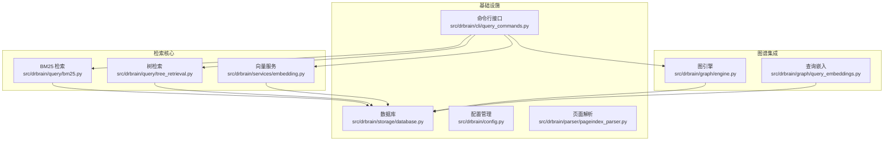

**图表来源**
- [bm25.py:1-135](file://src/drbrain/query/bm25.py#L1-L135)
- [tree_retrieval.py:1-800](file://src/drbrain/query/tree_retrieval.py#L1-L800)
- [embedding.py:1-786](file://src/drbrain/services/embedding.py#L1-L786)
- [engine.py:1-800](file://src/drbrain/graph/engine.py#L1-L800)

**章节来源**
- [bm25.py:1-135](file://src/drbrain/query/bm25.py#L1-L135)
- [tree_retrieval.py:1-800](file://src/drbrain/query/tree_retrieval.py#L1-L800)
- [embedding.py:1-786](file://src/drbrain/services/embedding.py#L1-L786)
- [engine.py:1-800](file://src/drbrain/graph/engine.py#L1-L800)
- [database.py:1-775](file://src/drbrain/storage/database.py#L1-L775)
- [config.py:1-292](file://src/drbrain/config.py#L1-L292)

## 核心组件

### BM25 检索引擎

BM25 检索是 DrBrain 的基础检索组件，提供传统的全文检索能力：

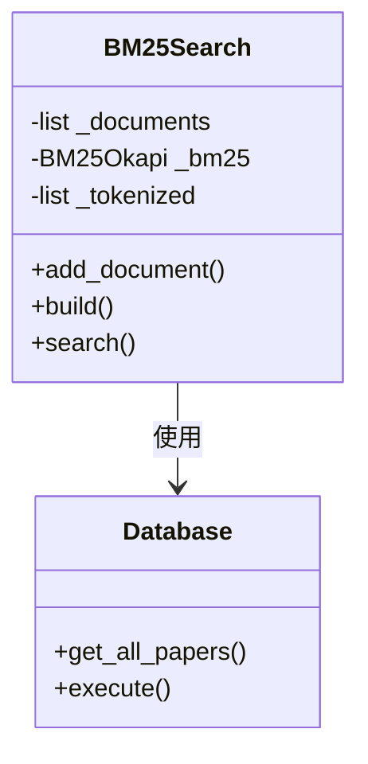

**图表来源**
- [bm25.py:17-135](file://src/drbrain/query/bm25.py#L17-L135)
- [database.py:419-446](file://src/drbrain/storage/database.py#L419-L446)

### 结构化树检索

树检索实现了 PageIndex 的层次化文档检索机制：

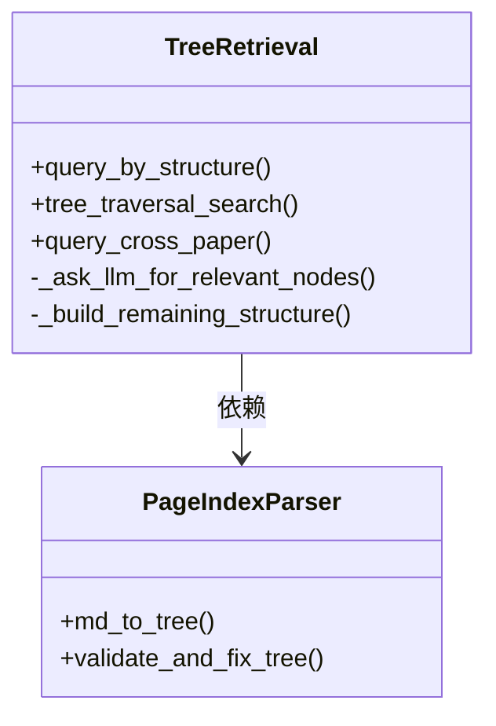

**图表来源**
- [tree_retrieval.py:215-800](file://src/drbrain/query/tree_retrieval.py#L215-L800)
- [pageindex_parser.py:412-486](file://src/drbrain/parser/pageindex_parser.py#L412-L486)

### 向量相似度检索

向量检索提供了基于语义的相似度匹配：

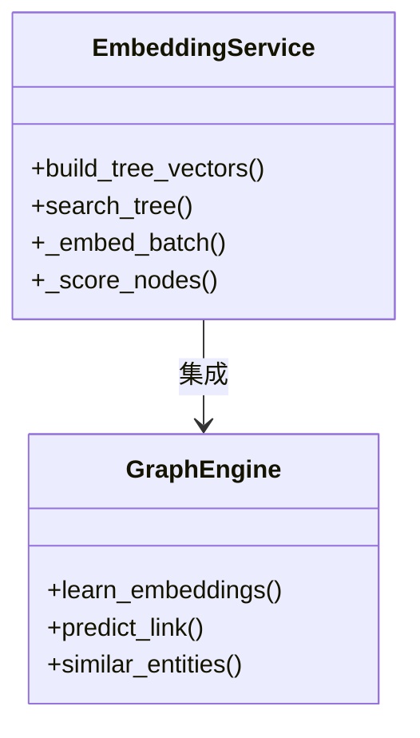

**图表来源**
- [embedding.py:598-786](file://src/drbrain/services/embedding.py#L598-L786)
- [engine.py:626-741](file://src/drbrain/graph/engine.py#L626-L741)

**章节来源**
- [bm25.py:17-135](file://src/drbrain/query/bm25.py#L17-L135)
- [tree_retrieval.py:1-800](file://src/drbrain/query/tree_retrieval.py#L1-L800)
- [embedding.py:1-786](file://src/drbrain/services/embedding.py#L1-L786)
- [engine.py:1-800](file://src/drbrain/graph/engine.py#L1-L800)

## 架构概览

DrBrain 的检索系统采用分层架构设计，每层都有特定的职责和优化策略：

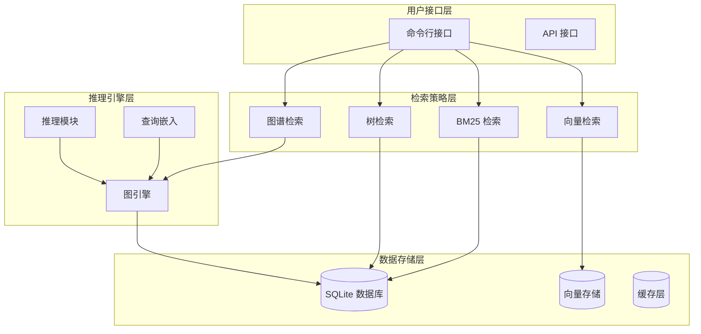

**图表来源**
- [architecture.md:188-210](file://docs/architecture.md#L188-L210)
- [query_commands.py:283-631](file://src/drbrain/cli/query_commands.py#L283-L631)

### 检索流程序列

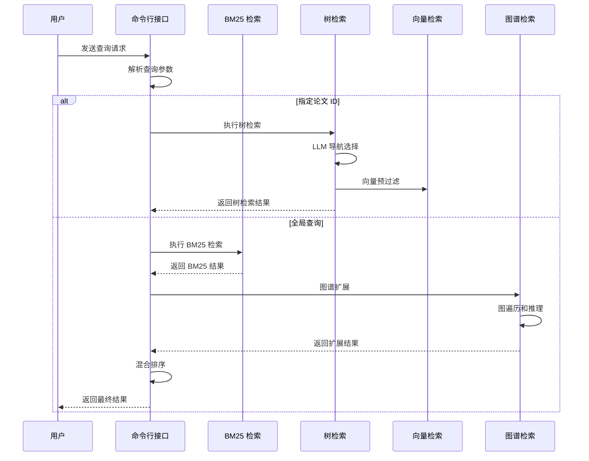

**图表来源**
- [query_commands.py:325-631](file://src/drbrain/cli/query_commands.py#L325-L631)
- [tree_retrieval.py:215-380](file://src/drbrain/query/tree_retrieval.py#L215-L380)

## 详细组件分析

### BM25 检索算法实现

BM25 检索算法在 DrBrain 中实现了完整的全文检索功能：

#### 核心算法原理

BM25 是一个基于概率检索模型的排序函数，其公式为：

```
score = IDF(tf, df, N) × BM25(tf, idf, k1, b, |doc|, avgdl)
```

其中：
- `IDF(tf, df, N)` = 文档频率的逆向文档频率
- `BM25(tf, idf, k1, b, |doc|, avgdl)` = 基于词频的归一化函数

#### 实现细节

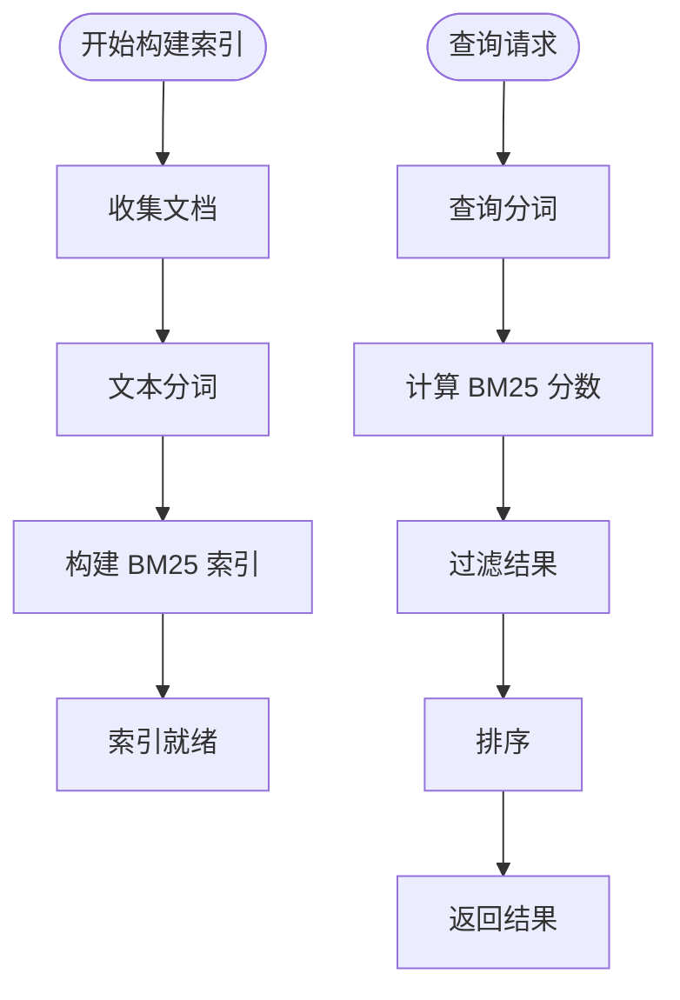

**图表来源**
- [bm25.py:50-91](file://src/drbrain/query/bm25.py#L50-L91)

#### 配置参数

| 参数 | 默认值 | 说明 |
|------|--------|------|
| `k1` | 1.5 | 控制词频饱和度的参数 |
| `b` | 0.75 | 控制长度归一化的参数 |

**章节来源**
- [bm25.py:17-135](file://src/drbrain/query/bm25.py#L17-L135)
- [config.py:90-93](file://src/drbrain/config.py#L90-L93)

### 树检索机制

树检索实现了 PageIndex 的层次化文档检索，采用 LLM 引导的自适应导航：

#### PageIndex 树结构

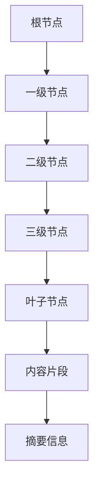

**图表来源**
- [pageindex_parser.py:247-275](file://src/drbrain/parser/pageindex_parser.py#L247-L275)

#### 自适应导航策略

```mermaid
flowchart TD
Start([开始检索]) --> CheckSize{树结构大小}
CheckSize --> |小树 (< 8000 字符)| OneShot[一次性选择]
CheckSize --> |大树| TopLevel[顶级导航]
TopLevel --> SelectBranches[选择分支]
SelectBranches --> ExpandBranches[展开分支]
ExpandBranches --> SelectLeaves[选择叶子节点]
OneShot --> SelectNodes[选择节点]
SelectNodes --> ReviewRound[复审轮次]
ReviewRound --> LoadContent[加载内容]
SelectLeaves --> LoadContent
LoadContent --> Done([完成])
```

**图表来源**
- [tree_retrieval.py:222-380](file://src/drbrain/query/tree_retrieval.py#L222-L380)

#### 向量预过滤

树检索支持向量预过滤以提高效率：

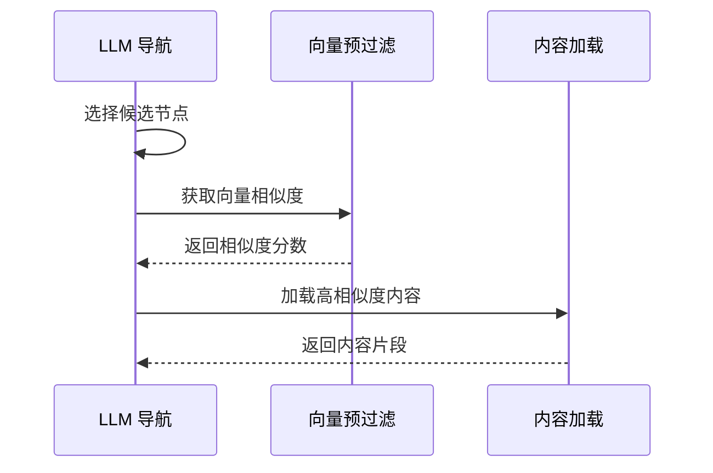

**图表来源**
- [tree_retrieval.py:742-800](file://src/drbrain/query/tree_retrieval.py#L742-L800)

**章节来源**
- [tree_retrieval.py:1-800](file://src/drbrain/query/tree_retrieval.py#L1-L800)
- [pageindex_parser.py:1-800](file://src/drbrain/parser/pageindex_parser.py#L1-L800)

### 查询嵌入技术

查询嵌入技术提供了复杂的图查询能力，支持关系投影、集合运算等操作：

#### 核心操作符

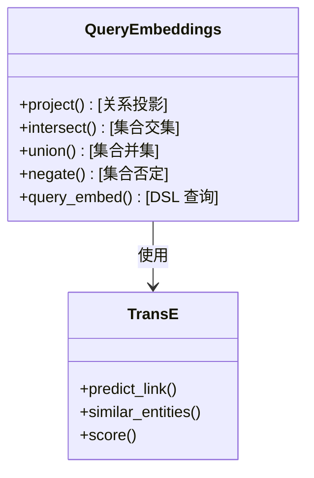

**图表来源**
- [query_embeddings.py:38-226](file://src/drbrain/graph/query_embeddings.py#L38-L226)
- [engine.py:626-741](file://src/drbrain/graph/engine.py#L626-L741)

#### TransE 关系投影

关系投影操作基于 TransE 模型的数学原理：

```
h + r ≈ t
```

其中：
- `h` 是头实体向量
- `r` 是关系向量  
- `t` 是尾实体向量

**章节来源**
- [query_embeddings.py:1-226](file://src/drbrain/graph/query_embeddings.py#L1-L226)
- [engine.py:626-741](file://src/drbrain/graph/engine.py#L626-L741)

### 混合检索策略

DrBrain 实现了多种混合检索策略，通过加权融合不同的检索结果：

#### 权重融合算法

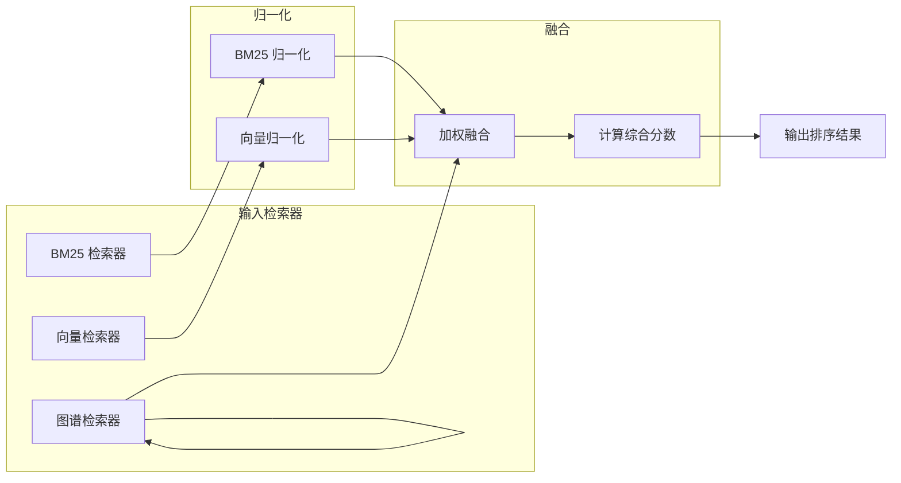

**图表来源**
- [tree_retrieval.py:385-436](file://src/drbrain/query/tree_retrieval.py#L385-L436)

#### 复合查询 DSL

```python
# 示例查询 DSL
query = {
    "type": "union",
    "queries": [
        {
            "type": "project",
            "entity": "transformer",
            "relation": "extends"
        },
        {
            "type": "intersect",
            "entities": ["attention", "neural_network"]
        }
    ]
}
```

**章节来源**
- [tree_retrieval.py:385-436](file://src/drbrain/query/tree_retrieval.py#L385-L436)
- [query_embeddings.py:133-226](file://src/drbrain/graph/query_embeddings.py#L133-L226)

### 图增强搜索

图增强搜索利用知识图谱的结构信息来提升检索效果：

#### 图遍历策略

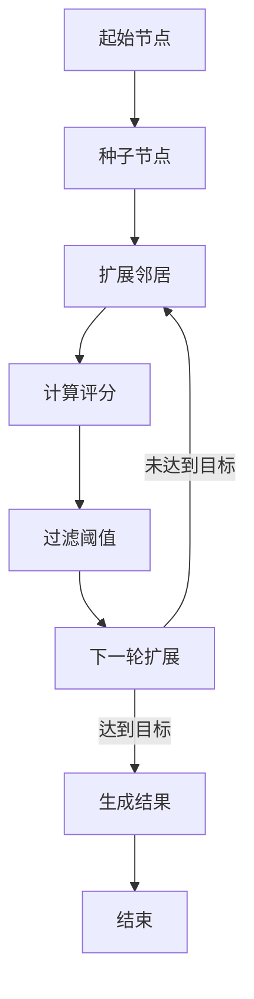

#### 混合排序算法

```python
def hybrid_ranking(bm25_results, graph_results, alpha=0.3):
    """
    混合排序：alpha * BM25 + (1-alpha) * 图谱评分
    """
    # BM25 归一化
    bm25_max = max(r['score'] for r in bm25_results)
    bm25_norm = {r['id']: r['score']/bm25_max for r in bm25_results}
    
    # 图谱评分
    graph_scores = {r['id']: r['score'] for r in graph_results}
    
    # 混合评分
    final_scores = {}
    for id in set(bm25_norm.keys()) | set(graph_scores.keys()):
        bm25_s = bm25_norm.get(id, 0)
        graph_s = graph_scores.get(id, 0)
        final_scores[id] = alpha * bm25_s + (1-alpha) * graph_s
    
    return sorted(final_scores.items(), key=lambda x: x[1], reverse=True)
```

**章节来源**
- [query_commands.py:460-498](file://src/drbrain/cli/query_commands.py#L460-L498)
- [engine.py:62-122](file://src/drbrain/graph/engine.py#L62-L122)

## 依赖关系分析

### 组件耦合关系

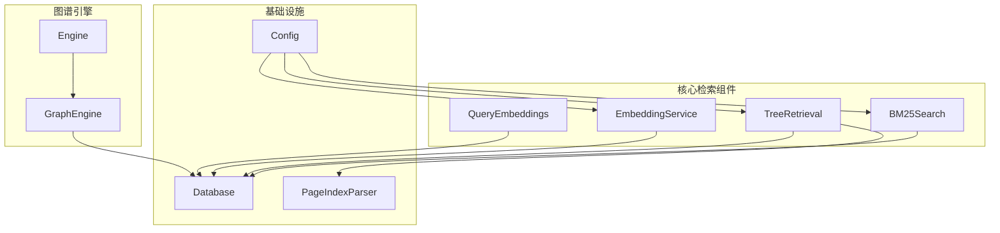

**图表来源**
- [bm25.py:93-135](file://src/drbrain/query/bm25.py#L93-L135)
- [tree_retrieval.py:451-478](file://src/drbrain/query/tree_retrieval.py#L451-L478)
- [embedding.py:710-786](file://src/drbrain/services/embedding.py#L710-L786)

### 数据流依赖

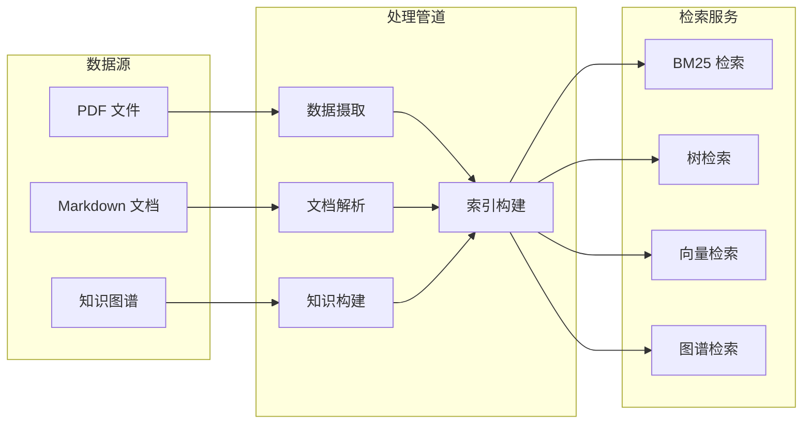

**图表来源**
- [architecture.md:25-72](file://docs/architecture.md#L25-L72)
- [database.py:10-156](file://src/drbrain/storage/database.py#L10-L156)

**章节来源**
- [bm25.py:93-135](file://src/drbrain/query/bm25.py#L93-L135)
- [tree_retrieval.py:451-478](file://src/drbrain/query/tree_retrieval.py#L451-L478)
- [embedding.py:710-786](file://src/drbrain/services/embedding.py#L710-L786)
- [database.py:1-775](file://src/drbrain/storage/database.py#L1-L775)

## 性能考虑

### 内存管理优化

DrBrain 在向量检索中采用了多项内存管理策略：

#### GPU 内存自适应批处理

```python
def _compute_batch_size(est_tokens, profile, safety_factor=0.85):
    """
    基于 GPU 内存配置动态计算批处理大小
    """
    gpu_total = profile["gpu_total_bytes"]
    baseline = profile.get("baseline_bytes", 0)
    mem_per_sample = _estimate_mem_per_sample(est_tokens, profile)
    
    if mem_per_sample <= 0:
        return 8
    
    # 可用内存 = 总内存 * 安全系数 - 基线内存
    available = gpu_total * safety_factor - baseline
    if available <= 0:
        return 1
    
    bs = int(available / mem_per_sample)
    return max(1, min(bs, 128))
```

#### 缓存策略

- **模型缓存**：模块级缓存避免重复加载
- **GPU 配置缓存**：内存配置缓存到本地文件
- **向量缓存**：SQLite 存储减少重复计算

### 索引优化

#### 增量更新机制

```python
def build_tree_vectors(paper_dir, db_path, cfg):
    """
    增量构建树向量，只处理变更的内容
    """
    # 计算内容哈希进行变更检测
    existing_hashes = {}
    for row in conn.execute("SELECT node_id, content_hash FROM tree_vectors"):
        existing_hashes[row[0]] = row[1]
    
    # 只嵌入变更的节点
    to_embed_texts = []
    to_embed_nodes = []
    for node in nodes:
        nhash = _content_hash(node["text"])
        if existing_hashes.get(node["node_id"]) == nhash:
            continue  # 未变更，跳过
        to_embed_texts.append(node["text"])
        to_embed_nodes.append(node)
```

**章节来源**
- [embedding.py:308-412](file://src/drbrain/services/embedding.py#L308-L412)
- [embedding.py:598-666](file://src/drbrain/services/embedding.py#L598-L666)

### 并发处理

#### 多阶段并发执行

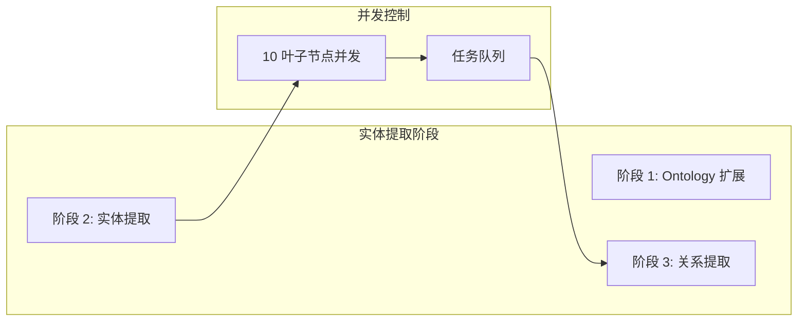

**图表来源**
- [architecture.md:48-72](file://docs/architecture.md#L48-L72)

## 故障排除指南

### 常见问题诊断

#### BM25 检索问题

| 问题类型 | 症状 | 可能原因 | 解决方案 |
|----------|------|----------|----------|
| 索引为空 | 查询返回空结果 | 未构建索引或数据库为空 | 运行 `drbrain index` 重建索引 |
| 检索速度慢 | 查询响应时间长 | 索引过大或查询复杂 | 优化查询条件，检查索引统计 |
| 结果质量差 | 相关性不高 | k1/b 参数不合适 | 调整 BM25 参数配置 |

#### 树检索问题

| 问题类型 | 症状 | 可能原因 | 解决方案 |
|----------|------|----------|----------|
| LLM 导航失败 | 返回空结果 | 模型配置错误或上下文过大 | 检查 LLM 配置，减少上下文大小 |
| 向量预过滤无效 | 结果质量无改善 | 向量模型问题 | 检查向量服务状态，重新构建向量 |
| 内容加载失败 | 部分结果缺失 | 文件路径错误或权限问题 | 检查文件存在性和访问权限 |

#### 向量检索问题

| 问题类型 | 症状 | 可能原因 | 解决方案 |
|----------|------|----------|----------|
| OOM 错误 | GPU 内存不足 | 批处理过大或模型过大 | 减小批处理大小，使用更小的模型 |
| 性能下降 | 相似度计算缓慢 | 向量维度过高 | 降低向量维度，优化存储格式 |
| 结果不准确 | 相似度分数异常 | 向量训练问题 | 重新训练向量模型，检查数据质量 |

### 调试工具

#### 日志配置

```python
import logging
from loguru import logger

# 设置日志级别
logging.basicConfig(level=logging.INFO)

# 添加调试日志
logger.add("debug.log", level="DEBUG")
logger.debug("检索过程详情")
```

#### 性能监控

```python
import time
import psutil

def monitor_performance():
    """监控系统资源使用情况"""
    cpu_percent = psutil.cpu_percent()
    memory_info = psutil.virtual_memory()
    disk_io = psutil.disk_io_counters()
    
    return {
        "cpu_percent": cpu_percent,
        "memory_percent": memory_info.percent,
        "disk_read_bytes": disk_io.read_bytes,
        "disk_write_bytes": disk_io.write_bytes
    }
```

**章节来源**
- [test_bm25.py:1-207](file://tests/test_bm25.py#L1-L207)
- [test_tree_retrieval.py:1-897](file://tests/test_tree_retrieval.py#L1-L897)
- [test_query_embeddings.py:1-256](file://tests/test_query_embeddings.py#L1-L256)

## 结论

DrBrain 的检索系统模块展现了现代信息检索技术的最佳实践，通过多层次、混合驱动的设计实现了高效、准确的检索体验。系统的核心优势包括：

1. **多层检索策略**：BM25、树检索、向量检索和图谱检索的有机结合
2. **轻量级向量设计**：仅对语义完整节点使用向量，避免了向量化带来的复杂性
3. **知识图谱集成**：基于规则的推理和图遍历增强了检索的语义理解能力
4. **性能优化**：自适应批处理、增量更新和缓存策略确保了系统的高效运行
5. **可扩展性**：模块化设计支持新检索策略的快速集成

该系统为研究型知识管理提供了强大的检索能力，既保持了传统检索的简单可靠，又融入了现代 AI 技术的优势，是个人和研究团队的理想选择。

## 附录

### 配置参数参考

#### 检索配置

| 配置项 | 类型 | 默认值 | 说明 |
|--------|------|--------|------|
| `bm25.k1` | float | 1.5 | BM25 参数，控制词频饱和度 |
| `bm25.b` | float | 0.75 | BM25 参数，控制长度归一化 |
| `embed.top_k` | int | 10 | 向量检索默认返回数量 |
| `embed.batch_size` | int | 64 | 向量嵌入批处理大小 |

#### 检索命令示例

```bash
# 基础 BM25 检索
drbrain query "深度学习"

# 图谱增强检索
drbrain query "transformer" --neighbors 2 --hybrid

# 指定论文的树检索
drbrain query "实验方法" --paper paper_123

# 向量检索
drbrain query "注意力机制" --type-filter Method
```

### 测试覆盖

系统包含全面的测试用例，覆盖了各种检索场景：

- **BM25 检索测试**：验证分词、索引构建、查询执行等功能
- **树检索测试**：测试 LLM 导航、向量预过滤、内容加载等流程
- **查询嵌入测试**：验证关系投影、集合运算、DSL 查询等功能

**章节来源**
- [config.py:90-141](file://src/drbrain/config.py#L90-L141)
- [query_commands.py:283-631](file://src/drbrain/cli/query_commands.py#L283-L631)
- [test_bm25.py:1-207](file://tests/test_bm25.py#L1-L207)
- [test_tree_retrieval.py:1-897](file://tests/test_tree_retrieval.py#L1-L897)
- [test_query_embeddings.py:1-256](file://tests/test_query_embeddings.py#L1-L256)