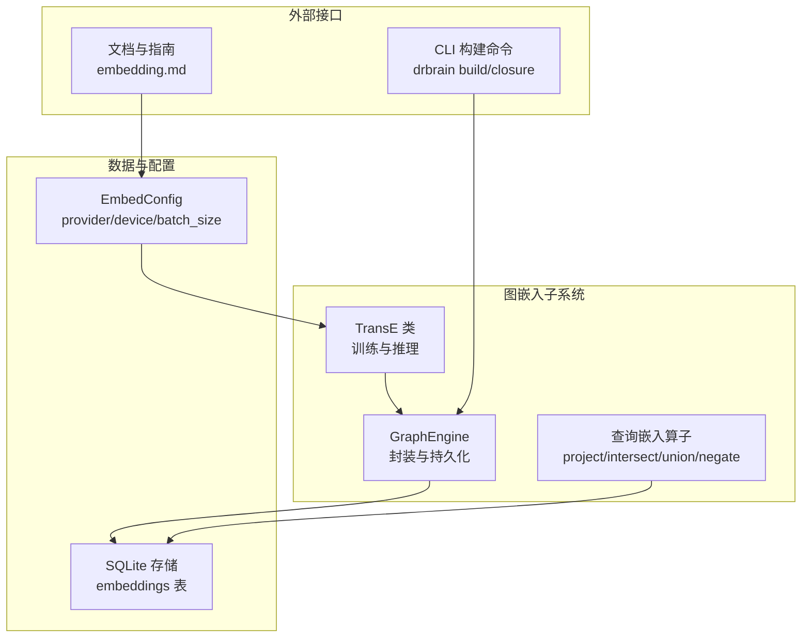
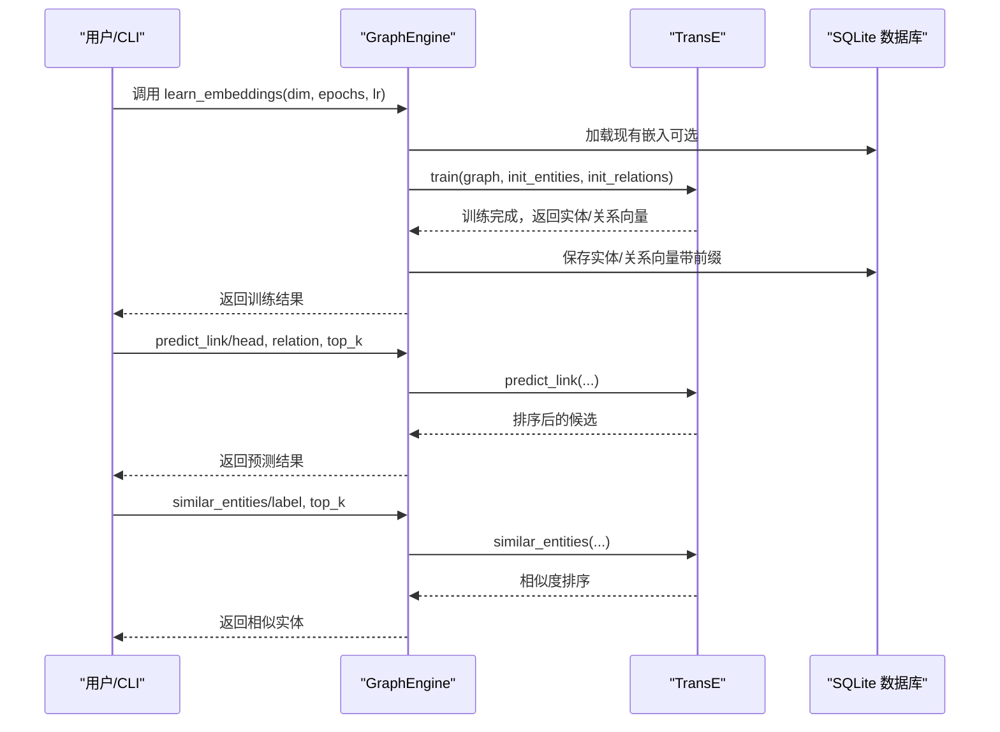
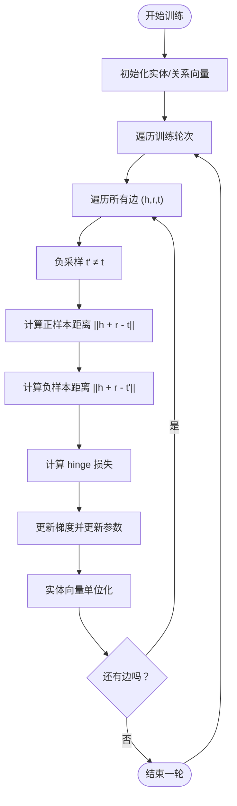
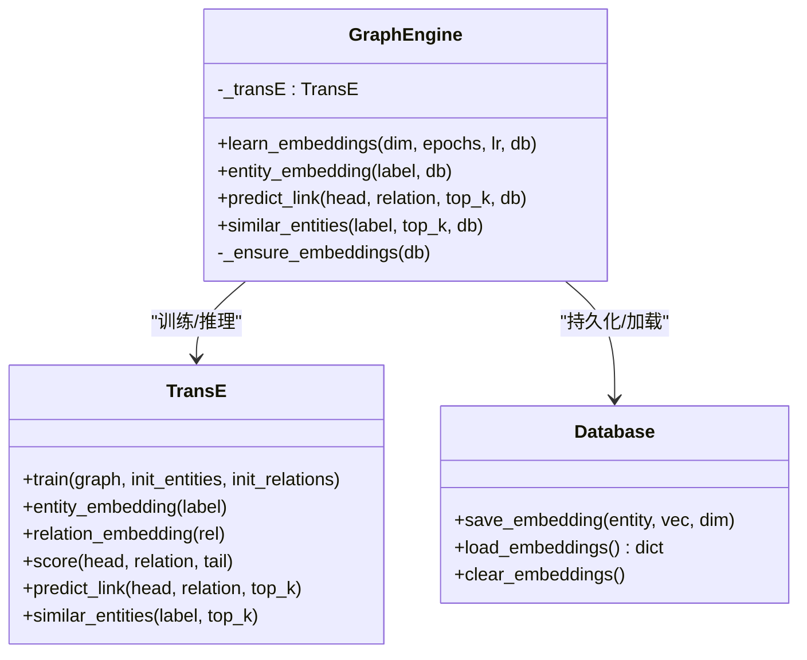
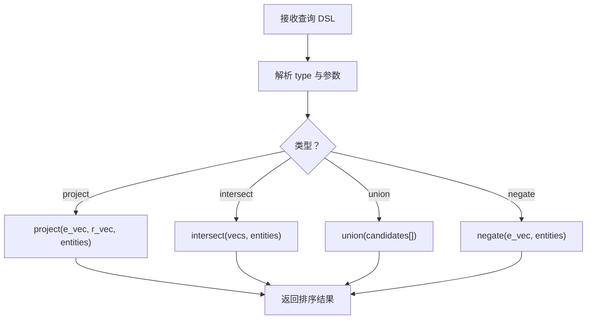
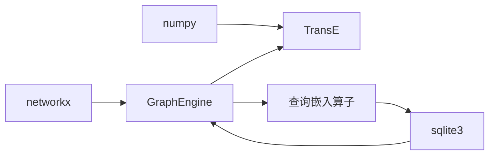

# 图嵌入系统

<cite>
**本文引用的文件列表**
- [embedding.py](file://src/drbrain/graph/embedding.py)
- [engine.py](file://src/drbrain/graph/engine.py)
- [query_embeddings.py](file://src/drbrain/graph/query_embeddings.py)
- [embedding.md](file://docs/embedding.md)
- [database.py](file://src/drbrain/storage/database.py)
- [config.py](file://src/drbrain/config.py)
- [test_embedding.py](file://tests/test_embedding.py)
- [test_query_embeddings.py](file://tests/test_query_embeddings.py)
- [test_engine_embeddings.py](file://tests/test_engine_embeddings.py)
- [architecture.md](file://docs/architecture.md)
</cite>

## 目录
1. [简介](#简介)
2. [项目结构](#项目结构)
3. [核心组件](#核心组件)
4. [架构总览](#架构总览)
5. [详细组件分析](#详细组件分析)
6. [依赖关系分析](#依赖关系分析)
7. [性能考量](#性能考量)
8. [故障排查指南](#故障排查指南)
9. [结论](#结论)
10. [附录](#附录)

## 简介
本文件面向 DrBrain 的图嵌入系统，聚焦 TransE 知识图谱嵌入算法的实现与应用。内容涵盖：
- TransE 向量学习机制与嵌入空间的几何解释
- 训练流程、负采样策略与优化细节
- 查询嵌入技术、相似度计算与链接预测
- 与知识图结构的集成方式、嵌入维度与正则化
- 配置选项、调优参数与典型应用场景

## 项目结构
DrBrain 将“图嵌入”作为知识图谱推理与检索增强的重要一环，与文本向量、规则推理、路径规则等模块协同工作。图嵌入相关代码主要位于以下位置：
- TransE 实现与训练：src/drbrain/graph/embedding.py
- 图引擎封装与持久化：src/drbrain/graph/engine.py
- 基于嵌入的复杂查询算子：src/drbrain/graph/query_embeddings.py
- 数据库表结构与向量存储：src/drbrain/storage/database.py
- 文档与配置参考：docs/embedding.md、src/drbrain/config.py
- 单元测试验证：tests/test_embedding.py、tests/test_query_embeddings.py、tests/test_engine_embeddings.py

图表来源
- [embedding.py:1-117](file://src/drbrain/graph/embedding.py#L1-L117)
- [engine.py:626-760](file://src/drbrain/graph/engine.py#L626-L760)
- [query_embeddings.py:1-226](file://src/drbrain/graph/query_embeddings.py#L1-L226)
- [database.py:78-82](file://src/drbrain/storage/database.py#L78-L82)
- [config.py:115-141](file://src/drbrain/config.py#L115-L141)

章节来源
- [embedding.py:1-117](file://src/drbrain/graph/embedding.py#L1-L117)
- [engine.py:626-760](file://src/drbrain/graph/engine.py#L626-L760)
- [query_embeddings.py:1-226](file://src/drbrain/graph/query_embeddings.py#L1-L226)
- [database.py:78-82](file://src/drbrain/storage/database.py#L78-L82)
- [config.py:115-141](file://src/drbrain/config.py#L115-L141)

## 核心组件
- TransE：基于向量加法的几何假设 h + r ≈ t，通过成对三元组损失进行端到端训练，支持链接预测与相似实体检索。
- GraphEngine：封装 TransE 的训练、加载、缓存与推理，并与 SQLite 持久化交互；提供 predict_link、similar_entities 等便捷方法。
- 查询嵌入算子：在已持久化的嵌入上执行投影、交集、并集、否定等操作，形成可组合的 DSL 查询。
- 数据库与配置：embeddings 表存储实体/关系向量；EmbedConfig 控制文本向量后端（与图嵌入不同）。

章节来源
- [embedding.py:8-117](file://src/drbrain/graph/embedding.py#L8-L117)
- [engine.py:626-760](file://src/drbrain/graph/engine.py#L626-L760)
- [query_embeddings.py:17-226](file://src/drbrain/graph/query_embeddings.py#L17-L226)
- [database.py:78-82](file://src/drbrain/storage/database.py#L78-L82)
- [config.py:115-141](file://src/drbrain/config.py#L115-L141)

## 架构总览
TransE 嵌入系统在 DrBrain 中承担“知识图谱语义表示”的角色，服务于：
- 规则闭包混合模式：以 TransE 分数调整推断边的置信度
- 复杂查询：通过向量空间的投影与集合运算实现语义检索
- 与文本向量系统的边界清晰：文本向量用于树节点检索，图嵌入用于关系与结构推理

图表来源
- [engine.py:626-760](file://src/drbrain/graph/engine.py#L626-L760)
- [embedding.py:20-117](file://src/drbrain/graph/embedding.py#L20-L117)
- [database.py:400-416](file://src/drbrain/storage/database.py#L400-L416)

## 详细组件分析

### TransE 类与训练流程
- 几何假设：h + r ≈ t，即头实体向量加上关系向量应接近尾实体向量。
- 初始化：实体向量按均匀分布缩放初始化；关系向量先初始化再归一化。
- 训练目标：对每个正样本三元组 (h, r, t)，随机采样一个负样本 t'，计算 hinge 损失 max(0, ||h + r - t|| - ||h + r - t'|| + margin)。
- 梯度更新：分别对 h、t、t'、r 进行梯度下降；关系向量采用平均梯度更新并再次归一化；实体向量在每步结束后做单位化以稳定范数。
- 负采样：随机从实体池中采样一个不同于 t 的实体作为负样本。
- 输出：训练完成后提供 score、predict_link、similar_entities 等能力。

图表来源
- [embedding.py:20-80](file://src/drbrain/graph/embedding.py#L20-L80)

章节来源
- [embedding.py:8-117](file://src/drbrain/graph/embedding.py#L8-L117)
- [test_embedding.py:9-100](file://tests/test_embedding.py#L9-L100)

### GraphEngine 封装与持久化
- learn_embeddings：支持增量训练（warm-start），将已有嵌入作为初始值；训练完成后写回数据库（实体与关系分别存储，关系键带前缀）。
- predict_link/similar_entities：确保嵌入已加载（内存缓存优先，否则从数据库读取），然后调用 TransE 的对应方法。
- closure 混合模式：当 mode="hybrid" 时，利用 TransE 分数对推断边置信度进行加权融合。

图表来源
- [engine.py:626-760](file://src/drbrain/graph/engine.py#L626-L760)
- [embedding.py:8-117](file://src/drbrain/graph/embedding.py#L8-L117)
- [database.py:400-416](file://src/drbrain/storage/database.py#L400-L416)

章节来源
- [engine.py:626-760](file://src/drbrain/graph/engine.py#L626-L760)
- [database.py:400-416](file://src/drbrain/storage/database.py#L400-L416)

### 查询嵌入算子（DSL）
- project：给定实体向量与关系向量，在所有实体向量中寻找最接近 h + r 的目标实体，用于“可达性”查询。
- intersect：对多个实体向量求中心点（均值），返回最接近该中心的实体集合。
- union：合并多个候选集，保留最高分。
- negate：返回与给定向量最不相似的实体（通过余弦相似度的倒序排序并变换分数范围）。
- query_embed：解析 DSL，递归执行上述算子，返回有序结果。

图表来源
- [query_embeddings.py:133-226](file://src/drbrain/graph/query_embeddings.py#L133-L226)

章节来源
- [query_embeddings.py:17-226](file://src/drbrain/graph/query_embeddings.py#L17-L226)
- [test_query_embeddings.py:131-256](file://tests/test_query_embeddings.py#L131-L256)

### 与图结构的集成关系
- 边数据来自 GraphEngine.graph（NetworkX MultiDiGraph），训练时仅使用边的三元组 (u, relation, v)。
- 关系闭包（如 extends、replaces 等）在 closure 中被规则生成，混合模式下可结合 TransE 分数提升置信度。
- 与文本向量系统解耦：文本向量用于树节点检索，图嵌入用于关系与结构推理。

章节来源
- [engine.py:124-315](file://src/drbrain/graph/engine.py#L124-L315)
- [architecture.md:207-270](file://docs/architecture.md#L207-L270)

### 配置选项与调优参数
- TransE 训练参数：dim、epochs、lr、margin（默认 margin=1.0）。可在 GraphEngine.learn_embeddings 或直接实例化 TransE 时设置。
- 文本向量配置（与图嵌入不同）：EmbedConfig.provider/device/source/batch_size 等，用于控制本地/云端文本向量服务。
- 建议：
  - dim：根据图规模与硬件资源选择（常见 64/128/256），越大表达能力越强但更耗资源。
  - epochs：从几十到数百不等，需观察损失收敛与过拟合迹象。
  - lr：通常 0.01 左右，若收敛慢可尝试较小值。
  - margin：控制正负样本间隔，过大可能欠拟合，过小可能不稳定。
  - 正则化：实体向量单位化有助于稳定训练；关系向量归一化防止尺度漂移。

章节来源
- [embedding.py:11](file://src/drbrain/graph/embedding.py#L11)
- [engine.py:626-670](file://src/drbrain/graph/engine.py#L626-L670)
- [config.py:115-141](file://src/drbrain/config.py#L115-L141)
- [embedding.md:44-100](file://docs/embedding.md#L44-L100)

## 依赖关系分析
- TransE 依赖 numpy 进行向量运算。
- GraphEngine 依赖 NetworkX 构造与遍历图，依赖 SQLite 存储嵌入。
- 查询嵌入算子依赖数据库提供的嵌入字典（实体/关系键分离）。
- 文档与配置为运行时提供指导与参数来源。

图表来源
- [embedding.py:5](file://src/drbrain/graph/embedding.py#L5)
- [engine.py:9](file://src/drbrain/graph/engine.py#L9)
- [query_embeddings.py:12](file://src/drbrain/graph/query_embeddings.py#L12)

章节来源
- [embedding.py:1-117](file://src/drbrain/graph/embedding.py#L1-L117)
- [engine.py:1-1118](file://src/drbrain/graph/engine.py#L1-L1118)
- [query_embeddings.py:1-226](file://src/drbrain/graph/query_embeddings.py#L1-L226)

## 性能考量
- 训练效率：TransE 为全局端到端训练，适合中小规模图；大规模图建议分批或分布式训练（当前实现为单机训练）。
- 负采样：简单随机采样，速度较快；可考虑更高效的负采样策略（如基于度数的加权采样）。
- 向量归一化：每步对实体向量单位化，有助于数值稳定；关系向量归一化防止尺度漂移。
- 查询性能：predict_link/similar_entities 对所有实体进行评分，复杂度 O(N)；可通过索引或近似最近邻加速（当前未实现）。
- 内存占用：向量维度越高、实体/关系越多，内存占用越大；建议按需裁剪维度与实体集合。

## 故障排查指南
- 训练不收敛或发散
  - 检查 learning rate 是否过大；适当降低 lr。
  - 检查 margin 设置是否合理；增大 margin 可能导致欠拟合。
  - 确认实体/关系初始化是否一致（增量训练时）。
- 维度不匹配
  - 若切换嵌入模型或维度，需重新训练并写回数据库。
- 查询为空
  - 确认嵌入已加载（内存缓存或数据库）；检查 label 是否存在。
- 性能问题
  - 对大规模图可考虑减少 epochs、降低 dim、使用更高效的数据结构或近似检索。

章节来源
- [embedding.py:20-80](file://src/drbrain/graph/embedding.py#L20-L80)
- [engine.py:742-760](file://src/drbrain/graph/engine.py#L742-L760)
- [embedding.md:172-188](file://docs/embedding.md#L172-L188)

## 结论
DrBrain 的图嵌入系统以 TransE 为核心，实现了从知识图谱三元组到向量空间的映射，并提供了链接预测、相似实体检索与基于嵌入的复杂查询能力。通过 GraphEngine 的封装与 SQLite 的持久化，系统具备良好的增量训练与推理能力。配合规则推理与文本向量系统，形成“结构+语义”的综合检索与推理方案。未来可在大规模场景引入更高效的负采样、近似检索与分布式训练策略，进一步提升性能与扩展性。

## 附录

### 实际代码示例（路径引用）
- 训练与推理
  - [TransE 训练入口:20-80](file://src/drbrain/graph/embedding.py#L20-L80)
  - [GraphEngine.learn_embeddings:626-670](file://src/drbrain/graph/engine.py#L626-L670)
  - [GraphEngine.predict_link:698-721](file://src/drbrain/graph/engine.py#L698-L721)
  - [GraphEngine.similar_entities:722-741](file://src/drbrain/graph/engine.py#L722-L741)
- 查询嵌入
  - [project/intersect/union/negate:38-128](file://src/drbrain/graph/query_embeddings.py#L38-L128)
  - [query_embed DSL 执行:133-226](file://src/drbrain/graph/query_embeddings.py#L133-L226)
- 测试用例
  - [TransE 训练收敛与预测:9-71](file://tests/test_embedding.py#L9-L71)
  - [TransE 增量训练:73-100](file://tests/test_embedding.py#L73-L100)
  - [GraphEngine 嵌入持久化与加载:29-70](file://tests/test_engine_embeddings.py#L29-L70)
  - [查询嵌入算子单元测试:42-256](file://tests/test_query_embeddings.py#L42-L256)