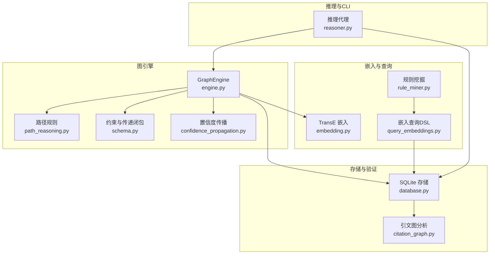
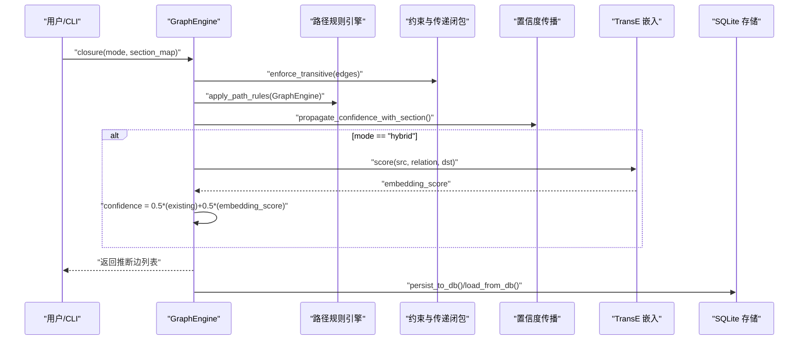
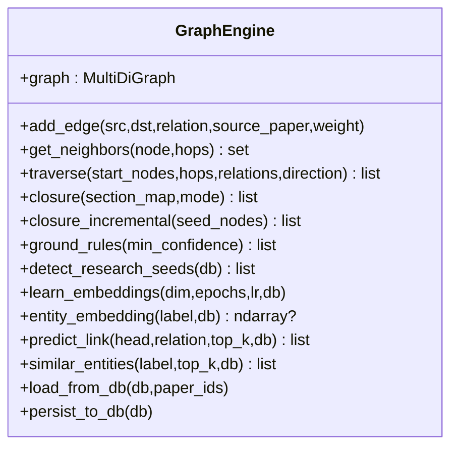
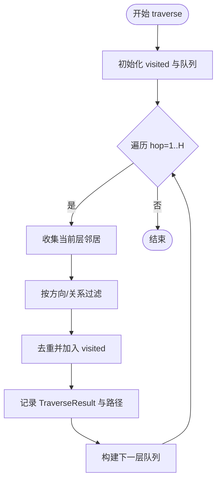
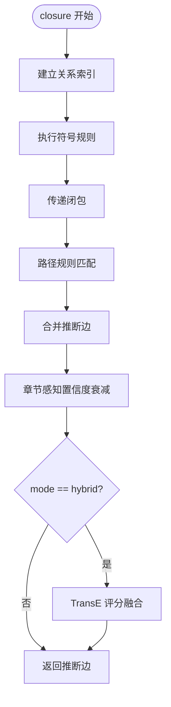
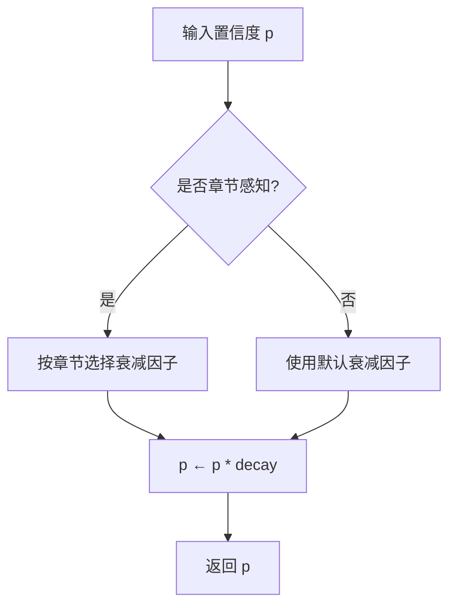
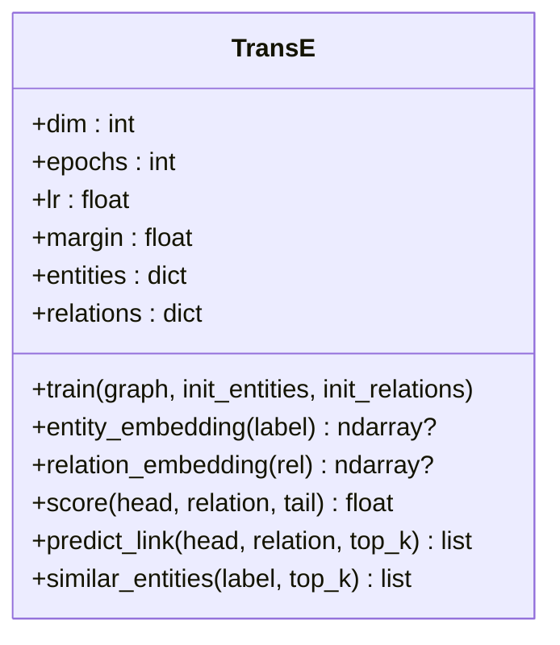
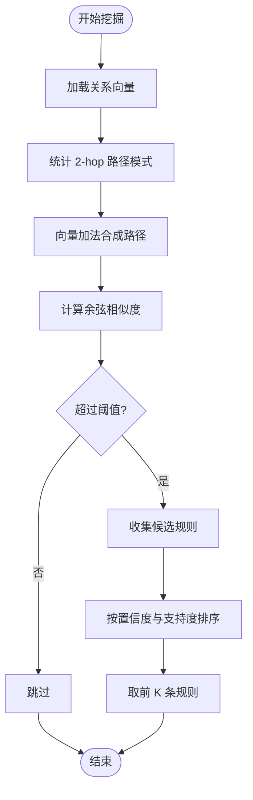
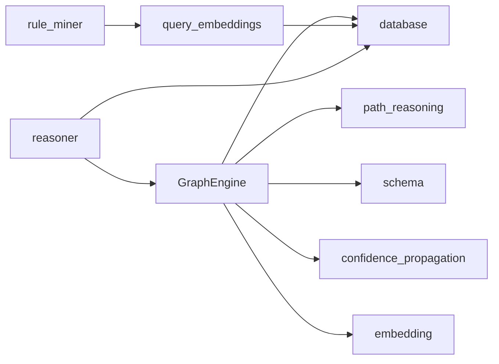

# 图引擎核心

<cite>
**本文引用的文件列表**
- [engine.py](file://src/drbrain/graph/engine.py)
- [path_reasoning.py](file://src/drbrain/graph/path_reasoning.py)
- [schema.py](file://src/drbrain/validator/schema.py)
- [confidence_propagation.py](file://src/drbrain/extractor/confidence_propagation.py)
- [rule_miner.py](file://src/drbrain/extractor/rule_miner.py)
- [embedding.py](file://src/drbrain/graph/embedding.py)
- [query_embeddings.py](file://src/drbrain/graph/query_embeddings.py)
- [database.py](file://src/drbrain/storage/database.py)
- [citation_graph.py](file://src/drbrain/storage/citation_graph.py)
- [reasoner.py](file://src/drbrain/extractor/reasoner.py)
- [test_engine.py](file://tests/test_engine.py)
- [test_graph_engine.py](file://tests/test_graph_engine.py)
- [test_engine_embeddings.py](file://tests/test_engine_embeddings.py)
</cite>

## 目录
1. [简介](#简介)
2. [项目结构](#项目结构)
3. [核心组件](#核心组件)
4. [架构总览](#架构总览)
5. [详细组件分析](#详细组件分析)
6. [依赖分析](#依赖分析)
7. [性能考量](#性能考量)
8. [故障排除指南](#故障排除指南)
9. [结论](#结论)
10. [附录](#附录)

## 简介
本技术文档聚焦 DrBrain 图引擎核心模块，系统阐述 GraphEngine 类的设计架构、图操作接口与规则推理机制。内容涵盖：
- 图构建算法：节点与边的添加、邻居查询与多跳遍历策略
- 规则闭包算法：符号推理与路径规则、置信度传播与混合模式
- 与 NetworkX 的集成：基于 MultiDiGraph 的高效图表示与操作
- 数据结构设计：邻接索引、路径追踪、置信度模型
- 并发控制与持久化：嵌入训练缓存、数据库读写一致性
- 实际使用示例与最佳实践、性能调优与故障排除

## 项目结构
图引擎位于 src/drbrain/graph 目录，围绕 GraphEngine 核心类展开，并与抽取器、验证器、存储层协同工作：
- engine.py：GraphEngine 主体，提供图操作、闭包推理、嵌入学习与研究种子检测
- path_reasoning.py：内置多跳路径规则匹配与推断
- schema.py：TBox/RBox 约束与传递闭包、反身性检测
- confidence_propagation.py：置信度衰减与多路径合并
- rule_miner.py：基于嵌入的关系组合挖掘与图走查规则挖掘
- embedding.py：TransE 知识图谱嵌入训练与预测
- query_embeddings.py：嵌入式复杂查询（投影、交并、否定、并集）
- database.py：SQLite 后端与模式管理
- citation_graph.py：引文图分析（共享参考、共被引等）
- reasoner.py：基于 LLM 的图推理代理，调用图引擎进行工具式探索

图表来源
- [engine.py:1-1118](file://src/drbrain/graph/engine.py#L1-L1118)
- [path_reasoning.py:1-212](file://src/drbrain/graph/path_reasoning.py#L1-L212)
- [schema.py:1-211](file://src/drbrain/validator/schema.py#L1-L211)
- [confidence_propagation.py:1-87](file://src/drbrain/extractor/confidence_propagation.py#L1-L87)
- [embedding.py:1-117](file://src/drbrain/graph/embedding.py#L1-L117)
- [query_embeddings.py:1-226](file://src/drbrain/graph/query_embeddings.py#L1-L226)
- [rule_miner.py:1-290](file://src/drbrain/extractor/rule_miner.py#L1-L290)
- [database.py:1-775](file://src/drbrain/storage/database.py#L1-L775)
- [citation_graph.py:1-129](file://src/drbrain/storage/citation_graph.py#L1-L129)
- [reasoner.py:1-677](file://src/drbrain/extractor/reasoner.py#L1-L677)

章节来源
- [engine.py:1-1118](file://src/drbrain/graph/engine.py#L1-L1118)
- [path_reasoning.py:1-212](file://src/drbrain/graph/path_reasoning.py#L1-L212)
- [schema.py:1-211](file://src/drbrain/validator/schema.py#L1-L211)
- [confidence_propagation.py:1-87](file://src/drbrain/extractor/confidence_propagation.py#L1-L87)
- [embedding.py:1-117](file://src/drbrain/graph/embedding.py#L1-L117)
- [query_embeddings.py:1-226](file://src/drbrain/graph/query_embeddings.py#L1-L226)
- [rule_miner.py:1-290](file://src/drbrain/extractor/rule_miner.py#L1-L290)
- [database.py:1-775](file://src/drbrain/storage/database.py#L1-L775)
- [citation_graph.py:1-129](file://src/drbrain/storage/citation_graph.py#L1-L129)
- [reasoner.py:1-677](file://src/drbrain/extractor/reasoner.py#L1-L677)

## 核心组件
- GraphEngine：以 NetworkX MultiDiGraph 为核心的数据结构，提供边添加、邻居查询、遍历、闭包推理、嵌入学习与持久化、增量闭包等能力
- 路径规则引擎：内置多跳路径规则，支持在子图上匹配链式关系并推断新边
- 置信度传播：按章节与路径进行置信度衰减与多路径合并
- TransE 嵌入：训练实体与关系向量，支持链接预测、相似实体检索与混合闭包置信度
- 规则挖掘：基于嵌入向量加法与图走查发现新的路径规则
- 存储与验证：SQLite 模式、嵌入持久化、TBox/RBox 约束与传递闭包

章节来源
- [engine.py:33-786](file://src/drbrain/graph/engine.py#L33-L786)
- [path_reasoning.py:9-212](file://src/drbrain/graph/path_reasoning.py#L9-L212)
- [confidence_propagation.py:31-87](file://src/drbrain/extractor/confidence_propagation.py#L31-L87)
- [embedding.py:8-117](file://src/drbrain/graph/embedding.py#L8-L117)
- [rule_miner.py:33-290](file://src/drbrain/extractor/rule_miner.py#L33-L290)
- [schema.py:140-211](file://src/drbrain/validator/schema.py#L140-L211)
- [database.py:159-775](file://src/drbrain/storage/database.py#L159-L775)

## 架构总览
图引擎采用“符号推理 + 嵌入增强”的双轨策略：
- 符号推理：基于关系索引与规则匹配，快速生成可解释的推断边
- 嵌入增强：通过 TransE 计算距离与相似度，对推断边赋予置信度权重
- 可扩展路径规则：内置规则与规则挖掘共同提升推理覆盖面

图表来源
- [engine.py:124-315](file://src/drbrain/graph/engine.py#L124-L315)
- [path_reasoning.py:131-153](file://src/drbrain/graph/path_reasoning.py#L131-L153)
- [schema.py:140-189](file://src/drbrain/validator/schema.py#L140-L189)
- [confidence_propagation.py:44-64](file://src/drbrain/extractor/confidence_propagation.py#L44-L64)
- [embedding.py:87-94](file://src/drbrain/graph/embedding.py#L87-L94)
- [database.py:398-416](file://src/drbrain/storage/database.py#L398-L416)

## 详细组件分析

### GraphEngine 类设计与接口
- 数据结构：内部持有 NetworkX MultiDiGraph，边属性包含 relation、source_paper、weight 等
- 关键方法：
  - add_edge：添加有向边
  - get_neighbors：N 跳邻居集合（含起始节点）
  - traverse：BFS 多跳遍历，支持方向过滤与关系过滤，返回路径追踪
  - closure：规则闭包，包括符号推理、传递闭包、路径规则、置信度传播、混合模式
  - closure_incremental：仅针对种子节点及其 2 跳邻域执行闭包
  - ground_rules：基于路径的规则落地（t-norm 最小置信度）
  - detect_research_seeds：研究机会检测（空数据库与数据库增强两种模式）
  - learn_embeddings / entity_embedding / predict_link / similar_entities：TransE 嵌入训练与查询
  - load_from_db / persist_to_db：从数据库加载与持久化
- 设计要点：
  - 邻居查询与遍历均以 set 去重，避免重复访问
  - traverse 返回 TraverseStep/TraverseResult，便于路径可视化与溯源
  - 闭包支持 section_map 进行章节感知置信度衰减
  - 混合模式将 TransE 分数与现有置信度融合

图表来源
- [engine.py:33-786](file://src/drbrain/graph/engine.py#L33-L786)

章节来源
- [engine.py:33-786](file://src/drbrain/graph/engine.py#L33-L786)

### 图构建与遍历策略
- 邻居查询：以 BFS 展开，每层去重并累计访问集合
- 遍历策略：支持 forward/backward/both 方向；可按关系类型过滤；记录完整路径（TraverseStep 列表）
- 性能特性：使用 set 去重与邻接索引，时间复杂度与边数线性相关

图表来源
- [engine.py:62-122](file://src/drbrain/graph/engine.py#L62-L122)

章节来源
- [engine.py:45-122](file://src/drbrain/graph/engine.py#L45-L122)

### 规则闭包与路径规则
- 符号推理规则：
  - creates_debate：挑战与支持汇聚于同一结论
  - gap_addressed：缺口被解决
  - indirect_evolution：演进链的传递
  - gap_to_debate：缺口指向同时被挑战与支持的目标
  - shared_actor：论文共享演员形成研究脉络
- 传递闭包：对声明为传递的关系（如 extends）进行闭包补全
- 路径规则：内置多条链式规则（如 method_supersedes_problem），在子图上匹配并推断新边
- 增量闭包：仅对种子节点及其 2 跳邻域构建子图执行闭包，显著降低计算量

图表来源
- [engine.py:124-315](file://src/drbrain/graph/engine.py#L124-L315)
- [path_reasoning.py:24-78](file://src/drbrain/graph/path_reasoning.py#L24-L78)
- [schema.py:140-189](file://src/drbrain/validator/schema.py#L140-L189)

章节来源
- [engine.py:124-315](file://src/drbrain/graph/engine.py#L124-L315)
- [path_reasoning.py:24-153](file://src/drbrain/graph/path_reasoning.py#L24-L153)
- [schema.py:140-190](file://src/drbrain/validator/schema.py#L140-L190)

### 置信度传播与混合模式
- 置信度衰减：默认乘法衰减因子，章节感知衰减因子针对不同章节（如 Methods/Results 更高）
- 多路径合并：使用概率 OR 合并多个独立路径的置信度
- 混合模式：将 TransE 评分转换为置信度并与现有置信度加权平均

图表来源
- [confidence_propagation.py:31-64](file://src/drbrain/extractor/confidence_propagation.py#L31-L64)

章节来源
- [confidence_propagation.py:31-87](file://src/drbrain/extractor/confidence_propagation.py#L31-L87)
- [engine.py:281-315](file://src/drbrain/graph/engine.py#L281-L315)

### TransE 嵌入与查询
- TransE 训练：随机初始化实体与关系向量，使用三元组负采样与铰链损失训练
- 查询操作：
  - project：给定头实体与关系，预测尾实体（基于 h + r ≈ t）
  - intersect：多个实体向量的质心，寻找最接近的实体集合
  - union：合并多个候选集，保留最高分数
  - negate：与给定向量最不相似的实体
- DSL 查询：支持嵌套子查询与复合操作

图表来源
- [embedding.py:8-117](file://src/drbrain/graph/embedding.py#L8-L117)

章节来源
- [embedding.py:8-117](file://src/drbrain/graph/embedding.py#L8-L117)
- [query_embeddings.py:38-226](file://src/drbrain/graph/query_embeddings.py#L38-L226)

### 规则挖掘与路径规则
- 基于嵌入：利用关系向量加法近似路径组合，计算余弦相似度评估规则强度
- 基于图走查：统计 2 跳路径模式出现频次，结合关系向量选择最佳头部关系
- 支持并行边与同源同目标多关系模式的计数

图表来源
- [rule_miner.py:33-105](file://src/drbrain/extractor/rule_miner.py#L33-L105)
- [rule_miner.py:137-197](file://src/drbrain/extractor/rule_miner.py#L137-L197)

章节来源
- [rule_miner.py:33-290](file://src/drbrain/extractor/rule_miner.py#L33-L290)

### 与 NetworkX 的集成
- 使用 MultiDiGraph 表示知识图谱，支持多重边与自环
- 遍历与匹配基于 NetworkX 的 out_edges/in_edges 与 has_path
- 增量闭包通过子图构建减少全图扫描

章节来源
- [engine.py:36-37](file://src/drbrain/graph/engine.py#L36-L37)
- [path_reasoning.py:58-78](file://src/drbrain/graph/path_reasoning.py#L58-L78)

### 存储与并发控制
- SQLite 模式：集中管理 papers、concepts、edges、embeddings、tree_summaries 等表
- 并发控制：WAL 模式与外键开启，保证一致性
- 嵌入持久化：TransE 训练后写入 embeddings 表，支持热启动
- 引文图分析：共享参考与共被引统计，辅助研究信号检测

章节来源
- [database.py:159-775](file://src/drbrain/storage/database.py#L159-L775)
- [citation_graph.py:8-129](file://src/drbrain/storage/citation_graph.py#L8-L129)

### 推理代理与工具调用
- ReasonerAgent：封装图引擎工具（搜索、邻居、路径、文档结构与内容、跨篇检索、RAPTOR 摘要）
- 双向推理：LLM 提出假设，KG 验证一致性与模式，迭代修正
- 闭包上下文注入：在系统提示中注入闭包推断边，增强 LLM 推理

章节来源
- [reasoner.py:16-677](file://src/drbrain/extractor/reasoner.py#L16-L677)

## 依赖分析
- 内部依赖：
  - engine.py 依赖 path_reasoning、schema、confidence_propagation、embedding、database
  - rule_miner 依赖 query_embeddings 加载嵌入
  - reasoner 依赖 engine、database
- 外部依赖：
  - NetworkX：图表示与遍历
  - NumPy：向量运算
  - SQLite3：持久化

图表来源
- [engine.py:12-13](file://src/drbrain/graph/engine.py#L12-L13)
- [rule_miner.py:56-58](file://src/drbrain/extractor/rule_miner.py#L56-L58)
- [reasoner.py:19-23](file://src/drbrain/extractor/reasoner.py#L19-L23)

章节来源
- [engine.py:12-13](file://src/drbrain/graph/engine.py#L12-L13)
- [rule_miner.py:56-58](file://src/drbrain/extractor/rule_miner.py#L56-L58)
- [reasoner.py:19-23](file://src/drbrain/extractor/reasoner.py#L19-L23)

## 性能考量
- 时间复杂度
  - 邻居查询与遍历：O(V + E)，其中 V 为节点数，E 为边数
  - 闭包规则：对关系索引扫描，复杂度与边数线性相关
  - TransE 训练：O(E × D × T)，E 为三元组数，D 为维度，T 为轮数
- 空间复杂度
  - MultiDiGraph 存储边与属性
  - TransE 向量表与嵌入缓存
- 优化建议
  - 使用 closure_incremental 对种子邻域执行闭包
  - 合理设置 hops 与 relations 过滤，减少遍历规模
  - 在混合模式下缓存 TransE 实例，避免重复训练
  - 将高频查询结果写入数据库或缓存层

[本节为通用指导，无需特定文件引用]

## 故障排除指南
- 闭包未产生推断边
  - 检查是否存在满足规则的三元组（如 challenges 与 supports 共同指向同一结论）
  - 确认关系类型正确且存在于图中
- 遍历结果为空
  - 确认 start_nodes 中节点存在于图中
  - 检查 direction 与 relations 过滤条件是否过于严格
- 增量闭包无效
  - 确认种子节点存在且邻域内存在可触发规则的边
- 嵌入不可用
  - 确认已调用 learn_embeddings 或从数据库加载嵌入
  - 检查实体/关系标签是否一致

章节来源
- [test_engine.py:16-49](file://tests/test_engine.py#L16-L49)
- [test_graph_engine.py:183-348](file://tests/test_graph_engine.py#L183-L348)
- [test_engine_embeddings.py:157-182](file://tests/test_engine_embeddings.py#L157-L182)

## 结论
图引擎通过符号推理与嵌入增强相结合的方式，在可解释性与覆盖率之间取得平衡。GraphEngine 提供了完善的图操作接口、高效的闭包与遍历能力、灵活的置信度传播与混合模式，并与数据库、规则挖掘、推理代理形成完整的知识图谱工作流。建议在大规模图上优先使用增量闭包与关系过滤，结合 TransE 嵌入提升推断质量与效率。

[本节为总结，无需特定文件引用]

## 附录

### 使用示例（路径引用）
- 添加边与闭包
  - [engine.py:40-43](file://src/drbrain/graph/engine.py#L40-L43)
  - [engine.py:124-151](file://src/drbrain/graph/engine.py#L124-L151)
- 遍历与路径追踪
  - [engine.py:62-122](file://src/drbrain/graph/engine.py#L62-L122)
  - [test_graph_engine.py:211-348](file://tests/test_graph_engine.py#L211-L348)
- 增量闭包
  - [engine.py:787-806](file://src/drbrain/graph/engine.py#L787-L806)
  - [test_engine.py:188-225](file://tests/test_engine.py#L188-L225)
- 章节感知置信度
  - [engine.py:281-291](file://src/drbrain/graph/engine.py#L281-L291)
  - [confidence_propagation.py:44-64](file://src/drbrain/extractor/confidence_propagation.py#L44-L64)
- TransE 嵌入与混合模式
  - [embedding.py:20-80](file://src/drbrain/graph/embedding.py#L20-L80)
  - [engine.py:293-306](file://src/drbrain/graph/engine.py#L293-L306)
  - [test_engine_embeddings.py:157-182](file://tests/test_engine_embeddings.py#L157-L182)
- 规则挖掘
  - [rule_miner.py:33-105](file://src/drbrain/extractor/rule_miner.py#L33-L105)
  - [rule_miner.py:137-197](file://src/drbrain/extractor/rule_miner.py#L137-L197)
- 存储与持久化
  - [database.py:398-416](file://src/drbrain/storage/database.py#L398-L416)
  - [engine.py:760-785](file://src/drbrain/graph/engine.py#L760-L785)