# 基因谱分析

<cite>
**本文引用的文件**
- [genealogy.py](file://src/drbrain/graph/genealogy.py)
- [engine.py](file://src/drbrain/graph/engine.py)
- [database.py](file://src/drbrain/storage/database.py)
- [analysis_commands.py](file://src/drbrain/cli/analysis_commands.py)
- [analyzer.py](file://src/drbrain/report/analyzer.py)
- [rule_miner.py](file://src/drbrain/extractor/rule_miner.py)
- [causal_chain.py](file://src/drbrain/extractor/causal_chain.py)
- [concept.py](file://src/drbrain/extractor/concept.py)
- [citation_graph.py](file://src/drbrain/storage/citation_graph.py)
</cite>

## 目录
1. [简介](#简介)
2. [项目结构](#项目结构)
3. [核心组件](#核心组件)
4. [架构总览](#架构总览)
5. [详细组件分析](#详细组件分析)
6. [依赖分析](#依赖分析)
7. [性能考虑](#性能考虑)
8. [故障排查指南](#故障排查指南)
9. [结论](#结论)
10. [附录](#附录)

## 简介
本技术文档聚焦 DrBrain 的“基因谱分析”模块，系统阐述其在知识图谱中的研究演进路径识别、方法-理论-问题演化关系建模、跨领域知识转移检测与追踪机制。文档覆盖以下关键能力：
- 概念谱系树构建：基于图遍历的祖先/后代追溯，支持时间维度标注与可视化输出。
- 学术后裔追踪：从论文出发，沿概念关系链向下追踪扩展、细化、应用、挑战与引用关系。
- 知识前沿扫描：识别持久性缺口、争议焦点、范式替换、爆炸式增长与跨域入侵等前沿信号。
- 跨领域迁移机会：通过标签相似度与关系签名匹配，发现方法向问题的迁移潜力，并提供来源章节与论文溯源。
- 时间演进分析：提供概念信号分类（新兴/稳定/衰落/争议/复苏）与年度趋势统计。
- 关系规则挖掘：利用 TransE 向量合成与图游走统计，发现可组合的关系链路与推理规则。

## 项目结构
基因谱分析模块位于知识图谱子系统中，围绕 GraphEngine 图引擎、Database 数据库与 CLI 分析命令协同工作，形成“抽取-建图-分析-可视化”的完整流水线。

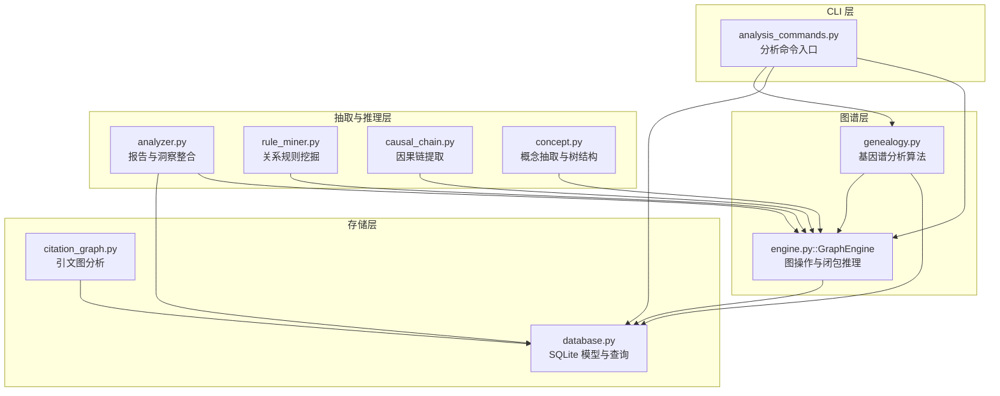

**图表来源**
- [analysis_commands.py:214-396](file://src/drbrain/cli/analysis_commands.py#L214-L396)
- [engine.py:33-122](file://src/drbrain/graph/engine.py#L33-L122)
- [genealogy.py:14-121](file://src/drbrain/graph/genealogy.py#L14-L121)
- [database.py:159-258](file://src/drbrain/storage/database.py#L159-L258)
- [analyzer.py:9-134](file://src/drbrain/report/analyzer.py#L9-L134)
- [rule_miner.py:33-105](file://src/drbrain/extractor/rule_miner.py#L33-L105)
- [causal_chain.py:63-150](file://src/drbrain/extractor/causal_chain.py#L63-L150)
- [concept.py:284-495](file://src/drbrain/extractor/concept.py#L284-L495)
- [citation_graph.py:74-128](file://src/drbrain/storage/citation_graph.py#L74-L128)

**章节来源**
- [analysis_commands.py:214-396](file://src/drbrain/cli/analysis_commands.py#L214-L396)
- [engine.py:33-122](file://src/drbrain/graph/engine.py#L33-L122)
- [genealogy.py:14-121](file://src/drbrain/graph/genealogy.py#L14-L121)
- [database.py:159-258](file://src/drbrain/storage/database.py#L159-L258)

## 核心组件
- 概念谱系树构建与可视化
  - evolve_concept：以 BFS 方式自顶向下/向上扩展，构建概念谱系树，支持标注年份、关系与来源章节。
  - format_tree：文本或 Mermaid 流程图渲染，支持桥接来源标注。
- 论文学术后裔追踪
  - trace_descendants：从论文出发，沿“扩展/细化/应用/挑战/引用”等关系向下追踪后代论文，标注 via_concept 与 via_section。
- 范式转移检测
  - detect_paradigm_shifts：识别三类范式转移——替代（旧方法衰落+新方法增长）、爆炸（概念快速扩散+后代丰富）、跨域入侵（应用关系引发级联）。
- 跨领域迁移机会
  - find_transfer_opportunities/find_transfer_opportunities_auto：显式/自动聚类发现 Method→Problem 的迁移机会，结合关系签名与标签相似度评分。
- 领域景观与前沿扫描
  - landscape_workspace：生成领域时间线、持久性缺口与争议区。
  - analyze_frontier：综合活跃缺口、争议、范式转移、难度分布与近期信号，输出复合前沿报告。
  - analyze_difficulty：按来源章节类型（限制、未来工作、讨论）对 Gap 进行难度分类。
- 时间演进分析
  - detect_evolution_signals/get_concept_evolution：信号分类（新兴/稳定/衰落/争议/复苏）与年度趋势统计。
- 关系规则挖掘
  - mine_path_rules/mine_from_graph_walks：基于 TransE 向量合成与图游走统计，发现可组合的关系链路与规则。

**章节来源**
- [genealogy.py:14-121](file://src/drbrain/graph/genealogy.py#L14-L121)
- [genealogy.py:189-270](file://src/drbrain/graph/genealogy.py#L189-L270)
- [genealogy.py:318-494](file://src/drbrain/graph/genealogy.py#L318-L494)
- [genealogy.py:779-863](file://src/drbrain/graph/genealogy.py#L779-L863)
- [genealogy.py:540-632](file://src/drbrain/graph/genealogy.py#L540-L632)
- [genealogy.py:635-753](file://src/drbrain/graph/genealogy.py#L635-L753)
- [database.py:621-774](file://src/drbrain/storage/database.py#L621-L774)
- [rule_miner.py:33-105](file://src/drbrain/extractor/rule_miner.py#L33-L105)
- [rule_miner.py:137-197](file://src/drbrain/extractor/rule_miner.py#L137-L197)

## 架构总览
基因谱分析以 GraphEngine 为核心，围绕数据库进行图加载、闭包推理与规则挖掘；CLI 命令作为入口，调用各分析函数并输出结果。时间信息通过 papers 表与 concepts 表的 year 字段集成，实现演进信号与趋势统计。

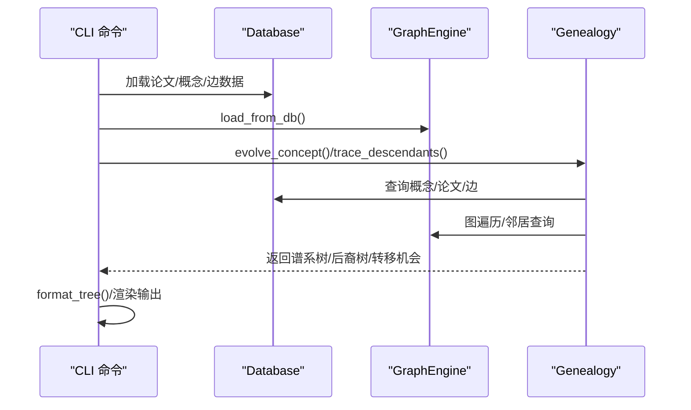

**图表来源**
- [analysis_commands.py:214-306](file://src/drbrain/cli/analysis_commands.py#L214-L306)
- [engine.py:760-785](file://src/drbrain/graph/engine.py#L760-L785)
- [genealogy.py:14-121](file://src/drbrain/graph/genealogy.py#L14-L121)
- [database.py:448-478](file://src/drbrain/storage/database.py#L448-L478)

## 详细组件分析

### 组件A：概念谱系树构建与可视化
- 功能要点
  - evolve_concept：支持 ancestors/descendants/both 三种方向，BFS 扩展，过滤关系集合（如 extends/refines/applies），标注年份与来源章节。
  - _bfs_ancestors/_bfs_descendants：分别自底向上/自顶向下扩展，维护访问集与队列。
  - _reroot_with_ancestors：将祖先链重定向为新的根节点，保留后代结构。
  - format_tree：文本树渲染与 Mermaid 流程图渲染，支持桥接来源标注（via_concept/via_section）。
- 复杂度与优化
  - 单次 BFS 复杂度 O(V+E)，受 max_depth 与关系过滤约束；通过 visited 集合避免重复访问。
  - 可通过批量查询（一次性拉取所有相关概念/论文年份）减少往返开销。
- 使用示例（路径）
  - [evolve_concept:14-71](file://src/drbrain/graph/genealogy.py#L14-L71)
  - [format_tree:273-316](file://src/drbrain/graph/genealogy.py#L273-L316)

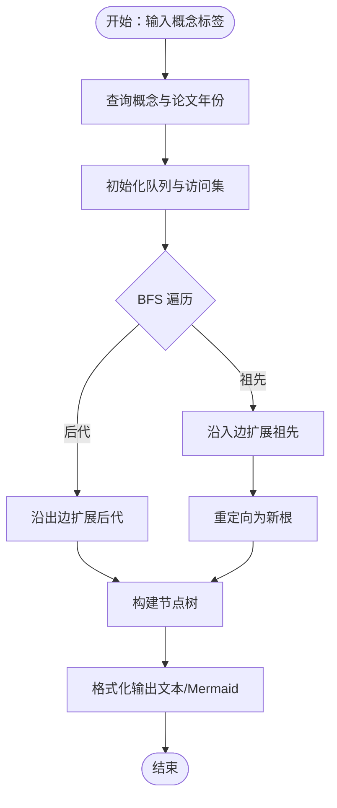

**图表来源**
- [genealogy.py:14-71](file://src/drbrain/graph/genealogy.py#L14-L71)
- [genealogy.py:74-121](file://src/drbrain/graph/genealogy.py#L74-L121)
- [genealogy.py:171-186](file://src/drbrain/graph/genealogy.py#L171-L186)
- [genealogy.py:273-316](file://src/drbrain/graph/genealogy.py#L273-L316)

**章节来源**
- [genealogy.py:14-121](file://src/drbrain/graph/genealogy.py#L14-L121)
- [genealogy.py:273-316](file://src/drbrain/graph/genealogy.py#L273-L316)

### 组件B：论文学术后裔追踪
- 功能要点
  - trace_descendants：从论文出发，遍历其概念，沿“扩展/细化/应用/挑战/引用”关系向下追踪后代论文，标注 via_concept 与 via_section。
  - 采用 BFS，限制 generation 数，避免无限扩展。
- 使用示例（路径）
  - [trace_descendants:189-270](file://src/drbrain/graph/genealogy.py#L189-L270)

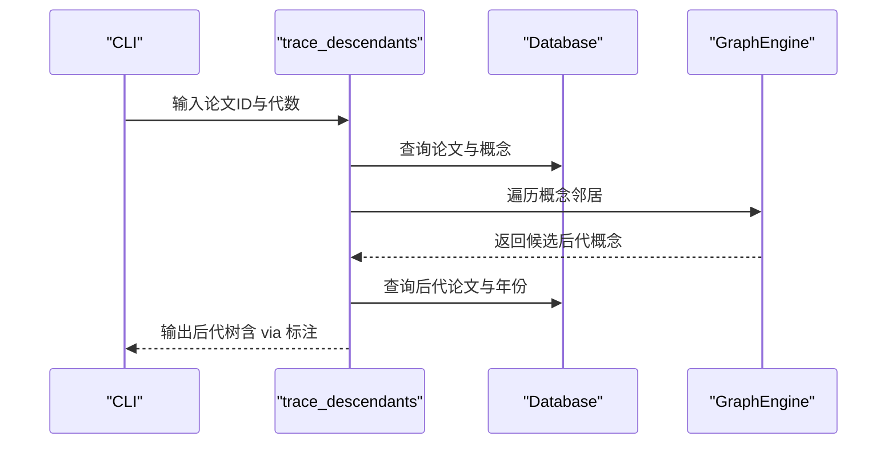

**图表来源**
- [analysis_commands.py:268-306](file://src/drbrain/cli/analysis_commands.py#L268-L306)
- [genealogy.py:189-270](file://src/drbrain/graph/genealogy.py#L189-L270)

**章节来源**
- [genealogy.py:189-270](file://src/drbrain/graph/genealogy.py#L189-L270)
- [analysis_commands.py:268-306](file://src/drbrain/cli/analysis_commands.py#L268-L306)

### 组件C：范式转移检测
- 检测类型
  - 替代（Replacement）：旧概念被挑战且近年发表数量显著下降，新概念发表数量增长。
  - 爆炸（Explosion）：概念在极短时间内大量出现，且存在多个后代概念。
  - 跨域入侵（Cross-Domain）：某方法在目标领域应用后，引发该领域内进一步概念级联。
- 算法流程
  - 读取挑战/应用边，按概念聚合年份计数，计算衰减比例与增长阈值。
  - 对概念进行后代关系检查与级联深度评估。
- 使用示例（路径）
  - [detect_paradigm_shifts:318-494](file://src/drbrain/graph/genealogy.py#L318-L494)

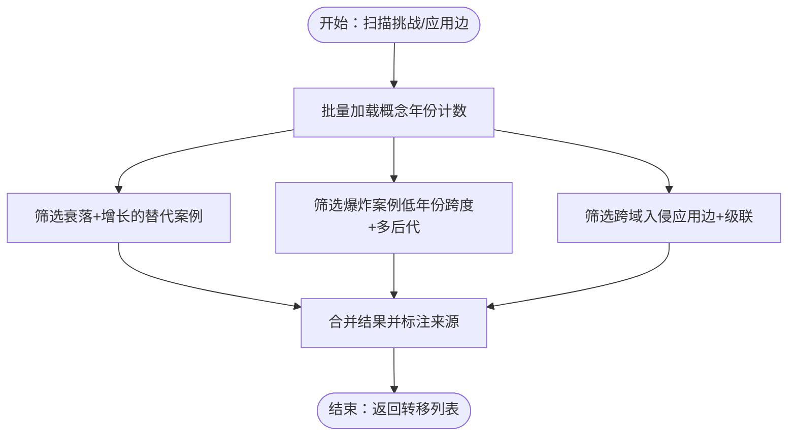

**图表来源**
- [genealogy.py:318-494](file://src/drbrain/graph/genealogy.py#L318-L494)

**章节来源**
- [genealogy.py:318-494](file://src/drbrain/graph/genealogy.py#L318-L494)

### 组件D：跨领域迁移机会检测
- 方法
  - 显式模式：用户提供源论文（方法所在）与目标论文（问题所在），在两者概念间寻找 Method→Problem 的迁移机会。
  - 自动模式：按标签相似度对 Method/Problem 概念进行聚类，跨域配对后打分。
- 评分策略
  - 结合关系签名（Jaccard 相似）与标签相似度（平均 0.5 权重），输出置信度。
- 使用示例（路径）
  - [find_transfer_opportunities:779-809](file://src/drbrain/graph/genealogy.py#L779-L809)
  - [find_transfer_opportunities_auto:812-863](file://src/drbrain/graph/genealogy.py#L812-L863)
  - [find_transfer_history:953-1000](file://src/drbrain/graph/genealogy.py#L953-L1000)

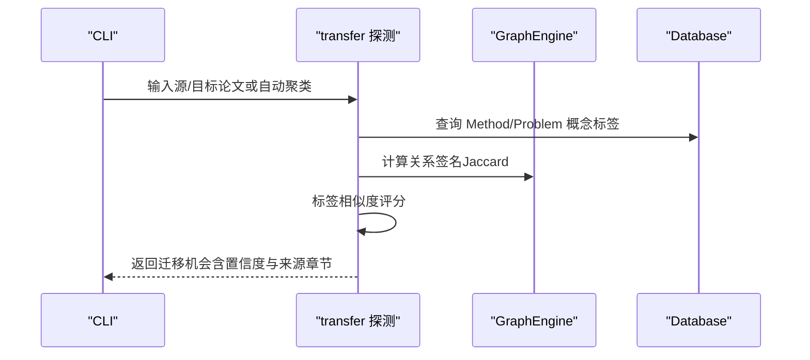

**图表来源**
- [analysis_commands.py:398-547](file://src/drbrain/cli/analysis_commands.py#L398-L547)
- [genealogy.py:779-863](file://src/drbrain/graph/genealogy.py#L779-L863)
- [genealogy.py:953-1000](file://src/drbrain/graph/genealogy.py#L953-L1000)

**章节来源**
- [genealogy.py:779-863](file://src/drbrain/graph/genealogy.py#L779-L863)
- [analysis_commands.py:398-547](file://src/drbrain/cli/analysis_commands.py#L398-L547)

### 组件E：领域景观与前沿扫描
- landscape_workspace：生成领域时间线（按年排序）、持久性缺口与争议区。
- analyze_frontier：综合活跃缺口、争议、范式转移、难度分布与近期信号，输出复合报告摘要。
- analyze_difficulty：按来源章节类型对 Gap 进行难度分类（限制、未来工作、讨论、未分类）。
- 使用示例（路径）
  - [landscape_workspace:540-632](file://src/drbrain/graph/genealogy.py#L540-L632)
  - [analyze_frontier:684-753](file://src/drbrain/graph/genealogy.py#L684-L753)
  - [analyze_difficulty:635-681](file://src/drbrain/graph/genealogy.py#L635-L681)

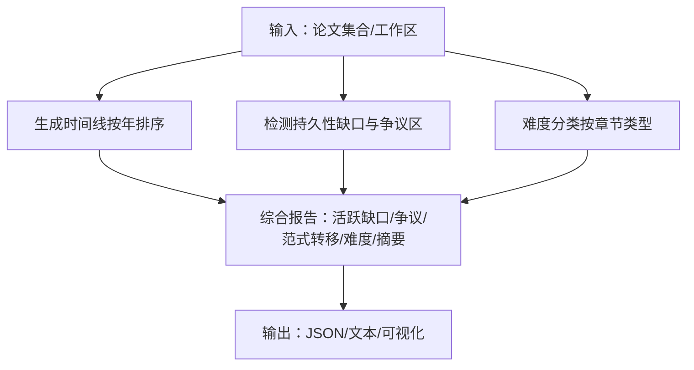

**图表来源**
- [genealogy.py:540-632](file://src/drbrain/graph/genealogy.py#L540-L632)
- [genealogy.py:635-753](file://src/drbrain/graph/genealogy.py#L635-L753)

**章节来源**
- [genealogy.py:540-753](file://src/drbrain/graph/genealogy.py#L540-L753)

### 组件F：时间演进分析与信号分类
- detect_evolution_signals：按年度统计与平均置信度，给出信号类型（新兴/稳定/衰落/争议/复苏）。
- get_concept_evolution：返回年度计数与趋势（首次出现/增长/下降/稳定）。
- 使用示例（路径）
  - [detect_evolution_signals:621-687](file://src/drbrain/storage/database.py#L621-L687)
  - [get_concept_evolution:748-774](file://src/drbrain/storage/database.py#L748-L774)

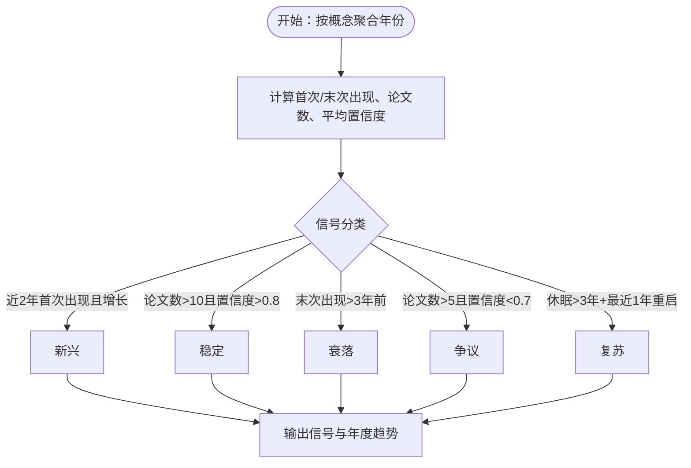

**图表来源**
- [database.py:621-687](file://src/drbrain/storage/database.py#L621-L687)
- [database.py:748-774](file://src/drbrain/storage/database.py#L748-L774)

**章节来源**
- [database.py:621-774](file://src/drbrain/storage/database.py#L621-L774)

### 组件G：关系规则挖掘与路径规则
- mine_path_rules：基于 TransE 向量加法（h + r1 + r2 ≈ t）发现可组合关系，使用余弦相似度评分。
- mine_from_graph_walks：通过图游走统计频繁关系序列，结合向量空间映射得到规则头。
- 使用示例（路径）
  - [mine_path_rules:33-105](file://src/drbrain/extractor/rule_miner.py#L33-L105)
  - [mine_from_graph_walks:137-197](file://src/drbrain/extractor/rule_miner.py#L137-L197)

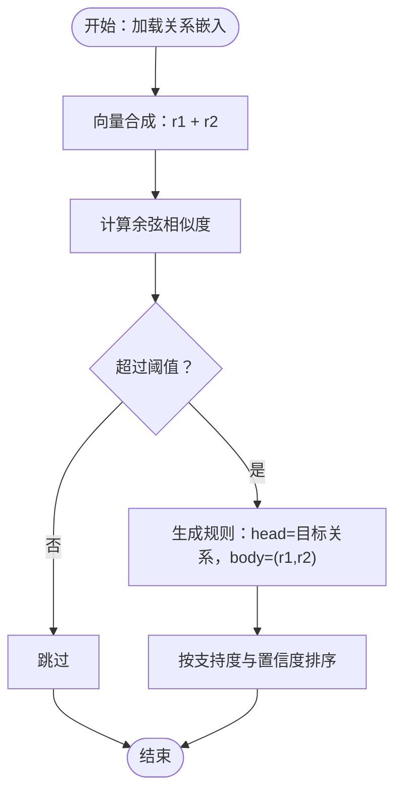

**图表来源**
- [rule_miner.py:33-105](file://src/drbrain/extractor/rule_miner.py#L33-L105)
- [rule_miner.py:137-197](file://src/drbrain/extractor/rule_miner.py#L137-L197)

**章节来源**
- [rule_miner.py:33-197](file://src/drbrain/extractor/rule_miner.py#L33-L197)

### 组件H：因果链提取与报告整合
- causal_chain：基于 ExtractedArgument 的机制字段，构建 X→Y(via Z) 的因果链，支持路径查找与排序。
- analyzer：整合种子、因果链、假设、反事实、同构模式等，生成报告与执行摘要。
- 使用示例（路径）
  - [causal_chain:63-150](file://src/drbrain/extractor/causal_chain.py#L63-L150)
  - [analyzer:9-134](file://src/drbrain/report/analyzer.py#L9-L134)

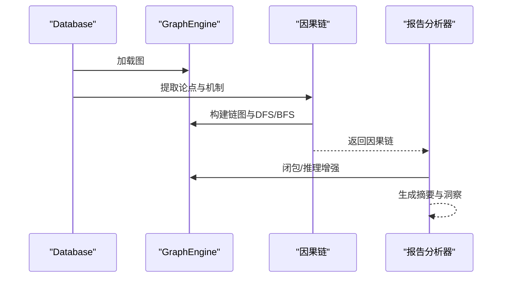

**图表来源**
- [analyzer.py:9-134](file://src/drbrain/report/analyzer.py#L9-L134)
- [causal_chain.py:63-150](file://src/drbrain/extractor/causal_chain.py#L63-L150)

**章节来源**
- [analyzer.py:9-134](file://src/drbrain/report/analyzer.py#L9-L134)
- [causal_chain.py:63-150](file://src/drbrain/extractor/causal_chain.py#L63-L150)

## 依赖分析
- 组件耦合
  - genealogy 依赖 GraphEngine（图遍历、邻居查询）与 Database（概念/论文/边查询）。
  - analyzer 依赖 GraphEngine 与 Database，同时依赖抽取模块（argument、causal_chain、isomorphism）。
  - rule_miner 依赖 GraphEngine 与嵌入加载工具，用于关系向量合成与规则评分。
- 外部依赖
  - NetworkX：MultiDiGraph 实现与遍历。
  - NumPy：向量运算与相似度计算。
  - SQLite：持久化存储与 SQL 查询。
- 潜在循环依赖
  - 当前模块间为单向依赖（CLI→GraphEngine→Database），未见循环导入。

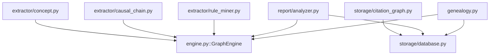

**图表来源**
- [genealogy.py:10-11](file://src/drbrain/graph/genealogy.py#L10-L11)
- [engine.py:33-44](file://src/drbrain/graph/engine.py#L33-L44)
- [database.py:159-168](file://src/drbrain/storage/database.py#L159-L168)
- [analyzer.py:5-6](file://src/drbrain/report/analyzer.py#L5-L6)
- [rule_miner.py:56-58](file://src/drbrain/extractor/rule_miner.py#L56-L58)
- [causal_chain.py:13-13](file://src/drbrain/extractor/causal_chain.py#L13-L13)
- [concept.py:14-16](file://src/drbrain/extractor/concept.py#L14-L16)
- [citation_graph.py:5-5](file://src/drbrain/storage/citation_graph.py#L5-L5)

**章节来源**
- [genealogy.py:10-11](file://src/drbrain/graph/genealogy.py#L10-L11)
- [engine.py:33-44](file://src/drbrain/graph/engine.py#L33-L44)
- [database.py:159-168](file://src/drbrain/storage/database.py#L159-L168)

## 性能考虑
- 图遍历优化
  - BFS 深度控制与访问集去重，避免重复扩展。
  - 批量查询（如按概念标签批量统计年份计数）降低数据库往返。
- 规则挖掘
  - 向量合成与相似度计算可缓存常用向量，减少重复计算。
  - 支持 top-k 截断与阈值剪枝，控制规则规模。
- 内存与索引
  - SQLite 索引（如 concepts.label、edges.relation）提升查询效率。
  - 大规模图建议分批加载与增量闭包。

## 故障排查指南
- 常见问题
  - 概念未找到：确认概念标签大小写与别名映射，检查 Database 中 concepts 表。
  - 图为空：确认 GraphEngine 已从 Database 正确加载边。
  - 年份缺失：确保 papers 表中 year 字段已填充，否则演进分析会跳过该条目。
  - 转移机会为空：检查 Method/Problem 概念是否存在，或调整 min_confidence 与聚类阈值。
- 定位手段
  - 使用 CLI 的 --json 选项输出结构化结果，便于调试。
  - 在 genealogy 与 database 的关键查询处添加日志，观察中间结果。
  - 对大规模查询使用 LIMIT 与采样，逐步缩小范围。

**章节来源**
- [analysis_commands.py:214-396](file://src/drbrain/cli/analysis_commands.py#L214-L396)
- [database.py:448-478](file://src/drbrain/storage/database.py#L448-L478)

## 结论
基因谱分析模块通过“谱系树构建—学术后裔追踪—范式转移检测—跨域迁移—前沿扫描—时间演进—规则挖掘”的完整链路，实现了对研究演进路径的系统化识别与可视化呈现。模块以 GraphEngine 为核心，结合 Database 的时间与语义信息，为知识图谱驱动的研究前沿洞察提供了稳健、可扩展的技术基础。

## 附录
- CLI 常用命令
  - 演化路径：drbrain evolve "<概念>" [--direction both/ancestors/descendants] [--max-depth N] [--mermaid/--json/--stats]
  - 学术后裔：drbrain descendants <论文ID> [--generations N] [--mermaid/--json/--sections]
  - 领域景观：drbrain landscape [--workspace WS] [--top-n N] [--json]
  - 范式转移：drbrain paradigm [--workspace WS] [--json]
  - 跨域迁移：drbrain transfers [--from WS --to WS | --auto | --history] [--min-confidence 0.x] [--sections/--json]
  - 难度分布：drbrain difficulty [--json]
  - 知识前沿：drbrain frontier [--json]