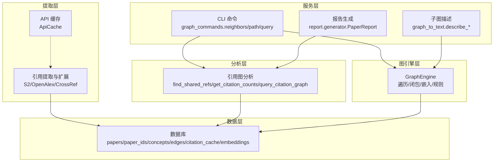
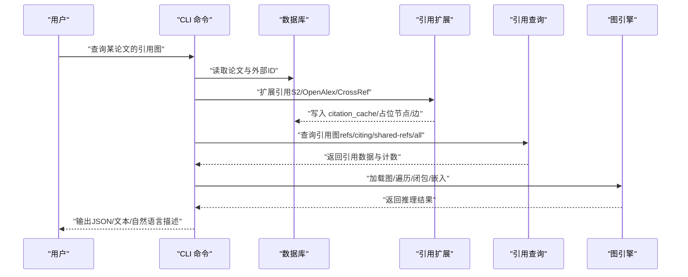
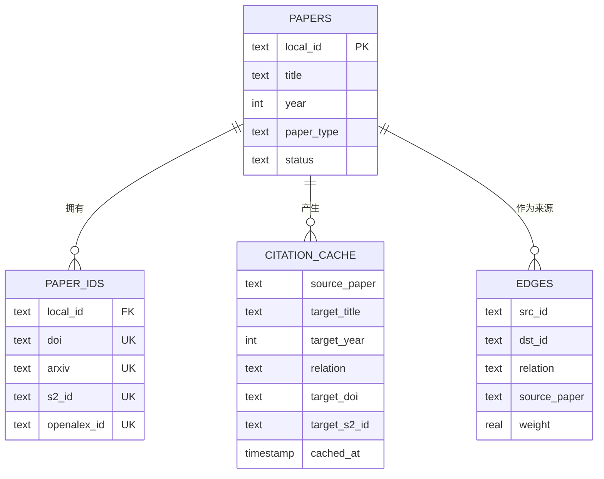
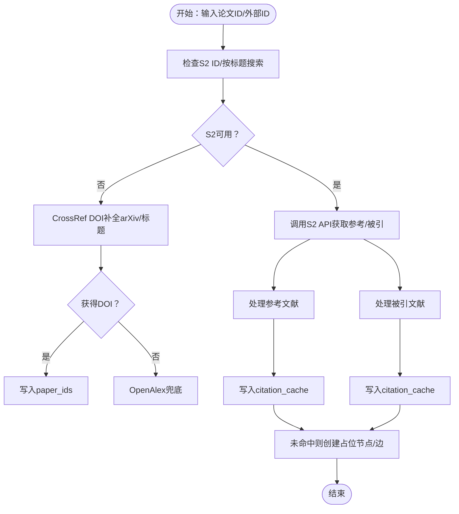
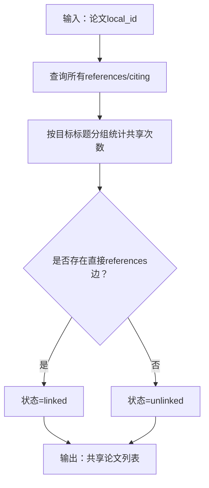
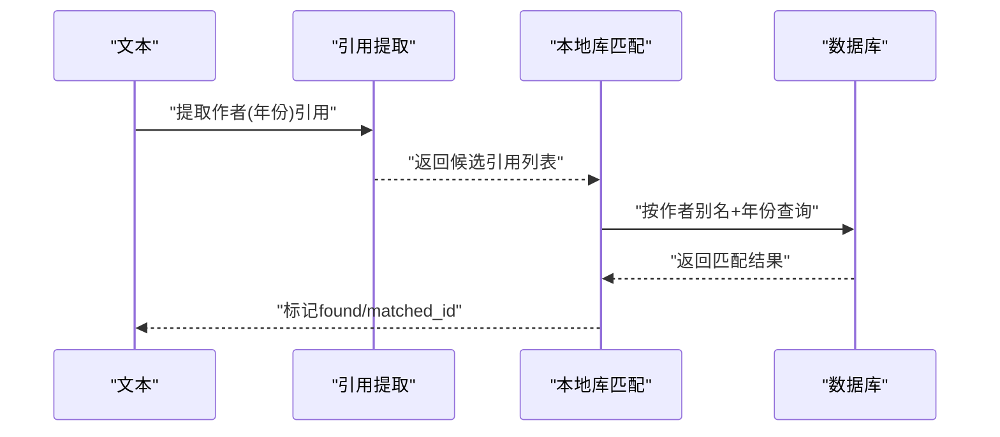
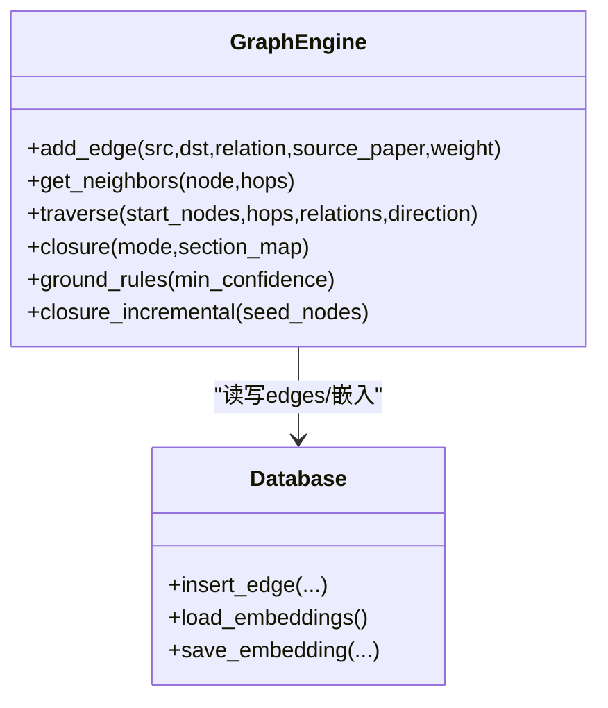
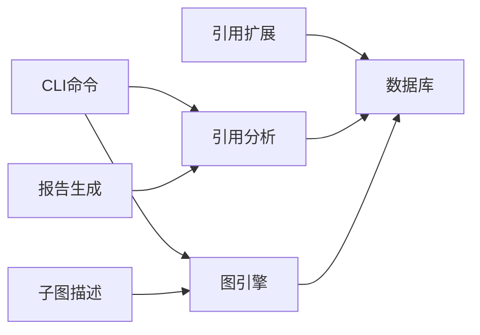

# 引用图谱

<cite>
**本文档引用的文件**
- [src/drbrain/storage/citation_graph.py](file://src/drbrain/storage/citation_graph.py)
- [src/drbrain/extractor/citation.py](file://src/drbrain/extractor/citation.py)
- [src/drbrain/extractor/citation_check.py](file://src/drbrain/extractor/citation_check.py)
- [src/drbrain/storage/database.py](file://src/drbrain/storage/database.py)
- [src/drbrain/graph/engine.py](file://src/drbrain/graph/engine.py)
- [src/drbrain/cli/graph_commands.py](file://src/drbrain/cli/graph_commands.py)
- [src/drbrain/services/graph_to_text.py](file://src/drbrain/services/graph_to_text.py)
- [src/drbrain/extractor/cache.py](file://src/drbrain/extractor/cache.py)
- [src/drbrain/report/generator.py](file://src/drbrain/report/generator.py)
- [skills/citation-tracking/SKILL.md](file://skills/citation-tracking/SKILL.md)
- [tests/test_citation_graph.py](file://tests/test_citation_graph.py)
- [tests/test_citation.py](file://tests/test_citation.py)
- [tests/test_citation_check.py](file://tests/test_citation_check.py)
</cite>

## 目录
1. [简介](#简介)
2. [项目结构](#项目结构)
3. [核心组件](#核心组件)
4. [架构总览](#架构总览)
5. [详细组件分析](#详细组件分析)
6. [依赖关系分析](#依赖关系分析)
7. [性能考量](#性能考量)
8. [故障排查指南](#故障排查指南)
9. [结论](#结论)
10. [附录](#附录)

## 简介
本技术文档聚焦 DrBrain 的“引用图谱”模块，系统阐述引用关系的建模方式、引用网络的构建算法、引用强度的量化机制，以及引用传递、间接引用与引用偏移的检测方法。文档还覆盖引用图的动态更新流程、引用验证与异常检测能力，并给出与论文元数据的集成关系、引用统计指标与可视化方法。最后提供维护策略、性能优化与质量保证建议。

## 项目结构
引用图谱相关能力由以下层次构成：
- 数据层：SQLite 模式定义与引用缓存表（citation_cache），用于持久化引用关系与元数据。
- 提取层：从外部知识库（S2/OpenAlex/CrossRef）抓取引用信息，匹配本地库并生成占位节点。
- 分析层：基于引用缓存进行共享引用、共引等分析；提供引用计数与图查询接口。
- 图引擎层：以 NetworkX 为内存图，支持遍历、闭包推理、嵌入学习与路径规则推断。
- 命令行与服务层：CLI 查询命令、自然语言子图描述服务，以及报告生成器输出统计摘要。

图表来源
- [src/drbrain/storage/database.py:10-156](file://src/drbrain/storage/database.py#L10-L156)
- [src/drbrain/extractor/citation.py:1-710](file://src/drbrain/extractor/citation.py#L1-L710)
- [src/drbrain/storage/citation_graph.py:1-129](file://src/drbrain/storage/citation_graph.py#L1-L129)
- [src/drbrain/graph/engine.py:1-1118](file://src/drbrain/graph/engine.py#L1-L1118)
- [src/drbrain/cli/graph_commands.py:1-756](file://src/drbrain/cli/graph_commands.py#L1-L756)
- [src/drbrain/services/graph_to_text.py:1-145](file://src/drbrain/services/graph_to_text.py#L1-L145)
- [src/drbrain/report/generator.py:1-50](file://src/drbrain/report/generator.py#L1-L50)

章节来源
- [src/drbrain/storage/database.py:10-156](file://src/drbrain/storage/database.py#L10-L156)
- [src/drbrain/extractor/citation.py:1-710](file://src/drbrain/extractor/citation.py#L1-L710)
- [src/drbrain/storage/citation_graph.py:1-129](file://src/drbrain/storage/citation_graph.py#L1-L129)
- [src/drbrain/graph/engine.py:1-1118](file://src/drbrain/graph/engine.py#L1-L1118)
- [src/drbrain/cli/graph_commands.py:1-756](file://src/drbrain/cli/graph_commands.py#L1-L756)
- [src/drbrain/services/graph_to_text.py:1-145](file://src/drbrain/services/graph_to_text.py#L1-L145)
- [src/drbrain/report/generator.py:1-50](file://src/drbrain/report/generator.py#L1-L50)

## 核心组件
- 引用缓存与查询
  - 引用缓存表：存储“源论文-目标标题/年份/DOI/关系”等，支持“references”和“citing”两类关系。
  - 引用查询函数：按论文 ID 返回参考文献、被引文献、共享引用及计数。
- 引用扩展与匹配
  - 多源 API 扩展：优先 S2，回退 CrossRef/OpenAlex；批量去重、占位节点创建、边插入。
  - 匹配逻辑：DOI/arXiv/S2/OpenAlex/标题+年份多策略匹配，未命中时创建“placeholder”论文。
- 引用分析
  - 共享引用发现：统计共享参考文献数量，标注是否直接存在“references”边。
  - 引用计数：返回某篇论文的参考文献数与被引数。
- 图引擎与推理
  - 遍历：支持多跳邻居搜索、方向控制与关系过滤。
  - 闭包：基于规则推断新关系，结合置信度传播与可选嵌入评分融合。
  - 嵌入：TransE 训练与相似性检索，支持增量训练与持久化。
- 可视化与报告
  - 子图自然语言描述：将遍历路径转换为自然语言句式。
  - 报告摘要：统计“在图中的引用/被引”覆盖率。

章节来源
- [src/drbrain/storage/citation_graph.py:8-129](file://src/drbrain/storage/citation_graph.py#L8-L129)
- [src/drbrain/extractor/citation.py:231-710](file://src/drbrain/extractor/citation.py#L231-L710)
- [src/drbrain/storage/database.py:132-141](file://src/drbrain/storage/database.py#L132-L141)
- [src/drbrain/graph/engine.py:33-315](file://src/drbrain/graph/engine.py#L33-L315)
- [src/drbrain/services/graph_to_text.py:6-145](file://src/drbrain/services/graph_to_text.py#L6-L145)
- [src/drbrain/report/generator.py:10-50](file://src/drbrain/report/generator.py#L10-L50)

## 架构总览
引用图谱的端到端流程如下：
- 输入：论文本地 ID 或外部标识（DOI/arXiv/S2/OpenAlex）。
- 扩展：调用外部 API 获取参考文献与被引文献，写入 citation_cache 并创建占位节点。
- 查询：通过引用查询函数聚合参考、被引与共享引用。
- 推理：加载图到内存，执行遍历与闭包推理，必要时训练嵌入。
- 展示：CLI 查询命令与自然语言描述服务输出结果；报告生成器输出统计摘要。

图表来源
- [src/drbrain/cli/graph_commands.py:153-264](file://src/drbrain/cli/graph_commands.py#L153-L264)
- [src/drbrain/extractor/citation.py:231-400](file://src/drbrain/extractor/citation.py#L231-L400)
- [src/drbrain/storage/citation_graph.py:74-129](file://src/drbrain/storage/citation_graph.py#L74-L129)
- [src/drbrain/graph/engine.py:760-785](file://src/drbrain/graph/engine.py#L760-L785)

## 详细组件分析

### 组件一：引用关系建模与缓存
- 数据模型
  - 引用缓存表：主键为（source_paper, target_title），确保同一论文对同一参考条目的唯一缓存。
  - 关系类型：references（引用）、citing（被引）。
- 写入策略
  - 扩展时先写缓存，再根据匹配结果决定是否创建占位节点与边。
  - 对于未命中的参考/被引，生成临时 local_id 并插入占位论文，同时插入 edges 表。
- 读取策略
  - 引用查询函数按 ctype 返回不同视图；共享引用分析通过 JOIN citation_cache 统计共享参考数量。

图表来源
- [src/drbrain/storage/database.py:10-156](file://src/drbrain/storage/database.py#L10-L156)

章节来源
- [src/drbrain/storage/database.py:132-141](file://src/drbrain/storage/database.py#L132-L141)
- [src/drbrain/storage/citation_graph.py:59-71](file://src/drbrain/storage/citation_graph.py#L59-L71)
- [src/drbrain/extractor/citation.py:519-534](file://src/drbrain/extractor/citation.py#L519-L534)

### 组件二：引用网络构建算法
- 外部 API 扩展
  - 优先使用 S2 API，若无 S2 ID 则按标题搜索；若 S2 返回数据但无 DOI，则尝试 CrossRef 标题或 arXiv 补全 DOI。
  - 回退策略：若 S2 429/无数据，尝试 CrossRef DOI 补全；随后使用 OpenAlex 批量获取 referenced_works。
  - 批量去重：以“标题前缀”为键去重，避免重复写入。
- 占位节点与边插入
  - 未命中的参考/被引自动创建“placeholder”论文，插入 paper_ids 与 edges。
  - 插入 edges 时使用 INSERT OR IGNORE，避免重复。
- 多源融合
  - 同时从 OpenAlex、S2、CrossRef 源拉取，统一写入 citation_cache，最终形成更完整的引用网络。

图表来源
- [src/drbrain/extractor/citation.py:231-400](file://src/drbrain/extractor/citation.py#L231-L400)
- [src/drbrain/extractor/citation.py:440-517](file://src/drbrain/extractor/citation.py#L440-L517)
- [src/drbrain/extractor/citation.py:519-710](file://src/drbrain/extractor/citation.py#L519-L710)

章节来源
- [src/drbrain/extractor/citation.py:231-710](file://src/drbrain/extractor/citation.py#L231-L710)
- [tests/test_citation.py:152-187](file://tests/test_citation.py#L152-L187)

### 组件三：引用强度量化与共享引用分析
- 共享引用
  - 通过 JOIN citation_cache 统计“相同目标标题”的出现次数，得到共享计数。
  - 若两张论文之间不存在“references”直接边，则标记为“unlinked”，否则为“linked”。
  - 输出包含共享论文列表，便于进一步分析“知识前沿信号”。
- 引用计数
  - 分别统计“references”和“citing”数量，用于衡量论文的“贡献度/影响力”。

图表来源
- [src/drbrain/storage/citation_graph.py:8-56](file://src/drbrain/storage/citation_graph.py#L8-L56)
- [src/drbrain/storage/citation_graph.py:59-71](file://src/drbrain/storage/citation_graph.py#L59-L71)

章节来源
- [src/drbrain/storage/citation_graph.py:8-71](file://src/drbrain/storage/citation_graph.py#L8-L71)
- [tests/test_citation_graph.py:12-142](file://tests/test_citation_graph.py#L12-L142)

### 组件四：引用传递、间接引用与引用偏移检测
- 引用传递
  - 通过图遍历（neighbors/path）实现“N 跳”邻域探索，识别潜在的间接引用链。
- 间接引用
  - 共享引用分析可发现“未直接引用但共享参考”的论文，形成“间接连接”。
- 引用偏移
  - 通过“被引”集合与“参考”集合的交叉比对，识别可能的引用偏移（例如：应引用而未引用、引用了错误文献）。
- 验证与匹配
  - 文本中引用的作者-年份模式提取后，与本地库按作者别名与年份匹配，未命中则提示偏移风险。

图表来源
- [src/drbrain/extractor/citation_check.py:57-124](file://src/drbrain/extractor/citation_check.py#L57-L124)

章节来源
- [src/drbrain/extractor/citation_check.py:57-124](file://src/drbrain/extractor/citation_check.py#L57-L124)
- [tests/test_citation_check.py:78-103](file://tests/test_citation_check.py#L78-L103)

### 组件五：动态更新与增量闭包
- 动态更新
  - 扩展完成后，立即写入 citation_cache 与 edges，保持引用缓存与图边的一致性。
  - 支持占位节点的后续升级（placeholder -> uploaded）。
- 增量闭包
  - 仅对与种子节点相关的子图运行闭包规则，减少全图扫描开销。
  - 规则包括：争议与辩论、缺口填补、方法演进、共同作者网络、传递闭包与路径规则等。

图表来源
- [src/drbrain/graph/engine.py:33-315](file://src/drbrain/graph/engine.py#L33-L315)
- [src/drbrain/storage/database.py:367-416](file://src/drbrain/storage/database.py#L367-L416)

章节来源
- [src/drbrain/graph/engine.py:124-315](file://src/drbrain/graph/engine.py#L124-L315)
- [src/drbrain/storage/database.py:367-416](file://src/drbrain/storage/database.py#L367-L416)

### 组件六：与论文元数据的集成与报告
- 元数据集成
  - 引用扩展会回填外部 ID（如 DOI/arXiv/S2/OpenAlex），并更新 paper_ids。
  - 引用查询返回的引用项包含标题、年份与 DOI，便于下游分析。
- 报告生成
  - PaperReport 提供“在图中的引用/被引”覆盖率统计，辅助质量评估。
- 可视化
  - CLI 提供 neighbors/path/describe 等命令，支持 JSON 输出与自然语言描述。

章节来源
- [src/drbrain/extractor/citation.py:290-400](file://src/drbrain/extractor/citation.py#L290-L400)
- [src/drbrain/report/generator.py:21-50](file://src/drbrain/report/generator.py#L21-L50)
- [src/drbrain/cli/graph_commands.py:20-264](file://src/drbrain/cli/graph_commands.py#L20-L264)

## 依赖关系分析
- 组件耦合
  - 引用扩展依赖数据库写入与外部 API 客户端；分析模块依赖数据库只读查询；图引擎依赖数据库加载与持久化。
- 外部依赖
  - S2 API、OpenAlex、CrossRef；NetworkX、NumPy；SQLite。
- 可能的循环依赖
  - 当前模块间为单向依赖（扩展->数据库；分析->数据库；图引擎->数据库），未见循环。

图表来源
- [src/drbrain/extractor/citation.py:1-710](file://src/drbrain/extractor/citation.py#L1-L710)
- [src/drbrain/storage/citation_graph.py:1-129](file://src/drbrain/storage/citation_graph.py#L1-L129)
- [src/drbrain/graph/engine.py:1-1118](file://src/drbrain/graph/engine.py#L1-L1118)
- [src/drbrain/cli/graph_commands.py:1-756](file://src/drbrain/cli/graph_commands.py#L1-L756)
- [src/drbrain/services/graph_to_text.py:1-145](file://src/drbrain/services/graph_to_text.py#L1-L145)
- [src/drbrain/report/generator.py:1-50](file://src/drbrain/report/generator.py#L1-L50)

章节来源
- [src/drbrain/extractor/citation.py:1-710](file://src/drbrain/extractor/citation.py#L1-L710)
- [src/drbrain/storage/citation_graph.py:1-129](file://src/drbrain/storage/citation_graph.py#L1-L129)
- [src/drbrain/graph/engine.py:1-1118](file://src/drbrain/graph/engine.py#L1-L1118)
- [src/drbrain/cli/graph_commands.py:1-756](file://src/drbrain/cli/graph_commands.py#L1-L756)
- [src/drbrain/services/graph_to_text.py:1-145](file://src/drbrain/services/graph_to_text.py#L1-L145)
- [src/drbrain/report/generator.py:1-50](file://src/drbrain/report/generator.py#L1-L50)

## 性能考量
- I/O 与索引
  - 建议在 relation、src_id、edges 主键上建立索引，加速遍历与闭包查询。
- 批量写入
  - 扩展阶段采用批量插入与占位节点合并提交，减少事务开销。
- 缓存
  - 使用 ApiCache 缓存外部 API 响应，降低重复请求与速率限制影响。
- 增量闭包
  - 仅对种子节点相关子图运行闭包，显著降低计算复杂度。
- 嵌入训练
  - 支持增量训练与持久化，避免每次从零训练带来的成本。

章节来源
- [src/drbrain/storage/database.py:115-122](file://src/drbrain/storage/database.py#L115-L122)
- [src/drbrain/extractor/cache.py:14-65](file://src/drbrain/extractor/cache.py#L14-L65)
- [src/drbrain/graph/engine.py:787-806](file://src/drbrain/graph/engine.py#L787-L806)

## 故障排查指南
- 常见问题
  - S2 429/超时：扩展函数内置指数退避重试；检查配置中的速率限制与缓存设置。
  - 未匹配到 DOI：确认 CrossRef 邮箱配置与标题/年份一致性；必要时手动回填。
  - 占位节点未升级：确认 placeholder -> uploaded 的状态迁移逻辑已执行。
  - 共享引用为空：检查 citation_cache 是否正确写入，或论文是否参与了共享。
- 调试建议
  - 使用 CLI neighbors/path/describe 查看中间结果与路径描述。
  - 开启日志查看扩展与闭包过程中的警告与耗时信息。
  - 使用测试用例验证关键路径（如共享引用、计数、匹配）。

章节来源
- [src/drbrain/extractor/citation.py:93-147](file://src/drbrain/extractor/citation.py#L93-L147)
- [src/drbrain/cli/graph_commands.py:20-264](file://src/drbrain/cli/graph_commands.py#L20-L264)
- [tests/test_citation_graph.py:12-142](file://tests/test_citation_graph.py#L12-L142)
- [tests/test_citation_check.py:78-103](file://tests/test_citation_check.py#L78-L103)

## 结论
DrBrain 的引用图谱模块通过“外部 API 扩展 + 引用缓存 + 图引擎推理 + 可视化与报告”的完整链路，实现了对论文引用关系的建模、分析与动态维护。其共享引用发现、引用计数与自然语言描述等功能，为识别知识前沿、验证引用完整性提供了有效工具。配合增量闭包与嵌入学习，系统在可扩展性与准确性之间取得平衡。

## 附录
- 实际使用示例（以路径代替具体代码）
  - 引用关系提取与扩展：[src/drbrain/extractor/citation.py:231-400](file://src/drbrain/extractor/citation.py#L231-L400)
  - 引用网络构建与占位节点插入：[src/drbrain/extractor/citation.py:315-398](file://src/drbrain/extractor/citation.py#L315-L398)
  - 引用查询与共享引用分析：[src/drbrain/storage/citation_graph.py:74-129](file://src/drbrain/storage/citation_graph.py#L74-L129)
  - 图遍历与闭包推理：[src/drbrain/graph/engine.py:62-315](file://src/drbrain/graph/engine.py#L62-L315)
  - CLI 查询命令：[src/drbrain/cli/graph_commands.py:20-264](file://src/drbrain/cli/graph_commands.py#L20-L264)
  - 自然语言子图描述：[src/drbrain/services/graph_to_text.py:70-145](file://src/drbrain/services/graph_to_text.py#L70-L145)
  - 报告生成与覆盖率统计：[src/drbrain/report/generator.py:21-50](file://src/drbrain/report/generator.py#L21-L50)
  - 技能说明（Citation Tracking）：[skills/citation-tracking/SKILL.md:1-25](file://skills/citation-tracking/SKILL.md#L1-L25)