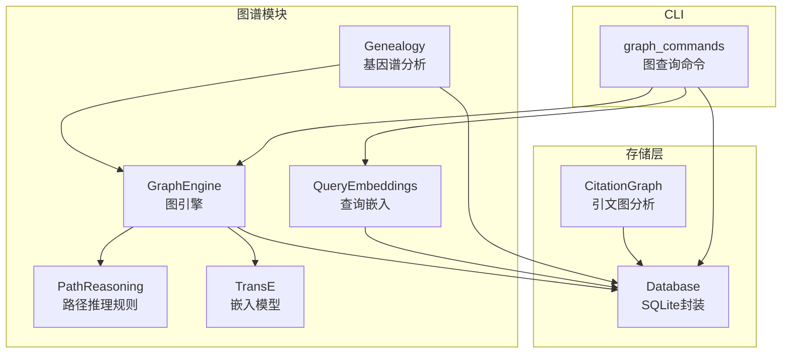
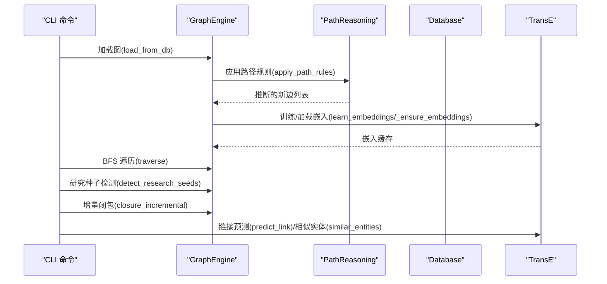
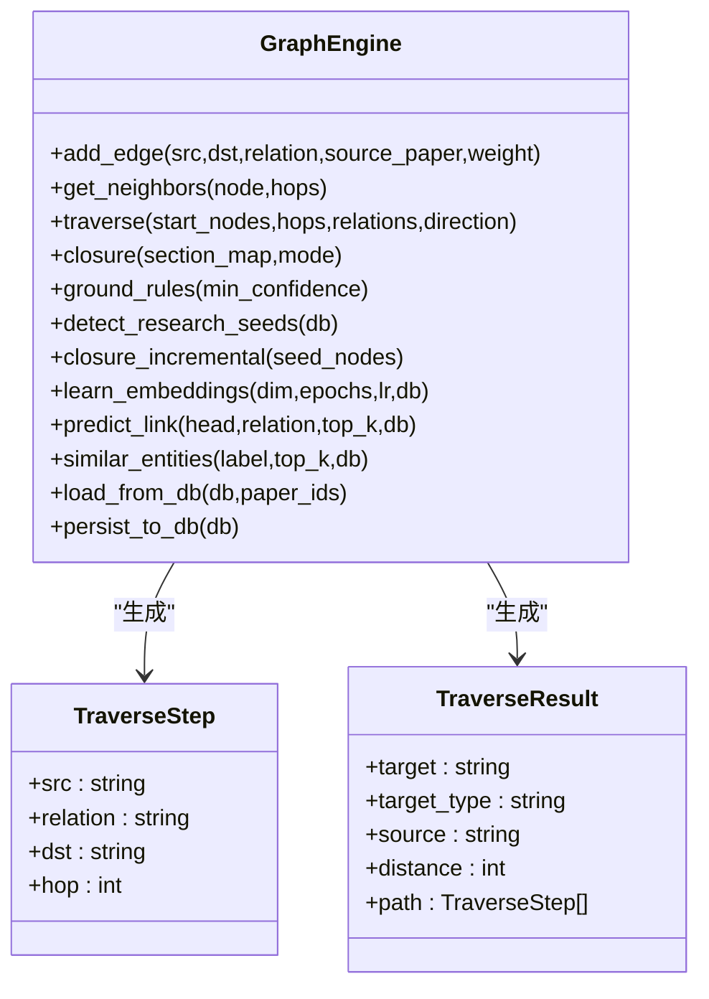
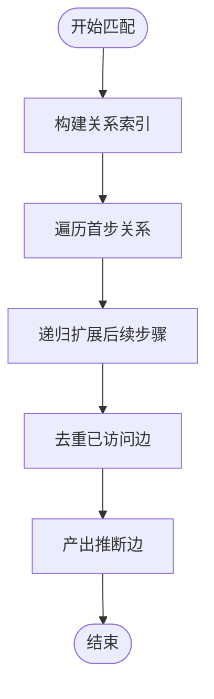
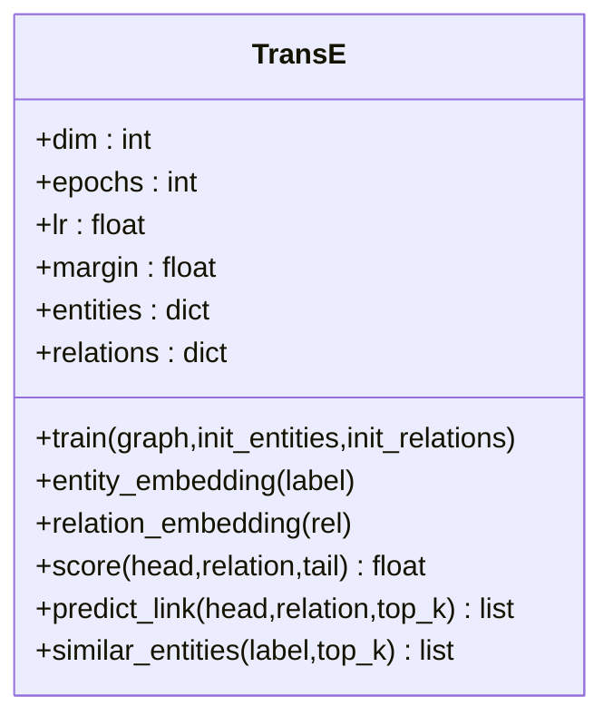
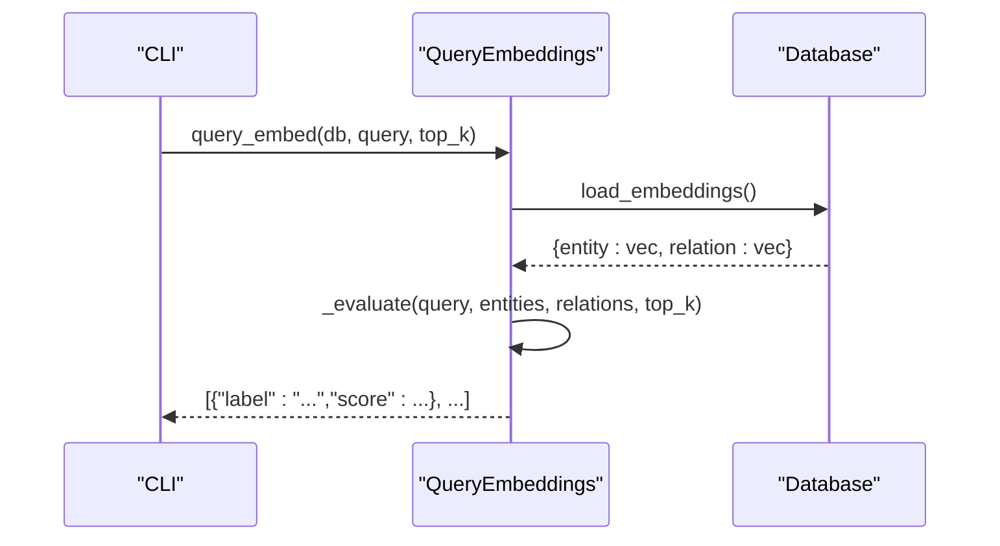
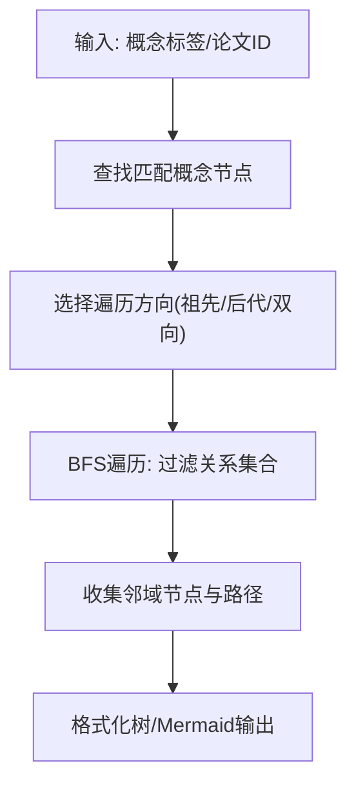
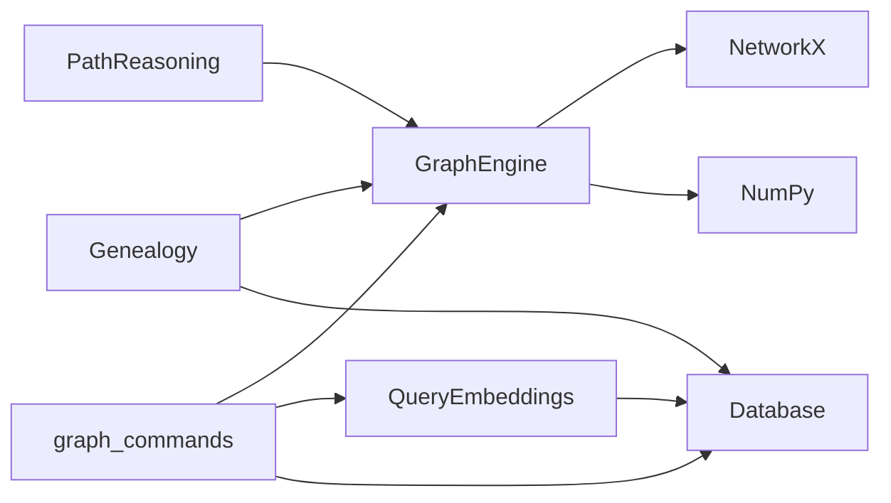

# 知识图谱模块

<cite>
**本文引用的文件**
- [engine.py](file://src/drbrain/graph/engine.py)
- [genealogy.py](file://src/drbrain/graph/genealogy.py)
- [path_reasoning.py](file://src/drbrain/graph/path_reasoning.py)
- [embedding.py](file://src/drbrain/graph/embedding.py)
- [query_embeddings.py](file://src/drbrain/graph/query_embeddings.py)
- [database.py](file://src/drbrain/storage/database.py)
- [citation_graph.py](file://src/drbrain/storage/citation_graph.py)
- [graph_commands.py](file://src/drbrain/cli/graph_commands.py)
- [2026-05-02-graph-related-design.md](file://docs/superpowers/specs/2026-05-02-graph-related-design.md)
- [2026-05-02-graph-search-phase1-design.md](file://docs/superpowers/specs/2026-05-02-graph-search-phase1-design.md)
- [test_graph_engine.py](file://tests/test_graph_engine.py)
- [test_path_reasoning.py](file://tests/test_path_reasoning.py)
- [test_query_embeddings.py](file://tests/test_query_embeddings.py)
- [test_genealogy.py](file://tests/test_genealogy.py)
- [README.md](file://README.md)
</cite>

## 目录
1. [简介](#简介)
2. [项目结构](#项目结构)
3. [核心组件](#核心组件)
4. [架构总览](#架构总览)
5. [详细组件分析](#详细组件分析)
6. [依赖关系分析](#依赖关系分析)
7. [性能考虑](#性能考虑)
8. [故障排除指南](#故障排除指南)
9. [结论](#结论)
10. [附录](#附录)

## 简介
本技术文档聚焦 DrBrain 的知识图谱模块，系统阐述图引擎设计、基因谱分析（概念谱系与论文后代）、路径推理与嵌入训练机制。内容覆盖：
- 图构建算法与节点关系处理
- 图遍历策略与推理规则应用
- 图嵌入实现原理、查询嵌入技术与知识传播算法
- 与存储系统的集成关系、数据一致性与并发控制
- 实际代码示例路径、最佳实践、性能调优与故障排除

## 项目结构
知识图谱模块位于 src/drbrain/graph 下，围绕 GraphEngine 核心类展开，辅以基因谱分析工具、路径推理规则、嵌入训练与查询嵌入等子模块；存储层通过 SQLite 数据库提供持久化与 Schema 管理。

图表来源
- [engine.py:33-122](file://src/drbrain/graph/engine.py#L33-L122)
- [path_reasoning.py:24-55](file://src/drbrain/graph/path_reasoning.py#L24-L55)
- [embedding.py:8-18](file://src/drbrain/graph/embedding.py#L8-L18)
- [query_embeddings.py:14-14](file://src/drbrain/graph/query_embeddings.py#L14-L14)
- [genealogy.py:14-71](file://src/drbrain/graph/genealogy.py#L14-L71)
- [database.py:159-257](file://src/drbrain/storage/database.py#L159-L257)
- [citation_graph.py:1-129](file://src/drbrain/storage/citation_graph.py#L1-L129)
- [graph_commands.py:17-17](file://src/drbrain/cli/graph_commands.py#L17-L17)

章节来源
- [engine.py:1-122](file://src/drbrain/graph/engine.py#L1-L122)
- [database.py:10-156](file://src/drbrain/storage/database.py#L10-L156)

## 核心组件
- GraphEngine：基于 NetworkX 的内存图，提供边添加、邻居获取、BFS 遍历、规则闭包、研究种子检测、TransE 嵌入学习与查询、增量闭包等能力。
- PathReasoning：多跳路径推理规则集，支持在子图上匹配并推断新边。
- TransE：基于向量空间的距离型嵌入模型，支持链接预测与相似实体检索。
- QueryEmbeddings：基于嵌入的复杂查询算子（投影、交集、并集、否定）与 DSL 查询执行器。
- Genealogy：概念谱系树构建、论文后代追踪、范式转移检测、知识前沿分析等。
- Database：SQLite 模式管理、Schema 迁移、嵌入持久化、论文/概念/边/别名/置信队列等表操作。
- CitationGraph：共享参考、共被引、引文图查询等。
- graph_commands：CLI 子命令，提供邻居查询、路径查找、相关性分析、描述生成、嵌入查询、从章节遍历等功能。

章节来源
- [engine.py:33-122](file://src/drbrain/graph/engine.py#L33-L122)
- [path_reasoning.py:9-55](file://src/drbrain/graph/path_reasoning.py#L9-L55)
- [embedding.py:8-18](file://src/drbrain/graph/embedding.py#L8-L18)
- [query_embeddings.py:14-14](file://src/drbrain/graph/query_embeddings.py#L14-L14)
- [genealogy.py:14-71](file://src/drbrain/graph/genealogy.py#L14-L71)
- [database.py:159-257](file://src/drbrain/storage/database.py#L159-L257)
- [citation_graph.py:1-129](file://src/drbrain/storage/citation_graph.py#L1-L129)
- [graph_commands.py:17-17](file://src/drbrain/cli/graph_commands.py#L17-L17)

## 架构总览
DrBrain 的知识图谱模块采用“符号驱动 + 轻量向量检索”的混合架构：
- 符号层面：GraphEngine 提供规则闭包（挑战/支持、缺口解决、间接演化、Actor 网络、传递闭包、路径规则）与研究种子检测。
- 向量层面：TransE 嵌入用于链接预测、相似实体检索，并可与符号推理融合（混合模式）。
- 可视化与交互：CLI 命令提供图遍历、路径发现、复杂查询、谱系树生成与前沿报告。

图表来源
- [graph_commands.py:576-621](file://src/drbrain/cli/graph_commands.py#L576-L621)
- [engine.py:626-740](file://src/drbrain/graph/engine.py#L626-L740)
- [path_reasoning.py:131-153](file://src/drbrain/graph/path_reasoning.py#L131-L153)
- [embedding.py:20-94](file://src/drbrain/graph/embedding.py#L20-L94)
- [database.py:408-412](file://src/drbrain/storage/database.py#L408-L412)

## 详细组件分析

### 图引擎（GraphEngine）
- 数据结构与初始化：使用 NetworkX MultiDiGraph 存储有向多重边，支持权重与来源论文标注。
- 边操作与邻居获取：add_edge、get_neighbors（N 跳邻域）。
- 图遍历：traverse 支持方向过滤（前向/后向/双向）与关系过滤，返回完整路径信息（TraverseStep/TraverseResult）。
- 规则闭包：内置 8 条符号规则（挑战/支持、缺口解决、间接演化、Actor 网络、传递闭包、路径规则），并可结合 Section-aware 信心衰减与 TransE 分数进行混合加权。
- 研究种子检测：基于图模式与时间维度检测 stale_problem、unaddressed_gap、debate_zone，并在数据库增强下识别 technology_cliff、cross_domain_isomorphism、confidence_collapse。
- 增量闭包：针对种子节点及其 2 跳邻域构建子图，减少全图扫描成本。
- 嵌入学习与查询：TransE 训练、缓存、持久化到数据库；提供链接预测与相似度检索。
- 数据库集成：load_from_db/persist_to_db 支持按论文过滤加载。

图表来源
- [engine.py:16-31](file://src/drbrain/graph/engine.py#L16-L31)
- [engine.py:62-122](file://src/drbrain/graph/engine.py#L62-L122)
- [engine.py:124-315](file://src/drbrain/graph/engine.py#L124-L315)

章节来源
- [engine.py:33-122](file://src/drbrain/graph/engine.py#L33-L122)
- [engine.py:124-315](file://src/drbrain/graph/engine.py#L124-L315)
- [engine.py:626-740](file://src/drbrain/graph/engine.py#L626-L740)

### 路径推理（PathReasoning）
- 规则定义：PathRule 表示多跳路径模式（关系+方向）与推论关系。
- 内置规则：method_supersedes_problem、challenge_chain、gap_inheritance、indirect_support。
- 匹配算法：对子图或 GraphEngine 图构建关系索引，递归扩展链路，避免重复边。
- 执行入口：apply_path_rules 返回推断边列表；_apply_path_rules_subgraph 用于增量闭包场景。

图表来源
- [path_reasoning.py:58-78](file://src/drbrain/graph/path_reasoning.py#L58-L78)
- [path_reasoning.py:81-128](file://src/drbrain/graph/path_reasoning.py#L81-L128)
- [path_reasoning.py:131-153](file://src/drbrain/graph/path_reasoning.py#L131-L153)

章节来源
- [path_reasoning.py:9-55](file://src/drbrain/graph/path_reasoning.py#L9-L55)
- [path_reasoning.py:58-153](file://src/drbrain/graph/path_reasoning.py#L58-L153)

### 图嵌入（TransE）
- 模型原理：h + r ≈ t 的向量空间约束，负采样与铰链损失。
- 训练流程：随机初始化实体/关系向量，按 epoch 进行正负三元组对比学习，单位规范化。
- 查询接口：score（距离）、predict_link（按距离排序的候选）、similar_entities（余弦相似度）。
- 与图引擎集成：GraphEngine.learn_embeddings/warm-start、entity_embedding、predict_link、similar_entities。

图表来源
- [embedding.py:8-117](file://src/drbrain/graph/embedding.py#L8-L117)

章节来源
- [embedding.py:8-117](file://src/drbrain/graph/embedding.py#L8-L117)
- [engine.py:626-740](file://src/drbrain/graph/engine.py#L626-L740)

### 查询嵌入（QueryEmbeddings）
- 算子定义：project（投影）、intersect（交集）、union（并集）、negate（否定）。
- DSL 查询：支持嵌套查询、交集内联实体与子查询结果向量。
- 执行流程：从数据库加载嵌入（区分实体与关系），递归求值，输出排序后的结果列表。

图表来源
- [query_embeddings.py:133-156](file://src/drbrain/graph/query_embeddings.py#L133-L156)
- [query_embeddings.py:159-225](file://src/drbrain/graph/query_embeddings.py#L159-L225)
- [database.py:408-412](file://src/drbrain/storage/database.py#L408-L412)

章节来源
- [query_embeddings.py:14-226](file://src/drbrain/graph/query_embeddings.py#L14-L226)
- [database.py:408-412](file://src/drbrain/storage/database.py#L408-L412)

### 基因谱分析（Genealogy）
- 概念谱系树：evolve_concept 支持祖先/后代/双向遍历，构建带年份与关系的树形结构。
- 论文后代追踪：trace_descendants 从论文出发，沿概念图边扩展至后代论文。
- 范式转移检测：detect_paradigm_shifts 识别替换、爆炸、跨域入侵等类型。
- 知识前沿分析：analyze_frontier 综合活跃缺口、辩论、范式转移与难度分类。
- 工作区景观：landscape_workspace 生成时间线、缺口与辩论概览。

图表来源
- [genealogy.py:14-71](file://src/drbrain/graph/genealogy.py#L14-L71)
- [genealogy.py:14-71](file://src/drbrain/graph/genealogy.py#L14-L71)

章节来源
- [genealogy.py:14-71](file://src/drbrain/graph/genealogy.py#L14-L71)
- [genealogy.py:318-494](file://src/drbrain/graph/genealogy.py#L318-L494)
- [genealogy.py:540-753](file://src/drbrain/graph/genealogy.py#L540-L753)

### 存储系统与并发控制
- Database：SQLite 封装，自动初始化与迁移；提供 papers、concepts、edges、aliases、embeddings、tree_vectors、tree_summaries、vector_metadata、confidence_queue、research_seeds、citation_cache、build_stages、schema_versions 等表。
- 并发与一致性：PRAGMA foreign_keys=ON、PRAGMA journal_mode=WAL；事务通过 commit 控制；删除论文级联清理相关数据。
- 嵌入持久化：save_embedding/load_embedding 支持实体与关系向量（关系键带前缀）。

章节来源
- [database.py:10-156](file://src/drbrain/storage/database.py#L10-L156)
- [database.py:159-257](file://src/drbrain/storage/database.py#L159-L257)
- [database.py:398-416](file://src/drbrain/storage/database.py#L398-L416)

### 引文图分析
- 共享参考：find_shared_refs 基于 citation_cache 统计共享引用并判断是否直接引文。
- 引文统计：get_citation_counts 返回参考与被引数量。
- 引文图查询：query_citation_graph 支持 refs/citing/shared-refs/all 四种模式。

章节来源
- [citation_graph.py:8-129](file://src/drbrain/storage/citation_graph.py#L8-L129)

### CLI 图查询命令
- neighbors：图邻居查询，支持关系过滤与方向控制，输出 JSON 或富文本。
- path：最短路径查找，支持最大长度限制。
- related：多论文共享概念/图连接/边模式分析，支持 workspace 过滤。
- describe：生成子图自然语言描述。
- query：嵌入复杂查询（project/intersect/union/negate）。
- traverse-from：从章节树出发，定位概念并图遍历。

章节来源
- [graph_commands.py:20-151](file://src/drbrain/cli/graph_commands.py#L20-L151)
- [graph_commands.py:153-264](file://src/drbrain/cli/graph_commands.py#L153-L264)
- [graph_commands.py:266-501](file://src/drbrain/cli/graph_commands.py#L266-L501)
- [graph_commands.py:503-573](file://src/drbrain/cli/graph_commands.py#L503-L573)
- [graph_commands.py:576-621](file://src/drbrain/cli/graph_commands.py#L576-L621)
- [graph_commands.py:623-756](file://src/drbrain/cli/graph_commands.py#L623-L756)

## 依赖关系分析
- 组件耦合：GraphEngine 依赖 NetworkX、NumPy；PathReasoning 依赖 GraphEngine；QueryEmbeddings 依赖 Database；Genealogy 依赖 GraphEngine 与 Database。
- 外部依赖：NetworkX（图结构）、NumPy（向量运算）、SQLite（持久化）。
- 循环依赖：未见循环导入；各模块职责清晰，通过函数/类边界解耦。

图表来源
- [engine.py:9-10](file://src/drbrain/graph/engine.py#L9-L10)
- [path_reasoning.py:1-8](file://src/drbrain/graph/path_reasoning.py#L1-L8)
- [query_embeddings.py:10-12](file://src/drbrain/graph/query_embeddings.py#L10-L12)
- [genealogy.py:10-11](file://src/drbrain/graph/genealogy.py#L10-L11)
- [graph_commands.py:12-15](file://src/drbrain/cli/graph_commands.py#L12-L15)

## 性能考虑
- 图遍历与闭包
  - 使用 BFS 层序遍历，避免深度优先导致的指数膨胀；关系与方向过滤显著降低搜索空间。
  - 增量闭包仅对种子节点的 2 跳邻域构建子图，适合大规模图的局部推理。
- 嵌入训练
  - TransE 采用负采样与铰链损失，训练稳定但计算开销与维度、epoch 数成正比；warm-start 可提升增量训练效率。
  - 嵌入缓存（GraphEngine._transE）减少重复加载。
- 查询嵌入
  - project/similar_entities 基于向量运算，top_k 控制输出规模；intersect/union/negate 通过向量聚类与合并策略平衡精度与速度。
- 存储与并发
  - WAL 模式提升写入吞吐；外键约束保障一致性；批量插入/更新配合 commit 控制事务粒度。
- CLI 与工作区
  - related/graph 模式建议配合 workspace 过滤，避免全库扫描；path 命令设置合理 max_length 截断。

章节来源
- [engine.py:62-122](file://src/drbrain/graph/engine.py#L62-L122)
- [engine.py:787-806](file://src/drbrain/graph/engine.py#L787-L806)
- [engine.py:626-740](file://src/drbrain/graph/engine.py#L626-L740)
- [query_embeddings.py:38-128](file://src/drbrain/graph/query_embeddings.py#L38-L128)
- [database.py:166-168](file://src/drbrain/storage/database.py#L166-L168)

## 故障排除指南
- 图遍历无结果
  - 检查 start_nodes 是否存在于图中；确认 relations/direction 设置是否过于严格。
  - 参考：[test_graph_engine.py:291-298](file://tests/test_graph_engine.py#L291-L298)
- 增量闭包无效
  - 确认 seed_nodes 非空；检查子图构建逻辑与规则匹配。
  - 参考：[engine.py:787-806](file://src/drbrain/graph/engine.py#L787-L806)
- 嵌入查询为空
  - 确保已训练/加载嵌入；检查实体/关系标签是否存在。
  - 参考：[test_query_embeddings.py:218-241](file://tests/test_query_embeddings.py#L218-L241)
- 研究种子检测无输出
  - 检查数据库中是否存在相关边与时间字段；确认阈值设置。
  - 参考：[engine.py:354-454](file://src/drbrain/graph/engine.py#L354-L454)
- 引文图查询异常
  - 确认 citation_cache 与 papers 表数据完整性；检查 paper_ids 列表。
  - 参考：[citation_graph.py:74-129](file://src/drbrain/storage/citation_graph.py#L74-L129)

章节来源
- [test_graph_engine.py:291-298](file://tests/test_graph_engine.py#L291-L298)
- [test_query_embeddings.py:218-241](file://tests/test_query_embeddings.py#L218-L241)
- [engine.py:354-454](file://src/drbrain/graph/engine.py#L354-L454)
- [citation_graph.py:74-129](file://src/drbrain/storage/citation_graph.py#L74-L129)

## 结论
DrBrain 的知识图谱模块通过“符号规则 + 轻量嵌入”的组合，实现了从图构建、遍历、推理到查询与可视化的完整闭环。GraphEngine 提供高性能的图操作与规则闭包；TransE 嵌入为链接预测与检索提供语义增强；Genealogy 与 CLI 命令进一步提升了知识发现与交互体验。配合 SQLite 的 Schema 管理与 WAL 并发模型，系统在准确性与性能之间取得良好平衡。

## 附录

### 实际代码示例（路径）
- 图遍历与路径输出
  - [graph_commands.py:20-151](file://src/drbrain/cli/graph_commands.py#L20-L151)
- 路径推理规则应用
  - [path_reasoning.py:131-153](file://src/drbrain/graph/path_reasoning.py#L131-L153)
- 嵌入训练与查询
  - [engine.py:626-740](file://src/drbrain/graph/engine.py#L626-L740)
  - [embedding.py:20-94](file://src/drbrain/graph/embedding.py#L20-L94)
- 查询嵌入 DSL
  - [query_embeddings.py:133-225](file://src/drbrain/graph/query_embeddings.py#L133-L225)
- 基因谱分析
  - [genealogy.py:14-71](file://src/drbrain/graph/genealogy.py#L14-L71)
  - [genealogy.py:318-494](file://src/drbrain/graph/genealogy.py#L318-L494)
- 存储与 Schema
  - [database.py:10-156](file://src/drbrain/storage/database.py#L10-L156)
  - [database.py:159-257](file://src/drbrain/storage/database.py#L159-L257)

### 设计文档参考
- 多论文共享概念分析
  - [2026-05-02-graph-related-design.md:1-196](file://docs/superpowers/specs/2026-05-02-graph-related-design.md#L1-L196)
- 图搜索 Phase 1：定向遍历与关系过滤
  - [2026-05-02-graph-search-phase1-design.md:1-155](file://docs/superpowers/specs/2026-05-02-graph-search-phase1-design.md#L1-L155)

### 测试用例参考
- 图引擎与遍历
  - [test_graph_engine.py:180-372](file://tests/test_graph_engine.py#L180-L372)
- 路径推理
  - [test_path_reasoning.py:1-182](file://tests/test_path_reasoning.py#L1-L182)
- 查询嵌入
  - [test_query_embeddings.py:1-256](file://tests/test_query_embeddings.py#L1-L256)
- 基因谱分析
  - [test_genealogy.py:1-800](file://tests/test_genealogy.py#L1-L800)