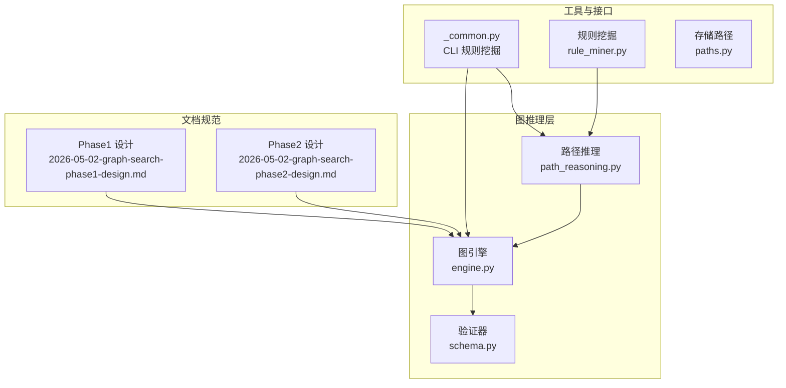
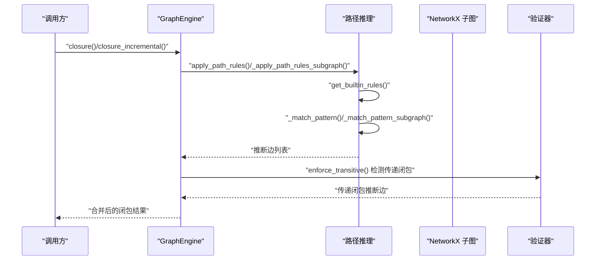
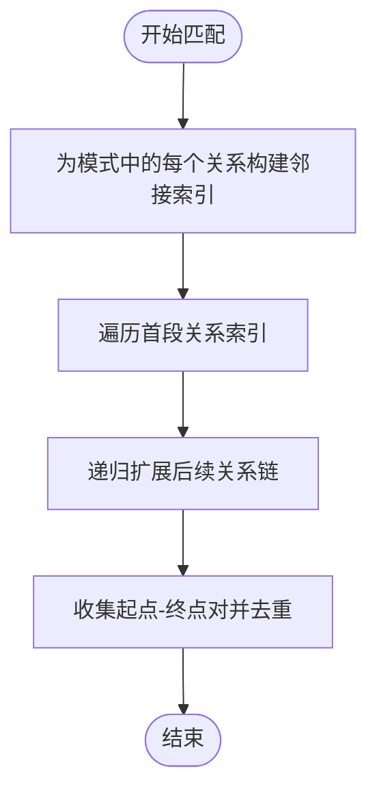
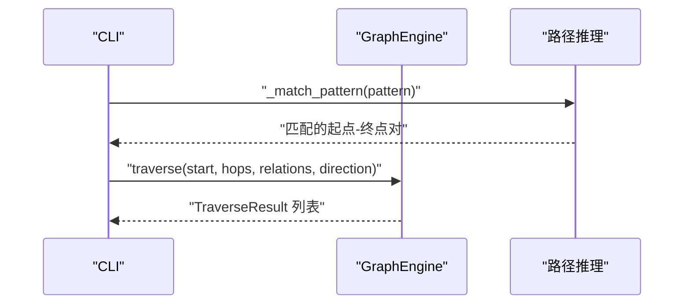
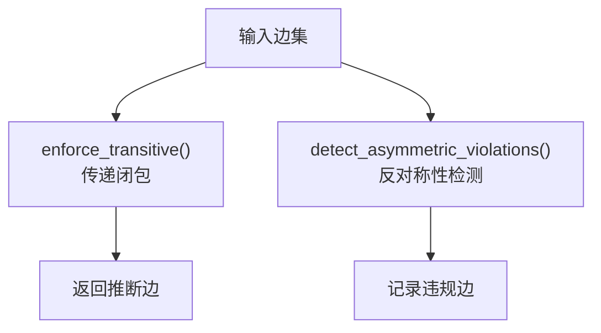
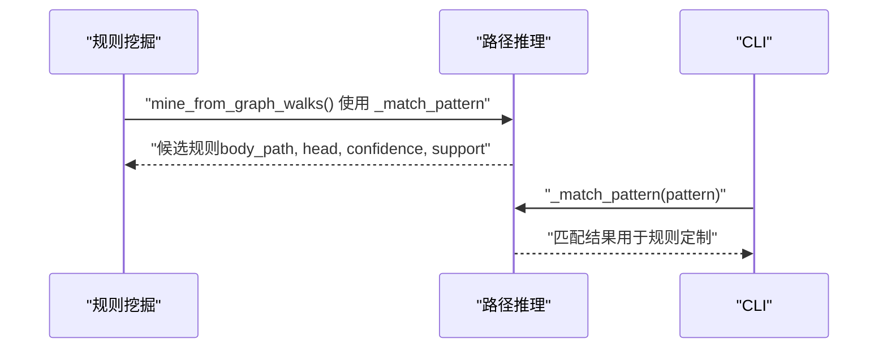
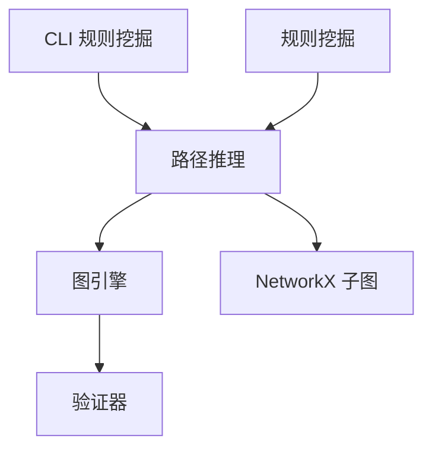

# 路径推理

<cite>
**本文引用的文件**
- [path_reasoning.py](file://src/drbrain/graph/path_reasoning.py)
- [engine.py](file://src/drbrain/graph/engine.py)
- [schema.py](file://src/drbrain/validator/schema.py)
- [test_path_reasoning.py](file://tests/test_path_reasoning.py)
- [_common.py](file://src/drbrain/cli/_common.py)
- [rule_miner.py](file://src/drbrain/extractor/rule_miner.py)
- [paths.py](file://src/drbrain/storage/paths.py)
- [2026-05-02-graph-search-phase1-design.md](file://docs/superpowers/specs/2026-05-02-graph-search-phase1-design.md)
- [2026-05-02-graph-search-phase2-design.md](file://docs/superpowers/specs/2026-05-02-graph-search-phase2-design.md)
</cite>

## 目录
1. [简介](#简介)
2. [项目结构](#项目结构)
3. [核心组件](#核心组件)
4. [架构总览](#架构总览)
5. [详细组件分析](#详细组件分析)
6. [依赖分析](#依赖分析)
7. [性能考虑](#性能考虑)
8. [故障排查指南](#故障排查指南)
9. [结论](#结论)
10. [附录](#附录)

## 简介
本文件系统化阐述 DrBrain 中“路径推理”模块的设计与实现，重点覆盖：
- 多跳路径规则的识别与应用算法
- 复杂关系链的推理机制与路径约束处理
- 路径模式匹配算法、关系组合规则与推理路径验证
- 路径长度限制、关系类型过滤与路径唯一性保证
- 与图遍历算法的集成关系、路径复杂度控制与性能优化策略
- 使用场景、规则定制与调试方法

## 项目结构
路径推理位于图计算子系统中，与图引擎、验证器、CLI 工具链协同工作：
- 图引擎负责构建与维护知识图谱、执行闭包与遍历
- 路径推理模块提供多跳规则匹配与推断
- 验证器提供 TBox/RBox 约束与传递闭包检测
- CLI 提供规则挖掘与路径查询能力

图表来源
- [path_reasoning.py:1-212](file://src/drbrain/graph/path_reasoning.py#L1-L212)
- [engine.py:1-1118](file://src/drbrain/graph/engine.py#L1-L1118)
- [schema.py:1-211](file://src/drbrain/validator/schema.py#L1-L211)
- [_common.py:629-666](file://src/drbrain/cli/_common.py#L629-L666)
- [rule_miner.py:150-289](file://src/drbrain/extractor/rule_miner.py#L150-L289)
- [paths.py:1-29](file://src/drbrain/storage/paths.py#L1-L29)
- [2026-05-02-graph-search-phase1-design.md:1-49](file://docs/superpowers/specs/2026-05-02-graph-search-phase1-design.md#L1-L49)
- [2026-05-02-graph-search-phase2-design.md:141-196](file://docs/superpowers/specs/2026-05-02-graph-search-phase2-design.md#L141-L196)

章节来源
- [path_reasoning.py:1-212](file://src/drbrain/graph/path_reasoning.py#L1-L212)
- [engine.py:1-1118](file://src/drbrain/graph/engine.py#L1-L1118)
- [schema.py:1-211](file://src/drbrain/validator/schema.py#L1-L211)
- [_common.py:629-666](file://src/drbrain/cli/_common.py#L629-L666)
- [rule_miner.py:150-289](file://src/drbrain/extractor/rule_miner.py#L150-L289)
- [paths.py:1-29](file://src/drbrain/storage/paths.py#L1-L29)
- [2026-05-02-graph-search-phase1-design.md:1-49](file://docs/superpowers/specs/2026-05-02-graph-search-phase1-design.md#L1-L49)
- [2026-05-02-graph-search-phase2-design.md:141-196](file://docs/superpowers/specs/2026-05-02-graph-search-phase2-design.md#L141-L196)

## 核心组件
- PathRule：定义多跳路径模式（关系序列与方向）与推断后果关系
- get_builtin_rules：内置规则集合（如“方法替代问题”、“挑战链”等）
- _match_pattern / _match_pattern_subgraph：在图上匹配指定关系链模式
- apply_path_rules / _apply_path_rules_subgraph：对全图或子图应用规则并返回推断边
- GraphEngine.closure/closure_incremental：将路径推理纳入整体闭包流程
- 验证器：提供传递闭包与反身性/反对称性约束检测，保障推理一致性

章节来源
- [path_reasoning.py:9-55](file://src/drbrain/graph/path_reasoning.py#L9-L55)
- [path_reasoning.py:24-55](file://src/drbrain/graph/path_reasoning.py#L24-L55)
- [path_reasoning.py:81-128](file://src/drbrain/graph/path_reasoning.py#L81-L128)
- [path_reasoning.py:131-153](file://src/drbrain/graph/path_reasoning.py#L131-L153)
- [engine.py:124-315](file://src/drbrain/graph/engine.py#L124-L315)
- [engine.py:787-928](file://src/drbrain/graph/engine.py#L787-L928)
- [schema.py:140-211](file://src/drbrain/validator/schema.py#L140-L211)

## 架构总览
路径推理作为“规则驱动”的闭包的一部分，与图遍历、传递闭包、反身性/反对称性检测共同构成图推理闭环。下图展示了从规则到图的调用链与数据流。

图表来源
- [engine.py:124-315](file://src/drbrain/graph/engine.py#L124-L315)
- [engine.py:787-928](file://src/drbrain/graph/engine.py#L787-L928)
- [path_reasoning.py:24-55](file://src/drbrain/graph/path_reasoning.py#L24-L55)
- [path_reasoning.py:131-153](file://src/drbrain/graph/path_reasoning.py#L131-L153)
- [schema.py:140-189](file://src/drbrain/validator/schema.py#L140-L189)

## 详细组件分析

### 组件一：路径规则与模式匹配
- PathRule 定义了每条规则的名称、模式（关系序列与方向）与推断关系
- 内置规则涵盖“方法替代问题”“挑战链”“缺口继承”“间接支持”等典型科研语义
- 匹配算法通过为每个关系构建邻接索引，按模式逐步扩展，最终收集起点与终点对
- 去重策略基于“起点-终点-首段关系”三元组，避免重复推断

图表来源
- [path_reasoning.py:81-128](file://src/drbrain/graph/path_reasoning.py#L81-L128)
- [path_reasoning.py:156-211](file://src/drbrain/graph/path_reasoning.py#L156-L211)

章节来源
- [path_reasoning.py:9-55](file://src/drbrain/graph/path_reasoning.py#L9-L55)
- [path_reasoning.py:24-55](file://src/drbrain/graph/path_reasoning.py#L24-L55)
- [path_reasoning.py:81-128](file://src/drbrain/graph/path_reasoning.py#L81-L128)
- [path_reasoning.py:156-211](file://src/drbrain/graph/path_reasoning.py#L156-L211)

### 组件二：与图遍历的集成
- GraphEngine.traverse 支持关系过滤与方向控制，用于探索可达路径与中间节点
- 路径推理在 closure/closure_incremental 中被调用，前者对全图执行，后者仅对种子节点的局部子图执行
- CLI 层可直接调用 _match_pattern 进行规则挖掘，复用相同匹配逻辑

图表来源
- [_common.py:629-666](file://src/drbrain/cli/_common.py#L629-L666)
- [engine.py:62-122](file://src/drbrain/graph/engine.py#L62-L122)
- [path_reasoning.py:156-211](file://src/drbrain/graph/path_reasoning.py#L156-L211)

章节来源
- [_common.py:629-666](file://src/drbrain/cli/_common.py#L629-L666)
- [engine.py:62-122](file://src/drbrain/graph/engine.py#L62-L122)
- [path_reasoning.py:156-211](file://src/drbrain/graph/path_reasoning.py#L156-L211)

### 组件三：推理路径验证与约束
- 传递闭包：对声明为传递的关系（如 extends）进行闭包补全，并返回 via 标记
- 反身性/反对称性检测：发现 A rel B 且 B rel A 的违反情况，用于质量监控
- 路径唯一性：通过 visited_edges 去重，确保同一“首段关系+起点-终点”只产生一次推断

图表来源
- [schema.py:140-189](file://src/drbrain/validator/schema.py#L140-L189)
- [schema.py:192-211](file://src/drbrain/validator/schema.py#L192-L211)
- [path_reasoning.py:182-193](file://src/drbrain/graph/path_reasoning.py#L182-L193)

章节来源
- [schema.py:140-211](file://src/drbrain/validator/schema.py#L140-L211)
- [path_reasoning.py:182-193](file://src/drbrain/graph/path_reasoning.py#L182-L193)

### 组件四：规则定制与挖掘
- 内置规则可通过 get_builtin_rules 获取；也可通过规则挖掘模块从图游走中提取新的 body_path→head 关系
- CLI 层提供规则挖掘入口，直接复用 _match_pattern 进行模式匹配与推断

图表来源
- [rule_miner.py:150-289](file://src/drbrain/extractor/rule_miner.py#L150-L289)
- [_common.py:629-666](file://src/drbrain/cli/_common.py#L629-L666)
- [path_reasoning.py:156-211](file://src/drbrain/graph/path_reasoning.py#L156-L211)

章节来源
- [rule_miner.py:150-289](file://src/drbrain/extractor/rule_miner.py#L150-L289)
- [_common.py:629-666](file://src/drbrain/cli/_common.py#L629-L666)
- [path_reasoning.py:156-211](file://src/drbrain/graph/path_reasoning.py#L156-L211)

## 依赖分析
- 路径推理依赖图引擎提供的图结构与遍历能力
- 闭包阶段同时运行传递闭包与路径推理，二者相互独立但共享图数据
- 验证器提供约束检查，确保推理结果满足领域约束

图表来源
- [engine.py:124-315](file://src/drbrain/graph/engine.py#L124-L315)
- [engine.py:787-928](file://src/drbrain/graph/engine.py#L787-L928)
- [schema.py:140-189](file://src/drbrain/validator/schema.py#L140-L189)
- [_common.py:629-666](file://src/drbrain/cli/_common.py#L629-L666)
- [rule_miner.py:150-289](file://src/drbrain/extractor/rule_miner.py#L150-L289)

章节来源
- [engine.py:124-315](file://src/drbrain/graph/engine.py#L124-L315)
- [engine.py:787-928](file://src/drbrain/graph/engine.py#L787-L928)
- [schema.py:140-189](file://src/drbrain/validator/schema.py#L140-L189)
- [_common.py:629-666](file://src/drbrain/cli/_common.py#L629-L666)
- [rule_miner.py:150-289](file://src/drbrain/extractor/rule_miner.py#L150-L289)

## 性能考虑
- 时间复杂度
  - 模式匹配：对每个关系建立邻接索引 O(E)，随后按模式长度递归扩展，整体约为 O(E·k)，k 为模式长度
  - 闭包增量：仅对种子节点的 2 跳邻域子图执行，显著降低规模
- 空间复杂度
  - 邻接索引占用 O(E)；递归扩展栈深受路径长度限制
- 去重与剪枝
  - 通过 visited_edges 与已存在边集合避免重复推断
  - 传递闭包采用 BFS 扩展，避免冗余计算
- 实践建议
  - 控制模式长度与关系数量，减少指数级扩展
  - 在大规模图上优先使用 closure_incremental
  - 对高频关系（如 extends）单独索引以加速匹配

[本节为通用性能讨论，不直接分析具体文件]

## 故障排查指南
- 规则未生效
  - 检查是否传入 GraphEngine 实例（非子图），否则 apply_path_rules 返回空
  - 确认关系方向与模式一致（forward/backward）
- 推断重复
  - 检查 visited_edges 去重逻辑是否触发（同一首段关系+起点-终点）
- 误报与冲突
  - 使用 detect_asymmetric_violations 检测反对称关系冲突
  - 使用 enforce_transitive 补齐传递闭包，避免遗漏
- 测试参考
  - 单元测试覆盖了典型规则、无替换/无扩展场景、空图与无误报等边界

章节来源
- [path_reasoning.py:131-153](file://src/drbrain/graph/path_reasoning.py#L131-L153)
- [path_reasoning.py:182-193](file://src/drbrain/graph/path_reasoning.py#L182-L193)
- [schema.py:192-211](file://src/drbrain/validator/schema.py#L192-L211)
- [test_path_reasoning.py:24-182](file://tests/test_path_reasoning.py#L24-L182)

## 结论
路径推理模块以轻量规则与高效匹配为核心，将复杂关系链的推断嵌入到图引擎的闭包流程中。通过关系过滤、方向控制与去重策略，既保证了推理的准确性，也兼顾了性能与可扩展性。结合验证器的约束检测与 CLI 的规则挖掘能力，用户可以灵活定制与调试推理规则，满足多样化的科研知识发现需求。

[本节为总结性内容，不直接分析具体文件]

## 附录

### 使用场景
- 方法演进链：从“方法替代问题”规则自动推断新方法对旧问题的解决关系
- 论证链传播：从“挑战链”规则传播方法对结论的挑战关系
- 缺口关联：从“缺口继承”规则将论文与研究缺口建立关联
- 间接支持：从“间接支持”规则传播方法对问题的支持关系

章节来源
- [path_reasoning.py:26-55](file://src/drbrain/graph/path_reasoning.py#L26-L55)
- [test_path_reasoning.py:24-133](file://tests/test_path_reasoning.py#L24-L133)

### 规则定制与调试
- 内置规则：通过 get_builtin_rules 获取并按需扩展
- 自定义规则：基于规则挖掘模块提取 body_path→head 关系，再映射为 PathRule
- 调试方法：利用单元测试与 CLI 的 _match_pattern 直接验证模式匹配效果

章节来源
- [path_reasoning.py:24-55](file://src/drbrain/graph/path_reasoning.py#L24-L55)
- [rule_miner.py:150-289](file://src/drbrain/extractor/rule_miner.py#L150-L289)
- [_common.py:629-666](file://src/drbrain/cli/_common.py#L629-L666)

### 与图遍历的集成
- GraphEngine.traverse 支持关系过滤与方向控制，便于探索路径与中间节点
- 文档规范中提供了基于最短路径的查询流程与输出格式

章节来源
- [engine.py:62-122](file://src/drbrain/graph/engine.py#L62-L122)
- [2026-05-02-graph-search-phase1-design.md:1-49](file://docs/superpowers/specs/2026-05-02-graph-search-phase1-design.md#L1-L49)
- [2026-05-02-graph-search-phase2-design.md:141-196](file://docs/superpowers/specs/2026-05-02-graph-search-phase2-design.md#L141-L196)

### 路径长度限制、关系类型过滤与唯一性保证
- 长度限制：通过模式长度与 closure_incremental 的子图范围控制
- 类型过滤：traverse 的 relations 参数与 _match_pattern 的关系索引实现
- 唯一性：visited_edges 与已存在边集合确保推断唯一

章节来源
- [engine.py:62-122](file://src/drbrain/graph/engine.py#L62-L122)
- [path_reasoning.py:156-211](file://src/drbrain/graph/path_reasoning.py#L156-L211)
- [path_reasoning.py:182-193](file://src/drbrain/graph/path_reasoning.py#L182-L193)