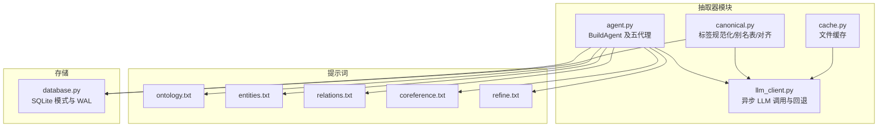
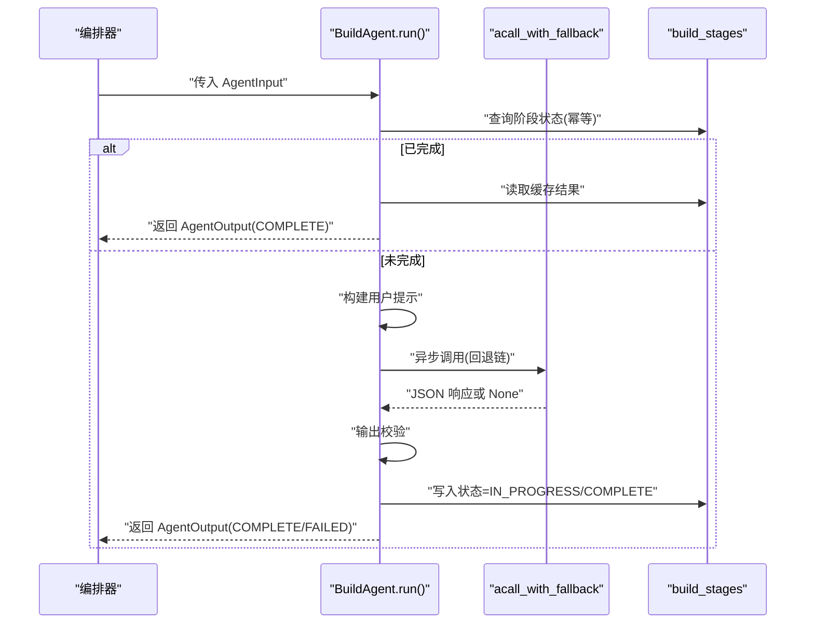
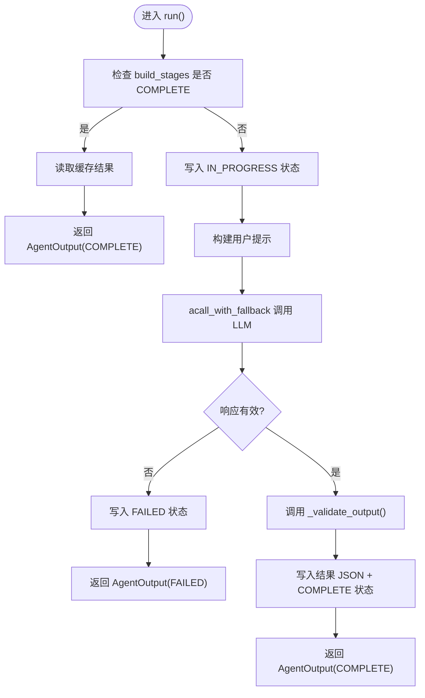
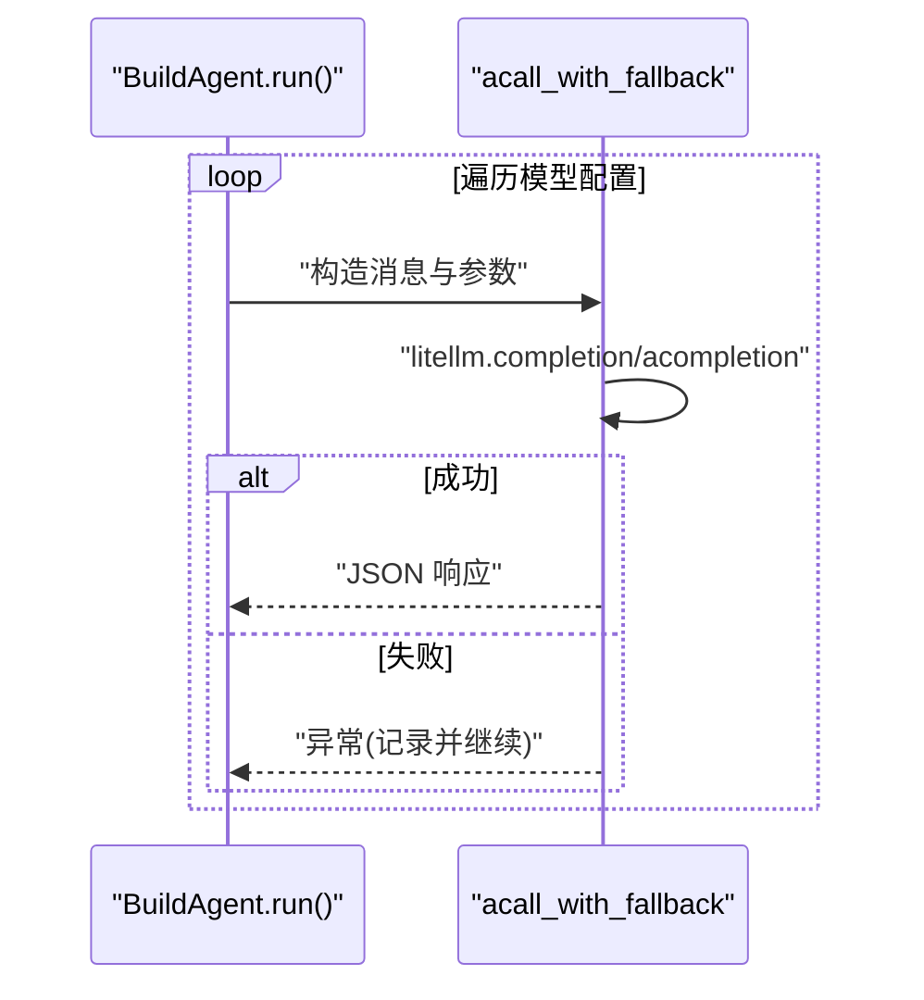
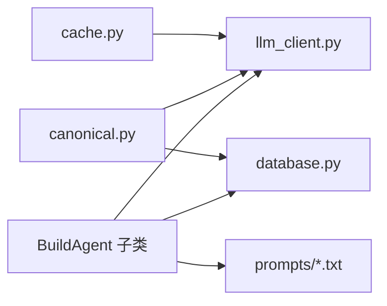

# AI 抽取代理系统

<cite>
**本文引用的文件**
- [src/drbrain/extractor/agent.py](file://src/drbrain/extractor/agent.py)
- [src/drbrain/extractor/llm_client.py](file://src/drbrain/extractor/llm_client.py)
- [src/drbrain/storage/database.py](file://src/drbrain/storage/database.py)
- [src/drbrain/extractor/canonical.py](file://src/drbrain/extractor/canonical.py)
- [src/drbrain/extractor/cache.py](file://src/drbrain/extractor/cache.py)
- [prompts/ontology.txt](file://prompts/ontology.txt)
- [prompts/entities.txt](file://prompts/entities.txt)
- [prompts/relations.txt](file://prompts/relations.txt)
- [prompts/coreference.txt](file://prompts/coreference.txt)
- [prompts/refine.txt](file://prompts/refine.txt)
- [tests/test_agent.py](file://tests/test_agent.py)
- [docs/architecture.md](file://docs/architecture.md)
- [.trellis/spec/backend/pipeline-architecture.md](file://.trellis/spec/backend/pipeline-architecture.md)
</cite>

## 目录
1. [引言](#引言)
2. [项目结构](#项目结构)
3. [核心组件](#核心组件)
4. [架构总览](#架构总览)
5. [详细组件分析](#详细组件分析)
6. [依赖分析](#依赖分析)
7. [性能考虑](#性能考虑)
8. [故障排查指南](#故障排查指南)
9. [结论](#结论)
10. [附录](#附录)

## 引言
本技术文档面向 DrBrain 的 AI 抽取代理系统，聚焦于构建期（build stage）的五级代理流水线：OntologyAgent、EntityAgent、RelationAgent、CorefAgent、RefineAgent。文档从设计理念、阶段状态管理、幂等性保障、数据契约与提示词构建策略、输出验证机制、与 LLM 客户端的集成与重试、错误处理，到扩展新代理类型的实践与性能优化建议进行系统化阐述，并提供可追溯的源码路径以便进一步查阅。

## 项目结构
抽取代理系统位于 src/drbrain/extractor 目录，围绕 BuildAgent 抽象基类组织五个具体代理；提示词集中于 prompts 目录；数据库模式在 src/drbrain/storage/database.py 中定义；LLM 客户端封装在 src/drbrain/extractor/llm_client.py；标签规范化与对齐在 src/drbrain/extractor/canonical.py；文件缓存在 src/drbrain/extractor/cache.py；测试覆盖在 tests/test_agent.py。

图表来源
- [src/drbrain/extractor/agent.py:1-368](file://src/drbrain/extractor/agent.py#L1-L368)
- [src/drbrain/extractor/llm_client.py:1-154](file://src/drbrain/extractor/llm_client.py#L1-L154)
- [src/drbrain/storage/database.py:143-150](file://src/drbrain/storage/database.py#L143-L150)
- [src/drbrain/extractor/canonical.py:1-252](file://src/drbrain/extractor/canonical.py#L1-L252)
- [src/drbrain/extractor/cache.py:1-65](file://src/drbrain/extractor/cache.py#L1-L65)
- [prompts/ontology.txt:1-23](file://prompts/ontology.txt#L1-L23)
- [prompts/entities.txt:1-19](file://prompts/entities.txt#L1-L19)
- [prompts/relations.txt:1-24](file://prompts/relations.txt#L1-L24)
- [prompts/coreference.txt:1-14](file://prompts/coreference.txt#L1-L14)
- [prompts/refine.txt:1-21](file://prompts/refine.txt#L1-L21)

章节来源
- [src/drbrain/extractor/agent.py:1-368](file://src/drbrain/extractor/agent.py#L1-L368)
- [src/drbrain/extractor/llm_client.py:1-154](file://src/drbrain/extractor/llm_client.py#L1-L154)
- [src/drbrain/storage/database.py:143-150](file://src/drbrain/storage/database.py#L143-L150)
- [docs/architecture.md:290-297](file://docs/architecture.md#L290-L297)
- [.trellis/spec/backend/pipeline-architecture.md:64-132](file://.trellis/spec/backend/pipeline-architecture.md#L64-L132)

## 核心组件
- BuildAgent 抽象基类：统一的运行流程（幂等检查 → 构建提示 → LLM 回退调用 → 输出校验 → 持久化 → 返回结果），并提供状态跟踪与缓存加载能力。
- 五代理子类：OntologyAgent、EntityAgent、RelationAgent、CorefAgent、RefineAgent，各自通过独立提示词文件与特定的输入/输出验证逻辑实现领域任务。
- AgentInput/AgentOutput 数据契约：标准化的输入输出结构，便于跨阶段传递与持久化。
- LLM 客户端：acall_with_fallback 提供异步回退链路与指标记录。
- 数据库：build_stages 表用于幂等性与中间结果缓存；concepts/edges 等表承载抽取产物。
- 标签规范化：别名表与 BM25 + LLM 的混合对齐策略，支持概念去重与一致性。
- 文件缓存：ApiCache 提供 TTL 缓存，降低外部 API 调用开销。

章节来源
- [src/drbrain/extractor/agent.py:33-51](file://src/drbrain/extractor/agent.py#L33-L51)
- [src/drbrain/extractor/agent.py:53-196](file://src/drbrain/extractor/agent.py#L53-L196)
- [src/drbrain/extractor/llm_client.py:92-114](file://src/drbrain/extractor/llm_client.py#L92-L114)
- [src/drbrain/storage/database.py:143-150](file://src/drbrain/storage/database.py#L143-L150)
- [src/drbrain/extractor/canonical.py:73-108](file://src/drbrain/extractor/canonical.py#L73-L108)
- [src/drbrain/extractor/cache.py:14-65](file://src/drbrain/extractor/cache.py#L14-L65)

## 架构总览
五代理流水线以“结构化中间产物”而非原始 LLM 上下文进行通信，每个阶段独立拥有系统提示词、输入/输出验证与幂等性保障。数据库中的 build_stages 记录阶段状态与结果，确保重复执行的安全性。LLM 调用采用异步回退链路，失败时自动尝试下一个模型配置。

图表来源
- [src/drbrain/extractor/agent.py:73-135](file://src/drbrain/extractor/agent.py#L73-L135)
- [src/drbrain/extractor/llm_client.py:92-114](file://src/drbrain/extractor/llm_client.py#L92-L114)
- [src/drbrain/storage/database.py:143-150](file://src/drbrain/storage/database.py#L143-L150)

章节来源
- [docs/architecture.md:290-297](file://docs/architecture.md#L290-L297)
- [.trellis/spec/backend/pipeline-architecture.md:87-132](file://.trellis/spec/backend/pipeline-architecture.md#L87-L132)

## 详细组件分析

### BuildAgent 基类与运行流程
- 设计理念：每个阶段封装为独立 Agent，职责单一、边界清晰；通过系统提示词限定角色与约束；以结构化中间产物驱动后续阶段。
- 幂等性与状态管理：使用 build_stages 表记录阶段状态（pending/in_progress/complete/failed），在运行前检查是否已完成；若完成则直接读取缓存结果。
- 运行流程：幂等检查 → 构建提示 → 异步 LLM 回退调用 → 输出校验 → 写入结果与状态 → 返回 AgentOutput。
- 数据持久化：保存状态与结果 JSON；失败时写入 FAILED 状态；成功后写入 COMPLETE 状态与序列化结果。

图表来源
- [src/drbrain/extractor/agent.py:73-135](file://src/drbrain/extractor/agent.py#L73-L135)
- [src/drbrain/storage/database.py:143-150](file://src/drbrain/storage/database.py#L143-L150)

章节来源
- [src/drbrain/extractor/agent.py:53-196](file://src/drbrain/extractor/agent.py#L53-L196)

### 五代理职责与实现要点

#### OntologyAgent（本体映射）
- 职责：基于论文目录层级生成六类概念的领域子类别清单。
- 输入：AgentInput.data 包含预构建提示（由上阶段生成）。
- 输出：仅保留允许的六类键，值为字符串列表。
- 提示词：ontology.txt 明确六类与输出格式要求。

章节来源
- [src/drbrain/extractor/agent.py:198-215](file://src/drbrain/extractor/agent.py#L198-L215)
- [prompts/ontology.txt:1-23](file://prompts/ontology.txt#L1-L23)

#### EntityAgent（实体抽取）
- 职责：在叶节点段落中抽取概念，附带类型、置信度、节标题与 node_id 来源。
- 输入：AgentInput.data 包含预构建提示。
- 输出：过滤无效条目，保留 label/type/confidence/section/node_id 字段。
- 验证：要求 concepts 列表存在且每项具备非空 label 与 type。

章节来源
- [src/drbrain/extractor/agent.py:217-249](file://src/drbrain/extractor/agent.py#L217-L249)
- [prompts/entities.txt:1-19](file://prompts/entities.txt#L1-L19)

#### RelationAgent（关系抽取）
- 职责：在已抽取概念间建立有向关系，限定关系类型集合。
- 输入：AgentInput.data 包含预构建提示。
- 输出：过滤无效条目，保留 head/rel/tail/node_id/section 字段。
- 验证：要求 relations 列表存在且每项具备非空 head/rel/tail。

章节来源
- [src/drbrain/extractor/agent.py:251-284](file://src/drbrain/extractor/agent.py#L251-L284)
- [prompts/relations.txt:1-24](file://prompts/relations.txt#L1-L24)

#### CorefAgent（共指消解）
- 职责：合并同一真实世界的不同标签表达，保留规范主标签与变体列表。
- 输入：AgentInput.data 包含预构建提示。
- 输出：过滤无效条目，保留 canonical/variants 字段。
- 验证：要求 merges 列表存在且 canonical 非空，variants 为列表。

章节来源
- [src/drbrain/extractor/agent.py:286-315](file://src/drbrain/extractor/agent.py#L286-L315)
- [prompts/coreference.txt:1-14](file://prompts/coreference.txt#L1-L14)

#### RefineAgent（自检与修正）
- 职责：对抽取结果进行自我审查，输出修复建议；可设置快照以计算前后差异。
- 输入：AgentInput.data 包含预构建提示。
- 输出：保留 corrections 列表与 diff（若存在快照）。
- 验证：要求 corrections 列表存在，diff 包含 before/after 结构。

章节来源
- [src/drbrain/extractor/agent.py:317-350](file://src/drbrain/extractor/agent.py#L317-L350)
- [prompts/refine.txt:1-21](file://prompts/refine.txt#L1-L21)

### 数据契约与提示词构建策略

#### AgentInput/AgentOutput
- AgentInput：paper_id、stage、data（字典）。
- AgentOutput：paper_id、stage、status（枚举）、data、diff（可选）。

提示词构建策略
- 各代理通过独立提示词文件定义系统角色与输出格式约束，Agent 在运行时将结构化输入拼接为用户提示，再交由 LLM 解析为 JSON。

章节来源
- [src/drbrain/extractor/agent.py:33-51](file://src/drbrain/extractor/agent.py#L33-L51)
- [src/drbrain/extractor/agent.py:205-206](file://src/drbrain/extractor/agent.py#L205-L206)
- [src/drbrain/extractor/agent.py:224-225](file://src/drbrain/extractor/agent.py#L224-L225)
- [src/drbrain/extractor/agent.py:258-259](file://src/drbrain/extractor/agent.py#L258-L259)
- [src/drbrain/extractor/agent.py:293-294](file://src/drbrain/extractor/agent.py#L293-L294)
- [src/drbrain/extractor/agent.py:336-337](file://src/drbrain/extractor/agent.py#L336-L337)

### 输出验证机制
- OntologyAgent：仅保留六类键，值为字符串列表。
- EntityAgent：校验 concepts 列表与每项 label/type 非空，保留置信度、节与 node_id。
- RelationAgent：校验 relations 列表与每项 head/rel/tail 非空。
- CorefAgent：校验 merges 列表与 canonical 非空、variants 为列表。
- RefineAgent：校验 corrections 列表，按需生成 diff。

章节来源
- [tests/test_agent.py:75-115](file://tests/test_agent.py#L75-L115)
- [tests/test_agent.py:130-156](file://tests/test_agent.py#L130-L156)
- [tests/test_agent.py:160-172](file://tests/test_agent.py#L160-L172)
- [tests/test_agent.py:174-186](file://tests/test_agent.py#L174-L186)

### 与 LLM 客户端的集成与重试机制
- 异步回退链：acall_with_fallback 按顺序尝试多个模型配置，解析首条成功 JSON 响应；失败时记录警告并继续尝试下一个配置。
- 指标记录：调用完成后记录耗时、输入/输出 token 数量。
- 文本回退：提供 acall_text_with_fallback 用于不需要 JSON 的场景。

图表来源
- [src/drbrain/extractor/llm_client.py:92-114](file://src/drbrain/extractor/llm_client.py#L92-L114)

章节来源
- [src/drbrain/extractor/llm_client.py:66-114](file://src/drbrain/extractor/llm_client.py#L66-L114)

### 错误处理与幂等性
- 幂等性：通过 build_stages 表判断阶段是否已完成；若已完成则跳过执行并返回缓存结果。
- 失败处理：当 LLM 无响应或校验失败时，写入 FAILED 状态；后续可重新触发。
- 数据库回滚：幂等检查与状态更新在事务中进行，避免脏读。

章节来源
- [src/drbrain/extractor/agent.py:85-120](file://src/drbrain/extractor/agent.py#L85-L120)
- [src/drbrain/storage/database.py:143-150](file://src/drbrain/storage/database.py#L143-L150)

### 扩展新代理类型的实践
- 步骤
  - 继承 BuildAgent，设置 name 与 prompt_file。
  - 实现 _build_prompt(input_data) 将结构化输入转为用户提示。
  - 实现 _validate_output(raw) 对 LLM 输出进行清洗与校验。
  - 在工厂字典中注册新代理实例。
- 最佳实践
  - 明确定义提示词输出格式，严格限制键集合与类型。
  - 在 _validate_output 中尽早抛出异常，避免污染下游。
  - 使用 AgentInput.data 传递结构化中间产物，避免直接拼接原始文本。
  - 为新代理添加单元测试，覆盖正常与异常分支。

章节来源
- [src/drbrain/extractor/agent.py:352-368](file://src/drbrain/extractor/agent.py#L352-L368)
- [tests/test_agent.py:191-202](file://tests/test_agent.py#L191-L202)

## 依赖分析
- 组件耦合
  - BuildAgent 依赖 LLM 客户端与数据库；各代理仅依赖其专属提示词与自身验证逻辑。
  - 标签规范化与对齐模块可被上游抽取流程复用，减少重复工作。
- 外部依赖
  - LLM 调用通过 litellm 完成，支持多提供商与回退链。
  - SQLite WAL 模式提升并发读写性能。
- 循环依赖
  - 无循环导入；Agent 与 LLM、DB 之间为单向依赖。

图表来源
- [src/drbrain/extractor/agent.py:1-368](file://src/drbrain/extractor/agent.py#L1-L368)
- [src/drbrain/extractor/llm_client.py:1-154](file://src/drbrain/extractor/llm_client.py#L1-L154)
- [src/drbrain/storage/database.py:143-150](file://src/drbrain/storage/database.py#L143-L150)
- [src/drbrain/extractor/canonical.py:1-252](file://src/drbrain/extractor/canonical.py#L1-L252)
- [src/drbrain/extractor/cache.py:1-65](file://src/drbrain/extractor/cache.py#L1-L65)

章节来源
- [src/drbrain/extractor/agent.py:1-368](file://src/drbrain/extractor/agent.py#L1-L368)
- [src/drbrain/extractor/llm_client.py:1-154](file://src/drbrain/extractor/llm_client.py#L1-L154)
- [src/drbrain/storage/database.py:143-150](file://src/drbrain/storage/database.py#L143-L150)
- [src/drbrain/extractor/canonical.py:1-252](file://src/drbrain/extractor/canonical.py#L1-L252)
- [src/drbrain/extractor/cache.py:1-65](file://src/drbrain/extractor/cache.py#L1-L65)

## 性能考虑
- 并发与吞吐
  - Stage 2（实体抽取）支持多路并发（测试显示 10 叶节点并发），可显著缩短整体时延。
- LLM 调用
  - 使用异步回退链，避免单点失败导致整批阻塞；合理设置超时与最大 token 数。
- 数据库存取
  - WAL 模式提升并发读写；索引覆盖常用查询字段（如 concepts.type、edges.relation）。
- 缓存策略
  - 使用 ApiCache 缓存外部 API 响应，结合 TTL 控制新鲜度；对 LLM JSON 响应可结合 build_stages 缓存。
- 标签对齐
  - 先用 BM25 快速匹配，再对模糊候选进行 LLM 批仲裁，平衡速度与准确率。

章节来源
- [docs/architecture.md:293-294](file://docs/architecture.md#L293-L294)
- [src/drbrain/storage/database.py:115-122](file://src/drbrain/storage/database.py#L115-L122)
- [src/drbrain/extractor/canonical.py:110-202](file://src/drbrain/extractor/canonical.py#L110-L202)
- [src/drbrain/extractor/cache.py:14-65](file://src/drbrain/extractor/cache.py#L14-L65)

## 故障排查指南
- 幂等性问题
  - 若阶段状态异常（如 IN_PROGRESS 卡死），检查 build_stages 表对应记录；必要时清理后重试。
- LLM 回退失败
  - 检查 models 配置是否完整；查看日志中“async all N models exhausted”提示。
- 输出校验失败
  - 查看 _validate_output 抛出的异常信息，确认提示词输出格式与键名是否一致。
- 数据库迁移
  - 若 schema 版本落后，启动时会自动迁移；若出现列缺失，检查迁移函数是否正确执行。
- 标签对齐不生效
  - 确认 BM25 索引已构建；检查 pending 队列是否被 flush 或 LLM 决策失败。

章节来源
- [src/drbrain/extractor/agent.py:151-195](file://src/drbrain/extractor/agent.py#L151-L195)
- [src/drbrain/extractor/llm_client.py:86-89](file://src/drbrain/extractor/llm_client.py#L86-L89)
- [src/drbrain/storage/database.py:175-199](file://src/drbrain/storage/database.py#L175-L199)
- [src/drbrain/extractor/canonical.py:203-252](file://src/drbrain/extractor/canonical.py#L203-L252)

## 结论
DrBrain 的抽取代理系统通过 BuildAgent 抽象实现了阶段化的结构化抽取流水线，借助幂等性与状态表确保可重复、可恢复的执行；通过严格的提示词与输出验证保障质量；通过异步回退链与缓存策略提升鲁棒性与性能。该设计既满足学术知识图谱构建的工程需求，也为扩展新代理提供了清晰的接口与最佳实践。

## 附录
- 测试参考
  - 代理工厂与类型校验：[tests/test_agent.py:191-202](file://tests/test_agent.py#L191-L202)
  - 幂等性与缓存：[tests/test_agent.py:207-248](file://tests/test_agent.py#L207-L248)
  - 输出验证与证明：[tests/test_agent.py:75-186](file://tests/test_agent.py#L75-L186)