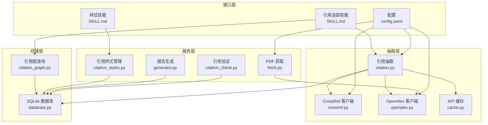
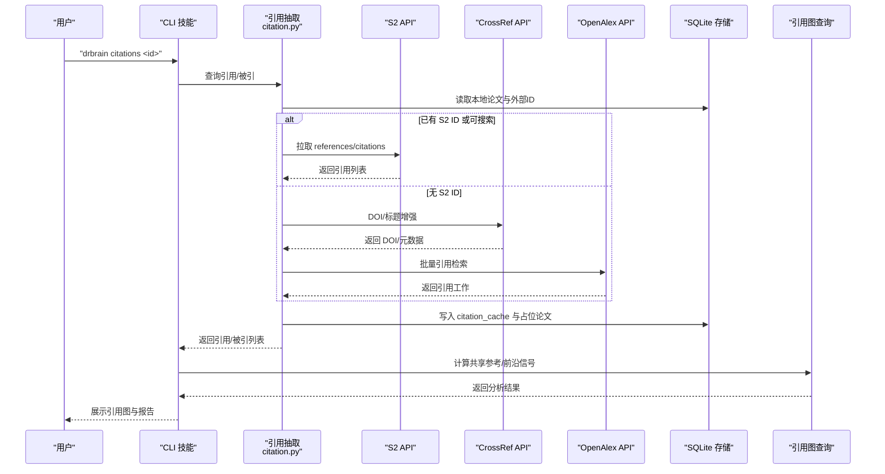
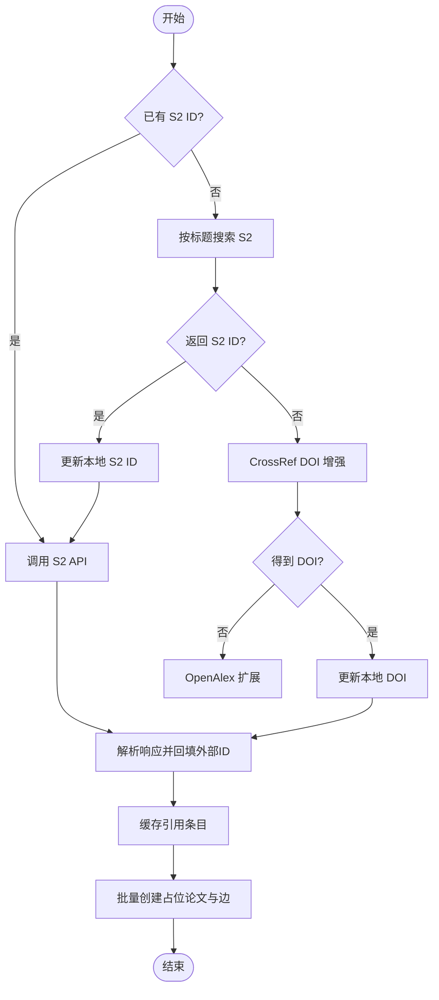
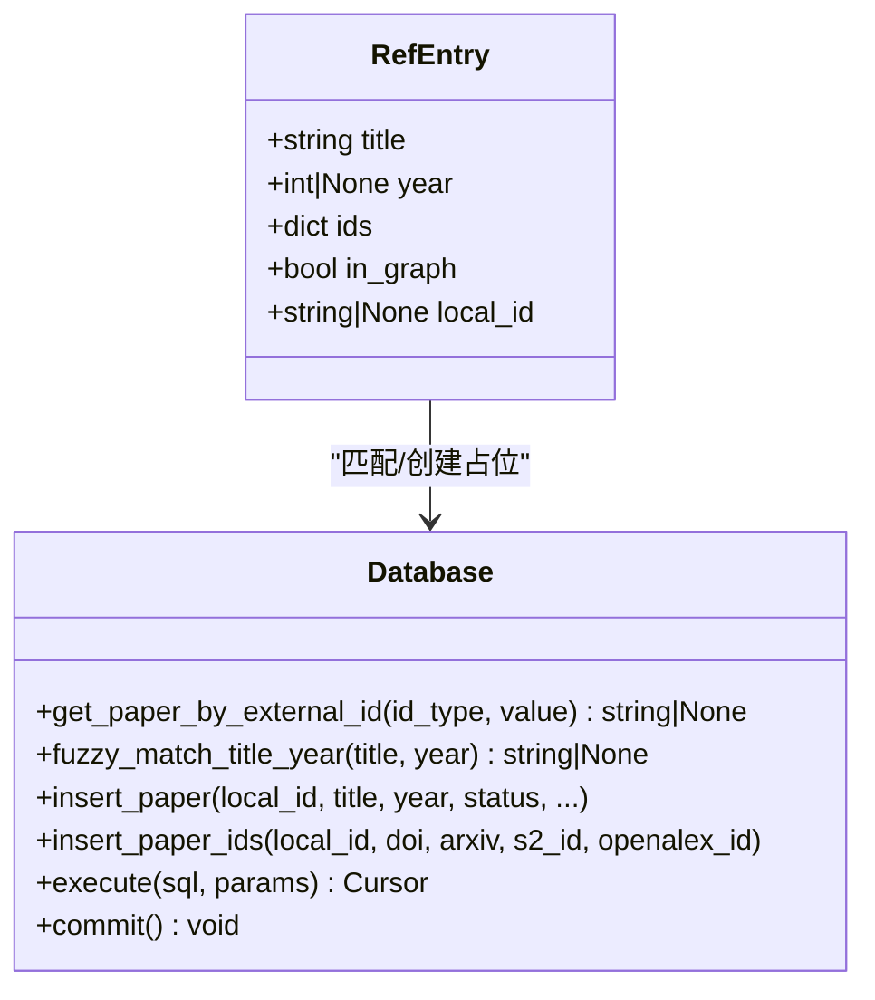
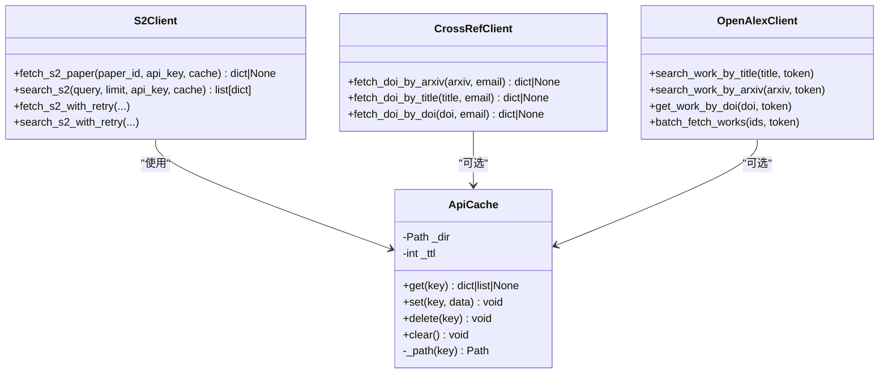
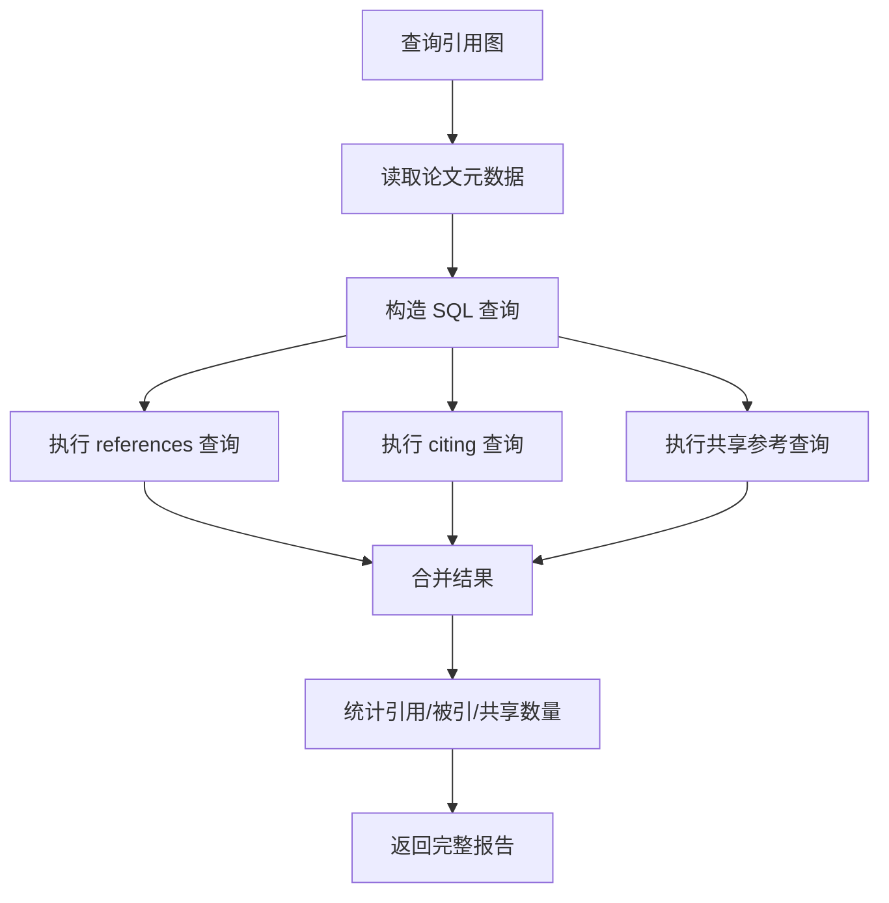
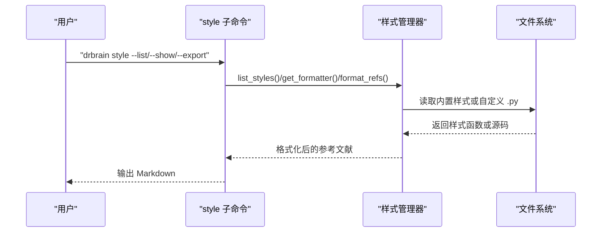
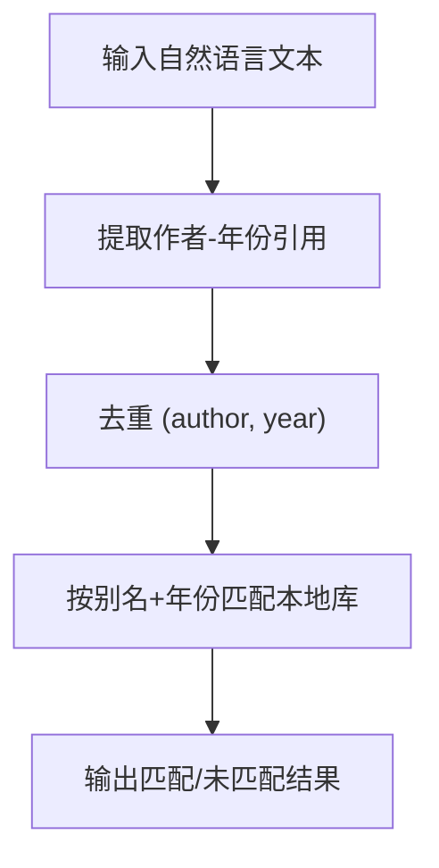
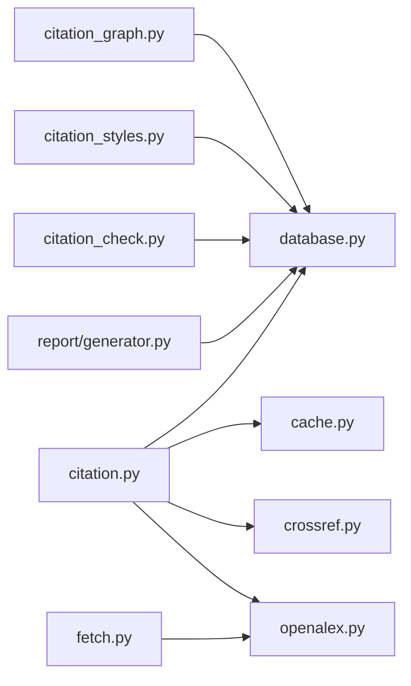

# 引用管理系统

<cite>
**本文档引用的文件**
- [src/drbrain/extractor/citation.py](file://src/drbrain/extractor/citation.py)
- [src/drbrain/extractor/crossref.py](file://src/drbrain/extractor/crossref.py)
- [src/drbrain/extractor/openalex.py](file://src/drbrain/extractor/openalex.py)
- [src/drbrain/storage/citation_graph.py](file://src/drbrain/storage/citation_graph.py)
- [src/drbrain/services/citation_styles.py](file://src/drbrain/services/citation_styles.py)
- [src/drbrain/report/generator.py](file://src/drbrain/report/generator.py)
- [src/drbrain/extractor/citation_check.py](file://src/drbrain/extractor/citation_check.py)
- [src/drbrain/storage/database.py](file://src/drbrain/storage/database.py)
- [src/drbrain/extractor/cache.py](file://src/drbrain/extractor/cache.py)
- [src/drbrain/services/fetch.py](file://src/drbrain/services/fetch.py)
- [skills/citation-tracking/SKILL.md](file://skills/citation-tracking/SKILL.md)
- [skills/citation-styles/SKILL.md](file://skills/citation-styles/SKILL.md)
- [config.yaml](file://config.yaml)
- [tests/test_citation.py](file://tests/test_citation.py)
- [tests/test_citation_graph.py](file://tests/test_citation_graph.py)
</cite>

## 目录
1. [简介](#简介)
2. [项目结构](#项目结构)
3. [核心组件](#核心组件)
4. [架构总览](#架构总览)
5. [详细组件分析](#详细组件分析)
6. [依赖关系分析](#依赖关系分析)
7. [性能考虑](#性能考虑)
8. [故障排除指南](#故障排除指南)
9. [结论](#结论)
10. [附录](#附录)

## 简介
本文件为 DrBrain 引用管理系统的技术文档，聚焦于引用提取算法、文献识别与元数据获取机制、Citation 对象数据结构、引用格式标准化与导出、与 Crossref、OpenAlex 等外部数据库的集成策略、引用验证与重复检测、引用追踪与知识前沿信号发现、以及影响因子与引用网络构建的实现细节。同时提供引用质量评估、错误处理与性能优化的最佳实践。

## 项目结构
DrBrain 的引用管理由多模块协同完成：抽取层负责从外部数据库（S2/Crossref/OpenAlex）抓取引用信息；存储层维护本地论文与引用缓存；服务层提供样式化导出与报告生成；CLI 技能定义了用户交互入口。

**图表来源**
- [src/drbrain/extractor/citation.py](file://src/drbrain/extractor/citation.py)
- [src/drbrain/extractor/crossref.py](file://src/drbrain/extractor/crossref.py)
- [src/drbrain/extractor/openalex.py](file://src/drbrain/extractor/openalex.py)
- [src/drbrain/storage/database.py](file://src/drbrain/storage/database.py)
- [src/drbrain/storage/citation_graph.py](file://src/drbrain/storage/citation_graph.py)
- [src/drbrain/services/citation_styles.py](file://src/drbrain/services/citation_styles.py)
- [src/drbrain/services/fetch.py](file://src/drbrain/services/fetch.py)
- [src/drbrain/report/generator.py](file://src/drbrain/report/generator.py)
- [src/drbrain/extractor/citation_check.py](file://src/drbrain/extractor/citation_check.py)
- [skills/citation-tracking/SKILL.md](file://skills/citation-tracking/SKILL.md)
- [skills/citation-styles/SKILL.md](file://skills/citation-styles/SKILL.md)
- [config.yaml](file://config.yaml)

**章节来源**
- [src/drbrain/extractor/citation.py](file://src/drbrain/extractor/citation.py)
- [src/drbrain/storage/database.py](file://src/drbrain/storage/database.py)
- [config.yaml](file://config.yaml)

## 核心组件
- 引用抽取与扩展：从 S2、Crossref、OpenAlex 多源抓取引用，回填缺失的外部 ID，并在本地数据库中建立占位与边关系。
- 文献识别与匹配：基于 DOI、arXiv、S2/OpenAlex ID、标题+年份进行精确或模糊匹配，生成 RefEntry。
- 引用缓存：通过文件级 TTL 缓存 API 响应，降低重复请求成本。
- 引用图分析：统计引用/被引数量、共享参考文献、前沿信号（未直接引用但共享参考）。
- 引用样式化导出：内置 APA/Vancouver/Chicago/MLA，支持自定义样式文件动态加载。
- 引用验证：从文本中提取作者-年份引用，匹配本地库中的论文别名与年份。
- 报告与边界告警：生成单篇报告，统计图覆盖率与边界风险。

**章节来源**
- [src/drbrain/extractor/citation.py](file://src/drbrain/extractor/citation.py)
- [src/drbrain/storage/citation_graph.py](file://src/drbrain/storage/citation_graph.py)
- [src/drbrain/services/citation_styles.py](file://src/drbrain/services/citation_styles.py)
- [src/drbrain/report/generator.py](file://src/drbrain/report/generator.py)
- [src/drbrain/extractor/citation_check.py](file://src/drbrain/extractor/citation_check.py)

## 架构总览
DrBrain 的引用系统采用“多源抓取 + 本地缓存 + 关系建模”的架构。外部 API 提供元数据与引用网络，本地数据库统一存储与查询，服务层负责样式化输出与报告生成。

**图表来源**
- [src/drbrain/extractor/citation.py](file://src/drbrain/extractor/citation.py)
- [src/drbrain/extractor/crossref.py](file://src/drbrain/extractor/crossref.py)
- [src/drbrain/extractor/openalex.py](file://src/drbrain/extractor/openalex.py)
- [src/drbrain/storage/database.py](file://src/drbrain/storage/database.py)
- [src/drbrain/storage/citation_graph.py](file://src/drbrain/storage/citation_graph.py)
- [skills/citation-tracking/SKILL.md](file://skills/citation-tracking/SKILL.md)

## 详细组件分析

### 引用抽取与扩展（S2/Crossref/OpenAlex）
- 多源优先级：优先使用 S2，若失败则通过 CrossRef DOI 增强，再降级到 OpenAlex。
- 外部 ID 回填：当 S2 返回 DOI/arXiv 时，自动更新本地 paper_ids，避免重复抓取。
- 引用缓存：将目标标题/年份/关系写入 citation_cache，用于后续去重与批量落库。
- 批量占位：对未入库的引用目标创建占位论文与 ID 映射，并插入 edges 边。

**图表来源**
- [src/drbrain/extractor/citation.py](file://src/drbrain/extractor/citation.py)

**章节来源**
- [src/drbrain/extractor/citation.py](file://src/drbrain/extractor/citation.py)
- [tests/test_citation.py](file://tests/test_citation.py)

### 文献识别与 RefEntry 匹配
- 匹配顺序：DOI → arXiv → S2 ID → OpenAlex ID → 标题+年份模糊匹配。
- RefEntry 结构：包含标题、年份、外部 ID 集合、是否已入库、本地 ID。
- 未命中策略：创建 RefEntry 但 in_graph=false，用于后续占位入库。

**图表来源**
- [src/drbrain/report/generator.py](file://src/drbrain/report/generator.py)
- [src/drbrain/storage/database.py](file://src/drbrain/storage/database.py)

**章节来源**
- [src/drbrain/report/generator.py](file://src/drbrain/report/generator.py)
- [src/drbrain/storage/database.py](file://src/drbrain/storage/database.py)
- [tests/test_citation.py](file://tests/test_citation.py)

### API 客户端与缓存策略
- S2 客户端：支持带 API Key 的请求、带 TTL 的缓存、指数退避重试（429）。
- CrossRef 客户端：会话级重试（429/5xx），标题清洗与相似度判定，支持 arXiv/DOI/标题三种查找。
- OpenAlex 客户端：会话级重试，支持按 DOI、arXiv、标题搜索，批量获取引用工作。
- 文件级 API 缓存：以 MD5(key) 命名的 JSON 文件，带 cached_at 时间戳与 TTL 判断。

**图表来源**
- [src/drbrain/extractor/cache.py](file://src/drbrain/extractor/cache.py)
- [src/drbrain/extractor/citation.py](file://src/drbrain/extractor/citation.py)
- [src/drbrain/extractor/crossref.py](file://src/drbrain/extractor/crossref.py)
- [src/drbrain/extractor/openalex.py](file://src/drbrain/extractor/openalex.py)

**章节来源**
- [src/drbrain/extractor/citation.py](file://src/drbrain/extractor/citation.py)
- [src/drbrain/extractor/crossref.py](file://src/drbrain/extractor/crossref.py)
- [src/drbrain/extractor/openalex.py](file://src/drbrain/extractor/openalex.py)
- [src/drbrain/extractor/cache.py](file://src/drbrain/extractor/cache.py)

### 引用图分析与前沿信号
- 共享参考：统计与某论文共享相同目标标题的其他论文，区分“已直接引用”和“未直接引用（前沿信号）”。
- 引用计数：统计 references 与 citing 数量。
- 查询接口：支持按类型返回 refs/citing/shared-refs/all。

**图表来源**
- [src/drbrain/storage/citation_graph.py](file://src/drbrain/storage/citation_graph.py)

**章节来源**
- [src/drbrain/storage/citation_graph.py](file://src/drbrain/storage/citation_graph.py)
- [tests/test_citation_graph.py](file://tests/test_citation_graph.py)

### 引用样式化导出
- 内置样式：APA、Vancouver、Chicago Author-Date、MLA。
- 自定义样式：在 data/citation_styles 下放置 .py 文件，实现 format_ref(meta, idx)，并通过 get_formatter 动态加载。
- 导出行为：Vancouver 返回编号列表，其他默认返回项目符号列表。

**图表来源**
- [src/drbrain/services/citation_styles.py](file://src/drbrain/services/citation_styles.py)
- [skills/citation-styles/SKILL.md](file://skills/citation-styles/SKILL.md)

**章节来源**
- [src/drbrain/services/citation_styles.py](file://src/drbrain/services/citation_styles.py)
- [skills/citation-styles/SKILL.md](file://skills/citation-styles/SKILL.md)

### 引用验证与重复检测
- 文本引用提取：支持叙述式与括号式作者-年份引用，去重（author-year 键）。
- 本地匹配：通过别名表与年份进行匹配，返回匹配状态与本地 ID。
- 重复检测：在多源扩展时使用标题前缀集合去重，避免重复入库。

**图表来源**
- [src/drbrain/extractor/citation_check.py](file://src/drbrain/extractor/citation_check.py)

**章节来源**
- [src/drbrain/extractor/citation_check.py](file://src/drbrain/extractor/citation_check.py)

### 影响因子与元数据获取
- OpenAlex 元数据：提供 cited_by_count、journal、authors、volume/pages 等丰富字段，用于影响因子与期刊信息推断。
- S2 元数据：提供 citationCount 字段，作为引用计数参考。
- CrossRef 元数据：提供出版年份与链接，辅助标题相似度判断。

**章节来源**
- [src/drbrain/extractor/openalex.py](file://src/drbrain/extractor/openalex.py)
- [src/drbrain/extractor/citation.py](file://src/drbrain/extractor/citation.py)
- [src/drbrain/extractor/crossref.py](file://src/drbrain/extractor/crossref.py)

### PDF 获取与元数据解析（补充）
- 多阶段回退：arXiv → OpenAlex OA → Unpaywall → 直接 DOI → 标题 arXiv 搜索。
- 元数据解析：优先从 OpenAlex/DOI 解析，其次从 arXiv 标题解析，生成临时 local_id。

**章节来源**
- [src/drbrain/services/fetch.py](file://src/drbrain/services/fetch.py)

## 依赖关系分析

**图表来源**
- [src/drbrain/extractor/citation.py](file://src/drbrain/extractor/citation.py)
- [src/drbrain/storage/database.py](file://src/drbrain/storage/database.py)
- [src/drbrain/storage/citation_graph.py](file://src/drbrain/storage/citation_graph.py)
- [src/drbrain/services/citation_styles.py](file://src/drbrain/services/citation_styles.py)
- [src/drbrain/extractor/citation_check.py](file://src/drbrain/extractor/citation_check.py)
- [src/drbrain/services/fetch.py](file://src/drbrain/services/fetch.py)
- [src/drbrain/report/generator.py](file://src/drbrain/report/generator.py)

**章节来源**
- [src/drbrain/extractor/citation.py](file://src/drbrain/extractor/citation.py)
- [src/drbrain/storage/database.py](file://src/drbrain/storage/database.py)
- [src/drbrain/storage/citation_graph.py](file://src/drbrain/storage/citation_graph.py)
- [src/drbrain/services/citation_styles.py](file://src/drbrain/services/citation_styles.py)
- [src/drbrain/extractor/citation_check.py](file://src/drbrain/extractor/citation_check.py)
- [src/drbrain/services/fetch.py](file://src/drbrain/services/fetch.py)
- [src/drbrain/report/generator.py](file://src/drbrain/report/generator.py)

## 性能考虑
- API 限流与退避：S2 使用指数退避重试（429），OpenAlex/CrossRef 使用会话级重试与固定超时，避免触发速率限制。
- 缓存策略：启用 TTL 缓存减少重复请求；跨进程共享同一缓存目录。
- 批量占位与边插入：对新增引用目标进行批量写入，降低事务开销。
- 标题去重：多源扩展时使用标题前缀集合去重，控制引用增长规模。
- 数据库索引：对 edges/relation、edges/src、citation_cache/source_paper 等关键列建立索引，提升查询性能。

[本节为通用指导，无需特定文件来源]

## 故障排除指南
- S2 429 限流：系统自动指数退避重试；检查配置中的速率限制与 API Key。
- CrossRef/OpenAlex 请求异常：确认邮箱/令牌配置正确；检查网络连通性与防火墙。
- 引用未入库：检查外部 ID 是否存在（DOI/arXiv/S2/OpenAlex），必要时手动回填或等待多源增强。
- 样式加载失败：确保自定义样式文件位于 data/citation_styles/<name>.py，且包含 format_ref 函数。
- 引用验证不匹配：检查别名表与作者姓名变体，确认年份一致。

**章节来源**
- [src/drbrain/extractor/citation.py](file://src/drbrain/extractor/citation.py)
- [src/drbrain/extractor/crossref.py](file://src/drbrain/extractor/crossref.py)
- [src/drbrain/extractor/openalex.py](file://src/drbrain/extractor/openalex.py)
- [src/drbrain/services/citation_styles.py](file://src/drbrain/services/citation_styles.py)
- [src/drbrain/extractor/citation_check.py](file://src/drbrain/extractor/citation_check.py)

## 结论
DrBrain 的引用管理系统通过多源 API 抓取、本地缓存与关系建模，实现了从文献识别、元数据增强到引用图分析与样式化导出的完整闭环。其设计强调可扩展性（自定义样式）、鲁棒性（重试与缓存）与可观测性（报告与边界告警）。建议在生产环境中结合速率限制、缓存 TTL 与批量写入策略，持续优化引用扩展与查询性能。

[本节为总结性内容，无需特定文件来源]

## 附录

### 配置项与环境变量
- API 配置：S2 速率限制、S2 API Key、CrossRef 邮箱、OpenAlex Token、缓存 TTL。
- 目录配置：inbox、pending、papers、reports、cache、logs。
- 其他：BM25 参数、队列阈值、PDF 获取超时与代理设置等。

**章节来源**
- [config.yaml](file://config.yaml)

### CLI 技能参考
- 引用追踪技能：支持查询引用/被引、共享参考、工作区范围分析、引用验证。
- 样式技能：列出/展示/导出引用样式。

**章节来源**
- [skills/citation-tracking/SKILL.md](file://skills/citation-tracking/SKILL.md)
- [skills/citation-styles/SKILL.md](file://skills/citation-styles/SKILL.md)