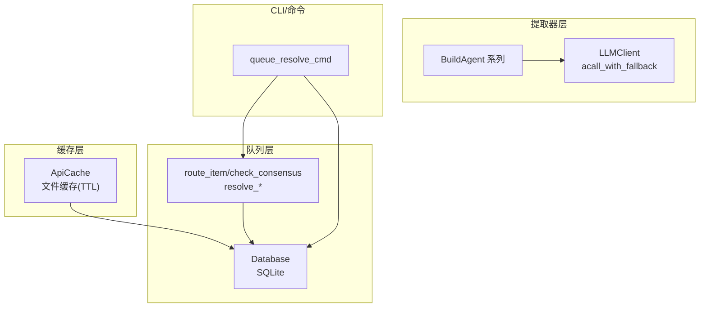
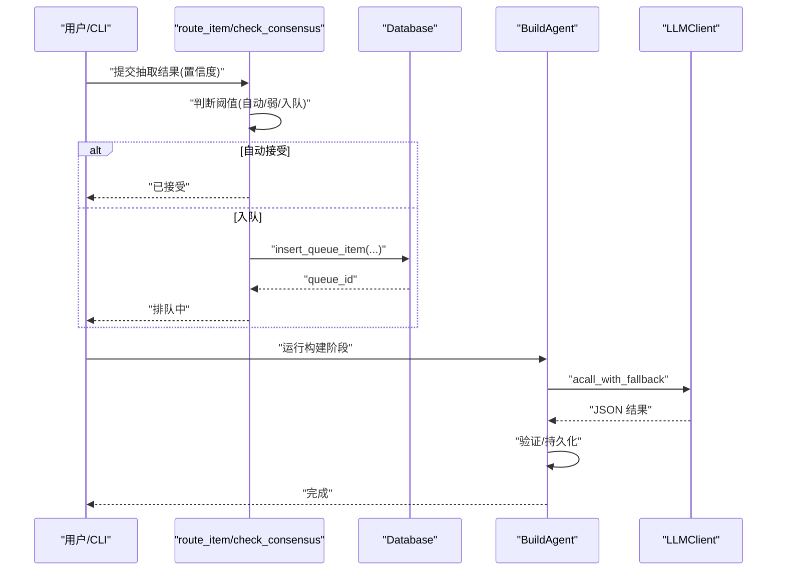
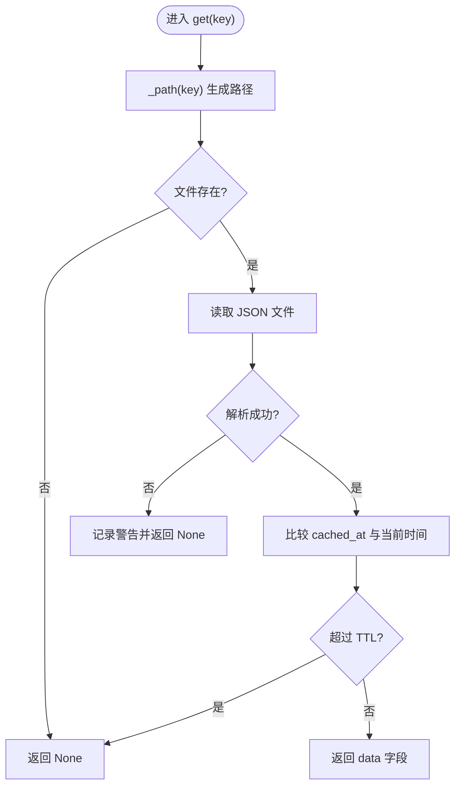
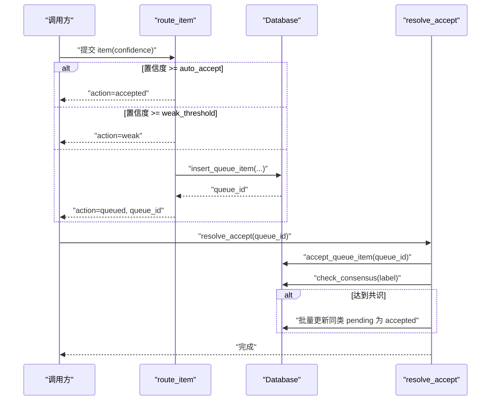
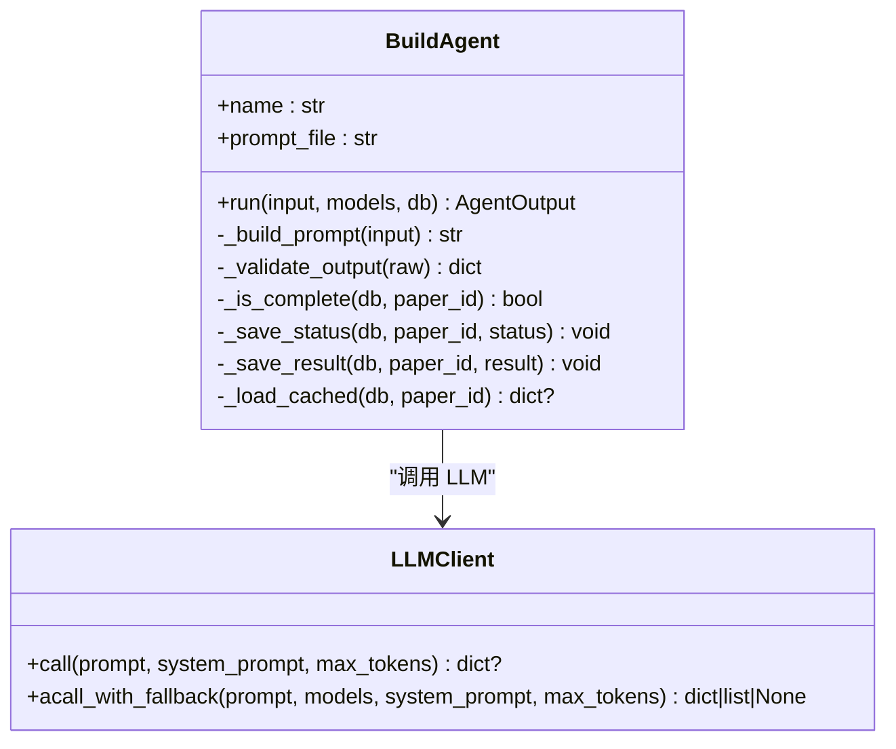
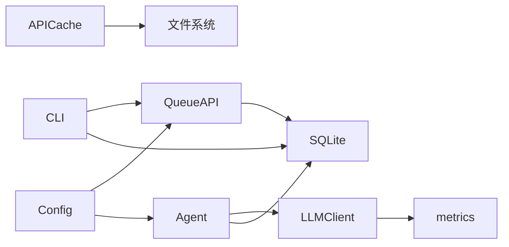

# 抽取缓存与队列系统

<cite>
**本文档引用的文件**
- [cache.py](file://src/drbrain/extractor/cache.py)
- [queue.py](file://src/drbrain/extractor/queue.py)
- [agent.py](file://src/drbrain/extractor/agent.py)
- [canonical.py](file://src/drbrain/extractor/canonical.py)
- [database.py](file://src/drbrain/storage/database.py)
- [llm_client.py](file://src/drbrain/extractor/llm_client.py)
- [config.py](file://src/drbrain/config.py)
- [metrics.py](file://src/drbrain/metrics.py)
- [export_commands.py](file://src/drbrain/cli/export_commands.py)
- [test_api_cache.py](file://tests/test_api_cache.py)
- [test_extractor_queue.py](file://tests/test_extractor_queue.py)
</cite>

## 目录
1. [引言](#引言)
2. [项目结构](#项目结构)
3. [核心组件](#核心组件)
4. [架构总览](#架构总览)
5. [详细组件分析](#详细组件分析)
6. [依赖关系分析](#依赖关系分析)
7. [性能考量](#性能考量)
8. [故障排查指南](#故障排查指南)
9. [结论](#结论)
10. [附录](#附录)

## 引言
本文件面向 DrBrain 的抽取缓存与队列系统，系统性阐述缓存策略设计、数据持久化机制、缓存失效策略；深入解析任务队列的实现、优先级调度与并发控制；记录缓存键生成规则、数据压缩与存储优化；解释队列状态管理、任务重试与失败处理；并提供内存缓存与磁盘缓存协调策略、命中率优化与资源管理建议，以及性能监控、容量规划与故障恢复的最佳实践。

## 项目结构
抽取缓存与队列系统主要分布在以下模块：
- 缓存层：基于文件的 API 响应缓存（JSON 文件 + TTL）
- 队列层：基于 SQLite 的置信度队列，支持自动接受、弱仲裁与人工仲裁
- 提取器层：构建阶段代理（BuildAgent）与 LLM 客户端，具备幂等性与重试能力
- 存储层：SQLite 数据库，统一承载论文、概念、关系、别名、队列等实体
- 配置与指标：配置加载、队列阈值、LLM 调用指标记录

图表来源
- [cache.py:14-65](file://src/drbrain/extractor/cache.py#L14-L65)
- [queue.py:10-106](file://src/drbrain/extractor/queue.py#L10-L106)
- [database.py:105-150](file://src/drbrain/storage/database.py#L105-L150)
- [agent.py:73-136](file://src/drbrain/extractor/agent.py#L73-L136)
- [llm_client.py:92-114](file://src/drbrain/extractor/llm_client.py#L92-L114)
- [export_commands.py:122-163](file://src/drbrain/cli/export_commands.py#L122-L163)

章节来源
- [cache.py:14-65](file://src/drbrain/extractor/cache.py#L14-L65)
- [queue.py:10-106](file://src/drbrain/extractor/queue.py#L10-L106)
- [database.py:105-150](file://src/drbrain/storage/database.py#L105-L150)
- [agent.py:73-136](file://src/drbrain/extractor/agent.py#L73-L136)
- [llm_client.py:92-114](file://src/drbrain/extractor/llm_client.py#L92-L114)
- [export_commands.py:122-163](file://src/drbrain/cli/export_commands.py#L122-L163)

## 核心组件
- ApiCache：基于文件的 JSON 缓存，按 MD5(key).json 存储，带 TTL 过期控制
- 队列路由与仲裁：根据置信度阈值自动接受、弱仲裁或入队；支持共识检测触发批量接受
- BuildAgent：构建阶段代理，具备幂等性、重试与结果持久化
- LLMClient：多模型回退调用，记录 LLM 使用指标
- Database：SQLite 统一存储，包含队列表、别名表、概念/关系等
- CLI 队列操作：命令行接受/拒绝队列项

章节来源
- [cache.py:14-65](file://src/drbrain/extractor/cache.py#L14-L65)
- [queue.py:10-106](file://src/drbrain/extractor/queue.py#L10-L106)
- [agent.py:53-136](file://src/drbrain/extractor/agent.py#L53-L136)
- [llm_client.py:12-114](file://src/drbrain/extractor/llm_client.py#L12-L114)
- [database.py:105-150](file://src/drbrain/storage/database.py#L105-L150)
- [export_commands.py:122-163](file://src/drbrain/cli/export_commands.py#L122-L163)

## 架构总览
系统采用“缓存 + 队列 + 代理 + 数据库”的分层架构：
- 缓存层：降低外部 API 与 LLM 调用开销，提升重复请求命中率
- 队列层：对低置信度抽取结果进行集中仲裁，避免污染主数据
- 代理层：封装构建阶段的提示构造、LLM 调用、输出校验与持久化
- 数据层：统一的数据模型与索引，支撑检索、演化信号与批量仲裁

图表来源
- [queue.py:10-32](file://src/drbrain/extractor/queue.py#L10-L32)
- [database.py:534-543](file://src/drbrain/storage/database.py#L534-L543)
- [agent.py:73-136](file://src/drbrain/extractor/agent.py#L73-L136)
- [llm_client.py:92-114](file://src/drbrain/extractor/llm_client.py#L92-L114)

## 详细组件分析

### 缓存组件：ApiCache
- 设计原理
  - 文件系统缓存：每个键映射到 MD5(key).json 文件，便于快速定位与清理
  - TTL 过期：读取时比较 cached_at 与当前时间，超过 ttl 则视为过期
  - 幂等写入：异常时仅记录警告，不中断流程
- 数据持久化机制
  - 写入：{"cached_at": 时间戳, "data": 原始数据}
  - 读取：解析 JSON，校验过期，返回 data 或 None
- 缓存失效策略
  - TTL 到期自动失效
  - clear 清空目录下所有缓存文件
  - delete 删除单个键文件
- 键生成规则
  - MD5(key) 作为文件名前缀，避免非法字符与路径冲突
- 存储优化
  - 单文件单键，便于并发安全（无锁读写）
  - 适合小到中等体积的 JSON 响应缓存
- 测试覆盖
  - TTL 生效与过期、键唯一性、跨实例持久化、删除与清空

图表来源
- [cache.py:26-39](file://src/drbrain/extractor/cache.py#L26-L39)

章节来源
- [cache.py:14-65](file://src/drbrain/extractor/cache.py#L14-L65)
- [test_api_cache.py:14-118](file://tests/test_api_cache.py#L14-L118)

### 队列组件：置信度队列与仲裁
- 实现方式
  - route_item：根据置信度阈值决定动作（自动接受/弱标记/入队），入队时写入 SQLite 表 confidence_queue
  - check_consensus：统计某标签在多篇论文中的出现次数与平均置信度，达到阈值则判定有共识
  - resolve_accept/resolve_reject：接受/拒绝队列项，并在有共识时批量更新同类项状态
  - resolve_all：按过滤条件批量接受/拒绝
- 优先级调度
  - 高置信度直接接受（无需排队）
  - 中等置信度标记为弱，等待后续仲裁
  - 低置信度进入队列，按创建时间顺序处理
- 并发控制机制
  - SQLite 事务保证队列状态变更原子性
  - CLI 命令行接口提供交互式仲裁入口
- 队列状态管理
  - pending/accepted/rejected 三态管理
  - 支持批量查询与过滤
- 任务重试与失败处理
  - LLM 失败时返回失败状态，由上层流程决定重试或降级
  - 队列项可被拒绝，避免错误数据进入主数据
- CLI 操作
  - queue_resolve_cmd 接受/拒绝指定队列项，参数互斥校验

图表来源
- [queue.py:10-32](file://src/drbrain/extractor/queue.py#L10-L32)
- [queue.py:48-68](file://src/drbrain/extractor/queue.py#L48-L68)
- [database.py:534-555](file://src/drbrain/storage/database.py#L534-L555)

章节来源
- [queue.py:10-106](file://src/drbrain/extractor/queue.py#L10-L106)
- [database.py:105-150](file://src/drbrain/storage/database.py#L105-L150)
- [export_commands.py:122-163](file://src/drbrain/cli/export_commands.py#L122-L163)
- [test_extractor_queue.py:17-95](file://tests/test_extractor_queue.py#L17-L95)

### 提取器组件：BuildAgent 与 LLM 客户端
- 幂等性与重试
  - run 步骤：检查完成状态 → 标记 in_progress → 构造提示 → LLM 回退调用 → 校验 → 持久化 → 返回
  - 失败时保存失败状态，避免重复执行
- 输出契约
  - AgentInput/AgentOutput 规范化输入输出，便于缓存与重放
- LLM 回退链
  - 多模型按序尝试，记录 token 使用与耗时，统一 JSON 解析
- 配置驱动
  - 队列阈值、最大并发等通过配置注入

图表来源
- [agent.py:53-136](file://src/drbrain/extractor/agent.py#L53-L136)
- [llm_client.py:12-114](file://src/drbrain/extractor/llm_client.py#L12-L114)

章节来源
- [agent.py:53-136](file://src/drbrain/extractor/agent.py#L53-L136)
- [llm_client.py:12-114](file://src/drbrain/extractor/llm_client.py#L12-L114)
- [config.py:96-99](file://src/drbrain/config.py#L96-L99)

### 概念标准化与别名对齐（SmartAligner）
- 标准化与别名表
  - normalize_label：停用词过滤、小写化、简单单数化
  - AliasTable：变体到规范 ID 的映射，支持创建新 ID
- BM25 + LLM 混合对齐
  - 构建现有概念的 BM25 索引，高分自动对齐，中等分数入队 LLM 批仲裁
  - LLM 不确定则保留独立，减少误判
- 阈值策略
  - BM25_AUTO_ALIGN、BM25_PENDING_MIN 控制自动/仲裁/新建行为

章节来源
- [canonical.py:73-252](file://src/drbrain/extractor/canonical.py#L73-L252)

## 依赖关系分析
- 缓存依赖
  - ApiCache 依赖文件系统与时间戳，不依赖数据库
- 队列依赖
  - route_item/check_consensus/resolve_* 依赖 Database 插入/更新/查询
  - CLI 命令依赖队列 API 与 Database
- 提取器依赖
  - BuildAgent 依赖 LLMClient 与 Database（状态与结果持久化）
- 配置与指标
  - 队列阈值来自配置
  - LLMClient 记录指标到 metrics

图表来源
- [cache.py:14-65](file://src/drbrain/extractor/cache.py#L14-L65)
- [queue.py:10-106](file://src/drbrain/extractor/queue.py#L10-L106)
- [database.py:105-150](file://src/drbrain/storage/database.py#L105-L150)
- [agent.py:73-136](file://src/drbrain/extractor/agent.py#L73-L136)
- [llm_client.py:46-63](file://src/drbrain/extractor/llm_client.py#L46-L63)
- [config.py:96-99](file://src/drbrain/config.py#L96-L99)
- [metrics.py:74-96](file://src/drbrain/metrics.py#L74-L96)

章节来源
- [database.py:105-150](file://src/drbrain/storage/database.py#L105-L150)
- [config.py:96-99](file://src/drbrain/config.py#L96-L99)
- [metrics.py:74-96](file://src/drbrain/metrics.py#L74-L96)

## 性能考量
- 缓存命中率优化
  - 合理设置 TTL：平衡新鲜度与命中率
  - 键规范化：确保相同请求映射到同一键
  - 目录分片：大流量场景可考虑按哈希前缀分目录
- 队列吞吐与延迟
  - 批量仲裁：将多个待仲裁项合并一次 LLM 请求，降低调用次数
  - 优先级：高置信度直通，减少队列积压
  - 并发：LLM 调用异步化，数据库事务串行化关键路径
- 存储与索引
  - SQLite WAL 模式提升并发写入性能
  - 队列状态建立索引，加速查询与批量处理
- 资源管理
  - LLM 调用限额与超时控制，避免阻塞
  - 限制并发数（配置项），防止资源争用
- 监控与容量规划
  - 记录 LLM token 使用与耗时，评估成本与性能
  - 基于队列长度与仲裁耗时进行容量预警

## 故障排查指南
- 缓存问题
  - 缓存未命中：确认键是否一致、TTL 是否过短、文件权限是否正确
  - 缓存损坏：检查 JSON 格式与 cached_at 字段
- 队列问题
  - 无法接受/拒绝：确认 queue_id 是否存在、状态是否为 pending
  - 共识未触发：检查最小论文数与平均置信度阈值
- LLM 失败
  - 回退链耗尽：检查模型配置与网络连通性
  - 输出非 JSON：确认响应格式与 JSON 解析逻辑
- CLI 操作
  - 参数互斥：同时指定 accept 与 reject 将报错
  - 权限不足：确保数据库与缓存目录可写

章节来源
- [test_api_cache.py:14-118](file://tests/test_api_cache.py#L14-L118)
- [test_extractor_queue.py:17-95](file://tests/test_extractor_queue.py#L17-L95)
- [export_commands.py:122-163](file://src/drbrain/cli/export_commands.py#L122-L163)
- [llm_client.py:66-89](file://src/drbrain/extractor/llm_client.py#L66-L89)

## 结论
DrBrain 的抽取缓存与队列系统通过“文件缓存 + SQLite 队列 + 幂等代理 + LLM 回退链”实现了高效、可审计、可扩展的抽取流水线。缓存以 TTL 保障时效性与性能，队列以阈值与共识机制确保质量，代理以契约化与重试增强鲁棒性。配合指标监控与 CLI 工具，系统在学术知识抽取场景中具备良好的工程化落地能力。

## 附录
- 最佳实践清单
  - 缓存：合理设置 TTL，定期清理过期文件；对热点键增加预热
  - 队列：根据业务设定阈值；定期审查仲裁结果；必要时引入批仲裁
  - 代理：保持提示稳定；对不稳定输出增加重试与降级策略
  - 数据：关注 WAL 与索引；定期备份；监控增长趋势
  - 监控：记录 LLM 成本与耗时；观察队列积压与仲裁耗时；设置告警阈值