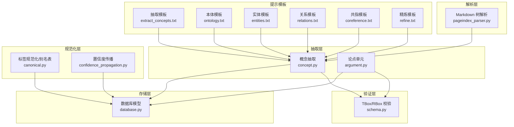
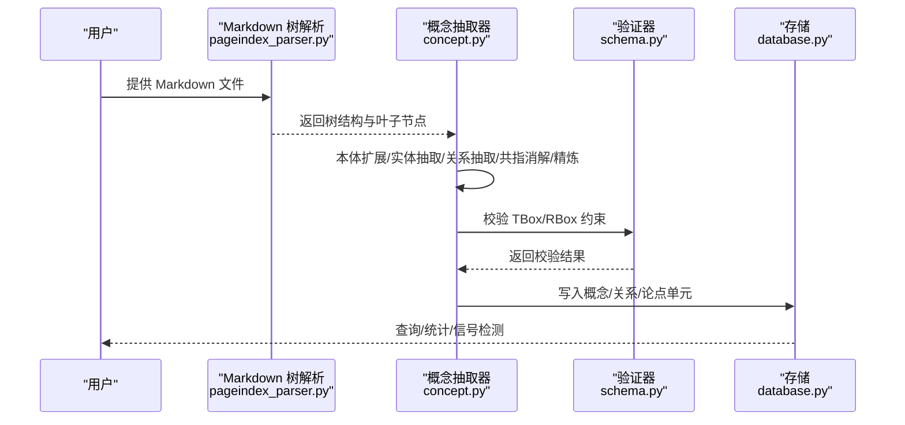
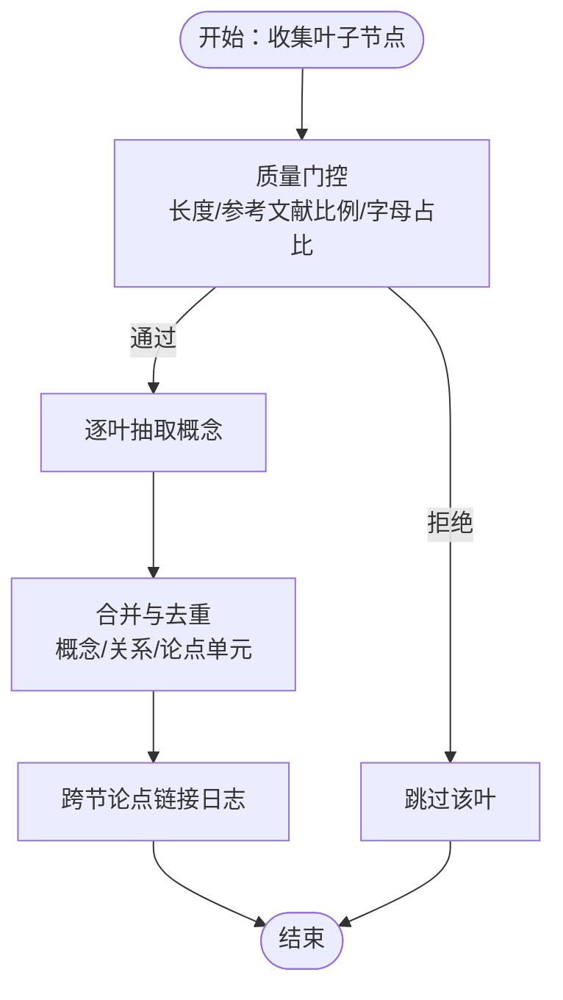
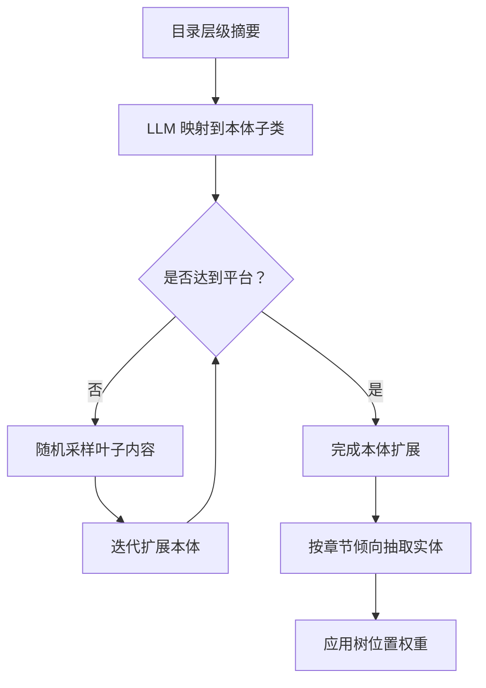
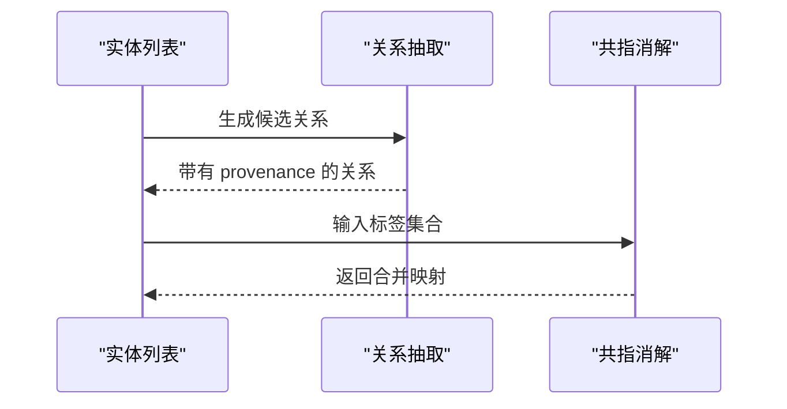
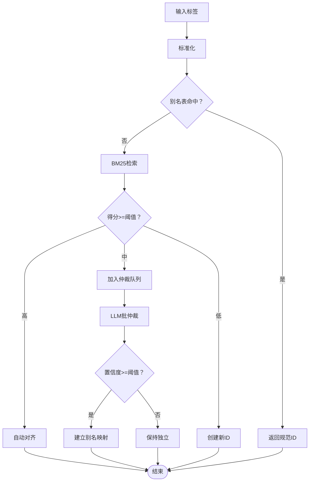
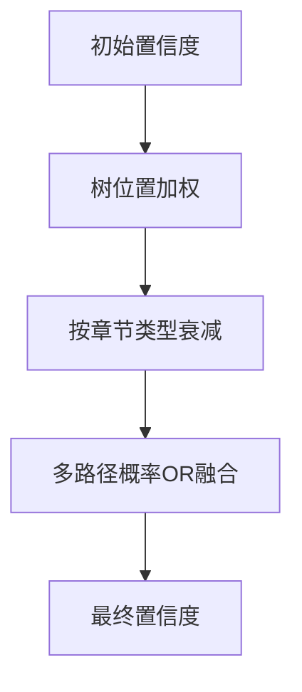
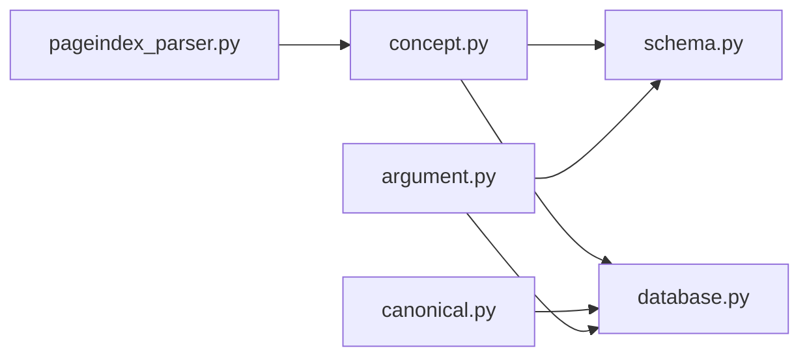

# 概念处理系统

<cite>
**本文引用的文件**
- [concept.py](file://src/drbrain/extractor/concept.py)
- [canonical.py](file://src/drbrain/extractor/canonical.py)
- [confidence_propagation.py](file://src/drbrain/extractor/confidence_propagation.py)
- [argument.py](file://src/drbrain/extractor/argument.py)
- [schema.py](file://src/drbrain/validator/schema.py)
- [database.py](file://src/drbrain/storage/database.py)
- [pageindex_parser.py](file://src/drbrain/parser/pageindex_parser.py)
- [extract_concepts.txt](file://prompts/extract_concepts.txt)
- [ontology.txt](file://prompts/ontology.txt)
- [entities.txt](file://prompts/entities.txt)
- [relations.txt](file://prompts/relations.txt)
- [coreference.txt](file://prompts/coreference.txt)
- [refine.txt](file://prompts/refine.txt)
- [test_concept.py](file://tests/test_concept.py)
- [test_canonical.py](file://tests/test_canonical.py)
</cite>

## 目录
1. [简介](#简介)
2. [项目结构](#项目结构)
3. [核心组件](#核心组件)
4. [架构总览](#架构总览)
5. [详细组件分析](#详细组件分析)
6. [依赖关系分析](#依赖关系分析)
7. [性能考量](#性能考量)
8. [故障排查指南](#故障排查指南)
9. [结论](#结论)
10. [附录](#附录)

## 简介
本文件面向 DrBrain 的“概念处理系统”，系统性阐述概念抽取、标签规范化与类型分类、置信度计算与传播、层次关系处理、同义词与概念合并策略、冲突解决机制，以及概念在知识图谱中的表示、属性绑定与上下文关联。文档以代码为依据，结合测试用例与提示模板，提供可操作的最佳实践与排错建议。

## 项目结构
概念处理系统主要由以下模块构成：
- 抽取层：基于树结构的分段抽取与多阶段知识图谱构建（概念抽取、本体扩展、实体抽取、关系抽取、共指消解、迭代精炼）
- 规范化层：标签标准化、别名表与智能对齐（BM25 + LLM）
- 验证层：TBox/RBox 约束校验与传递闭包推理
- 存储层：SQLite 数据模型与索引设计
- 解析层：Markdown 文档树解析与摘要生成
- 提示模板：抽取、本体、实体、关系、共指、精炼等提示工程



图表来源
- [concept.py:1-901](file://src/drbrain/extractor/concept.py#L1-L901)
- [canonical.py:1-252](file://src/drbrain/extractor/canonical.py#L1-L252)
- [confidence_propagation.py:1-87](file://src/drbrain/extractor/confidence_propagation.py#L1-L87)
- [argument.py:1-87](file://src/drbrain/extractor/argument.py#L1-L87)
- [schema.py:1-211](file://src/drbrain/validator/schema.py#L1-L211)
- [database.py:1-775](file://src/drbrain/storage/database.py#L1-L775)
- [pageindex_parser.py:1-1033](file://src/drbrain/parser/pageindex_parser.py#L1-L1033)
- [extract_concepts.txt:1-47](file://prompts/extract_concepts.txt#L1-L47)
- [ontology.txt:1-23](file://prompts/ontology.txt#L1-L23)
- [entities.txt:1-19](file://prompts/entities.txt#L1-L19)
- [relations.txt:1-24](file://prompts/relations.txt#L1-L24)
- [coreference.txt:1-14](file://prompts/coreference.txt#L1-L14)
- [refine.txt:1-21](file://prompts/refine.txt#L1-L21)

章节来源
- [concept.py:1-901](file://src/drbrain/extractor/concept.py#L1-L901)
- [pageindex_parser.py:1-1033](file://src/drbrain/parser/pageindex_parser.py#L1-L1033)

## 核心组件
- 概念抽取与合并
  - 支持从整篇论文或树形结构中抽取问题、方法、结论、争议、缺口、参与者等概念，并进行去重与合并（按标签去重，保留最高置信度；关系与论点单元按复合键去重）
  - 通过质量门控过滤低质量内容，避免将参考文献列表等无效文本送入 LLM
- 多阶段图构建
  - 本体扩展：基于目录层级与内容采样迭代扩展领域本体
  - 实体抽取：按章节类型倾向引导抽取焦点
  - 关系抽取：基于 TBox 约束连接实体
  - 共指消解：识别并合并语义相同但表述不同的标签
  - 迭代精炼：自动审查与修正抽取结果
- 标签规范化与智能对齐
  - 停用词过滤、小词还原、标点清理、大小写归一
  - 别名表映射与新 ID 分配
  - BM25 向量化检索 + LLM 批仲裁的混合对齐策略
- 置信度计算与传播
  - 树位置加权：深部章节置信度更高
  - 跨章节论点链接：同一目标跨节出现时标记交叉支持/挑战
  - 多路径置信度融合与衰减
- 知识图谱表示与约束
  - 概念、关系、论点单元的持久化与索引
  - TBox/RBox 约束校验与传递闭包补全
- 上下文关联
  - 树节点 ID 与章节信息随抽取结果传递，便于溯源与可视化

章节来源
- [concept.py:191-340](file://src/drbrain/extractor/concept.py#L191-L340)
- [concept.py:498-495](file://src/drbrain/extractor/concept.py#L498-L495)
- [concept.py:670-737](file://src/drbrain/extractor/concept.py#L670-L737)
- [concept.py:740-799](file://src/drbrain/extractor/concept.py#L740-L799)
- [concept.py:770-799](file://src/drbrain/extractor/concept.py#L770-L799)
- [concept.py:419-495](file://src/drbrain/extractor/concept.py#L419-L495)
- [canonical.py:110-252](file://src/drbrain/extractor/canonical.py#L110-L252)
- [confidence_propagation.py:1-87](file://src/drbrain/extractor/confidence_propagation.py#L1-L87)
- [schema.py:1-211](file://src/drbrain/validator/schema.py#L1-L211)
- [database.py:1-775](file://src/drbrain/storage/database.py#L1-L775)

## 架构总览
概念处理系统采用“树驱动 + 多阶段提示”的流水线式架构，围绕 LLM 的结构化输出与后处理展开，确保抽取结果在类型、关系与置信度上满足学术知识图谱的要求。



图表来源
- [pageindex_parser.py:412-486](file://src/drbrain/parser/pageindex_parser.py#L412-L486)
- [concept.py:419-495](file://src/drbrain/extractor/concept.py#L419-L495)
- [schema.py:97-120](file://src/drbrain/validator/schema.py#L97-L120)
- [database.py:350-532](file://src/drbrain/storage/database.py#L350-L532)

## 详细组件分析

### 组件 A：概念抽取与合并（树驱动）
- 树结构收集叶子节点，逐叶提取并合并结果
- 去重策略
  - 概念：按标签（不区分大小写）去重，保留最高置信度
  - 关系：按三元组 (head, rel, tail) 去重
  - 论点单元：按 (claim, target) 去重，保留最高置信度
- 质量门控：拒绝过短、参考文献主导或字母占比过低的内容
- 跨节论点链接：同一目标在多节出现时记录交叉支持/挑战模式（仅日志，不生成边）



图表来源
- [concept.py:73-106](file://src/drbrain/extractor/concept.py#L73-L106)
- [concept.py:191-258](file://src/drbrain/extractor/concept.py#L191-L258)
- [concept.py:148-188](file://src/drbrain/extractor/concept.py#L148-L188)

章节来源
- [concept.py:73-106](file://src/drbrain/extractor/concept.py#L73-L106)
- [concept.py:191-258](file://src/drbrain/extractor/concept.py#L191-L258)
- [concept.py:148-188](file://src/drbrain/extractor/concept.py#L148-L188)
- [test_concept.py:18-75](file://tests/test_concept.py#L18-L75)
- [test_concept.py:80-143](file://tests/test_concept.py#L80-L143)
- [test_concept.py:496-577](file://tests/test_concept.py#L496-L577)

### 组件 B：本体扩展与实体抽取
- 本体扩展：基于目录层级与内容采样迭代扩展，使用自适应平台检测（零增长或相对阈值）
- 实体抽取：按章节类型倾向（如方法/结果优先）引导抽取焦点，附加树位置权重提升置信度



图表来源
- [concept.py:498-585](file://src/drbrain/extractor/concept.py#L498-L585)
- [concept.py:670-737](file://src/drbrain/extractor/concept.py#L670-L737)
- [concept.py:633-668](file://src/drbrain/extractor/concept.py#L633-L668)
- [ontology.txt:1-23](file://prompts/ontology.txt#L1-L23)
- [entities.txt:1-19](file://prompts/entities.txt#L1-L19)

章节来源
- [concept.py:498-585](file://src/drbrain/extractor/concept.py#L498-L585)
- [concept.py:670-737](file://src/drbrain/extractor/concept.py#L670-L737)
- [concept.py:633-668](file://src/drbrain/extractor/concept.py#L633-L668)
- [test_concept.py:655-687](file://tests/test_concept.py#L655-L687)
- [test_concept.py:689-703](file://tests/test_concept.py#L689-L703)

### 组件 C：关系抽取与共指消解
- 关系抽取：基于 TBox 约束生成关系，继承源概念的树节点与章节信息
- 共指消解：识别重复标签并合并，保留更完整的标签作为规范形式



图表来源
- [concept.py:740-767](file://src/drbrain/extractor/concept.py#L740-L767)
- [concept.py:770-799](file://src/drbrain/extractor/concept.py#L770-L799)
- [relations.txt:1-24](file://prompts/relations.txt#L1-L24)
- [coreference.txt:1-14](file://prompts/coreference.txt#L1-L14)

章节来源
- [concept.py:740-767](file://src/drbrain/extractor/concept.py#L740-L767)
- [concept.py:770-799](file://src/drbrain/extractor/concept.py#L770-L799)
- [relations.txt:1-24](file://prompts/relations.txt#L1-L24)
- [coreference.txt:1-14](file://prompts/coreference.txt#L1-L14)

### 组件 D：标签规范化与智能对齐（BM25 + LLM）
- 标准化：停用词过滤、标点清理、大小写归一、复数简化
- 别名表：标签变体到规范 ID 的映射，支持就地创建新 ID
- 对齐策略：
  - 步骤 1：规范化 + 精确匹配
  - 步骤 2：BM25 模糊检索，高分自动对齐，中等分数进入 LLM 批仲裁队列
  - 步骤 3：LLM 决策（置信度阈值），成功则建立别名映射
  - 步骤 4：无匹配则创建新 ID



图表来源
- [canonical.py:52-70](file://src/drbrain/extractor/canonical.py#L52-L70)
- [canonical.py:73-108](file://src/drbrain/extractor/canonical.py#L73-L108)
- [canonical.py:110-252](file://src/drbrain/extractor/canonical.py#L110-L252)

章节来源
- [canonical.py:52-70](file://src/drbrain/extractor/canonical.py#L52-L70)
- [canonical.py:73-108](file://src/drbrain/extractor/canonical.py#L73-L108)
- [canonical.py:110-252](file://src/drbrain/extractor/canonical.py#L110-L252)
- [test_canonical.py:18-31](file://tests/test_canonical.py#L18-L31)
- [test_canonical.py:35-60](file://tests/test_canonical.py#L35-L60)
- [test_canonical.py:76-131](file://tests/test_canonical.py#L76-L131)
- [test_canonical.py:189-230](file://tests/test_canonical.py#L189-L230)

### 组件 E：置信度计算与传播
- 树位置加权：深部章节置信度更高，浅层章节更低
- 节段衰减：不同章节类型采用不同衰减因子
- 多路径融合：多条独立路径的置信度通过概率 OR 融合提升整体置信度



图表来源
- [concept.py:633-668](file://src/drbrain/extractor/concept.py#L633-L668)
- [confidence_propagation.py:31-87](file://src/drbrain/extractor/confidence_propagation.py#L31-L87)

章节来源
- [concept.py:633-668](file://src/drbrain/extractor/concept.py#L633-L668)
- [confidence_propagation.py:1-87](file://src/drbrain/extractor/confidence_propagation.py#L1-L87)

### 组件 F：知识图谱表示与属性绑定
- 概念：类型、标签、置信度、章节、树节点 ID、首次/最后出现时间
- 关系：源 ID、目标 ID、关系类型、来源论文、权重、树节点 ID、章节
- 论点单元：声明、类型、目标标签/类型、证据类型/描述、机制、章节、置信度
- 索引与迁移：外键约束、WAL 模式、版本化迁移

```mermaid
erDiagram
PAPERS {
text local_id PK
text title
text abstract
int year
text paper_type
text status
text journal
text publisher
int citation_count
text volume
text pages
text authors
timestamp created_at
}
CONCEPTS {
int concept_id PK
text local_id FK
text type
text label
real confidence
text section
text node_id
int first_seen
int last_seen
}
ARGUMENTS {
int arg_id PK
text source_paper FK
text claim
text claim_type
text target_label
text target_type
text evidence_type
text evidence_detail
text mechanism
text section
text node_id
real confidence
timestamp created_at
}
EDGES {
text src_id
text dst_id
text relation
text source_paper
real weight
PK src_id,dst_id,relation,source_paper
}
ALIASES {
text variant PK
text canonical_id
}
PAPERS ||--o{ CONCEPTS : "拥有"
PAPERS ||--o{ ARGUMENTS : "产生"
CONCEPTS ||--o{ EDGES : "连接"
CONCEPTS ||--o{ EDGES : "被连接"
```

图表来源
- [database.py:10-156](file://src/drbrain/storage/database.py#L10-L156)
- [database.py:350-532](file://src/drbrain/storage/database.py#L350-L532)

章节来源
- [database.py:10-156](file://src/drbrain/storage/database.py#L10-L156)
- [database.py:350-532](file://src/drbrain/storage/database.py#L350-L532)

### 组件 G：提示模板与约束
- 抽取模板：定义六类概念、关系类型与论点单元字段
- 本体模板：将目录层级映射到领域本体子类
- 实体/关系/共指/精炼模板：指导 LLM 产出结构化 JSON

章节来源
- [extract_concepts.txt:1-47](file://prompts/extract_concepts.txt#L1-L47)
- [ontology.txt:1-23](file://prompts/ontology.txt#L1-L23)
- [entities.txt:1-19](file://prompts/entities.txt#L1-L19)
- [relations.txt:1-24](file://prompts/relations.txt#L1-L24)
- [coreference.txt:1-14](file://prompts/coreference.txt#L1-L14)
- [refine.txt:1-21](file://prompts/refine.txt#L1-L21)

## 依赖关系分析
- 概念抽取依赖于解析器提供的树结构与叶子节点内容
- 验证器依赖于抽取结果中的关系与概念类型映射
- 存储层为所有组件提供持久化能力，包含外键与索引优化
- 规范化层与存储层通过别名表与概念 ID 绑定实现跨文档对齐



图表来源
- [pageindex_parser.py:412-486](file://src/drbrain/parser/pageindex_parser.py#L412-L486)
- [concept.py:419-495](file://src/drbrain/extractor/concept.py#L419-L495)
- [schema.py:97-120](file://src/drbrain/validator/schema.py#L97-L120)
- [database.py:350-532](file://src/drbrain/storage/database.py#L350-L532)
- [canonical.py:110-252](file://src/drbrain/extractor/canonical.py#L110-L252)
- [argument.py:1-87](file://src/drbrain/extractor/argument.py#L1-L87)

章节来源
- [concept.py:1-901](file://src/drbrain/extractor/concept.py#L1-L901)
- [schema.py:1-211](file://src/drbrain/validator/schema.py#L1-L211)
- [database.py:1-775](file://src/drbrain/storage/database.py#L1-L775)

## 性能考量
- 并发控制：抽取阶段使用信号量限制并发，避免 LLM 限流与资源争用
- 质量门控：过滤无效内容，减少不必要的 LLM 调用
- BM25 索引：基于现有概念构建倒排索引，加速模糊匹配
- 索引优化：针对概念类型、标签、时间戳与队列状态建立索引
- 传输闭包：仅对声明为传递的关系执行闭包补全，避免全图遍历

章节来源
- [concept.py:311-340](file://src/drbrain/extractor/concept.py#L311-L340)
- [canonical.py:129-142](file://src/drbrain/extractor/canonical.py#L129-L142)
- [database.py:115-122](file://src/drbrain/storage/database.py#L115-L122)

## 故障排查指南
- 抽取失败或空结果
  - 检查模型配置是否为空
  - 确认叶子节点是否存在且通过质量门控
  - 参考测试用例：[test_concept.py:221-285](file://tests/test_concept.py#L221-L285)
- 关系 TBox 违规
  - 使用验证器检查关系与头实体类型是否匹配
  - 参考测试用例：[test_concept.py:604-630](file://tests/test_concept.py#L604-L630)
- 共指未生效
  - 确认 LLM 是否返回了合并决策
  - 检查仲裁队列是否已清空
  - 参考测试用例：[test_canonical.py:157-184](file://tests/test_canonical.py#L157-L184)
- 置信度过低
  - 检查树位置权重与章节衰减设置
  - 参考：[confidence_propagation.py:13-28](file://src/drbrain/extractor/confidence_propagation.py#L13-L28)
- 存储异常
  - 查看迁移日志与外键约束
  - 参考：[database.py:175-200](file://src/drbrain/storage/database.py#L175-L200)

章节来源
- [test_concept.py:221-285](file://tests/test_concept.py#L221-L285)
- [test_concept.py:604-630](file://tests/test_concept.py#L604-L630)
- [test_canonical.py:157-184](file://tests/test_canonical.py#L157-L184)
- [confidence_propagation.py:13-28](file://src/drbrain/extractor/confidence_propagation.py#L13-L28)
- [database.py:175-200](file://src/drbrain/storage/database.py#L175-L200)

## 结论
DrBrain 的概念处理系统通过“树驱动 + 多阶段提示 + 结构化验证 + 智能对齐”的组合，实现了从学术论文到高质量知识图谱的端到端处理。系统在准确性、一致性与可扩展性之间取得平衡：抽取阶段保证结构化输出与上下文溯源，验证阶段确保类型与关系约束，规范化阶段通过 BM25 与 LLM 协作实现跨文档对齐，存储层提供完备的索引与迁移能力。建议在生产环境中结合质量门控、并发限制与仲裁队列策略，持续优化抽取与对齐效果。

## 附录
- 示例：处理不同类型的学术概念
  - 问题（Problem）：来自摘要/引言的科研问题陈述
  - 方法（Method）：来自方法/方法学/实验部分的技术方案
  - 结论（Conclusion）：来自结果/评估/讨论的实证发现
  - 争议（Debate）：来自讨论/相关工作中的观点分歧
  - 缺口（Gap）：来自未来工作/局限性的开放问题
  - 参与者（Actor）：作者/实验室/研究机构
  - 参考：[extract_concepts.txt:29-46](file://prompts/extract_concepts.txt#L29-L46)
- 最佳实践
  - 在抽取前先构建稳定的树结构，确保叶子节点覆盖关键段落
  - 使用章节类型倾向与树位置权重提升置信度
  - 对关系抽取结果进行 TBox/RBox 校验与传递闭包补全
  - 将中等置信度的候选对齐项纳入 LLM 批仲裁队列
  - 定期运行精炼模板以发现矛盾与冗余