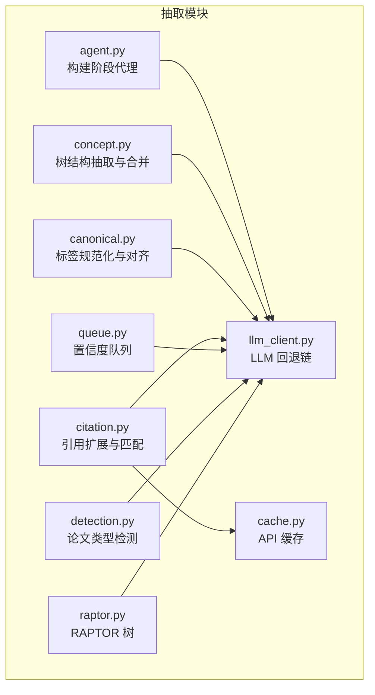
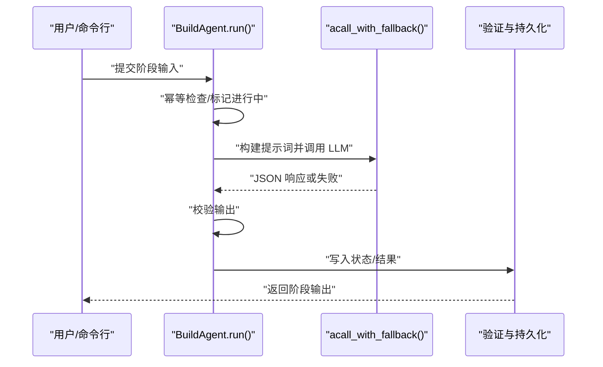
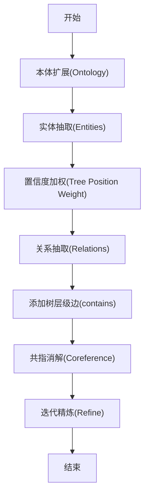
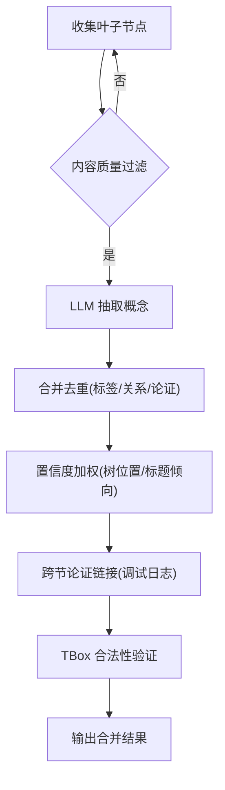
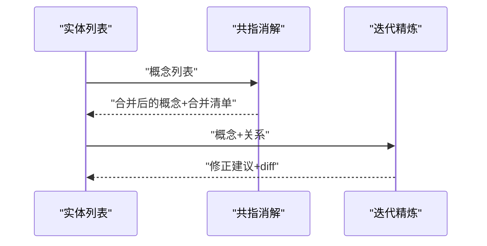
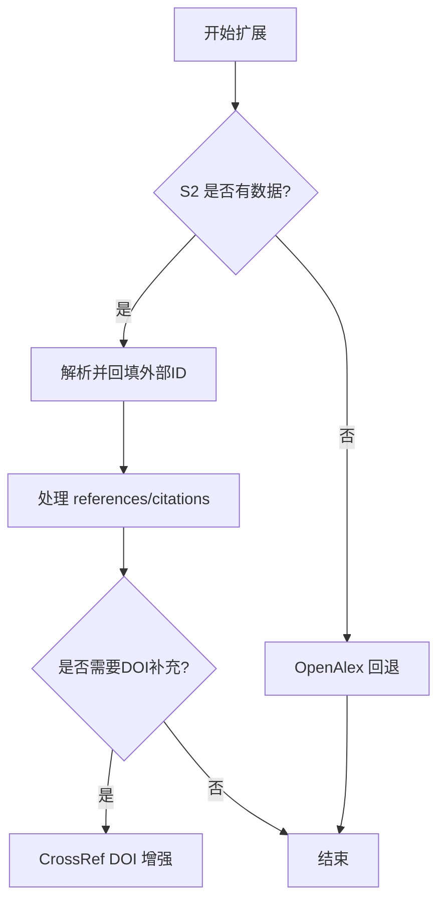
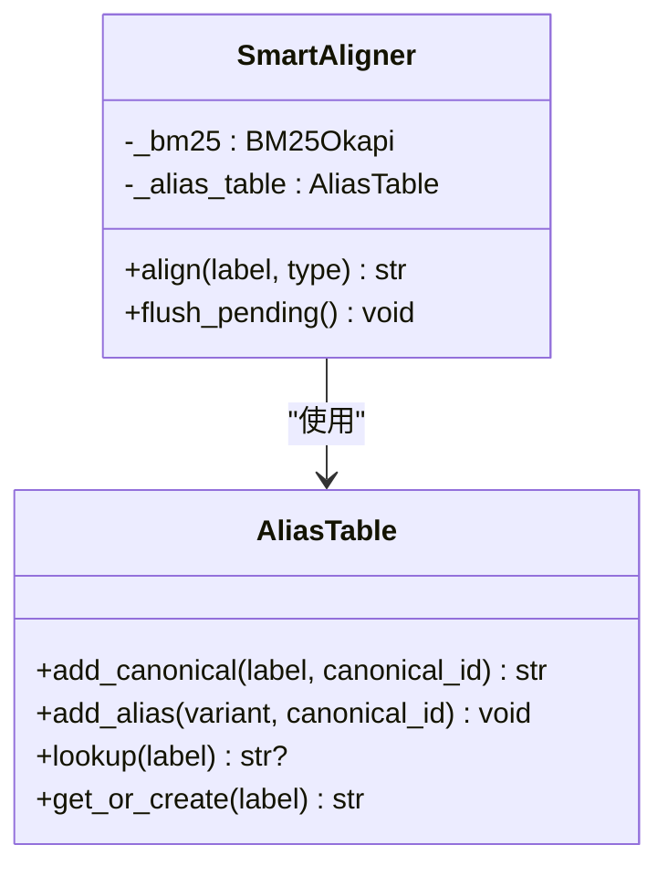
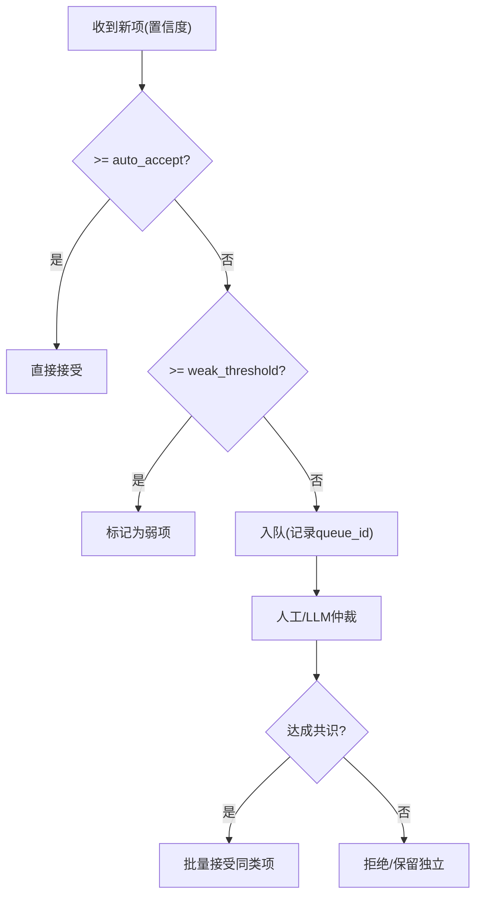
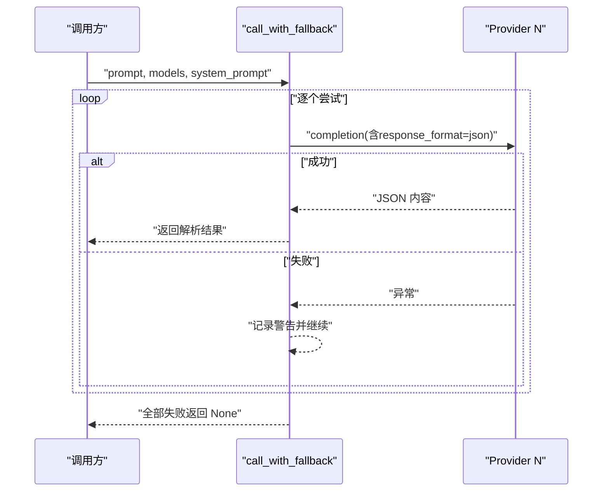
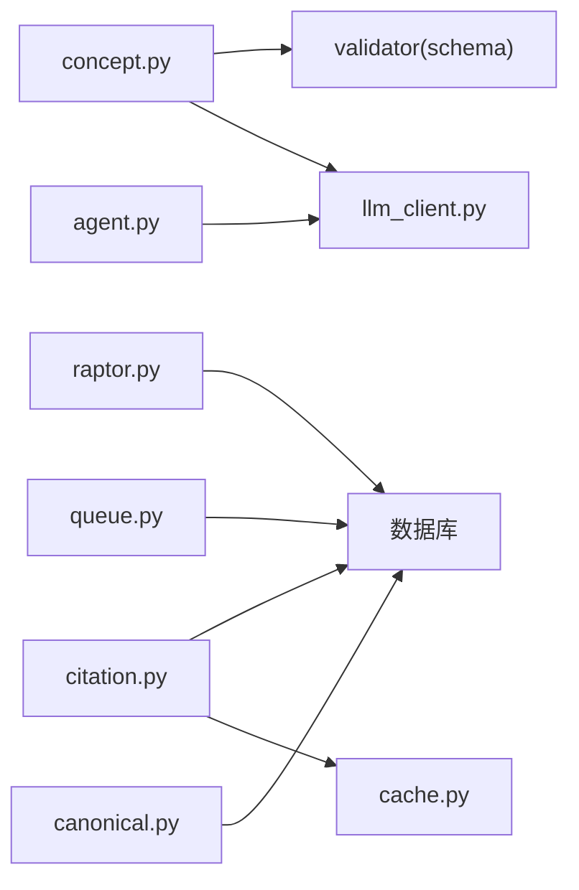

# 知识抽取模块

<cite>
**本文档引用的文件**
- [src/drbrain/extractor/__init__.py](file://src/drbrain/extractor/__init__.py)
- [src/drbrain/extractor/agent.py](file://src/drbrain/extractor/agent.py)
- [src/drbrain/extractor/concept.py](file://src/drbrain/extractor/concept.py)
- [src/drbrain/extractor/canonical.py](file://src/drbrain/extractor/canonical.py)
- [src/drbrain/extractor/citation.py](file://src/drbrain/extractor/citation.py)
- [src/drbrain/extractor/queue.py](file://src/drbrain/extractor/queue.py)
- [src/drbrain/extractor/cache.py](file://src/drbrain/extractor/cache.py)
- [src/drbrain/extractor/llm_client.py](file://src/drbrain/extractor/llm_client.py)
- [src/drbrain/extractor/detection.py](file://src/drbrain/extractor/detection.py)
- [src/drbrain/extractor/raptor.py](file://src/drbrain/extractor/raptor.py)
- [prompts/extract_concepts.txt](file://prompts/extract_concepts.txt)
- [prompts/entities.txt](file://prompts/entities.txt)
- [prompts/relations.txt](file://prompts/relations.txt)
- [prompts/coreference.txt](file://prompts/coreference.txt)
- [prompts/refine.txt](file://prompts/refine.txt)
</cite>

## 目录
1. [引言](#引言)
2. [项目结构](#项目结构)
3. [核心组件](#核心组件)
4. [架构总览](#架构总览)
5. [详细组件分析](#详细组件分析)
6. [依赖分析](#依赖分析)
7. [性能考虑](#性能考虑)
8. [故障排除指南](#故障排除指南)
9. [结论](#结论)
10. [附录](#附录)

## 引言
本文件系统性阐述 DrBrain 知识抽取模块的设计与实现，覆盖 AI 抽取代理的工作原理、概念抽取算法、引用处理机制与规范化流程；深入说明实体识别、关系抽取、共指消解与迭代精炼的技术实现；记录抽取器的配置选项、缓存策略与队列管理机制；给出与 LLM 客户端的交互模式、错误处理与性能优化建议，并提供使用模式、最佳实践与故障排除指南。

## 项目结构
抽取模块位于 src/drbrain/extractor 下，围绕“提示词驱动 + LLM 回退链 + 结构化输出 + 持久化状态”的流水线组织，关键文件包括：
- agent.py：构建阶段代理（BuildAgent）与五阶段抽取流水线（本体扩展、实体抽取、关系抽取、共指消解、迭代精炼）
- concept.py：基于树结构的概念抽取与合并、验证、置信度加权、跨节论证链接
- canonical.py：标签规范化、别名表与 BM25+LLM 混合对齐
- citation.py：多源引用网络扩展（S2、OpenAlex、CrossRef），带缓存与重试
- queue.py：基于置信度的路由、共识检测与批量决议
- cache.py：文件型 API 缓存（TTL）
- llm_client.py：LLM 调用封装与回退链、指标记录
- detection.py：论文类型检测（启发式 + 可选 LLM）
- raptor.py：RAPTOR 递归语义树构建（可选用于高层摘要）

**图表来源**
- [src/drbrain/extractor/agent.py:1-368](file://src/drbrain/extractor/agent.py#L1-L368)
- [src/drbrain/extractor/concept.py:1-901](file://src/drbrain/extractor/concept.py#L1-L901)
- [src/drbrain/extractor/canonical.py:1-252](file://src/drbrain/extractor/canonical.py#L1-L252)
- [src/drbrain/extractor/citation.py:1-710](file://src/drbrain/extractor/citation.py#L1-L710)
- [src/drbrain/extractor/queue.py:1-106](file://src/drbrain/extractor/queue.py#L1-L106)
- [src/drbrain/extractor/cache.py:1-65](file://src/drbrain/extractor/cache.py#L1-L65)
- [src/drbrain/extractor/llm_client.py:1-154](file://src/drbrain/extractor/llm_client.py#L1-L154)
- [src/drbrain/extractor/detection.py:1-138](file://src/drbrain/extractor/detection.py#L1-L138)
- [src/drbrain/extractor/raptor.py:1-349](file://src/drbrain/extractor/raptor.py#L1-L349)

**章节来源**
- [src/drbrain/extractor/__init__.py:1-2](file://src/drbrain/extractor/__init__.py#L1-L2)

## 核心组件
- 构建阶段代理（BuildAgent）：以系统提示词驱动，输入/输出为结构化契约，具备幂等性（基于数据库状态跟踪）、重试与回退链调用 LLM、结果校验与持久化。
- 五阶段抽取流水线：本体扩展（Ontology）→ 实体抽取（Entities）→ 关系抽取（Relations）→ 共指消解（Coreference）→ 迭代精炼（Refine）。
- 概念抽取与合并：基于 PageIndex 树结构，按叶子节点并发抽取，质量过滤与内容去噪，合并去重与置信度加权，跨节论证链接。
- 规范化与对齐：标签规范化（停用词过滤、单复数简化）、别名表、BM25 检索与 LLM 批仲裁。
- 引用扩展：S2/OpenAlex/CrossRef 多源回退、外部 ID 填充、缓存与速率控制、占位论文与边插入。
- 队列与共识：基于置信度的动作路由（接受/弱/入队），共识检测与批量决议。
- LLM 客户端：统一的回退链调用、指标记录、异步/同步文本与 JSON 输出。
- 论文类型检测：启发式关键词匹配，必要时 LLM 辅助细化。
- RAPTOR 树：嵌入 → UMAP 降维 → GMM+BIC 自动聚类 → LLM 聚类摘要 → 递归构建高层摘要树。

**章节来源**
- [src/drbrain/extractor/agent.py:53-368](file://src/drbrain/extractor/agent.py#L53-L368)
- [src/drbrain/extractor/concept.py:498-496](file://src/drbrain/extractor/concept.py#L498-L496)
- [src/drbrain/extractor/canonical.py:73-252](file://src/drbrain/extractor/canonical.py#L73-L252)
- [src/drbrain/extractor/citation.py:231-710](file://src/drbrain/extractor/citation.py#L231-L710)
- [src/drbrain/extractor/queue.py:10-106](file://src/drbrain/extractor/queue.py#L10-L106)
- [src/drbrain/extractor/llm_client.py:12-154](file://src/drbrain/extractor/llm_client.py#L12-L154)
- [src/drbrain/extractor/detection.py:110-138](file://src/drbrain/extractor/detection.py#L110-L138)
- [src/drbrain/extractor/raptor.py:176-349](file://src/drbrain/extractor/raptor.py#L176-L349)

## 架构总览
抽取模块采用“阶段化代理 + 提示词驱动 + LLM 回退链 + 结构化输出 + 数据库持久化”的架构。每个阶段通过结构化输入/输出契约传递中间产物，避免直接传递原始 LLM 上下文，提升稳定性与可重复性。

**图表来源**
- [src/drbrain/extractor/agent.py:73-136](file://src/drbrain/extractor/agent.py#L73-L136)
- [src/drbrain/extractor/llm_client.py:92-114](file://src/drbrain/extractor/llm_client.py#L92-L114)

## 详细组件分析

### 构建阶段代理与五阶段抽取
- 幂等性：通过数据库 build_stages 表记录阶段状态与结果，若已完成则直接加载缓存结果。
- 阶段状态：pending → in_progress → complete/failed。
- 验证与持久化：每阶段输出经结构化校验后写入数据库，便于重放与审计。
- 五阶段流水线：
  - Ontology：从目录层级映射到 TBox 类型，迭代采样扩展子类别。
  - Entities：按叶子节点抽取概念，带类型倾向与置信度加权。
  - Relations：在允许关系范围内连接实体，继承来源概念的树级溯源。
  - Coreference：合并重复标签，保留描述更完整者为规范形式。
  - Refine：自检修正，输出 before/after 对比与具体修正建议。

**图表来源**
- [src/drbrain/extractor/concept.py:419-496](file://src/drbrain/extractor/concept.py#L419-L496)
- [src/drbrain/extractor/agent.py:198-368](file://src/drbrain/extractor/agent.py#L198-L368)

**章节来源**
- [src/drbrain/extractor/agent.py:53-368](file://src/drbrain/extractor/agent.py#L53-L368)
- [src/drbrain/extractor/concept.py:498-496](file://src/drbrain/extractor/concept.py#L498-L496)

### 概念抽取算法与规范化流程
- 树结构优先：先生成树骨架（不含正文），再按叶子节点并发拉取内容，减少上下文长度与成本。
- 质量过滤：短文本、参考列表占比过高、字母占比过低的内容被拒绝送入 LLM。
- 合并与去重：按标签去重，保留最高置信度；关系与论证按键集去重，保持一致性。
- 置信度加权：根据叶子节点深度与标题倾向调整置信度，深部专业章节权重更高。
- 跨节论证链接：统计同一目标在不同章节出现的论证类型，辅助后续图构建。
- TBox 规则验证：关系合法性检查，确保 head 类型与关系集合一致。

**图表来源**
- [src/drbrain/extractor/concept.py:284-341](file://src/drbrain/extractor/concept.py#L284-L341)
- [src/drbrain/extractor/concept.py:109-146](file://src/drbrain/extractor/concept.py#L109-L146)
- [src/drbrain/extractor/concept.py:633-668](file://src/drbrain/extractor/concept.py#L633-L668)

**章节来源**
- [src/drbrain/extractor/concept.py:70-341](file://src/drbrain/extractor/concept.py#L70-L341)
- [src/drbrain/extractor/concept.py:109-146](file://src/drbrain/extractor/concept.py#L109-L146)

### 共指消解与迭代精炼
- 共指消解：将不同表述指向同一概念的标签合并，保留规范标签与变体清单。
- 迭代精炼：记录精炼前快照，输出修正建议（删除、新增关系、合并、重分类），并提供 before/after 统计。

**图表来源**
- [src/drbrain/extractor/concept.py:770-800](file://src/drbrain/extractor/concept.py#L770-L800)
- [src/drbrain/extractor/agent.py:317-350](file://src/drbrain/extractor/agent.py#L317-L350)

**章节来源**
- [src/drbrain/extractor/concept.py:770-800](file://src/drbrain/extractor/concept.py#L770-L800)
- [src/drbrain/extractor/agent.py:317-350](file://src/drbrain/extractor/agent.py#L317-L350)

### 引用处理机制
- 多源回退：优先 S2，失败或数据不足时回退至 CrossRef（DOI 基于 arXiv 或标题），最终 OpenAlex。
- 外部 ID 填充：从 S2/OpenAlex 返回的数据回填本地 ID 字段，减少后续查询成本。
- 缓存与重试：S2 搜索/详情接口支持 TTL 缓存与 429 指数回退重试。
- 占位论文与边插入：未入库的引用以占位论文形式入库，建立 cites/cited_by 边。
- 扩展策略：支持多轮扩展（OpenAlex + S2 + CrossRef），去重（标题前缀）。

**图表来源**
- [src/drbrain/extractor/citation.py:231-288](file://src/drbrain/extractor/citation.py#L231-L288)
- [src/drbrain/extractor/citation.py:440-517](file://src/drbrain/extractor/citation.py#L440-L517)

**章节来源**
- [src/drbrain/extractor/citation.py:231-710](file://src/drbrain/extractor/citation.py#L231-L710)

### 规范化与对齐（标签标准化、别名表、BM25+LLM）
- 标签规范化：去除标点与停用词，单复数简化，防止空字符串。
- 别名表：维护规范标签到概念 ID 的映射，支持查找与创建。
- BM25 检索：基于 token 化检索候选，自动对齐阈值与待仲裁阈值区分处理。
- LLM 批仲裁：对模糊匹配的候选提交 LLM，按置信度决定合并或保留独立。

**图表来源**
- [src/drbrain/extractor/canonical.py:73-252](file://src/drbrain/extractor/canonical.py#L73-L252)

**章节来源**
- [src/drbrain/extractor/canonical.py:1-252](file://src/drbrain/extractor/canonical.py#L1-L252)

### 队列管理与共识检测
- 路由规则：高置信度直接接受，中等置信度入队等待仲裁，低置信度入队。
- 共识检测：当同一标签在多篇论文中出现且平均置信度达标时，自动接受同类项。
- 批量决议：支持按类型与最大置信度筛选批量接受/拒绝。

**图表来源**
- [src/drbrain/extractor/queue.py:10-106](file://src/drbrain/extractor/queue.py#L10-L106)

**章节来源**
- [src/drbrain/extractor/queue.py:1-106](file://src/drbrain/extractor/queue.py#L1-L106)

### LLM 客户端与交互模式
- 统一回退链：按配置顺序尝试模型，解析 JSON 成功即返回；失败记录警告并继续下一个。
- 指标记录：记录请求耗时、输入/输出 token，便于成本与性能监控。
- 异步/同步：提供 acall_with_fallback 与 call_with_fallback，以及 acall_text_with_fallback。
- 提示词格式：强制 JSON 输出，严格 schema，避免非结构化响应。

**图表来源**
- [src/drbrain/extractor/llm_client.py:66-114](file://src/drbrain/extractor/llm_client.py#L66-L114)

**章节来源**
- [src/drbrain/extractor/llm_client.py:1-154](file://src/drbrain/extractor/llm_client.py#L1-L154)

### 论文类型检测
- 启发式：基于关键词集合匹配标题/摘要/首页文本，快速分类 review/thesis/preprint/book/document/paper。
- LLM 辅助：当启发式不明确时，使用专用提示词与 LLM 进行二次判定。

**章节来源**
- [src/drbrain/extractor/detection.py:1-138](file://src/drbrain/extractor/detection.py#L1-L138)

### RAPTOR 递归语义树（可选）
- 流程：嵌入 → UMAP 降维 → GMM+BIC 自动聚类 → LLM 聚类摘要 → 存储高层摘要与向量 → 递归直到收敛。
- 性能：限制最大层数与最小簇大小，避免过度分割；UMAP 改善高维距离度量。

**章节来源**
- [src/drbrain/extractor/raptor.py:176-349](file://src/drbrain/extractor/raptor.py#L176-L349)

## 依赖分析
- 组件耦合
  - agent.py 依赖 llm_client 与数据库状态表，形成稳定的阶段化契约。
  - concept.py 依赖 llm_client、parser（PageIndex）、validator（TBox）与 argument 解析。
  - canonical.py 依赖 BM25 与数据库中的现有概念表。
  - citation.py 依赖 cache、crossref/openalex/s2 接口与数据库占位论文/边插入。
  - queue.py 依赖数据库队列表与共识判定逻辑。
  - raptor.py 依赖 embedding 服务与数据库存储层。
- 外部依赖
  - LLM：litellm 回退链；指标：drbrain.metrics。
  - 数据库：SQLite（持久化状态、队列、引用缓存、树向量与摘要）。
  - 第三方 API：S2、OpenAlex、CrossRef；文件缓存 TTL 控制。

**图表来源**
- [src/drbrain/extractor/agent.py:83-127](file://src/drbrain/extractor/agent.py#L83-L127)
- [src/drbrain/extractor/concept.py:14-16](file://src/drbrain/extractor/concept.py#L14-L16)
- [src/drbrain/extractor/canonical.py:120-127](file://src/drbrain/extractor/canonical.py#L120-L127)
- [src/drbrain/extractor/citation.py:22-34](file://src/drbrain/extractor/citation.py#L22-L34)
- [src/drbrain/extractor/queue.py:7-8](file://src/drbrain/extractor/queue.py#L7-L8)

**章节来源**
- [src/drbrain/extractor/agent.py:83-127](file://src/drbrain/extractor/agent.py#L83-L127)
- [src/drbrain/extractor/concept.py:14-16](file://src/drbrain/extractor/concept.py#L14-L16)
- [src/drbrain/extractor/canonical.py:120-127](file://src/drbrain/extractor/canonical.py#L120-L127)
- [src/drbrain/extractor/citation.py:22-34](file://src/drbrain/extractor/citation.py#L22-L34)
- [src/drbrain/extractor/queue.py:7-8](file://src/drbrain/extractor/queue.py#L7-L8)

## 性能考虑
- 并发与限流
  - 树节点抽取与 RAPTOR 聚类均使用信号量/并发限制，避免 LLM 与嵌入服务过载。
- 上下文裁剪
  - 提示词与正文截断，结合树骨架减少上下文长度。
- 缓存与重试
  - API 缓存（TTL）与指数回退降低外部依赖抖动与重复开销。
- 置信度路由
  - 高置信度直通，低置信度入队，减少无效 LLM 调用。
- 指标监控
  - 记录 token 使用与耗时，便于成本与性能优化。

[本节为通用指导，无需特定文件引用]

## 故障排除指南
- LLM 回退链全部失败
  - 检查模型配置、API 密钥与网络连通性；查看日志中各模型失败原因。
  - 参考路径：[src/drbrain/extractor/llm_client.py:72-89](file://src/drbrain/extractor/llm_client.py#L72-L89)
- 阶段重复执行或卡住
  - 检查数据库 build_stages 状态是否正确更新；确认幂等检查逻辑。
  - 参考路径：[src/drbrain/extractor/agent.py:151-195](file://src/drbrain/extractor/agent.py#L151-L195)
- 引用扩展无数据或 429
  - 开启缓存与合理 TTL；启用指数回退；检查 S2 API Key 与速率限制。
  - 参考路径：[src/drbrain/extractor/citation.py:93-147](file://src/drbrain/extractor/citation.py#L93-L147)
- 共指消解未生效
  - 确认合并清单与规范标签映射；检查标签规范化规则与别名表。
  - 参考路径：[src/drbrain/extractor/concept.py:770-800](file://src/drbrain/extractor/concept.py#L770-L800)，[src/drbrain/extractor/canonical.py:73-108](file://src/drbrain/extractor/canonical.py#L73-L108)
- 队列项长期未决
  - 使用批量决议工具按类型/置信度筛选；检查共识阈值设置。
  - 参考路径：[src/drbrain/extractor/queue.py:77-106](file://src/drbrain/extractor/queue.py#L77-L106)
- RAPTOR 不生成摘要
  - 检查 PageIndex 向量数量与嵌入维度；确认 UMAP/GMM 成功率与最小簇大小。
  - 参考路径：[src/drbrain/extractor/raptor.py:254-263](file://src/drbrain/extractor/raptor.py#L254-L263)

**章节来源**
- [src/drbrain/extractor/llm_client.py:72-89](file://src/drbrain/extractor/llm_client.py#L72-L89)
- [src/drbrain/extractor/agent.py:151-195](file://src/drbrain/extractor/agent.py#L151-L195)
- [src/drbrain/extractor/citation.py:93-147](file://src/drbrain/extractor/citation.py#L93-L147)
- [src/drbrain/extractor/concept.py:770-800](file://src/drbrain/extractor/concept.py#L770-L800)
- [src/drbrain/extractor/canonical.py:73-108](file://src/drbrain/extractor/canonical.py#L73-L108)
- [src/drbrain/extractor/queue.py:77-106](file://src/drbrain/extractor/queue.py#L77-L106)
- [src/drbrain/extractor/raptor.py:254-263](file://src/drbrain/extractor/raptor.py#L254-L263)

## 结论
DrBrain 知识抽取模块通过“阶段化代理 + 提示词驱动 + LLM 回退链 + 结构化输出 + 数据库持久化”实现了稳健、可重复、可审计的知识抽取流水线。模块在概念抽取、关系与共指处理、引用扩展、规范化与对齐、置信度队列与共识检测等方面形成了完整的工程化方案，并提供了缓存、重试、并发与指标监控等性能与可靠性保障。建议在生产环境中结合业务场景调整阈值与并发参数，持续优化提示词与验证规则，以获得更高质量的抽取结果。

## 附录
- 提示词文件
  - 概念抽取：[prompts/extract_concepts.txt:1-47](file://prompts/extract_concepts.txt#L1-L47)
  - 实体抽取：[prompts/entities.txt:1-19](file://prompts/entities.txt#L1-L19)
  - 关系抽取：[prompts/relations.txt:1-24](file://prompts/relations.txt#L1-L24)
  - 共指消解：[prompts/coreference.txt:1-14](file://prompts/coreference.txt#L1-L14)
  - 迭代精炼：[prompts/refine.txt:1-21](file://prompts/refine.txt#L1-L21)