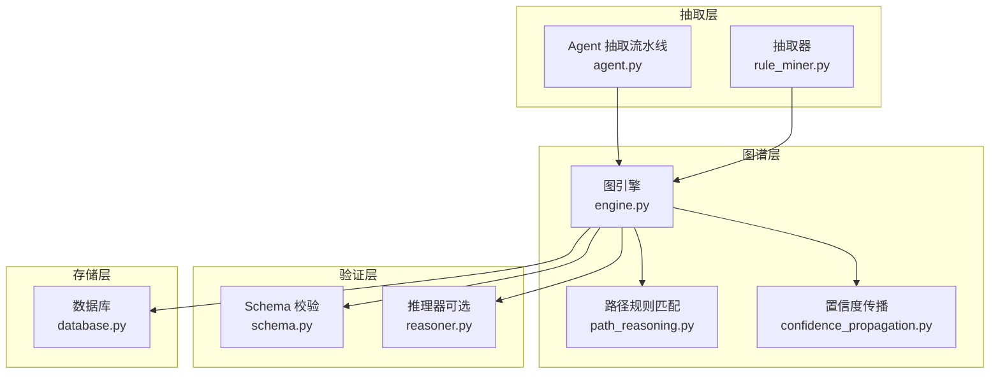
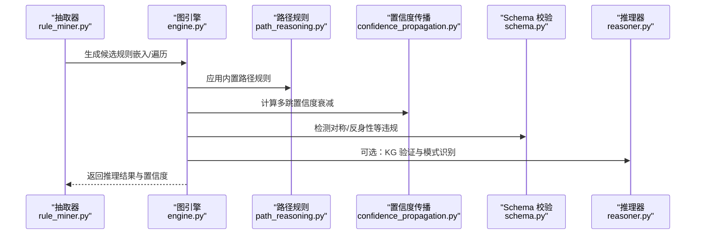
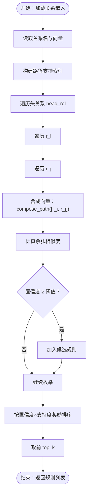
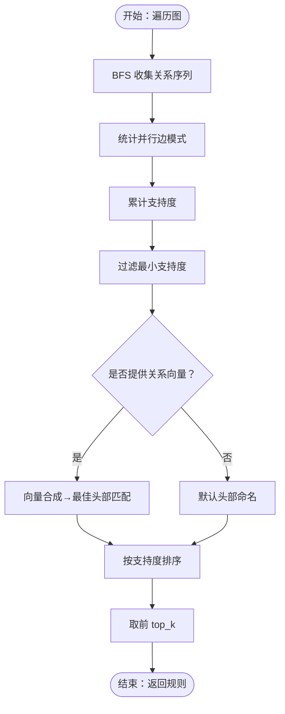
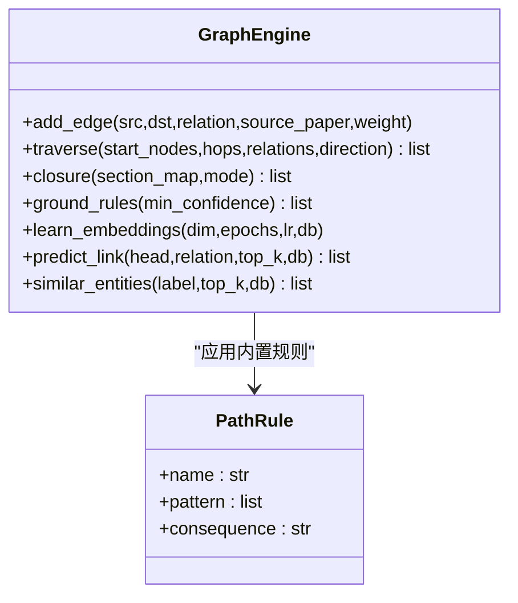
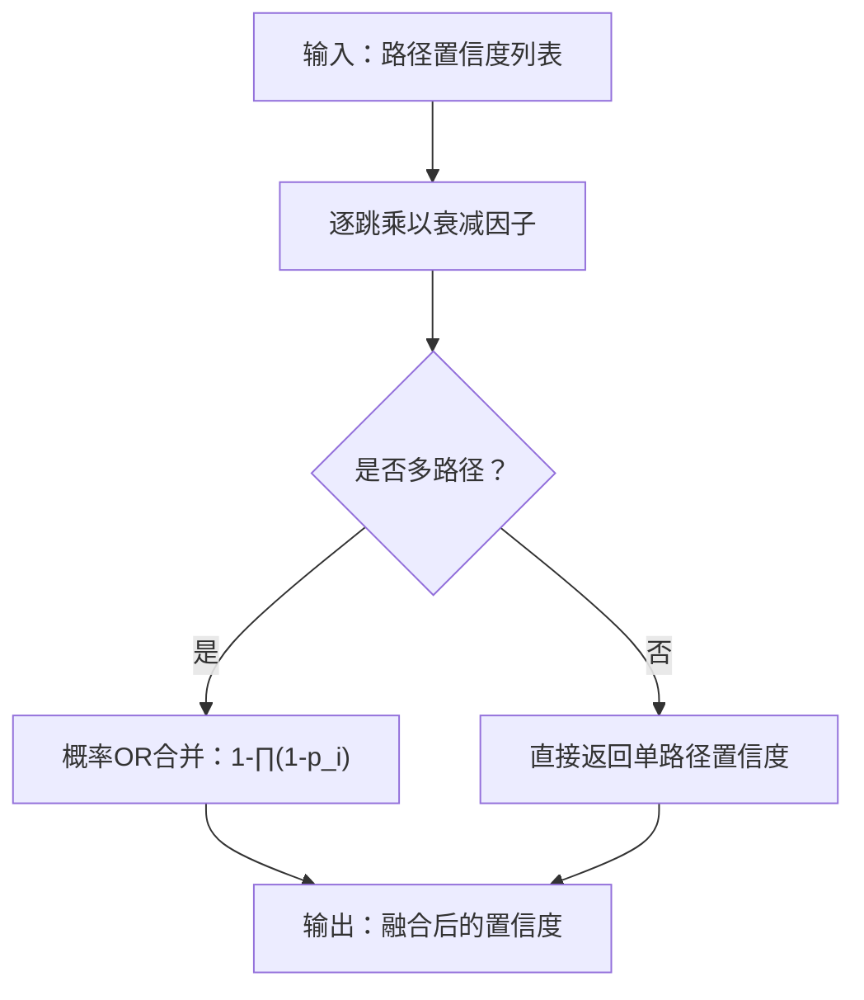
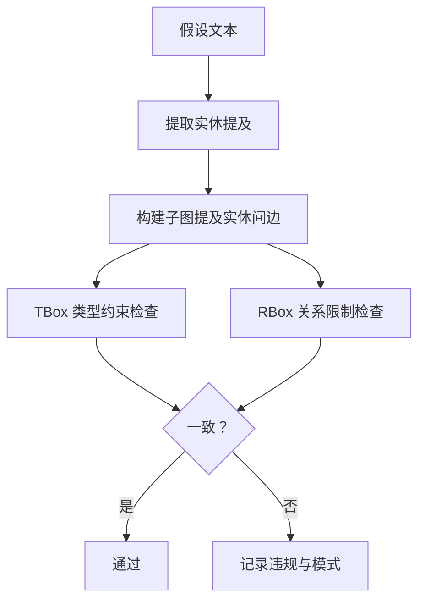
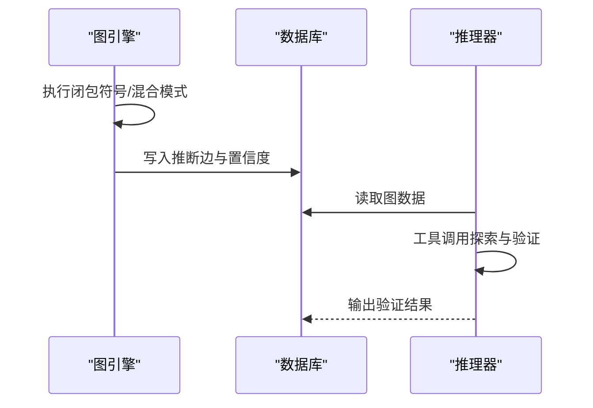
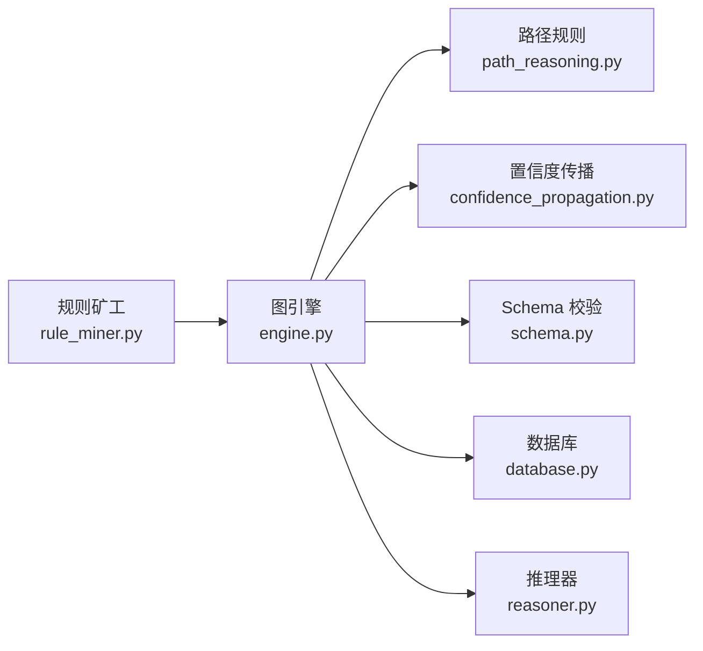

# 规则挖掘系统

<cite>
**本文引用的文件**
- [rule_miner.py](file://src/drbrain/extractor/rule_miner.py)
- [engine.py](file://src/drbrain/graph/engine.py)
- [path_reasoning.py](file://src/drbrain/graph/path_reasoning.py)
- [confidence_propagation.py](file://src/drbrain/extractor/confidence_propagation.py)
- [schema.py](file://src/drbrain/validator/schema.py)
- [reasoner.py](file://src/drbrain/extractor/reasoner.py)
- [database.py](file://src/drbrain/storage/database.py)
- [test_rule_miner.py](file://tests/test_rule_miner.py)
- [README.md](file://README.md)
</cite>

## 目录
1. [简介](#简介)
2. [项目结构](#项目结构)
3. [核心组件](#核心组件)
4. [架构总览](#架构总览)
5. [详细组件分析](#详细组件分析)
6. [依赖分析](#依赖分析)
7. [性能考虑](#性能考虑)
8. [故障排查指南](#故障排查指南)
9. [结论](#结论)
10. [附录](#附录)

## 简介
本文件面向 DrBrain 的“规则挖掘系统”，聚焦于从抽取结果中自动发现推理规则的算法实现、模式识别与规则生成机制。文档涵盖：
- 规则矿工的工作流程：嵌入驱动的路径规则挖掘与图遍历规则挖掘
- 候选规则筛选与规则验证（置信度、支持度、一致性）
- 规则表示形式、逻辑表达式构建与规则冲突检测
- 与推理引擎的集成方式、规则应用与结果验证
- 规则质量评估指标、复杂度控制与优化策略
- 性能优化、并行处理与增量更新的最佳实践

## 项目结构
DrBrain 将“抽取”“构建”“查询”“知识图谱”“推理”“分析”等模块分层组织，规则挖掘位于抽取与图谱之间，既可独立运行，也可在闭包阶段被调用以增强图谱推理能力。

图表来源
- [rule_miner.py:1-290](file://src/drbrain/extractor/rule_miner.py#L1-L290)
- [engine.py:1-1118](file://src/drbrain/graph/engine.py#L1-L1118)
- [path_reasoning.py:1-212](file://src/drbrain/graph/path_reasoning.py#L1-L212)
- [confidence_propagation.py:1-87](file://src/drbrain/extractor/confidence_propagation.py#L1-L87)
- [schema.py:1-211](file://src/drbrain/validator/schema.py#L1-L211)
- [reasoner.py:1-677](file://src/drbrain/extractor/reasoner.py#L1-L677)
- [database.py:1-775](file://src/drbrain/storage/database.py#L1-L775)

章节来源
- [README.md:1-112](file://README.md#L1-L112)

## 核心组件
- 规则矿工（Rule Miner）
  - 嵌入驱动路径规则挖掘：基于 TransE 向量加法近似关系合成，通过余弦相似度衡量规则置信度
  - 图遍历规则挖掘：统计频繁二跳关系序列，结合嵌入向量选择最佳头部关系
- 图引擎（GraphEngine）
  - 提供闭包推理、路径规则应用、TransE 嵌入训练与预测、置信度传播、研究种子检测等能力
- 路径规则（PathRule）
  - 内置多条路径规则，用于从已存在边推导新边
- 置信度传播（Confidence Propagation）
  - 多跳不确定性衰减与多路径合并策略
- Schema 校验（Schema Validator）
  - TBox 类型约束与 RBox 关系限制，检测对称性/反身性等违规
- 推理器（Reasoner）
  - 基于工具调用的图推理代理，可与规则挖掘结果协同进行一致性校验与模式识别

章节来源
- [rule_miner.py:1-290](file://src/drbrain/extractor/rule_miner.py#L1-L290)
- [engine.py:1-1118](file://src/drbrain/graph/engine.py#L1-L1118)
- [path_reasoning.py:1-212](file://src/drbrain/graph/path_reasoning.py#L1-L212)
- [confidence_propagation.py:1-87](file://src/drbrain/extractor/confidence_propagation.py#L1-L87)
- [schema.py:1-211](file://src/drbrain/validator/schema.py#L1-L211)
- [reasoner.py:1-677](file://src/drbrain/extractor/reasoner.py#L1-L677)

## 架构总览
规则挖掘贯穿“抽取—图谱—验证—推理”的闭环：
- 抽取阶段产出概念与关系，形成初始图
- 规则矿工从嵌入或图遍历中生成候选规则
- 图引擎执行闭包推理，应用路径规则与 TransE 嵌入评分
- Schema 校验与置信度传播确保规则一致性与可信度
- 推理器对假设进行 KG 验证与模式检测

图表来源
- [rule_miner.py:33-105](file://src/drbrain/extractor/rule_miner.py#L33-L105)
- [engine.py:124-315](file://src/drbrain/graph/engine.py#L124-L315)
- [path_reasoning.py:131-153](file://src/drbrain/graph/path_reasoning.py#L131-L153)
- [confidence_propagation.py:31-87](file://src/drbrain/extractor/confidence_propagation.py#L31-L87)
- [schema.py:192-211](file://src/drbrain/validator/schema.py#L192-L211)
- [reasoner.py:439-581](file://src/drbrain/extractor/reasoner.py#L439-L581)

## 详细组件分析

### 组件一：嵌入驱动的路径规则挖掘（TransE）
- 输入
  - 关系嵌入字典（由数据库加载或 TransE 训练得到）
  - 图结构（用于统计路径支持度）
- 核心算法
  - 向量合成：路径向量按 TransE 加法规则合成
  - 置信度计算：目标关系向量与合成向量的余弦相似度
  - 支持度统计：二跳路径出现次数
  - 排序与截断：按置信度×支持度奖励排序，保留 top_k
- 输出
  - 规则列表：包含 head、body_path、confidence、support 字段

图表来源
- [rule_miner.py:33-105](file://src/drbrain/extractor/rule_miner.py#L33-L105)
- [rule_miner.py:108-134](file://src/drbrain/extractor/rule_miner.py#L108-L134)

章节来源
- [rule_miner.py:18-105](file://src/drbrain/extractor/rule_miner.py#L18-L105)

### 组件二：图遍历驱动的规则挖掘
- 输入
  - 图引擎实例
  - 最大路径长度、最小支持度、top_k
  - 可选：关系向量（用于将路径映射到最接近的关系作为 head）
- 核心算法
  - 广度优先遍历收集关系序列频次
  - 并行边模式计数：同一节点对上出现多个关系类型时，生成有序二元组模式
  - 路径向量合成与最佳头部匹配（若提供关系向量）
  - 支持度过滤与排序输出
- 输出
  - 规则列表：包含 body_path、support、confidence、head

图表来源
- [rule_miner.py:137-197](file://src/drbrain/extractor/rule_miner.py#L137-L197)
- [rule_miner.py:200-253](file://src/drbrain/extractor/rule_miner.py#L200-L253)
- [rule_miner.py:255-284](file://src/drbrain/extractor/rule_miner.py#L255-L284)

章节来源
- [rule_miner.py:137-197](file://src/drbrain/extractor/rule_miner.py#L137-L197)

### 组件三：图引擎中的闭包与路径规则应用
- 闭包模式
  - 符号模式：仅使用规则进行推断
  - 混合模式：叠加 TransE 嵌入评分，对推断边赋予最终置信度
- 路径规则
  - 内置规则集合，匹配特定关系链，推导新关系
  - 子图增量闭包：仅针对种子节点的邻域子图执行闭包，提升效率
- TransE 嵌入
  - 训练/加载嵌入，支持热启动；提供链接预测与实体相似度查询

图表来源
- [engine.py:33-315](file://src/drbrain/graph/engine.py#L33-L315)
- [path_reasoning.py:9-55](file://src/drbrain/graph/path_reasoning.py#L9-L55)

章节来源
- [engine.py:124-315](file://src/drbrain/graph/engine.py#L124-L315)
- [path_reasoning.py:24-55](file://src/drbrain/graph/path_reasoning.py#L24-L55)

### 组件四：置信度传播与规则融合
- 多跳衰减
  - 默认衰减因子与按章节调整的衰减因子
- 多路径合并
  - 使用概率 OR 合并不同路径的置信度，提高整体可靠性
- 闭包阶段置信度赋值
  - 可根据章节信息对推断边赋予置信度

图表来源
- [confidence_propagation.py:31-87](file://src/drbrain/extractor/confidence_propagation.py#L31-L87)
- [engine.py:281-291](file://src/drbrain/graph/engine.py#L281-L291)

章节来源
- [confidence_propagation.py:1-87](file://src/drbrain/extractor/confidence_propagation.py#L1-L87)
- [engine.py:281-291](file://src/drbrain/graph/engine.py#L281-L291)

### 组件五：规则验证与冲突检测
- TBox 类型约束
  - 检查关系是否符合概念类型的允许集合
- RBox 关系限制
  - 检测反身性、对称性/非对称性等违规
- 异步关系检测
  - 检测 A rel B 与 B rel A 同时存在的问题
- KG 验证（推理器）
  - 基于图的假设一致性检查，识别矛盾与模式（如 debate、gap）

图表来源
- [schema.py:63-94](file://src/drbrain/validator/schema.py#L63-L94)
- [schema.py:192-211](file://src/drbrain/validator/schema.py#L192-L211)
- [reasoner.py:439-581](file://src/drbrain/extractor/reasoner.py#L439-L581)

章节来源
- [schema.py:1-211](file://src/drbrain/validator/schema.py#L1-L211)
- [reasoner.py:439-581](file://src/drbrain/extractor/reasoner.py#L439-L581)

### 组件六：与推理引擎的集成与应用
- 规则应用
  - 在闭包阶段应用路径规则，生成推断边
  - 可选：TransE 混合评分，提升推断边的可信度
- 结果验证
  - 推理器对假设进行 KG 验证，识别矛盾与模式
- 存储与持久化
  - 推断边与置信度写回数据库，供后续查询与分析

图表来源
- [engine.py:124-315](file://src/drbrain/graph/engine.py#L124-L315)
- [reasoner.py:282-390](file://src/drbrain/extractor/reasoner.py#L282-L390)
- [database.py:367-381](file://src/drbrain/storage/database.py#L367-L381)

章节来源
- [engine.py:124-315](file://src/drbrain/graph/engine.py#L124-L315)
- [reasoner.py:282-390](file://src/drbrain/extractor/reasoner.py#L282-L390)
- [database.py:367-381](file://src/drbrain/storage/database.py#L367-L381)

## 依赖分析
- 规则挖掘依赖
  - 嵌入驱动：依赖关系嵌入（TransE）与数据库加载接口
  - 图遍历驱动：依赖图引擎的遍历与边统计能力
- 图引擎依赖
  - 路径规则库、置信度传播模块、Schema 校验模块
  - 可选：推理器用于 KG 验证
- 数据存储
  - SQLite 表结构支持嵌入、边、概念、队列等，支撑规则持久化与检索

图表来源
- [rule_miner.py:1-290](file://src/drbrain/extractor/rule_miner.py#L1-L290)
- [engine.py:1-1118](file://src/drbrain/graph/engine.py#L1-L1118)
- [path_reasoning.py:1-212](file://src/drbrain/graph/path_reasoning.py#L1-L212)
- [confidence_propagation.py:1-87](file://src/drbrain/extractor/confidence_propagation.py#L1-L87)
- [schema.py:1-211](file://src/drbrain/validator/schema.py#L1-L211)
- [reasoner.py:1-677](file://src/drbrain/extractor/reasoner.py#L1-L677)
- [database.py:1-775](file://src/drbrain/storage/database.py#L1-L775)

章节来源
- [rule_miner.py:1-290](file://src/drbrain/extractor/rule_miner.py#L1-L290)
- [engine.py:1-1118](file://src/drbrain/graph/engine.py#L1-L1118)
- [path_reasoning.py:1-212](file://src/drbrain/graph/path_reasoning.py#L1-L212)
- [confidence_propagation.py:1-87](file://src/drbrain/extractor/confidence_propagation.py#L1-L87)
- [schema.py:1-211](file://src/drbrain/validator/schema.py#L1-L211)
- [reasoner.py:1-677](file://src/drbrain/extractor/reasoner.py#L1-L677)
- [database.py:1-775](file://src/drbrain/storage/database.py#L1-L775)

## 性能考虑
- 时间复杂度
  - 嵌入驱动：对每对关系组合计算余弦相似度，复杂度约为 O(R^2)，其中 R 为关系数量
  - 图遍历：BFS 遍历复杂度与节点数和边数相关，建议设置最大长度与支持度阈值
- 空间复杂度
  - 嵌入向量缓存与路径支持索引占用内存，建议在大规模图上采用分批处理与增量训练
- 并行处理
  - 关系向量合成与相似度计算可并行化
  - 图遍历可按节点分片并行执行
- 增量更新
  - TransE 支持热启动，基于数据库已有嵌入初始化，避免全量重训
  - 闭包可按种子节点的邻域子图增量执行，减少全图扫描
- I/O 优化
  - 将规则与推断边批量写入数据库，减少事务开销

[本节为通用性能指导，不直接分析具体文件]

## 故障排查指南
- 嵌入不足
  - 当关系数量少于阈值时，嵌入驱动规则挖掘会返回空结果
  - 解决：确保关系嵌入已训练或从数据库加载
- 置信度过低
  - 降低阈值或增加支持度，或切换到图遍历驱动
- 规则冲突
  - 使用 Schema 校验与推理器的 KG 验证，定位对称性/反身性违规与矛盾模式
- 性能瓶颈
  - 限制最大路径长度与 top_k，启用增量闭包，分批处理大规模图

章节来源
- [rule_miner.py:58-60](file://src/drbrain/extractor/rule_miner.py#L58-L60)
- [schema.py:192-211](file://src/drbrain/validator/schema.py#L192-L211)
- [reasoner.py:439-581](file://src/drbrain/extractor/reasoner.py#L439-L581)

## 结论
DrBrain 的规则挖掘系统通过“嵌入驱动 + 图遍历 + 闭包推理 + 置信度传播 + Schema 校验”的多层机制，实现了从抽取结果中自动发现高质量推理规则，并将其可靠地应用于知识图谱推理与分析。系统具备良好的扩展性与可维护性，适合在学术知识图谱场景中进行持续迭代与优化。

[本节为总结性内容，不直接分析具体文件]

## 附录

### 规则表示与逻辑表达式
- 规则字段
  - head：规则头部关系
  - body_path：规则体关系序列
  - confidence：规则置信度
  - support：路径支持度
- 逻辑表达式
  - 路径规则：形如“若 A→B 且 B→C，则 A→D”
  - 嵌入规则：形如“若 cos_sim(r_head, r_body1 + r_body2) 高，则 A→B→C 推导出 A→D”

章节来源
- [rule_miner.py:53-98](file://src/drbrain/extractor/rule_miner.py#L53-L98)
- [path_reasoning.py:9-22](file://src/drbrain/graph/path_reasoning.py#L9-L22)

### 规则质量评估与复杂度控制
- 质量指标
  - 置信度（余弦相似度/嵌入评分）、支持度（路径出现频次）、一致性（Schema 校验）
- 复杂度控制
  - 设置 max_length、min_support、top_k、min_confidence 等阈值
  - 使用置信度传播抑制多跳不确定性

章节来源
- [rule_miner.py:37-51](file://src/drbrain/extractor/rule_miner.py#L37-L51)
- [confidence_propagation.py:31-87](file://src/drbrain/extractor/confidence_propagation.py#L31-L87)

### 测试与验证
- 单元测试覆盖
  - 向量合成、路径计数、规则结构与 CLI 集成
- 集成测试
  - 闭包命令与规则挖掘标志位的正确性

章节来源
- [test_rule_miner.py:1-313](file://tests/test_rule_miner.py#L1-L313)