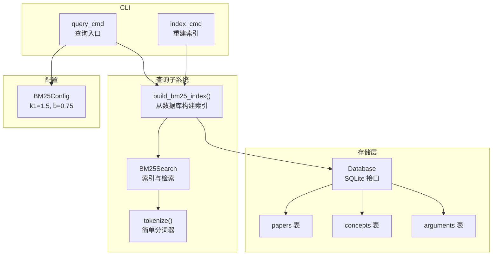
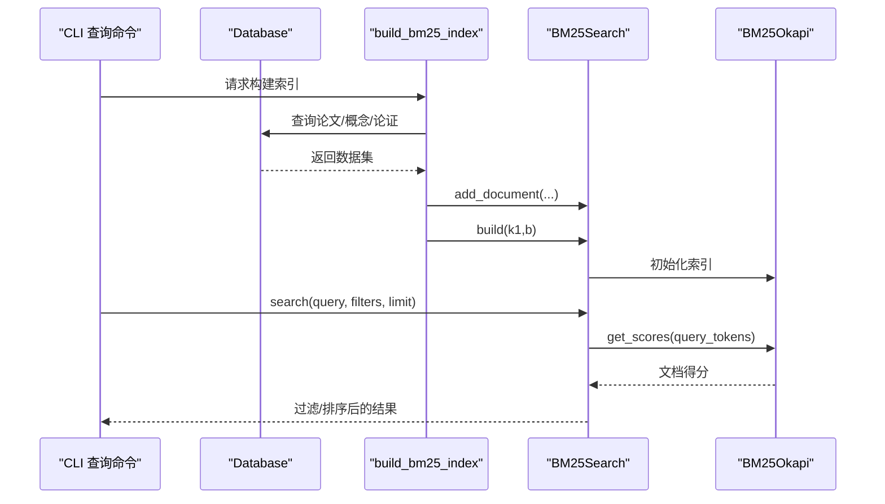
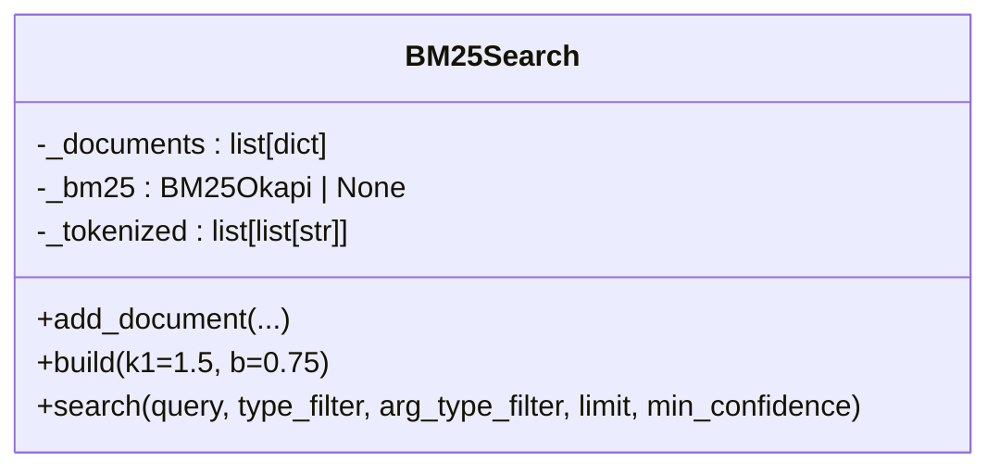
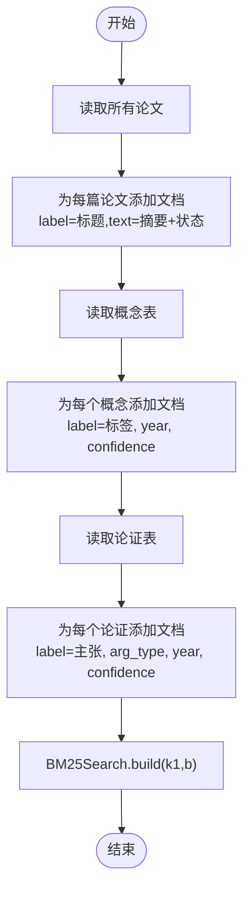
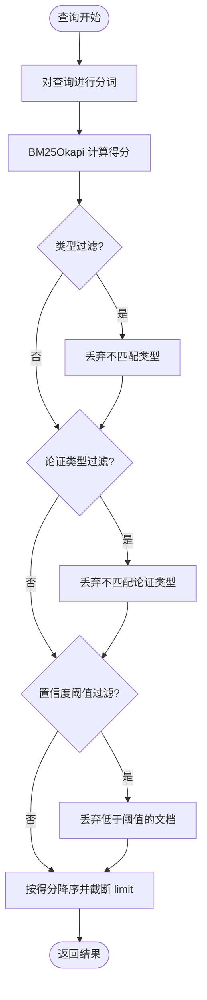
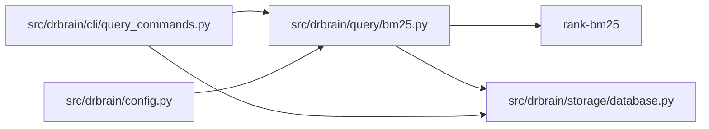

# BM25 全文检索

<cite>
**本文引用的文件列表**
- [src/drbrain/query/bm25.py](file://src/drbrain/query/bm25.py)
- [tests/test_bm25.py](file://tests/test_bm25.py)
- [src/drbrain/storage/database.py](file://src/drbrain/storage/database.py)
- [src/drbrain/cli/query_commands.py](file://src/drbrain/cli/query_commands.py)
- [src/drbrain/config.py](file://src/drbrain/config.py)
- [src/drbrain/stopwords.txt](file://src/drbrain/stopwords.txt)
- [uv.lock](file://uv.lock)
</cite>

## 目录
1. [简介](#简介)
2. [项目结构](#项目结构)
3. [核心组件](#核心组件)
4. [架构总览](#架构总览)
5. [详细组件分析](#详细组件分析)
6. [依赖关系分析](#依赖关系分析)
7. [性能考量](#性能考量)
8. [故障排查指南](#故障排查指南)
9. [结论](#结论)
10. [附录](#附录)

## 简介
本文件面向 DrBrain 的 BM25 全文检索模块，系统化阐述 BM25Okapi 算法在项目中的实现与参数配置，覆盖以下关键点：
- k1 与 b 参数的作用机制与默认值来源
- 文档索引的构建流程：论文标题、摘要、概念标签、论证声明的处理
- 检索查询的构建、过滤条件与结果排序规则
- 使用示例与性能优化建议
- 与数据库的集成方式与查询效率优化技巧

## 项目结构
BM25 模块位于查询子系统中，围绕“文档索引构建—检索—后处理过滤—输出”的主链路组织代码，并通过 CLI 命令对外提供交互入口。

图表来源
- [src/drbrain/query/bm25.py:17-135](file://src/drbrain/query/bm25.py#L17-L135)
- [src/drbrain/cli/query_commands.py:263-401](file://src/drbrain/cli/query_commands.py#L263-L401)
- [src/drbrain/storage/database.py:159-775](file://src/drbrain/storage/database.py#L159-L775)
- [src/drbrain/config.py:90-93](file://src/drbrain/config.py#L90-L93)

章节来源
- [src/drbrain/query/bm25.py:17-135](file://src/drbrain/query/bm25.py#L17-L135)
- [src/drbrain/cli/query_commands.py:263-401](file://src/drbrain/cli/query_commands.py#L263-L401)
- [src/drbrain/storage/database.py:159-775](file://src/drbrain/storage/database.py#L159-L775)
- [src/drbrain/config.py:90-93](file://src/drbrain/config.py#L90-L93)

## 核心组件
- BM25Search：封装 BM25Okapi 的索引构建与检索逻辑，支持类型过滤、论证类型过滤、置信度阈值过滤与结果上限限制。
- build_bm25_index：从数据库读取论文、概念与论证数据，组装为可检索文档并构建索引。
- tokenize：统一的小型英文分词器（小写化、非字母数字切分）。
- CLI 查询命令：提供查询入口，支持过滤、图谱扩展与混合重排等增强能力。

章节来源
- [src/drbrain/query/bm25.py:17-135](file://src/drbrain/query/bm25.py#L17-L135)
- [src/drbrain/cli/query_commands.py:283-631](file://src/drbrain/cli/query_commands.py#L283-L631)

## 架构总览
BM25 检索的端到端流程如下：

图表来源
- [src/drbrain/query/bm25.py:92-135](file://src/drbrain/query/bm25.py#L92-L135)
- [src/drbrain/cli/query_commands.py:436-447](file://src/drbrain/cli/query_commands.py#L436-L447)

## 详细组件分析

### BM25Search 类与检索流程
- 文档添加：add_document 支持本地 ID、类型、标签、文本、论证类型、年份、置信度等字段，统一存入内部文档列表。
- 索引构建：build 将每个文档的“标签 + 文本”进行分词，传入 BM25Okapi 并设置 k1、b 参数。
- 检索搜索：search 对查询进行分词，调用 BM25Okapi 计算得分；随后按类型过滤、论证类型过滤、置信度阈值过滤，最后按得分降序并截断 limit。

图表来源
- [src/drbrain/query/bm25.py:17-91](file://src/drbrain/query/bm25.py#L17-L91)

章节来源
- [src/drbrain/query/bm25.py:17-91](file://src/drbrain/query/bm25.py#L17-L91)

### 文档索引构建：论文、概念、论证
- 论文：从 papers 表读取，拼接标题与摘要、状态作为文本加入索引。
- 概念：从 concepts 表读取，标签即为检索文本，附加年份与置信度。
- 论证：从 arguments 表读取，主张声明作为检索文本，附加论证类型、年份与置信度。
- 最终由 BM25Search.build 完成分词与索引初始化。

图表来源
- [src/drbrain/query/bm25.py:92-135](file://src/drbrain/query/bm25.py#L92-L135)
- [src/drbrain/storage/database.py:419-447](file://src/drbrain/storage/database.py#L419-L447)
- [src/drbrain/storage/database.py:500-532](file://src/drbrain/storage/database.py#L500-L532)

章节来源
- [src/drbrain/query/bm25.py:92-135](file://src/drbrain/query/bm25.py#L92-L135)
- [src/drbrain/storage/database.py:419-447](file://src/drbrain/storage/database.py#L419-L447)
- [src/drbrain/storage/database.py:500-532](file://src/drbrain/storage/database.py#L500-L532)

### 查询构建、过滤与排序
- 查询构建：对输入查询执行与文档相同的分词策略（小写化、非字母数字切分），然后调用 BM25Okapi 计算每个文档的得分。
- 过滤条件：
  - 类型过滤：仅返回指定类型的文档（如“Paper”、“Method”等）。
  - 论证类型过滤：仅返回指定论证类型的文档（如“supports”、“challenges”等）。
  - 置信度阈值：仅保留置信度不低于阈值的文档。
  - 年份范围与工作区过滤：在 BM25 检索之后再进行二次过滤。
- 结果排序：按得分降序，再按 limit 截断。

图表来源
- [src/drbrain/query/bm25.py:56-91](file://src/drbrain/query/bm25.py#L56-L91)
- [src/drbrain/cli/query_commands.py:448-459](file://src/drbrain/cli/query_commands.py#L448-L459)

章节来源
- [src/drbrain/query/bm25.py:56-91](file://src/drbrain/query/bm25.py#L56-L91)
- [src/drbrain/cli/query_commands.py:448-459](file://src/drbrain/cli/query_commands.py#L448-L459)

### k1 与 b 参数的作用机制
- k1 控制词频饱和度：k1 越大，高词频项的增益越平缓；k1 越小，高词频项的增益越陡峭。
- b 控制长度归一化权重：b 越大，文档长度对得分的影响越大；b 越小，长度归一化越弱。
- 默认值：BM25Config 中定义了 k1=1.5、b=0.75，作为通用平衡值。

章节来源
- [src/drbrain/config.py:90-93](file://src/drbrain/config.py#L90-L93)

### 分词器与停用词
- 分词器：将输入转为小写，按非字母数字切分为 token 列表。
- 停用词：项目提供 stopwords.txt，用于过滤常见无意义词汇（英文与部分中文字符）。当前 BM25 实现未直接使用该停用词表，但可作为未来优化的基础。

章节来源
- [src/drbrain/query/bm25.py:11-14](file://src/drbrain/query/bm25.py#L11-L14)
- [src/drbrain/stopwords.txt:1-800](file://src/drbrain/stopwords.txt#L1-L800)

### 与数据库的集成
- 数据库接口：Database 提供 get_all_papers、插入/查询概念与论证等方法。
- 索引构建：build_bm25_index 通过 SQL 查询论文、概念、论证三类实体，组装为文档集合。
- CLI 集成：index_cmd 与 query_cmd 分别负责重建索引与执行查询。

章节来源
- [src/drbrain/storage/database.py:159-775](file://src/drbrain/storage/database.py#L159-L775)
- [src/drbrain/cli/query_commands.py:263-401](file://src/drbrain/cli/query_commands.py#L263-L401)

## 依赖关系分析
- 外部依赖：rank-bm25 0.2.2，提供 BM25Okapi 实现。
- 内部依赖：BM25Search 依赖 tokenize；build_bm25_index 依赖 Database；CLI 查询命令依赖 BM25Search 与 Database。

图表来源
- [src/drbrain/query/bm25.py](file://src/drbrain/query/bm25.py#L8)
- [uv.lock:1886-1897](file://uv.lock#L1886-L1897)

章节来源
- [src/drbrain/query/bm25.py](file://src/drbrain/query/bm25.py#L8)
- [uv.lock:1886-1897](file://uv.lock#L1886-L1897)

## 性能考量
- 索引构建成本：构建阶段需要扫描 papers、concepts、arguments 三张表，时间复杂度与数据量线性相关。建议定期重建索引或增量更新。
- 检索阶段：BM25Okapi 的单次查询为 O(T·D)，其中 T 为查询词数、D 为文档数。可通过 limit 降低返回量。
- 过滤开销：类型过滤、论证类型过滤、置信度阈值过滤均为 O(D)，可在查询后进行以减少后续处理。
- 年份与工作区过滤：在 BM25 检索后再做二次过滤，避免重复扫描数据库。
- 图谱扩展与混合重排：当启用 --hybrid 或 --neighbors 时，会引入额外的图计算与遍历，适合在结果规模较小的场景使用。

[本节为通用性能建议，无需特定文件引用]

## 故障排查指南
- 空索引或空结果
  - 若数据库为空或未构建索引，BM25Search.build 可能返回 None，导致 search 返回空列表。可通过 index_cmd 强制重建索引。
- 查询无匹配词
  - 当查询词不在任何文档中时，BM25Okapi 会返回所有文档得分为 0。测试覆盖了该行为，属于预期。
- 置信度过滤
  - 若 min_confidence 设置过高，可能导致无结果。可适当降低阈值或移除该过滤。
- 年份与工作区过滤
  - 年份范围与工作区过滤在 BM25 检索后执行，若结果为空，检查年份边界与工作区纸目是否正确。

章节来源
- [tests/test_bm25.py:148-164](file://tests/test_bm25.py#L148-L164)
- [tests/test_bm25.py:39-47](file://tests/test_bm25.py#L39-L47)
- [src/drbrain/cli/query_commands.py:448-459](file://src/drbrain/cli/query_commands.py#L448-L459)

## 结论
DrBrain 的 BM25 全文检索模块以简洁清晰的方式实现了基于 BM25Okapi 的全文检索，覆盖论文、概念与论证三类实体，支持多维过滤与结果截断。默认参数 k1=1.5、b=0.75 在通用场景下表现稳定；结合 CLI 的过滤与图谱扩展能力，可进一步提升检索质量与用户体验。建议在数据规模增长时关注索引重建策略与查询优化。

[本节为总结性内容，无需特定文件引用]

## 附录

### 使用示例
- 重建索引
  - 使用 index_cmd 重建 BM25 索引，输出已索引文档数量。
- 执行查询
  - 使用 query_cmd 执行检索，支持：
    - --type-filter：按概念类型过滤（如 Problem、Method）
    - --arg-type：按论证类型过滤（如 supports、challenges）
    - --min-confidence：置信度阈值
    - --limit：结果数量上限
    - --year-start/--year-end：按年份范围过滤
    - --neighbors：图谱扩展
    - --hybrid：混合重排（BM25 + PageRank）

章节来源
- [src/drbrain/cli/query_commands.py:263-401](file://src/drbrain/cli/query_commands.py#L263-L401)
- [src/drbrain/cli/query_commands.py:283-631](file://src/drbrain/cli/query_commands.py#L283-L631)

### 参数配置
- BM25Config.k1：控制词频饱和度，默认 1.5
- BM25Config.b：控制长度归一化权重，默认 0.75
- 可通过配置文件覆盖默认值，再由 build_bm25_index 传递给 BM25Search.build

章节来源
- [src/drbrain/config.py:90-93](file://src/drbrain/config.py#L90-L93)
- [src/drbrain/query/bm25.py](file://src/drbrain/query/bm25.py#L50)

### 测试要点
- 置信度存储与过滤：确保 confidence 字段在文档中存在并在检索时生效。
- 空数据库与空索引：验证空结果与空索引的行为。
- 分词器行为：大小写、标点与空字符串的处理。
- 自定义 k1/b：验证自定义参数对检索结果的影响。

章节来源
- [tests/test_bm25.py:10-207](file://tests/test_bm25.py#L10-L207)