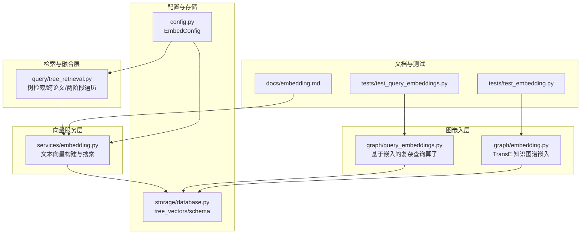
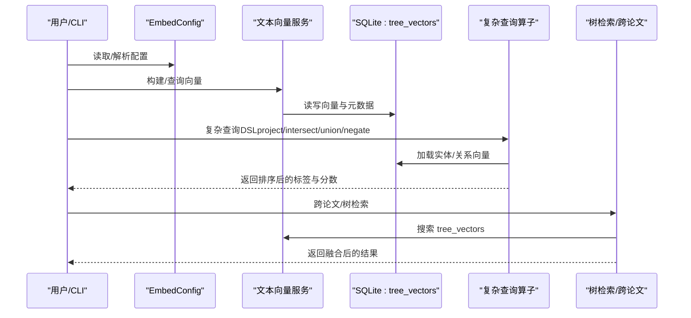
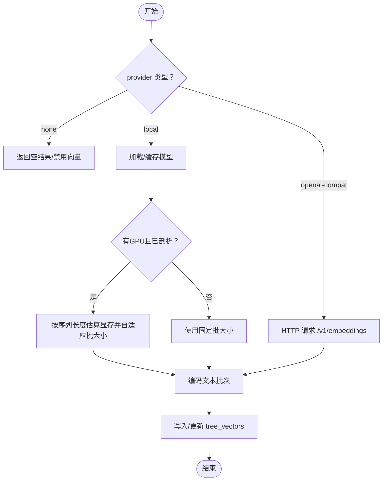
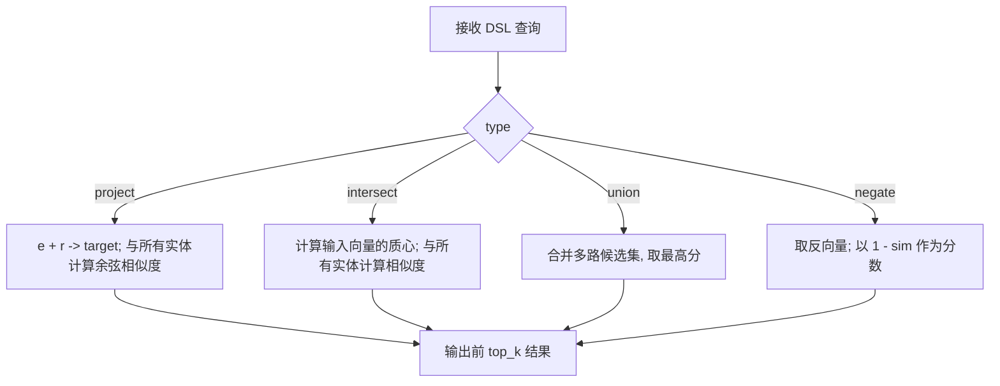
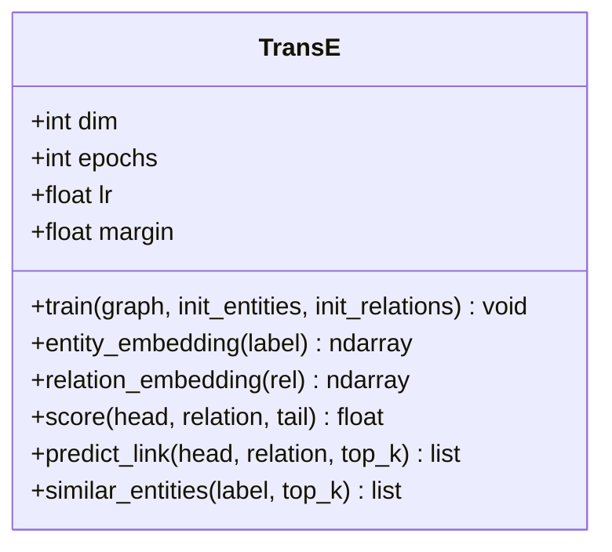
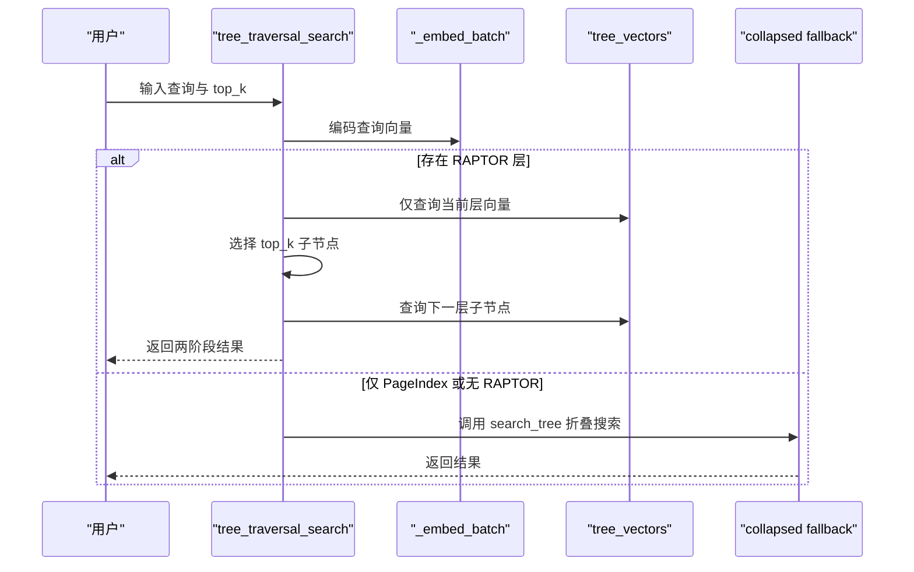
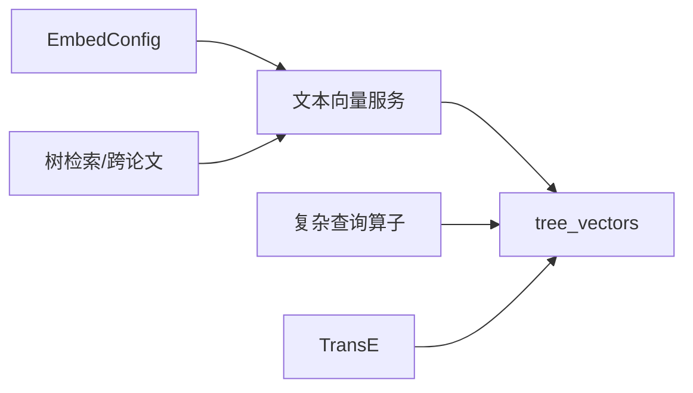

# 查询向量嵌入

<cite>
**本文引用的文件列表**
- [query_embeddings.py](file://src/drbrain/graph/query_embeddings.py)
- [embedding.py（服务）](file://src/drbrain/services/embedding.py)
- [embedding.py（图嵌入）](file://src/drbrain/graph/embedding.py)
- [tree_retrieval.py](file://src/drbrain/query/tree_retrieval.py)
- [embedding.md](file://docs/embedding.md)
- [database.py](file://src/drbrain/storage/database.py)
- [config.py](file://src/drbrain/config.py)
- [test_query_embeddings.py](file://tests/test_query_embeddings.py)
- [test_embedding.py](file://tests/test_embedding.py)
- [metrics.py](file://src/drbrain/metrics.py)
</cite>

## 目录
1. [简介](#简介)
2. [项目结构](#项目结构)
3. [核心组件](#核心组件)
4. [架构总览](#架构总览)
5. [详细组件分析](#详细组件分析)
6. [依赖关系分析](#依赖关系分析)
7. [性能考量](#性能考量)
8. [故障排查指南](#故障排查指南)
9. [结论](#结论)
10. [附录：使用示例与性能调优](#附录使用示例与性能调优)

## 简介
本文件面向 DrBrain 的“查询向量嵌入”模块，系统化阐述从查询文本到向量空间的映射机制、向量检索与相似度计算、与知识图谱嵌入的对齐策略、跨模态检索技术、评估与优化方法，并给出批量查询与缓存机制的实践建议。文档同时提供可操作的使用示例与性能调优指南，帮助读者在不同硬件与部署环境下稳定获得高质量的检索结果。

## 项目结构
围绕“查询向量嵌入”，本模块涉及以下关键文件：
- 图嵌入与复杂查询算子：graph/query_embeddings.py
- 文本向量服务（本地/云端/禁用）：services/embedding.py
- 知识图谱 TransE 嵌入：graph/embedding.py
- 树检索与跨论文融合：query/tree_retrieval.py
- 配置与数据库模式：config.py、storage/database.py
- 文档与测试：docs/embedding.md、tests/test_embedding.py、tests/test_query_embeddings.py
- 指标采集：metrics.py

图表来源
- [embedding.py（服务）:598-785](file://src/drbrain/services/embedding.py#L598-L785)
- [query_embeddings.py:133-226](file://src/drbrain/graph/query_embeddings.py#L133-L226)
- [embedding.py（图嵌入）:8-117](file://src/drbrain/graph/embedding.py#L8-L117)
- [tree_retrieval.py:451-708](file://src/drbrain/query/tree_retrieval.py#L451-L708)
- [database.py:84-98](file://src/drbrain/storage/database.py#L84-L98)
- [config.py:114-141](file://src/drbrain/config.py#L114-L141)
- [embedding.md:1-188](file://docs/embedding.md#L1-L188)
- [test_query_embeddings.py:1-256](file://tests/test_query_embeddings.py#L1-L256)
- [test_embedding.py:1-100](file://tests/test_embedding.py#L1-L100)

章节来源
- [embedding.py（服务）:598-785](file://src/drbrain/services/embedding.py#L598-L785)
- [query_embeddings.py:133-226](file://src/drbrain/graph/query_embeddings.py#L133-L226)
- [embedding.py（图嵌入）:8-117](file://src/drbrain/graph/embedding.py#L8-L117)
- [tree_retrieval.py:451-708](file://src/drbrain/query/tree_retrieval.py#L451-L708)
- [database.py:84-98](file://src/drbrain/storage/database.py#L84-L98)
- [config.py:114-141](file://src/drbrain/config.py#L114-L141)
- [embedding.md:1-188](file://docs/embedding.md#L1-L188)
- [test_query_embeddings.py:1-256](file://tests/test_query_embeddings.py#L1-L256)
- [test_embedding.py:1-100](file://tests/test_embedding.py#L1-L100)

## 核心组件
- 文本向量服务（本地/云端/禁用）
  - 提供统一的向量构建与查询接口，支持自适应批大小、GPU 内存剖析、增量更新与后过滤。
- 基于嵌入的复杂查询算子
  - 支持投影、交集、并集、取反等布尔组合，以 TransE 向量空间中的几何运算实现。
- 知识图谱 TransE 嵌入
  - 将实体/关系映射到向量空间，支持链接预测与实体相似度计算。
- 树检索与跨论文融合
  - 结合 PageIndex 树结构与 LLM 导航，提供两阶段遍历与跨论文折叠检索，融合 BM25 与向量评分。
- 配置与存储
  - EmbedConfig 定义 provider、模型、设备、批大小等；tree_vectors 存储节点向量与分层信息。

章节来源
- [embedding.py（服务）:504-785](file://src/drbrain/services/embedding.py#L504-L785)
- [query_embeddings.py:38-128](file://src/drbrain/graph/query_embeddings.py#L38-L128)
- [embedding.py（图嵌入）:8-117](file://src/drbrain/graph/embedding.py#L8-L117)
- [tree_retrieval.py:484-708](file://src/drbrain/query/tree_retrieval.py#L484-L708)
- [config.py:114-141](file://src/drbrain/config.py#L114-L141)
- [database.py:84-98](file://src/drbrain/storage/database.py#L84-L98)

## 架构总览
DrBrain 的查询向量嵌入由“文本向量服务 + 复杂查询算子 + 知识图谱嵌入 + 树检索与融合”构成，数据通过 SQLite 的 tree_vectors 表持久化，支持增量构建与跨论文检索。

图表来源
- [embedding.py（服务）:598-785](file://src/drbrain/services/embedding.py#L598-L785)
- [query_embeddings.py:133-226](file://src/drbrain/graph/query_embeddings.py#L133-L226)
- [tree_retrieval.py:451-708](file://src/drbrain/query/tree_retrieval.py#L451-L708)
- [database.py:84-98](file://src/drbrain/storage/database.py#L84-L98)

## 详细组件分析

### 组件一：文本向量服务（构建与搜索）
- 功能要点
  - provider 选择：local/openai-compat/none；none 时禁用所有向量功能。
  - 模型加载：优先从 ModelScope/HuggingFace 下载，支持缓存与自动重试。
  - GPU 自适应批大小：一次内存剖析后缓存 profile，按最大序列长度估算峰值显存并动态调整 batch_size。
  - 增量构建：基于 content_hash 判定是否跳过未变更节点。
  - 搜索：对 query 向量化后与所有已存向量做点积（余弦相似度），返回 top_k 并后过滤。
- 关键流程
  - 构建：收集 PageIndex/RAPTOR 节点 → 计算 content_hash → 批量编码 → 存入 tree_vectors。
  - 查询：加载模型 → 编码查询 → 遍历 tree_vectors → 点积相似度 → 排序 → 过滤 → 返回。

图表来源
- [embedding.py（服务）:519-546](file://src/drbrain/services/embedding.py#L519-L546)
- [embedding.py（服务）:598-667](file://src/drbrain/services/embedding.py#L598-L667)
- [embedding.py（服务）:710-785](file://src/drbrain/services/embedding.py#L710-L785)

章节来源
- [embedding.py（服务）:504-785](file://src/drbrain/services/embedding.py#L504-L785)
- [embedding.md:1-188](file://docs/embedding.md#L1-L188)
- [database.py:84-98](file://src/drbrain/storage/database.py#L84-L98)

### 组件二：基于嵌入的复杂查询算子（TransE 风格）
- 功能要点
  - project：h + r ≈ t，用于“经关系可达”的实体发现。
  - intersect：多个实体向量的质心，返回最接近质心的实体集合。
  - union：合并多路候选集，保留最高分。
  - negate：返回与给定向量最不相似的实体（变换分数范围至[0,1]）。
  - DSL 解析：递归执行子查询，支持嵌套组合。
- 相似度计算
  - 使用余弦相似度（向量已归一化时为点积）。
- 关键流程
  - 从 DB 加载实体/关系向量 → 根据 DSL 递归求值 → 对候选集打分/排序/截断。

图表来源
- [query_embeddings.py:38-128](file://src/drbrain/graph/query_embeddings.py#L38-L128)
- [query_embeddings.py:133-226](file://src/drbrain/graph/query_embeddings.py#L133-L226)

章节来源
- [query_embeddings.py:1-226](file://src/drbrain/graph/query_embeddings.py#L1-L226)
- [test_query_embeddings.py:1-256](file://tests/test_query_embeddings.py#L1-L256)

### 组件三：知识图谱嵌入（TransE）
- 功能要点
  - 将实体/关系映射到向量空间，训练目标为 h + r − t 的范数最小化。
  - 提供 predict_link 与 similar_entities 等推理能力。
- 与查询向量嵌入的关系
  - 二者分别服务于“符号规则推理”和“语义检索”，可并行存在；在某些场景下可结合两者进行跨模态检索。

图表来源
- [embedding.py（图嵌入）:8-117](file://src/drbrain/graph/embedding.py#L8-L117)

章节来源
- [embedding.py（图嵌入）:8-117](file://src/drbrain/graph/embedding.py#L8-L117)
- [test_embedding.py:1-100](file://tests/test_embedding.py#L1-L100)

### 组件四：树检索与跨论文融合
- 功能要点
  - PageIndex 树检索：先骨架（标题+摘要）导航，再按 LLM 选择的叶子节点加载正文，减少上下文开销。
  - 两阶段遍历：从高层 RAPTOR 节点逐层下降到 PageIndex 叶子；不足阈值时回退到折叠树搜索。
  - 跨论文检索：在所有 paper 的 tree_vectors 上做余弦相似度搜索。
  - 融合策略：BM25 与向量评分的加权融合（或 RRF）。
- 性能与可用性
  - 当 provider=none 时，树检索退化为纯 LLM 导航；当存在向量时，先用向量预筛选再交给 LLM。

图表来源
- [tree_retrieval.py:484-647](file://src/drbrain/query/tree_retrieval.py#L484-L647)
- [tree_retrieval.py:451-478](file://src/drbrain/query/tree_retrieval.py#L451-L478)
- [embedding.py（服务）:710-785](file://src/drbrain/services/embedding.py#L710-L785)

章节来源
- [tree_retrieval.py:451-708](file://src/drbrain/query/tree_retrieval.py#L451-L708)
- [embedding.py（服务）:710-785](file://src/drbrain/services/embedding.py#L710-L785)

## 依赖关系分析
- provider 与配置
  - EmbedConfig 决定模型、下载源、设备、批大小等；服务层据此选择本地/云端/禁用路径。
- 数据存储
  - tree_vectors 存放节点向量（BLOB）、所属 paper、内容哈希、树层（pageindex/raptor_Lx）。
- 模块耦合
  - 复杂查询算子依赖 DB 的向量加载；树检索依赖向量服务；TransE 与检索互不直接耦合但共享向量维度一致性要求。

图表来源
- [config.py:114-141](file://src/drbrain/config.py#L114-L141)
- [embedding.py（服务）:504-546](file://src/drbrain/services/embedding.py#L504-L546)
- [query_embeddings.py:22-32](file://src/drbrain/graph/query_embeddings.py#L22-L32)
- [tree_retrieval.py:520-560](file://src/drbrain/query/tree_retrieval.py#L520-L560)
- [database.py:84-98](file://src/drbrain/storage/database.py#L84-L98)

章节来源
- [config.py:114-141](file://src/drbrain/config.py#L114-L141)
- [embedding.py（服务）:504-546](file://src/drbrain/services/embedding.py#L504-L546)
- [query_embeddings.py:22-32](file://src/drbrain/graph/query_embeddings.py#L22-L32)
- [tree_retrieval.py:520-560](file://src/drbrain/query/tree_retrieval.py#L520-L560)
- [database.py:84-98](file://src/drbrain/storage/database.py#L84-L98)

## 性能考量
- GPU 自适应批大小
  - 通过一次内存剖析，记录不同序列长度下的峰值显存，结合安全系数与模型权重基线，动态计算最优批大小，避免 OOM。
- 增量构建
  - content_hash 判定未变更节点，跳过重复编码，显著降低重复构建成本。
- 点积相似度
  - 已归一化的向量采用点积即余弦相似度，避免额外归一化开销。
- 两阶段遍历
  - 先在高层 RAPTOR 节点上做粗筛，再在 PageIndex 叶子上精排，减少无效扫描。
- 融合策略
  - BM25 与向量评分的加权融合或 RRF，可在不同任务中平衡检索稳定性与语义相关性。

章节来源
- [embedding.py（服务）:215-412](file://src/drbrain/services/embedding.py#L215-L412)
- [embedding.py（服务）:598-667](file://src/drbrain/services/embedding.py#L598-L667)
- [tree_retrieval.py:484-647](file://src/drbrain/query/tree_retrieval.py#L484-L647)

## 故障排查指南
- “模型未找到/首次下载失败”
  - 检查网络与 source/hf_endpoint 设置；首次下载约 1.2GB。
- “CUDA 显存不足”
  - 设置 device=cpu 或降低 batch_size；GPU 分析会在下次运行时自动调整。
- “openai-compat 返回空”
  - 确认 api_base 以 /v1 结尾；验证端点响应 GET {api_base}/models。
- “维度不匹配”
  - 切换模型后需重新构建向量（drbrain embed --tree）。
- “provider=none 时无向量”
  - 树检索退化为纯 LLM 导航；如需向量，请启用 provider=local/openai-compat。

章节来源
- [embedding.md:172-188](file://docs/embedding.md#L172-L188)
- [embedding.py（服务）:441-498](file://src/drbrain/services/embedding.py#L441-L498)

## 结论
DrBrain 的查询向量嵌入模块通过“文本向量服务 + 复杂查询算子 + 树检索与跨论文融合”形成完整的检索链路。其核心优势在于：
- 统一的 provider 抽象与自适应批大小，兼顾离线隐私与云端弹性；
- 增量构建与后过滤保障效率与质量；
- 两阶段遍历与跨论文融合提升大规模知识库的检索效果；
- 与 TransE 等符号嵌入并行存在，便于后续扩展跨模态检索与推理。

## 附录：使用示例与性能调优
- 使用示例
  - 构建向量：drbrain embed --tree 或 drbrain build --all。
  - 向量搜索：drbrain query "<问题>" --hybrid。
  - 单篇树检索：drbrain query "<问题>" --paper <paper_id>。
- 配置建议
  - 本地优先：provider=local，device=auto，batch_size=64；GPU 时自动剖析并自适应批大小。
  - 云端优先：provider=openai-compat，设置 api_base 与 api_key；batch_size 控制单次请求数。
  - 禁用向量：provider=none，适合纯 BM25 + LLM 的工作流。
- 性能调优
  - GPU：确保显存充足；若 OOM，降低 batch_size 或切换 CPU。
  - 模型：保持一致的模型维度；切换模型后重建向量。
  - 融合：根据任务调整 BM25 与向量权重；必要时采用 RRF。
  - 指标：利用 metrics 记录 LLM/向量调用耗时与令牌用量，持续优化批大小与融合参数。

章节来源
- [embedding.md:141-188](file://docs/embedding.md#L141-L188)
- [config.py:114-141](file://src/drbrain/config.py#L114-L141)
- [metrics.py:1-203](file://src/drbrain/metrics.py#L1-L203)