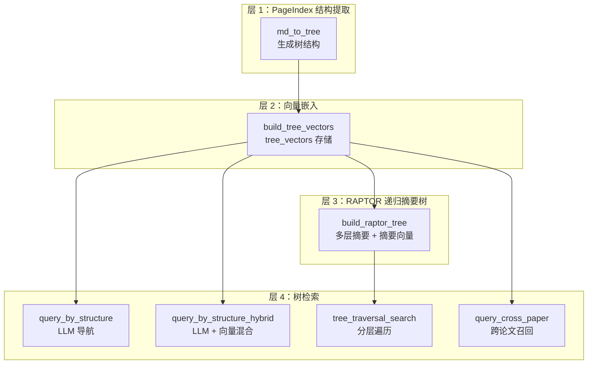
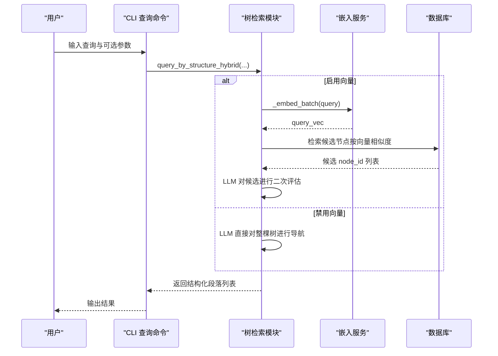
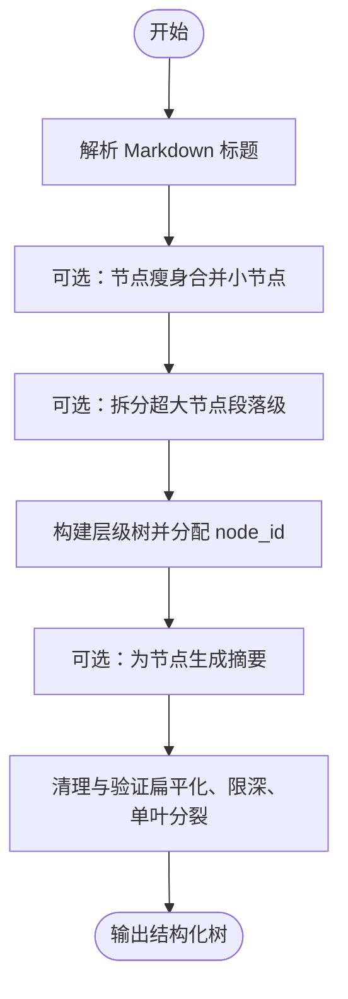
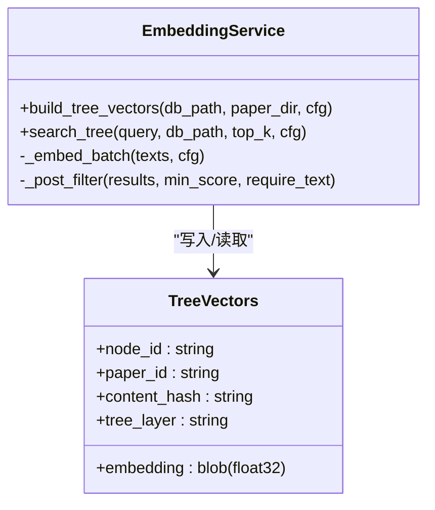
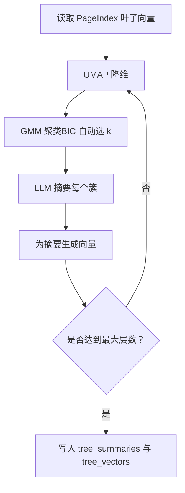
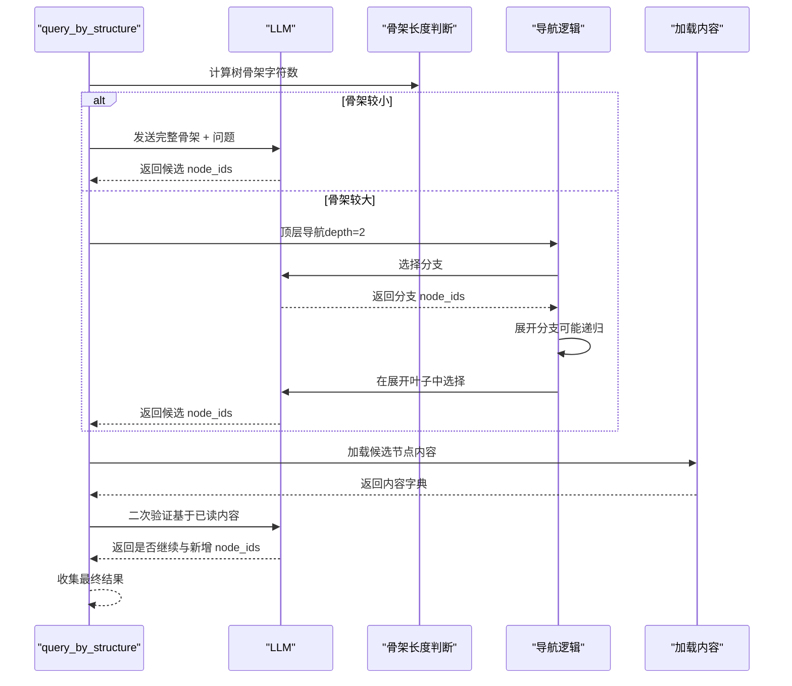
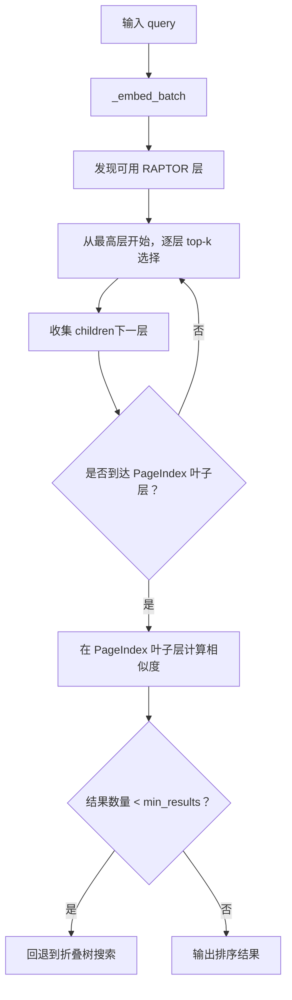
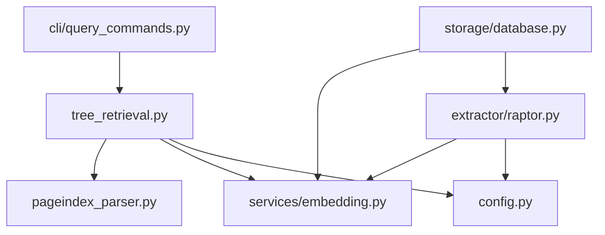

# 树检索算法

<cite>
**本文档引用的文件**
- [src/drbrain/query/tree_retrieval.py](file://src/drbrain/query/tree_retrieval.py)
- [src/drbrain/extractor/raptor.py](file://src/drbrain/extractor/raptor.py)
- [src/drbrain/parser/pageindex_parser.py](file://src/drbrain/parser/pageindex_parser.py)
- [src/drbrain/services/embedding.py](file://src/drbrain/services/embedding.py)
- [src/drbrain/config.py](file://src/drbrain/config.py)
- [src/drbrain/cli/query_commands.py](file://src/drbrain/cli/query_commands.py)
- [src/drbrain/storage/database.py](file://src/drbrain/storage/database.py)
- [tests/test_tree_retrieval.py](file://tests/test_tree_retrieval.py)
- [tests/test_layer3_raptor.py](file://tests/test_layer3_raptor.py)
- [tests/test_layer4_tree_retrieval_v2.py](file://tests/test_layer4_tree_retrieval_v2.py)
</cite>

## 目录
1. [简介](#简介)
2. [项目结构](#项目结构)
3. [核心组件](#核心组件)
4. [架构总览](#架构总览)
5. [详细组件分析](#详细组件分析)
6. [依赖分析](#依赖分析)
7. [性能考虑](#性能考虑)
8. [故障排除指南](#故障排除指南)
9. [结论](#结论)
10. [附录](#附录)

## 简介
本文件系统性阐述 DrBrain 的树检索算法，重点覆盖基于 PageIndex 的结构化树检索与 RAPTOR 递归语义树的融合方案。内容包括：
- 多层摘要树（PageIndex + RAPTOR）的构建与存储
- 基于 LLM 的树检索流程（迭代式选择、自适应导航、二次验证）
- 向量嵌入与混合检索策略（跨论文召回、分数组合、RRF 融合）
- 查询匹配与相似度计算方法
- 配置参数与调优建议
- 使用示例与性能基准测试思路

## 项目结构
DrBrain 将“树检索”划分为多个层次：
- 层 1：PageIndex 文档结构提取与树生成
- 层 2：树节点向量化（tree_vectors）
- 层 3：RAPTOR 递归摘要树（多层语义聚合）
- 层 4：混合检索（LLM 主导 + 向量预筛 + 跨论文召回）

**图表来源**
- [src/drbrain/parser/pageindex_parser.py](file://src/drbrain/parser/pageindex_parser.py)
- [src/drbrain/services/embedding.py](file://src/drbrain/services/embedding.py)
- [src/drbrain/extractor/raptor.py](file://src/drbrain/extractor/raptor.py)
- [src/drbrain/query/tree_retrieval.py](file://src/drbrain/query/tree_retrieval.py)

**章节来源**
- [src/drbrain/parser/pageindex_parser.py](file://src/drbrain/parser/pageindex_parser.py)
- [src/drbrain/services/embedding.py](file://src/drbrain/services/embedding.py)
- [src/drbrain/extractor/raptor.py](file://src/drbrain/extractor/raptor.py)
- [src/drbrain/query/tree_retrieval.py](file://src/drbrain/query/tree_retrieval.py)

## 核心组件
- PageIndex 树构建器：从 Markdown 提取标题、切分大节点、生成带 node_id 的层级树，并可选生成节点摘要。
- 树向量服务：对树节点进行向量化，存储在 tree_vectors 表中，支持增量更新与维度校验。
- RAPTOR 递归摘要树：对 PageIndex 叶子节点向量进行 UMAP 降维 + GMM 聚类 + LLM 摘要，形成多层摘要节点，每层生成摘要向量。
- 树检索模块：提供 LLM 导航的结构化检索、跨论文向量召回、分层遍历与混合评分。

**章节来源**
- [src/drbrain/parser/pageindex_parser.py](file://src/drbrain/parser/pageindex_parser.py)
- [src/drbrain/services/embedding.py](file://src/drbrain/services/embedding.py)
- [src/drbrain/extractor/raptor.py](file://src/drbrain/extractor/raptor.py)
- [src/drbrain/query/tree_retrieval.py](file://src/drbrain/query/tree_retrieval.py)

## 架构总览
树检索的整体流程如下：

**图表来源**
- [src/drbrain/cli/query_commands.py](file://src/drbrain/cli/query_commands.py)
- [src/drbrain/query/tree_retrieval.py](file://src/drbrain/query/tree_retrieval.py)
- [src/drbrain/services/embedding.py](file://src/drbrain/services/embedding.py)

## 详细组件分析

### PageIndex 树结构与内容提取
- 树构建：解析 Markdown 标题，合并小节点，拆分超大节点，生成层级树并分配 node_id。
- 内容提取：根据 node_id 与行号范围从 raw.md 中抽取对应文本，用于后续检索与展示。
- 结构清理与验证：移除空叶子、扁平单链、限制最大深度、单叶分裂等。

**图表来源**
- [src/drbrain/parser/pageindex_parser.py](file://src/drbrain/parser/pageindex_parser.py)

**章节来源**
- [src/drbrain/parser/pageindex_parser.py](file://src/drbrain/parser/pageindex_parser.py)

### 树向量服务与存储
- 增量嵌入：读取树节点文本，计算内容哈希，仅对变更节点重新嵌入。
- 存储格式：tree_vectors 表，字段包含 node_id、paper_id、embedding（float32）、content_hash、tree_layer。
- 维度一致性：查询时检查存储向量维度，不一致则跳过并告警。
- 向量检索：对所有 tree_vectors 进行余弦相似度计算，返回 top_k。

**图表来源**
- [src/drbrain/services/embedding.py](file://src/drbrain/services/embedding.py)
- [src/drbrain/storage/database.py](file://src/drbrain/storage/database.py)

**章节来源**
- [src/drbrain/services/embedding.py](file://src/drbrain/services/embedding.py)
- [src/drbrain/storage/database.py](file://src/drbrain/storage/database.py)

### RAPTOR 递归语义树
- 流程概览：对 PageIndex 叶子节点向量进行 UMAP 降维，GMM 自动确定聚类数，LLM 摘要每个簇，再对摘要向量重复上述过程，直到收敛或达到最大层数。
- 存储：tree_summaries 记录摘要文本与源节点映射；tree_vectors 存储各层摘要向量。
- 参数：最大层数、UMAP 组件数、最大聚类数、最小簇大小。

**图表来源**
- [src/drbrain/extractor/raptor.py](file://src/drbrain/extractor/raptor.py)

**章节来源**
- [src/drbrain/extractor/raptor.py](file://src/drbrain/extractor/raptor.py)

### 树检索：LLM 导航与自适应深度
- 小树（骨架长度小于阈值）：一次性发送完整树骨架给 LLM，直接选择候选节点。
- 大树：先显示顶层结构（折叠子节点），LLM 选择分支；若展开后仍过大，递归采用“顶层导航”策略；否则直接在展开的叶子中选择。
- 二次验证：加载已选节点内容，再次询问 LLM 是否需要更多节点。
- 节点内容提取：通过 node_id 定位 raw.md 中的文本片段。

**图表来源**
- [src/drbrain/query/tree_retrieval.py](file://src/drbrain/query/tree_retrieval.py)

**章节来源**
- [src/drbrain/query/tree_retrieval.py](file://src/drbrain/query/tree_retrieval.py)

### 混合检索：跨论文召回与分层遍历
- 跨论文召回：对 query 向量与 tree_vectors 中的所有节点进行余弦相似度比较，返回按分数排序的结果。
- 分层遍历搜索：从 RAPTOR 最高层（根层）开始，逐层筛选 top_k，利用 tree_summaries 的 source_node_ids 获取下一层候选，最终在 PageIndex 叶子层执行相似度计算。
- 回退策略：若分层遍历结果少于阈值，则回退到“折叠树”全量搜索。

**图表来源**
- [src/drbrain/query/tree_retrieval.py](file://src/drbrain/query/tree_retrieval.py)
- [src/drbrain/services/embedding.py](file://src/drbrain/services/embedding.py)

**章节来源**
- [src/drbrain/query/tree_retrieval.py](file://src/drbrain/query/tree_retrieval.py)
- [src/drbrain/services/embedding.py](file://src/drbrain/services/embedding.py)

### 查询匹配与相似度计算
- 向量相似度：余弦相似度（cos_sim），输入与存储向量均需为单位向量，计算即为点积。
- 分数融合：加权求和（alpha 为 BM25 权重），或 RRFS（Reciprocal Rank Fusion）融合多路排序。
- 后处理：过滤低分结果、确保 node_id 存在。

**章节来源**
- [src/drbrain/query/tree_retrieval.py](file://src/drbrain/query/tree_retrieval.py)
- [src/drbrain/services/embedding.py](file://src/drbrain/services/embedding.py)

### 配置参数与调优指南
- 嵌入配置（EmbedConfig）
  - provider：本地模型、OpenAI 兼容、禁用（none）
  - model：Sentence Transformer 模型名或 HuggingFace ID
  - device：auto/cpu/cuda
  - top_k：默认返回条数
  - source：模型下载源（modelscope/huggingface）
  - api_base/api_key：云服务端点与密钥
  - batch_size：批量大小
- 树检索参数
  - max_rounds/per_round：迭代轮次与每轮候选数
  - top_k/min_results：分层遍历每层保留数与回退阈值
  - alpha：混合评分中 BM25 权重
- 调优建议
  - 当文档树很大时，适当提高 per_round 以减少二次验证轮次
  - 向量维度与模型选择影响召回质量，建议在 GPU 上启用自动批大小
  - 分层遍历的 top_k 与 min_results 需平衡准确率与延迟

**章节来源**
- [src/drbrain/config.py](file://src/drbrain/config.py)
- [src/drbrain/query/tree_retrieval.py](file://src/drbrain/query/tree_retrieval.py)
- [src/drbrain/services/embedding.py](file://src/drbrain/services/embedding.py)

### 使用示例
- 单篇 PageIndex 树检索（LLM 导航为主）
  - 步骤：准备 paper_dir（包含 tree.json 与 raw.md），调用 query_by_structure_hybrid，传入 EmbedConfig 与 LLM 模型列表
  - 输出：结构化段落列表（node_id、title、content、source）
- 跨论文向量召回
  - 步骤：调用 query_cross_paper，传入 db_path 与 EmbedConfig
  - 输出：按分数排序的 node_id/paper_id/score 列表
- 分层遍历搜索
  - 步骤：调用 tree_traversal_search，设置 top_k 与 min_results
  - 输出：按分数排序的节点列表

**章节来源**
- [src/drbrain/cli/query_commands.py](file://src/drbrain/cli/query_commands.py)
- [src/drbrain/query/tree_retrieval.py](file://src/drbrain/query/tree_retrieval.py)

### 性能基准测试思路
- 数据集：多篇论文（含不同页数与树深度），每篇生成 PageIndex + RAPTOR 树
- 指标：首次查询延迟、召回命中率、二次验证轮次分布、向量计算耗时占比
- 方法：
  - 固定 per_round 与 top_k，对比“仅 LLM 导航”、“LLM + 向量预筛”、“分层遍历”三种策略
  - 在不同 GPU/CPU 下测试批大小自适应效果
  - 对比不同 alpha 权重下的混合评分性能

[本节为通用指导，无需具体文件引用]

## 依赖分析
- 组件耦合
  - query_by_structure_hybrid 依赖：LLM 客户端、PageIndex 解析器、向量服务
  - tree_traversal_search 依赖：SQLite 数据库、向量服务、树摘要映射
  - build_raptor_tree 依赖：嵌入服务、GMM/UMAP、LLM 客户端
- 外部依赖
  - Sentence Transformers（本地或云端）
  - scikit-learn（UMAP/GMM）
  - SQLite（持久化树向量与摘要）

**图表来源**
- [src/drbrain/query/tree_retrieval.py](file://src/drbrain/query/tree_retrieval.py)
- [src/drbrain/parser/pageindex_parser.py](file://src/drbrain/parser/pageindex_parser.py)
- [src/drbrain/services/embedding.py](file://src/drbrain/services/embedding.py)
- [src/drbrain/extractor/raptor.py](file://src/drbrain/extractor/raptor.py)
- [src/drbrain/cli/query_commands.py](file://src/drbrain/cli/query_commands.py)
- [src/drbrain/storage/database.py](file://src/drbrain/storage/database.py)
- [src/drbrain/config.py](file://src/drbrain/config.py)

**章节来源**
- [src/drbrain/query/tree_retrieval.py](file://src/drbrain/query/tree_retrieval.py)
- [src/drbrain/extractor/raptor.py](file://src/drbrain/extractor/raptor.py)
- [src/drbrain/parser/pageindex_parser.py](file://src/drbrain/parser/pageindex_parser.py)
- [src/drbrain/services/embedding.py](file://src/drbrain/services/embedding.py)
- [src/drbrain/cli/query_commands.py](file://src/drbrain/cli/query_commands.py)
- [src/drbrain/storage/database.py](file://src/drbrain/storage/database.py)
- [src/drbrain/config.py](file://src/drbrain/config.py)

## 性能考虑
- Token 效率：大文档采用“顶层导航 + 逐步展开”的自适应策略，避免一次性发送完整树骨架
- 向量计算：启用 GPU 批大小自适应，合理设置 batch_size 与 top_k
- 存储与索引：tree_vectors 采用 BLOB 存储 float32 向量，注意维度一致性
- 分层遍历：通过逐层 top-k 与 children 收敛，显著降低比较次数

[本节为通用指导，无需具体文件引用]

## 故障排除指南
- 缺失文件
  - tree.json 或 raw.md 不存在：返回 None 并记录警告
- LLM 失败
  - LLM 返回空或解析失败：回退为空结果
- 向量维度不一致
  - 存储向量与查询向量维度不匹配：跳过该条目并记录告警
- 空数据库
  - tree_vectors 为空：返回空结果（跨论文与分层遍历均适用）

**章节来源**
- [src/drbrain/query/tree_retrieval.py](file://src/drbrain/query/tree_retrieval.py)
- [src/drbrain/services/embedding.py](file://src/drbrain/services/embedding.py)
- [tests/test_tree_retrieval.py](file://tests/test_tree_retrieval.py)
- [tests/test_layer4_tree_retrieval_v2.py](file://tests/test_layer4_tree_retrieval_v2.py)

## 结论
DrBrain 的树检索算法以 PageIndex 结构为基础，结合 RAPTOR 多层摘要树与向量嵌入，实现了“LLM 导航为主 + 向量辅助”的高效检索方案。通过自适应深度导航、分层遍历与跨论文召回，系统在准确性与效率之间取得良好平衡。建议在实际部署中根据数据规模与硬件条件调整参数，并持续监控向量维度与批大小策略。

[本节为总结性内容，无需具体文件引用]

## 附录
- 测试覆盖要点
  - PageIndex 树构建与内容提取
  - RAPTOR 多层摘要树构建与存储
  - 树检索混合模式与跨论文召回
  - 分层遍历搜索与回退策略

**章节来源**
- [tests/test_tree_retrieval.py](file://tests/test_tree_retrieval.py)
- [tests/test_layer3_raptor.py](file://tests/test_layer3_raptor.py)
- [tests/test_layer4_tree_retrieval_v2.py](file://tests/test_layer4_tree_retrieval_v2.py)