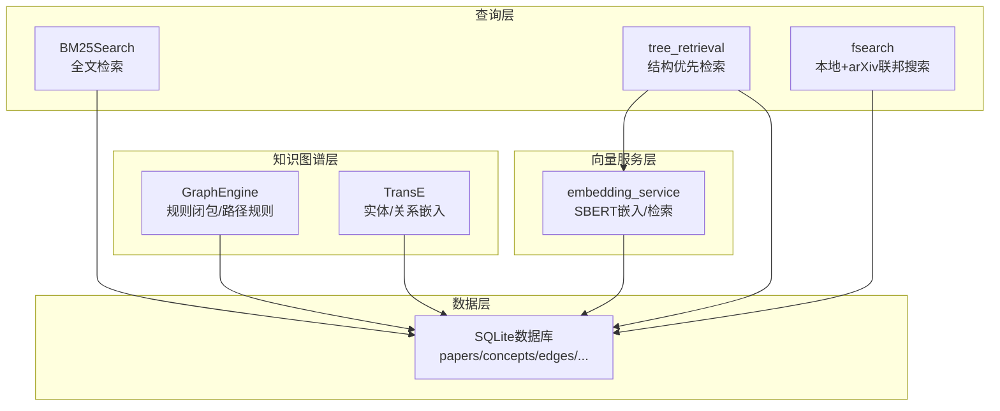
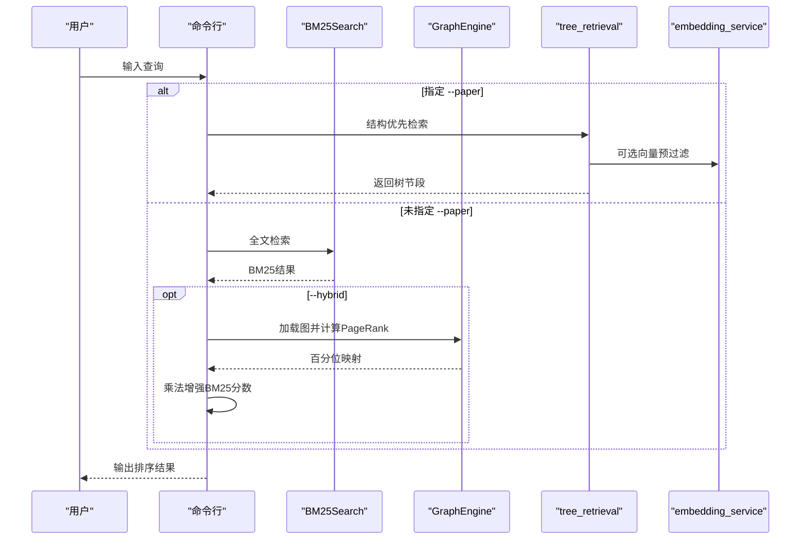
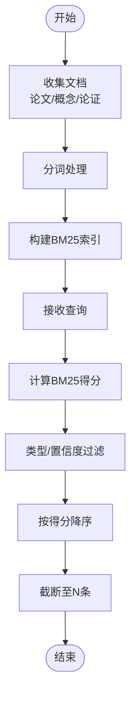
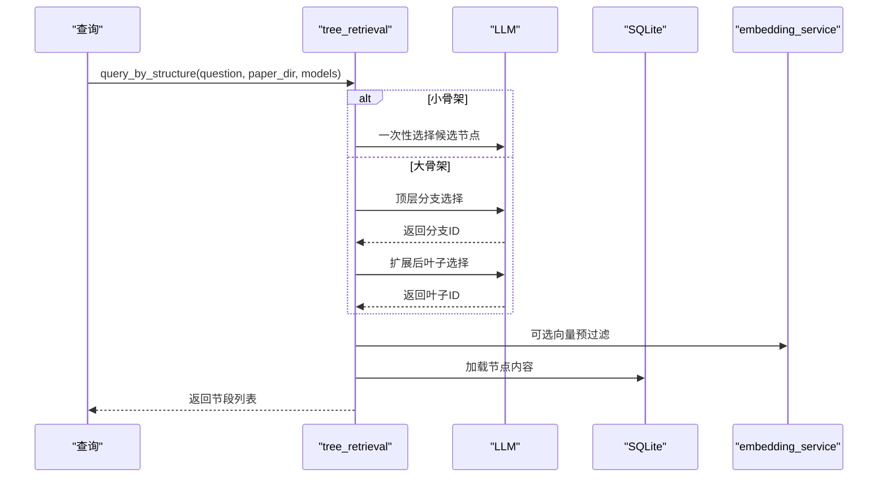
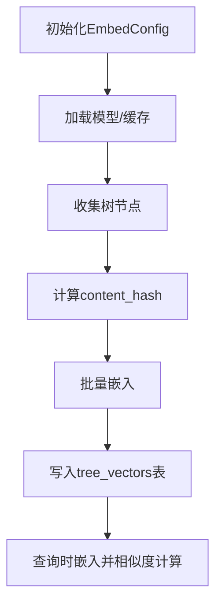
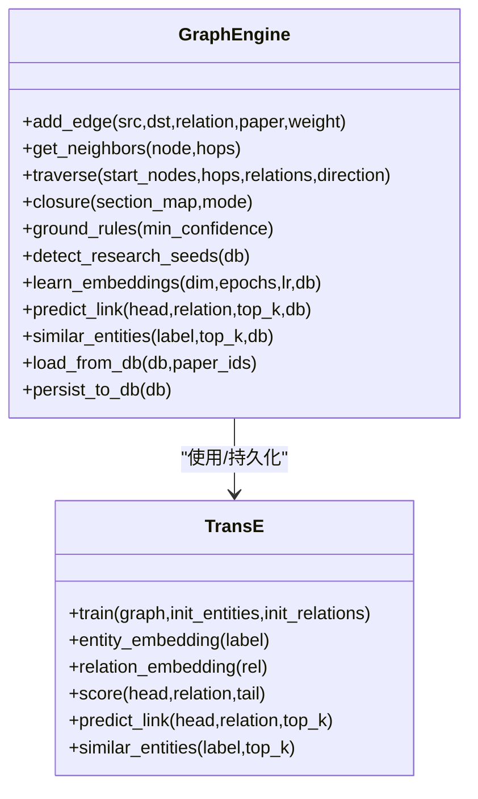
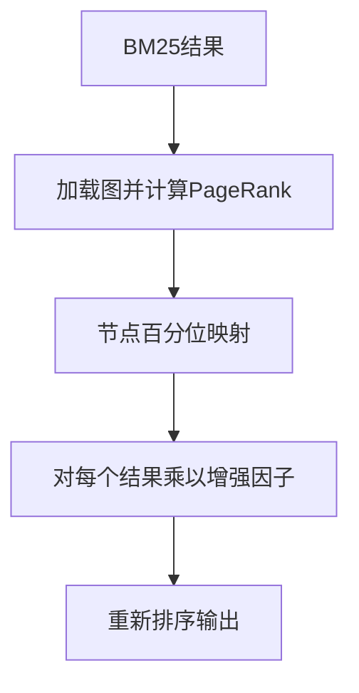
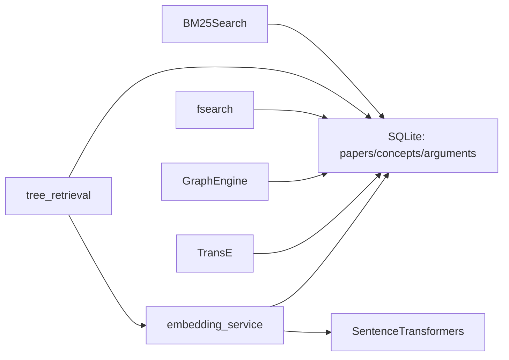

# 检索系统

<cite>
**本文引用的文件**
- [bm25.py](file://src/drbrain/query/bm25.py)
- [tree_retrieval.py](file://src/drbrain/query/tree_retrieval.py)
- [engine.py](file://src/drbrain/graph/engine.py)
- [embedding.py](file://src/drbrain/graph/embedding.py)
- [fsearch.py](file://src/drbrain/services/fsearch.py)
- [embedding_service.py](file://src/drbrain/services/embedding.py)
- [database.py](file://src/drbrain/storage/database.py)
- [config.py](file://src/drbrain/config.py)
- [architecture.md](file://docs/architecture.md)
- [configuration.md](file://docs/configuration.md)
- [2026-05-02-hybrid-ranking-design.md](file://docs/superpowers/specs/2026-05-02-hybrid-ranking-design.md)
- [test_bm25.py](file://tests/test_bm25.py)
- [test_tree_retrieval.py](file://tests/test_tree_retrieval.py)
- [test_engine.py](file://tests/test_engine.py)
</cite>

## 目录
1. [简介](#简介)
2. [项目结构](#项目结构)
3. [核心组件](#核心组件)
4. [架构总览](#架构总览)
5. [详细组件分析](#详细组件分析)
6. [依赖分析](#依赖分析)
7. [性能考虑](#性能考虑)
8. [故障排查指南](#故障排查指南)
9. [结论](#结论)
10. [附录](#附录)

## 简介
本技术文档面向 DrBrain 的检索系统，系统性阐述以下能力与实现：
- BM25 全文检索：基于论文标题、概念标签与论证声明的关键词匹配
- 图增强检索：基于符号驱动的知识图谱（规则推理、PageRank 增强）
- 树检索（PageIndex）：结构优先的分层树检索，支持 LLM 引导与向量预过滤
- 向量检索：轻量级语义向量（仅树节点），跨论文折叠检索与两阶段树遍历
- 混合排序与 PageRank 增强：在小规模学术库中以文本相关性为基线，用图中心性进行乘法增强
- 与知识图谱的集成：TransE 嵌入、规则闭包、路径规则与置信传播
- 查询构建与结果排序：多路融合（BM25、向量、图信号）、RRF 融合、分层树遍历
- 使用示例与参数调优：CLI 参数、配置项、性能优化建议

## 项目结构
检索系统由以下模块协同构成：
- 查询层：BM25、树检索、联邦搜索
- 知识图谱层：规则推理、TransE 嵌入、路径规则
- 向量服务层：SBERT 文本嵌入、树向量存储与检索
- 数据层：SQLite 存储（papers、concepts、edges、arguments、tree_vectors 等）

图表来源
- [bm25.py:17-135](file://src/drbrain/query/bm25.py#L17-L135)
- [tree_retrieval.py:1-800](file://src/drbrain/query/tree_retrieval.py#L1-L800)
- [fsearch.py:1-178](file://src/drbrain/services/fsearch.py#L1-L178)
- [embedding_service.py:1-786](file://src/drbrain/services/embedding.py#L1-L786)
- [engine.py:33-315](file://src/drbrain/graph/engine.py#L33-L315)
- [embedding.py:8-117](file://src/drbrain/graph/embedding.py#L8-L117)
- [database.py:10-156](file://src/drbrain/storage/database.py#L10-L156)

章节来源
- [architecture.md:188-210](file://docs/architecture.md#L188-L210)

## 核心组件
- BM25Search：对论文标题、概念标签、论证声明构建倒排索引，支持类型过滤、论证类型过滤与最小置信度过滤
- tree_retrieval：结构优先检索，支持自适应深度导航（小骨架直接选择、大骨架分层选择）、LLM 引导与向量预过滤
- GraphEngine：规则闭包（8+4 推理规则）、TransE 嵌入、路径规则、研究种子检测
- embedding_service：SBERT 文本嵌入、树向量构建与检索、跨论文折叠检索、两阶段树遍历
- fsearch：本地 BM25 检索与 arXiv 联邦搜索，标注已入库状态
- 配置系统：EmbedConfig/BM25Config/DirsConfig 等，支持 provider=none 完全禁用向量

章节来源
- [bm25.py:17-135](file://src/drbrain/query/bm25.py#L17-L135)
- [tree_retrieval.py:1-800](file://src/drbrain/query/tree_retrieval.py#L1-L800)
- [engine.py:33-315](file://src/drbrain/graph/engine.py#L33-L315)
- [embedding_service.py:1-786](file://src/drbrain/services/embedding.py#L1-L786)
- [fsearch.py:1-178](file://src/drbrain/services/fsearch.py#L1-L178)
- [config.py:115-141](file://src/drbrain/config.py#L115-L141)

## 架构总览
检索系统遵循“符号驱动 + 轻量向量”的原则：
- BM25 与规则推理为核心；向量仅用于语义完备的树节点（不切块），避免向量数据库依赖
- provider=none 时完全回退到 BM25 + LLM 导航
- 混合排序通过 PageRank 乘法增强提升结构重要性节点的权重，但不覆盖文本相关性

图表来源
- [architecture.md:188-210](file://docs/architecture.md#L188-L210)
- [2026-05-02-hybrid-ranking-design.md:33-86](file://docs/superpowers/specs/2026-05-02-hybrid-ranking-design.md#L33-L86)
- [bm25.py:56-91](file://src/drbrain/query/bm25.py#L56-L91)
- [tree_retrieval.py:215-380](file://src/drbrain/query/tree_retrieval.py#L215-L380)
- [engine.py:33-123](file://src/drbrain/graph/engine.py#L33-L123)

## 详细组件分析

### BM25 检索
- 文档构建：论文标题+摘要+状态、概念标签、论证声明（含类型与置信度）
- 分词与索引：小写化、字母数字拆分，BM25Okapi 实现 TF-IDF 平滑
- 查询接口：支持按类型/论证类型过滤、最小置信度阈值、限制返回数量
- 索引构建：可配置 k1/b，支持从数据库批量构建

图表来源
- [bm25.py:25-91](file://src/drbrain/query/bm25.py#L25-L91)
- [bm25.py:93-135](file://src/drbrain/query/bm25.py#L93-L135)

章节来源
- [bm25.py:17-135](file://src/drbrain/query/bm25.py#L17-L135)
- [test_bm25.py:10-207](file://tests/test_bm25.py#L10-L207)

### 树检索（PageIndex）与两阶段树遍历
- 自适应导航：小骨架（<8000字符）一次性选择；大骨架分层：顶层→分支→叶子
- LLM 引导：提供结构 JSON 与问题，返回候选节点 ID 列表
- 向量预过滤：当可用时，先用向量相似度缩小候选空间，再让 LLM 决策
- 两阶段树遍历：从最高层 RAPTOR 层逐层向下，按余弦相似度保留 top-k，最终在 PageIndex 叶子层收敛
- 折叠检索：跨论文扁平检索所有树向量，适合 ReasonerAgent 工具

图表来源
- [tree_retrieval.py:215-380](file://src/drbrain/query/tree_retrieval.py#L215-L380)
- [tree_retrieval.py:484-647](file://src/drbrain/query/tree_retrieval.py#L484-L647)

章节来源
- [tree_retrieval.py:1-800](file://src/drbrain/query/tree_retrieval.py#L1-L800)
- [test_tree_retrieval.py:106-184](file://tests/test_tree_retrieval.py#L106-L184)
- [test_tree_retrieval.py:726-794](file://tests/test_tree_retrieval.py#L726-L794)

### 向量检索与树向量管理
- 模型加载：本地（ModelScope/HuggingFace）、OpenAI 兼容、禁用（provider=none）
- GPU 自适应批大小：基于显存档（profile）动态调整
- 树向量构建：收集 PageIndex 叶子节点与 RAPTOR 摘要，增量更新（content_hash）
- 检索：对所有树向量计算余弦相似度，支持后过滤（最低分数、空节点 ID）

图表来源
- [embedding_service.py:155-210](file://src/drbrain/services/embedding.py#L155-L210)
- [embedding_service.py:598-667](file://src/drbrain/services/embedding.py#L598-L667)
- [embedding_service.py:710-786](file://src/drbrain/services/embedding.py#L710-L786)

章节来源
- [embedding_service.py:1-786](file://src/drbrain/services/embedding.py#L1-L786)
- [database.py:84-98](file://src/drbrain/storage/database.py#L84-L98)

### 图增强与 PageRank 增强
- 规则闭包：8 条推理规则 + 4 条路径规则，支持 section-aware 置信衰减
- TransE 嵌入：训练实体/关系向量，支持链接预测与实体相似度
- PageRank 增强：对 BM25 结果按节点 PageRank 百分位映射为 [1.0, 2.0] 的乘法因子，结构重要性节点获得提升

图表来源
- [engine.py:33-315](file://src/drbrain/graph/engine.py#L33-L315)
- [embedding.py:8-117](file://src/drbrain/graph/embedding.py#L8-L117)

章节来源
- [engine.py:33-315](file://src/drbrain/graph/engine.py#L33-L315)
- [embedding.py:8-117](file://src/drbrain/graph/embedding.py#L8-L117)
- [2026-05-02-hybrid-ranking-design.md:33-86](file://docs/superpowers/specs/2026-05-02-hybrid-ranking-design.md#L33-L86)
- [test_engine.py:54-183](file://tests/test_engine.py#L54-L183)

### 混合排序与 PageRank 增强机制
- 乘法增强：final_score = bm25_score × (1.0 + percentile_rank)
- 百分位映射：最高 PageRank 得到 2.0 增幅，最低得到 1.0，未在图中的节点保持 1.0
- 性能：PageRank O(V+E)，排序 O(V log V)，应用 O(R)

图表来源
- [2026-05-02-hybrid-ranking-design.md:47-75](file://docs/superpowers/specs/2026-05-02-hybrid-ranking-design.md#L47-L75)

章节来源
- [2026-05-02-hybrid-ranking-design.md:1-119](file://docs/superpowers/specs/2026-05-02-hybrid-ranking-design.md#L1-L119)

### 联邦搜索（本地+arXiv）
- 本地：基于 BM25-like 的简单 SQL 搜索（标题/概念/论证）
- 外部：arXiv Atom API，合并本地去重（DOI/arXiv 规范化）
- 标注：是否已在本地库中

章节来源
- [fsearch.py:1-178](file://src/drbrain/services/fsearch.py#L1-L178)

## 依赖分析
检索系统的关键依赖关系如下：

图表来源
- [bm25.py:93-135](file://src/drbrain/query/bm25.py#L93-L135)
- [tree_retrieval.py:473-478](file://src/drbrain/query/tree_retrieval.py#L473-L478)
- [embedding_service.py:155-210](file://src/drbrain/services/embedding.py#L155-L210)
- [engine.py:626-670](file://src/drbrain/graph/engine.py#L626-L670)
- [database.py:10-156](file://src/drbrain/storage/database.py#L10-L156)

章节来源
- [database.py:10-156](file://src/drbrain/storage/database.py#L10-L156)
- [config.py:115-141](file://src/drbrain/config.py#L115-L141)

## 性能考虑
- 向量批处理自适应：根据 GPU 显存档动态调整 batch_size，避免 OOM
- 树检索分层剪枝：两阶段树遍历仅比较相关分支，显著减少向量比较次数
- SQLite WAL：并发读写友好，适合个人研究工具
- PageRank 计算：小规模图（数百节点）开销可忽略
- 禁用向量：provider=none 时完全回退到 BM25 + LLM 导航，零外部依赖

章节来源
- [embedding_service.py:212-412](file://src/drbrain/services/embedding.py#L212-L412)
- [tree_retrieval.py:484-647](file://src/drbrain/query/tree_retrieval.py#L484-L647)
- [architecture.md:269-277](file://docs/architecture.md#L269-L277)

## 故障排查指南
- BM25 无结果
  - 检查索引是否构建成功（数据库中是否存在论文/概念/论证）
  - 调整最小置信度阈值或类型过滤
- 树检索无结果
  - 确认 paper_dir 下存在 tree.json 与 raw.md
  - 检查 LLM 返回的节点 ID 是否存在且内容可提取
- 向量检索异常
  - 检查 provider 配置（local/openai-compat/none）
  - GPU OOM：降低 batch_size 或切换到 CPU
- 图增强无效
  - 确保图中有边；空图时 PageRank 增强退化为纯 BM25
  - 检查 GraphEngine.load_from_db 是否正确加载

章节来源
- [test_bm25.py:92-110](file://tests/test_bm25.py#L92-L110)
- [test_tree_retrieval.py:144-153](file://tests/test_tree_retrieval.py#L144-L153)
- [test_tree_retrieval.py:781-794](file://tests/test_tree_retrieval.py#L781-L794)
- [test_engine.py:300-329](file://tests/test_engine.py#L300-L329)

## 结论
DrBrain 的检索系统以“符号驱动 + 轻量向量”为核心理念，在小规模学术库中实现了高效、可解释的混合检索：
- BM25 提供稳定的基础检索
- 树检索与向量结合，兼顾结构与语义
- 图增强通过 PageRank 与规则推理提升结构重要性节点的可见性
- 完全可配置的向量后端（provider=none）确保在资源受限环境下的可用性

## 附录

### 使用示例与参数调优
- CLI 示例
  - BM25 查询：drbrain query "关键词"
  - 指定论文树检索：drbrain query "问题" --paper <id>
  - 混合排序：drbrain query "关键词" --hybrid
- 关键参数
  - BM25：k1/b（默认 1.5/0.75）
  - 向量：provider/model/device/top_k/source/batch_size
  - 图增强：--hybrid（自动启用 PageRank 增强）

章节来源
- [configuration.md:164-247](file://docs/configuration.md#L164-L247)
- [2026-05-02-hybrid-ranking-design.md:21-31](file://docs/superpowers/specs/2026-05-02-hybrid-ranking-design.md#L21-L31)