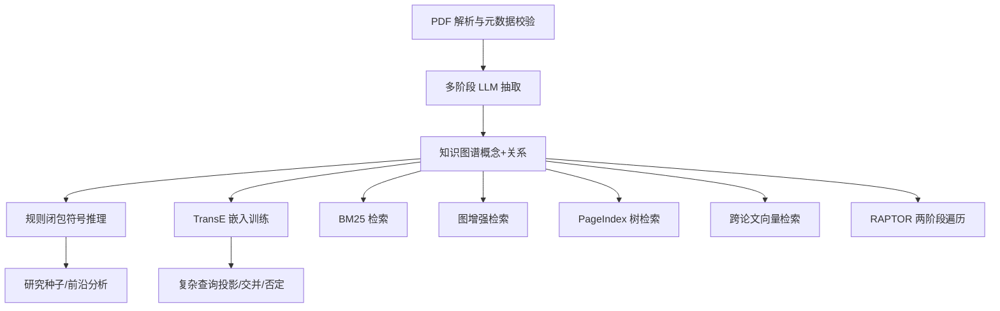
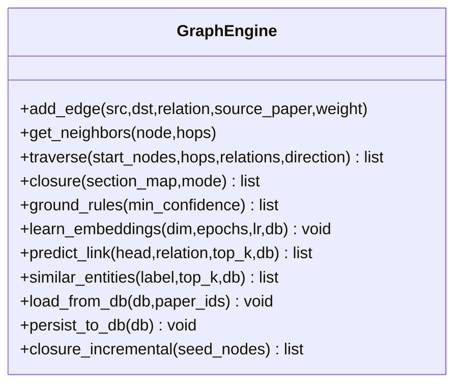
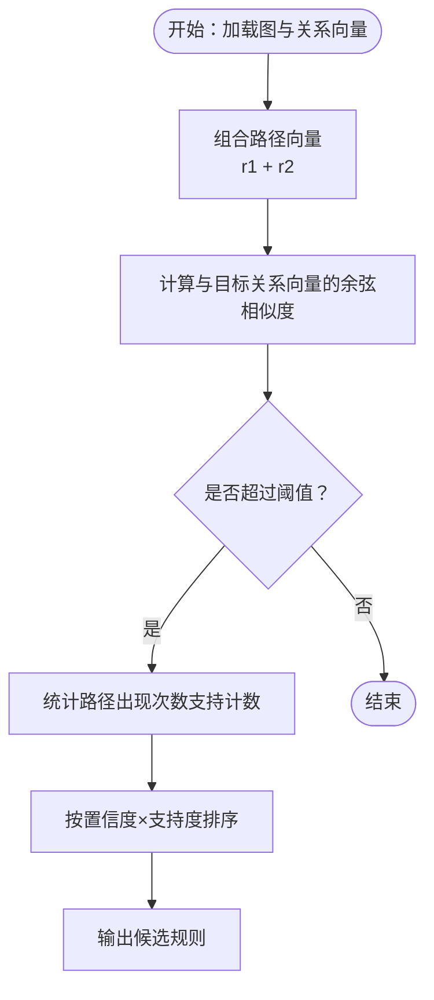
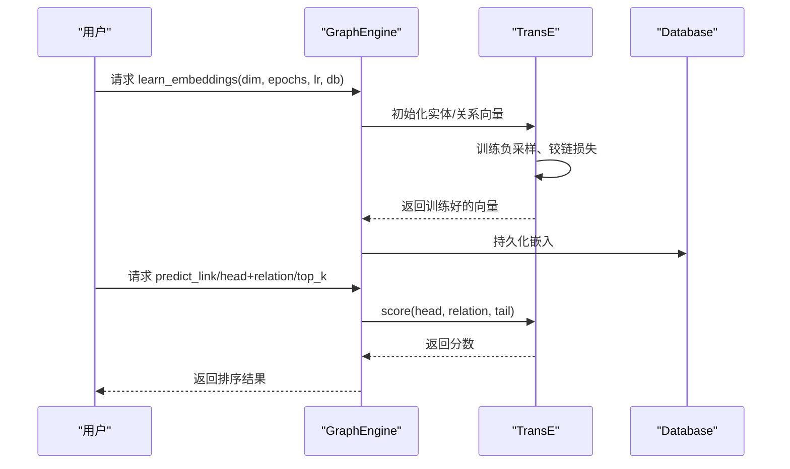
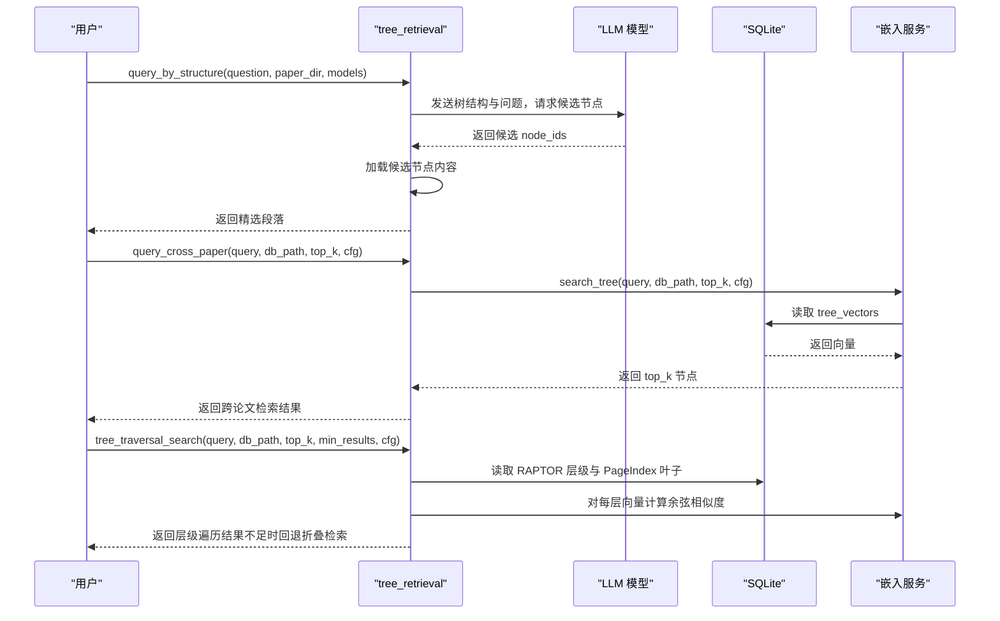
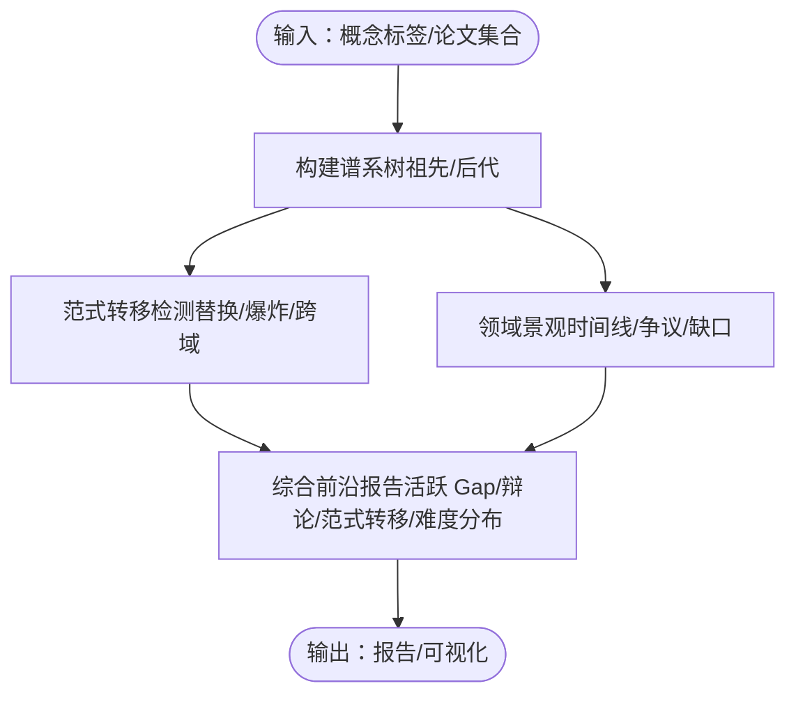
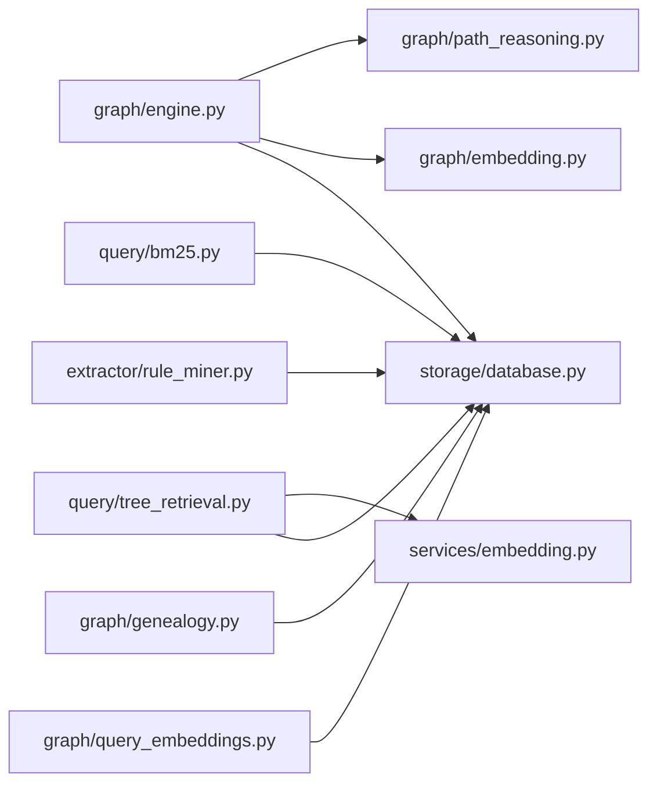

# 知识图谱系统

<cite>
**本文引用的文件**
- [README.md](file://README.md)
- [docs/getting-started.md](file://docs/getting-started.md)
- [docs/architecture.md](file://docs/architecture.md)
- [src/drbrain/config.py](file://src/drbrain/config.py)
- [src/drbrain/graph/engine.py](file://src/drbrain/graph/engine.py)
- [src/drbrain/graph/embedding.py](file://src/drbrain/graph/embedding.py)
- [src/drbrain/graph/path_reasoning.py](file://src/drbrain/graph/path_reasoning.py)
- [src/drbrain/graph/genealogy.py](file://src/drbrain/graph/genealogy.py)
- [src/drbrain/graph/query_embeddings.py](file://src/drbrain/graph/query_embeddings.py)
- [src/drbrain/extractor/rule_miner.py](file://src/drbrain/extractor/rule_miner.py)
- [src/drbrain/storage/database.py](file://src/drbrain/storage/database.py)
- [src/drbrain/query/bm25.py](file://src/drbrain/query/bm25.py)
- [src/drbrain/query/tree_retrieval.py](file://src/drbrain/query/tree_retrieval.py)
- [src/drbrain/services/embedding.py](file://src/drbrain/services/embedding.py)
</cite>

## 目录
1. [简介](#简介)
2. [项目结构](#项目结构)
3. [核心组件](#核心组件)
4. [架构总览](#架构总览)
5. [详细组件分析](#详细组件分析)
6. [依赖关系分析](#依赖关系分析)
7. [性能考虑](#性能考虑)
8. [故障排查指南](#故障排查指南)
9. [结论](#结论)
10. [附录](#附录)

## 简介
本技术文档面向 DrBrain 知识图谱系统，围绕图构建、推理规则、嵌入训练与闭包推理等核心能力进行深入解析，并结合 NetworkX 集成与自定义扩展、基因谱分析、路径推理、概念嵌入、查询接口与数据模型、性能优化与扩展机制等方面，帮助读者从原理到实践全面掌握系统的实现与使用。

## 项目结构
DrBrain 采用模块化分层设计：命令行入口、抽取与构建（LLM 驱动）、图引擎（NetworkX + 规则推理）、检索（BM25 + PageIndex/RAPTOR 向量检索）、存储（SQLite）与服务（嵌入、导出、管道等）。核心目录与职责概览如下：
- 命令行与技能：CLI 命令、技能封装与工具链集成
- 抽取与构建：多阶段 LLM 提取（本体扩展、实体抽取、关系抽取、共指消解、迭代精炼）
- 图引擎：基于 NetworkX 的规则闭包、路径规则、TransE 嵌入、研究种子检测
- 检索：BM25 全文检索、结构优先树检索（PageIndex）、跨论文向量检索、RAPTOR 两阶段遍历
- 存储：SQLite 数据库，统一管理论文、概念、边、别名、证据、嵌入、树向量、树摘要等
- 服务：嵌入服务（本地/兼容 OpenAI）、导出、指标面板、管道编排等

```mermaid
graph TB
subgraph "命令行与技能"
CLI["CLI 命令"]
SKILLS["Agent 技能"]
end
subgraph "抽取与构建"
EXTRACT["多阶段 LLM 抽取"]
BUILD["构建知识图谱"]
end
subgraph "图引擎"
NX["NetworkX 多重有向图"]
RULES["规则闭包/路径规则"]
EMBED["TransE 嵌入"]
SEEDS["研究种子检测"]
end
subgraph "检索"
BM25["BM25 检索"]
TREE["PageIndex 树检索"]
CROSS["跨论文向量检索"]
RAPTOR["RAPTOR 两阶段遍历"]
end
subgraph "存储"
DB["SQLite 数据库"]
end
subgraph "服务"
EMB["嵌入服务"]
PIPE["管道编排"]
EXPORT["导出/报告"]
end
CLI --> EXTRACT --> BUILD --> NX
NX --> RULES
NX --> EMBED
NX --> SEEDS
CLI --> BM25
CLI --> TREE
CLI --> CROSS
CLI --> RAPTOR
EMB --> TREE
EMB --> CROSS
EMB --> RAPTOR
DB <- --> NX
DB <- --> EMB
DB <- --> TREE
DB <- --> CROSS
DB <- --> RAPTOR
PIPE --> CLI
EXPORT --> CLI
```

图表来源
- [docs/architecture.md:11-314](file://docs/architecture.md#L11-L314)
- [src/drbrain/graph/engine.py:33-800](file://src/drbrain/graph/engine.py#L33-L800)
- [src/drbrain/storage/database.py:159-775](file://src/drbrain/storage/database.py#L159-L775)

章节来源
- [docs/architecture.md:11-314](file://docs/architecture.md#L11-L314)

## 核心组件
- 图引擎（GraphEngine）：以 NetworkX 多重有向图为内核，提供邻域搜索、遍历、规则闭包、TransE 嵌入学习与查询、增量闭包、研究种子检测等功能。
- 推理规则与路径规则：内置符号推理规则（如 debate、gap_addressed、indirect_evolution 等），以及多跳路径规则（method_supersedes_problem、challenge_chain、gap_inheritance、indirect_support）。
- TransE 嵌入：在图上训练实体/关系向量，支持链接预测、相似实体检索、复杂查询（投影、交并、否定）。
- 结构优先检索：PageIndex 树检索（逐轮 LLM 导航 + 按需加载内容），跨论文折叠检索，RAPTOR 两阶段遍历（按层级下降 + 叶子回退）。
- 存储与模式：SQLite 主数据库，统一管理论文、概念、边、别名、证据、嵌入、树向量、树摘要等；支持 WAL 模式与迁移。
- 配置系统：类型化配置（LLM、MinerU、API、目录、数据库、提取并发、BM25、队列、抓取、嵌入、备份）。

章节来源
- [src/drbrain/graph/engine.py:33-800](file://src/drbrain/graph/engine.py#L33-L800)
- [src/drbrain/graph/path_reasoning.py:24-212](file://src/drbrain/graph/path_reasoning.py#L24-L212)
- [src/drbrain/graph/embedding.py:8-117](file://src/drbrain/graph/embedding.py#L8-L117)
- [src/drbrain/query/tree_retrieval.py:215-800](file://src/drbrain/query/tree_retrieval.py#L215-L800)
- [src/drbrain/storage/database.py:159-775](file://src/drbrain/storage/database.py#L159-L775)
- [src/drbrain/config.py:44-292](file://src/drbrain/config.py#L44-L292)

## 架构总览
系统遵循“符号驱动 + 轻量化向量”的设计哲学：以规则推理为核心，向量仅用于增强检索（非任意文本块），不依赖向量数据库。检索由 BM25 + 图增强 + PageIndex 树检索构成；推理栈分为三层：TransE 嵌入层、混合闭包层、LLM 推理层。



图表来源
- [docs/architecture.md:11-314](file://docs/architecture.md#L11-L314)

章节来源
- [docs/architecture.md:11-314](file://docs/architecture.md#L11-L314)

## 详细组件分析

### 图引擎与规则闭包
- 邻域搜索与遍历：支持 N 跳邻域、关系过滤、方向控制（前向/后向/双向），返回路径与距离信息。
- 规则闭包：内置多条推理规则（debate、gap_addressed、indirect_evolution、gap_to_debate、shared_actor 等），并可选混合模式（结合 TransE 分数加权）。
- 路径规则：通过多跳模式匹配（extends/challenges/solves 等）推断间接关系。
- 增量闭包：针对种子节点构建子图，减少全图扫描开销。
- 研究种子检测：基于图模式与时间维度，识别 stale_problem、unaddressed_gap、debate_zone、technology_cliff、cross_domain_isomorphism、confidence_collapse 等。



图表来源
- [src/drbrain/graph/engine.py:33-800](file://src/drbrain/graph/engine.py#L33-L800)

章节来源
- [src/drbrain/graph/engine.py:33-800](file://src/drbrain/graph/engine.py#L33-L800)

### 路径推理与规则挖掘
- 路径规则：定义多跳关系模式（如 replaces + addresses → supersedes_address），在子图上匹配并生成新边。
- 规则挖掘：基于 TransE 关系向量的组合相似度（r1 + r2 近似 r），统计图中路径出现频率，生成候选规则并排序。



图表来源
- [src/drbrain/extractor/rule_miner.py:33-290](file://src/drbrain/extractor/rule_miner.py#L33-L290)

章节来源
- [src/drbrain/extractor/rule_miner.py:33-290](file://src/drbrain/extractor/rule_miner.py#L33-L290)

### TransE 嵌入与复杂查询
- 训练：随机初始化实体/关系向量，采用负采样与铰链损失训练，对实体向量做归一化约束。
- 查询：支持投影（h + r ≈ t）、交集（质心）、并集（合并最高分集合）、否定（最不相似）等 DSL 查询操作。
- 与图引擎集成：在闭包混合模式下，用 TransE 分数对推断边进行加权融合。



图表来源
- [src/drbrain/graph/engine.py:626-741](file://src/drbrain/graph/engine.py#L626-L741)
- [src/drbrain/graph/embedding.py:20-117](file://src/drbrain/graph/embedding.py#L20-L117)
- [src/drbrain/graph/query_embeddings.py:38-226](file://src/drbrain/graph/query_embeddings.py#L38-L226)

章节来源
- [src/drbrain/graph/embedding.py:8-117](file://src/drbrain/graph/embedding.py#L8-L117)
- [src/drbrain/graph/query_embeddings.py:22-226](file://src/drbrain/graph/query_embeddings.py#L22-L226)
- [src/drbrain/graph/engine.py:626-741](file://src/drbrain/graph/engine.py#L626-L741)

### 结构优先检索（PageIndex）与跨论文检索
- PageIndex：先读取树骨架（不含正文）→ LLM 逐轮导航选择候选 → 按需加载正文 → 再次评估是否需要更多内容。
- 跨论文折叠检索：将所有树节点（PageIndex + RAPTOR 摘要）向量化，对查询进行余弦相似度打分，支持 BM25 与向量的加权融合。
- RAPTOR 两阶段遍历：从根层开始，按层级下降，仅对高分节点继续展开，最终在 PageIndex 叶子层或回退到折叠检索。



图表来源
- [src/drbrain/query/tree_retrieval.py:215-800](file://src/drbrain/query/tree_retrieval.py#L215-L800)
- [src/drbrain/services/embedding.py:710-786](file://src/drbrain/services/embedding.py#L710-L786)

章节来源
- [src/drbrain/query/tree_retrieval.py:215-800](file://src/drbrain/query/tree_retrieval.py#L215-L800)
- [src/drbrain/services/embedding.py:710-786](file://src/drbrain/services/embedding.py#L710-L786)

### 基因谱分析与前沿报告
- 概念谱系（evolve_concept）：以 BFS 方式追踪概念的祖先/后代，支持“演进”（evolve）、“后代”（descendants）、“景观”（landscape）等视图。
- 思想范式转移检测：识别替换（replaces）、爆炸（explosion，快速增长+后代数量）、跨领域入侵（cross-domain）等模式。
- 困境地图与前沿综合报告：按段落来源分类 Gap 的难度，汇总活跃/陈旧 Gap、辩论区、范式转移与摘要。



图表来源
- [src/drbrain/graph/genealogy.py:14-800](file://src/drbrain/graph/genealogy.py#L14-L800)

章节来源
- [src/drbrain/graph/genealogy.py:14-800](file://src/drbrain/graph/genealogy.py#L14-L800)

### 数据模型与查询接口
- 数据库模式：papers、paper_ids、concepts、edges、arguments、aliases、embeddings、tree_vectors、tree_summaries、vector_metadata、citation_cache、confidence_queue、build_stages、schema_versions 等。
- 查询接口：BM25Search 支持论文标题/摘要、概念标签、论点声明的检索；支持类型过滤、论点类型过滤、置信度阈值与限制返回数量。
- 嵌入查询：通过 DSL 执行投影、交并、否定等复杂查询，返回实体与分数列表。

章节来源
- [src/drbrain/storage/database.py:159-775](file://src/drbrain/storage/database.py#L159-L775)
- [src/drbrain/query/bm25.py:17-135](file://src/drbrain/query/bm25.py#L17-L135)
- [src/drbrain/graph/query_embeddings.py:133-226](file://src/drbrain/graph/query_embeddings.py#L133-L226)

## 依赖关系分析
- 组件耦合：图引擎依赖 NetworkX、规则模块、TransE 模块与数据库；检索模块依赖嵌入服务与数据库；存储模块被所有模块共享。
- 外部依赖：rank_bm25（BM25）、sentence-transformers（嵌入）、sqlite3（持久化）、numpy（向量运算）、loguru（日志）。
- 循环依赖：未见直接循环导入；模块间通过函数调用与对象传递解耦。



图表来源
- [src/drbrain/graph/engine.py:33-800](file://src/drbrain/graph/engine.py#L33-L800)
- [src/drbrain/graph/path_reasoning.py:24-212](file://src/drbrain/graph/path_reasoning.py#L24-L212)
- [src/drbrain/graph/embedding.py:8-117](file://src/drbrain/graph/embedding.py#L8-L117)
- [src/drbrain/query/tree_retrieval.py:215-800](file://src/drbrain/query/tree_retrieval.py#L215-L800)
- [src/drbrain/services/embedding.py:710-786](file://src/drbrain/services/embedding.py#L710-L786)
- [src/drbrain/query/bm25.py:17-135](file://src/drbrain/query/bm25.py#L17-L135)
- [src/drbrain/extractor/rule_miner.py:33-290](file://src/drbrain/extractor/rule_miner.py#L33-L290)
- [src/drbrain/graph/genealogy.py:14-800](file://src/drbrain/graph/genealogy.py#L14-L800)
- [src/drbrain/graph/query_embeddings.py:22-226](file://src/drbrain/graph/query_embeddings.py#L22-L226)

章节来源
- [src/drbrain/graph/engine.py:33-800](file://src/drbrain/graph/engine.py#L33-L800)
- [src/drbrain/query/tree_retrieval.py:215-800](file://src/drbrain/query/tree_retrieval.py#L215-L800)
- [src/drbrain/query/bm25.py:17-135](file://src/drbrain/query/bm25.py#L17-L135)
- [src/drbrain/extractor/rule_miner.py:33-290](file://src/drbrain/extractor/rule_miner.py#L33-L290)
- [src/drbrain/graph/genealogy.py:14-800](file://src/drbrain/graph/genealogy.py#L14-L800)
- [src/drbrain/graph/query_embeddings.py:22-226](file://src/drbrain/graph/query_embeddings.py#L22-L226)

## 性能考虑
- 向量检索优化
  - 仅对 PageIndex 叶节点与 RAPTOR 摘要进行向量化，避免任意文本切片带来的噪声与成本。
  - RAPTOR 两阶段遍历：按层级剪枝，仅对高分节点展开，显著降低计算与上下文开销。
  - 跨论文折叠检索：BM25 与向量结果加权融合，必要时回退到折叠检索。
- 嵌入服务
  - 本地模型缓存与 GPU 内存自适应批大小：通过 GPU Profile 预测单样本内存，动态调整 batch_size，提升吞吐。
  - 模型源切换：优先 ModelScope 缓存，失败回退 HuggingFace。
- 图引擎
  - 增量闭包：针对种子节点构建 2 跳子图，减少全图扫描。
  - 混合闭包：TransE 分数与规则置信度加权，兼顾准确性与效率。
- 存储
  - SQLite WAL 模式支持并发读写；原子写入（tmp → rename）保障崩溃安全。
- 检索
  - BM25 重建与索引构建分离，按需更新；树检索采用 LLM 导航，减少无关内容传输。

章节来源
- [src/drbrain/query/tree_retrieval.py:484-740](file://src/drbrain/query/tree_retrieval.py#L484-L740)
- [src/drbrain/services/embedding.py:212-413](file://src/drbrain/services/embedding.py#L212-L413)
- [src/drbrain/graph/engine.py:787-800](file://src/drbrain/graph/engine.py#L787-L800)
- [src/drbrain/storage/database.py:165-174](file://src/drbrain/storage/database.py#L165-L174)

## 故障排查指南
- 环境与配置
  - 使用 drbrain check 诊断包、外部工具与 API 连通性；drbrain audit 执行 15 条数据质量规则扫描。
  - 配置文件 config.yaml 与 config.local.yaml 叠加，支持环境变量占位符解析。
- 常见问题
  - 向量不可用：当 provider=none 时，树检索退化为纯 LLM 导航；跨论文检索与 RAPTOR 遍历返回空结果属预期。
  - 嵌入维度不一致：tree_vectors 存储为 float32，若查询维度不匹配会记录警告并跳过该条目。
  - 图引擎闭包无新增：检查规则模式与现有边类型；混合模式需先训练 TransE 嵌入。
  - 存储损坏：采用 tmp → rename 写入策略；必要时删除临时文件重新生成。
- 日志与调试
  - 使用 loguru 输出详细日志，定位检索、嵌入、闭包等流程中的异常。

章节来源
- [docs/getting-started.md:217-222](file://docs/getting-started.md#L217-L222)
- [src/drbrain/config.py:283-292](file://src/drbrain/config.py#L283-L292)
- [src/drbrain/query/tree_retrieval.py:675-708](file://src/drbrain/query/tree_retrieval.py#L675-L708)
- [src/drbrain/graph/engine.py:144-315](file://src/drbrain/graph/engine.py#L144-L315)
- [src/drbrain/storage/database.py:256-258](file://src/drbrain/storage/database.py#L256-L258)

## 结论
DrBrain 将符号推理与轻量化向量检索有机结合，形成从 PDF 到知识图谱再到智能检索与分析的完整闭环。图引擎以 NetworkX 为基础，提供规则闭包、TransE 嵌入与研究种子检测；检索体系覆盖 BM25、结构优先树检索、跨论文向量检索与 RAPTOR 两阶段遍历；存储采用 SQLite，具备良好的可移植性与并发能力。通过类型化配置与模块化设计，系统既适合个人研究工具，也便于扩展与二次开发。

## 附录

### 使用示例与配置参数
- 快速上手与命令参考：参见“入门指南”，涵盖 ingest/build/embed/closure/pipeline/query/analyze/reason 等命令与参数。
- 配置项要点
  - LLMConfig：模型列表（支持多提供商）
  - MinerUConfig：MinerU Token、OCR、公式/表格处理、最大页数
  - ApiConfig：DeepXL、S2、CrossRef、OpenAlex Token 与缓存 TTL
  - DirsConfig：inbox/pending/papers/reports/cache/logs 目录
  - DBConfig：SQLite 路径
  - ExtractConfig：实体抽取并发度
  - BM25Config：k1、b 参数
  - QueueConfig：弱/强置信阈值
  - FetchConfig：并发、超时、回退顺序、代理
  - EmbedConfig：provider、模型、缓存目录、设备、top_k、源、镜像端点、API 基址/密钥、batch_size
  - BackupConfig：SSH/rsync 目标与模式

章节来源
- [docs/getting-started.md:88-222](file://docs/getting-started.md#L88-L222)
- [src/drbrain/config.py:44-292](file://src/drbrain/config.py#L44-L292)