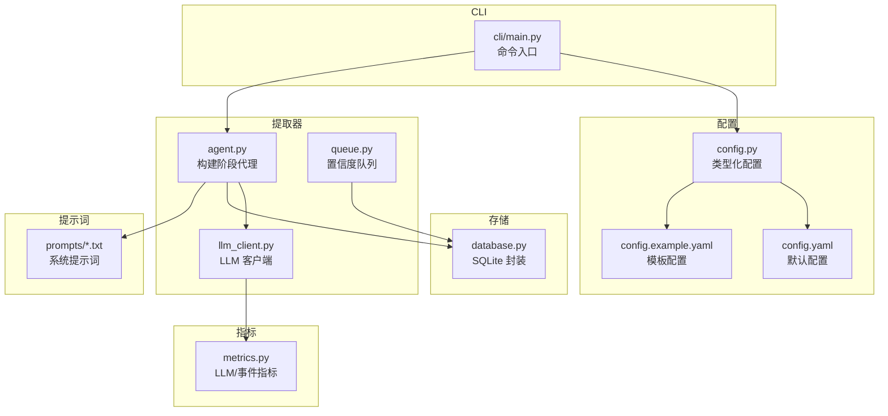
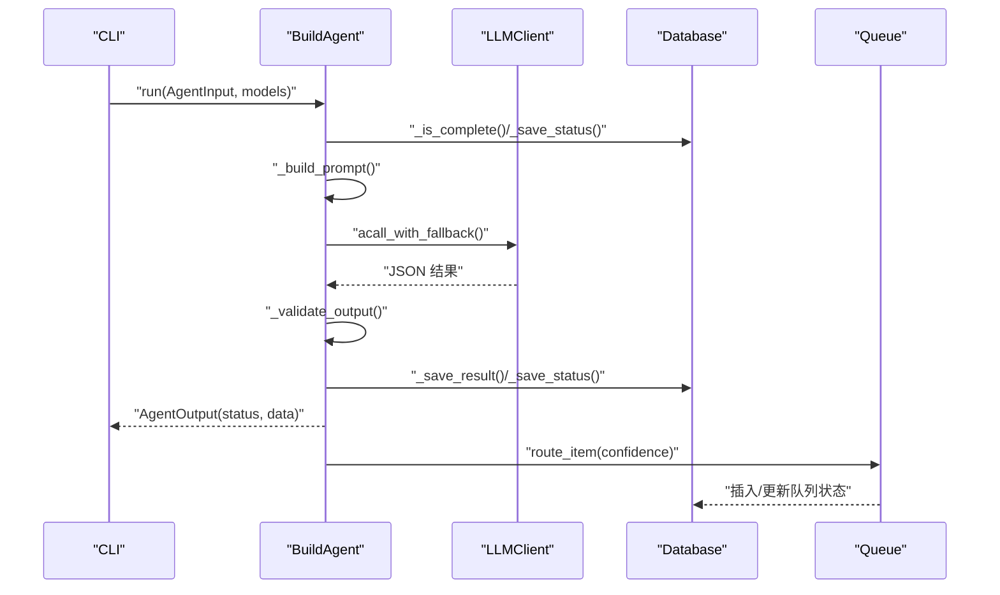
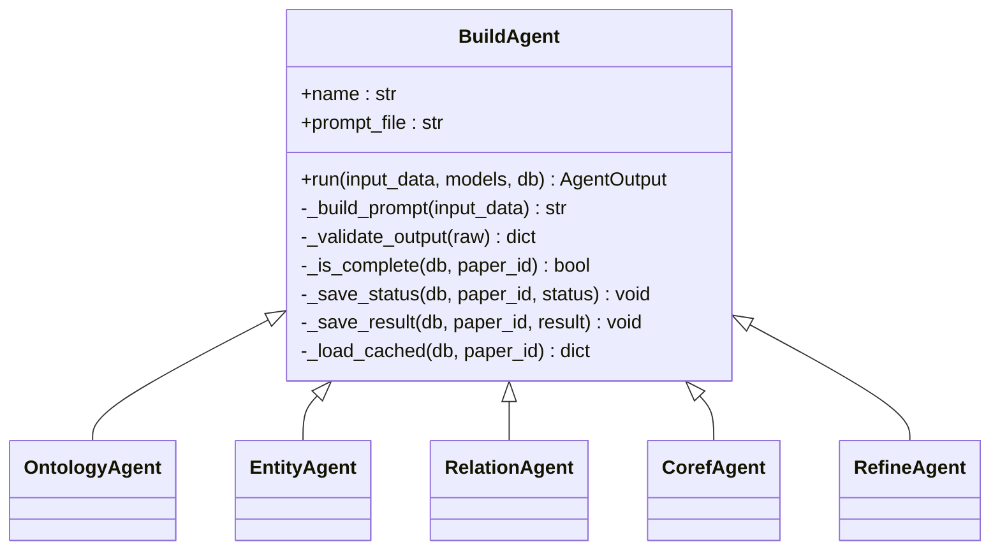
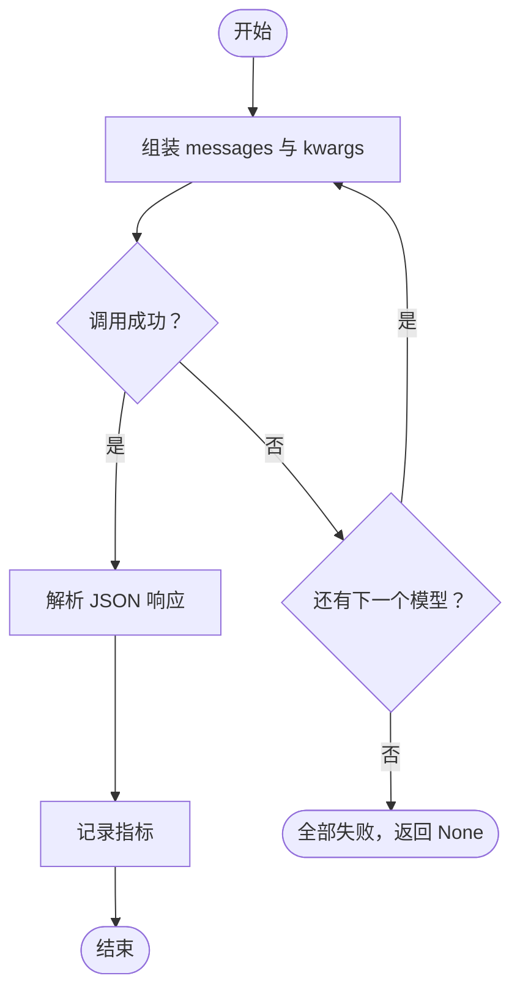
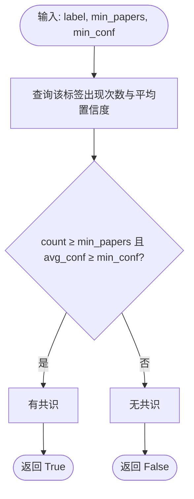
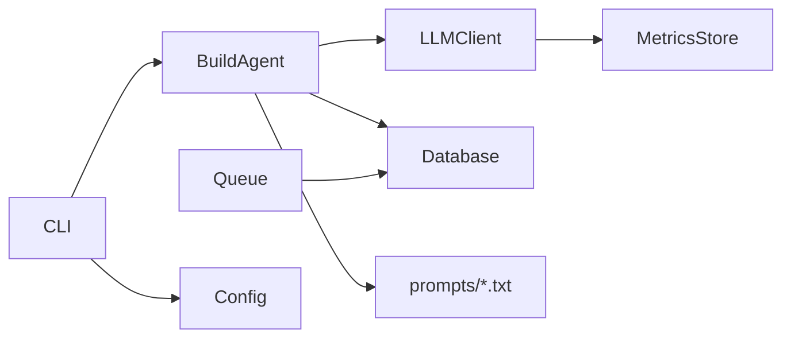

# LLM 代理系统

<cite>
**本文引用的文件**
- [agent.py](file://src/drbrain/extractor/agent.py)
- [llm_client.py](file://src/drbrain/extractor/llm_client.py)
- [queue.py](file://src/drbrain/extractor/queue.py)
- [config.py](file://src/drbrain/config.py)
- [config.yaml](file://config.yaml)
- [database.py](file://src/drbrain/storage/database.py)
- [metrics.py](file://src/drbrain/metrics.py)
- [main.py](file://src/drbrain/cli/main.py)
- [entities.txt](file://prompts/entities.txt)
- [test_agent.py](file://tests/test_agent.py)
- [test_llm_client.py](file://tests/test_llm_client.py)
- [test_extractor_queue.py](file://tests/test_extractor_queue.py)
- [config.example.yaml](file://config.example.yaml)
</cite>

## 目录
1. [简介](#简介)
2. [项目结构](#项目结构)
3. [核心组件](#核心组件)
4. [架构总览](#架构总览)
5. [详细组件分析](#详细组件分析)
6. [依赖关系分析](#依赖关系分析)
7. [性能考虑](#性能考虑)
8. [故障排除指南](#故障排除指南)
9. [结论](#结论)
10. [附录](#附录)

## 简介
本文件面向 DrBrain 的 LLM 代理系统，系统通过“构建阶段代理”（BuildAgent）实现论文内容的结构化抽取与知识图谱构建。每个代理负责一个特定的抽取阶段（本体、实体、关系、共指消解、精炼），以系统提示词驱动、结构化输入输出契约、幂等性与重试保障为核心设计原则。系统还包含基于置信度的任务队列、数据库持久化、指标采集与 CLI 命令入口，形成从数据到知识的完整流水线。

## 项目结构
- 提取器模块：包含代理、LLM 客户端、队列、缓存、规则挖掘等能力
- 存储模块：SQLite 数据库封装与模式管理
- 配置模块：类型化配置加载与环境变量解析
- 指标模块：SQLite 记录 LLM 使用与事件
- CLI 入口：命令式操作入口，统一加载配置与日志

**图表来源**
- [agent.py:1-368](file://src/drbrain/extractor/agent.py#L1-L368)
- [llm_client.py:1-154](file://src/drbrain/extractor/llm_client.py#L1-L154)
- [queue.py:1-106](file://src/drbrain/extractor/queue.py#L1-L106)
- [database.py:1-775](file://src/drbrain/storage/database.py#L1-L775)
- [config.py:1-292](file://src/drbrain/config.py#L1-L292)
- [config.yaml:1-72](file://config.yaml#L1-L72)
- [config.example.yaml:1-145](file://config.example.yaml#L1-L145)
- [metrics.py:1-203](file://src/drbrain/metrics.py#L1-L203)
- [main.py:1-150](file://src/drbrain/cli/main.py#L1-L150)
- [entities.txt:1-19](file://prompts/entities.txt#L1-L19)

**章节来源**
- [main.py:1-150](file://src/drbrain/cli/main.py#L1-L150)
- [config.py:1-292](file://src/drbrain/config.py#L1-L292)
- [config.yaml:1-72](file://config.yaml#L1-L72)

## 核心组件
- 构建阶段代理（BuildAgent）：抽象基类，定义阶段名称、系统提示词、输入输出契约、运行流程（幂等检查 → 组装提示 → LLM 调用 → 校验 → 持久化 → 返回）
- LLM 客户端：支持多模型回退链、JSON 响应解析、指标记录、异步/同步调用
- 置信度队列：按置信度路由抽取项，支持共识检测与批量处理
- 数据库：统一模式、迁移、增删改查、队列状态管理
- 配置系统：类型化配置、本地覆盖、环境变量解析
- 指标系统：LLM 调用统计、事件计时

**章节来源**
- [agent.py:53-196](file://src/drbrain/extractor/agent.py#L53-L196)
- [llm_client.py:12-114](file://src/drbrain/extractor/llm_client.py#L12-L114)
- [queue.py:10-106](file://src/drbrain/extractor/queue.py#L10-L106)
- [database.py:159-258](file://src/drbrain/storage/database.py#L159-L258)
- [config.py:44-244](file://src/drbrain/config.py#L44-L244)
- [metrics.py:49-181](file://src/drbrain/metrics.py#L49-L181)

## 架构总览
系统采用“阶段化代理 + 回退链 + 队列 + 数据库”的流水线架构。CLI 加载配置后，代理通过 LLM 客户端调用外部模型，返回结构化结果；根据置信度决定是否进入队列或直接入库；数据库保存中间状态与最终产物；指标系统记录使用情况。

**图表来源**
- [agent.py:73-135](file://src/drbrain/extractor/agent.py#L73-L135)
- [llm_client.py:92-114](file://src/drbrain/extractor/llm_client.py#L92-L114)
- [queue.py:10-31](file://src/drbrain/extractor/queue.py#L10-L31)
- [database.py:159-201](file://src/drbrain/storage/database.py#L159-L201)

## 详细组件分析

### 代理系统（BuildAgent 及子类）
- 设计要点
  - 幂等性：通过数据库状态表记录阶段完成情况，避免重复执行
  - 结构化 I/O：输入 AgentInput、输出 AgentOutput，字段明确
  - 系统提示词：从 prompts 目录加载，便于迭代与版本化
  - 子类职责：实现 _build_prompt 与 _validate_output，确保输出可验证
- 关键阶段
  - 本体（ontology）：校验类型集合与列表格式
  - 实体（entities）：校验标签、类型、置信度、段落与节点溯源
  - 关系（relations）：校验头尾实体与关系类型
  - 共指（coreference）：合并同义标签
  - 精炼（refine）：自检修正并生成前后对比快照
- 错误处理
  - LLM 失败时标记失败状态并返回失败输出
  - 校验失败抛出异常，保证数据质量

**图表来源**
- [agent.py:53-367](file://src/drbrain/extractor/agent.py#L53-L367)

**章节来源**
- [agent.py:53-367](file://src/drbrain/extractor/agent.py#L53-L367)
- [entities.txt:1-19](file://prompts/entities.txt#L1-L19)
- [test_agent.py:75-186](file://tests/test_agent.py#L75-L186)

### LLM 客户端与回退链
- 功能特性
  - 支持多模型回退链：按顺序尝试，首个成功 JSON 解析即返回
  - 异步/同步接口：acall_with_fallback 与 call_with_fallback
  - 指标记录：自动记录 token 输入/输出、耗时与模型信息
  - 参数控制：温度、最大 token、超时、系统/用户消息
- 集成方式
  - 通过 litellm 完成多提供商适配（OpenAI、Anthropic、Ollama 等）
  - 支持自定义 base_url 与 api_key
- 成本控制
  - 通过指标系统统计 token 使用，结合 max_tokens 控制单次调用上限

**图表来源**
- [llm_client.py:66-114](file://src/drbrain/extractor/llm_client.py#L66-L114)
- [metrics.py:74-96](file://src/drbrain/metrics.py#L74-L96)

**章节来源**
- [llm_client.py:12-154](file://src/drbrain/extractor/llm_client.py#L12-L154)
- [metrics.py:49-181](file://src/drbrain/metrics.py#L49-L181)
- [test_llm_client.py:6-66](file://tests/test_llm_client.py#L6-L66)

### 任务队列与置信度管理
- 路由策略
  - 置信度 ≥ auto_accept → 直接接受
  - 置信度 ≥ weak_threshold → 标记弱项
  - 否则 → 入队等待人工复核
- 共识检测
  - 对同一标签在多篇论文中出现且平均置信度达标，触发自动接受
- 批量处理
  - 支持按类型与最高置信度过滤，批量接受或拒绝

**图表来源**
- [queue.py:34-46](file://src/drbrain/extractor/queue.py#L34-L46)

**章节来源**
- [queue.py:10-106](file://src/drbrain/extractor/queue.py#L10-L106)
- [test_extractor_queue.py:44-71](file://tests/test_extractor_queue.py#L44-L71)

### 数据持久化与模式管理
- 表结构概览
  - papers、paper_ids：论文元数据与外部 ID 映射
  - concepts、arguments、edges：抽取概念、论点与关系
  - aliases：别名映射
  - embeddings、tree_vectors、tree_summaries：向量化与树摘要
  - confidence_queue：置信度队列
  - build_stages：构建阶段状态与结果缓存
- 迁移机制
  - 版本化迁移，逐步添加缺失列（如 node_id、edge_provenance 等）

**章节来源**
- [database.py:10-156](file://src/drbrain/storage/database.py#L10-L156)
- [database.py:175-246](file://src/drbrain/storage/database.py#L175-L246)

### 配置系统与使用示例
- 类型化配置
  - LLMConfig、ApiConfig、DirsConfig、DBConfig、ExtractConfig、QueueConfig、FetchConfig、EmbedConfig、BackupConfig
  - 支持本地覆盖与环境变量解析（${ENV_VAR}）
- 默认配置
  - config.yaml 提供基础值，config.example.yaml 提供模板与注释
- 使用示例路径
  - CLI 加载配置：[main.py:84-88](file://src/drbrain/cli/main.py#L84-L88)
  - LLM 模型配置：[config.yaml:7-13](file://config.yaml#L7-L13)、[config.example.yaml:12-66](file://config.example.yaml#L12-L66)
  - 抽取并发与队列阈值：[config.yaml:45-51](file://config.yaml#L45-L51)

**章节来源**
- [config.py:44-244](file://src/drbrain/config.py#L44-L244)
- [config.yaml:1-72](file://config.yaml#L1-L72)
- [config.example.yaml:1-145](file://config.example.yaml#L1-L145)
- [main.py:80-92](file://src/drbrain/cli/main.py#L80-L92)

## 依赖关系分析
- 组件耦合
  - BuildAgent 依赖 LLMClient（异步调用）、Database（状态与结果持久化）、提示词文件
  - LLMClient 依赖 litellm 与指标系统
  - Queue 依赖 Database 的队列表与概念表
  - CLI 依赖配置系统与日志初始化
- 外部依赖
  - litellm：多提供商统一接口
  - SQLite：本地持久化
  - loguru：日志
  - numpy：向量序列化（数据库层）

**图表来源**
- [agent.py:83-109](file://src/drbrain/extractor/agent.py#L83-L109)
- [llm_client.py:46-80](file://src/drbrain/extractor/llm_client.py#L46-L80)
- [queue.py:10-31](file://src/drbrain/extractor/queue.py#L10-L31)
- [main.py:84-88](file://src/drbrain/cli/main.py#L84-L88)

**章节来源**
- [agent.py:1-368](file://src/drbrain/extractor/agent.py#L1-L368)
- [llm_client.py:1-154](file://src/drbrain/extractor/llm_client.py#L1-L154)
- [queue.py:1-106](file://src/drbrain/extractor/queue.py#L1-L106)
- [database.py:1-775](file://src/drbrain/storage/database.py#L1-L775)
- [metrics.py:1-203](file://src/drbrain/metrics.py#L1-L203)
- [main.py:1-150](file://src/drbrain/cli/main.py#L1-L150)

## 性能考虑
- 并发控制
  - 抽取阶段并发数由配置控制（extract.max_concurrent），避免 LLM 限流与资源争用
- 超时与回退
  - 单次调用超时与多模型回退链提升稳定性
- 指标监控
  - 通过指标系统统计 token 使用与耗时，辅助成本控制与性能优化
- 数据库写入
  - WAL 模式与批处理（insert_many）减少锁竞争
- 缓存与幂等
  - build_stages 缓存已完成阶段结果，避免重复计算

[本节为通用指导，无需具体文件引用]

## 故障排除指南
- LLM 调用失败
  - 现象：acall_with_fallback 返回 None
  - 排查：检查模型配置、API 密钥、base_url、网络连通性
  - 参考：[llm_client.py:92-114](file://src/drbrain/extractor/llm_client.py#L92-L114)、[test_llm_client.py:54-66](file://tests/test_llm_client.py#L54-L66)
- 输出校验失败
  - 现象：代理抛出异常或返回失败状态
  - 排查：确认提示词格式、系统提示词正确性、输出 JSON 结构
  - 参考：[agent.py:139-147](file://src/drbrain/extractor/agent.py#L139-L147)、[test_agent.py:93-158](file://tests/test_agent.py#L93-L158)
- 队列未生效
  - 现象：低置信度项未入队或无法自动接受
  - 排查：确认队列阈值、共识检测参数、数据库状态更新
  - 参考：[queue.py:10-46](file://src/drbrain/extractor/queue.py#L10-L46)、[test_extractor_queue.py:44-71](file://tests/test_extractor_queue.py#L44-L71)
- 数据库迁移问题
  - 现象：缺少列或索引导致查询异常
  - 排查：查看迁移日志与版本号，确认 schema_versions
  - 参考：[database.py:175-246](file://src/drbrain/storage/database.py#L175-L246)

**章节来源**
- [llm_client.py:92-114](file://src/drbrain/extractor/llm_client.py#L92-L114)
- [test_llm_client.py:54-66](file://tests/test_llm_client.py#L54-L66)
- [agent.py:139-147](file://src/drbrain/extractor/agent.py#L139-L147)
- [test_agent.py:93-158](file://tests/test_agent.py#L93-L158)
- [queue.py:10-46](file://src/drbrain/extractor/queue.py#L10-L46)
- [test_extractor_queue.py:44-71](file://tests/test_extractor_queue.py#L44-L71)
- [database.py:175-246](file://src/drbrain/storage/database.py#L175-L246)

## 结论
DrBrain 的 LLM 代理系统通过阶段化代理、回退链、置信度队列与数据库持久化，实现了稳定、可观测、可扩展的知识抽取流水线。配置系统与 CLI 降低了使用门槛；指标系统提供了成本与性能洞察。建议在生产环境中合理设置并发与阈值、启用多模型回退链，并结合指标持续优化模型选择与提示词。

[本节为总结，无需具体文件引用]

## 附录

### 代码示例路径（配置与使用）
- 配置 LLM 模型与密钥
  - [config.yaml:7-13](file://config.yaml#L7-L13)
  - [config.example.yaml:12-66](file://config.example.yaml#L12-L66)
- 设置抽取并发与队列阈值
  - [config.yaml:45-51](file://config.yaml#L45-L51)
- 在代理中使用模型回退链
  - [agent.py:106-110](file://src/drbrain/extractor/agent.py#L106-L110)
- 异步调用 LLM
  - [llm_client.py:92-114](file://src/drbrain/extractor/llm_client.py#L92-L114)
- 路由与批量处理队列
  - [queue.py:10-31](file://src/drbrain/extractor/queue.py#L10-L31)
  - [queue.py:77-106](file://src/drbrain/extractor/queue.py#L77-L106)
- CLI 加载配置与执行命令
  - [main.py:80-92](file://src/drbrain/cli/main.py#L80-L92)

**章节来源**
- [config.yaml:1-72](file://config.yaml#L1-L72)
- [config.example.yaml:1-145](file://config.example.yaml#L1-L145)
- [agent.py:73-135](file://src/drbrain/extractor/agent.py#L73-L135)
- [llm_client.py:92-114](file://src/drbrain/extractor/llm_client.py#L92-L114)
- [queue.py:10-106](file://src/drbrain/extractor/queue.py#L10-L106)
- [main.py:80-92](file://src/drbrain/cli/main.py#L80-L92)