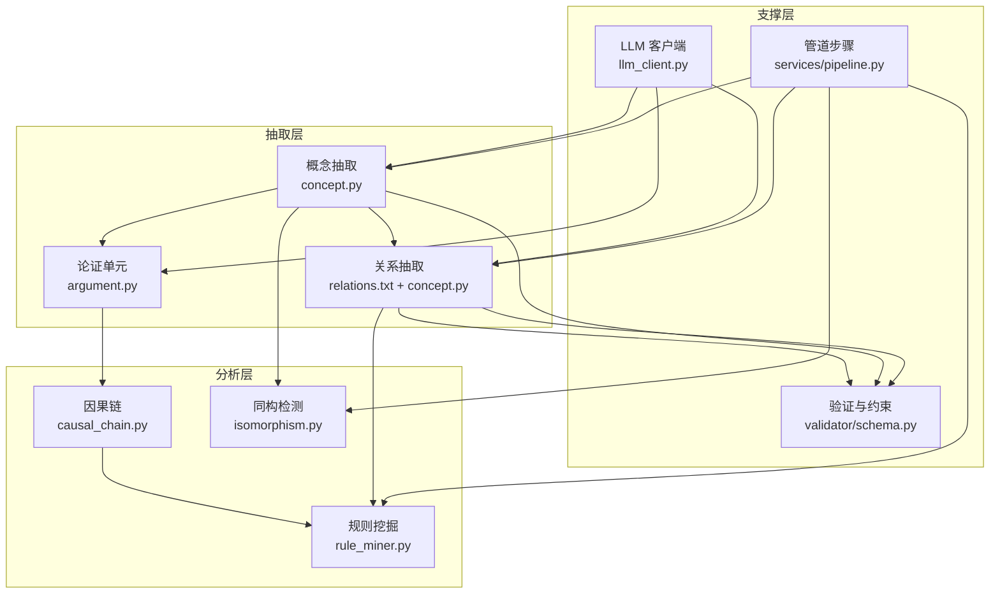
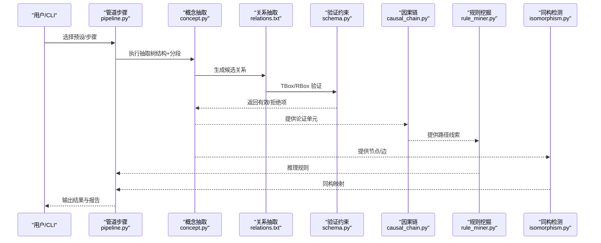
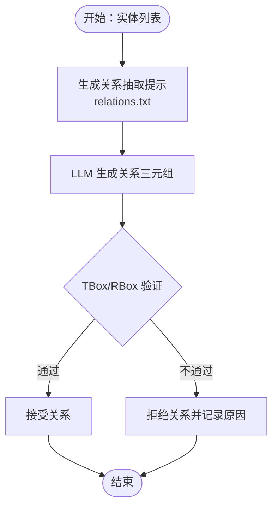
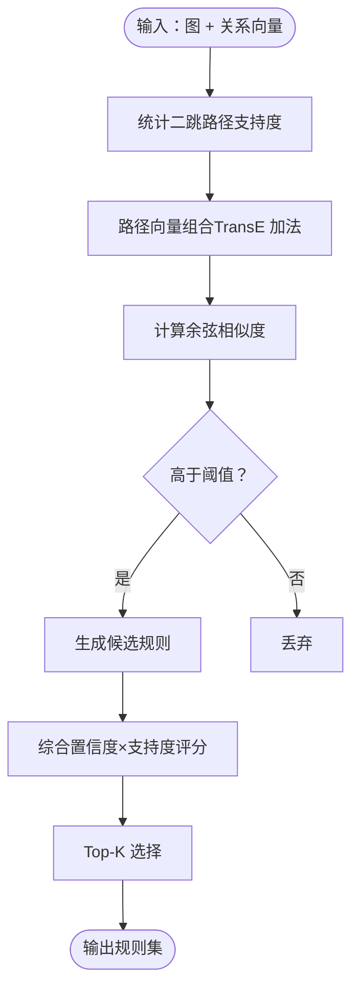
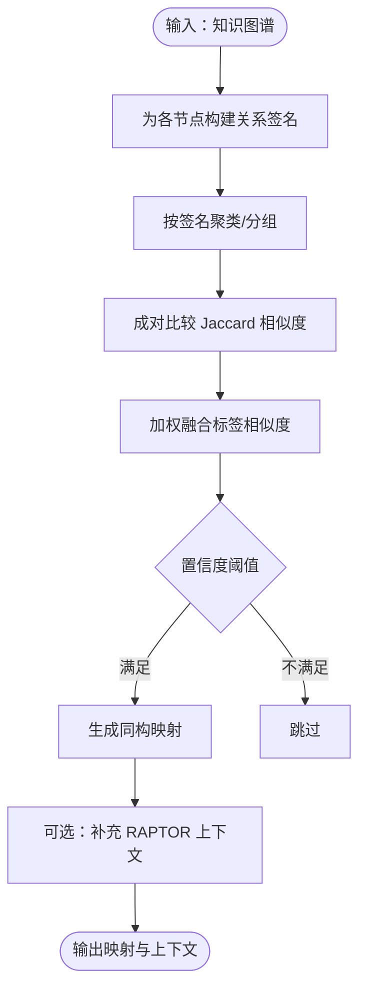
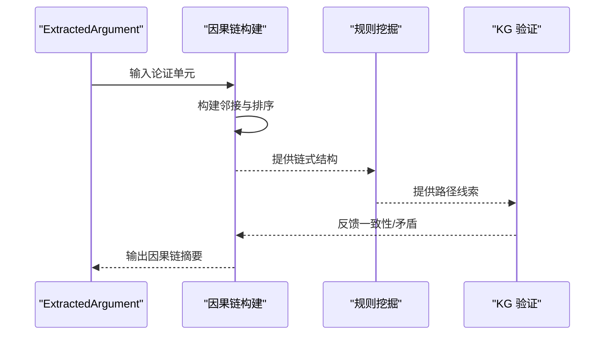
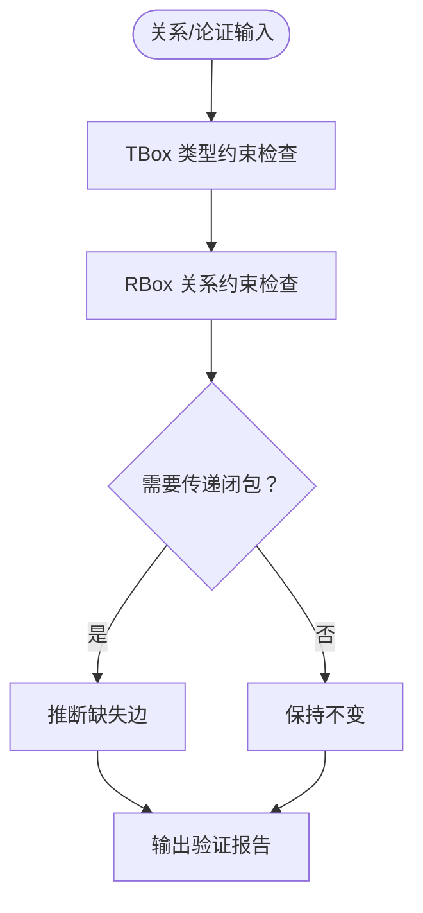
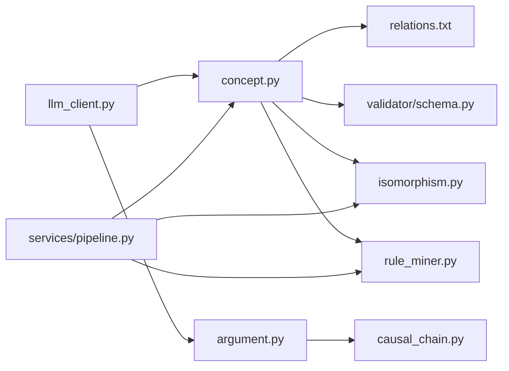

# 关系抽取模块

<cite>
**本文引用的文件**
- [src/drbrain/extractor/concept.py](file://src/drbrain/extractor/concept.py)
- [src/drbrain/extractor/argument.py](file://src/drbrain/extractor/argument.py)
- [src/drbrain/extractor/causal_chain.py](file://src/drbrain/extractor/causal_chain.py)
- [src/drbrain/extractor/rule_miner.py](file://src/drbrain/extractor/rule_miner.py)
- [src/drbrain/extractor/isomorphism.py](file://src/drbrain/extractor/isomorphism.py)
- [src/drbrain/extractor/llm_client.py](file://src/drbrain/extractor/llm_client.py)
- [src/drbrain/validator/schema.py](file://src/drbrain/validator/schema.py)
- [src/drbrain/services/pipeline.py](file://src/drbrain/services/pipeline.py)
- [prompts/relations.txt](file://prompts/relations.txt)
</cite>

## 目录
1. [引言](#引言)
2. [项目结构](#项目结构)
3. [核心组件](#核心组件)
4. [架构总览](#架构总览)
5. [详细组件分析](#详细组件分析)
6. [依赖分析](#依赖分析)
7. [性能考虑](#性能考虑)
8. [故障排查指南](#故障排查指南)
9. [结论](#结论)
10. [附录：使用示例与最佳实践](#附录使用示例与最佳实践)

## 引言
本技术文档聚焦 DrBrain 的关系抽取模块，系统阐述关系类型定义、识别算法与推理机制；规则挖掘（频繁模式与关联规则）方法；以及同构检测在跨域结构相似性分析与关系映射中的应用。文档还说明关系抽取与因果链分析的集成方式与数据流，并总结关系验证与质量控制的最佳实践。目标是帮助读者从概念到实现全面理解模块设计与使用。

## 项目结构
关系抽取模块位于 src/drbrain/extractor 下，围绕“概念抽取—关系抽取—论证与因果链—规则挖掘—同构检测—验证与闭环”的流水线组织。关键文件职责如下：
- 概念与关系抽取：concept.py、argument.py、prompts/relations.txt
- 因果链分析：causal_chain.py
- 规则挖掘：rule_miner.py
- 同构检测：isomorphism.py
- LLM 客户端与提示词：llm_client.py、prompts/*.txt
- 验证与约束：validator/schema.py
- 管道与步骤：services/pipeline.py

图表来源
- [src/drbrain/extractor/concept.py](file://src/drbrain/extractor/concept.py)
- [src/drbrain/extractor/argument.py](file://src/drbrain/extractor/argument.py)
- [src/drbrain/extractor/causal_chain.py](file://src/drbrain/extractor/causal_chain.py)
- [src/drbrain/extractor/rule_miner.py](file://src/drbrain/extractor/rule_miner.py)
- [src/drbrain/extractor/isomorphism.py](file://src/drbrain/extractor/isomorphism.py)
- [src/drbrain/extractor/llm_client.py](file://src/drbrain/extractor/llm_client.py)
- [src/drbrain/validator/schema.py](file://src/drbrain/validator/schema.py)
- [src/drbrain/services/pipeline.py](file://src/drbrain/services/pipeline.py)

章节来源
- [src/drbrain/extractor/concept.py](file://src/drbrain/extractor/concept.py)
- [src/drbrain/extractor/argument.py](file://src/drbrain/extractor/argument.py)
- [src/drbrain/extractor/causal_chain.py](file://src/drbrain/extractor/causal_chain.py)
- [src/drbrain/extractor/rule_miner.py](file://src/drbrain/extractor/rule_miner.py)
- [src/drbrain/extractor/isomorphism.py](file://src/drbrain/extractor/isomorphism.py)
- [src/drbrain/extractor/llm_client.py](file://src/drbrain/extractor/llm_client.py)
- [src/drbrain/validator/schema.py](file://src/drbrain/validator/schema.py)
- [src/drbrain/services/pipeline.py](file://src/drbrain/services/pipeline.py)

## 核心组件
- 概念与关系抽取：基于树结构的分段抽取、实体与关系的分阶段提取、跨段论证链接与迭代精炼。
- 论证与因果链：从带机制的论证单元构建因果链，支持按目标概念检索与最短路径查找。
- 规则挖掘：基于 TransE 向量加法的路径组合置信度与图遍历的频繁路径挖掘，生成候选规则。
- 同构检测：以入/出关系签名的 Jaccard 相似度进行跨域结构相似性匹配与映射。
- 验证与约束：TBox 类型约束与 RBox 关系约束（含传递闭包补全与反身性/反对称性检查）。
- LLM 客户端：统一的异步/同步调用与回退链路，支持令牌统计与错误处理。
- 管道步骤：定义“全量/快速/仅嵌入”等预设流程，串联抽取、嵌入与规则闭包。

章节来源
- [src/drbrain/extractor/concept.py](file://src/drbrain/extractor/concept.py)
- [src/drbrain/extractor/argument.py](file://src/drbrain/extractor/argument.py)
- [src/drbrain/extractor/causal_chain.py](file://src/drbrain/extractor/causal_chain.py)
- [src/drbrain/extractor/rule_miner.py](file://src/drbrain/extractor/rule_miner.py)
- [src/drbrain/extractor/isomorphism.py](file://src/drbrain/extractor/isomorphism.py)
- [src/drbrain/validator/schema.py](file://src/drbrain/validator/schema.py)
- [src/drbrain/extractor/llm_client.py](file://src/drbrain/extractor/llm_client.py)
- [src/drbrain/services/pipeline.py](file://src/drbrain/services/pipeline.py)

## 架构总览
关系抽取模块采用“提示工程 + LLM 抽取 + 结构化验证 + 图算法增强”的混合范式。数据流从文档树结构出发，经由概念与关系抽取，进入知识图谱；随后通过规则挖掘与同构检测扩展语义覆盖，再由因果链分析与 KG 验证形成闭环。

图表来源
- [src/drbrain/services/pipeline.py](file://src/drbrain/services/pipeline.py)
- [src/drbrain/extractor/concept.py](file://src/drbrain/extractor/concept.py)
- [prompts/relations.txt](file://prompts/relations.txt)
- [src/drbrain/validator/schema.py](file://src/drbrain/validator/schema.py)
- [src/drbrain/extractor/causal_chain.py](file://src/drbrain/extractor/causal_chain.py)
- [src/drbrain/extractor/rule_miner.py](file://src/drbrain/extractor/rule_miner.py)
- [src/drbrain/extractor/isomorphism.py](file://src/drbrain/extractor/isomorphism.py)

## 详细组件分析

### 关系类型定义与识别
- 类型体系与允许关系
  - TBox 允许关系集合定义于验证模块中，按概念类型（问题、方法、结论、争议、缺口、人物）限定可使用的学术关系。
  - 关系抽取提示词明确列出每类概念可使用的具体关系集合，确保抽取输出严格受限于领域规范。
- 识别流程
  - 实体抽取后，基于概念列表生成关系抽取提示，LLM 输出关系三元组（头-关系-尾），并附置信度。
  - 验证阶段对每个关系执行 TBox 与 RBox 检查，拒绝不合法或违反约束的关系。
- 自定义关系类型与规则
  - 可通过扩展 TBox/RBox 与提示词模板实现新关系类型；需同步更新验证逻辑与规则挖掘策略。

图表来源
- [src/drbrain/validator/schema.py](file://src/drbrain/validator/schema.py)
- [prompts/relations.txt](file://prompts/relations.txt)

章节来源
- [src/drbrain/validator/schema.py](file://src/drbrain/validator/schema.py)
- [prompts/relations.txt](file://prompts/relations.txt)

### 规则挖掘算法（频繁模式与关联规则）
- 路径组合规则
  - 基于 TransE 向量加法（路径向量相加）与余弦相似度衡量组合强度，筛选高置信度路径规则。
  - 支持对图中二跳路径出现频次进行计数，作为支持度指标，结合置信度排序返回候选规则。
- 图遍历规则
  - 从节点出发进行广度优先遍历，收集关系序列的出现频率；支持并行边模式（同一源/目标多关系）的有序对计数。
  - 可选地将路径组合向量映射到最近的关系向量，确定规则头部。
- 参数与阈值
  - 最小置信度、最小支持度、返回条目上限等参数可调，平衡召回与质量。

图表来源
- [src/drbrain/extractor/rule_miner.py](file://src/drbrain/extractor/rule_miner.py)

章节来源
- [src/drbrain/extractor/rule_miner.py](file://src/drbrain/extractor/rule_miner.py)

### 同构检测与关系映射
- 关系签名
  - 对每个节点，统计其作为目标的入边关系分布（入关系签名）与作为起点的出边关系分布（出关系签名），可选加入章节信息增强语义。
- 相似性度量
  - 使用 Jaccard 相似度比较两节点签名集合；结合标签相似度得到综合置信度。
- 映射与上下文增强
  - 发现跨域结构相似节点对后，可查询 RAPTOR 摘要获取跨节上下文，辅助知识迁移与解释。

图表来源
- [src/drbrain/extractor/isomorphism.py](file://src/drbrain/extractor/isomorphism.py)

章节来源
- [src/drbrain/extractor/isomorphism.py](file://src/drbrain/extractor/isomorphism.py)

### 因果链分析与数据流
- 论证单元
  - ExtractedArgument 表示带机制的论证单元，包含主张、主张类型、目标、证据类型、机制、章节与置信度。
- 因果链构建
  - 依据机制字段与目标概念建立邻接关系，通过 DFS/BFS 寻找最大因果链；可按章节顺序进行排序以提升可读性。
  - 支持从特定概念出发的链检索与最短路径查找。
- 与抽取的集成
  - 概念抽取完成后，论证单元进入因果链分析；随后可作为规则挖掘的输入线索，或用于下游解释与报告。

图表来源
- [src/drbrain/extractor/argument.py](file://src/drbrain/extractor/argument.py)
- [src/drbrain/extractor/causal_chain.py](file://src/drbrain/extractor/causal_chain.py)

章节来源
- [src/drbrain/extractor/argument.py](file://src/drbrain/extractor/argument.py)
- [src/drbrain/extractor/causal_chain.py](file://src/drbrain/extractor/causal_chain.py)

### 验证与质量控制
- TBox/RBox 约束
  - TBox：按概念类型限制可用关系；RBox：传递性、反对称性、反身性等全局约束。
  - 提供传递闭包补全与反对称性违规检测，辅助 KG 一致性维护。
- 抽取验证
  - 对关系抽取结果执行批量验证，区分有效/拒绝项，便于后续清洗与修复。
- LLM 质量保障
  - 统一的回退链路与令牌统计，确保在多模型失败时仍能产出稳定结果。

图表来源
- [src/drbrain/validator/schema.py](file://src/drbrain/validator/schema.py)

章节来源
- [src/drbrain/validator/schema.py](file://src/drbrain/validator/schema.py)

## 依赖分析
- 组件耦合
  - 概念与关系抽取强依赖 LLM 客户端与提示词模板；因果链依赖论证单元；规则挖掘依赖图结构与关系向量；同构检测依赖图结构与可选 RAPTOR 上下文。
- 外部依赖
  - LLM 调用通过统一客户端封装；验证模块提供 TBox/RBox 与传递闭包工具；管道模块提供步骤编排与预设。

图表来源
- [src/drbrain/extractor/llm_client.py](file://src/drbrain/extractor/llm_client.py)
- [src/drbrain/extractor/concept.py](file://src/drbrain/extractor/concept.py)
- [src/drbrain/extractor/argument.py](file://src/drbrain/extractor/argument.py)
- [prompts/relations.txt](file://prompts/relations.txt)
- [src/drbrain/validator/schema.py](file://src/drbrain/validator/schema.py)
- [src/drbrain/extractor/causal_chain.py](file://src/drbrain/extractor/causal_chain.py)
- [src/drbrain/extractor/isomorphism.py](file://src/drbrain/extractor/isomorphism.py)
- [src/drbrain/extractor/rule_miner.py](file://src/drbrain/extractor/rule_miner.py)
- [src/drbrain/services/pipeline.py](file://src/drbrain/services/pipeline.py)

章节来源
- [src/drbrain/extractor/llm_client.py](file://src/drbrain/extractor/llm_client.py)
- [src/drbrain/extractor/concept.py](file://src/drbrain/extractor/concept.py)
- [src/drbrain/extractor/argument.py](file://src/drbrain/extractor/argument.py)
- [prompts/relations.txt](file://prompts/relations.txt)
- [src/drbrain/validator/schema.py](file://src/drbrain/validator/schema.py)
- [src/drbrain/extractor/causal_chain.py](file://src/drbrain/extractor/causal_chain.py)
- [src/drbrain/extractor/isomorphism.py](file://src/drbrain/extractor/isomorphism.py)
- [src/drbrain/extractor/rule_miner.py](file://src/drbrain/extractor/rule_miner.py)
- [src/drbrain/services/pipeline.py](file://src/drbrain/services/pipeline.py)

## 性能考虑
- 并发与限流
  - 概念抽取采用信号量限制并发，避免 LLM 速率限制与资源争用。
- 索引与缓存
  - 规则挖掘中的路径计数与向量相似度计算可结合索引优化；同构检测的签名构建与聚类应避免重复计算。
- 步骤裁剪
  - 管道提供“快速/仅嵌入”等预设，减少不必要的计算开销。

## 故障排查指南
- LLM 调用失败
  - 检查模型配置与回退链路是否生效；查看日志中“失败尝试”记录定位问题。
- 抽取结果异常
  - 核对提示词模板与 TBox/RBox 约束；逐条验证被拒绝的关系，修正上游抽取或约束。
- 规则挖掘无结果
  - 调整最小置信度/支持度阈值；确认关系向量加载与图结构完整性。
- 同构检测无映射
  - 降低相似度阈值或放宽标签相似度权重；检查是否存在跨域结构差异过大。

章节来源
- [src/drbrain/extractor/llm_client.py](file://src/drbrain/extractor/llm_client.py)
- [src/drbrain/validator/schema.py](file://src/drbrain/validator/schema.py)
- [src/drbrain/extractor/rule_miner.py](file://src/drbrain/extractor/rule_miner.py)
- [src/drbrain/extractor/isomorphism.py](file://src/drbrain/extractor/isomorphism.py)

## 结论
关系抽取模块通过“提示工程 + LLM 抽取 + 结构化验证 + 图算法增强”的方式，实现了从学术论文到知识图谱的高质量关系抽取与推理。规则挖掘与同构检测进一步扩展了语义覆盖，因果链分析提供了可解释的链式证据。配合严格的 TBox/RBox 约束与回退链路，模块在准确性与鲁棒性之间取得良好平衡。

## 附录：使用示例与最佳实践
- 定义自定义关系类型
  - 在验证模块中扩展 TBox/RBox 约束；在关系抽取提示词中添加允许关系；必要时扩展规则挖掘策略以支持新的路径组合。
  - 示例参考路径：[关系类型定义](file://src/drbrain/validator/schema.py)，[关系抽取提示词](file://prompts/relations.txt)
- 配置抽取规则
  - 调整规则挖掘参数（最小置信度、支持度、Top-K）以适配数据规模与质量；结合图遍历与向量组合两种策略。
  - 示例参考路径：[规则挖掘实现](file://src/drbrain/extractor/rule_miner.py)
- 同构检测应用
  - 使用关系签名与 Jaccard 相似度发现跨域结构相似性；结合 RAPTOR 上下文提升解释性。
  - 示例参考路径：[同构检测实现](file://src/drbrain/extractor/isomorphism.py)
- 关系验证与质量控制
  - 在抽取后执行 TBox/RBox 验证与传递闭包补全；对拒绝项进行人工复核与提示词迭代。
  - 示例参考路径：[验证与约束](file://src/drbrain/validator/schema.py)
- 管道集成与数据流
  - 使用管道预设快速运行“构建→嵌入→闭包”流程；根据需求裁剪步骤以优化性能。
  - 示例参考路径：[管道步骤](file://src/drbrain/services/pipeline.py)