# 实体抽取模块

<cite>
**本文档引用的文件**
- [concept.py](file://src/drbrain/extractor/concept.py)
- [detection.py](file://src/drbrain/extractor/detection.py)
- [llm_client.py](file://src/drbrain/extractor/llm_client.py)
- [argument.py](file://src/drbrain/extractor/argument.py)
- [canonical.py](file://src/drbrain/extractor/canonical.py)
- [confidence_propagation.py](file://src/drbrain/extractor/confidence_propagation.py)
- [schema.py](file://src/drbrain/validator/schema.py)
- [pageindex_parser.py](file://src/drbrain/parser/pageindex_parser.py)
- [entities.txt](file://prompts/entities.txt)
- [relations.txt](file://prompts/relations.txt)
- [coreference.txt](file://prompts/coreference.txt)
- [config.py](file://src/drbrain/config.py)
- [test_concept.py](file://tests/test_concept.py)
</cite>

## 目录
1. [简介](#简介)
2. [项目结构](#项目结构)
3. [核心组件](#核心组件)
4. [架构总览](#架构总览)
5. [详细组件分析](#详细组件分析)
6. [依赖关系分析](#依赖关系分析)
7. [性能考量](#性能考量)
8. [故障排查指南](#故障排查指南)
9. [结论](#结论)
10. [附录](#附录)

## 简介
本文件系统性阐述 DrBrain 实体抽取模块的设计与实现，重点覆盖学术论文中概念实体的识别、分类与标准化流程。模块采用“树结构引导 + 多阶段抽取”的方法，结合启发式规则、词典匹配与大模型（LLM）辅助识别，形成从段落到全文的概念抽取流水线。同时，模块提供置信度传播、跨节论证链接、同义词合并与别名表对齐等能力，确保抽取结果在知识图谱构建中的质量与一致性。

## 项目结构
实体抽取模块位于 src/drbrain/extractor 目录下，围绕以下关键文件组织：
- 概念抽取与合并：concept.py
- 论文类型检测：detection.py
- LLM 客户端与回退链：llm_client.py
- 参数单元（论点）解析与校验：argument.py
- 实体标准化与别名对齐：canonical.py
- 置信度传播：confidence_propagation.py
- 校验模式（TBox/RBox）：validator/schema.py
- 文档树解析（PageIndex 风格）：parser/pageindex_parser.py
- 提示模板：prompts/entities.txt、prompts/relations.txt、prompts/coreference.txt
- 配置：config.py
- 测试：tests/test_concept.py

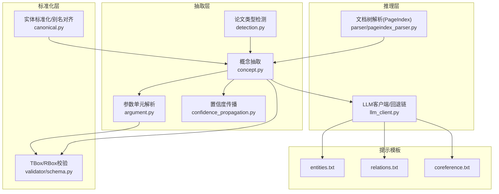

图表来源
- [concept.py:1-901](file://src/drbrain/extractor/concept.py#L1-L901)
- [detection.py:1-138](file://src/drbrain/extractor/detection.py#L1-L138)
- [llm_client.py:1-154](file://src/drbrain/extractor/llm_client.py#L1-L154)
- [argument.py:1-87](file://src/drbrain/extractor/argument.py#L1-L87)
- [canonical.py:1-252](file://src/drbrain/extractor/canonical.py#L1-L252)
- [schema.py:1-211](file://src/drbrain/validator/schema.py#L1-L211)
- [pageindex_parser.py:1-1033](file://src/drbrain/parser/pageindex_parser.py#L1-L1033)
- [entities.txt:1-19](file://prompts/entities.txt#L1-L19)
- [relations.txt:1-24](file://prompts/relations.txt#L1-L24)
- [coreference.txt:1-14](file://prompts/coreference.txt#L1-L14)

章节来源
- [concept.py:1-901](file://src/drbrain/extractor/concept.py#L1-L901)
- [detection.py:1-138](file://src/drbrain/extractor/detection.py#L1-L138)
- [llm_client.py:1-154](file://src/drbrain/extractor/llm_client.py#L1-L154)
- [argument.py:1-87](file://src/drbrain/extractor/argument.py#L1-L87)
- [canonical.py:1-252](file://src/drbrain/extractor/canonical.py#L1-L252)
- [schema.py:1-211](file://src/drbrain/validator/schema.py#L1-L211)
- [pageindex_parser.py:1-1033](file://src/drbrain/parser/pageindex_parser.py#L1-L1033)
- [entities.txt:1-19](file://prompts/entities.txt#L1-L19)
- [relations.txt:1-24](file://prompts/relations.txt#L1-L24)
- [coreference.txt:1-14](file://prompts/coreference.txt#L1-L14)

## 核心组件
- 概念抽取与合并：支持按段落与树结构抽取，多阶段合并去重，保留最高置信度；提供跨节论证链接日志。
- 论文类型检测：基于关键词启发式快速分类，必要时使用 LLM 进行二次判定。
- LLM 客户端：统一的异步/同步调用接口，支持多模型回退链与用量统计。
- 参数单元解析：将 LLM 输出的论点结构化为可校验的数据对象。
- 实体标准化：别名表、停用词过滤、BM25 模糊对齐与 LLM 批仲裁。
- 置信度传播：按路径长度与章节类型衰减，支持多路径概率合成。
- 校验模式：TBox 类型约束与 RBox 关系约束，支持转译闭包推断与反身性/反对称性检查。
- 文档树解析：PageIndex 风格的树结构抽取与修复，支持摘要生成与深度控制。

章节来源
- [concept.py:54-341](file://src/drbrain/extractor/concept.py#L54-L341)
- [detection.py:110-138](file://src/drbrain/extractor/detection.py#L110-L138)
- [llm_client.py:66-114](file://src/drbrain/extractor/llm_client.py#L66-L114)
- [argument.py:41-87](file://src/drbrain/extractor/argument.py#L41-L87)
- [canonical.py:73-252](file://src/drbrain/extractor/canonical.py#L73-L252)
- [confidence_propagation.py:31-87](file://src/drbrain/extractor/confidence_propagation.py#L31-L87)
- [schema.py:7-211](file://src/drbrain/validator/schema.py#L7-L211)
- [pageindex_parser.py:412-486](file://src/drbrain/parser/pageindex_parser.py#L412-L486)

## 架构总览
实体抽取采用“树驱动 + 多阶段 LLM 推理”的流水线：
1. 文档树解析：从 Markdown/PDF 生成带节点 ID 的层次结构，必要时进行摘要与描述生成。
2. 概念抽取：按叶子节点并发抽取，结合章节类型提示与树位置权重提升置信度。
3. 关系抽取：基于已抽取概念列表，限制关系类型并附加来源证明。
4. 共指消解：合并语义相同但表述不同的标签，保留权威标签。
5. 标准化与校验：别名对齐、TBox/RBox 校验、置信度传播与多路径合成。
6. 可选精炼：迭代优化抽取结果。

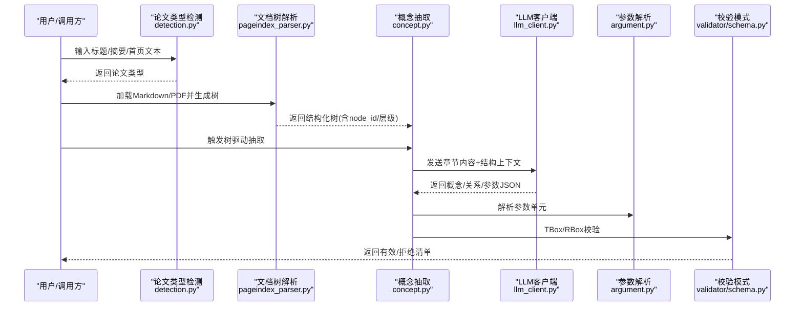

图表来源
- [detection.py:110-138](file://src/drbrain/extractor/detection.py#L110-L138)
- [pageindex_parser.py:412-486](file://src/drbrain/parser/pageindex_parser.py#L412-L486)
- [concept.py:284-495](file://src/drbrain/extractor/concept.py#L284-L495)
- [llm_client.py:92-114](file://src/drbrain/extractor/llm_client.py#L92-L114)
- [argument.py:41-87](file://src/drbrain/extractor/argument.py#L41-L87)
- [schema.py:97-120](file://src/drbrain/validator/schema.py#L97-L120)

## 详细组件分析

### 概念抽取与合并（concept.py）
- 结构化输出：ExtractedConcepts 封装问题、方法、结论、争议、缺口、角色、关系与参数单元。
- 树驱动抽取：先收集叶子节点，再并发调用 LLM 抽取，最后合并去重（标签小写去重，保留最高置信度；关系按(head, rel, tail)去重；参数按(claim, target)去重）。
- 质量门控：短文本、参考文献过多或字母占比过低的内容会被拒绝，避免噪声进入后续阶段。
- 章节类型提示：根据章节标题映射到概念类型权重，指导 LLM 更关注相应类别。
- 树位置权重：深部章节（如具体方法细节）赋予更高置信度权重，浅层章节（如摘要、引言）权重较低。
- 跨节论证链接：对同一目标在不同章节出现的论证进行日志化标记，便于后续分析。
- 图构建：分阶段执行本体扩展、实体抽取、关系抽取、树边补充、共指消解与可选精炼，并返回合并后的概念、关系、合并记录与修正建议。

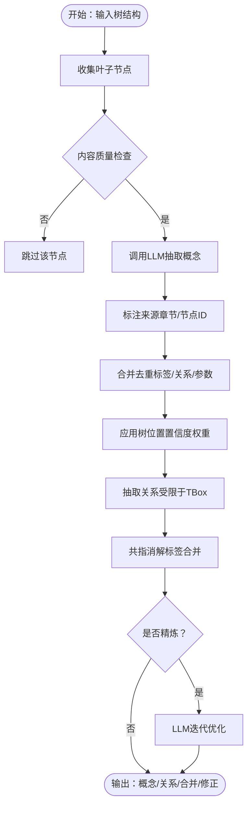

图表来源
- [concept.py:73-107](file://src/drbrain/extractor/concept.py#L73-L107)
- [concept.py:191-258](file://src/drbrain/extractor/concept.py#L191-L258)
- [concept.py:374-392](file://src/drbrain/extractor/concept.py#L374-L392)
- [concept.py:446-495](file://src/drbrain/extractor/concept.py#L446-L495)

章节来源
- [concept.py:28-52](file://src/drbrain/extractor/concept.py#L28-L52)
- [concept.py:73-107](file://src/drbrain/extractor/concept.py#L73-L107)
- [concept.py:191-258](file://src/drbrain/extractor/concept.py#L191-L258)
- [concept.py:374-392](file://src/drbrain/extractor/concept.py#L374-L392)
- [concept.py:446-495](file://src/drbrain/extractor/concept.py#L446-L495)

### 论文类型检测（detection.py）
- 启发式分类：通过关键词集合匹配标题/摘要/首段，快速识别 review、thesis、preprint、book、document 等类型。
- LLM 回退：当启发式无法确定或冲突时，使用专用提示模板请求 LLM 判定，保证高召回。

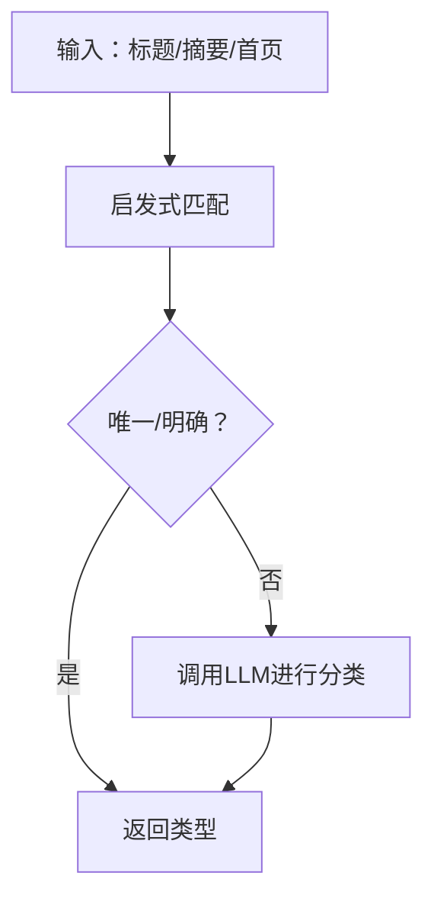

图表来源
- [detection.py:61-78](file://src/drbrain/extractor/detection.py#L61-L78)
- [detection.py:80-108](file://src/drbrain/extractor/detection.py#L80-L108)
- [detection.py:110-138](file://src/drbrain/extractor/detection.py#L110-L138)

章节来源
- [detection.py:1-138](file://src/drbrain/extractor/detection.py#L1-L138)

### LLM 客户端与回退链（llm_client.py）
- 统一接口：call_with_fallback/sync 版本与 acall_with_fallback/async 版本，支持多模型顺序尝试与 JSON 解析。
- 配置项：provider/model/api_key/base_url/温度/超时/最大令牌数等。
- 指标记录：记录每次调用的耗时与令牌用量，便于成本与性能监控。

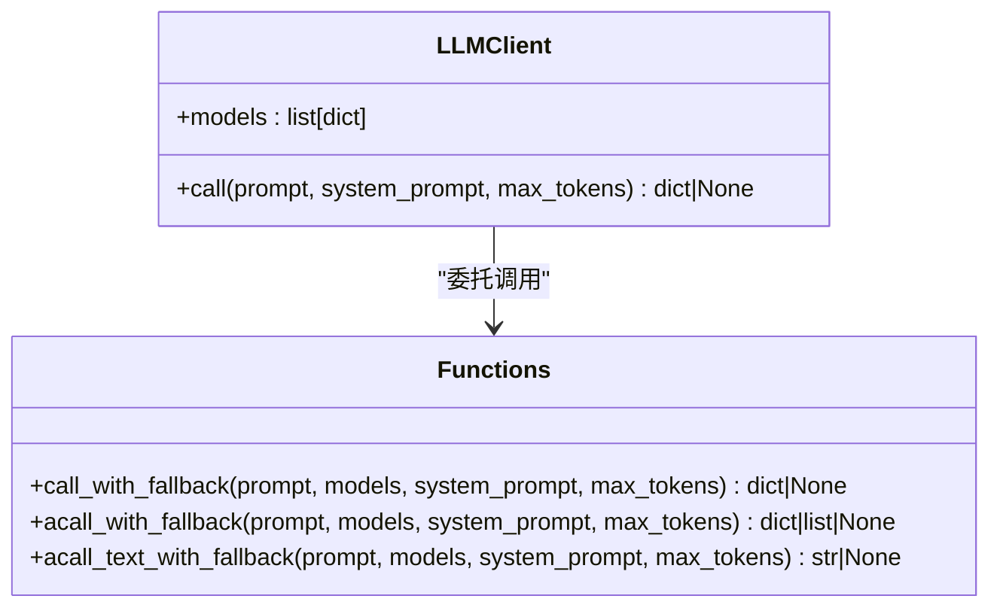

图表来源
- [llm_client.py:12-20](file://src/drbrain/extractor/llm_client.py#L12-L20)
- [llm_client.py:66-114](file://src/drbrain/extractor/llm_client.py#L66-L114)
- [llm_client.py:117-154](file://src/drbrain/extractor/llm_client.py#L117-L154)

章节来源
- [llm_client.py:1-154](file://src/drbrain/extractor/llm_client.py#L1-L154)

### 参数单元解析与校验（argument.py）
- 数据结构：ExtractedArgument 包含主张、主张类型、目标、目标类型、证据类型/详情、机制、章节、置信度。
- 解析：parse_arguments 将原始字典列表转换为对象列表。
- 校验：validate_argument/validate_arguments 对主张类型与目标类型进行合法性检查。

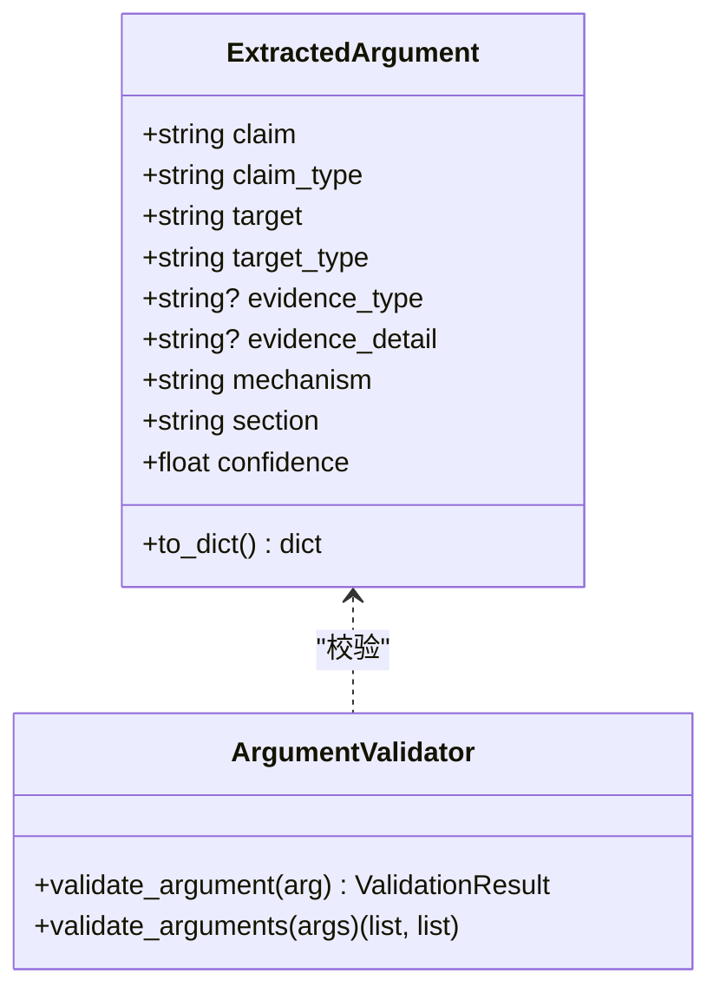

图表来源
- [argument.py:13-39](file://src/drbrain/extractor/argument.py#L13-L39)
- [argument.py:61-87](file://src/drbrain/extractor/argument.py#L61-L87)

章节来源
- [argument.py:1-87](file://src/drbrain/extractor/argument.py#L1-L87)

### 实体标准化与别名对齐（canonical.py）
- 停用词加载：从 stopwords.txt 过滤无意义词汇，支持中英文字符与连字符组合。
- 标签归一化：去除标点、过滤停用词、简单单数化、压缩空白，防止空标签。
- 别名表：AliasTable 支持注册规范标签与别名映射，自动分配递增 ID。
- 智能对齐：SmartAligner 使用 BM25 模糊检索与阈值策略（自动对齐/待仲裁），不足时提交 LLM 批仲裁，最终更新别名表。

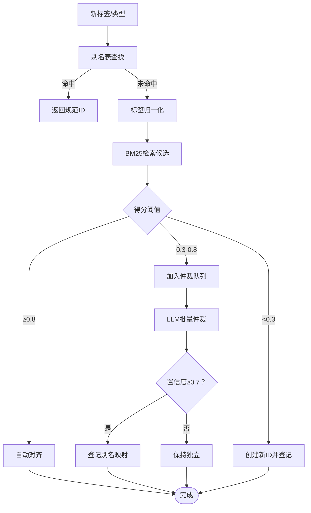

图表来源
- [canonical.py:18-37](file://src/drbrain/extractor/canonical.py#L18-L37)
- [canonical.py:52-71](file://src/drbrain/extractor/canonical.py#L52-L71)
- [canonical.py:110-252](file://src/drbrain/extractor/canonical.py#L110-L252)

章节来源
- [canonical.py:1-252](file://src/drbrain/extractor/canonical.py#L1-L252)

### 置信度传播（confidence_propagation.py）
- 单跳衰减：默认乘法衰减因子 0.85。
- 章节感知：不同章节（如 Methods/Results 与 Discussion/Related Work）具有不同衰减率，以反映证据强度差异。
- 多路径合成：使用概率“或”公式（1-∏(1-p_i)）合并独立路径的置信度。

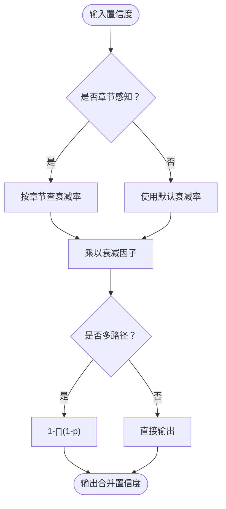

图表来源
- [confidence_propagation.py:31-64](file://src/drbrain/extractor/confidence_propagation.py#L31-L64)
- [confidence_propagation.py:67-87](file://src/drbrain/extractor/confidence_propagation.py#L67-L87)

章节来源
- [confidence_propagation.py:1-87](file://src/drbrain/extractor/confidence_propagation.py#L1-L87)

### 校验模式（validator/schema.py）
- TBox：限制每种概念类型允许的关系集合。
- RBox：定义关系的属性（如不可反身、反对称、传递性）。
- 校验流程：validate_extraction 对关系进行全量校验，返回有效/拒绝清单；enforce_transitive 自动补全传递闭包；detect_asymmetric_violations 检测反对称关系冲突。

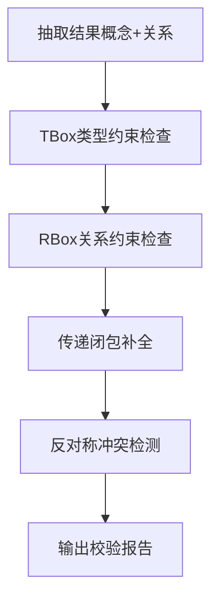

图表来源
- [schema.py:7-51](file://src/drbrain/validator/schema.py#L7-L51)
- [schema.py:97-120](file://src/drbrain/validator/schema.py#L97-L120)
- [schema.py:140-211](file://src/drbrain/validator/schema.py#L140-L211)

章节来源
- [schema.py:1-211](file://src/drbrain/validator/schema.py#L1-L211)

### 文档树解析（pageindex_parser.py）
- 树构建：从 Markdown 中提取标题节点，计算文本长度，按阈值进行节点瘦身与大节点拆分，生成带 node_id 的层次结构。
- 摘要与描述：可选生成节点摘要与文档描述，用于上下文增强。
- 树修复：移除空叶子、扁平化单子链、限制最大深度、单叶拆分等。
- 回退方案：PDF 目录回退与 LLM 分段回退，确保无结构文本也能构建树。

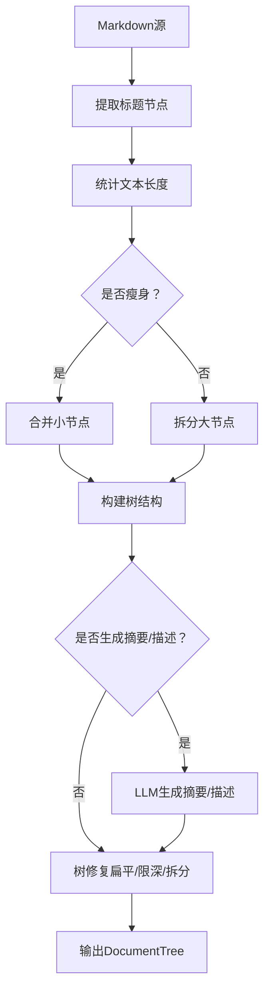

图表来源
- [pageindex_parser.py:412-486](file://src/drbrain/parser/pageindex_parser.py#L412-L486)
- [pageindex_parser.py:619-654](file://src/drbrain/parser/pageindex_parser.py#L619-L654)
- [pageindex_parser.py:657-729](file://src/drbrain/parser/pageindex_parser.py#L657-L729)
- [pageindex_parser.py:731-800](file://src/drbrain/parser/pageindex_parser.py#L731-L800)

章节来源
- [pageindex_parser.py:1-1033](file://src/drbrain/parser/pageindex_parser.py#L1-L1033)

### 提示模板与数据格式
- 实体抽取模板（entities.txt）：限定概念类型与子类，要求输出严格 JSON，包含 label/type/subcategory/confidence。
- 关系抽取模板（relations.txt）：基于 TBox 限制关系集合，要求 head/rel/tail/confidence。
- 共指消解模板（coreference.txt）：识别应合并的重复标签，输出 canonical 与 variants。

章节来源
- [entities.txt:1-19](file://prompts/entities.txt#L1-L19)
- [relations.txt:1-24](file://prompts/relations.txt#L1-L24)
- [coreference.txt:1-14](file://prompts/coreference.txt#L1-L14)

## 依赖关系分析
- 概念抽取依赖 LLM 客户端与文档树解析；参数解析依赖校验模式；标准化依赖数据库索引与 LLM 批仲裁。
- LLM 客户端被多个模块复用，提供统一的回退链与指标记录。
- 校验模式贯穿关系抽取与最终输出，确保知识图谱的一致性。

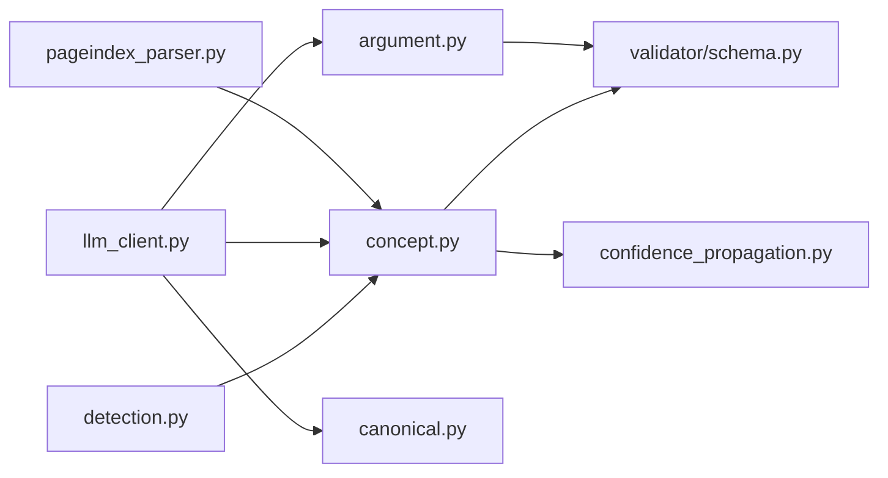

图表来源
- [concept.py:1-901](file://src/drbrain/extractor/concept.py#L1-L901)
- [detection.py:1-138](file://src/drbrain/extractor/detection.py#L1-L138)
- [llm_client.py:1-154](file://src/drbrain/extractor/llm_client.py#L1-L154)
- [argument.py:1-87](file://src/drbrain/extractor/argument.py#L1-L87)
- [canonical.py:1-252](file://src/drbrain/extractor/canonical.py#L1-L252)
- [schema.py:1-211](file://src/drbrain/validator/schema.py#L1-L211)
- [pageindex_parser.py:1-1033](file://src/drbrain/parser/pageindex_parser.py#L1-L1033)

章节来源
- [concept.py:1-901](file://src/drbrain/extractor/concept.py#L1-L901)
- [schema.py:1-211](file://src/drbrain/validator/schema.py#L1-L211)

## 性能考量
- 并发控制：树驱动抽取使用信号量限制并发，避免 LLM 资源争用。
- 内容质量门控：拒绝低质量内容，减少无效调用。
- 置信度加权：深部章节赋予更高权重，减少浅层推测影响。
- BM25 预筛：在别名对齐前进行模糊检索，降低 LLM 调用频率。
- 指标记录：LLM 调用耗时与令牌用量记录，便于成本与性能优化。

## 故障排查指南
- LLM 回退链全部失败：检查模型配置、API 密钥与网络连接；确认回退链顺序合理。
- 抽取结果为空：确认文档树解析成功、叶子节点存在且内容通过质量门控。
- 关系校验失败：检查 TBox 限制与概念类型是否一致；必要时调整提示模板。
- 置信度过低：检查章节类型权重与路径长度；考虑增加多路径证据或调整衰减因子。
- 标准化不生效：确认别名表初始化与数据库索引构建；检查 BM25 阈值设置。

章节来源
- [llm_client.py:72-89](file://src/drbrain/extractor/llm_client.py#L72-L89)
- [concept.py:322-329](file://src/drbrain/extractor/concept.py#L322-L329)
- [schema.py:63-95](file://src/drbrain/validator/schema.py#L63-L95)
- [canonical.py:129-142](file://src/drbrain/extractor/canonical.py#L129-L142)

## 结论
DrBrain 实体抽取模块通过“树驱动 + 多阶段 LLM 推理 + 标准化与校验”的组合，实现了高质量、可解释、可扩展的概念抽取与对齐。模块在准确性、鲁棒性与可维护性之间取得平衡，适合在知识图谱构建与学术分析场景中大规模应用。

## 附录

### 配置与使用要点
- 模型配置：在配置中定义 models 列表，LLM 客户端会按顺序尝试，直至成功或耗尽。
- 并发参数：通过 extract.max_concurrent 控制树驱动抽取的并发度。
- 停用词：可自定义 stopwords.txt 以适配领域语言特征。

章节来源
- [config.py:85-87](file://src/drbrain/config.py#L85-L87)
- [llm_client.py:15-17](file://src/drbrain/extractor/llm_client.py#L15-L17)
- [canonical.py:14-36](file://src/drbrain/extractor/canonical.py#L14-L36)

### 测试参考
- 树节点收集、合并去重、质量门控、跨节论证链接、TBox 校验等均有单元测试覆盖，可作为集成与调试的参考。

章节来源
- [test_concept.py:1-730](file://tests/test_concept.py#L1-L730)