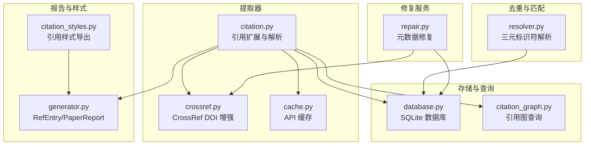
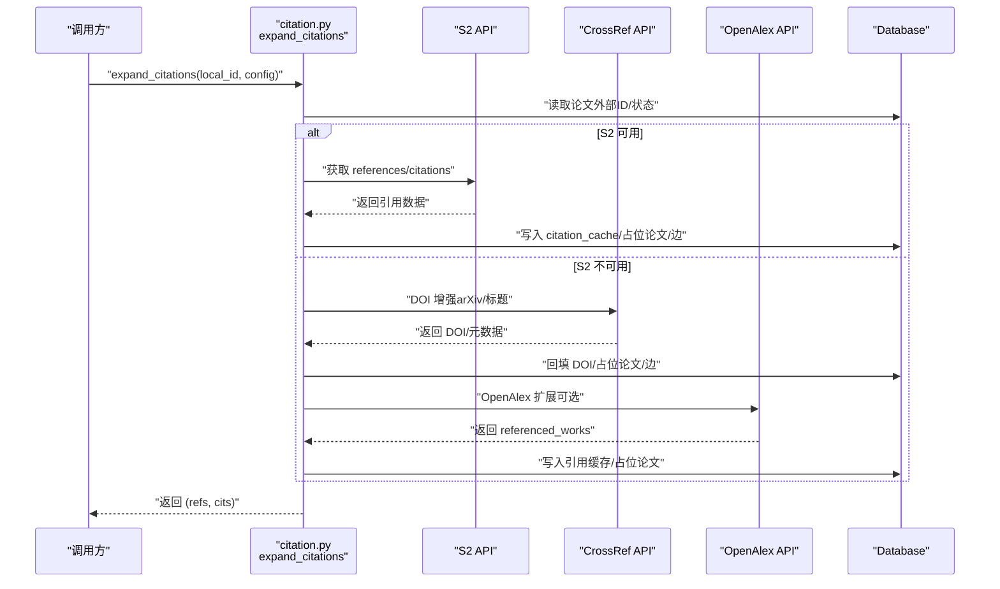
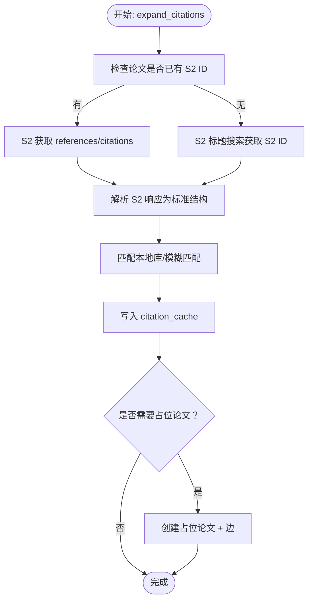
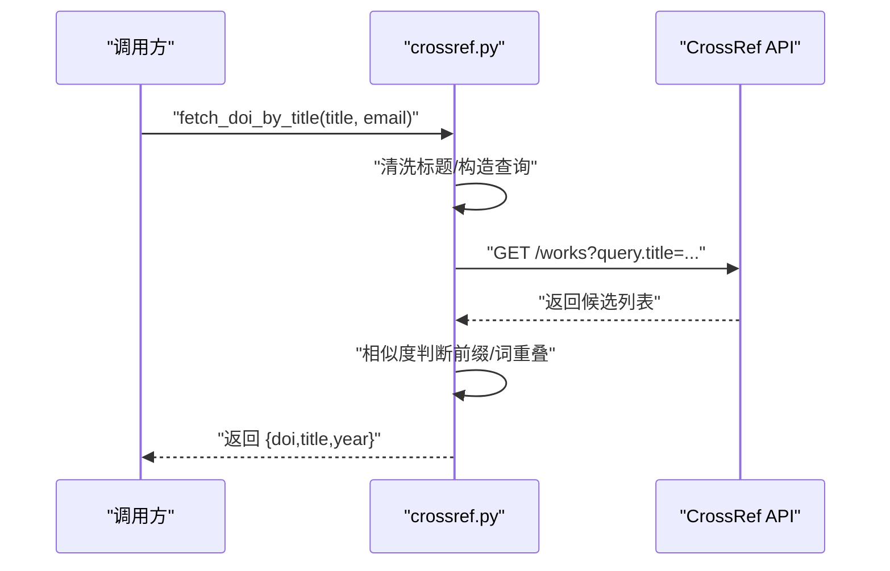
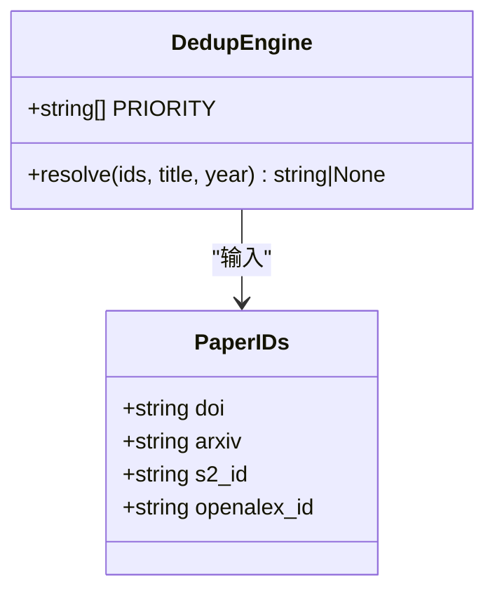
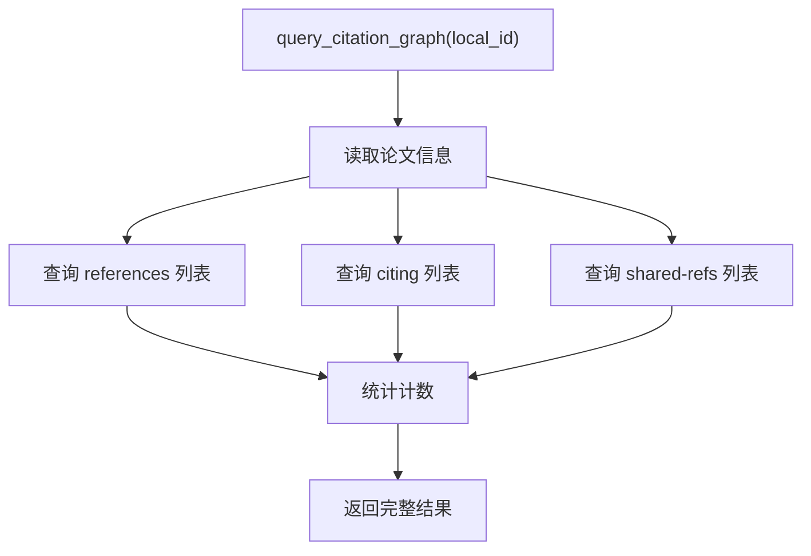
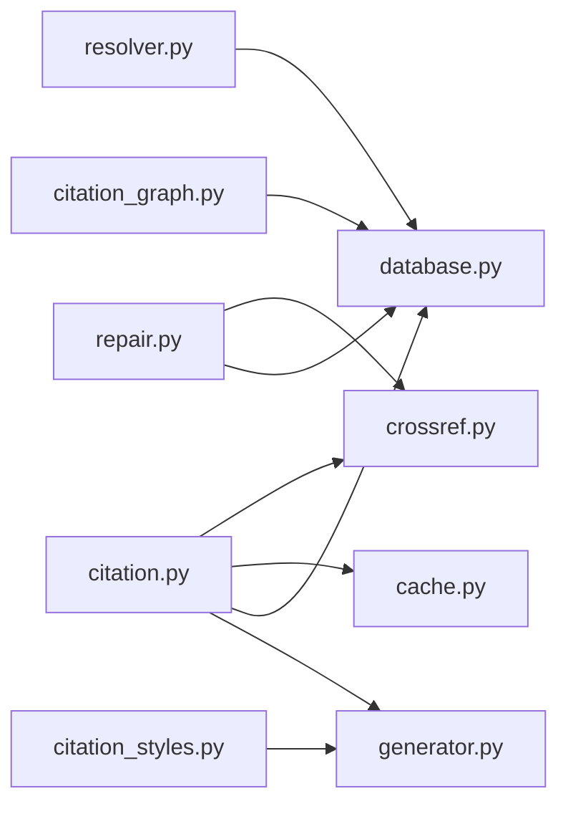

# 引用处理模块

<cite>
**本文档引用的文件**
- [citation.py](file://src/drbrain/extractor/citation.py)
- [crossref.py](file://src/drbrain/extractor/crossref.py)
- [resolver.py](file://src/drbrain/dedup/resolver.py)
- [citation_graph.py](file://src/drbrain/storage/citation_graph.py)
- [citation_styles.py](file://src/drbrain/services/citation_styles.py)
- [cache.py](file://src/drbrain/extractor/cache.py)
- [generator.py](file://src/drbrain/report/generator.py)
- [database.py](file://src/drbrain/storage/database.py)
- [repair.py](file://src/drbrain/services/repair.py)
- [test_citation.py](file://tests/test_citation.py)
- [test_citation_graph.py](file://tests/test_citation_graph.py)
</cite>

## 目录
1. [简介](#简介)
2. [项目结构](#项目结构)
3. [核心组件](#核心组件)
4. [架构总览](#架构总览)
5. [详细组件分析](#详细组件分析)
6. [依赖关系分析](#依赖关系分析)
7. [性能考虑](#性能考虑)
8. [故障排除指南](#故障排除指南)
9. [结论](#结论)
10. [附录](#附录)

## 简介
本文件面向 DrBrain 的引用处理模块，系统性阐述引用识别、解析、验证与扩展的完整流程，涵盖：
- 引用格式识别与元数据提取
- 多源 API 集成（Semantic Scholar、CrossRef、OpenAlex）
- 错误处理与缓存策略
- 引用去重与合并算法（基于三元标识符优先级与标题模糊匹配）
- 引用处理与知识图谱构建的集成方式与数据传递格式
- 引用质量评估与修复建议

目标是帮助开发者与使用者理解从输入到知识图谱的端到端流程，并提供可操作的配置与扩展指导。

## 项目结构
引用处理模块主要分布在以下子系统中：
- 提取器（extractor）：负责引用识别、解析与多源 API 扩展
- 去重引擎（dedup）：负责三元标识符解析与模糊匹配
- 存储层（storage）：提供数据库访问与引用图查询
- 报告生成（report）：输出引用条目与覆盖率统计
- 样式服务（services）：支持多种引用样式导出
- 缓存（extractor/cache.py）：文件级 TTL 缓存
- 修复服务（services/repair.py）：基于外部 API 的元数据修复

图表来源
- [citation.py:1-710](file://src/drbrain/extractor/citation.py#L1-L710)
- [crossref.py:1-180](file://src/drbrain/extractor/crossref.py#L1-L180)
- [resolver.py:1-82](file://src/drbrain/dedup/resolver.py#L1-L82)
- [citation_graph.py:1-129](file://src/drbrain/storage/citation_graph.py#L1-L129)
- [citation_styles.py:1-389](file://src/drbrain/services/citation_styles.py#L1-L389)
- [cache.py:1-65](file://src/drbrain/extractor/cache.py#L1-L65)
- [generator.py:1-110](file://src/drbrain/report/generator.py#L1-L110)
- [database.py:1-775](file://src/drbrain/storage/database.py#L1-L775)
- [repair.py:1-325](file://src/drbrain/services/repair.py#L1-L325)

章节来源
- [citation.py:1-710](file://src/drbrain/extractor/citation.py#L1-L710)
- [crossref.py:1-180](file://src/drbrain/extractor/crossref.py#L1-L180)
- [resolver.py:1-82](file://src/drbrain/dedup/resolver.py#L1-L82)
- [citation_graph.py:1-129](file://src/drbrain/storage/citation_graph.py#L1-L129)
- [citation_styles.py:1-389](file://src/drbrain/services/citation_styles.py#L1-L389)
- [cache.py:1-65](file://src/drbrain/extractor/cache.py#L1-L65)
- [generator.py:1-110](file://src/drbrain/report/generator.py#L1-L110)
- [database.py:1-775](file://src/drbrain/storage/database.py#L1-L775)
- [repair.py:1-325](file://src/drbrain/services/repair.py#L1-L325)

## 核心组件
- 引用扩展与解析：从 S2、OpenAlex、CrossRef 获取参考文献与被引文献，标准化为 RefEntry 并写入 citation_cache 与占位论文。
- CrossRef 增强：通过 arXiv 或标题搜索补全 DOI，作为 S2 不可用时的降级路径。
- 去重与合并：以 DOI > arXiv > S2 > OpenAlex > 标题+年份的优先级解析重复项；标题模糊匹配采用词干化与短哈希。
- 引用图查询：共享参考、共引计数、引用网络快照等分析。
- 样式导出：内置 APA、Vancouver、Chicago Author-Date、MLA，支持自定义样式动态加载。
- 元数据修复：基于 CrossRef、arXiv、标题+年份的多源修复，支持干运行与批量应用。

章节来源
- [citation.py:231-710](file://src/drbrain/extractor/citation.py#L231-L710)
- [crossref.py:49-180](file://src/drbrain/extractor/crossref.py#L49-L180)
- [resolver.py:50-82](file://src/drbrain/dedup/resolver.py#L50-L82)
- [citation_graph.py:8-129](file://src/drbrain/storage/citation_graph.py#L8-L129)
- [citation_styles.py:214-389](file://src/drbrain/services/citation_styles.py#L214-L389)
- [repair.py:265-325](file://src/drbrain/services/repair.py#L265-L325)

## 架构总览
引用处理在 DrBrain 中承担“从外部数据源到本地知识图谱”的桥梁角色。其关键流程如下：
- 输入：本地论文 ID（或外部 ID）与配置（API 密钥、速率限制、缓存 TTL）
- 处理：优先使用 S2，失败时降级至 CrossRef（DOI/标题/arXiv），再降级至 OpenAlex
- 输出：标准化引用条目（RefEntry）、占位论文、边关系（cites/cited_by），以及引用图统计

图表来源
- [citation.py:231-288](file://src/drbrain/extractor/citation.py#L231-L288)
- [crossref.py:107-180](file://src/drbrain/extractor/crossref.py#L107-L180)
- [database.py:132-150](file://src/drbrain/storage/database.py#L132-L150)

## 详细组件分析

### 组件 A：引用扩展与解析（citation.py）
职责与流程
- 从 S2 拉取 references/citations，解析为统一结构，匹配本地库，未命中则创建占位论文并插入边
- 若 S2 返回数据但缺少 DOI，则触发 CrossRef DOI 增强
- 若 S2 完全不可用，尝试 OpenAlex 批量获取 referenced_works
- 支持多源扩展（OpenAlex + S2 + CrossRef），并进行标题前缀去重

关键函数与行为
- S2 搜索与获取：带指数退避与 429 重试
- CrossRef DOI 增强：标题匹配与 arXiv 容器标题过滤
- OpenAlex 扩展：按 referenced_works 批量获取并回填
- 引用缓存：写入 citation_cache，避免重复抓取

图表来源
- [citation.py:231-399](file://src/drbrain/extractor/citation.py#L231-L399)
- [citation.py:402-423](file://src/drbrain/extractor/citation.py#L402-L423)
- [citation.py:440-517](file://src/drbrain/extractor/citation.py#L440-L517)

章节来源
- [citation.py:37-148](file://src/drbrain/extractor/citation.py#L37-L148)
- [citation.py:149-229](file://src/drbrain/extractor/citation.py#L149-L229)
- [citation.py:231-288](file://src/drbrain/extractor/citation.py#L231-L288)
- [citation.py:290-399](file://src/drbrain/extractor/citation.py#L290-L399)
- [citation.py:402-423](file://src/drbrain/extractor/citation.py#L402-L423)
- [citation.py:440-517](file://src/drbrain/extractor/citation.py#L440-L517)
- [citation.py:536-710](file://src/drbrain/extractor/citation.py#L536-L710)

### 组件 B：CrossRef API 集成（crossref.py）
职责与流程
- 提供会话级重试与退避，适配学术 API 的 429/5xx 场景
- 标题清洗与相似度判断（精确匹配、前缀匹配、词重叠阈值）
- DOI 解析、arXiv 查询（容器标题过滤与期刊筛选）

图表来源
- [crossref.py:49-85](file://src/drbrain/extractor/crossref.py#L49-L85)
- [crossref.py:136-180](file://src/drbrain/extractor/crossref.py#L136-L180)

章节来源
- [crossref.py:17-39](file://src/drbrain/extractor/crossref.py#L17-L39)
- [crossref.py:49-85](file://src/drbrain/extractor/crossref.py#L49-L85)
- [crossref.py:87-105](file://src/drbrain/extractor/crossref.py#L87-L105)
- [crossref.py:107-134](file://src/drbrain/extractor/crossref.py#L107-L134)
- [crossref.py:136-180](file://src/drbrain/extractor/crossref.py#L136-L180)

### 组件 C：去重与合并（resolver.py）
职责与流程
- 三元标识符优先级解析：DOI > arXiv > S2 > OpenAlex
- 标题模糊匹配：小词去除、标点清理、词干化、MD5 短哈希
- 返回已存在本地 ID 或 None

图表来源
- [resolver.py:10-18](file://src/drbrain/dedup/resolver.py#L10-L18)
- [resolver.py:50-82](file://src/drbrain/dedup/resolver.py#L50-L82)

章节来源
- [resolver.py:20-48](file://src/drbrain/dedup/resolver.py#L20-L48)
- [resolver.py:50-82](file://src/drbrain/dedup/resolver.py#L50-L82)

### 组件 D：引用图查询（citation_graph.py）
职责与流程
- 共享参考分析：找出与某论文共享参考但无直接引用关系的论文
- 引文计数：统计 references 与 citing 数量
- 结构化查询：返回 paper、refs、citing、shared_refs 与 counts

图表来源
- [citation_graph.py:74-129](file://src/drbrain/storage/citation_graph.py#L74-L129)

章节来源
- [citation_graph.py:8-57](file://src/drbrain/storage/citation_graph.py#L8-L57)
- [citation_graph.py:59-72](file://src/drbrain/storage/citation_graph.py#L59-L72)
- [citation_graph.py:74-129](file://src/drbrain/storage/citation_graph.py#L74-L129)

### 组件 E：引用样式导出（citation_styles.py）
职责与流程
- 内置样式：APA、Vancouver、Chicago Author-Date、MLA
- 自定义样式：动态加载 data/citation_styles 下的 .py 文件，要求定义 format_ref(meta, idx)
- 列表/编号样式区分：Vancouver 使用编号列表

章节来源
- [citation_styles.py:32-212](file://src/drbrain/services/citation_styles.py#L32-L212)
- [citation_styles.py:234-389](file://src/drbrain/services/citation_styles.py#L234-L389)

### 组件 F：缓存策略（cache.py）
职责与流程
- 文件级 JSON 缓存，键为 MD5 哈希映射到文件名
- TTL 过期控制，过期即视为无效
- 支持 get/set/delete/clear

章节来源
- [cache.py:14-65](file://src/drbrain/extractor/cache.py#L14-L65)

### 组件 G：报告与数据模型（generator.py）
职责与流程
- RefEntry：引用条目的标准化结构（title/year/ids/in_graph/local_id）
- PaperReport：单篇论文的完整报告，含 references/citations/summary/boundary_alert/validation
- to_dict/save：序列化与持久化

章节来源
- [generator.py:10-110](file://src/drbrain/report/generator.py#L10-L110)

### 组件 H：数据库接口（database.py）
职责与流程
- Schema：papers、paper_ids、edges、concepts、arguments、aliases、embeddings、tree_vectors、tree_summaries、vector_metadata、confidence_queue、research_seeds、citation_cache、build_stages、schema_versions
- 引用相关：get_paper_by_external_id、fuzzy_match_title_year、insert_paper/insert_paper_ids、引用缓存写入
- 引用图查询：find_shared_refs、get_citation_counts、query_citation_graph

章节来源
- [database.py:10-156](file://src/drbrain/storage/database.py#L10-L156)
- [database.py:132-141](file://src/drbrain/storage/database.py#L132-L141)
- [database.py:261-277](file://src/drbrain/storage/database.py#L261-L277)
- [database.py:448-478](file://src/drbrain/storage/database.py#L448-L478)

### 组件 I：元数据修复（repair.py）
职责与流程
- 多源修复：CrossRef（DOI/作者/期刊/摘要/引用计数）、arXiv（标题/年份）、标题+年份（DOI）
- 干运行模式：仅返回修复建议，不修改数据库
- 应用修复：按字段更新 papers/paper_ids

章节来源
- [repair.py:9-13](file://src/drbrain/services/repair.py#L9-L13)
- [repair.py:16-55](file://src/drbrain/services/repair.py#L16-L55)
- [repair.py:265-325](file://src/drbrain/services/repair.py#L265-L325)

## 依赖关系分析
- 模块耦合
  - citation.py 依赖 crossref.py、cache.py、database.py、report/generator.py
  - resolver.py 依赖 database 接口（get_paper_by_external_id、fuzzy_match_title_year）
  - citation_graph.py 依赖 database（直接 SQL 查询）
  - citation_styles.py 依赖 generator.py（RefEntry）
  - repair.py 依赖 crossref.py、database、parser（arXiv 解析）
- 外部依赖
  - S2 API、CrossRef API、OpenAlex API
  - requests、sqlite3、loguru

图表来源
- [citation.py:12-14](file://src/drbrain/extractor/citation.py#L12-L14)
- [resolver.py:55-57](file://src/drbrain/dedup/resolver.py#L55-L57)
- [citation_graph.py:1-7](file://src/drbrain/storage/citation_graph.py#L1-L7)
- [citation_styles.py:22-27](file://src/drbrain/services/citation_styles.py#L22-L27)
- [repair.py:1-8](file://src/drbrain/services/repair.py#L1-L8)

章节来源
- [citation.py:1-35](file://src/drbrain/extractor/citation.py#L1-L35)
- [resolver.py:1-82](file://src/drbrain/dedup/resolver.py#L1-L82)
- [citation_graph.py:1-129](file://src/drbrain/storage/citation_graph.py#L1-L129)
- [citation_styles.py:1-389](file://src/drbrain/services/citation_styles.py#L1-L389)
- [repair.py:1-325](file://src/drbrain/services/repair.py#L1-L325)

## 性能考虑
- API 速率限制
  - S2：通过 rate_limit 计算延迟，避免 429
  - CrossRef：会话级重试与退避，自动处理 429/5xx
- 缓存
  - ApiCache：文件级 TTL 缓存，减少重复请求
  - 建议：合理设置 cache_ttl，避免频繁刷新
- 批量与去重
  - 多源扩展使用标题前缀去重（前 N 个词），降低重复抓取
  - 引用缓存：INSERT OR IGNORE，避免重复写入
- 数据库写入
  - 批量插入占位论文与边，减少事务开销

章节来源
- [citation.py:312-314](file://src/drbrain/extractor/citation.py#L312-L314)
- [crossref.py:17-29](file://src/drbrain/extractor/crossref.py#L17-L29)
- [cache.py:21-25](file://src/drbrain/extractor/cache.py#L21-L25)
- [citation.py:561-563](file://src/drbrain/extractor/citation.py#L561-L563)
- [citation.py:339-356](file://src/drbrain/extractor/citation.py#L339-L356)

## 故障排除指南
常见问题与定位
- S2 429/超时
  - 表现：返回空结果或警告日志
  - 处理：调整 s2_rate_limit；启用缓存；必要时降级至 CrossRef/OpenAlex
- CrossRef 无结果
  - 表现：标题相似度不足或 arXiv 不匹配
  - 处理：检查标题清洗逻辑；尝试 arXiv 容器标题过滤；确认 email 参数
- OpenAlex 无 referenced_works
  - 表现：返回工作但缺少引用列表
  - 处理：通过 DOI 再次拉取完整工作信息
- 引用重复
  - 表现：共享参考数量高但无直接引用
  - 处理：使用 shared-refs 分析，识别知识前沿信号
- 引用样式导出异常
  - 表现：自定义样式未找到或缺少 format_ref
  - 处理：检查 data/citation_styles 下文件命名与内容

章节来源
- [citation.py:93-116](file://src/drbrain/extractor/citation.py#L93-L116)
- [crossref.py:87-105](file://src/drbrain/extractor/crossref.py#L87-L105)
- [citation.py:465-470](file://src/drbrain/extractor/citation.py#L465-L470)
- [citation_graph.py:8-57](file://src/drbrain/storage/citation_graph.py#L8-L57)
- [citation_styles.py:286-325](file://src/drbrain/services/citation_styles.py#L286-L325)

## 结论
DrBrain 的引用处理模块通过多源 API 集成、严格的去重与合并策略、完善的缓存与错误处理机制，实现了从外部数据到本地知识图谱的稳健转换。配合引用图查询与样式导出，用户可以高效地发现知识前沿、验证引用并生成符合规范的参考文献列表。建议在生产环境中合理配置 API 密钥、速率限制与缓存 TTL，并结合元数据修复服务持续提升引用质量。

## 附录

### 配置与使用示例（路径指引）
- 配置 API 密钥与速率限制
  - 参考路径：[citation.py:312-314](file://src/drbrain/extractor/citation.py#L312-L314)，[citation.py:237-238](file://src/drbrain/extractor/citation.py#L237-L238)
- 启用缓存
  - 参考路径：[cache.py:21-25](file://src/drbrain/extractor/cache.py#L21-L25)，[citation.py:25-34](file://src/drbrain/extractor/citation.py#L25-L34)
- 自定义引用样式
  - 参考路径：[citation_styles.py:234-325](file://src/drbrain/services/citation_styles.py#L234-L325)，[citation_styles.py:328-365](file://src/drbrain/services/citation_styles.py#L328-L365)
- 引用质量修复
  - 参考路径：[repair.py:265-325](file://src/drbrain/services/repair.py#L265-L325)

### 测试用例参考（路径指引）
- 引用扩展与匹配
  - 参考路径：[test_citation.py:16-188](file://tests/test_citation.py#L16-L188)
- 引用图查询
  - 参考路径：[test_citation_graph.py:12-143](file://tests/test_citation_graph.py#L12-L143)